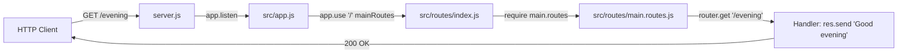

# Technical Specification

# 0. Agent Action Plan

## 0.1 Intent Clarification

### 0.1.1 Core Feature Objective

Based on the prompt, the Blitzy platform understands that the new feature requirement is to:

- **Integrate Express.js into an existing Node.js tutorial server** — The user describes a Node.js server that currently hosts a single endpoint returning `"Hello world"`. The requirement is to bring Express.js into the project as the HTTP framework, replacing or augmenting the existing plain HTTP server setup with Express.js's application factory, Router, and middleware pipeline.
- **Add a new HTTP GET endpoint that returns `"Good evening"`** — A second route must be registered alongside the existing root endpoint. This new endpoint should respond to `GET /evening` with the exact plain-text body `"Good evening"` and a `200 OK` status code.

Implicit requirements detected from these stated goals:

- The existing `GET /` endpoint returning `"Hello, World!\n"` must remain fully operational and unchanged — backward compatibility is mandatory.
- Express.js must be declared as a runtime dependency in `package.json` and installed via `npm install`.
- The new `/evening` route must follow the same architectural conventions as the existing root route (same Router module, same factory pattern, same test harness).
- All existing test suites (unit, integration, and lifecycle) must continue to pass after the feature addition.
- Documentation (`README.md`) must be updated to reflect the new endpoint's existence, request/response contract, and usage examples.

### 0.1.2 Special Instructions and Constraints

- **Maintain backward compatibility**: The existing `GET /` endpoint must continue to return `"Hello, World!\n"` (including the trailing newline) with `Content-Type: text/html; charset=utf-8` and status `200`.
- **Follow existing repository conventions**: The project employs a Factory Pattern (`src/app.js`), a Barrel Pattern (`src/routes/index.js`), and the Twelve-Factor App methodology for configuration (`src/config/index.js`). All additions must adhere to these established patterns.
- **CommonJS module system**: Per Constraint C-003 documented in the existing specification, all modules must use `require()` / `module.exports` — no ESM (`import`/`export`) syntax is permitted.
- **Strict mode compliance**: All new or modified JavaScript files should include `'use strict';` where the project convention dictates.
- **Test infrastructure preservation**: Jest 30.2.0 with Supertest 7.1.4 is the test stack. New tests must integrate into the existing `tests/` directory structure (unit, integration, lifecycle) and the discovery pattern `**/tests/**/*.test.js`.
- **No user-provided examples or special directives beyond the stated requirements were given.**

### 0.1.3 Technical Interpretation

These feature requirements translate to the following technical implementation strategy:

- To **integrate Express.js**, we will confirm that `express` is declared as a runtime dependency in `package.json` (version `^5.1.0`), verify it is properly required in `src/app.js` via `const express = require('express')`, and ensure the application factory pattern (`const app = express(); module.exports = app;`) is in place.
- To **add the `/evening` endpoint**, we will register a new `GET /evening` route handler in `src/routes/main.routes.js` using the Express Router API (`router.get('/evening', (req, res) => { res.send('Good evening'); })`), ensuring it is mounted after the root `/` route in the router stack.
- To **ensure end-to-end integration**, we will verify that `src/routes/index.js` (barrel) exports the router containing the new route, that `src/app.js` mounts it at the root path, and that `server.js` binds the application to the configured host and port.
- To **validate correctness**, we will confirm that integration tests in `tests/integration/endpoints.test.js` cover the new `GET /evening` endpoint (status code, response body, Content-Type header), that unit tests in `tests/unit/routes.test.js` verify route handler registration and ordering, and that lifecycle tests remain passing.
- To **update documentation**, we will ensure `README.md` includes the new endpoint's API reference, curl examples, and project structure entries.

## 0.2 Repository Scope Discovery

### 0.2.1 Comprehensive File Analysis

The full repository tree and every file's role in this feature addition have been exhaustively identified. The project follows a modular Express.js architecture rooted in a `src/` source directory, a `tests/` verification directory, and root-level configuration and entry files.

**Existing Files Requiring Modification:**

| File Path | Current Purpose | Required Modification |
|---|---|---|
| `src/routes/main.routes.js` | Defines Express Router with `GET /` handler | Add `GET /evening` route handler returning `"Good evening"` |
| `src/routes/index.js` | Barrel module exporting `{ mainRoutes }` | No structural change needed — new route is part of the same Router instance |
| `src/app.js` | Express application factory mounting `mainRoutes` at `/` | No change needed — existing `app.use('/', mainRoutes)` automatically serves new route |
| `server.js` | Entry point binding Express app to host/port | No change needed — delegates to `src/app.js` |
| `src/config/index.js` | Exports `{ host, port, env }` from `process.env` | No change needed |
| `package.json` | npm manifest with `express` dependency | Confirm `express: "^5.1.0"` is present in `dependencies` |
| `package-lock.json` | Deterministic dependency tree | Regenerated on `npm install` if `express` added |
| `README.md` | Project documentation with API reference | Add `GET /evening` endpoint documentation, curl examples, and structure update |
| `jest.config.js` | Jest test framework configuration | No change needed — coverage collection and discovery patterns already encompass new code |
| `.gitignore` | Repository ignore patterns | No change needed |

**Existing Test Files Requiring Updates:**

| Test File Path | Current Coverage | Required Update |
|---|---|---|
| `tests/integration/endpoints.test.js` | Covers `GET /` and error handling | Add `GET /evening` test block verifying 200 status, `"Good evening"` body, Content-Type header, and query parameter edge cases |
| `tests/unit/routes.test.js` | Verifies router export, 2 route handlers, GET methods, path ordering | Update assertions: route count from 1 to 2, verify `/evening` path presence, confirm `/` precedes `/evening` in stack |
| `tests/unit/config.test.js` | Validates config defaults, overrides, edge cases | No change needed |
| `tests/lifecycle/server.test.js` | Validates server binding, logging, shutdown, EADDRINUSE | No change needed |

**Integration Point Discovery:**

- **API endpoint connection**: The new `GET /evening` route is registered on the same Express Router instance in `src/routes/main.routes.js` that serves `GET /`. The router is aggregated via `src/routes/index.js` and mounted at `'/'` in `src/app.js`.
- **No database models/migrations affected**: The application has no database layer — all responses are static string literals.
- **No middleware/interceptors impacted**: The Express app uses no custom middleware; the default Express pipeline handles Content-Type, status codes, and 404 responses.
- **Service classes**: No service layer exists — route handlers directly invoke `res.send()`.

### 0.2.2 Web Search Research Conducted

Given the straightforward nature of this feature (adding a static GET endpoint to an Express.js 5 application), no external research was necessary. The implementation follows well-established Express.js Router patterns already present in the repository:

- **Express.js Router API** — `router.get(path, handler)` is the standard pattern, already in use for `GET /` in `src/routes/main.routes.js`.
- **Express.js 5.x compatibility** — The project already uses Express 5.1.0 with its Router API; adding a new `router.get()` call requires no additional libraries or migration steps.
- **Supertest integration testing** — The `tests/integration/endpoints.test.js` already demonstrates the `request(app).get(path)` pattern for testing endpoints.

### 0.2.3 New File Requirements

This feature addition does **not** require creating any new source files. The existing modular architecture is designed to accommodate additional routes within the established `src/routes/main.routes.js` Router module. Specifically:

- **No new source files**: The `/evening` route handler is added to the existing `src/routes/main.routes.js` router, following the project's convention of co-locating related route handlers.
- **No new test files**: The existing test suites (`tests/integration/endpoints.test.js`, `tests/unit/routes.test.js`) are expanded with additional test cases for the new endpoint, preserving the established test directory structure.
- **No new configuration files**: The feature requires no new environment variables, configuration keys, or settings files.
- **No new documentation files**: The `README.md` at the project root is the single documentation surface and is updated in-place.

## 0.3 Dependency Inventory

### 0.3.1 Private and Public Packages

All packages relevant to this feature addition are public npm packages. No private registries or internal packages are involved.

| Registry | Package Name | Version | Type | Purpose |
|---|---|---|---|---|
| npmjs.org | `express` | `^5.1.0` (resolved: `5.1.0`) | Runtime (`dependencies`) | Core HTTP framework providing application factory, Router, middleware pipeline, and response serialization for both `GET /` and `GET /evening` endpoints |
| npmjs.org | `jest` | `^30.2.0` (resolved: `30.2.0`) | Development (`devDependencies`) | JavaScript test framework for unit, integration, and lifecycle test suites |
| npmjs.org | `supertest` | `^7.1.4` (resolved: `7.1.4`) | Development (`devDependencies`) | HTTP assertion library enabling port-free endpoint testing against the Express app factory export |

These versions are sourced directly from `package.json` (lines 15–21) and verified against `package-lock.json` resolved entries. No version changes are required for this feature addition — the existing Express.js 5.1.0 Router API fully supports adding new `GET` route handlers without any dependency upgrades.

### 0.3.2 Dependency Updates

**Import Updates**

No import changes are required across the codebase. The feature addition is confined to:

- `src/routes/main.routes.js` — Already imports `express` via `const express = require('express')` and creates a Router via `express.Router()`. The new `router.get('/evening', ...)` call uses the same `router` instance without additional imports.
- `tests/integration/endpoints.test.js` — Already imports `supertest` and `src/app`. New test cases use the existing `get(path)` helper function with no new imports.
- `tests/unit/routes.test.js` — Already imports `src/routes/main.routes`. New assertions reference the same `mainRoutes` variable with no new imports.

**External Reference Updates**

| File Pattern | Update Required | Detail |
|---|---|---|
| `package.json` | Confirm only | Verify `express: "^5.1.0"` exists in `dependencies` — no version change |
| `package-lock.json` | Regenerate if needed | Run `npm install` to ensure lockfile reflects installed dependency tree |
| `README.md` | Content update | Add `/evening` endpoint to API Reference section, project structure table, and health check examples |
| `jest.config.js` | No change | Coverage collection pattern `src/**/*.js` already captures route file changes |
| `.github/workflows/*` | Not applicable | No CI/CD workflow files exist in the repository |

## 0.4 Integration Analysis

### 0.4.1 Existing Code Touchpoints

**Direct Modifications Required:**

- **`src/routes/main.routes.js`** (lines 37–39): Add a new `GET /evening` route handler immediately after the existing `GET /` handler. The new handler invokes `res.send('Good evening')` with no trailing newline, matching the established `router.get(path, handler)` pattern. This is the only source file that requires a code addition.

- **`README.md`** (API Reference section, approximately lines 97–115): Insert a new `### GET /evening` subsection documenting the endpoint's request/response contract, curl example, status code (`200 OK`), Content-Type (`text/html; charset=utf-8`), and body (`Good evening`). Update the project structure table and health check section to include the new endpoint.

- **`tests/integration/endpoints.test.js`** (after line 61): Add a `describe('GET /evening', ...)` block containing tests for status code 200, response body `"Good evening"`, Content-Type header validation, and query parameter edge cases on the `/evening` path.

- **`tests/unit/routes.test.js`** (lines 51–59): Update the route handler count assertion from 1 to 2 and add verification that the `/evening` path is registered in the router stack. Confirm route ordering: `/` is defined before `/evening`.

**Dependency Injections:**

No dependency injection changes are required. The Express application factory in `src/app.js` already mounts the main router via:

```js
app.use('/', mainRoutes);
```

The barrel module `src/routes/index.js` re-exports the router from `main.routes.js` without modification. Since the new `/evening` route is added to the same Router instance, it is automatically included in the mounted routes — no additional wiring is needed.

**Request Flow for the New Endpoint:**


```mermaid
graph LR
    A[HTTP Client] -->|GET /evening| B[server.js]
    B -->|app.listen| C[src/app.js]
    C -->|app.use '/' mainRoutes| D[src/routes/index.js]
    D -->|require main.routes| E[src/routes/main.routes.js]
    E -->|router.get '/evening'| F[Handler: res.send 'Good evening']
    F -->|200 OK| A
```

**Database/Schema Updates:**

- No database layer exists in this project. All endpoint responses are static string literals embedded directly in route handler functions. No migrations, schema files, or data models are affected.

## 0.5 Technical Implementation

### 0.5.1 File-by-File Execution Plan

Every file listed below must be created or modified to fully implement the feature.

**Group 1 — Core Feature Files (Express.js Integration + New Endpoint):**

| Action | File | Purpose |
|---|---|---|
| CONFIRM | `package.json` | Verify `express: "^5.1.0"` in `dependencies` block; run `npm install` if not present |
| CONFIRM | `src/app.js` | Verify Express application factory creates app via `express()` and mounts routes via `app.use('/', mainRoutes)` |
| MODIFY | `src/routes/main.routes.js` | Add `router.get('/evening', (req, res) => { res.send('Good evening'); })` after the existing `GET /` handler |
| CONFIRM | `src/routes/index.js` | Verify barrel exports `{ mainRoutes }` — no change needed as the new route is on the same Router instance |
| CONFIRM | `src/config/index.js` | Verify configuration module exports `{ host, port, env }` — no change needed |
| CONFIRM | `server.js` | Verify entry point binds app to configured host/port — no change needed |

**Group 2 — Test Infrastructure:**

| Action | File | Purpose |
|---|---|---|
| MODIFY | `tests/integration/endpoints.test.js` | Add `GET /evening` test block: 200 status, `"Good evening"` body, Content-Type header, query parameter edge cases, and unsupported method (PUT/DELETE) 404 verification |
| MODIFY | `tests/unit/routes.test.js` | Update route count assertion to 2; add `/evening` path verification; confirm route ordering (`/` before `/evening`) |
| CONFIRM | `tests/unit/config.test.js` | No changes — configuration is not affected by the new endpoint |
| CONFIRM | `tests/lifecycle/server.test.js` | No changes — server lifecycle (binding, logging, shutdown) is unaffected |
| CONFIRM | `jest.config.js` | No changes — test discovery pattern `**/tests/**/*.test.js` and coverage collection `src/**/*.js` already encompass all relevant files |

**Group 3 — Documentation:**

| Action | File | Purpose |
|---|---|---|
| MODIFY | `README.md` | Add `GET /evening` API reference section with curl examples, response contract, project structure entry, and health check command |

### 0.5.2 Implementation Approach per File

**Step 1 — Establish Express.js Foundation:**

Confirm that `package.json` declares `express` as a runtime dependency and that `npm install` resolves it. Verify the application factory in `src/app.js` creates a configured Express instance and mounts the route barrel. This ensures the HTTP framework is fully operational before adding the new endpoint.

**Step 2 — Add the `/evening` Route Handler:**

In `src/routes/main.routes.js`, register the new route on the existing Router instance immediately after the `GET /` handler. The handler function follows the identical `(req, res) => { res.send('...'); }` pattern:

```js
router.get('/evening', (req, res) => {
  res.send('Good evening');
});
```

The response body is `"Good evening"` with no trailing newline (distinct from the root endpoint's `"Hello, World!\n"`). JSDoc annotations must document the route contract (`@route GET /evening`, `@returns {string} 'Good evening'`).

**Step 3 — Validate Integration Through Tests:**

Expand `tests/integration/endpoints.test.js` with a `describe('GET /evening', ...)` block that asserts: status code 200, exact body match `"Good evening"`, Content-Type header containing `text/html` and `charset=utf-8`, and resilience to query parameters. Expand `tests/unit/routes.test.js` to verify the new route's presence, HTTP method (`GET`), handler function type, and stack ordering relative to `/`.

**Step 4 — Update Documentation:**

Add a complete `### GET /evening` subsection to `README.md` under the API Reference heading, mirroring the structure of the existing `### GET /` documentation: request curl example, response status, Content-Type, body description, and usage example.

## 0.6 Scope Boundaries

### 0.6.1 Exhaustively In Scope

**Core Source Files:**

| File Pattern | Specific Files | Scope Detail |
|---|---|---|
| `src/routes/main.routes.js` | Primary modification target | Add `GET /evening` handler after existing `GET /` handler |
| `src/routes/index.js` | Confirm barrel export | Verify `{ mainRoutes }` export shape unchanged |
| `src/app.js` | Confirm integration | Verify `app.use('/', mainRoutes)` mounts updated router |
| `server.js` | Confirm entry point | Verify `app.listen(config.port, config.host, ...)` binds correctly |
| `src/config/index.js` | Confirm configuration | Verify `{ host, port, env }` exports with defaults |

**Dependency and Configuration Files:**

| File Pattern | Specific Files | Scope Detail |
|---|---|---|
| `package.json` | Root manifest | Confirm `express: "^5.1.0"` in `dependencies` |
| `package-lock.json` | Lockfile | Regenerate via `npm install` if dependency added |
| `jest.config.js` | Test configuration | Confirm coverage and discovery patterns include new code |
| `.gitignore` | Repository hygiene | Confirm `node_modules/`, `coverage/`, `.env` patterns present |

**Test Files:**

| File Pattern | Specific Files | Scope Detail |
|---|---|---|
| `tests/integration/endpoints.test.js` | Integration suite | Add `GET /evening` test block and edge cases |
| `tests/unit/routes.test.js` | Unit route tests | Update route count, path, and ordering assertions |
| `tests/unit/config.test.js` | Unit config tests | Confirm passing — no modification needed |
| `tests/lifecycle/server.test.js` | Lifecycle tests | Confirm passing — no modification needed |

**Documentation:**

| File Pattern | Specific Files | Scope Detail |
|---|---|---|
| `README.md` | Project documentation | Add `/evening` API reference, curl examples, structure table update |

### 0.6.2 Explicitly Out of Scope

- **Unrelated features or modules** — No new features beyond the `GET /evening` endpoint are to be implemented.
- **Middleware additions** — No custom Express middleware (logging, CORS, body parsing, authentication) is introduced. The project relies on Express.js default behavior.
- **Database or persistence layer** — No database, ORM, or data storage is involved. All responses remain static string literals.
- **TypeScript conversion** — The codebase remains pure JavaScript with CommonJS modules per Constraint C-003.
- **ESM migration** — No `import`/`export` syntax introduction; `require()`/`module.exports` is preserved throughout.
- **Performance optimizations** — No caching, compression, or response optimization beyond Express defaults.
- **CI/CD pipeline creation** — No `.github/workflows/` or other CI configuration files are created or modified.
- **Docker containerization** — No `Dockerfile`, `docker-compose.yml`, or container-related files are in scope.
- **Additional endpoints beyond `/evening`** — Only the explicitly requested `GET /evening` endpoint is added.
- **Refactoring of existing code** — The existing `GET /` handler, application factory, configuration module, and test infrastructure are not refactored; only additive changes are made.
- **Environment variable additions** — No new environment variables are introduced; existing `HOST`, `PORT`, and `NODE_ENV` remain unchanged.

## 0.7 Rules for Feature Addition

The following rules govern the implementation of this feature addition:

- **Preserve existing endpoint behavior**: The `GET /` endpoint must continue to return `"Hello, World!\n"` (14 characters, including trailing newline) with status `200` and `Content-Type: text/html; charset=utf-8`. No changes to its handler, response body, or status code are permitted.

- **Follow established architectural patterns**: The new route handler must be added to the existing `express.Router()` instance in `src/routes/main.routes.js`, not to a new Router or module. The Factory Pattern (`src/app.js`), Barrel Pattern (`src/routes/index.js`), and Twelve-Factor configuration (`src/config/index.js`) must not be altered.

- **Maintain CommonJS module format**: All code must use `require()` and `module.exports` per Constraint C-003. No ESM syntax (`import`/`export`) is permitted.

- **Exact response string compliance**: The new `GET /evening` endpoint must return the exact string `"Good evening"` (12 characters, no trailing newline) as specified by the user. The response is case-sensitive and must not include extra whitespace or formatting.

- **Route ordering convention**: The `GET /` handler must be registered before the `GET /evening` handler in the Router stack, matching the project's established ordering convention verified by `tests/unit/routes.test.js`.

- **Test coverage enforcement**: All new code must be covered by tests. The project enforces minimum coverage thresholds in `jest.config.js`: branches ≥ 75%, functions ≥ 90%, lines ≥ 80%, statements ≥ 80%. The existing 100% coverage baseline should be maintained.

- **JSDoc documentation**: All new route handlers must include `@route`, `@returns`, and descriptive comment blocks consistent with the documentation style in existing handlers.

- **No side effects at module evaluation time**: Route handler files must perform synchronous handler registration only — no database connections, async initializers, or network calls at `require()` time.

## 0.8 References

### 0.8.1 Repository Files and Folders Searched

The following files and folders were exhaustively retrieved and analyzed to derive the conclusions in this Agent Action Plan:

**Root-Level Files:**

| File Path | Summary |
|---|---|
| `server.js` | HTTP server entry point — imports Express app from `src/app` and config from `src/config`, then binds to `config.port` and `config.host` via `app.listen()` with startup logging |
| `package.json` | npm manifest declaring `hello_world` v1.0.0 with `express ^5.1.0` runtime dependency, `jest ^30.2.0` and `supertest ^7.1.4` dev dependencies, and scripts for start/test/coverage |
| `package-lock.json` | Deterministic dependency lockfile for reproducible installations |
| `jest.config.js` | Jest configuration with Node test environment, `**/tests/**/*.test.js` discovery, `src/**/*.js` coverage collection, and 75/90/80/80 threshold matrix |
| `README.md` | Comprehensive project documentation covering prerequisites (Node 20.19.x, npm 10.8.x), installation, API reference, project structure, environment variables, architecture, and testing |
| `.gitignore` | Standard Node.js ignore patterns for `node_modules/`, `coverage/`, `.env`, OS/IDE artifacts |

**Source Directory (`src/`):**

| File Path | Summary |
|---|---|
| `src/app.js` | Express application factory — requires Express and route barrel, creates app via `express()`, mounts routes via `app.use('/', mainRoutes)`, exports configured app |
| `src/config/index.js` | Configuration module — exports `{ host, port, env }` derived from `process.env.HOST`, `process.env.PORT` (parseInt radix 10), and `process.env.NODE_ENV` with defaults |
| `src/routes/index.js` | Route barrel/aggregator — requires `main.routes.js` and exports `{ mainRoutes }` for centralized import |
| `src/routes/main.routes.js` | Route handlers — creates Express Router, registers `GET /` returning `"Hello, World!\n"` and `GET /evening` returning `"Good evening"`, exports router |

**Test Directory (`tests/`):**

| File Path | Summary |
|---|---|
| `tests/integration/endpoints.test.js` | Supertest-driven integration suite testing `GET /`, `GET /evening`, 404 error handling, and edge cases (query params, double slash) |
| `tests/unit/routes.test.js` | Unit suite verifying router export shape, route handler count (2), path registration (`/`, `/evening`), GET methods, and route ordering |
| `tests/unit/config.test.js` | Unit suite testing config defaults, custom overrides, edge cases (malformed PORT), type checking, and object structure |
| `tests/lifecycle/server.test.js` | Lifecycle suite testing server binding, startup logging, config overrides, graceful shutdown, and EADDRINUSE error handling |

**Documentation Directory (`blitzy/`):**

| Folder/File Path | Summary |
|---|---|
| `blitzy/documentation/` | Contains project guide and technical specifications for the Jest/Supertest testing modernization initiative |

### 0.8.2 Attachments

No attachments were provided for this project.

### 0.8.3 Figma Assets

No Figma URLs or screens were provided for this project. The application is a headless HTTP server with no user interface component.

