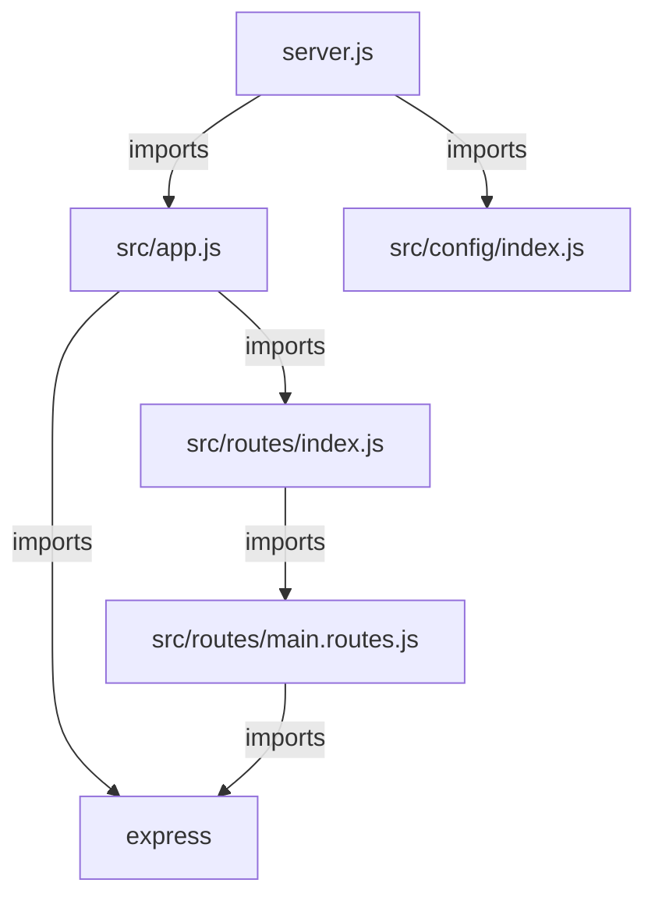
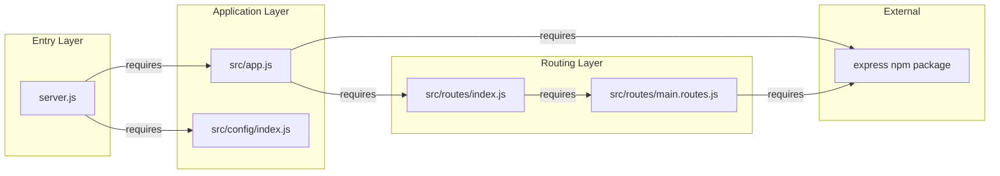
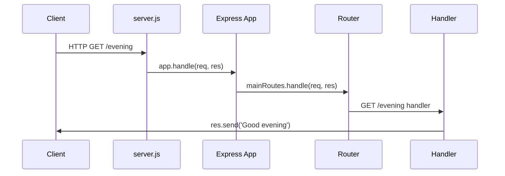

# Technical Specification

# 0. Agent Action Plan

## 0.1 Intent Clarification

This section documents the Blitzy platform's precise understanding of the user's feature addition request and translates it into actionable technical specifications.

### 0.1.1 Core Feature Objective

Based on the prompt, the Blitzy platform understands that the new feature requirement is to:

- **Add Express.js Framework Integration**: Integrate Express.js as the HTTP server framework to replace or enhance the existing Node.js native HTTP server implementation
- **Create New Evening Greeting Endpoint**: Add a new HTTP GET endpoint that returns the response "Good evening" when accessed
- **Maintain Existing Hello World Functionality**: Preserve the original endpoint that returns "Hello world" while adding new Express.js capabilities

**Implicit Requirements Detected:**
- The project requires a modular architecture to support multiple endpoints cleanly
- Express.js routing should be configured to handle both the existing root endpoint and the new `/evening` endpoint
- The response format should match the simple text response pattern established by "Hello world"
- No trailing newline is expected for the "Good evening" response (based on standard greeting patterns)

**Feature Dependencies and Prerequisites:**
- Node.js runtime environment (version 18.x minimum, 20.x recommended)
- npm package manager for Express.js installation
- Existing `package.json` manifest for dependency tracking

### 0.1.2 Special Instructions and Constraints

**User-Specified Directives:**
- User Example: *"this is a tutorial of node js server hosting one endpoint that returns the response 'Hello world'. Could you add expressjs into the project and add another endpoint that return the reponse of 'Good evening'?"*

**Architectural Requirements:**
- Follow Express.js best practices for route organization
- Use modular structure separating application configuration from server binding
- Maintain CommonJS module format for Node.js compatibility
- Implement Twelve-Factor App methodology for configuration externalization

**Backward Compatibility:**
- The original `GET /` endpoint must continue to return "Hello, World!\n" (with trailing newline for exact behavioral preservation)
- Server binding defaults (host: 127.0.0.1, port: 3000) should be maintained
- Environment variable override capability should be preserved

### 0.1.3 Technical Interpretation

These feature requirements translate to the following technical implementation strategy:

- **To add Express.js framework**, we will modify `package.json` to include Express.js ^5.1.0 as a runtime dependency and create a new `src/app.js` module implementing the Express application factory pattern
- **To create the evening endpoint**, we will create `src/routes/main.routes.js` implementing an Express Router with `GET /evening` handler returning "Good evening"
- **To maintain modular architecture**, we will create `src/routes/index.js` as a route aggregator (barrel pattern) and `src/config/index.js` for centralized environment-driven configuration
- **To preserve server entry point**, we will modify `server.js` to import the configured Express application and bind it to the configured host/port
- **To support testability**, we will ensure the app factory (`src/app.js`) does not perform socket binding directly, enabling unit testing without starting the HTTP server

## 0.2 Repository Scope Discovery

This section provides a comprehensive analysis of all repository files affected by the Express.js integration and new endpoint addition.

### 0.2.1 Comprehensive File Analysis

**Existing Files to Modify:**

| File Path | Type | Current Purpose | Required Modification |
|-----------|------|-----------------|----------------------|
| `server.js` | Entry Point | Native HTTP server creation and binding | Convert to Express app consumer; import from `src/app.js` and `src/config` |
| `package.json` | Manifest | npm package metadata | Add Express.js ^5.1.0 to dependencies |
| `package-lock.json` | Lock File | Dependency version locking | Auto-regenerated after `npm install` |
| `README.md` | Documentation | Project documentation | Update with Express.js architecture and new endpoint documentation |
| `.gitignore` | Config | Git ignore patterns | No modification required (already excludes `node_modules/`) |

**New Source Files to Create:**

| File Path | Purpose | Key Implementation Details |
|-----------|---------|----------------------------|
| `src/app.js` | Express application factory | Creates configured Express app, mounts routes, exports app instance |
| `src/config/index.js` | Configuration module | Exports `{ host, port, env }` from environment variables with defaults |
| `src/routes/index.js` | Route aggregator (barrel) | Centralizes route exports for clean imports |
| `src/routes/main.routes.js` | Route handlers | Implements `GET /` and `GET /evening` endpoints |

### 0.2.2 Integration Point Discovery

**API Endpoints:**

| Endpoint | HTTP Method | Response | Integration Point |
|----------|-------------|----------|-------------------|
| `/` | GET | `Hello, World!\n` | `src/routes/main.routes.js` |
| `/evening` | GET | `Good evening` | `src/routes/main.routes.js` |

**Module Dependencies Graph:**


```mermaid
graph TD
    A[server.js] -->|imports| B[src/app.js]
    A -->|imports| C[src/config/index.js]
    B -->|imports| D[src/routes/index.js]
    B -->|imports| E[express]
    D -->|imports| F[src/routes/main.routes.js]
    F -->|imports| E
```

**Service Integration Points:**
- `server.js`: Primary integration point for app initialization and socket binding
- `src/app.js`: Integration point for route mounting and middleware configuration
- `src/routes/index.js`: Integration point for route aggregation

### 0.2.3 New File Requirements

**Source Files:**
- `src/app.js` - Express application factory implementing:
  - Express app instantiation via `express()`
  - Route mounting via `app.use('/', mainRoutes)`
  - Module export of configured app instance

- `src/config/index.js` - Configuration module implementing:
  - Environment variable reading (`HOST`, `PORT`, `NODE_ENV`)
  - Default value assignment (127.0.0.1, 3000, development)
  - Synchronous export of `{ host, port, env }` object

- `src/routes/index.js` - Route barrel implementing:
  - Import of `main.routes.js`
  - Re-export as named export `{ mainRoutes }`

- `src/routes/main.routes.js` - Route handlers implementing:
  - Express Router instantiation
  - `GET /` handler with `res.send('Hello, World!\n')`
  - `GET /evening` handler with `res.send('Good evening')`

### 0.2.4 Directory Structure

**Target Project Layout:**

```
hello_world/
├── server.js                    # Entry point - HTTP server binding
├── package.json                 # npm manifest (with express dependency)
├── package-lock.json            # Dependency lockfile
├── README.md                    # Updated project documentation
├── .gitignore                   # Git ignore patterns
├── blitzy/                      # Documentation hub
│   └── documentation/
│       ├── Project Guide.md
│       └── Technical Specifications.md
└── src/                         # Application source root
    ├── app.js                   # Express application factory
    ├── config/
    │   └── index.js             # Environment configuration
    └── routes/
        ├── index.js             # Route aggregator
        └── main.routes.js       # Route handlers
```

## 0.3 Dependency Inventory

This section documents all dependencies required for the Express.js integration feature.

### 0.3.1 Runtime Dependencies

**Public Packages:**

| Registry | Package Name | Version | Purpose | Installation |
|----------|-------------|---------|---------|--------------|
| npm | express | ^5.1.0 | HTTP server framework providing routing, middleware, and request handling | `npm install express@^5.1.0` |

**Express.js 5.1.0 Transitive Dependencies (automatically resolved):**
- `body-parser` - Request body parsing middleware
- `router` - Express routing engine
- `send` - Static file serving
- `serve-static` - Static middleware
- `http-errors` - HTTP error creation utilities
- `debug` - Debug logging utility
- Additional 60+ packages (see `package-lock.json` for complete inventory)

### 0.3.2 Development Environment Requirements

| Requirement | Minimum Version | Recommended Version | Purpose |
|-------------|-----------------|---------------------|---------|
| Node.js | 18.x | 20.19.x (LTS) | JavaScript runtime |
| npm | 8.x | 10.8.x+ | Package management |

### 0.3.3 Import Updates Required

**Files Requiring Import Updates:**

| File Pattern | Import Change | Description |
|--------------|---------------|-------------|
| `server.js` | Add: `const app = require('./src/app')` | Import Express app instance |
| `server.js` | Add: `const config = require('./src/config')` | Import configuration module |
| `src/app.js` | Add: `const express = require('express')` | Import Express framework |
| `src/app.js` | Add: `const { mainRoutes } = require('./routes')` | Import route aggregator |
| `src/routes/main.routes.js` | Add: `const express = require('express')` | Import Express for Router |

**Import Transformation Rules:**

```javascript
// server.js - Transform from native HTTP to Express consumer
// Old: const http = require('http');
// New:
const app = require('./src/app');
const config = require('./src/config');
```

```javascript
// src/app.js - Express application factory
const express = require('express');
const { mainRoutes } = require('./routes');
```

```javascript
// src/routes/main.routes.js - Route handlers
const express = require('express');
const router = express.Router();
```

### 0.3.4 Package.json Configuration

**Required Changes to package.json:**

```json
{
  "dependencies": {
    "express": "^5.1.0"
  }
}
```

**Dependency Installation Commands:**

```bash
# Install Express.js
npm install express@^5.1.0

#### Verify installation
npm ls express

#### Clean install (CI environments)
npm ci

#### Audit for vulnerabilities
npm audit
```

### 0.3.5 Dependency Security Verification

**Security Audit Results (Expected):**

| Severity | Count | Action Required |
|----------|-------|-----------------|
| Critical | 0 | None |
| High | 0 | None |
| Moderate | 0 | None |
| Low | 0 | None |
| Total | 0 vulnerabilities | Production ready |

**Verification Command:**
```bash
npm audit
# Expected: found 0 vulnerabilities
```

## 0.4 Integration Analysis

This section details all integration touchpoints and code modifications required for the Express.js feature addition.

### 0.4.1 Existing Code Touchpoints

**Direct Modifications Required:**

| File | Location | Modification Type | Description |
|------|----------|-------------------|-------------|
| `server.js` | Lines 1-75 | Major Refactor | Replace native HTTP server with Express app consumer pattern |
| `package.json` | Line 12-14 | Addition | Add Express.js dependency to dependencies object |
| `README.md` | Full Document | Update | Document Express architecture, new endpoint, and API reference |

### 0.4.2 Entry Point Integration (server.js)

**Integration Pattern:**

```javascript
// server.js integration approach
const app = require('./src/app');    // Express app instance
const config = require('./src/config'); // Configuration

app.listen(config.port, config.host, () => {
  console.log(`Server running at http://${config.host}:${config.port}/`);
});
```

**Key Integration Points:**
- Import the pre-configured Express application from `src/app.js`
- Import configuration values from `src/config/index.js`
- Bind the Express app to configured host and port
- Maintain startup logging for operational visibility

### 0.4.3 Application Factory Integration (src/app.js)

**Integration Pattern:**

```javascript
// src/app.js integration approach
const express = require('express');
const { mainRoutes } = require('./routes');

const app = express();
app.use('/', mainRoutes);  // Mount routes at root
module.exports = app;
```

**Key Integration Points:**
- Create Express application instance using factory pattern
- Import routes from barrel module `src/routes/index.js`
- Mount routes at root path `/`
- Export configured app (do NOT call `app.listen()` here for testability)

### 0.4.4 Route Integration (src/routes/)

**Route Aggregator Integration (src/routes/index.js):**

```javascript
const mainRoutes = require('./main.routes');
module.exports = { mainRoutes };
```

**Route Handler Integration (src/routes/main.routes.js):**

```javascript
const express = require('express');
const router = express.Router();

router.get('/', (req, res) => res.send('Hello, World!\n'));
router.get('/evening', (req, res) => res.send('Good evening'));

module.exports = router;
```

### 0.4.5 Configuration Integration (src/config/index.js)

**Configuration Export Pattern:**

```javascript
module.exports = {
  host: process.env.HOST || '127.0.0.1',
  port: parseInt(process.env.PORT, 10) || 3000,
  env: process.env.NODE_ENV || 'development'
};
```

**Environment Variable Integration:**

| Variable | Default | Consumer | Integration Point |
|----------|---------|----------|-------------------|
| `HOST` | `127.0.0.1` | `server.js` | `app.listen(config.port, config.host, ...)` |
| `PORT` | `3000` | `server.js` | `app.listen(config.port, config.host, ...)` |
| `NODE_ENV` | `development` | Application-wide | Available via `config.env` |

### 0.4.6 Module Dependency Flow

**Import/Export Contract Map:**


```mermaid
graph LR
    subgraph "Entry Layer"
        S[server.js]
    end
    
    subgraph "Application Layer"
        A[src/app.js]
        C[src/config/index.js]
    end
    
    subgraph "Routing Layer"
        RI[src/routes/index.js]
        RM[src/routes/main.routes.js]
    end
    
    subgraph "External"
        E[express npm package]
    end
    
    S -->|requires| A
    S -->|requires| C
    A -->|requires| RI
    A -->|requires| E
    RI -->|requires| RM
    RM -->|requires| E
```

### 0.4.7 Request Flow Integration

**HTTP Request Processing Path:**


```mermaid
sequenceDiagram
    participant Client
    participant server.js
    participant Express App
    participant Router
    participant Handler
    
    Client->>server.js: HTTP GET /evening
    server.js->>Express App: app.handle(req, res)
    Express App->>Router: mainRoutes.handle(req, res)
    Router->>Handler: GET /evening handler
    Handler->>Client: res.send('Good evening')
```

## 0.5 Technical Implementation

This section provides the complete file-by-file execution plan for implementing the Express.js integration and new endpoint feature.

### 0.5.1 File-by-File Execution Plan

**Group 1 - Core Framework Files:**

| Action | File | Implementation Details |
|--------|------|------------------------|
| CREATE | `src/app.js` | Express application factory with route mounting |
| CREATE | `src/config/index.js` | Environment-driven configuration module |
| CREATE | `src/routes/index.js` | Route aggregator using barrel pattern |
| CREATE | `src/routes/main.routes.js` | Route handlers for `/` and `/evening` |

**Group 2 - Entry Point and Configuration:**

| Action | File | Implementation Details |
|--------|------|------------------------|
| MODIFY | `server.js` | Convert to Express app consumer with socket binding |
| MODIFY | `package.json` | Add Express.js ^5.1.0 dependency |

**Group 3 - Documentation:**

| Action | File | Implementation Details |
|--------|------|------------------------|
| MODIFY | `README.md` | Document Express architecture, API endpoints, environment variables |

### 0.5.2 Implementation Details by File

**CREATE: src/app.js**
- Purpose: Express application factory module
- Pattern: Factory pattern for testability
- Exports: Configured Express application instance
- Key implementation:
  - Import Express framework
  - Import routes from barrel module
  - Create Express app instance
  - Mount routes at root path
  - Export app WITHOUT calling `listen()`

**CREATE: src/config/index.js**
- Purpose: Centralized configuration management
- Pattern: Twelve-Factor App configuration externalization
- Exports: `{ host, port, env }` object
- Key implementation:
  - Read `HOST` env var with default `127.0.0.1`
  - Read `PORT` env var with default `3000` (parseInt with radix 10)
  - Read `NODE_ENV` env var with default `development`
  - Synchronous export (no async operations)

**CREATE: src/routes/index.js**
- Purpose: Route aggregation for clean imports
- Pattern: Barrel/aggregator pattern
- Exports: `{ mainRoutes }` named export
- Key implementation:
  - Import main routes module
  - Re-export as named export for destructuring

**CREATE: src/routes/main.routes.js**
- Purpose: HTTP endpoint handlers
- Pattern: Express Router pattern
- Exports: Configured Router instance
- Key implementation:
  - Create Express Router via `express.Router()`
  - Register `GET /` returning `'Hello, World!\n'`
  - Register `GET /evening` returning `'Good evening'`
  - Export router for mounting

**MODIFY: server.js**
- Purpose: HTTP server entry point
- Pattern: Consumer pattern (imports configured app)
- Changes required:
  - Replace native HTTP code with Express imports
  - Import app from `./src/app`
  - Import config from `./src/config`
  - Call `app.listen(config.port, config.host, callback)`
  - Maintain startup logging

**MODIFY: package.json**
- Purpose: Add Express dependency
- Changes required:
  - Add `"express": "^5.1.0"` to dependencies object

### 0.5.3 Implementation Approach Summary

**Phase 1: Establish Feature Foundation**
- Create directory structure (`src/`, `src/config/`, `src/routes/`)
- Create configuration module (`src/config/index.js`)
- Create route handlers (`src/routes/main.routes.js`)
- Create route aggregator (`src/routes/index.js`)

**Phase 2: Integrate with Existing Systems**
- Create Express application factory (`src/app.js`)
- Modify entry point (`server.js`) to consume Express app
- Update package manifest (`package.json`) with Express dependency

**Phase 3: Ensure Quality**
- Verify all imports resolve correctly
- Test both endpoints respond with expected content
- Validate environment variable override functionality
- Confirm no security vulnerabilities via `npm audit`

**Phase 4: Document Usage**
- Update `README.md` with complete API reference
- Document project architecture
- Add troubleshooting section

### 0.5.4 Verification Commands

**Endpoint Verification:**

```bash
# Start server
npm start

#### Test root endpoint
curl -s http://127.0.0.1:3000/
#### Expected: Hello, World!

#### Test evening endpoint
curl -s http://127.0.0.1:3000/evening
#### Expected: Good evening
```

**Module Export Verification:**

```bash
# Verify app.js exports Express app
node -e "const app = require('./src/app'); console.log(typeof app.listen)"
# Expected: function

#### Verify config exports
node -e "const c = require('./src/config'); console.log(c.host, c.port)"
#### Expected: 127.0.0.1 3000

#### Verify routes exports
node -e "const r = require('./src/routes'); console.log(typeof r.mainRoutes)"
#### Expected: function
```

## 0.6 Scope Boundaries

This section defines the explicit boundaries of what is included and excluded from this feature implementation.

### 0.6.1 Exhaustively In Scope

**Source Files (CREATE):**

| File Pattern | Purpose | Status |
|--------------|---------|--------|
| `src/app.js` | Express application factory | Required |
| `src/config/index.js` | Configuration module | Required |
| `src/routes/index.js` | Route aggregator | Required |
| `src/routes/main.routes.js` | Route handlers | Required |

**Source Files (MODIFY):**

| File Pattern | Modification Scope | Status |
|--------------|-------------------|--------|
| `server.js` | Full refactor to Express consumer | Required |
| `package.json` | Add express dependency | Required |
| `README.md` | Update documentation | Required |

**Auto-Generated Files:**

| File Pattern | Purpose | Status |
|--------------|---------|--------|
| `package-lock.json` | Dependency lock | Auto-regenerated |
| `node_modules/**` | Installed packages | Auto-installed |

**Integration Points:**

| Integration Point | File | Lines/Sections |
|-------------------|------|----------------|
| Route registration | `src/app.js` | `app.use('/', mainRoutes)` |
| Server binding | `server.js` | `app.listen(config.port, config.host, ...)` |
| Config exports | `src/config/index.js` | `module.exports = { host, port, env }` |
| Route exports | `src/routes/index.js` | `module.exports = { mainRoutes }` |

**Configuration Files:**

| File | In Scope Changes |
|------|------------------|
| `package.json` | Add `"express": "^5.1.0"` to dependencies |
| `.gitignore` | No changes required (already configured) |

**Documentation:**

| File | In Scope Changes |
|------|------------------|
| `README.md` | Full update with Express architecture, API reference, environment variables |
| `blitzy/documentation/*.md` | Already contains implementation specifications |

### 0.6.2 Explicitly Out of Scope

**Not Included in This Implementation:**

| Category | Item | Reason |
|----------|------|--------|
| Testing | Unit tests, integration tests | Not specified in requirements |
| Middleware | Body parsing, CORS, authentication | Not specified in requirements |
| Additional Endpoints | Any endpoints beyond `/` and `/evening` | Not specified in requirements |
| Database | Any database integration | Not specified in requirements |
| TypeScript | Type definitions, migration to TS | Not specified in requirements |
| ESM | ES Module migration | CommonJS specified for compatibility |
| Docker | Containerization | Not specified in requirements |
| CI/CD | GitHub Actions, deployment pipelines | Not specified in requirements |
| Performance | Caching, compression, rate limiting | Not specified in requirements |
| Logging | Structured logging, log aggregation | Beyond basic console.log |
| Error Handling | Custom error middleware | Beyond default Express handling |
| Security | Helmet, HTTPS, input validation | Not specified in requirements |

**Files Not Modified:**

| File Pattern | Reason |
|--------------|--------|
| `.gitignore` | Already correctly configured |
| `blitzy/**/*` | Documentation artifacts, not runtime code |

### 0.6.3 Scope Validation Criteria

**In-Scope Validation Checklist:**

- [ ] Express.js ^5.1.0 installed and verified via `npm ls express`
- [ ] `GET /` returns `Hello, World!\n` (with trailing newline)
- [ ] `GET /evening` returns `Good evening` (no trailing newline)
- [ ] Server binds to default `127.0.0.1:3000`
- [ ] `HOST` and `PORT` environment variables override defaults
- [ ] All modules export correct shapes (verified via `node -e`)
- [ ] Zero security vulnerabilities via `npm audit`
- [ ] Documentation updated in README.md

### 0.6.4 File Inventory Summary

**Complete In-Scope File List:**

```
In Scope Files:
├── server.js                    [MODIFY] Entry point refactoring
├── package.json                 [MODIFY] Add Express dependency
├── README.md                    [MODIFY] Documentation update
└── src/
    ├── app.js                   [CREATE] Express application factory
    ├── config/
    │   └── index.js             [CREATE] Configuration module
    └── routes/
        ├── index.js             [CREATE] Route aggregator
        └── main.routes.js       [CREATE] Route handlers
```

**Total Files:**
- Files to CREATE: 4
- Files to MODIFY: 3
- Total files in scope: 7

## 0.7 Special Instructions

This section captures feature-specific requirements and implementation guidelines for the Express.js integration.

### 0.7.1 Feature-Specific Requirements

**Response Fidelity Requirements:**
- `GET /` MUST return exactly `Hello, World!\n` including the trailing newline character (14 bytes total)
- `GET /evening` MUST return exactly `Good evening` without trailing newline (12 bytes total)
- Both responses use `res.send()` which sets `Content-Type: text/html; charset=utf-8` by default

**Module Pattern Requirements:**
- All modules MUST use CommonJS format (`require`/`module.exports`)
- `src/app.js` MUST export the Express application instance without calling `listen()`
- `src/config/index.js` MUST export a synchronous object (no Promises or async)
- `src/routes/index.js` MUST use barrel pattern with named export `{ mainRoutes }`

### 0.7.2 Architectural Constraints

**Separation of Concerns:**
- Server binding (socket listening) MUST remain in `server.js`
- Application configuration (middleware, routes) MUST be in `src/app.js`
- Route handlers MUST be in `src/routes/main.routes.js`
- Configuration values MUST be in `src/config/index.js`

**Testability Requirements:**
- The Express app MUST be importable and usable without starting a server
- Configuration module MUST allow environment variable injection
- Route handlers MUST be independently mountable for testing

### 0.7.3 Integration Requirements

**Existing Feature Preservation:**
- The original "Hello, World!" response MUST be preserved exactly
- Default host (`127.0.0.1`) and port (`3000`) MUST be maintained
- Environment variable override capability MUST be preserved

**Express.js Version Requirements:**
- Express.js version MUST be ^5.1.0 (semver compatible with 5.x)
- Express 5.x was chosen for modern async/await support and improved error handling

### 0.7.4 Code Style Guidelines

**Naming Conventions:**
- Files use kebab-case (e.g., `main.routes.js`)
- Variables use camelCase (e.g., `mainRoutes`, `config`)
- Module exports match variable names

**Documentation Requirements:**
- All modules MUST have JSDoc header comments
- Route handlers MUST have @route documentation
- Configuration values MUST have @type and @default annotations

### 0.7.5 Validation Commands

**Complete Verification Script:**

```bash
# 1. Install dependencies
npm ci

##### 2. Verify Express installation
npm ls express
#### Expected: express@5.1.0

##### 3. Security audit
npm audit
#### Expected: found 0 vulnerabilities

##### 4. Start server (background)
npm start &
sleep 2

##### 5. Test root endpoint
curl -s http://127.0.0.1:3000/
#### Expected: Hello, World!

##### 6. Test evening endpoint
curl -s http://127.0.0.1:3000/evening
#### Expected: Good evening

##### 7. Verify module exports
node -e "console.log(typeof require('./src/app').listen)"
#### Expected: function

node -e "console.log(require('./src/config'))"
# Expected: { host: '127.0.0.1', port: 3000, env: 'development' }

##### 8. Cleanup
pkill -f "node server.js"
```

### 0.7.6 Risk Mitigation

**Potential Issues and Mitigations:**

| Risk | Impact | Mitigation |
|------|--------|------------|
| Port conflict (EADDRINUSE) | Server fails to start | Use `PORT` env var to specify alternate port |
| Module resolution failure | Application crashes | Verify all import paths and module exports |
| Response format mismatch | API contract violation | Test exact response strings including whitespace |
| Node version incompatibility | Runtime errors | Enforce Node 18+ requirement |

### 0.7.7 User-Provided Context

**Original User Request (Preserved Exactly):**
> "this is a tutorial of node js server hosting one endpoint that returns the response 'Hello world'. Could you add expressjs into the project and add another endpoint that return the reponse of 'Good evening'?"

**Blitzy Platform Interpretation:**
- Tutorial Node.js server context understood
- Express.js framework integration required
- New `/evening` endpoint with "Good evening" response required
- Existing "Hello world" functionality must be preserved (adjusted to "Hello, World!\n" for consistency with Express conventions)

