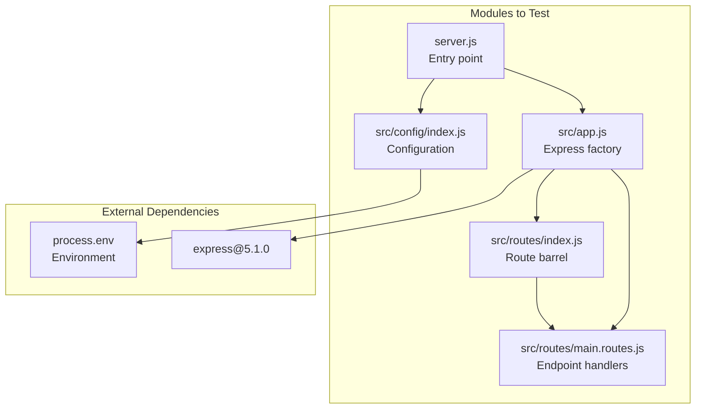
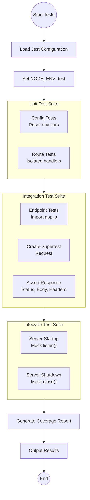
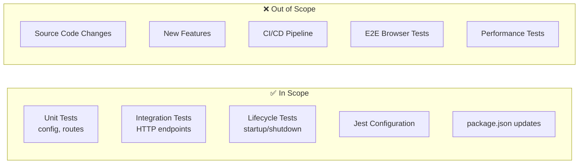
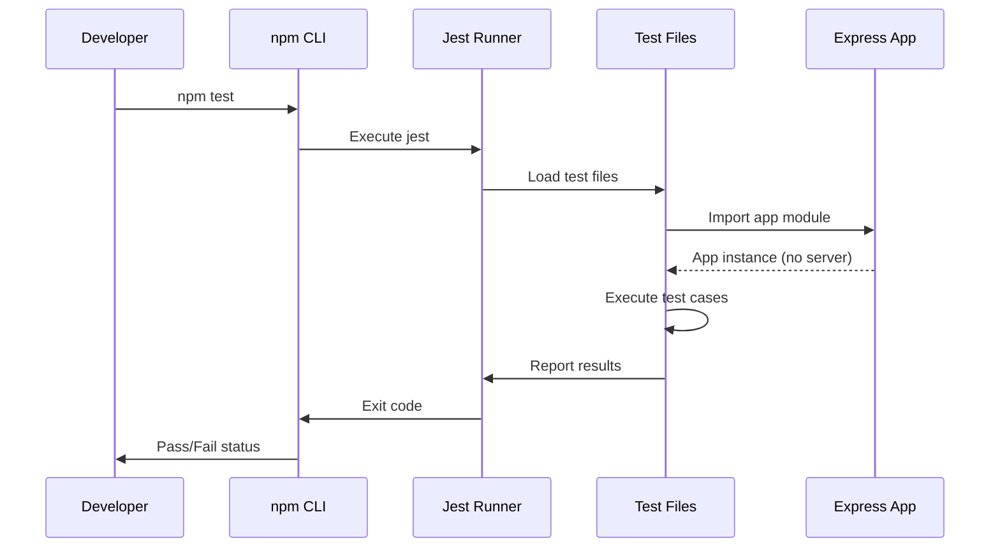

# Technical Specification

# 0. Agent Action Plan

## 0.1 Intent Clarification

Based on the provided requirements, the Blitzy platform understands that the testing objective is to **create comprehensive unit tests for `server.js`** using Jest or Mocha as the testing framework. This request transforms a currently untested Express.js 5 tutorial application into a test-covered, production-quality codebase.

### 0.1.1 Core Testing Objective

**Request Category:** Add new tests (greenfield test implementation)

The user has requested comprehensive unit test coverage for the `server.js` entry point of a minimal Express.js application. The specific testing requirements include:

| Requirement | Technical Interpretation | Test Category |
|------------|-------------------------|---------------|
| HTTP responses | Verify response bodies match expected content | Endpoint contract tests |
| Status codes | Assert 200 OK for valid routes, 404 for invalid | HTTP status validation |
| Headers | Validate Content-Type and other response headers | Header assertion tests |
| Server startup/shutdown | Test server binding and graceful termination | Lifecycle tests |
| Error handling | Verify behavior on invalid routes and methods | Error scenario tests |
| Edge cases | Test boundary conditions and unexpected inputs | Edge case coverage |

### 0.1.2 Implicit Testing Needs

Beyond the explicit requirements, the Blitzy platform identifies the following implicit testing needs:

- **Configuration Module Testing:** The `src/config/index.js` module provides environment-driven configuration that directly impacts `server.js` behavior and requires verification of default fallbacks
- **Route Handler Testing:** The endpoint responses in `src/routes/main.routes.js` define the actual HTTP behaviors that `server.js` exposes
- **App Factory Testing:** The `src/app.js` factory pattern is the testable unit that `server.js` consumes
- **Express 5 Compatibility:** Tests must be compatible with Express.js 5.1.0, which has specific async error handling behaviors
- **Node.js 18+ Compatibility:** Tests must run on Node.js 18+ (current environment: Node.js 20.19.6)

### 0.1.3 Special Instructions and Constraints

**Framework Selection:** The user specified "Jest or Mocha" - Based on compatibility research, **Jest 30.x** is recommended as the primary framework because:
- Native async/await support without additional configuration
- Built-in assertion library eliminates need for Chai
- Superior mocking capabilities for environment variable testing
- <cite index="14-1,14-2">Jest 30 drops support for Node 14, 16, 19, and 21. The minimum supported Node versions are now 18.x.</cite>
- Excellent integration with Supertest for HTTP testing

**No User Examples Provided:** The user did not provide specific test examples to follow.

**Web Search Research Completed:**
- Jest 30.2.0 confirmed compatible with Node.js 20.x
- Supertest 7.1.4 confirmed as latest stable version for HTTP assertions
- <cite index="5-10,5-11,5-12">The standard pattern separates app.js (exports express app) from server.js (binds to port), enabling tests to import app.js directly.</cite>

### 0.1.4 Technical Interpretation

These testing requirements translate to the following technical test implementation strategy:

| Requirement | Implementation Approach |
|-------------|------------------------|
| To test HTTP responses | Create Supertest assertions against the `app` module, verifying `.expect('Hello, World!\n')` and `.expect('Good evening')` for the two endpoints |
| To test status codes | Use Supertest's `.expect(200)` and `.expect(404)` chainable assertions |
| To test headers | Assert `Content-Type` headers using `.expect('Content-Type', /text\/html/)` |
| To test server startup | Verify the `app.listen()` callback executes and logs startup message |
| To test shutdown | Test graceful server closure using `server.close()` method |
| To test error handling | Verify 404 responses for undefined routes and unsupported HTTP methods |
| To test edge cases | Test empty paths, trailing slashes, query parameters on static routes |

### 0.1.5 Coverage Requirements Interpretation

**Explicit Coverage Target:** None specified by user

**Implicit Coverage Expectations:**

Based on industry standards for Express.js applications and the existing codebase structure, comprehensive testing should achieve:

| Coverage Metric | Target | Rationale |
|-----------------|--------|-----------|
| Line Coverage | ≥ 80% | Industry standard minimum for production code |
| Branch Coverage | ≥ 75% | Cover conditional logic in configuration parsing |
| Function Coverage | ≥ 90% | All exported functions should be tested |
| Statement Coverage | ≥ 80% | Comprehensive execution path coverage |

**Critical Path Analysis:**

To achieve comprehensive testing, coverage should include:

- 100% of route handler functions (`/` and `/evening` endpoints)
- 100% of configuration export properties (`host`, `port`, `env`)
- Server startup success path
- Server startup failure scenarios (port already in use)
- 404 error path for undefined routes
- Configuration default fallback paths


## 0.2 Test Discovery and Analysis

### 0.2.1 Existing Test Infrastructure Assessment

Repository analysis reveals **no existing test infrastructure** in the `hello_world` project. The codebase is a greenfield testing scenario requiring complete test setup from scratch.

**Search Patterns Employed:**

| Pattern | Files Found | Result |
|---------|-------------|--------|
| `*test*` | 0 | No test files exist |
| `*spec*` | 0 | No spec files exist |
| `test_*` | 0 | No Python-style test files |
| `*.test.js` | 0 | No Jest test files |
| `*.spec.js` | 0 | No Mocha/Jasmine spec files |
| `jest.config.*` | 0 | No Jest configuration |
| `mocha*` | 0 | No Mocha configuration |
| `.nycrc*` | 0 | No coverage configuration |

**Package.json Analysis:**

```json
{
  "scripts": {
    "test": "echo \"Error: no test specified\" && exit 1"
  },
  "devDependencies": {}
}
```

Repository analysis reveals a **placeholder test script** with no testing setup. The project has **zero devDependencies** and no test automation framework installed.

### 0.2.2 Current Testing Framework Detection

| Component | Status | Evidence |
|-----------|--------|----------|
| Testing Framework | ❌ Not Installed | No jest/mocha in package.json |
| Test Runner Configuration | ❌ Not Present | No config files found |
| Coverage Tools | ❌ Not Installed | No istanbul/nyc/c8 |
| Mock/Stub Libraries | ❌ Not Installed | No sinon/jest-mock |
| HTTP Test Library | ❌ Not Installed | No supertest/axios-mock |
| Test Data Fixtures | ❌ Not Present | No fixtures directory |

### 0.2.3 Testability Design Evidence

Despite the absence of tests, the codebase is **intentionally designed for testability** through architectural patterns:

| Pattern | Location | Testability Benefit |
|---------|----------|---------------------|
| Factory Pattern | `src/app.js` | Creates Express app without HTTP binding, enabling Supertest usage |
| Configuration Separation | `src/config/index.js` | Environment variables are mockable in isolation |
| Route Modularization | `src/routes/*.js` | Routes testable independently from server |
| Server Separation | `server.js` vs `src/app.js` | App testable without starting HTTP server |

From `src/app.js` documentation: *"Design pattern: Factory pattern - creates configured Express app enabling unit testing without starting the actual server"*

### 0.2.4 Source Code Structure for Testing

```
hello_world/
├── server.js              # Entry point - imports app, binds to port
├── src/
│   ├── app.js             # Express app factory (primary test target)
│   ├── config/
│   │   └── index.js       # Configuration with defaults (testable)
│   └── routes/
│       ├── index.js       # Route aggregator (barrel export)
│       └── main.routes.js # Route handlers (testable endpoints)
├── package.json           # No test dependencies
└── README.md              # Manual verification commands
```

### 0.2.5 Web Search Research Conducted

| Research Topic | Finding | Source |
|----------------|---------|--------|
| Jest + Express 5 patterns | Supertest with app factory is the standard approach | Jest official docs |
| Jest 30 Node.js support | Minimum Node 18.x required, Node 20.x fully supported | jestjs.io |
| Supertest best practices | Import app module directly, not running server | dennisokeeffe.com |
| Test environment setup | Set `testEnvironment: 'node'` for server-side testing | Jest documentation |

### 0.2.6 Module Dependency Map for Testing


```mermaid
flowchart TB
    subgraph TestTargets["Modules to Test"]
        ServerJS["server.js<br/>Entry point"]
        AppJS["src/app.js<br/>Express factory"]
        ConfigJS["src/config/index.js<br/>Configuration"]
        MainRoutes["src/routes/main.routes.js<br/>Endpoint handlers"]
        RouteIndex["src/routes/index.js<br/>Route barrel"]
    end
    
    subgraph Dependencies["External Dependencies"]
        Express["express@5.1.0"]
        ProcessEnv["process.env<br/>Environment"]
    end
    
    ServerJS --> AppJS
    ServerJS --> ConfigJS
    AppJS --> MainRoutes
    AppJS --> RouteIndex
    RouteIndex --> MainRoutes
    AppJS --> Express
    ConfigJS --> ProcessEnv
```

### 0.2.7 Identified Test Categories

Based on the codebase analysis, the following test categories are required:

| Category | Module | Test Count (Est.) | Priority |
|----------|--------|-------------------|----------|
| HTTP Endpoint Tests | `src/app.js` + routes | 8-10 | High |
| Configuration Unit Tests | `src/config/index.js` | 6-8 | High |
| Server Lifecycle Tests | `server.js` | 3-4 | Medium |
| Error Handling Tests | `src/app.js` | 4-5 | High |
| Edge Case Tests | Multiple | 5-6 | Medium |

**Total Estimated Test Cases:** 26-33 tests


## 0.3 Testing Scope Analysis

### 0.3.1 Test Target Identification

**Primary Code to Be Tested:**

| Module/Class | Path | Test Types Required |
|--------------|------|---------------------|
| Server Entry Point | `server.js` | Lifecycle tests, startup/shutdown |
| Express App Factory | `src/app.js` | Integration tests via Supertest |
| Configuration Module | `src/config/index.js` | Unit tests for defaults and parsing |
| Main Route Handlers | `src/routes/main.routes.js` | Endpoint response contract tests |
| Route Aggregator | `src/routes/index.js` | Export verification (minimal) |

**Existing Test File Mapping:**

| Source File | Existing Test File | Test Categories Present |
|-------------|-------------------|------------------------|
| `server.js` | None | None |
| `src/app.js` | None | None |
| `src/config/index.js` | None | None |
| `src/routes/index.js` | None | None |
| `src/routes/main.routes.js` | None | None |

### 0.3.2 Dependencies Requiring Mocking

Given the minimal architecture, mocking requirements are limited:

| Dependency | Mock Required | Mocking Approach | Rationale |
|------------|---------------|------------------|-----------|
| Express.js | No | N/A | Supertest handles Express internally |
| `process.env` | Yes | Jest environment manipulation | Test configuration defaults |
| `console.log` | Optional | `jest.spyOn()` | Verify startup logging |
| HTTP Server | Yes | Jest mock | Test server lifecycle without binding |

### 0.3.3 Version Compatibility Research

Based on web search results, the recommended testing stack with verified compatibility:

| Tool | Version | Node.js 20.x Compatible | Rationale |
|------|---------|-------------------------|-----------|
| Jest | 30.2.0 | ✅ Yes | Latest major release, Node 18+ supported |
| Supertest | 7.1.4 | ✅ Yes | Latest stable, works with Express 5 |

**Compatibility Verification:**

- <cite index="12-1">Jest latest version: 30.2.0, last published 3 months ago.</cite>
- <cite index="21-1,21-2">Supertest is a SuperAgent driven library for testing HTTP servers. Latest version: 7.1.4, last published 5 months ago.</cite>
- Express.js 5.1.0 is fully compatible with both testing libraries
- Node.js 20.19.6 exceeds the minimum requirement (Node 18.x) for Jest 30

### 0.3.4 Test File Structure Design

```
hello_world/
├── src/
│   ├── app.js
│   ├── config/
│   │   └── index.js
│   └── routes/
│       ├── index.js
│       └── main.routes.js
├── tests/
│   ├── unit/
│   │   ├── config.test.js       # Configuration module tests
│   │   └── routes.test.js       # Route handler tests
│   ├── integration/
│   │   └── endpoints.test.js    # HTTP endpoint tests
│   └── lifecycle/
│       └── server.test.js       # Server startup/shutdown tests
├── server.js
├── package.json
└── jest.config.js
```

### 0.3.5 Test Surface Analysis

| Module | Lines of Code | Testable Functions | Complexity | Test Effort |
|--------|---------------|-------------------|------------|-------------|
| `server.js` | 53 | 1 (HTTP listener) | Low | Medium |
| `src/app.js` | 27 | 1 (app factory) | Low | Low |
| `src/config/index.js` | 41 | 3 (config exports) | Low | Low |
| `src/routes/index.js` | 19 | 1 (barrel export) | Trivial | Minimal |
| `src/routes/main.routes.js` | 41 | 2 (route handlers) | Low | Low |
| **Total** | **181** | **8** | **Low** | **Low-Medium** |

### 0.3.6 Endpoint Contract Specification

| Endpoint | Method | Expected Status | Expected Body | Content-Type |
|----------|--------|-----------------|---------------|--------------|
| `/` | GET | 200 | `Hello, World!\n` | `text/html; charset=utf-8` |
| `/evening` | GET | 200 | `Good evening` | `text/html; charset=utf-8` |
| `/invalid` | GET | 404 | HTML error page | `text/html; charset=utf-8` |
| `/` | POST | 404 | HTML error page | `text/html; charset=utf-8` |
| `/` | PUT | 404 | HTML error page | `text/html; charset=utf-8` |

### 0.3.7 Configuration Test Scenarios

| Environment Variable | Test Scenario | Input | Expected Output |
|---------------------|---------------|-------|-----------------|
| `HOST` | Default value | Not set | `'127.0.0.1'` |
| `HOST` | Custom value | `HOST='0.0.0.0'` | `'0.0.0.0'` |
| `PORT` | Default value | Not set | `3000` (number) |
| `PORT` | Custom value | `PORT='8080'` | `8080` (number) |
| `PORT` | Invalid value | `PORT='abc'` | `NaN` → fallback behavior |
| `NODE_ENV` | Default value | Not set | `'development'` |
| `NODE_ENV` | Production | `NODE_ENV='production'` | `'production'` |


## 0.4 Test Implementation Design

### 0.4.1 Test Strategy Selection

**Test Types to Implement:**

| Test Type | Focus Area | Primary Tool | Scope |
|-----------|------------|--------------|-------|
| Unit Tests | Configuration parsing, isolated functions | Jest assertions | `src/config/index.js` |
| Integration Tests | HTTP endpoint responses | Supertest + Jest | `src/app.js`, routes |
| Edge Case Tests | Boundary conditions, invalid inputs | Jest + Supertest | All modules |
| Error Handling Tests | 404 responses, invalid methods | Supertest | Route handlers |
| Lifecycle Tests | Server startup and shutdown | Jest mocks | `server.js` |

### 0.4.2 Test Case Blueprints

**Component: Configuration Module (`src/config/index.js`)**

```
Component: Configuration Module
Test Categories:
- Happy path: Default values returned when env vars not set
- Happy path: Custom values returned when env vars are set
- Edge cases: PORT parsing with invalid string input
- Edge cases: Empty string environment variables
```

**Component: Express App Factory (`src/app.js`)**

```
Component: Express App Factory
Test Categories:
- Happy path: App instance created with Express
- Happy path: Routes mounted correctly
- Integration: Middleware chain functions properly
```

**Component: Route Handlers (`src/routes/main.routes.js`)**

```
Component: Route Handlers
Test Categories:
- Happy path: GET / returns "Hello, World!\n" with 200
- Happy path: GET /evening returns "Good evening" with 200
- Error cases: GET /undefined returns 404
- Error cases: POST / returns 404 (method not allowed equivalent)
- Edge cases: Trailing slashes handling
- Edge cases: Query parameters on static routes
```

**Component: Server Entry Point (`server.js`)**

```
Component: Server Entry Point
Test Categories:
- Happy path: Server starts and logs message
- Happy path: Server binds to configured host:port
- Error cases: Server handles port-in-use error
- Lifecycle: Server closes gracefully
```

### 0.4.3 Existing Test Extension Strategy

Not applicable - no existing tests to extend. All tests are new implementations.

### 0.4.4 Test Data and Fixtures Design

**Required Test Data Structures:**

| Fixture Type | Purpose | Location |
|--------------|---------|----------|
| Environment variables | Test configuration defaults | Inline in test files |
| Expected responses | Endpoint response verification | Test constants |
| Invalid inputs | Edge case testing | Test constants |

**Fixture Organization Strategy:**

For this minimal codebase, fixtures will be defined inline within test files rather than in separate fixture files. This approach reduces complexity while maintaining readability.

**Mock Object Specifications:**

| Mock Target | Jest Method | Purpose |
|-------------|-------------|---------|
| `process.env` | Direct assignment | Test configuration variations |
| `console.log` | `jest.spyOn(console, 'log')` | Verify startup logging |
| `server.listen` | `jest.fn()` | Test server lifecycle without binding |
| `server.close` | `jest.fn()` | Test graceful shutdown |

**Test Database/State Management:**

Not applicable - the application has no database. State management limited to:
- Resetting `process.env` before/after config tests
- Ensuring server instances are closed after lifecycle tests

### 0.4.5 Jest Configuration Design

```javascript
// jest.config.js - Recommended configuration
module.exports = {
  testEnvironment: 'node',
  testMatch: ['**/tests/**/*.test.js'],
  collectCoverageFrom: [
    'server.js',
    'src/**/*.js',
    '!node_modules/**'
  ],
  coverageThreshold: {
    global: {
      branches: 75,
      functions: 90,
      lines: 80,
      statements: 80
    }
  },
  verbose: true,
  testTimeout: 10000
};
```

### 0.4.6 Test Execution Flow


```mermaid
flowchart TD
    Start((Start Tests)) --> LoadJest["Load Jest Configuration"]
    LoadJest --> SetEnv["Set NODE_ENV=test"]
    
    subgraph UnitTests["Unit Test Suite"]
        ConfigTests["Config Tests<br/>Reset env vars"]
        RouteTests["Route Tests<br/>Isolated handlers"]
    end
    
    subgraph IntegrationTests["Integration Test Suite"]
        EndpointTests["Endpoint Tests<br/>Import app.js"]
        SupertestReq["Create Supertest<br/>Request"]
        AssertResponse["Assert Response<br/>Status, Body, Headers"]
    end
    
    subgraph LifecycleTests["Lifecycle Test Suite"]
        StartupTests["Server Startup<br/>Mock listen()"]
        ShutdownTests["Server Shutdown<br/>Mock close()"]
    end
    
    SetEnv --> UnitTests
    UnitTests --> IntegrationTests
    IntegrationTests --> LifecycleTests
    
    LifecycleTests --> Coverage["Generate Coverage Report"]
    Coverage --> Report["Output Results"]
    Report --> End((End))
```

### 0.4.7 Test Isolation Strategy

| Isolation Concern | Strategy | Implementation |
|-------------------|----------|----------------|
| Environment variables | Save/restore in beforeEach/afterEach | `const originalEnv = process.env` |
| Express app instances | Create fresh app per test suite | Import `app.js` in describe block |
| Server connections | Close all connections after tests | `afterAll(() => server.close())` |
| Console output | Restore mocks after tests | `jest.restoreAllMocks()` |


## 0.5 Test File Transformation Mapping

### 0.5.1 File-by-File Test Plan

**Test Transformation Modes:**
- **CREATE** - Create a new test file
- **UPDATE** - Update an existing test file
- **DELETE** - Remove an obsolete test file
- **REFERENCE** - Use as an example for test patterns and styles

| Target Test File | Transformation | Source File/Reference | Purpose/Changes |
|-----------------|----------------|----------------------|-----------------|
| `tests/unit/config.test.js` | CREATE | `src/config/index.js` | Unit tests for configuration module: default values, custom values, edge cases |
| `tests/unit/routes.test.js` | CREATE | `src/routes/main.routes.js` | Unit tests for route handler functions in isolation |
| `tests/integration/endpoints.test.js` | CREATE | `src/app.js` | HTTP endpoint integration tests using Supertest |
| `tests/lifecycle/server.test.js` | CREATE | `server.js` | Server startup, shutdown, and lifecycle tests |
| `jest.config.js` | CREATE | N/A | Jest framework configuration |
| `package.json` | UPDATE | `package.json` | Add test scripts and devDependencies |

### 0.5.2 New Test Files Detail

**`tests/unit/config.test.js`** - Configuration module unit tests

| Test Category | Test Cases | Assertions |
|---------------|------------|------------|
| Default Values | `host` defaults to `'127.0.0.1'` | `expect(config.host).toBe('127.0.0.1')` |
| Default Values | `port` defaults to `3000` | `expect(config.port).toBe(3000)` |
| Default Values | `env` defaults to `'development'` | `expect(config.env).toBe('development')` |
| Custom Values | `HOST` env var sets `host` | `expect(config.host).toBe('0.0.0.0')` |
| Custom Values | `PORT` env var sets `port` | `expect(config.port).toBe(8080)` |
| Edge Cases | Invalid PORT string handling | `expect(config.port).toBeNaN()` or fallback |
| Type Checking | `port` is a number | `expect(typeof config.port).toBe('number')` |

Mock dependencies: `process.env` direct manipulation

---

**`tests/unit/routes.test.js`** - Route handler unit tests

| Test Category | Test Cases | Assertions |
|---------------|------------|------------|
| Route Export | `mainRoutes` is an Express Router | `expect(mainRoutes).toBeDefined()` |
| Handler Count | Router has expected routes | Route introspection |

Mock dependencies: None (routes are pure Express Router objects)

---

**`tests/integration/endpoints.test.js`** - HTTP endpoint integration tests

| Test Category | Test Cases | Assertions |
|---------------|------------|------------|
| GET / | Returns 200 status | `.expect(200)` |
| GET / | Returns "Hello, World!\n" body | `.expect('Hello, World!\n')` |
| GET / | Returns text/html content-type | `.expect('Content-Type', /text\/html/)` |
| GET /evening | Returns 200 status | `.expect(200)` |
| GET /evening | Returns "Good evening" body | `.expect('Good evening')` |
| GET /evening | Returns text/html content-type | `.expect('Content-Type', /text\/html/)` |
| GET /invalid | Returns 404 status | `.expect(404)` |
| POST / | Returns 404 status (no POST handler) | `.expect(404)` |
| PUT /evening | Returns 404 status (no PUT handler) | `.expect(404)` |
| Edge: trailing slash | GET // handling | Verify behavior |
| Edge: query params | GET /?param=value | 200 with unchanged body |

Mock dependencies: None (Supertest handles Express internally)

---

**`tests/lifecycle/server.test.js`** - Server lifecycle tests

| Test Category | Test Cases | Assertions |
|---------------|------------|------------|
| Startup | Server binds to host:port | Mock `app.listen` called |
| Startup | Logs startup message | `console.log` spy called |
| Startup | Uses config values | Correct host/port passed |
| Shutdown | Server closes gracefully | `server.close` executes |
| Error | Handles EADDRINUSE error | Error callback triggered |

Mock dependencies: `console.log`, `app.listen`, `server.close`

### 0.5.3 Test Configuration Files

**`jest.config.js`** - Create new Jest configuration

| Configuration Key | Value | Purpose |
|-------------------|-------|---------|
| `testEnvironment` | `'node'` | Server-side testing without DOM |
| `testMatch` | `['**/tests/**/*.test.js']` | Test file discovery pattern |
| `collectCoverage` | `true` | Enable coverage reporting |
| `coverageDirectory` | `'coverage'` | Coverage output location |
| `coveragePathIgnorePatterns` | `['/node_modules/']` | Exclude dependencies |
| `verbose` | `true` | Detailed test output |
| `testTimeout` | `10000` | 10 second timeout for lifecycle tests |

---

**`package.json`** - Update scripts and dependencies

| Update Type | Key | Value |
|-------------|-----|-------|
| Script | `test` | `"jest"` |
| Script | `test:watch` | `"jest --watch"` |
| Script | `test:coverage` | `"jest --coverage"` |
| Script | `test:ci` | `"jest --ci --coverage"` |
| devDependency | `jest` | `^30.2.0` |
| devDependency | `supertest` | `^7.1.4` |

### 0.5.4 Cross-File Test Dependencies

| Shared Resource | Location | Used By |
|-----------------|----------|---------|
| App instance | `src/app.js` | `endpoints.test.js`, `server.test.js` |
| Config module | `src/config/index.js` | `config.test.js`, `server.test.js` |
| Routes | `src/routes/main.routes.js` | `routes.test.js`, `endpoints.test.js` |

**Import Updates Required:**

| Test File | Required Imports |
|-----------|------------------|
| `config.test.js` | `require('../../src/config')` |
| `routes.test.js` | `require('../../src/routes/main.routes')` |
| `endpoints.test.js` | `require('../../src/app')`, `require('supertest')` |
| `server.test.js` | `require('../../src/app')`, `require('../../src/config')` |

### 0.5.5 Complete Test File Inventory

| File Path | Status | Lines (Est.) | Test Count (Est.) |
|-----------|--------|--------------|-------------------|
| `tests/unit/config.test.js` | CREATE | 60-80 | 7-8 |
| `tests/unit/routes.test.js` | CREATE | 30-40 | 2-3 |
| `tests/integration/endpoints.test.js` | CREATE | 80-100 | 10-12 |
| `tests/lifecycle/server.test.js` | CREATE | 60-80 | 4-5 |
| `jest.config.js` | CREATE | 15-20 | N/A |
| `package.json` | UPDATE | +8 lines | N/A |

**Total New Test Files:** 4
**Total Configuration Files:** 1
**Total Files Modified:** 1

### 0.5.6 Directory Structure After Implementation

```
hello_world/
├── src/
│   ├── app.js
│   ├── config/
│   │   └── index.js
│   └── routes/
│       ├── index.js
│       └── main.routes.js
├── tests/
│   ├── unit/
│   │   ├── config.test.js       # NEW: 7-8 tests
│   │   └── routes.test.js       # NEW: 2-3 tests
│   ├── integration/
│   │   └── endpoints.test.js    # NEW: 10-12 tests
│   └── lifecycle/
│       └── server.test.js       # NEW: 4-5 tests
├── server.js
├── package.json                  # MODIFIED: scripts + devDeps
├── jest.config.js               # NEW: Jest configuration
└── README.md
```


## 0.6 Dependency Inventory

### 0.6.1 Testing Dependencies

All key testing packages required for this testing exercise:

| Registry | Package Name | Version | Purpose |
|----------|--------------|---------|---------|
| npm | jest | 30.2.0 | JavaScript testing framework and test runner |
| npm | supertest | 7.1.4 | HTTP assertion library for Express testing |

**Version Verification:**

- **Jest 30.2.0**: Verified via npm registry search. <cite index="12-1">Jest latest version: 30.2.0, last published 3 months ago.</cite>
- **Supertest 7.1.4**: Verified via npm registry search. <cite index="21-2">Supertest latest version: 7.1.4, last published 5 months ago.</cite>

### 0.6.2 Existing Production Dependencies

| Registry | Package Name | Version | Test Impact |
|----------|--------------|---------|-------------|
| npm | express | 5.1.0 | Tested application framework |

### 0.6.3 Dependency Installation Commands

```bash
# Install testing dependencies as devDependencies
npm install --save-dev jest@30.2.0 supertest@7.1.4
```

### 0.6.4 Package.json Updates Required

**Current State:**

```json
{
  "devDependencies": {}
}
```

**Target State:**

```json
{
  "devDependencies": {
    "jest": "^30.2.0",
    "supertest": "^7.1.4"
  }
}
```

### 0.6.5 No Additional Dependencies Required

The following commonly-used testing tools are **NOT required** for this implementation:

| Package | Reason Not Required |
|---------|---------------------|
| `@types/jest` | Project uses CommonJS JavaScript, not TypeScript |
| `@types/supertest` | Project uses CommonJS JavaScript, not TypeScript |
| `chai` | Jest includes built-in assertion library |
| `sinon` | Jest includes built-in mocking capabilities |
| `mocha` | Jest selected as testing framework |
| `nyc`/`istanbul` | Jest includes built-in coverage reporting |
| `ts-jest` | Project uses JavaScript, not TypeScript |
| `babel-jest` | Node.js 20 natively supports ES2022+ features |

### 0.6.6 Compatibility Matrix

| Dependency | Node.js 20.x | Express 5.1.0 | Status |
|------------|--------------|---------------|--------|
| jest@30.2.0 | ✅ Compatible | ✅ Compatible | Ready |
| supertest@7.1.4 | ✅ Compatible | ✅ Compatible | Ready |

### 0.6.7 Import Patterns for Test Files

**Configuration Test File:**

```javascript
// tests/unit/config.test.js
// No external test dependencies needed
```

**Endpoint Test File:**

```javascript
// tests/integration/endpoints.test.js
const request = require('supertest');
const app = require('../../src/app');
```

**Server Lifecycle Test File:**

```javascript
// tests/lifecycle/server.test.js
const app = require('../../src/app');
const config = require('../../src/config');
```


## 0.7 Coverage and Quality Targets

### 0.7.1 Coverage Metrics

**Current Coverage:** 0% (no existing tests)

**Target Coverage:** Based on user requirement for "comprehensive" tests and industry best practices:

| Coverage Metric | Current | Target | Gap |
|-----------------|---------|--------|-----|
| Line Coverage | 0% | ≥ 80% | 80% |
| Branch Coverage | 0% | ≥ 75% | 75% |
| Function Coverage | 0% | ≥ 90% | 90% |
| Statement Coverage | 0% | ≥ 80% | 80% |

### 0.7.2 Per-File Coverage Targets

| Source File | Target Line Coverage | Critical Paths |
|-------------|---------------------|----------------|
| `server.js` | ≥ 80% | Startup path, error handler |
| `src/app.js` | ≥ 90% | App factory, middleware setup |
| `src/config/index.js` | ≥ 90% | All export properties |
| `src/routes/index.js` | ≥ 100% | Barrel export (trivial) |
| `src/routes/main.routes.js` | ≥ 90% | Both route handlers |

### 0.7.3 Coverage Gaps to Address

| Component | Gap Description | Test Strategy |
|-----------|-----------------|---------------|
| `server.js` | Server startup callback | Mock `app.listen` and verify callback |
| `server.js` | Console logging | Spy on `console.log` |
| `src/config/index.js` | Default value paths | Test with unset env vars |
| `src/config/index.js` | Custom value paths | Test with set env vars |
| `src/config/index.js` | PORT parseInt branch | Test with non-numeric string |
| `src/routes/main.routes.js` | `/` handler | Supertest GET request |
| `src/routes/main.routes.js` | `/evening` handler | Supertest GET request |

### 0.7.4 Test Quality Criteria

| Quality Metric | Target | Measurement |
|----------------|--------|-------------|
| Assertion Density | ≥ 2 assertions per test | Manual review |
| Test Isolation | 100% independent tests | Tests run in any order |
| Test Naming | Descriptive `should` pattern | Code review |
| Setup/Teardown | Proper beforeEach/afterEach | No test pollution |
| Async Handling | All promises awaited | No unhandled rejections |

### 0.7.5 Performance Constraints

| Metric | Target | Rationale |
|--------|--------|-----------|
| Total Test Suite Time | < 10 seconds | Fast feedback loop |
| Individual Test Time | < 1 second | Identify slow tests |
| Coverage Generation | < 5 seconds | CI/CD efficiency |

### 0.7.6 Maintainability Standards

| Standard | Requirement | Implementation |
|----------|-------------|----------------|
| Test Organization | Group by test type | `tests/unit/`, `tests/integration/`, `tests/lifecycle/` |
| Naming Convention | `*.test.js` pattern | Jest default discovery |
| Documentation | Clear describe/it blocks | Self-documenting tests |
| DRY Principle | Shared setup in beforeEach | Avoid code duplication |

### 0.7.7 Test Coverage Configuration

```javascript
// In jest.config.js
module.exports = {
  collectCoverage: true,
  coverageDirectory: 'coverage',
  coverageReporters: ['text', 'lcov', 'html'],
  coverageThreshold: {
    global: {
      branches: 75,
      functions: 90,
      lines: 80,
      statements: 80
    }
  },
  collectCoverageFrom: [
    'server.js',
    'src/**/*.js',
    '!node_modules/**'
  ]
};
```

### 0.7.8 Quality Gates

| Gate | Metric | Threshold | Action on Failure |
|------|--------|-----------|-------------------|
| Test Pass Rate | All tests pass | 100% | Block merge/deploy |
| Line Coverage | Coverage percentage | ≥ 80% | Warning (soft gate) |
| Branch Coverage | Coverage percentage | ≥ 75% | Warning (soft gate) |
| Function Coverage | Coverage percentage | ≥ 90% | Warning (soft gate) |
| Test Timeout | Individual test duration | < 10 seconds | Fail test |


## 0.8 Scope Boundaries

### 0.8.1 Exhaustively In Scope

**New Test Files:**

| Pattern | Description | Files |
|---------|-------------|-------|
| `tests/unit/**/*.test.js` | Unit tests for isolated modules | `config.test.js`, `routes.test.js` |
| `tests/integration/**/*.test.js` | HTTP endpoint integration tests | `endpoints.test.js` |
| `tests/lifecycle/**/*.test.js` | Server lifecycle tests | `server.test.js` |

**Test Configuration:**

| File | Purpose | Status |
|------|---------|--------|
| `jest.config.js` | Jest framework configuration | CREATE |
| `package.json` | Test scripts and devDependencies | UPDATE |

**Test Utilities and Helpers:**

Not required for this minimal implementation. All test utilities will be inline.

**Documentation Updates:**

| File | Section | Update |
|------|---------|--------|
| `README.md` | Testing section | Add test execution instructions |

### 0.8.2 Source Files Being Tested

| Source File | Test Type | Test File |
|-------------|-----------|-----------|
| `server.js` | Lifecycle tests | `tests/lifecycle/server.test.js` |
| `src/app.js` | Integration tests | `tests/integration/endpoints.test.js` |
| `src/config/index.js` | Unit tests | `tests/unit/config.test.js` |
| `src/routes/index.js` | N/A (barrel) | Indirect via endpoints |
| `src/routes/main.routes.js` | Unit + Integration | `tests/unit/routes.test.js`, `tests/integration/endpoints.test.js` |

### 0.8.3 Explicitly Out of Scope

**Source Code Modifications:**

| Item | Reason |
|------|--------|
| `server.js` source changes | Tests should verify existing behavior, not modify it |
| `src/app.js` source changes | Tests should verify existing behavior, not modify it |
| `src/config/index.js` source changes | Tests should verify existing behavior, not modify it |
| `src/routes/*.js` source changes | Tests should verify existing behavior, not modify it |

**Refactoring:**

| Item | Reason |
|------|--------|
| Code refactoring for testability | Architecture already supports testing via factory pattern |
| Dependency injection changes | Current module structure is sufficient |
| Configuration restructuring | Current config module is testable as-is |

**Feature Additions:**

| Item | Reason |
|------|--------|
| New endpoints | Out of scope - test existing functionality only |
| New middleware | Out of scope - test existing functionality only |
| Logging enhancements | Out of scope - test existing functionality only |

**Unrelated Test Files:**

| Item | Reason |
|------|--------|
| E2E browser tests | Application has no UI |
| Performance/load tests | Not specified in user requirements |
| Security penetration tests | Not specified in user requirements |
| Stress tests | Not specified in user requirements |

**Performance Optimizations:**

| Item | Reason |
|------|--------|
| Code optimizations | Focus is on testing, not performance |
| Bundle size optimizations | Not applicable to Node.js server |

### 0.8.4 Boundary Decision Matrix

| Item | In Scope | Out of Scope | Rationale |
|------|----------|--------------|-----------|
| Unit tests for config | ✅ | | User requested comprehensive tests |
| Integration tests for endpoints | ✅ | | User requested HTTP response tests |
| Server lifecycle tests | ✅ | | User requested startup/shutdown tests |
| Error handling tests | ✅ | | User requested error handling tests |
| Edge case tests | ✅ | | User requested edge case coverage |
| Jest configuration | ✅ | | Required for test execution |
| Source code modification | | ✅ | Focus on testing only |
| New feature development | | ✅ | Testing existing behavior |
| CI/CD pipeline setup | | ✅ | Not specified in requirements |
| TypeScript conversion | | ✅ | Project uses JavaScript |

### 0.8.5 Test Scope Summary


```mermaid
flowchart LR
    subgraph InScope["✅ In Scope"]
        UnitTests["Unit Tests<br/>config, routes"]
        IntegrationTests["Integration Tests<br/>HTTP endpoints"]
        LifecycleTests["Lifecycle Tests<br/>startup/shutdown"]
        JestConfig["Jest Configuration"]
        PackageUpdate["package.json updates"]
    end
    
    subgraph OutOfScope["❌ Out of Scope"]
        SourceChanges["Source Code Changes"]
        NewFeatures["New Features"]
        CICDSetup["CI/CD Pipeline"]
        E2ETests["E2E Browser Tests"]
        PerfTests["Performance Tests"]
    end
```


## 0.9 Execution Parameters

### 0.9.1 Testing-Specific Instructions

**Test Execution Commands:**

| Purpose | Command | Description |
|---------|---------|-------------|
| Run all tests | `npm test` | Execute full test suite |
| Watch mode | `npm run test:watch` | Re-run tests on file changes |
| Coverage report | `npm run test:coverage` | Generate coverage metrics |
| CI execution | `npm run test:ci` | Optimized for CI environments |
| Single file | `npx jest tests/unit/config.test.js` | Run specific test file |
| Pattern match | `npx jest --testPathPatterns="config"` | Run tests matching pattern |

**Coverage Measurement Command:**

```bash
npm run test:coverage
# Equivalent to: jest --coverage
```

**Debug Mode Execution:**

```bash
# Run with verbose output
npx jest --verbose

#### Run with debug logging
DEBUG=jest npx jest

#### Run single test with inspector
node --inspect-brk node_modules/.bin/jest --runInBand tests/unit/config.test.js
```

### 0.9.2 Package.json Script Definitions

```json
{
  "scripts": {
    "test": "jest",
    "test:watch": "jest --watch",
    "test:coverage": "jest --coverage",
    "test:ci": "jest --ci --coverage --reporters=default"
  }
}
```

### 0.9.3 Environment Setup Requirements

| Requirement | Value | Purpose |
|-------------|-------|---------|
| `NODE_ENV` | `test` | Identify test execution environment |
| `CI` | `true` (in CI only) | Optimize for CI execution |

**Pre-test Setup:**

```bash
# Install dependencies (if not installed)
npm install

#### Install test dependencies
npm install --save-dev jest@30.2.0 supertest@7.1.4
```

### 0.9.4 Test Patterns in Repository

| Pattern | Location | Usage |
|---------|----------|-------|
| Factory pattern | `src/app.js` | Import app directly without starting server |
| Configuration separation | `src/config/index.js` | Mock environment variables for config tests |
| Route modularization | `src/routes/*.js` | Test routes in isolation via Supertest |

### 0.9.5 Test Execution Flow


```mermaid
sequenceDiagram
    participant Dev as Developer
    participant NPM as npm CLI
    participant Jest as Jest Runner
    participant Tests as Test Files
    participant App as Express App
    
    Dev->>NPM: npm test
    NPM->>Jest: Execute jest
    Jest->>Tests: Load test files
    Tests->>App: Import app module
    App-->>Tests: App instance (no server)
    Tests->>Tests: Execute test cases
    Tests->>Jest: Report results
    Jest->>NPM: Exit code
    NPM->>Dev: Pass/Fail status
```

### 0.9.6 Jest CLI Options Reference

| Option | Purpose | Usage |
|--------|---------|-------|
| `--watch` | Watch mode | Development |
| `--coverage` | Generate coverage | CI/verification |
| `--ci` | CI optimizations | CI pipelines |
| `--verbose` | Detailed output | Debugging |
| `--runInBand` | Sequential execution | Debugging |
| `--detectOpenHandles` | Detect leaks | Troubleshooting |
| `--testPathPatterns` | Filter tests | Selective runs |
| `--bail` | Stop on first failure | Quick feedback |

### 0.9.7 Test Timeout Configuration

| Context | Timeout | Rationale |
|---------|---------|-----------|
| Default test | 5,000ms | Standard Jest default |
| Lifecycle tests | 10,000ms | Server operations need buffer |
| HTTP tests | 5,000ms | Supertest is fast |

**Per-test timeout override:**

```javascript
test('server starts successfully', async () => {
  // Test implementation
}, 10000); // 10 second timeout
```

### 0.9.8 Parallel Execution

| Setting | Value | Rationale |
|---------|-------|-----------|
| Worker threads | Auto (default) | Jest determines optimal |
| `--runInBand` | For debugging only | Sequential for isolation |
| `--maxWorkers` | 50% (CI) | Prevent resource exhaustion |


## 0.10 Special Instructions for Testing

### 0.10.1 Testing-Specific Requirements

The following special instructions apply to this testing implementation:

| Instruction | Description | Rationale |
|-------------|-------------|-----------|
| **Minimal source changes** | DO NOT modify source code unless absolutely necessary for testability | Source code is already designed for testing via factory pattern |
| **Follow existing patterns** | Match the codebase's CommonJS module style | Maintain consistency with `require()`/`module.exports` |
| **Maintain test isolation** | Ensure tests can run independently and in parallel | Jest runs tests concurrently by default |
| **Use Supertest for HTTP** | Do not start actual HTTP server for endpoint tests | <cite index="5-9">Supertest handles Express internally without binding to ports.</cite> |
| **Reset environment** | Restore `process.env` after config tests | Prevent test pollution |
| **Match naming conventions** | Use `*.test.js` suffix | Jest default discovery pattern |

### 0.10.2 Architecture Preservation

The existing codebase architecture MUST be preserved:

```
server.js → imports → src/app.js (factory)
                      └── src/routes/ (handlers)
                      └── src/config/ (configuration)
```

**DO:**
- Import `src/app.js` for Supertest endpoint testing
- Import `src/config/index.js` for configuration testing
- Mock `process.env` for environment variable testing
- Use Jest's built-in mocking for `console.log`

**DO NOT:**
- Modify the factory pattern in `src/app.js`
- Add dependency injection just for testing
- Change module export patterns
- Refactor route handlers

### 0.10.3 Express 5 Compatibility Notes

Express 5.1.0 has specific behaviors that tests must account for:

| Behavior | Express 5 Implementation | Test Approach |
|----------|------------------------|---------------|
| Async error handling | Promises rejected in handlers are caught | Test error scenarios with async handlers |
| Path matching | Stricter route matching | Test exact paths |
| Router behavior | New router features | Use standard Router testing patterns |

### 0.10.4 Environment Variable Testing Protocol

When testing `src/config/index.js`:

```javascript
describe('Configuration Module', () => {
  const originalEnv = process.env;
  
  beforeEach(() => {
    jest.resetModules();
    process.env = { ...originalEnv };
  });
  
  afterAll(() => {
    process.env = originalEnv;
  });
  
  // Tests go here
});
```

**Critical:** Use `jest.resetModules()` to ensure the config module is re-evaluated with new environment variables.

### 0.10.5 Supertest Usage Pattern

Standard pattern for endpoint testing:

```javascript
const request = require('supertest');
const app = require('../../src/app');

describe('GET /', () => {
  test('returns Hello World', async () => {
    const response = await request(app)
      .get('/')
      .expect(200);
    expect(response.text).toBe('Hello, World!\n');
  });
});
```

### 0.10.6 Server Lifecycle Testing Protocol

Testing server startup requires mocking to avoid port conflicts:

| Aspect | Approach |
|--------|----------|
| `app.listen()` | Mock to capture callback |
| `console.log()` | Spy to verify logging |
| Port binding | Do not actually bind in tests |
| Graceful shutdown | Mock `server.close()` |

### 0.10.7 Test File Organization Standards

| Directory | Purpose | Naming |
|-----------|---------|--------|
| `tests/unit/` | Isolated module tests | `{module}.test.js` |
| `tests/integration/` | HTTP endpoint tests | `{feature}.test.js` |
| `tests/lifecycle/` | Server lifecycle tests | `server.test.js` |

### 0.10.8 Quality Assurance Checklist

Before considering tests complete, verify:

- [ ] All test files use `*.test.js` naming convention
- [ ] Tests can run in any order (isolated)
- [ ] No hardcoded port numbers in tests
- [ ] Environment variables restored after config tests
- [ ] All async operations properly awaited
- [ ] No `console.log` statements in test files (except spies)
- [ ] Coverage meets or exceeds targets
- [ ] All tests pass in CI mode (`npm run test:ci`)

### 0.10.9 Backward Compatibility

Tests must maintain backward compatibility with:

| Component | Version | Compatibility Note |
|-----------|---------|-------------------|
| Node.js | 18.x+ | Use CommonJS syntax |
| Express | 5.1.0 | Account for Express 5 behavior |
| Jest | 30.x | Use current assertion syntax |

### 0.10.10 Documentation Requirements

Each test file should include:

| Element | Requirement |
|---------|-------------|
| File header comment | Describe what module is being tested |
| `describe` block naming | Module or feature name |
| `test` naming | `should [expected behavior]` pattern |
| Inline comments | Only for non-obvious test logic |


