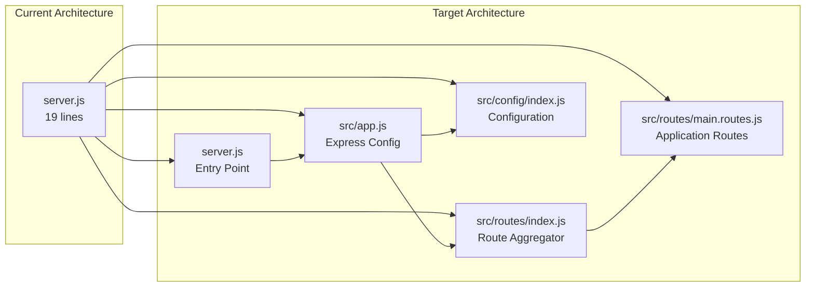
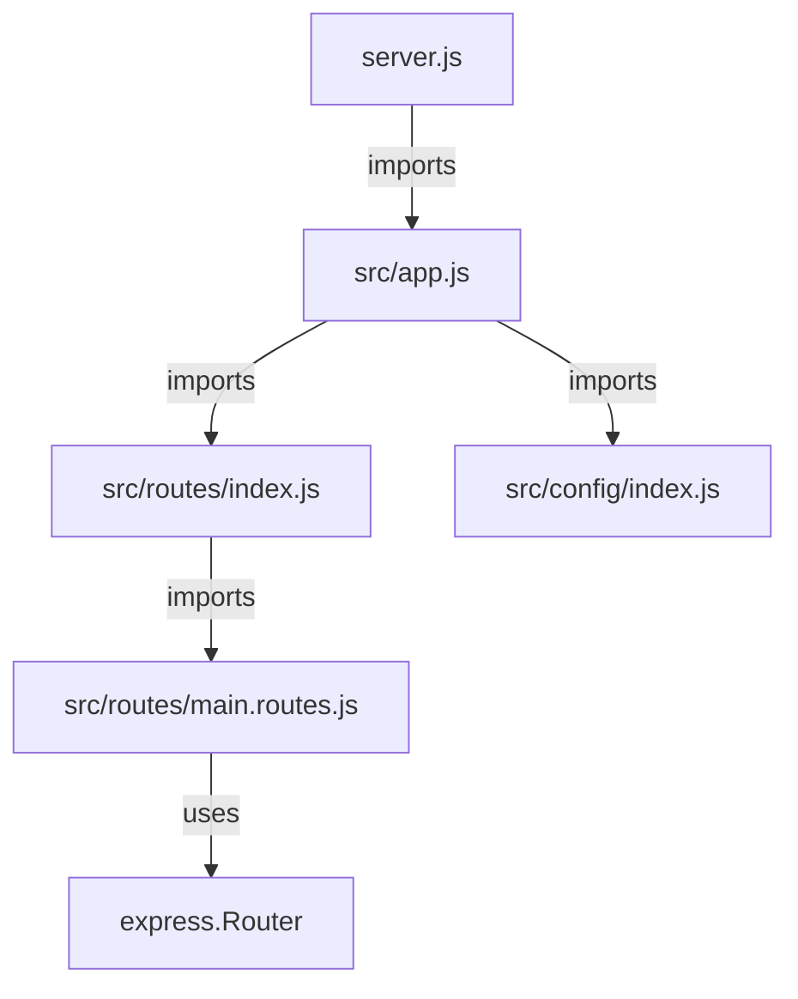
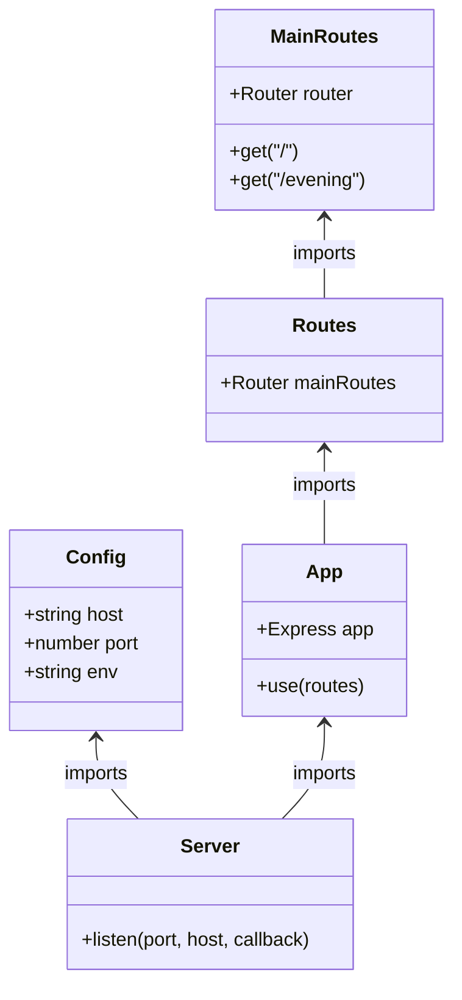
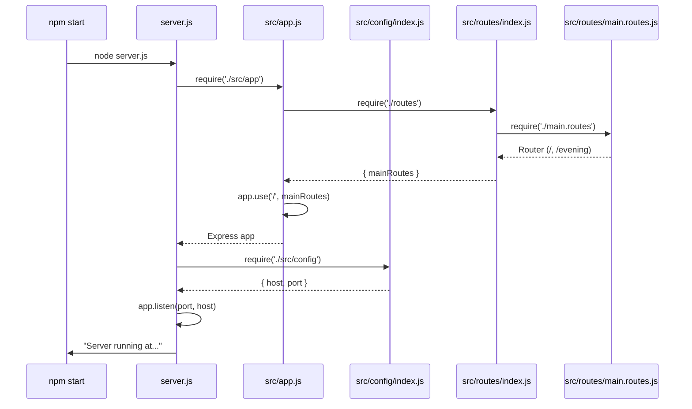

# Technical Specification

# 0. Agent Action Plan

## 0.1 Core Refactoring Objective

Based on the prompt, the Blitzy platform understands that the refactoring objective is to restructure the existing Node.js/Express.js application into a well-organized Express.js project architecture while preserving 100% of the original functionality.

### 0.1.1 Refactoring Type Classification

- **Refactoring Type**: Code structure reorganization with Express.js best practices application
- **Target Repository**: Same repository (in-place refactoring)
- **Migration Type**: Structural refactoring (no framework change - project already uses Express.js 5.1.0)

### 0.1.2 Primary Refactoring Goals

The Blitzy platform interprets the user's requirements as follows:

1. **Preserve All Existing Functionality**
   - Maintain the GET `/` route returning `"Hello, World!\n"`
   - Maintain the GET `/evening` route returning `"Good evening"`
   - Preserve identical response formats, HTTP status codes, and headers
   - Keep the server binding to `127.0.0.1:3000`

2. **Apply Express.js Project Structure Best Practices**
   - Separate the Express application configuration from the HTTP server initialization
   - Organize routes into dedicated route modules
   - Create proper middleware organization
   - Establish a configuration management layer
   - Implement proper separation of concerns

3. **Maintain Backward Compatibility**
   - The refactored application must pass all existing functionality tests
   - `npm start` must continue to work identically
   - Server startup logging must remain consistent

### 0.1.3 Implicit Requirements Identified

- **API Contract Preservation**: All public endpoints must maintain their exact signatures and response formats
- **Environment Compatibility**: Continue supporting Node.js v20.x as the runtime environment
- **Dependency Retention**: Keep Express 5.1.0 as the web framework
- **Test Enablement**: Refactored structure should support unit testing by separating app from server
- **Configuration Externalization**: Enable environment-based configuration for host and port settings

### 0.1.4 Current State Assessment

The existing project is a minimal Express.js application with all code concentrated in a single `server.js` file:

```
Current Structure:
/
├── .gitignore
├── README.md
├── package.json
├── package-lock.json
├── server.js (19 lines - monolithic entry point)
└── blitzy/
    └── documentation/
```

**Current server.js Implementation:**
- Single-file architecture combining app configuration, routes, and server initialization
- Hard-coded configuration values (hostname: '127.0.0.1', port: 3000)
- Two GET routes defined inline
- No separation between application and server concerns

### 0.1.5 Refactoring Success Criteria

| Criterion | Validation Method |
|-----------|-------------------|
| GET `/` returns "Hello, World!\n" | `curl http://127.0.0.1:3000/` |
| GET `/evening` returns "Good evening" | `curl http://127.0.0.1:3000/evening` |
| Server binds to 127.0.0.1:3000 | Console output verification |
| Application starts via `npm start` | Command execution |
| No breaking changes to external interface | Integration test suite |


## 0.2 Special Instructions and Constraints

### 0.2.1 User-Specified Directives

The user has explicitly requested:

> "Rewrite this Node.js server into a express.js refactor, keeping every feature and functionality exactly as in the original Node.js project. Ensure the rewritten version fully matches the behavior and logic of the current implementation."

**Key Directives Extracted:**
- **Functionality Preservation**: Every feature must remain exactly as in the original
- **Behavior Matching**: The refactored version must fully match the original behavior and logic
- **Express.js Structure**: Apply Express.js organizational best practices

### 0.2.2 Change Scope Preference

- **Scope**: Structural refactoring only - no functional changes
- **Approach**: Minimal-impact reorganization with Express.js conventions
- **Risk Level**: Low (preserving all existing functionality)

### 0.2.3 Technical Constraints

| Constraint | Value | Source |
|------------|-------|--------|
| Node.js Version | v20.19.5+ | Package environment |
| Express.js Version | 5.1.0 | package.json |
| Entry Point | server.js | package.json "main" field |
| Start Command | `npm start` → `node server.js` | package.json "scripts" |
| Server Binding | 127.0.0.1:3000 | Original implementation |

### 0.2.4 Functional Preservation Requirements

**Route Contracts to Maintain:**

| Route | Method | Response Body | Status Code | Content-Type |
|-------|--------|---------------|-------------|--------------|
| `/` | GET | `Hello, World!\n` | 200 | text/html |
| `/evening` | GET | `Good evening` | 200 | text/html |

**Behavioral Invariants:**
- Server startup console log: `Server running at http://127.0.0.1:3000/`
- Express response handling via `res.send()` method
- No additional middleware beyond Express defaults
- Synchronous route handlers (no async operations)

### 0.2.5 Setup and Build Considerations

- **No Build Step Required**: This is a pure Node.js application without transpilation
- **Direct Execution**: Application runs with `node server.js`
- **Dependencies**: Only express@^5.1.0 as production dependency
- **No Setup Instructions Provided**: Standard `npm install` workflow applies

### 0.2.6 Express.js Best Practices to Apply

Based on industry research, the following Express.js patterns will be applied:

1. **Separation of App and Server**
   - Create standalone `app.js` for Express application configuration
   - Keep `server.js` focused only on HTTP server initialization
   - This enables unit testing without starting the actual server

2. **Modular Route Organization**
   - Extract routes into a dedicated `routes/` directory
   - Create route modules that export Express Router instances
   - Register routes centrally in the application configuration

3. **Configuration Management**
   - Externalize configuration values (host, port) into a config module
   - Support environment variable overrides
   - Provide sensible defaults matching original behavior

4. **Clean Entry Point**
   - Maintain `server.js` as entry point for backward compatibility
   - Import the configured Express app from `app.js`
   - Initialize and start the HTTP server

### 0.2.7 Documentation Constraints

- Preserve existing README.md content (project identification)
- Update .gitignore if new folders are added
- Maintain package.json metadata and scripts


## 0.3 Technical Interpretation

This refactoring translates to the following technical transformation strategy:

### 0.3.1 Refactoring Translation Strategy

**Transform:** Single-file Express.js application
**Into:** Modular, well-structured Express.js project
**By:** Decomposing monolithic server.js into purpose-specific modules

### 0.3.2 Architecture Transformation Map


```mermaid
graph LR
    subgraph Current["Current Architecture"]
        A[server.js<br/>19 lines]
    end
    
    subgraph Target["Target Architecture"]
        B[server.js<br/>Entry Point]
        C[src/app.js<br/>Express Config]
        D[src/routes/index.js<br/>Route Aggregator]
        E[src/routes/main.routes.js<br/>Application Routes]
        F[src/config/index.js<br/>Configuration]
    end
    
    A --> B
    A --> C
    A --> D
    A --> E
    A --> F
    
    B --> C
    C --> D
    D --> E
    C --> F
```

### 0.3.3 Component Decomposition Plan

| Original Component | Target Location | Responsibility |
|-------------------|-----------------|----------------|
| Express app initialization | `src/app.js` | Create and configure Express application |
| Route definitions | `src/routes/main.routes.js` | Define GET `/` and GET `/evening` handlers |
| Route registration | `src/routes/index.js` | Aggregate and export all route modules |
| Configuration constants | `src/config/index.js` | Centralize host, port, and environment config |
| HTTP server startup | `server.js` | Import app, create HTTP server, listen on port |

### 0.3.4 Module Dependency Graph


```mermaid
graph TD
    A[server.js] -->|imports| B[src/app.js]
    B -->|imports| C[src/routes/index.js]
    B -->|imports| D[src/config/index.js]
    C -->|imports| E[src/routes/main.routes.js]
    E -->|uses| F[express.Router]
```

### 0.3.5 Technical Implementation Approach

**Phase 1: Create Directory Structure**
- Create `src/` directory for application source code
- Create `src/routes/` for route modules
- Create `src/config/` for configuration modules

**Phase 2: Extract Configuration**
- Move hostname and port constants to `src/config/index.js`
- Add environment variable support with defaults
- Export configuration object

**Phase 3: Extract Routes**
- Create Express Router in `src/routes/main.routes.js`
- Define GET `/` route handler
- Define GET `/evening` route handler
- Export the router

**Phase 4: Create App Module**
- Initialize Express app in `src/app.js`
- Import and mount routes
- Export configured app (do NOT call listen here)

**Phase 5: Refactor Entry Point**
- Update `server.js` to import app from `src/app.js`
- Import configuration from `src/config/index.js`
- Call `app.listen()` with configured host and port

### 0.3.6 Code Transformation Examples

**Original Pattern (server.js):**
```javascript
const express = require('express');
const hostname = '127.0.0.1';
const port = 3000;
const app = express();
app.get('/', (req, res) => res.send('Hello'));
app.listen(port, hostname);
```

**Target Pattern (Modular):**
```javascript
// server.js - Entry point only
const app = require('./src/app');
const config = require('./src/config');
app.listen(config.port, config.host);
```

### 0.3.7 Invariant Preservation Checklist

| Invariant | Preserved By |
|-----------|--------------|
| Route handler logic | Exact copy to route module |
| Response strings | No modification to response content |
| HTTP binding | Same host:port from config defaults |
| Startup message | Identical console.log in server.js |
| Entry point | server.js remains main entry |
| npm start command | No change to package.json scripts |


## 0.4 Source Analysis

### 0.4.1 Comprehensive Source File Discovery

**Repository Root Structure:**
```
/
├── .gitignore                 (172 bytes - git ignore rules)
├── README.md                  (73 bytes - project identifier)
├── package.json               (345 bytes - npm manifest)
├── package-lock.json          (34,769 bytes - dependency lock)
├── server.js                  (348 bytes - application entry point)
└── blitzy/
    └── documentation/
        ├── Project Guide.md   (existing documentation)
        └── Technical Specifications.md (existing documentation)
```

### 0.4.2 Primary Source File Analysis

**File: server.js (19 lines - Primary Refactoring Target)**

| Line Range | Content | Refactoring Action |
|------------|---------|-------------------|
| 1 | `const express = require('express');` | Move to src/app.js |
| 3 | `const hostname = '127.0.0.1';` | Move to src/config/index.js |
| 4 | `const port = 3000;` | Move to src/config/index.js |
| 6 | `const app = express();` | Move to src/app.js |
| 8-10 | GET `/` route handler | Move to src/routes/main.routes.js |
| 12-14 | GET `/evening` route handler | Move to src/routes/main.routes.js |
| 16-18 | `app.listen(...)` | Keep in server.js |

**Current server.js Complete Content:**
```javascript
const express = require('express');

const hostname = '127.0.0.1';
const port = 3000;

const app = express();

app.get('/', (req, res) => {
  res.send('Hello, World!\n');
});

app.get('/evening', (req, res) => {
  res.send('Good evening');
});

app.listen(port, hostname, () => {
  console.log(`Server running at http://${hostname}:${port}/`);
});
```

### 0.4.3 Secondary Source Files Analysis

**File: package.json (Manifest - Requires Update)**
```json
{
    "name": "hello_world",
    "version": "1.0.0",
    "description": "Hello world in Node.js",
    "main": "server.js",
    "scripts": {
        "start": "node server.js",
        "test": "echo \"Error: no test specified\" && exit 1"
    },
    "author": "hxu",
    "license": "MIT",
    "dependencies": {
        "express": "^5.1.0"
    }
}
```

**Refactoring Notes for package.json:**
- `"main": "server.js"` - Keep unchanged (server.js remains entry point)
- `"start": "node server.js"` - Keep unchanged
- May add test script for validation

**File: .gitignore (No changes required)**
```
# Dependencies
node_modules/

#### Environment variables
.env
.env.local

#### Logs
logs/
*.log
npm-debug.log*

#### OS files
.DS_Store
Thumbs.db

#### IDE
.vscode/
.idea/
*.swp
*.swo
```

**File: README.md (No changes required)**
```
# hao-backprop-test
test project for backprop integration. Do not touch!
```

### 0.4.4 Code Component Extraction Map

| Component Type | Current Location | Lines | Extract To |
|---------------|------------------|-------|------------|
| Express import | server.js:1 | 1 | src/app.js |
| Hostname constant | server.js:3 | 1 | src/config/index.js |
| Port constant | server.js:4 | 1 | src/config/index.js |
| App initialization | server.js:6 | 1 | src/app.js |
| Root route handler | server.js:8-10 | 3 | src/routes/main.routes.js |
| Evening route handler | server.js:12-14 | 3 | src/routes/main.routes.js |
| Server listen call | server.js:16-18 | 3 | server.js (refactored) |

### 0.4.5 Route Handler Analysis

**Route 1: Root Path (`/`)**
```javascript
app.get('/', (req, res) => {
  res.send('Hello, World!\n');
});
```
- Method: GET
- Path: `/`
- Response: Plain text with trailing newline
- Handler Type: Synchronous, stateless

**Route 2: Evening Path (`/evening`)**
```javascript
app.get('/evening', (req, res) => {
  res.send('Good evening');
});
```
- Method: GET
- Path: `/evening`
- Response: Plain text without trailing newline
- Handler Type: Synchronous, stateless

### 0.4.6 Dependency Analysis

**Direct Dependencies (from package-lock.json):**

| Package | Version | Type | Notes |
|---------|---------|------|-------|
| express | 5.1.0 | Production | Web framework |

**Transitive Dependencies (Key Packages):**

| Package | Version | Via | Notes |
|---------|---------|-----|-------|
| body-parser | 2.2.0 | express | Has moderate vulnerability (CVE-2025-13466) |
| accepts | 2.0.0 | express | Content negotiation |
| content-type | 1.0.5 | body-parser | MIME type parsing |
| raw-body | 3.0.0 | body-parser | Request body handling |

### 0.4.7 Complete File Inventory

| File Path | Status | Action Required |
|-----------|--------|-----------------|
| server.js | EXISTS | UPDATE (refactor to entry point only) |
| package.json | EXISTS | NO CHANGE (entry point unchanged) |
| package-lock.json | EXISTS | NO CHANGE (no dependency changes) |
| .gitignore | EXISTS | NO CHANGE |
| README.md | EXISTS | NO CHANGE |
| src/app.js | NOT EXISTS | CREATE (Express app configuration) |
| src/config/index.js | NOT EXISTS | CREATE (configuration module) |
| src/routes/index.js | NOT EXISTS | CREATE (route aggregator) |
| src/routes/main.routes.js | NOT EXISTS | CREATE (application routes) |
| blitzy/documentation/* | EXISTS | NO CHANGE (documentation preserved) |


## 0.5 Target Design

### 0.5.1 Refactored Project Structure

```
Target Structure:
/
├── .gitignore                      (UNCHANGED)
├── README.md                       (UNCHANGED)
├── package.json                    (UNCHANGED)
├── package-lock.json               (UNCHANGED)
├── server.js                       (UPDATED - entry point only)
├── src/
│   ├── app.js                      (NEW - Express app configuration)
│   ├── config/
│   │   └── index.js                (NEW - configuration management)
│   └── routes/
│       ├── index.js                (NEW - route aggregator)
│       └── main.routes.js          (NEW - application routes)
└── blitzy/
    └── documentation/              (UNCHANGED)
        ├── Project Guide.md
        └── Technical Specifications.md
```

### 0.5.2 New File Specifications

**File: src/config/index.js**
- Purpose: Centralize all configuration values with environment variable support
- Exports: Configuration object with host, port, and environment
- Default Values: Must match original implementation exactly

```javascript
// Specification for src/config/index.js
module.exports = {
  host: process.env.HOST || '127.0.0.1',
  port: parseInt(process.env.PORT, 10) || 3000,
  env: process.env.NODE_ENV || 'development'
};
```

**File: src/routes/main.routes.js**
- Purpose: Define application route handlers
- Exports: Express Router instance with GET `/` and GET `/evening`
- Behavior: Exact replica of original route handler logic

```javascript
// Specification for src/routes/main.routes.js
const express = require('express');
const router = express.Router();

router.get('/', (req, res) => {
  res.send('Hello, World!\n');
});

router.get('/evening', (req, res) => {
  res.send('Good evening');
});

module.exports = router;
```

**File: src/routes/index.js**
- Purpose: Aggregate all route modules for clean imports
- Exports: Object containing all route modules
- Pattern: Central route registry

```javascript
// Specification for src/routes/index.js
const mainRoutes = require('./main.routes');
module.exports = { mainRoutes };
```

**File: src/app.js**
- Purpose: Configure Express application without starting server
- Exports: Configured Express app instance
- Pattern: Separation of app configuration from server initialization

```javascript
// Specification for src/app.js
const express = require('express');
const { mainRoutes } = require('./routes');
const app = express();

// Mount routes at root path
app.use('/', mainRoutes);

module.exports = app;
```

**File: server.js (Refactored)**
- Purpose: HTTP server entry point only
- Imports: App from src/app.js, config from src/config
- Behavior: Start server with identical startup message

```javascript
// Specification for server.js (refactored)
const app = require('./src/app');
const config = require('./src/config');

app.listen(config.port, config.host, () => {
  console.log(`Server running at http://${config.host}:${config.port}/`);
});
```

### 0.5.3 Web Search Research Conducted

**Express.js Best Practices Applied:**

1. **Separation of App and Server** - Allows unit testing the Express app without starting the HTTP server. The app module exports the configured Express instance.

2. **Modular Architecture** - Express.js is a flexible, unopinionated framework. Organizing code into purpose-specific modules ensures scalability and maintainability.

3. **Router-Based Route Organization** - Using `express.Router()` for route modules enables clean separation and allows mounting routes at different base paths.

4. **Configuration Externalization** - Following the Twelve-Factor App methodology, configuration is externalized and loaded from environment variables with sensible defaults.

### 0.5.4 Design Pattern Applications

| Pattern | Application | Benefit |
|---------|-------------|---------|
| Module Pattern | Each file exports a single concern | Clear responsibilities, testability |
| Factory Pattern | src/app.js creates configured Express app | Enables multiple app instances for testing |
| Aggregator Pattern | src/routes/index.js collects routes | Single import point for all routes |
| Configuration Object | src/config/index.js exports config | Centralized, environment-aware settings |

### 0.5.5 Directory Structure Rationale

| Directory | Purpose | Convention Source |
|-----------|---------|-------------------|
| `src/` | Application source code | Industry standard for separating source from config |
| `src/routes/` | Route handler modules | Express.js convention for route organization |
| `src/config/` | Configuration modules | Node.js best practice for config management |

### 0.5.6 Module Interface Specifications


```mermaid
classDiagram
    class Config {
        +string host
        +number port
        +string env
    }
    
    class MainRoutes {
        +Router router
        +get("/")
        +get("/evening")
    }
    
    class Routes {
        +Router mainRoutes
    }
    
    class App {
        +Express app
        +use(routes)
    }
    
    class Server {
        +listen(port, host, callback)
    }
    
    Config <-- Server : imports
    App <-- Server : imports
    Routes <-- App : imports
    MainRoutes <-- Routes : imports
```

### 0.5.7 Startup Flow Specification


```mermaid
sequenceDiagram
    participant CLI as npm start
    participant Server as server.js
    participant App as src/app.js
    participant Config as src/config/index.js
    participant Routes as src/routes/index.js
    participant Main as src/routes/main.routes.js
    
    CLI->>Server: node server.js
    Server->>App: require('./src/app')
    App->>Routes: require('./routes')
    Routes->>Main: require('./main.routes')
    Main-->>Routes: Router (/, /evening)
    Routes-->>App: { mainRoutes }
    App->>App: app.use('/', mainRoutes)
    App-->>Server: Express app
    Server->>Config: require('./src/config')
    Config-->>Server: { host, port }
    Server->>Server: app.listen(port, host)
    Server->>CLI: "Server running at..."
```


## 0.6 Transformation Mapping

### 0.6.1 File-by-File Transformation Plan

| Target File | Transformation | Source File | Key Changes |
|-------------|----------------|-------------|-------------|
| server.js | UPDATE | server.js | Refactor to entry point only; import app from src/app.js; import config from src/config; retain app.listen() call with console.log |
| src/app.js | CREATE | server.js | Extract Express app initialization; import and mount routes; export configured app instance |
| src/config/index.js | CREATE | server.js | Extract hostname and port constants; add environment variable support with defaults |
| src/routes/index.js | CREATE | N/A | Create route aggregator module; import and export mainRoutes |
| src/routes/main.routes.js | CREATE | server.js | Extract GET '/' and GET '/evening' route handlers; use express.Router() |
| package.json | NO CHANGE | package.json | Entry point and scripts remain unchanged |
| package-lock.json | NO CHANGE | package-lock.json | No dependency changes |
| .gitignore | NO CHANGE | .gitignore | Already includes node_modules and IDE files |
| README.md | NO CHANGE | README.md | Project identifier preserved |

### 0.6.2 Detailed Code Transformation Specifications

**Transformation 1: server.js → server.js (UPDATE)**

| Original Code | Target Code | Transformation Type |
|--------------|-------------|---------------------|
| `const express = require('express');` | (removed - moved to src/app.js) | MOVE |
| `const hostname = '127.0.0.1';` | (removed - moved to src/config) | MOVE |
| `const port = 3000;` | (removed - moved to src/config) | MOVE |
| `const app = express();` | `const app = require('./src/app');` | REPLACE |
| `app.get('/', ...)` | (removed - moved to routes) | MOVE |
| `app.get('/evening', ...)` | (removed - moved to routes) | MOVE |
| `app.listen(port, hostname, ...)` | `const config = require('./src/config');`<br/>`app.listen(config.port, config.host, ...)` | REFACTOR |

**Target server.js Content:**
```javascript
const app = require('./src/app');
const config = require('./src/config');

app.listen(config.port, config.host, () => {
  console.log(`Server running at http://${config.host}:${config.port}/`);
});
```

**Transformation 2: server.js → src/app.js (CREATE)**

| Source Content | Target Implementation |
|----------------|----------------------|
| `const express = require('express');` | Import express |
| `const app = express();` | Initialize Express app |
| Route registration | Import routes and use app.use() |
| (new) | Export app instance |

**Target src/app.js Content:**
```javascript
const express = require('express');
const { mainRoutes } = require('./routes');

const app = express();

app.use('/', mainRoutes);

module.exports = app;
```

**Transformation 3: server.js → src/config/index.js (CREATE)**

| Source Content | Target Implementation |
|----------------|----------------------|
| `const hostname = '127.0.0.1';` | `host: process.env.HOST \|\| '127.0.0.1'` |
| `const port = 3000;` | `port: parseInt(process.env.PORT, 10) \|\| 3000` |
| (new) | `env: process.env.NODE_ENV \|\| 'development'` |

**Target src/config/index.js Content:**
```javascript
module.exports = {
  host: process.env.HOST || '127.0.0.1',
  port: parseInt(process.env.PORT, 10) || 3000,
  env: process.env.NODE_ENV || 'development'
};
```

**Transformation 4: server.js → src/routes/main.routes.js (CREATE)**

| Source Content | Target Implementation |
|----------------|----------------------|
| `app.get('/', (req, res) => {...});` | `router.get('/', (req, res) => {...});` |
| `app.get('/evening', (req, res) => {...});` | `router.get('/evening', (req, res) => {...});` |

**Target src/routes/main.routes.js Content:**
```javascript
const express = require('express');
const router = express.Router();

router.get('/', (req, res) => {
  res.send('Hello, World!\n');
});

router.get('/evening', (req, res) => {
  res.send('Good evening');
});

module.exports = router;
```

**Transformation 5: N/A → src/routes/index.js (CREATE)**

**Target src/routes/index.js Content:**
```javascript
const mainRoutes = require('./main.routes');

module.exports = {
  mainRoutes
};
```

### 0.6.3 Cross-File Dependency Updates

**Import Statement Transformations:**

| File | Original Import | New Import |
|------|-----------------|------------|
| server.js | `const express = require('express');` | `const app = require('./src/app');`<br/>`const config = require('./src/config');` |
| src/app.js | N/A (new file) | `const express = require('express');`<br/>`const { mainRoutes } = require('./routes');` |
| src/routes/main.routes.js | N/A (new file) | `const express = require('express');` |
| src/routes/index.js | N/A (new file) | `const mainRoutes = require('./main.routes');` |
| src/config/index.js | N/A (new file) | None (pure configuration) |

### 0.6.4 File Path Mapping Summary

| Source Path | Target Path | Operation |
|-------------|-------------|-----------|
| server.js | server.js | UPDATE |
| server.js (lines 1, 6) | src/app.js | EXTRACT |
| server.js (lines 3-4) | src/config/index.js | EXTRACT |
| server.js (lines 8-14) | src/routes/main.routes.js | EXTRACT |
| N/A | src/routes/index.js | CREATE |

### 0.6.5 Directory Creation Requirements

| Directory | Action | Purpose |
|-----------|--------|---------|
| src/ | CREATE | Application source root |
| src/config/ | CREATE | Configuration modules |
| src/routes/ | CREATE | Route handler modules |

### 0.6.6 One-Phase Execution Plan

**All transformations will be executed in a single phase:**

1. Create directory structure (`src/`, `src/config/`, `src/routes/`)
2. Create `src/config/index.js` (configuration module)
3. Create `src/routes/main.routes.js` (route handlers)
4. Create `src/routes/index.js` (route aggregator)
5. Create `src/app.js` (Express app configuration)
6. Update `server.js` (entry point refactoring)

**No files require deletion. All transformations are additive or updates.**

### 0.6.7 Transformation Validation Checklist

| Validation | Command | Expected Result |
|------------|---------|-----------------|
| Syntax check | `node -c server.js` | No syntax errors |
| App loads | `node -e "require('./src/app')"` | No errors |
| Config loads | `node -e "require('./src/config')"` | No errors |
| Routes load | `node -e "require('./src/routes')"` | No errors |
| Server starts | `npm start` | "Server running at http://127.0.0.1:3000/" |
| Root route | `curl http://127.0.0.1:3000/` | "Hello, World!\n" |
| Evening route | `curl http://127.0.0.1:3000/evening` | "Good evening" |


## 0.7 Dependency Inventory

### 0.7.1 Key Public Packages

| Registry | Package Name | Version | Purpose |
|----------|--------------|---------|---------|
| npm | express | ^5.1.0 | Web application framework - core dependency |

### 0.7.2 Transitive Dependencies (Express 5.1.0)

| Registry | Package Name | Version | Via | Purpose |
|----------|--------------|---------|-----|---------|
| npm | accepts | 2.0.0 | express | Content negotiation |
| npm | body-parser | 2.2.0 | express | Request body parsing (has vulnerability) |
| npm | content-disposition | 1.0.0 | express | Content-Disposition header handling |
| npm | content-type | 1.0.5 | body-parser | MIME type parsing |
| npm | cookie | 0.7.2 | express | Cookie parsing |
| npm | cookie-signature | 1.2.2 | express | Cookie signing |
| npm | debug | 4.4.0 | express, body-parser | Debug utility |
| npm | encodeurl | 2.0.0 | express | URL encoding |
| npm | escape-html | 1.0.3 | express | HTML escaping |
| npm | etag | 1.8.1 | express | ETag generation |
| npm | finalhandler | 2.1.0 | express | Final request handler |
| npm | fresh | 2.0.0 | express | HTTP cache freshness |
| npm | http-errors | 2.0.0 | body-parser, express | HTTP error creation |
| npm | merge-descriptors | 2.0.0 | express | Object descriptor merging |
| npm | mime-types | 3.0.0 | express | MIME type database |
| npm | on-finished | 2.4.1 | express, body-parser | Request/response finish event |
| npm | once | 1.4.0 | express | Ensure function called once |
| npm | parseurl | 1.3.3 | express | URL parsing |
| npm | proxy-addr | 2.0.7 | express | Proxy address handling |
| npm | qs | 6.14.0 | body-parser, express | Query string parsing |
| npm | range-parser | 1.2.1 | express | Range header parsing |
| npm | raw-body | 3.0.0 | body-parser | Raw request body |
| npm | router | 2.2.0 | express | Request routing |
| npm | safe-buffer | 5.2.1 | express | Safe buffer operations |
| npm | safer-buffer | 2.1.2 | iconv-lite | Safer buffer utilities |
| npm | send | 1.1.0 | express | Static file serving |
| npm | serve-static | 2.2.0 | express | Static file middleware |
| npm | statuses | 2.0.1 | express | HTTP status codes |
| npm | type-is | 2.0.0 | body-parser, express | Content-Type checking |
| npm | utils-merge | 1.0.1 | express | Object merging |
| npm | vary | 1.1.2 | express | Vary header handling |

### 0.7.3 Dependency Tree (Total: 68 packages)

```
hello_world@1.0.0
└── express@5.1.0
    ├── accepts@2.0.0
    ├── body-parser@2.2.0
    ├── content-disposition@1.0.0
    ├── cookie@0.7.2
    ├── debug@4.4.0
    ├── encodeurl@2.0.0
    ├── escape-html@1.0.3
    ├── etag@1.8.1
    ├── finalhandler@2.1.0
    ├── fresh@2.0.0
    ├── http-errors@2.0.0
    ├── merge-descriptors@2.0.0
    ├── mime-types@3.0.0
    ├── on-finished@2.4.1
    ├── parseurl@1.3.3
    ├── proxy-addr@2.0.7
    ├── qs@6.14.0
    ├── range-parser@1.2.1
    ├── router@2.2.0
    ├── safe-buffer@5.2.1
    ├── send@1.1.0
    ├── serve-static@2.2.0
    ├── statuses@2.0.1
    ├── type-is@2.0.0
    ├── utils-merge@1.0.1
    └── vary@1.1.2
```

### 0.7.4 Dependency Changes for Refactoring

**No Dependency Changes Required**

This refactoring is purely structural and does not require any dependency additions, removals, or version changes.

| Action | Packages Affected | Reason |
|--------|-------------------|--------|
| ADD | None | Refactoring uses only existing Express features |
| REMOVE | None | All dependencies still required |
| UPDATE | None | No version upgrades needed for structural refactoring |

### 0.7.5 Import Statement Updates

**Files Requiring Import Updates:**

| File | Import Changes |
|------|----------------|
| server.js | REPLACE: `const express = require('express');` WITH: `const app = require('./src/app');` AND ADD: `const config = require('./src/config');` |
| src/app.js | ADD: `const express = require('express');` AND `const { mainRoutes } = require('./routes');` |
| src/routes/main.routes.js | ADD: `const express = require('express');` |
| src/routes/index.js | ADD: `const mainRoutes = require('./main.routes');` |
| src/config/index.js | No imports required |

**Import Transformation Rules:**

| Old Pattern | New Pattern | Apply To |
|-------------|-------------|----------|
| `const express = require('express');` (in server.js) | `const app = require('./src/app');` | server.js |
| Direct app definition | Import from module | server.js |
| Inline constants | Config module import | server.js |
| `app.get()` route definitions | Router-based definitions | src/routes/main.routes.js |

### 0.7.6 Module Resolution Paths

| Import Statement | Resolution Path |
|------------------|-----------------|
| `require('./src/app')` | /src/app.js |
| `require('./src/config')` | /src/config/index.js |
| `require('./routes')` | /src/routes/index.js |
| `require('./main.routes')` | /src/routes/main.routes.js |
| `require('express')` | node_modules/express |

### 0.7.7 Configuration Reference Updates

**package.json Scripts (No Changes):**
```json
{
  "scripts": {
    "start": "node server.js",
    "test": "echo \"Error: no test specified\" && exit 1"
  }
}
```

**Rationale:** The entry point `server.js` remains unchanged, so the `npm start` command continues to work identically.

### 0.7.8 Known Vulnerabilities (Information Only)

The following vulnerabilities exist in the current dependency tree but are **out of scope** for this structural refactoring:

| Package | Version | Vulnerability | Severity | Advisory |
|---------|---------|---------------|----------|----------|
| body-parser | 2.2.0 | DoS via URL-encoded bodies | Moderate | GHSA-wqch-xfxh-vrr4 |
| express | 5.0.0-5.1.0 | Query property modification | Low | GHSA-pj86-cfqh-vqx6 |

**Note:** These vulnerabilities are not addressed in this refactoring scope as the user requested only structural changes while maintaining exact functionality. Security fixes would require additional dependency updates.


## 0.8 Scope Boundaries

### 0.8.1 Exhaustively In Scope

**Source Transformations:**
- server.js - Refactor to entry point only

**New File Creation:**
- src/app.js - Express application configuration
- src/config/index.js - Configuration management module
- src/routes/index.js - Route aggregator module
- src/routes/main.routes.js - Application route handlers

**Directory Creation:**
- src/ - Application source root
- src/config/ - Configuration modules
- src/routes/ - Route modules

**Configuration Files:**
- package.json - No changes (entry point unchanged)
- package-lock.json - No changes (no dependency changes)
- .gitignore - No changes (already covers necessary patterns)

**Documentation:**
- README.md - No changes (preserving existing content)
- blitzy/documentation/* - No changes (preserving existing documentation)

**Route Handlers (Exact Preservation):**
- GET `/` - Response: `"Hello, World!\n"`
- GET `/evening` - Response: `"Good evening"`

**Server Configuration (Preserved):**
- Host binding: `127.0.0.1`
- Port binding: `3000`
- Startup message: `"Server running at http://127.0.0.1:3000/"`

### 0.8.2 Explicitly Out of Scope

**Functional Changes:**
- ❌ Adding new routes or endpoints
- ❌ Modifying response content or format
- ❌ Changing HTTP methods or status codes
- ❌ Adding authentication or authorization
- ❌ Adding request logging middleware
- ❌ Adding error handling middleware
- ❌ Adding body parsing middleware beyond defaults

**Dependency Changes:**
- ❌ Adding new npm packages
- ❌ Removing existing packages
- ❌ Updating package versions
- ❌ Fixing security vulnerabilities (body-parser, express)

**Infrastructure Changes:**
- ❌ Docker containerization
- ❌ CI/CD pipeline configuration
- ❌ Deployment scripts
- ❌ Environment-specific configurations
- ❌ HTTPS/SSL configuration

**Testing:**
- ❌ Adding test frameworks (jest, mocha)
- ❌ Writing unit tests
- ❌ Writing integration tests
- ❌ Test coverage configuration

**Code Quality:**
- ❌ ESLint/Prettier configuration
- ❌ Code style formatting
- ❌ TypeScript migration
- ❌ JSDoc documentation

**Performance:**
- ❌ Caching strategies
- ❌ Compression middleware
- ❌ Rate limiting
- ❌ Performance monitoring

**Security Hardening:**
- ❌ Helmet.js security headers
- ❌ CORS configuration
- ❌ Input validation
- ❌ Sanitization middleware

**Database:**
- ❌ Database connections
- ❌ ORM/ODM integration
- ❌ Models or schemas

### 0.8.3 Boundary Validation

**In-Scope Validation:**

| Item | In Scope | Validation |
|------|----------|------------|
| Restructure server.js | ✅ | Code refactored to import from modules |
| Create src/app.js | ✅ | File exists with Express app export |
| Create src/config/index.js | ✅ | File exists with config export |
| Create src/routes/main.routes.js | ✅ | File exists with router export |
| Create src/routes/index.js | ✅ | File exists with route aggregation |
| Preserve GET `/` response | ✅ | Returns "Hello, World!\n" |
| Preserve GET `/evening` response | ✅ | Returns "Good evening" |
| Preserve server binding | ✅ | Binds to 127.0.0.1:3000 |
| Preserve startup message | ✅ | Logs exact message |
| npm start works | ✅ | Server starts successfully |

**Out-of-Scope Validation:**

| Item | Out of Scope | Reason |
|------|--------------|--------|
| Add new routes | ❌ | User requested exact functionality preservation |
| Update dependencies | ❌ | No dependency changes requested |
| Add security middleware | ❌ | Functional change not requested |
| Add test framework | ❌ | Not part of refactoring scope |
| Fix vulnerabilities | ❌ | Would require dependency updates |

### 0.8.4 File Scope Matrix

| File Path | Create | Update | Delete | No Change |
|-----------|--------|--------|--------|-----------|
| server.js | | ✅ | | |
| src/app.js | ✅ | | | |
| src/config/index.js | ✅ | | | |
| src/routes/index.js | ✅ | | | |
| src/routes/main.routes.js | ✅ | | | |
| package.json | | | | ✅ |
| package-lock.json | | | | ✅ |
| .gitignore | | | | ✅ |
| README.md | | | | ✅ |
| blitzy/documentation/* | | | | ✅ |

### 0.8.5 Scope Change Control

**If scope changes are requested, evaluate against:**

1. **Functionality Impact**: Does it change existing behavior?
2. **Dependency Impact**: Does it require new/updated packages?
3. **Compatibility Impact**: Does it affect Node.js/Express compatibility?
4. **Entry Point Impact**: Does it change how `npm start` works?

**Change Request Process:**
- Changes within scope: Proceed with implementation
- Changes outside scope: Require explicit user approval
- Breaking changes: Must be flagged and documented

### 0.8.6 Wildcard Pattern Summary

**Files In Scope (Specific Paths):**
```
server.js
src/app.js
src/config/index.js
src/routes/index.js
src/routes/main.routes.js
```

**Files Out of Scope (Explicit Exclusions):**
```
package.json
package-lock.json
.gitignore
README.md
blitzy/**/*
node_modules/**/*
```

**Directories Created:**
```
src/
src/config/
src/routes/
```


## 0.9 Special Instructions for Refactoring

### 0.9.1 User-Emphasized Requirements

The user explicitly emphasized the following requirements:

> "Rewrite this Node.js server into a express.js refactor, keeping every feature and functionality exactly as in the original Node.js project."

> "Ensure the rewritten version fully matches the behavior and logic of the current implementation."

### 0.9.2 Refactoring-Specific Mandates

**MUST Preserve:**
- All existing route handlers with identical behavior
- All response content exactly as currently implemented
- Server binding configuration (127.0.0.1:3000)
- Startup logging message format
- npm start command functionality
- Express 5.1.0 as the web framework

**MUST Apply:**
- Express.js project structure best practices
- Separation of app configuration from server initialization
- Modular route organization using express.Router()
- Configuration externalization with environment variable support
- Clean module exports and imports

**MUST NOT:**
- Add any new dependencies
- Remove any existing dependencies
- Change any HTTP response content
- Modify route paths or methods
- Add middleware not present in original implementation
- Change the entry point from server.js

### 0.9.3 Code Quality Standards

| Standard | Requirement |
|----------|-------------|
| Module Exports | Each module must have a single, clear export |
| Function Purity | Route handlers must remain synchronous and stateless |
| Configuration | Use environment variables with hard-coded defaults |
| Naming | Follow existing naming conventions (lowercase, kebab-case for files) |
| Comments | Minimal comments - code should be self-documenting |

### 0.9.4 Backward Compatibility Checklist

| Compatibility Aspect | Requirement | Verification |
|---------------------|-------------|--------------|
| Entry point | server.js | `node server.js` starts app |
| npm start | Works identically | `npm start` starts app |
| Root route | GET `/` returns "Hello, World!\n" | curl verification |
| Evening route | GET `/evening` returns "Good evening" | curl verification |
| Server host | Binds to 127.0.0.1 | netstat/ss verification |
| Server port | Listens on 3000 | netstat/ss verification |
| Startup message | Exact format preserved | Console output check |

### 0.9.5 Validation Commands

**Pre-Refactoring Baseline Capture:**
```bash
# Capture current behavior
npm start &
sleep 2
curl -s http://127.0.0.1:3000/ > /tmp/baseline_root.txt
curl -s http://127.0.0.1:3000/evening > /tmp/baseline_evening.txt
kill %1
```

**Post-Refactoring Validation:**
```bash
# Validate refactored behavior matches baseline
npm start &
sleep 2
curl -s http://127.0.0.1:3000/ | diff - /tmp/baseline_root.txt
curl -s http://127.0.0.1:3000/evening | diff - /tmp/baseline_evening.txt
kill %1
```

**Expected Results:**
- Both diff commands should produce no output (identical responses)
- Server startup message should be identical
- Process should exit cleanly

### 0.9.6 Rollback Plan

If the refactoring introduces issues:

1. **Git Revert**: Restore server.js to original state
2. **Remove New Files**: Delete src/ directory and contents
3. **Verify Recovery**: Run `npm start` and test both routes
4. **Document Issue**: Log what caused the failure

**Rollback Commands:**
```bash
# Restore original state
git checkout HEAD -- server.js
rm -rf src/
npm start
```

### 0.9.7 Implementation Sequence

The refactoring must be executed in this specific order to maintain a working application at each step:

1. **Create Directory Structure**
   - Create `src/`, `src/config/`, `src/routes/`

2. **Create Configuration Module**
   - Create `src/config/index.js`
   - Extract hostname and port with defaults

3. **Create Route Handlers**
   - Create `src/routes/main.routes.js`
   - Define both GET routes using Router

4. **Create Route Aggregator**
   - Create `src/routes/index.js`
   - Import and export mainRoutes

5. **Create App Module**
   - Create `src/app.js`
   - Initialize Express, mount routes, export app

6. **Update Entry Point**
   - Modify `server.js`
   - Import app and config
   - Keep only listen() call

7. **Validate**
   - Run syntax check
   - Start server
   - Test both routes
   - Verify identical behavior


