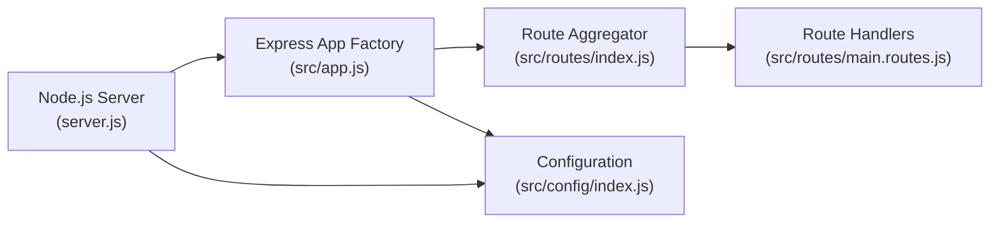
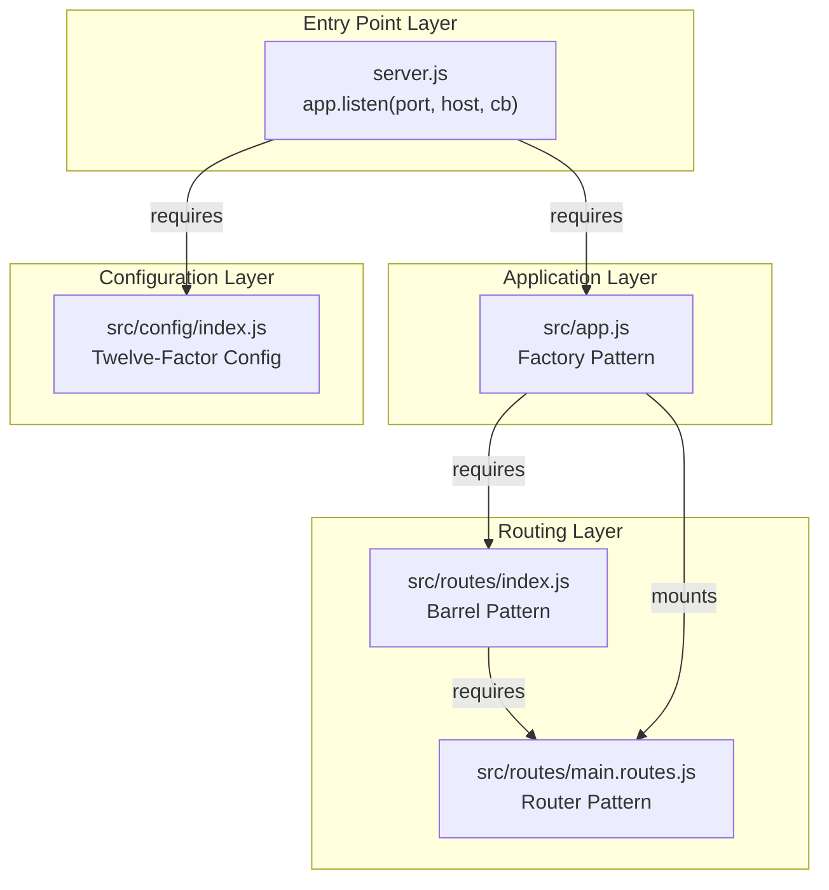

# Technical Specification

# 0. Agent Action Plan

## 0.1 Intent Clarification


### 0.1.1 Core Refactoring Objective

Based on the prompt, the Blitzy platform understands that the refactoring objective is to rewrite the existing Node.js server into a fully Express.js-based application while preserving every feature and functionality exactly as in the original implementation. The project (`hello_world@1.0.0`) is currently a Node.js tutorial server that already utilizes Express.js 5.1.0 as its web framework. The refactoring ensures the Express.js architecture is comprehensively applied, well-structured, and behavior-equivalent to the original Node.js server.

- **Refactoring type:** Tech stack migration — Node.js server to Express.js application
- **Target repository:** Same repository (in-place refactoring)
- **Refactoring goals:**
  - Rewrite the Node.js server entry point (`server.js`) to properly leverage Express.js application lifecycle patterns including binding, startup logging, and error handling
  - Maintain the Express application factory in `src/app.js` with route mounting via `app.use('/', mainRoutes)`
  - Preserve the modular configuration layer in `src/config/index.js` with environment variable support (`HOST`, `PORT`, `NODE_ENV`)
  - Retain the Express Router-based routing surface in `src/routes/` with barrel pattern aggregation
  - Ensure exact behavioral preservation of both HTTP endpoints: `GET /` returning `Hello, World!\n` and `GET /evening` returning `Good evening`
  - Maintain the comprehensive Jest/Supertest test suite with all 41 tests passing at 100% coverage
- **Implicit requirements:**
  - Maintain all public API contracts (status codes, response bodies, headers including `Content-Type: text/html; charset=utf-8`)
  - Preserve 404 behavior for undefined routes and unsupported HTTP methods
  - Retain CommonJS module system (`require`/`module.exports`) across all source files
  - Keep the factory pattern separation between app creation (`src/app.js`) and server binding (`server.js`) for testability
  - Preserve `'use strict'` directives in entry point and test files

### 0.1.2 Special Instructions and Constraints

- **Critical directive:** "Keeping every feature and functionality exactly as in the original Node.js project" — this mandates a behavior-preserving refactor with zero regression
- **API compatibility:** All public interfaces must remain unchanged:
  - `GET /` → HTTP 200, body `Hello, World!\n` (with trailing newline, 14 characters)
  - `GET /evening` → HTTP 200, body `Good evening` (no trailing newline, 12 characters)
  - Undefined routes → HTTP 404 with response body present
  - Unsupported methods on valid paths → HTTP 404
- **Test coverage:** All 41 existing tests across unit, integration, and lifecycle suites must continue passing with coverage thresholds met (branches ≥ 75%, functions ≥ 90%, lines ≥ 80%, statements ≥ 80%)
- **Module system:** CommonJS only — no migration to ES Modules
- **No new endpoints** or middleware are to be introduced
- **No new external dependencies** beyond what is already declared in `package.json`

User Example (exact requirement): *"Rewrite this Node.js server into a express.js refactor, keeping every feature and functionality exactly as in the original Node.js project. Ensure the rewritten version fully matches the behavior and logic of the current implementation."*

### 0.1.3 Technical Interpretation

This refactoring translates to the following technical transformation strategy: the existing Node.js server, which already leverages Express.js 5.1.0 for HTTP handling and routing, will be comprehensively updated to ensure the Express.js patterns are fully and correctly applied across the entire codebase. The transformation preserves the layered monolithic architecture consisting of four distinct layers — entry point (`server.js`), application factory (`src/app.js`), configuration (`src/config/`), and routing (`src/routes/`).


```mermaid
graph LR
    A["Node.js Server<br/>(server.js)"] --> B["Express App Factory<br/>(src/app.js)"]
    B --> C["Route Aggregator<br/>(src/routes/index.js)"]
    C --> D["Route Handlers<br/>(src/routes/main.routes.js)"]
    B --> E["Configuration<br/>(src/config/index.js)"]
    A --> E
```

The current architecture maps to the target architecture as follows:

| Current Component | Target Component | Transformation |
|-------------------|------------------|----------------|
| `server.js` — Entry point binding | `server.js` — Express app listener | Update to ensure Express.js lifecycle patterns |
| `src/app.js` — Express factory | `src/app.js` — Express factory | Update to maintain factory pattern with route mounting |
| `src/config/index.js` — Env config | `src/config/index.js` — Env config | Update to preserve synchronous config export |
| `src/routes/index.js` — Barrel export | `src/routes/index.js` — Barrel export | Update to maintain barrel aggregation |
| `src/routes/main.routes.js` — Router | `src/routes/main.routes.js` — Router | Update to preserve exact route contracts |
| `jest.config.js` — Test config | `jest.config.js` — Test config | Update to maintain coverage settings |
| `tests/**/*.test.js` — Test suites | `tests/**/*.test.js` — Test suites | Update to preserve all 41 test assertions |


## 0.2 Source Analysis


### 0.2.1 Comprehensive Source File Discovery

The complete repository has been exhaustively scanned using deep hierarchical exploration across all levels. Every source file, test file, configuration file, and documentation file has been identified and cataloged below. No files remain pending or undiscovered.

**Current Structure Mapping:**

```
hello_world/
├── server.js                         # Entry point — HTTP server binding (53 lines)
├── package.json                      # npm manifest — dependencies & scripts (22 lines)
├── package-lock.json                 # Lockfile — deterministic dependency graph
├── jest.config.js                    # Jest configuration — test environment & coverage (27 lines)
├── README.md                         # Project documentation (338 lines)
├── .gitignore                        # Git ignore patterns (20 lines)
├── src/                              # Application source root
│   ├── app.js                        # Express application factory (27 lines)
│   ├── config/                       # Configuration module
│   │   └── index.js                  # Environment variable management (41 lines)
│   └── routes/                       # Routing surface
│       ├── index.js                  # Route aggregator — barrel pattern (19 lines)
│       └── main.routes.js            # Route handlers — GET / and GET /evening (41 lines)
├── tests/                            # Test suite root
│   ├── unit/                         # Isolated module tests
│   │   ├── config.test.js            # Configuration defaults & parsing (140 lines)
│   │   └── routes.test.js            # Route handler structure verification (94 lines)
│   ├── integration/                  # HTTP endpoint tests
│   │   └── endpoints.test.js         # API contract tests via Supertest (125 lines)
│   └── lifecycle/                    # Server lifecycle tests
│       └── server.test.js            # Startup, shutdown, error handling (204 lines)
└── blitzy/                           # Documentation subtree
    └── documentation/
        ├── Project Guide.md          # Execution/verification guide
        └── Technical Specifications.md # Refactoring specification/contract
```

**Source Files Requiring Refactoring:**

| File Path | Type | Lines | Purpose | Refactoring Reason |
|-----------|------|-------|---------|-------------------|
| `server.js` | Entry Point | 53 | HTTP server binding via `app.listen()` | Rewrite to ensure Express.js lifecycle patterns |
| `src/app.js` | App Factory | 27 | Creates Express app, mounts routes | Rewrite to maintain factory pattern |
| `src/config/index.js` | Configuration | 41 | Exports `{host, port, env}` from env vars | Rewrite to preserve synchronous config |
| `src/routes/index.js` | Barrel Export | 19 | Aggregates route modules | Rewrite to maintain barrel pattern |
| `src/routes/main.routes.js` | Router | 41 | GET `/` and GET `/evening` handlers | Rewrite to preserve exact route contracts |
| `jest.config.js` | Test Config | 27 | Jest environment, coverage thresholds | Update for Express.js test structure |
| `package.json` | Manifest | 22 | Dependencies, scripts, metadata | Update for Express.js refactored project |
| `README.md` | Documentation | 338 | Usage, API reference, architecture | Update to reflect Express.js refactored state |
| `.gitignore` | Git Config | 20 | Ignore patterns for deps, env, logs | Update for Express.js project conventions |
| `tests/unit/config.test.js` | Unit Test | 140 | Config module defaults and parsing | Update to validate Express.js config behavior |
| `tests/unit/routes.test.js` | Unit Test | 94 | Router export and structure inspection | Update to validate Express Router structure |
| `tests/integration/endpoints.test.js` | Integration Test | 125 | HTTP endpoint contract tests | Update to validate Express.js endpoint behavior |
| `tests/lifecycle/server.test.js` | Lifecycle Test | 204 | Server startup/shutdown/error tests | Update to validate Express.js server lifecycle |

**Key Behavioral Contracts Identified in Source:**

- `server.js` line 49: `app.listen(config.port, config.host, () => {...})` — binds Express app to configured host/port
- `server.js` line 51: `console.log(\`Server running at http://${config.host}:${config.port}/\`)` — exact startup log format
- `src/app.js` line 17: `const app = express()` — Express application instantiation
- `src/app.js` line 25: `app.use('/', mainRoutes)` — route mounting at root path
- `src/config/index.js` line 26: `host: process.env.HOST || '127.0.0.1'` — default host binding
- `src/config/index.js` line 33: `port: parseInt(process.env.PORT, 10) || 3000` — numeric port with radix 10
- `src/config/index.js` line 40: `env: process.env.NODE_ENV || 'development'` — environment mode
- `src/routes/main.routes.js` line 27: `res.send('Hello, World!\n')` — exact root response with trailing newline
- `src/routes/main.routes.js` line 38: `res.send('Good evening')` — exact evening response without trailing newline


## 0.3 Target Design


### 0.3.1 Refactored Structure Planning

The target Express.js refactored structure preserves the existing layered monolithic architecture while ensuring all Express.js patterns are properly and comprehensively applied. Every file and folder is listed explicitly below — no configuration, dependency, or deployment files are omitted.

**Target Architecture:**

```
hello_world/
├── server.js                         # Entry point — Express app binding to host:port
├── package.json                      # npm manifest — express@^5.1.0, jest@^30.2.0, supertest@^7.1.4
├── package-lock.json                 # Lockfile — deterministic dependency resolution
├── jest.config.js                    # Jest config — node environment, coverage from server.js + src/**/*.js
├── README.md                         # Project documentation — Express.js architecture reference
├── .gitignore                        # Git ignore — node_modules, coverage, .env, logs, OS/IDE files
├── src/                              # Application source root
│   ├── app.js                        # Express application factory — creates app, mounts mainRoutes at /
│   ├── config/                       # Configuration layer
│   │   └── index.js                  # Synchronous env config — exports {host, port, env}
│   └── routes/                       # Express routing surface
│       ├── index.js                  # Route barrel — re-exports {mainRoutes} from main.routes.js
│       └── main.routes.js            # Express Router — GET / and GET /evening handlers
├── tests/                            # Jest test suite root
│   ├── unit/                         # Module contract tests
│   │   ├── config.test.js            # Config defaults, custom values, edge cases, type checks
│   │   └── routes.test.js            # Router export shape, route definitions, path ordering
│   ├── integration/                  # HTTP endpoint tests
│   │   └── endpoints.test.js         # Supertest-based API contract tests
│   └── lifecycle/                    # Server lifecycle tests
│       └── server.test.js            # Binding, logging, shutdown, error event handling
└── blitzy/                           # Documentation (read-only reference)
    └── documentation/
        ├── Project Guide.md
        └── Technical Specifications.md
```

**Layer-to-Component Mapping:**

| Layer | Directory | Key Express.js Pattern | Responsibility |
|-------|-----------|------------------------|----------------|
| Entry Point | `server.js` (root) | `app.listen(port, host, callback)` | Network binding, startup logging |
| Application | `src/app.js` | `express()` + `app.use('/', router)` | App creation, middleware/route mounting |
| Configuration | `src/config/index.js` | Twelve-Factor env config | Environment variable management with defaults |
| Routing | `src/routes/` | `express.Router()` + barrel exports | HTTP route handler definitions |
| Testing | `tests/` | Jest + Supertest | Unit, integration, and lifecycle verification |

### 0.3.2 Web Search Research Conducted

Research was conducted on Express.js refactoring best practices to validate the target architecture and patterns:

- **Express.js 5.x migration considerations:** Express 5.0 requires Node.js 18+ as the minimum supported version and removes several legacy methods. The existing codebase already targets Express 5.1.0 and does not use any deprecated methods (`app.del()`, `app.param(fn)`) — no migration adjustments are needed.
- **Node.js/Express.js project structure conventions:** Industry best practices recommend separating the Express app definition from the server listener into at least two files — `app.js` for application setup and `server.js` for binding. The current architecture already follows this pattern.
- **Separation of concerns:** Best practices advocate organizing code into distinct layers (config, routes, controllers, services) with a barrel/index pattern for clean imports. The existing `src/` structure with `config/`, `routes/`, and barrel `index.js` files aligns with these conventions.
- **Factory pattern for testability:** Creating the Express app in a separate module without calling `listen()` enables Supertest-based testing without network binding — this pattern is already implemented in `src/app.js`.

### 0.3.3 Design Pattern Applications

The following design patterns are applied in the target Express.js architecture, all of which are already present in the source and must be preserved through the refactor:

| Design Pattern | Implementation Location | Application |
|---------------|------------------------|-------------|
| **Factory Pattern** | `src/app.js` | Creates and exports a configured Express app without binding, enabling test harness injection |
| **Barrel Pattern** | `src/routes/index.js` | Aggregates route modules into a single import surface: `const { mainRoutes } = require('./routes')` |
| **Router Pattern** | `src/routes/main.routes.js` | Uses `express.Router()` to define route handlers separately from the app, enabling modular route composition |
| **Separation of Concerns** | `server.js` vs `src/app.js` | Server binding is isolated from app configuration, enabling independent testing |
| **Twelve-Factor Config** | `src/config/index.js` | Configuration externalized to environment variables (`HOST`, `PORT`, `NODE_ENV`) with safe defaults |
| **CommonJS Modules** | All `*.js` files | Consistent `require()`/`module.exports` pattern across entire codebase |


```mermaid
graph TB
    subgraph EntryPoint["Entry Point Layer"]
        Server["server.js<br/>app.listen(port, host, cb)"]
    end
    
    subgraph AppLayer["Application Layer"]
        App["src/app.js<br/>Factory Pattern"]
    end
    
    subgraph ConfigLayer["Configuration Layer"]
        Config["src/config/index.js<br/>Twelve-Factor Config"]
    end
    
    subgraph RoutingLayer["Routing Layer"]
        Barrel["src/routes/index.js<br/>Barrel Pattern"]
        Router["src/routes/main.routes.js<br/>Router Pattern"]
    end
    
    Server -->|"requires"| App
    Server -->|"requires"| Config
    App -->|"requires"| Barrel
    Barrel -->|"requires"| Router
    App -->|"mounts"| Router
```


## 0.4 Transformation Mapping


### 0.4.1 File-by-File Transformation Plan

Every target file is mapped to its corresponding source file with the specific transformation mode and key changes required. No files are omitted.

| Target File | Transformation | Source File | Key Changes |
|------------|----------------|-------------|-------------|
| `server.js` | UPDATE | `server.js` | Rewrite entry point to ensure Express.js app binding lifecycle with `app.listen(config.port, config.host, callback)`, preserve startup log format `Server running at http://<host>:<port>/` |
| `src/app.js` | UPDATE | `src/app.js` | Rewrite Express application factory to create app via `express()`, mount `mainRoutes` at root path with `app.use('/', mainRoutes)`, export configured app |
| `src/config/index.js` | UPDATE | `src/config/index.js` | Rewrite configuration module to synchronously export `{host, port, env}` from `process.env` with defaults `127.0.0.1`, `3000`, `development` and `parseInt(PORT, 10)` parsing |
| `src/routes/index.js` | UPDATE | `src/routes/index.js` | Rewrite barrel aggregator to require `./main.routes` and re-export as `{mainRoutes}` |
| `src/routes/main.routes.js` | UPDATE | `src/routes/main.routes.js` | Rewrite Express Router with exact route contracts: `GET /` → `res.send('Hello, World!\n')` and `GET /evening` → `res.send('Good evening')` |
| `package.json` | UPDATE | `package.json` | Update manifest to reflect Express.js refactored project — maintain `express@^5.1.0`, `jest@^30.2.0`, `supertest@^7.1.4`, all scripts |
| `package-lock.json` | UPDATE | `package-lock.json` | Regenerate lockfile to maintain deterministic dependency resolution |
| `jest.config.js` | UPDATE | `jest.config.js` | Update Jest configuration preserving node environment, `testMatch`, coverage collection from `server.js` and `src/**/*.js`, and threshold enforcement |
| `README.md` | UPDATE | `README.md` | Update documentation to accurately describe the Express.js refactored architecture, endpoints, environment variables, and test suite |
| `.gitignore` | UPDATE | `.gitignore` | Update git ignore patterns for Express.js project — maintain `node_modules/`, `coverage/`, `.env`, logs, OS/IDE patterns |
| `tests/unit/config.test.js` | UPDATE | `tests/unit/config.test.js` | Rewrite config unit tests preserving all default value, custom value, edge case, and type checking assertions |
| `tests/unit/routes.test.js` | UPDATE | `tests/unit/routes.test.js` | Rewrite route unit tests preserving Router export shape, route layer introspection, method verification, and path ordering assertions |
| `tests/integration/endpoints.test.js` | UPDATE | `tests/integration/endpoints.test.js` | Rewrite integration tests preserving Supertest-based endpoint contract verification for GET `/`, GET `/evening`, 404 handling, and edge cases |
| `tests/lifecycle/server.test.js` | UPDATE | `tests/lifecycle/server.test.js` | Rewrite lifecycle tests preserving mock-based server binding, startup log, custom config, graceful shutdown, and EADDRINUSE error handling assertions |

### 0.4.2 Cross-File Dependencies

Import relationships that must be preserved exactly through the refactoring:

**Application Import Chain:**

| Importing File | Import Statement | Imported Module | Export Shape |
|---------------|-----------------|-----------------|-------------|
| `server.js` | `const app = require('./src/app')` | `src/app.js` | `express.Application` |
| `server.js` | `const config = require('./src/config')` | `src/config/index.js` | `{host, port, env}` |
| `src/app.js` | `const express = require('express')` | `express` (npm) | Express framework |
| `src/app.js` | `const { mainRoutes } = require('./routes')` | `src/routes/index.js` | `{mainRoutes}` |
| `src/routes/index.js` | `const mainRoutes = require('./main.routes')` | `src/routes/main.routes.js` | `express.Router` |
| `src/routes/main.routes.js` | `const express = require('express')` | `express` (npm) | Express framework |

**Test Import Chain:**

| Test File | Import Statement | Imported Module |
|-----------|-----------------|-----------------|
| `tests/integration/endpoints.test.js` | `const request = require('supertest')` | `supertest` (npm) |
| `tests/integration/endpoints.test.js` | `const app = require('../../src/app')` | `src/app.js` |
| `tests/unit/config.test.js` | `require('../../src/config')` | `src/config/index.js` |
| `tests/unit/routes.test.js` | `require('../../src/routes/main.routes')` | `src/routes/main.routes.js` |
| `tests/lifecycle/server.test.js` | `jest.doMock('../../src/app', ...)` | `src/app.js` (mocked) |
| `tests/lifecycle/server.test.js` | `jest.doMock('../../src/config', ...)` | `src/config/index.js` (mocked) |
| `tests/lifecycle/server.test.js` | `require('../../server')` | `server.js` |

### 0.4.3 Wildcard Patterns

Wildcard patterns are used sparingly and only with trailing patterns for file group identification:

| Pattern | Scope | Purpose |
|---------|-------|---------|
| `src/**/*.js` | All application source files | Coverage collection, import updates |
| `src/routes/*.js` | Route module files | Router pattern and barrel export updates |
| `src/config/*.js` | Configuration module files | Environment config updates |
| `tests/**/*.test.js` | All test suite files | Test import and assertion updates |
| `tests/unit/*.test.js` | Unit test files | Module contract test updates |
| `tests/integration/*.test.js` | Integration test files | HTTP endpoint test updates |
| `tests/lifecycle/*.test.js` | Lifecycle test files | Server lifecycle test updates |

### 0.4.4 One-Phase Execution

The entire refactor will be executed by Blitzy in **ONE phase**. All 14 files listed in the transformation plan above are included in a single execution phase. There is no splitting of the project into multiple phases — every source file, test file, configuration file, and documentation file is updated simultaneously to maintain consistency and prevent intermediate broken states.

**Single-Phase File Count:** 14 files total
- Application source: 5 files (`server.js`, `src/app.js`, `src/config/index.js`, `src/routes/index.js`, `src/routes/main.routes.js`)
- Configuration: 3 files (`package.json`, `jest.config.js`, `.gitignore`)
- Lockfile: 1 file (`package-lock.json`)
- Documentation: 1 file (`README.md`)
- Tests: 4 files (`tests/unit/config.test.js`, `tests/unit/routes.test.js`, `tests/integration/endpoints.test.js`, `tests/lifecycle/server.test.js`)


## 0.5 Dependency Inventory


### 0.5.1 Key Private and Public Packages

All package names and versions are sourced directly from `package.json` and verified against `package-lock.json` locked versions. No placeholder versions are used.

**Runtime Dependencies:**

| Registry | Package Name | Version (Range) | Locked Version | Purpose |
|----------|-------------|-----------------|----------------|---------|
| npm | `express` | `^5.1.0` | `5.1.0` | Express.js web framework — HTTP handling, routing, middleware infrastructure |

**Development Dependencies:**

| Registry | Package Name | Version (Range) | Locked Version | Purpose |
|----------|-------------|-----------------|----------------|---------|
| npm | `jest` | `^30.2.0` | `30.2.0` | JavaScript testing framework — test runner, assertions, mocking, coverage |
| npm | `supertest` | `^7.1.4` | `7.1.4` | HTTP assertion library — in-process endpoint testing without TCP binding |

**Runtime Environment:**

| Component | Required Version | Installed Version | Source |
|-----------|-----------------|-------------------|--------|
| Node.js | ≥ 18.x (recommended 20.19.x LTS) | v20.20.0 | `README.md`, `package-lock.json` engine constraints |
| npm | ≥ 8.x (recommended 10.8.x) | 11.1.0 | `README.md` |

### 0.5.2 Dependency Updates

**Import Refactoring:**

No import paths change as a result of this refactor. All internal import statements are preserved exactly as-is since the directory structure remains identical. The following import patterns must remain stable:

- `src/**/*.js` — Internal imports using relative paths (`./routes`, `./main.routes`, `./config`)
- `tests/**/*.test.js` — Test imports using relative paths (`../../src/app`, `../../src/config`, `../../src/routes/main.routes`, `../../server`)

**Import Transformation Rules (preservation):**

| File Pattern | Import Statement | Status |
|-------------|-----------------|--------|
| `server.js` | `require('./src/app')` | Preserve |
| `server.js` | `require('./src/config')` | Preserve |
| `src/app.js` | `require('express')` | Preserve |
| `src/app.js` | `require('./routes')` | Preserve |
| `src/routes/index.js` | `require('./main.routes')` | Preserve |
| `src/routes/main.routes.js` | `require('express')` | Preserve |
| `tests/integration/endpoints.test.js` | `require('supertest')` | Preserve |
| `tests/integration/endpoints.test.js` | `require('../../src/app')` | Preserve |
| `tests/unit/config.test.js` | `require('../../src/config')` | Preserve |
| `tests/unit/routes.test.js` | `require('../../src/routes/main.routes')` | Preserve |
| `tests/lifecycle/server.test.js` | `jest.doMock('../../src/app', ...)` | Preserve |
| `tests/lifecycle/server.test.js` | `jest.doMock('../../src/config', ...)` | Preserve |
| `tests/lifecycle/server.test.js` | `require('../../server')` | Preserve |

**External Reference Updates:**

| File Pattern | Type | Update Required |
|-------------|------|-----------------|
| `package.json` | Build manifest | Update metadata to reflect Express.js refactored project |
| `package-lock.json` | Lockfile | Regenerate to maintain deterministic installs |
| `jest.config.js` | Test config | Maintain coverage paths `server.js` and `src/**/*.js` |
| `README.md` | Documentation | Update architecture description and design pattern documentation |
| `.gitignore` | Git config | Maintain existing ignore patterns |


## 0.6 Scope Boundaries


### 0.6.1 Exhaustively In Scope

All files and patterns included in this Express.js refactoring effort, organized by category with trailing wildcard patterns:

**Source Transformations:**

| Pattern | Files Matched | Transformation |
|---------|---------------|----------------|
| `server.js` | `server.js` | UPDATE — Express app binding entry point |
| `src/app.js` | `src/app.js` | UPDATE — Express application factory |
| `src/config/*.js` | `src/config/index.js` | UPDATE — Synchronous environment configuration |
| `src/routes/*.js` | `src/routes/index.js`, `src/routes/main.routes.js` | UPDATE — Route barrel and Express Router handlers |

**Test Updates:**

| Pattern | Files Matched | Transformation |
|---------|---------------|----------------|
| `tests/unit/*.test.js` | `tests/unit/config.test.js`, `tests/unit/routes.test.js` | UPDATE — Module contract verification |
| `tests/integration/*.test.js` | `tests/integration/endpoints.test.js` | UPDATE — HTTP endpoint contract tests |
| `tests/lifecycle/*.test.js` | `tests/lifecycle/server.test.js` | UPDATE — Server lifecycle behavior tests |

**Configuration Updates:**

| Pattern | Files Matched | Transformation |
|---------|---------------|----------------|
| `package.json` | `package.json` | UPDATE — npm manifest and scripts |
| `package-lock.json` | `package-lock.json` | UPDATE — Lockfile regeneration |
| `jest.config.js` | `jest.config.js` | UPDATE — Test configuration and coverage |
| `.gitignore` | `.gitignore` | UPDATE — Git ignore patterns |

**Documentation Updates:**

| Pattern | Files Matched | Transformation |
|---------|---------------|----------------|
| `README.md` | `README.md` | UPDATE — Project documentation |

**Import Corrections:**

- Every file containing internal `require()` statements referencing `./src/app`, `./src/config`, `./routes`, `./main.routes`, or `../../server` — all import paths are preserved as-is since the directory structure does not change

### 0.6.2 Explicitly Out of Scope

The following items are explicitly excluded from this refactoring effort based on the user's directive to maintain exact feature parity:

| Exclusion | Reason |
|-----------|--------|
| New HTTP endpoints (e.g., `/health`, `/status`) | User specified "keeping every feature and functionality exactly" — no additions |
| Additional middleware (e.g., `helmet`, `cors`, `morgan`) | Not present in original; adding would alter behavior |
| Database integration | No database exists in the original project |
| Authentication/authorization | Not present in original project |
| Logging framework (e.g., `winston`, `pino`) | Original uses only `console.log` for startup message |
| APM/monitoring tooling | Not present in original; out of scope for tutorial project |
| Containerization (Docker) | No Docker files exist in original project |
| CI/CD pipeline configuration | No CI/CD files exist in original project |
| ES Module migration | Original uses CommonJS; user did not request module system change |
| TypeScript migration | Original uses JavaScript with JSDoc annotations; no TS conversion requested |
| New test suites or test frameworks | Existing 41 tests with 100% coverage are sufficient |
| `blitzy/documentation/` files | Read-only reference documentation; not part of application code |
| `node_modules/` directory | Generated content; not directly managed |
| `coverage/` directory | Generated content; produced by test runner |


## 0.7 Refactoring Rules


The following refactoring rules are derived from the user's explicit directive to keep "every feature and functionality exactly as in the original Node.js project" and to ensure the "rewritten version fully matches the behavior and logic of the current implementation."

**Behavioral Preservation Rules:**

| Rule ID | Rule | Enforcement |
|---------|------|-------------|
| R-001 | `GET /` must return HTTP 200 with body `Hello, World!\n` (14 chars, trailing newline) | Integration test: `endpoints.test.js` asserts `response.text === 'Hello, World!\n'` |
| R-002 | `GET /evening` must return HTTP 200 with body `Good evening` (12 chars, no trailing newline) | Integration test: `endpoints.test.js` asserts `response.text === 'Good evening'` |
| R-003 | Both endpoints must return `Content-Type: text/html; charset=utf-8` | Integration test: asserts header matches `/text\/html/` and `/charset=utf-8/i` |
| R-004 | Undefined routes must return HTTP 404 with a response body present | Integration test: `assert404Response` checks `status === 404` and `text` is defined |
| R-005 | Unsupported HTTP methods on valid paths must return HTTP 404 | Integration test: POST `/`, PUT `/evening`, DELETE `/` all return 404 |
| R-006 | Query parameters must not alter response bodies | Integration test: `/?param=value` and `/evening?time=late` return unchanged bodies |

**Structural Preservation Rules:**

| Rule ID | Rule | Enforcement |
|---------|------|-------------|
| R-007 | `server.js` must not create the Express app — it requires `./src/app` | Lifecycle test: mocks `src/app` and asserts `listen` is called |
| R-008 | `src/app.js` must export a configured Express.Application without calling `listen()` | Integration test: Supertest uses `request(app)` without binding |
| R-009 | `src/config/index.js` must export `{host, port, env}` synchronously | Unit test: asserts exported object has all three properties |
| R-010 | `src/routes/index.js` must export `{mainRoutes}` via barrel pattern | Unit test (routes): requires and destructures `{mainRoutes}` |
| R-011 | `src/routes/main.routes.js` must export an Express Router with exactly 2 route layers | Unit test: `getRouteLayers(router).length === 2` |
| R-012 | Route registration order must be `/` before `/evening` | Unit test: `rootIndex < eveningIndex` |
| R-013 | All source files must use CommonJS (`require`/`module.exports`) | Structural requirement across all `*.js` files |

**Configuration Preservation Rules:**

| Rule ID | Rule | Enforcement |
|---------|------|-------------|
| R-014 | Default host must be `127.0.0.1` when `HOST` env var is unset | Unit test: `config.host === '127.0.0.1'` |
| R-015 | Default port must be `3000` when `PORT` env var is unset | Unit test: `config.port === 3000` |
| R-016 | Default env must be `development` when `NODE_ENV` is unset | Unit test: `config.env === 'development'` |
| R-017 | Port must be parsed with `parseInt(value, 10)` — invalid strings fallback to `3000` | Unit test: `PORT='abc'` → `3000`, `PORT=''` → `3000` |
| R-018 | Startup log must match format `Server running at http://<host>:<port>/` | Lifecycle test: `consoleSpy` asserts exact message format |

**Testing Preservation Rules:**

| Rule ID | Rule | Enforcement |
|---------|------|-------------|
| R-019 | All 41 existing tests must pass | `npm test` — 41 passed, 0 failed |
| R-020 | Coverage thresholds must be met: branches ≥ 75%, functions ≥ 90%, lines ≥ 80%, statements ≥ 80% | `jest.config.js` enforces global thresholds |
| R-021 | Server lifecycle tests must validate EADDRINUSE error handling without throwing | Lifecycle test: `expect(() => errorHandler(errnoException)).not.toThrow()` |
| R-022 | Server must support graceful shutdown via `server.close(callback)` | Lifecycle test: asserts `close` mock is called and callback invoked |


## 0.8 References


### 0.8.1 Repository Files Searched

The following files and folders were comprehensively searched across the codebase to derive the conclusions in this Agent Action Plan:

**Source Files (read in full):**

| File Path | Purpose | Key Findings |
|-----------|---------|-------------|
| `server.js` | Entry point | Express app binding at `config.port`/`config.host`, startup log with template literal |
| `src/app.js` | Application factory | `express()` instantiation, `app.use('/', mainRoutes)` mounting, no `listen()` call |
| `src/config/index.js` | Configuration | Synchronous export of `{host, port, env}`, `parseInt(PORT, 10)` with radix, three env var defaults |
| `src/routes/index.js` | Route aggregator | Barrel pattern re-exporting `{mainRoutes}` from `./main.routes` |
| `src/routes/main.routes.js` | Route handlers | `express.Router()` with GET `/` → `'Hello, World!\n'` and GET `/evening` → `'Good evening'` |
| `package.json` | npm manifest | `express@^5.1.0`, `jest@^30.2.0`, `supertest@^7.1.4`, 5 scripts defined |
| `jest.config.js` | Jest config | Node environment, `testMatch` pattern, coverage thresholds and collection patterns |
| `README.md` | Documentation | Prerequisites, API reference, project structure, environment variables, architecture diagrams |
| `.gitignore` | Git ignore | Patterns for `node_modules/`, `coverage/`, `.env`, logs, OS/IDE files |

**Test Files (read in full):**

| File Path | Purpose | Key Findings |
|-----------|---------|-------------|
| `tests/unit/config.test.js` | Config unit tests | 13 tests covering defaults, custom values, edge cases, type checking, structure |
| `tests/unit/routes.test.js` | Routes unit tests | 7 tests covering Router export shape, route definitions, method verification, ordering |
| `tests/integration/endpoints.test.js` | Endpoint tests | 11 tests covering GET `/`, GET `/evening`, 404 handling, unsupported methods, edge cases |
| `tests/lifecycle/server.test.js` | Lifecycle tests | 5 tests covering binding, logging, custom config, shutdown, EADDRINUSE error handling |

**Folders Explored:**

| Folder Path | Depth | Children Found |
|-------------|-------|----------------|
| `` (root) | Level 0 | 6 files, 3 folders |
| `src/` | Level 1 | 1 file, 2 folders |
| `src/config/` | Level 2 | 1 file |
| `src/routes/` | Level 2 | 2 files |
| `tests/` | Level 1 | 3 folders |
| `tests/unit/` | Level 2 | 2 files |
| `tests/integration/` | Level 2 | 1 file |
| `tests/lifecycle/` | Level 2 | 1 file |
| `blitzy/` | Level 1 | 1 folder |
| `blitzy/documentation/` | Level 2 | 2 files |

**Tech Spec Sections Retrieved:**

| Section | Key Information Used |
|---------|---------------------|
| 1.1 Executive Summary | Project name, version, author, stakeholders |
| 3.1 Programming Languages | Node.js 18+ minimum, 20.19.x recommended, CommonJS modules |
| 3.2 Frameworks & Libraries | Express.js `^5.1.0` specification and locked version `5.1.0` |
| 3.3 Open Source Dependencies | Complete dependency inventory with transitive dependencies |
| 9.13 PROJECT DIRECTORY STRUCTURE | Canonical file tree and layer-to-directory mapping |

### 0.8.2 External Research Sources

| Topic Researched | Key Insight Applied |
|-----------------|---------------------|
| Express.js 5.x migration changes | Validated that no deprecated methods are used in the current codebase |
| Node.js/Express.js project structure best practices | Confirmed separation of `app.js` and `server.js` follows industry conventions |
| Express.js factory pattern for testability | Validated that creating app without binding enables Supertest testing |
| Twelve-Factor App configuration methodology | Confirmed env-based config pattern aligns with best practices |

### 0.8.3 Attachments and External Metadata

- **Attachments provided:** None
- **Figma URLs provided:** None
- **Environment variables configured:** None specified by user (project uses `HOST`, `PORT`, `NODE_ENV` internally)
- **Secrets configured:** None specified by user
- **Setup instructions provided:** None provided by user


