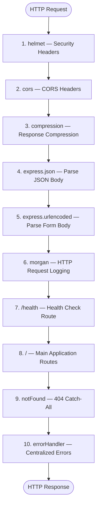
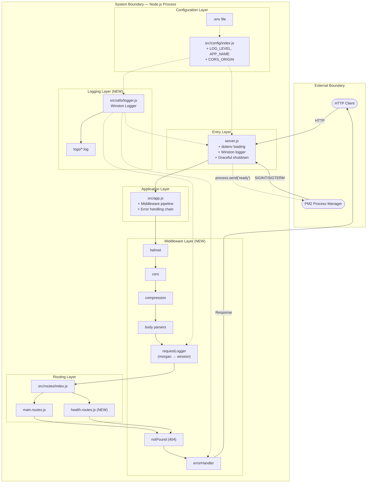

# Technical Specification

# 0. Agent Action Plan

## 0.1 Intent Clarification

### 0.1.1 Core Objective

Based on the provided requirements, the Blitzy platform understands that the objective is to evolve the existing `hello_world` tutorial HTTP server — currently a minimal Express.js 5.1.0 application with two GET endpoints and no middleware — into a production-ready Express.js application with a comprehensive middleware pipeline, structured logging, enhanced environment configuration, and PM2 process management for deployment readiness.

Specifically, the user's instruction — *"Enhance this basic HTTP server with Express.js framework, add routing, middleware, environment config, logging, and prepare for production deployment with PM2"* — translates to the following discrete requirements:

- **Enhance with Express.js framework** — The Express.js 5.1.0 foundation is already in place (`src/app.js`). Enhancement means introducing the full Express middleware ecosystem: body parsing (`express.json()`, `express.urlencoded()`), security headers, CORS support, response compression, and centralized error handling to transform the minimal tutorial app into an industry-standard Express.js application.
- **Add routing** — The current routing layer (`src/routes/main.routes.js`) defines only `GET /` and `GET /evening`. Enhancement requires adding a health check endpoint (`GET /health`) for production readiness and PM2 monitoring, and reorganizing routes to demonstrate Express Router best practices at scale.
- **Add middleware** — No application-level middleware currently exists in `src/app.js`. This requires building a complete middleware pipeline: HTTP request logging (Morgan), security hardening (Helmet), cross-origin resource sharing (CORS), response compression, JSON/URL-encoded body parsing, and a centralized error-handling middleware chain with a 404 catch-all handler.
- **Add environment config** — The current `src/config/index.js` reads three variables (`HOST`, `PORT`, `NODE_ENV`) directly from `process.env` with hardcoded defaults. Enhancement requires `.env` file support via the `dotenv` package, expanded configuration parameters (log level, app name, CORS origins), and an `.env.example` template for developer onboarding.
- **Add logging** — No structured logging exists; `server.js` uses raw `console.log()`. This requires implementing Winston as the application-level structured logger with configurable log levels, file-based transports for production, and Morgan integration as an Express middleware for HTTP request/response logging.
- **Prepare for production deployment with PM2** — No process management infrastructure exists. This requires creating a PM2 `ecosystem.config.js` with cluster mode configuration, environment-specific settings, log management, and graceful shutdown signal handling in `server.js`.

Implicit requirements detected:
- The `.gitignore` must be updated to exclude `.env` files and `logs/` directories
- The existing 100% test coverage standard (41 tests, all passing) must be preserved; new middleware and routes require corresponding test coverage
- The App Factory Pattern in `src/app.js` and the Barrel Pattern in `src/routes/index.js` must be maintained as the project's established architectural conventions
- PM2 graceful shutdown requires `SIGINT`/`SIGTERM` signal handlers in `server.js`
- A `logs/` directory structure is needed for Winston file transports in production

### 0.1.2 Task Categorization

- **Primary task type:** Mixed (Feature Enhancement + Configuration + Production Readiness)
- **Secondary aspects:** Middleware integration, logging infrastructure, process management, developer experience improvement
- **Scope classification:** Cross-cutting change — Impacts the Entry Layer (`server.js`), Application Layer (`src/app.js`), Routing Layer (`src/routes/`), Configuration Layer (`src/config/`), and introduces new layers (Middleware, Logging, Process Management)

### 0.1.3 Special Instructions and Constraints

- No specific user directives were provided regarding testing methodology, backward compatibility exclusions, or technology alternatives. The implementation should therefore default to industry best practices and maintain full backward compatibility with existing endpoints.
- No Figma attachments or UI designs are referenced — this is a backend-only enhancement.
- The project uses CommonJS modules (`require`/`module.exports`) throughout, as established by ADR-003 in §5.3. All new files must follow this convention.
- The project currently achieves 100% code coverage across all metrics. New code must include corresponding tests to maintain this standard.

### 0.1.4 Technical Interpretation

These requirements translate to the following technical implementation strategy:

- To **enhance the Express.js framework**, we will update `src/app.js` to mount a sequenced middleware pipeline using `app.use()` calls ordered according to Express best practices: security headers first, then body parsing, CORS, compression, request logging, application routes, 404 handler, and finally the centralized error handler.
- To **add routing**, we will create `src/routes/health.routes.js` with a `GET /health` endpoint returning JSON status/uptime data, update `src/routes/index.js` barrel to aggregate the new route module, and preserve the existing `main.routes.js` handlers unchanged.
- To **add middleware**, we will create `src/middleware/` as a new module directory with individual middleware files (`errorHandler.js`, `notFound.js`, `requestLogger.js`) and a barrel `index.js` for centralized export, following the existing Barrel Pattern established in `src/routes/index.js`.
- To **add environment config**, we will install `dotenv` and invoke `dotenv.config()` at the top of `server.js` (before any config imports), create `.env` and `.env.example` files at the project root, and expand `src/config/index.js` to read additional variables (`LOG_LEVEL`, `APP_NAME`, `CORS_ORIGIN`).
- To **add logging**, we will create `src/utils/logger.js` implementing a Winston logger with console and file transports, integrate Morgan as HTTP request logging middleware in `src/middleware/requestLogger.js` streaming to the Winston logger, and replace `console.log`/`console.error` calls in `server.js` with the Winston logger.
- To **prepare for PM2 deployment**, we will create `ecosystem.config.js` at the project root with cluster mode, environment-specific configurations, log file paths, and restart policies, add `SIGINT`/`SIGTERM` handlers in `server.js` for graceful shutdown, and add `start:prod` and `start:pm2` npm scripts to `package.json`.

## 0.2 Repository Scope Discovery

### 0.2.1 Comprehensive File Analysis

A thorough inspection of the `hao-backprop-test` repository was conducted, examining every source file, configuration file, test file, and documentation asset. The project root is located at `/tmp/blitzy/test-spec/110226/`.

**Current Repository Structure:**

```
hao-backprop-test/
├── server.js                         # Entry point — HTTP binding, lifecycle
├── package.json                      # Dependencies, scripts, metadata
├── package-lock.json                 # Exact dependency lockfile
├── jest.config.js                    # Jest test configuration
├── .gitignore                        # VCS exclusions
├── README.md                         # Project documentation
├── src/
│   ├── app.js                        # Express app factory
│   ├── config/
│   │   └── index.js                  # Environment-driven configuration
│   └── routes/
│       ├── index.js                  # Route barrel aggregator
│       └── main.routes.js            # GET / and GET /evening handlers
├── tests/
│   ├── README.md                     # Test documentation
│   ├── unit/
│   │   ├── config.test.js            # Config module unit tests (15 tests)
│   │   └── routes.test.js            # Route structure unit tests (7 tests)
│   ├── integration/
│   │   └── endpoints.test.js         # HTTP endpoint tests (14 tests)
│   └── lifecycle/
│       └── server.test.js            # Server lifecycle tests (5 tests)
└── blitzy/                           # Technical specification docs
```

**Directly Affected Files (Require Modification):**

| File | Layer | Current Purpose | Impact Reason |
|------|-------|-----------------|---------------|
| `server.js` | Entry | HTTP binding, startup log | Add dotenv loading, Winston logger, graceful shutdown signals, PM2 ready event |
| `src/app.js` | Application | Express factory, route mounting | Add full middleware pipeline (helmet, cors, compression, morgan, body parsing, error handling) |
| `src/config/index.js` | Configuration | HOST/PORT/NODE_ENV from process.env | Expand with LOG_LEVEL, APP_NAME, CORS_ORIGIN variables |
| `src/routes/index.js` | Routing | Barrel for main.routes | Add health route aggregation |
| `package.json` | Project | Dependencies and scripts | Add production deps (morgan, winston, helmet, cors, compression, dotenv), add PM2 scripts |
| `.gitignore` | VCS | Node exclusions | Add .env, logs/ exclusions |
| `README.md` | Documentation | Project docs | Update with middleware, logging, PM2 usage instructions |

**Indirectly Affected Files (Test Updates Required):**

| File | Current Tests | Impact Reason |
|------|---------------|---------------|
| `tests/unit/config.test.js` | 15 tests | New config properties (LOG_LEVEL, APP_NAME, CORS_ORIGIN) require new test cases |
| `tests/integration/endpoints.test.js` | 14 tests | Middleware changes affect response headers; new health endpoint needs tests |
| `tests/lifecycle/server.test.js` | 5 tests | Graceful shutdown signal handlers and Winston logging require new test cases |

**Unmodified Source Files:**

| File | Reason |
|------|--------|
| `src/routes/main.routes.js` | Existing routes (`GET /`, `GET /evening`) remain unchanged |
| `jest.config.js` | Coverage collection patterns already cover `src/**/*.js`; new files auto-included |
| `package-lock.json` | Auto-regenerated by `npm install` when dependencies change |
| `tests/unit/routes.test.js` | Existing route structure tests remain valid; new route files get separate test files |
| `tests/README.md` | Existing test documentation; update is optional |

### 0.2.2 Web Search Research Conducted

The following research was conducted to inform implementation decisions:

- **Express.js 5 middleware best practices (2025)** — Confirmed middleware ordering: security headers → body parsing → CORS → compression → logging → routes → 404 → error handler. Express 5 supports Promise-based middleware with automatic `next(error)` on rejection.
- **PM2 production setup and ecosystem configuration** — PM2 v6.0.14 is the latest stable release. Ecosystem config supports cluster mode, environment-specific variables, log rotation, memory limits, and graceful shutdown via `wait_ready` and `listen_timeout` options.
- **Winston + Morgan integration** — Winston 3.19.0 provides structured logging with configurable transports. Morgan 1.10.1 integrates as Express middleware, streaming HTTP request logs to a Winston transport via the `stream` option.
- **dotenv for Node.js environment management** — dotenv 17.2.4 is the latest version. While Node.js 20.6+ supports native `--env-file`, dotenv provides programmatic control, multi-file support, and broader ecosystem compatibility for tutorial purposes.
- **Helmet.js security middleware** — Helmet 8.1.0 wraps 15 smaller security middlewares, enabling 11 by default. Recommended in Express.js official security best practices.
- **Express.js CORS and compression middleware** — cors 2.8.6 for cross-origin support; compression 1.8.1 for gzip/deflate response compression.

### 0.2.3 Existing Infrastructure Assessment

**Current Project Structure and Organization:**
- Four-layer architecture: Entry (`server.js`), Application (`src/app.js`), Routing (`src/routes/`), Configuration (`src/config/`)
- Factory Pattern for Express app creation (testable without port binding)
- Barrel Pattern for route aggregation (`src/routes/index.js`)
- CommonJS modules throughout (`require`/`module.exports`)

**Existing Patterns and Conventions to Follow:**
- JSDoc `@fileoverview` annotations in all source and test files
- `'use strict'` declarations at the top of every file
- Test naming convention: `'should [behavior] when [condition]'`
- Helper functions for test DRY patterns (e.g., `loadConfigWithEnv()`, `getRouteLayers()`)
- Barrel exports for module aggregation

**Build and Deployment Configurations:**
- Zero-build architecture — No transpilation, bundling, or compilation steps
- `npm start` runs `node server.js` directly
- `npm run test:ci` for CI/CD-optimized test execution
- No Dockerfile, CI/CD pipeline, or deployment configuration exists

**Testing Infrastructure Present:**
- Jest 30.2.0 with 100% coverage enforcement (branches ≥ 75%, functions ≥ 90%, lines ≥ 80%, statements ≥ 80%)
- Supertest 7.1.4 for HTTP integration testing
- Three-tier test structure: unit, integration, lifecycle
- 41 tests across 4 test suites — all passing

**Documentation System in Use:**
- `README.md` at project root with comprehensive setup, usage, and architecture documentation
- `tests/README.md` with testing commands and coverage targets
- JSDoc annotations throughout source files

## 0.3 File Transformation Mapping

### 0.3.1 File-by-File Execution Plan

The table below maps every file to be created, updated, deleted, or referenced, with the target file listed first.

| Target File | Transformation | Source File/Reference | Purpose/Changes |
|-------------|----------------|----------------------|-----------------|
| `src/app.js` | UPDATE | `src/app.js` | Mount full middleware pipeline: helmet, cors, compression, express.json(), express.urlencoded(), morgan request logger, health routes, 404 handler, and centralized error handler |
| `src/config/index.js` | UPDATE | `src/config/index.js` | Expand config with LOG_LEVEL, APP_NAME, CORS_ORIGIN environment variables and defaults |
| `src/routes/index.js` | UPDATE | `src/routes/index.js` | Add health route module to barrel aggregation |
| `server.js` | UPDATE | `server.js` | Add dotenv.config() at top, replace console.log/error with Winston logger, add SIGINT/SIGTERM graceful shutdown handlers, add PM2 process.send('ready') signal |
| `package.json` | UPDATE | `package.json` | Add production dependencies (morgan, winston, helmet, cors, compression, dotenv), add npm scripts (start:prod, start:pm2) |
| `.gitignore` | UPDATE | `.gitignore` | Add .env, .env.local, .env.*.local, logs/, *.log exclusions |
| `README.md` | UPDATE | `README.md` | Update with middleware documentation, logging configuration, PM2 deployment instructions, new environment variables, new npm scripts |
| `src/middleware/index.js` | CREATE | `src/routes/index.js` | Middleware barrel — aggregates and exports all middleware modules following existing Barrel Pattern |
| `src/middleware/errorHandler.js` | CREATE | — | Centralized Express error-handling middleware (4-argument signature) with structured JSON error responses and Winston logging |
| `src/middleware/notFound.js` | CREATE | — | 404 catch-all middleware for unmatched routes, returns structured JSON response |
| `src/middleware/requestLogger.js` | CREATE | — | Morgan HTTP request logger middleware configured to stream to Winston logger |
| `src/utils/logger.js` | CREATE | — | Winston logger factory with console and file transports, configurable log levels, production/development formatting |
| `src/routes/health.routes.js` | CREATE | `src/routes/main.routes.js` | Health check endpoint (GET /health) returning JSON with status, uptime, timestamp, and environment |
| `ecosystem.config.js` | CREATE | — | PM2 ecosystem configuration with cluster mode, environment-specific settings, log paths, restart policies |
| `.env.example` | CREATE | `src/config/index.js` | Template for environment variables with documented defaults and descriptions |
| `.env` | CREATE | `.env.example` | Local development environment file (git-ignored) with default development values |
| `logs/.gitkeep` | CREATE | — | Placeholder to ensure logs/ directory exists in version control while contents are git-ignored |
| `tests/unit/middleware.test.js` | CREATE | `tests/unit/config.test.js` | Unit tests for errorHandler, notFound middleware modules following existing test conventions |
| `tests/unit/logger.test.js` | CREATE | `tests/unit/config.test.js` | Unit tests for Winston logger configuration and transport setup |
| `tests/integration/health.test.js` | CREATE | `tests/integration/endpoints.test.js` | Integration tests for GET /health endpoint using Supertest, following existing endpoint test patterns |
| `tests/unit/config.test.js` | UPDATE | `tests/unit/config.test.js` | Add test cases for new config properties: LOG_LEVEL, APP_NAME, CORS_ORIGIN defaults and overrides |
| `tests/integration/endpoints.test.js` | UPDATE | `tests/integration/endpoints.test.js` | Verify middleware effects on response headers (Helmet security headers, CORS headers, compression) |
| `tests/lifecycle/server.test.js` | UPDATE | `tests/lifecycle/server.test.js` | Add tests for SIGINT/SIGTERM graceful shutdown handlers, Winston logger usage, PM2 ready signal |
| `src/routes/main.routes.js` | REFERENCE | — | Existing route handler pattern used as template for new health.routes.js |
| `tests/unit/routes.test.js` | REFERENCE | — | Existing route structure test patterns used as template for new tests |

### 0.3.2 New Files Detail

- **`src/middleware/index.js`** — Middleware barrel aggregator
  - Content type: source
  - Based on: `src/routes/index.js` barrel pattern
  - Key exports: errorHandler, notFound, requestLogger factory function

- **`src/middleware/errorHandler.js`** — Centralized error handler
  - Content type: source
  - Based on: Express 4-argument error middleware convention
  - Key functions: `errorHandler(err, req, res, next)` — logs error via Winston, returns JSON `{ error, message, status }`

- **`src/middleware/notFound.js`** — 404 catch-all
  - Content type: source
  - Based on: Express convention for unmatched routes
  - Key functions: `notFound(req, res, next)` — returns 404 JSON `{ error: 'Not Found', path }`

- **`src/middleware/requestLogger.js`** — HTTP request logger
  - Content type: source
  - Based on: Morgan + Winston stream integration
  - Key exports: Morgan middleware instance configured with combined/dev format, streaming to Winston at `http` level

- **`src/utils/logger.js`** — Winston logger factory
  - Content type: source
  - Based on: Winston best practices with environment-aware configuration
  - Key exports: Configured Winston logger with console transport (all environments) and file transports (production: `logs/error.log`, `logs/combined.log`)

- **`src/routes/health.routes.js`** — Health check endpoint
  - Content type: source
  - Based on: `src/routes/main.routes.js` router pattern
  - Key routes: `GET /health` returning `{ status: 'ok', uptime, timestamp, environment }`

- **`ecosystem.config.js`** — PM2 configuration
  - Content type: config
  - Based on: PM2 ecosystem file specification
  - Key sections: apps array with cluster mode, env/env_production blocks, log paths, restart policies

- **`.env.example`** — Environment template
  - Content type: config
  - Based on: `src/config/index.js` variable inventory
  - Key variables: HOST, PORT, NODE_ENV, LOG_LEVEL, APP_NAME, CORS_ORIGIN

- **`.env`** — Local development config
  - Content type: config (git-ignored)
  - Based on: `.env.example`
  - Key values: Development defaults matching existing behavior

- **`logs/.gitkeep`** — Directory placeholder
  - Content type: VCS placeholder
  - Purpose: Ensures `logs/` directory is tracked while log files are ignored

- **`tests/unit/middleware.test.js`** — Middleware unit tests
  - Content type: test
  - Based on: `tests/unit/config.test.js` conventions
  - Key test groups: errorHandler response format, notFound response format, status codes

- **`tests/unit/logger.test.js`** — Logger unit tests
  - Content type: test
  - Based on: `tests/unit/config.test.js` conventions
  - Key test groups: Logger creation, transport configuration, log level settings

- **`tests/integration/health.test.js`** — Health endpoint integration tests
  - Content type: test
  - Based on: `tests/integration/endpoints.test.js` Supertest patterns
  - Key test groups: GET /health status 200, JSON response body, content-type validation

### 0.3.3 Files to Modify Detail

- **`src/app.js`** — Add middleware pipeline
  - Sections to update: After `const app = express()`, before `app.use('/', mainRoutes)`
  - New content to add: `app.use(helmet())`, `app.use(cors())`, `app.use(compression())`, `app.use(express.json())`, `app.use(express.urlencoded({ extended: false }))`, `app.use(requestLogger)`, health route mounting, `app.use(notFound)`, `app.use(errorHandler)` (after routes)
  - New imports: helmet, cors, compression, middleware barrel, health routes, request logger

- **`src/config/index.js`** — Expand configuration
  - New content to add: `logLevel`, `appName`, `corsOrigin` properties reading from `LOG_LEVEL`, `APP_NAME`, `CORS_ORIGIN` environment variables with sensible defaults (`'info'`, `'hello_world'`, `'*'`)
  - Content to preserve: Existing `host`, `port`, `env` properties and their parsing logic

- **`src/routes/index.js`** — Expand barrel
  - New content to add: Import and re-export of `healthRoutes` from `./health.routes`
  - Content to preserve: Existing `mainRoutes` export

- **`server.js`** — Production-ready entry point
  - New content to add (top): `require('dotenv').config()` as the very first line
  - New content to add (imports): Replace `console` with Winston logger import
  - New content to add (after listen): `SIGINT` and `SIGTERM` signal handlers calling `server.close()`, PM2 `process.send('ready')` in listen callback
  - Content to modify: Replace `console.log` with `logger.info`, `console.error` with `logger.error`

- **`package.json`** — Dependencies and scripts
  - New dependencies to add: `morgan`, `winston`, `helmet`, `cors`, `compression`, `dotenv`
  - New scripts to add: `"start:prod": "NODE_ENV=production node server.js"`, `"start:pm2": "pm2 start ecosystem.config.js"`
  - Content to preserve: All existing dependencies, scripts, and metadata

- **`.gitignore`** — VCS exclusions
  - New content to add: `.env`, `.env.local`, `.env.*.local`, `logs/`, `*.log` entries

- **`README.md`** — Documentation updates
  - Sections to add: Middleware pipeline documentation, logging configuration, PM2 deployment guide, expanded environment variables table, new npm scripts documentation
  - Content to preserve: Existing project overview, architecture description, testing documentation

### 0.3.4 Configuration and Documentation Updates

**Configuration changes:**
- `src/config/index.js`: Add `logLevel` (default: `'info'`), `appName` (default: `'hello_world'`), `corsOrigin` (default: `'*'`) — extends the Twelve-Factor configuration with logging and CORS parameters
- `ecosystem.config.js`: New PM2 process management config — defines cluster mode, env variables, log rotation paths, memory limits, graceful shutdown timeouts
- `.env` / `.env.example`: New dotenv files — template all environment variables with documented defaults
- Impact: Application behavior becomes configurable for development, staging, and production without code changes

**Documentation updates:**
- `README.md`: Add middleware pipeline section (execution order diagram), logging configuration table, PM2 deployment instructions, expanded environment variables reference, troubleshooting for PM2 commands
- Cross-references to update: Architecture diagram to include middleware and logging layers, dependency table, npm scripts table

### 0.3.5 Cross-File Dependencies

**Import/reference updates required:**
- `src/app.js` gains imports for `helmet`, `cors`, `compression`, `src/middleware/index.js`, `src/routes/health.routes.js`
- `server.js` gains imports for `dotenv` and `src/utils/logger.js`
- `src/middleware/requestLogger.js` imports `morgan` and `src/utils/logger.js`
- `src/middleware/errorHandler.js` imports `src/utils/logger.js`
- `src/utils/logger.js` imports `winston` and `src/config/index.js` (for log level)

**Configuration sync requirements:**
- `.env.example` must mirror all variables read by `src/config/index.js`
- `ecosystem.config.js` environment blocks must align with `src/config/index.js` defaults
- `.gitignore` must exclude `.env` and `logs/` to prevent secrets and log file leakage

**Documentation consistency needs:**
- `README.md` environment variables table must match `src/config/index.js` and `.env.example`
- `README.md` scripts table must match `package.json` scripts
- `README.md` dependencies table must match `package.json` dependencies

## 0.4 Dependency Inventory

### 0.4.1 Key Private and Public Packages

The following table lists all key packages relevant to this task, including existing dependencies that remain unchanged and new dependencies required by the enhancement.

**Existing Dependencies (unchanged):**

| Registry | Package Name | Version | Purpose |
|----------|-------------|---------|---------|
| npm | express | ^5.1.0 | Core HTTP framework — routing, middleware mounting, request/response pipeline |
| npm | jest | ^30.2.0 | Test runner, assertion library, coverage engine, mocking framework (devDependency) |
| npm | supertest | ^7.1.4 | HTTP-level integration assertions against Express app (devDependency) |

**New Production Dependencies:**

| Registry | Package Name | Version | Purpose |
|----------|-------------|---------|---------|
| npm | morgan | 1.10.1 | HTTP request logger middleware — logs method, URL, status, response time for each request |
| npm | winston | 3.19.0 | Structured application logger — configurable transports, log levels, formatting |
| npm | helmet | 8.1.0 | Security HTTP headers middleware — sets Content-Security-Policy, X-Frame-Options, and 13 other headers |
| npm | cors | 2.8.6 | Cross-Origin Resource Sharing middleware — configurable origin, methods, headers whitelisting |
| npm | compression | 1.8.1 | Response compression middleware — gzip/deflate encoding for improved transfer efficiency |
| npm | dotenv | 17.2.4 | Environment variable loader — reads .env file and populates process.env at startup |

**Global Tool (not a project dependency):**

| Registry | Package Name | Version | Purpose |
|----------|-------------|---------|---------|
| npm | pm2 | 6.0.14 | Production process manager — cluster mode, auto-restart, log management, zero-downtime reload |

### 0.4.2 Dependency Updates

**New dependencies to add:**
- `morgan@1.10.1` — HTTP request logging middleware for Express; streams formatted request metadata (method, URL, status, response-time) to configurable output
- `winston@3.19.0` — Structured logging framework with multiple transport support (console, file, HTTP); provides log level hierarchy (error, warn, info, http, debug)
- `helmet@8.1.0` — Security middleware wrapping 15 smaller header-setting middlewares; recommended by Express.js official security documentation
- `cors@2.8.6` — CORS middleware enabling cross-origin requests with configurable origin whitelist, methods, and credential support
- `compression@1.8.1` — Response compression using gzip/deflate; reduces payload size for HTTP responses
- `dotenv@17.2.4` — Zero-dependency module loading environment variables from `.env` file into `process.env` following the Twelve-Factor App methodology

**Dependencies to update:** None — all existing dependencies remain at their current versions.

**Dependencies to remove:** None — no existing dependencies become obsolete.

**Global installation required:**
- `pm2@6.0.14` — Installed globally (`npm install -g pm2`) as a system-level process manager, not as a project dependency. PM2 manages the Node.js process externally and is not imported by application code.

### 0.4.3 Import/Reference Updates

**Files requiring import updates:**

- `server.js` — Add `require('dotenv').config()` as first line; add `const logger = require('./src/utils/logger')` replacing console usage
- `src/app.js` — Add imports for `helmet`, `cors`, `compression`, `./middleware`, `./routes/health.routes`
- `src/middleware/requestLogger.js` — Add `require('morgan')` and `require('../utils/logger')`
- `src/middleware/errorHandler.js` — Add `require('../utils/logger')`
- `src/utils/logger.js` — Add `require('winston')` and `require('../config')`

**Import transformation rules:**

- Old: `console.log('Server running at ...')` in `server.js`
- New: `logger.info('Server running at ...')` in `server.js`
- Apply to: `server.js`

- Old: `console.error(...)` in `server.js`
- New: `logger.error(...)` in `server.js`
- Apply to: `server.js`

## 0.5 Implementation Design

### 0.5.1 Technical Approach

**Primary objectives with implementation approach:**

- Achieve **middleware pipeline integration** by updating `src/app.js` to mount helmet, cors, compression, body parsing, morgan, and error handling middleware in strict sequence according to Express best practices — security-first, then parsing, then logging, then routes, then error handlers.
- Achieve **structured logging** by creating `src/utils/logger.js` as a Winston logger factory with environment-aware transport configuration (console in development, console + file in production), and by creating `src/middleware/requestLogger.js` to bridge Morgan HTTP logging into the Winston transport system.
- Achieve **expanded environment configuration** by extending `src/config/index.js` with additional parameters (LOG_LEVEL, APP_NAME, CORS_ORIGIN) and adding `.env` file support via `dotenv` loaded at the very top of `server.js`.
- Achieve **production deployment readiness** by creating `ecosystem.config.js` for PM2 cluster-mode process management, adding SIGINT/SIGTERM signal handlers to `server.js` for graceful shutdown, and introducing `start:prod` and `start:pm2` npm scripts to `package.json`.

**Logical implementation flow:**

- First, establish the **configuration foundation** by installing new dependencies, creating `.env`/`.env.example`, and expanding `src/config/index.js` with new parameters — this unblocks all other components that depend on configuration values.
- Next, build the **logging infrastructure** by creating `src/utils/logger.js` — this unblocks middleware and server modules that need the logger.
- Then, construct the **middleware layer** by creating `src/middleware/errorHandler.js`, `src/middleware/notFound.js`, `src/middleware/requestLogger.js`, and `src/middleware/index.js` barrel — this unblocks the application layer updates.
- Next, extend the **routing layer** by creating `src/routes/health.routes.js` and updating `src/routes/index.js` barrel.
- Then, integrate all layers into `src/app.js` by mounting the middleware pipeline and route imports in proper order.
- Next, update `server.js` with dotenv loading, Winston logger replacement, graceful shutdown handlers, and PM2 ready signal.
- Then, create `ecosystem.config.js` for PM2 process management.
- Finally, ensure **test coverage** by creating new test files and updating existing ones to cover all new functionality and maintain 100% coverage.

### 0.5.2 Component Impact Analysis

**Direct modifications required:**

- `src/app.js`: Transform from a minimal route-mounting factory into a fully configured Express application with an ordered middleware pipeline. The factory pattern is preserved — no `listen()` call is added.
- `src/config/index.js`: Extend the frozen configuration object with `logLevel`, `appName`, and `corsOrigin` properties while preserving existing `host`, `port`, `env` behavior.
- `src/routes/index.js`: Add `healthRoutes` to the barrel export alongside existing `mainRoutes`.
- `server.js`: Replace raw `console` calls with Winston, add `dotenv.config()` at top, add process signal handlers for graceful shutdown, add PM2 `process.send('ready')` in listen callback.
- `package.json`: Add six production dependencies and two npm scripts.
- `.gitignore`: Append entries for `.env` files and `logs/` directory.
- `README.md`: Comprehensive documentation update covering new features.

**Indirect impacts and dependencies:**

- `tests/unit/config.test.js`: The expanded configuration module requires additional test cases for `LOG_LEVEL`, `APP_NAME`, `CORS_ORIGIN` defaults and overrides.
- `tests/integration/endpoints.test.js`: Middleware integration changes HTTP response headers (Helmet adds security headers, CORS adds access-control headers, compression modifies encoding). Existing assertions on `Content-Type` remain valid, but new assertions should verify security headers.
- `tests/lifecycle/server.test.js`: Signal handlers and Winston logger usage require new mock setups and test cases.
- `jest.config.js`: No modification needed — `collectCoverageFrom: ['server.js', 'src/**/*.js']` automatically includes new files under `src/`.

**New components introduction:**

- `src/utils/logger.js`: Winston logger module — provides a centralized, configured logger instance consumed by middleware, server, and future modules. Rationale: replaces scattered `console` calls with structured, level-based logging with configurable transports.
- `src/middleware/` directory: New architectural layer housing error handling, 404 handling, and request logging middleware. Rationale: Express best practices require dedicated middleware modules, and the project's existing Barrel Pattern naturally extends to this new directory.
- `src/routes/health.routes.js`: Health check endpoint. Rationale: Production deployments with PM2 and load balancers require a health check endpoint for monitoring.
- `ecosystem.config.js`: PM2 process configuration. Rationale: PM2 ecosystem files are the standard mechanism for declarative process management configuration.

### 0.5.3 Critical Implementation Details

**Middleware Ordering in `src/app.js`:**

The middleware pipeline must follow a specific execution order. Express processes middleware top-to-bottom, and misordering can cause security vulnerabilities (e.g., logging before helmet would expose unprotected responses) or functional failures (e.g., body parsing after routes).


```mermaid
flowchart TD
    REQ([HTTP Request]) --> HELMET[1. helmet — Security Headers]
    HELMET --> CORS[2. cors — CORS Headers]
    CORS --> COMPRESS[3. compression — Response Compression]
    COMPRESS --> JSON[4. express.json — Parse JSON Body]
    JSON --> URLENC[5. express.urlencoded — Parse Form Body]
    URLENC --> MORGAN[6. morgan — HTTP Request Logging]
    MORGAN --> HEALTH[7. /health — Health Check Route]
    HEALTH --> MAIN[8. / — Main Application Routes]
    MAIN --> NOTFOUND[9. notFound — 404 Catch-All]
    NOTFOUND --> ERRHANDLER[10. errorHandler — Centralized Errors]
    ERRHANDLER --> RES([HTTP Response])
```

**Winston Logger Configuration Strategy:**

The logger in `src/utils/logger.js` implements environment-aware transport selection:
- **Development**: Console transport with colorized, human-readable format
- **Production**: Console transport (for PM2 log capture) plus file transports (`logs/error.log` for error-level, `logs/combined.log` for all levels)
- Log level hierarchy follows Winston defaults: `error` → `warn` → `info` → `http` → `verbose` → `debug` → `silly`
- The `http` level is used by Morgan for HTTP request logs, sitting between `info` and `verbose`

**PM2 Ecosystem Configuration Strategy:**

The `ecosystem.config.js` configures the application for cluster-mode execution:
- `instances: 'max'` leverages all available CPU cores
- `exec_mode: 'cluster'` enables PM2's built-in load balancing
- `wait_ready: true` combined with `process.send('ready')` in `server.js` ensures PM2 waits for the app to fully initialize before routing traffic
- `listen_timeout: 10000` and `kill_timeout: 5000` provide safe windows for startup and shutdown
- Separate `env` and `env_production` blocks for environment-specific configuration

**Graceful Shutdown Pattern in `server.js`:**

Signal handlers for `SIGINT` and `SIGTERM` must:
- Log the shutdown signal received via Winston
- Call `server.close()` to stop accepting new connections
- Allow in-flight requests to complete within the kill timeout
- Exit the process after cleanup

**Error Handling Middleware Design:**

The `errorHandler.js` uses Express's 4-argument middleware signature `(err, req, res, next)`:
- Logs the error stack trace via Winston at the `error` level
- Returns a JSON response `{ status, message, ...(stack in development) }` with the appropriate HTTP status code
- In development mode, includes the error stack trace in the response for debugging
- In production mode, returns only the status code and a sanitized message

### 0.5.4 User-Provided Examples Integration

No specific code examples were provided by the user. The implementation follows established Express.js and PM2 conventions validated through web research, and aligns with the existing architectural patterns discovered in the repository.

### 0.5.5 Enhanced Architecture Diagram

The enhanced system architecture after implementation will expand from 4 layers to 6 layers:


```mermaid
flowchart TD
    subgraph External["External Boundary"]
        CLIENT(["HTTP Client"])
        PM2_MGR(["PM2 Process Manager"])
    end

    subgraph System["System Boundary — Node.js Process"]
        subgraph Entry["Entry Layer"]
            SRV["server.js<br/>+ dotenv loading<br/>+ Winston logger<br/>+ Graceful shutdown"]
        end

        subgraph App["Application Layer"]
            APP["src/app.js<br/>+ Middleware pipeline<br/>+ Error handling chain"]
        end

        subgraph Middleware["Middleware Layer (NEW)"]
            HELM["helmet"]
            CORS_MW["cors"]
            COMP["compression"]
            BODY["body parsers"]
            MLOG["requestLogger<br/>(morgan → winston)"]
            NF["notFound (404)"]
            EH["errorHandler"]
        end

        subgraph Routing["Routing Layer"]
            BARREL["src/routes/index.js"]
            MAIN["main.routes.js"]
            HLTH["health.routes.js (NEW)"]
        end

        subgraph Config["Configuration Layer"]
            CFG["src/config/index.js<br/>+ LOG_LEVEL, APP_NAME<br/>+ CORS_ORIGIN"]
            DOTENV[".env file"]
        end

        subgraph Logging["Logging Layer (NEW)"]
            WLOG["src/utils/logger.js<br/>Winston Logger"]
            FLOG["logs/*.log"]
        end
    end

    CLIENT -->|HTTP| SRV
    PM2_MGR -->|SIGINT/SIGTERM| SRV
    SRV --> APP
    APP --> HELM --> CORS_MW --> COMP --> BODY --> MLOG
    MLOG --> BARREL
    BARREL --> MAIN
    BARREL --> HLTH
    MAIN --> NF --> EH
    HLTH --> NF
    EH -->|Response| CLIENT
    DOTENV -.-> CFG
    CFG -.-> SRV
    CFG -.-> WLOG
    WLOG -.-> MLOG
    WLOG -.-> EH
    WLOG -.-> SRV
    WLOG --> FLOG
    SRV -.->|"process.send('ready')"| PM2_MGR
```

## 0.6 Scope Boundaries

### 0.6.1 Exhaustively In Scope

**Source code changes:**
- `server.js` — dotenv initialization, Winston logger integration, SIGINT/SIGTERM graceful shutdown handlers, PM2 ready signal
- `src/app.js` — Full middleware pipeline mounting (helmet, cors, compression, body parsing, morgan, error handling)
- `src/config/index.js` — Expanded configuration properties (LOG_LEVEL, APP_NAME, CORS_ORIGIN)
- `src/routes/index.js` — Barrel expansion to include health routes
- `src/routes/health.routes.js` — New health check endpoint (GET /health)
- `src/middleware/index.js` — New middleware barrel module
- `src/middleware/errorHandler.js` — Centralized error handling middleware
- `src/middleware/notFound.js` — 404 catch-all middleware
- `src/middleware/requestLogger.js` — Morgan/Winston HTTP request logger
- `src/utils/logger.js` — Winston structured logger configuration

**Configuration updates:**
- `package.json` — New production dependencies (morgan, winston, helmet, cors, compression, dotenv), new npm scripts (start:prod, start:pm2)
- `ecosystem.config.js` — PM2 process management configuration
- `.env` — Local development environment variables (git-ignored)
- `.env.example` — Environment variable template with documented defaults
- `.gitignore` — Exclusions for .env files, logs/ directory, *.log files

**Documentation updates:**
- `README.md` — Middleware pipeline documentation, logging configuration, PM2 deployment guide, expanded environment variables, new scripts reference, updated architecture section

**Test updates:**
- `tests/unit/middleware.test.js` — New unit tests for errorHandler and notFound middleware
- `tests/unit/logger.test.js` — New unit tests for Winston logger configuration
- `tests/integration/health.test.js` — New integration tests for GET /health endpoint
- `tests/unit/config.test.js` — Additional tests for new configuration properties
- `tests/integration/endpoints.test.js` — Verify middleware effects on existing endpoints
- `tests/lifecycle/server.test.js` — Tests for signal handlers, Winston logger, PM2 ready signal

**Utility files:**
- `logs/.gitkeep` — Directory placeholder for log file output

### 0.6.2 Explicitly Out of Scope

- **Authentication and authorization** — No JWT, session management, or access control middleware. The user did not request authentication features, and the existing system has no authentication per §5.4.5.
- **Database integration** — No database connections, ORM setup, or persistent storage. The system remains stateless per constraint C-003.
- **API versioning** — No `/api/v1/` URL prefix restructuring. Routes remain at root level consistent with the existing tutorial pattern.
- **TypeScript migration** — The project uses CommonJS JavaScript per ADR-003. No TypeScript conversion or type definition files.
- **CI/CD pipeline creation** — While PM2 production readiness is in scope, creating GitHub Actions workflows, Dockerfiles, or deployment scripts is not requested.
- **Containerization** — No Dockerfile, docker-compose.yml, or container orchestration configuration. PM2 is the deployment mechanism.
- **Rate limiting** — While `express-rate-limit` is a common production middleware, the user did not explicitly request it, and it is excluded to keep the scope focused.
- **HTTPS/TLS configuration** — SSL certificate management and HTTPS setup are beyond the scope of this enhancement. The server remains HTTP-only.
- **Frontend or static file serving** — No `express.static()` middleware or UI assets. The system remains a pure API server.
- **Performance load testing** — No benchmarking, profiling, or load testing infrastructure additions.
- **Migration of existing test patterns** — The existing 41 tests remain in their current structure. Only additions and targeted updates are made.
- **Monitoring dashboards or APM tools** — PM2 provides basic monitoring; no external APM (Datadog, New Relic) integration is included.
- **Log rotation** — While `winston-daily-rotate-file` exists, basic file logging is sufficient for this enhancement. PM2 provides log rotation capabilities natively.

## 0.7 Execution Parameters

### 0.7.1 Special Execution Instructions

- **Backward compatibility required** — Existing endpoints `GET /` and `GET /evening` must continue to return identical responses (`"Hello, World!\n"` and `"Good evening"` respectively) with HTTP status 200 and `Content-Type: text/html; charset=utf-8`. Response headers may gain additional entries (Helmet security headers, CORS headers) but existing behavior must not break.
- **CommonJS module convention** — All new files must use `require()`/`module.exports` syntax per ADR-003. No ES Modules (`import`/`export`) syntax.
- **Factory Pattern preservation** — `src/app.js` must continue to export the Express app instance without calling `listen()`. This preserves Supertest integration testing capability (ADR-002).
- **Barrel Pattern extension** — New module directories (`src/middleware/`, `src/utils/`) must follow the barrel aggregation pattern established in `src/routes/index.js` where applicable.
- **Test coverage maintenance** — All new code must have corresponding test cases. The existing coverage thresholds (branches ≥ 75%, functions ≥ 90%, lines ≥ 80%, statements ≥ 80%) must continue to pass, with the goal of maintaining the project's current 100% achievement.
- **PM2 global installation** — PM2 is installed globally (`npm install -g pm2`) and is not a project dependency. The `ecosystem.config.js` file and npm scripts reference PM2 commands assuming global availability.
- **JSDoc annotations** — New source files should include `@fileoverview` JSDoc comments consistent with the existing codebase style.
- **`'use strict'` declarations** — All new JavaScript files must include `'use strict'` at the top, following the existing convention.

### 0.7.2 Constraints and Boundaries

**Technical constraints:**
- Node.js ≥ 18.x (project runs on v20.20.0)
- Express.js ^5.1.0 (existing dependency, unchanged)
- Jest ^30.2.0 and Supertest ^7.1.4 for testing (existing devDependencies, unchanged)
- CommonJS module system throughout (no ESM)
- Zero-build architecture — no transpilation, bundling, or compilation steps

**Process constraints:**
- No modifications to `src/routes/main.routes.js` — existing route handlers remain untouched
- No modifications to `jest.config.js` — existing coverage patterns automatically include new `src/**/*.js` files
- The `.env` file must be git-ignored to prevent secret leakage; `.env.example` serves as the committed template
- PM2 cluster mode requires `server.js` to remain the single entry point

**Output constraints:**
- Health check endpoint must return JSON (`Content-Type: application/json`) for compatibility with monitoring tools and load balancers
- Error responses from the error handler must return JSON for API consistency
- Log files must be written to the `logs/` directory with clear separation between error logs and combined logs

**Compatibility requirements:**
- All 41 existing tests must continue to pass after changes
- The existing `npm start`, `npm test`, `npm run test:ci` commands must continue to function identically
- The server must remain functional without a `.env` file (defaults in `src/config/index.js` provide fallback values)
- The application must work in both standalone mode (`node server.js`) and PM2-managed mode (`pm2 start ecosystem.config.js`)

## 0.8 Rules

No task-specific rules or explicit user directives were provided beyond the enhancement requirements. The following rules are derived from the project's established conventions and architectural decisions, which serve as binding implementation constraints:

- **Follow existing patterns in `src/routes/index.js`** — All new barrel modules (e.g., `src/middleware/index.js`) must replicate the aggregation and re-export pattern established by the route barrel.
- **Follow existing patterns in `src/routes/main.routes.js`** — New route files (e.g., `src/routes/health.routes.js`) must use the Express Router pattern: `const router = require('express').Router()`, define handlers, and `module.exports = router`.
- **Follow existing test patterns in `tests/`** — New test files must include `@fileoverview` JSDoc, `'use strict'`, descriptive `describe`/`it` blocks, and the `'should [behavior] when [condition]'` naming convention observed throughout the test suite.
- **Maintain backward compatibility with existing endpoints** — The `GET /` and `GET /evening` routes must return identical response bodies and status codes. No existing API contract may be broken.
- **Do not modify `src/routes/main.routes.js`** — Existing route handlers are complete and must not be altered.
- **Do not modify `jest.config.js`** — The existing test configuration already covers new source files via `src/**/*.js` glob pattern.
- **Ensure the application starts without a `.env` file** — All configuration values must have sensible defaults in `src/config/index.js`, making the `.env` file optional for development.
- **Match existing code style and conventions** — No semicolons are used in some source files while others use them; follow the pattern of the file being modified. JSDoc annotations are used throughout. `'use strict'` is declared in all files.

## 0.9 References

### 0.9.1 Repository Files and Folders Searched

The following source files and directories were examined during the analysis phase to derive all conclusions documented in this Agent Action Plan:

**Source Files Examined:**

| File Path | Purpose of Examination |
|-----------|----------------------|
| `package.json` | Identified dependencies (express ^5.1.0, jest ^30.2.0, supertest ^7.1.4), npm scripts, project metadata |
| `server.js` | Analyzed entry point: HTTP binding via `app.listen()`, startup logging, EADDRINUSE error handling, current `console.log` usage |
| `src/app.js` | Analyzed Express factory pattern: `express()` instantiation, route mounting via `app.use('/', mainRoutes)`, module export without `listen()` |
| `src/config/index.js` | Analyzed environment configuration: HOST/PORT/NODE_ENV reading from `process.env`, `parseInt()` with radix-10, fallback defaults |
| `src/routes/index.js` | Analyzed barrel pattern: `mainRoutes` re-export from `./main.routes` |
| `src/routes/main.routes.js` | Analyzed route handlers: `GET /` returning `"Hello, World!\n"`, `GET /evening` returning `"Good evening"` |
| `jest.config.js` | Analyzed test configuration: coverage thresholds, test discovery patterns, coverage collection scope |
| `.gitignore` | Analyzed VCS exclusions: node_modules, coverage directory |
| `README.md` | Analyzed project documentation: architecture description, environment variables table, test commands, troubleshooting |
| `tests/README.md` | Analyzed test documentation: test structure, coverage targets |
| `tests/unit/config.test.js` | Analyzed test conventions: JSDoc annotations, `'use strict'`, helper functions, `'should ... when ...'` naming |
| `tests/unit/routes.test.js` | Analyzed route structure testing pattern: `router.stack` introspection |
| `tests/integration/endpoints.test.js` | Analyzed integration testing pattern: Supertest `request(app).get()`, helper functions, assertion conventions |
| `tests/lifecycle/server.test.js` | Analyzed lifecycle testing pattern: `jest.doMock()`, mock server objects, factory functions |

**Directories Explored:**

| Directory Path | Depth | Findings |
|----------------|-------|----------|
| `/` (root) | 0 | Project root with server.js, package.json, config files |
| `src/` | 1 | Application source with app.js, config/, routes/ |
| `src/config/` | 2 | Single index.js configuration module |
| `src/routes/` | 2 | Route barrel (index.js) and handler (main.routes.js) |
| `tests/` | 1 | Three-tier test structure: unit/, integration/, lifecycle/ |
| `tests/unit/` | 2 | config.test.js (15 tests), routes.test.js (7 tests) |
| `tests/integration/` | 2 | endpoints.test.js (14 tests) |
| `tests/lifecycle/` | 2 | server.test.js (5 tests) |
| `blitzy/` | 1 | Technical specification documentation |

### 0.9.2 Technical Specification Sections Referenced

| Section | Content Retrieved |
|---------|------------------|
| 1.1 Executive Summary | Project overview, business problem context, repository identification |
| 2.1 Feature Catalog | Feature inventory F-001 through F-008, dependencies, implementation status |
| 3.3 Open Source Dependencies | Dependency constraints and version specifications |
| Node.js Runtime Versions | Node.js version requirements (≥ 18.x, recommended 20.19.x LTS) |
| 5.1 High-Level Architecture | Four-layer architecture, system boundaries, data flow, module loading order |
| 6.6 Testing Strategy | Test organization, mocking patterns, coverage thresholds, CI/CD integration |
| 8.6 CI/CD Pipeline Readiness | CI-ready scripts, quality gates, recommended integration workflow |

### 0.9.3 External Research Conducted

| Research Topic | Source | Key Finding |
|----------------|--------|-------------|
| Express.js 5 middleware best practices | expressjs.com, reactsquad.io, w3schools.com | Middleware ordering: security → parsing → logging → routes → error handling; Express 5 auto-calls `next(error)` on Promise rejection |
| PM2 production setup | pm2.keymetrics.io, npmjs.com/package/pm2, oneuptime.com | PM2 v6.0.14 latest; ecosystem.config.js supports cluster mode, `wait_ready`, environment-specific configs |
| Winston structured logging | betterstack.com, npmjs.com/package/winston | Winston 3.19.0 latest; configurable transports, log levels, Morgan stream integration |
| Morgan HTTP request logger | npmjs.com/package/morgan | Morgan 1.10.1 latest; predefined formats (combined, dev), custom token support, configurable stream |
| dotenv environment management | npmjs.com/package/dotenv, infisical.com | dotenv 17.2.4 latest; zero-dependency, Twelve-Factor compatible; Node.js 20.6+ also has native `--env-file` |
| Helmet security middleware | npmjs.com (via search), bitsrc.io | Helmet 8.1.0 wraps 15 security middlewares; recommended by Express.js official security documentation |
| CORS and compression middleware | npm registry | cors 2.8.6 for CORS, compression 1.8.1 for gzip/deflate |

### 0.9.4 Attachments

No attachments were provided for this project. No Figma screens, design documents, or supplementary files were referenced in the user's instructions.

