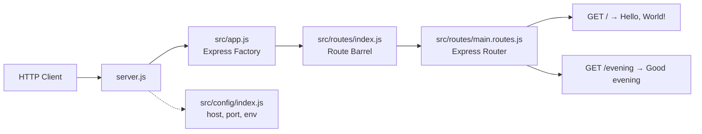

# Technical Specification

# 0. Agent Action Plan

## 0.1 Intent Clarification

### 0.1.1 Core Feature Objective

Based on the prompt, the Blitzy platform understands that the new feature requirement is to transform an existing Node.js tutorial server—currently hosting a single endpoint that returns "Hello world"—into an Express.js-powered application with an additional greeting endpoint. The two discrete requirements are:

- **REQ-001 — Integrate Express.js into the project:** Replace or augment the existing Node.js HTTP server with Express.js as the formal HTTP framework, introducing structured routing, middleware support, and the Express application lifecycle. This requires adding `express` as a production dependency, creating an Express application instance, and refactoring the server entry point to leverage Express's `app.listen()` binding.

- **REQ-002 — Add a new endpoint returning "Good evening":** Create a new HTTP GET endpoint (path: `/evening`) that responds with the exact string `"Good evening"`. This endpoint must coexist alongside the original "Hello world" root endpoint without altering its behavior.

The following implicit requirements were detected during analysis:

- **Backward compatibility:** The existing `GET /` endpoint returning `"Hello, World!\n"` must remain functionally identical after Express.js integration—same HTTP method, same response body, same `text/html` content type.
- **Response format preservation:** Both endpoints must return plain-text HTML responses via Express's `res.send()`, resulting in `Content-Type: text/html; charset=utf-8`.
- **Tutorial context retention:** The project must remain accessible and instructional for learners, maintaining clear code organization and documentation.
- **Testability:** The new endpoint and Express.js integration must be verifiable through automated tests covering unit, integration, and lifecycle scenarios.

### 0.1.2 Special Instructions and Constraints

- **No specific user directives** were provided beyond the core feature requirements. No authentication, backward-compatibility overrides, or architectural mandates were explicitly stated.
- **Architectural convention (detected from repository):** The repository follows a modular architecture using the Factory pattern (`src/app.js`), Barrel pattern (`src/routes/index.js`), and Twelve-Factor configuration (`src/config/index.js`). All new code must adhere to these established conventions.
- **Module system constraint:** The project uses CommonJS (`require`/`module.exports`) exclusively with `'use strict'` directives. No ESM (`import`/`export`) syntax is permitted.
- **Express version constraint:** The project targets Express.js `^5.1.0` as declared in `package.json`, which requires Node.js `>= 18`.

User Example (exact user input preserved):
> *"this is a tutorial of node js server hosting one endpoint that returns the response 'Hello world'. Could you add expressjs into the project and add another endpoint that return the reponse of 'Good evening'?"*

### 0.1.3 Technical Interpretation

These feature requirements translate to the following technical implementation strategy:

- To **integrate Express.js** (REQ-001), we will add `express` as a production dependency in `package.json`, create an Express application factory in `src/app.js` that instantiates and configures the Express app without binding to a port, extract the server binding logic into `server.js`, and establish a modular routing layer under `src/routes/` that uses Express's `Router` class.

- To **add the "Good evening" endpoint** (REQ-002), we will register a new `GET /evening` route handler in `src/routes/main.routes.js` that responds with the exact string `"Good evening"` using `res.send()`, and ensure this route is included in the barrel export through `src/routes/index.js` and mounted via `src/app.js`.

- To **preserve backward compatibility**, we will ensure the existing `GET /` route handler continues to return `"Hello, World!\n"` (with trailing newline) at the same path, with identical HTTP status (200) and content type (`text/html; charset=utf-8`).

- To **ensure quality**, we will create comprehensive test suites covering configuration validation (`tests/unit/config.test.js`), route registration verification (`tests/unit/routes.test.js`), HTTP endpoint behavior (`tests/integration/endpoints.test.js`), and server lifecycle correctness (`tests/lifecycle/server.test.js`), targeting 100% code coverage across all metrics.

## 0.2 Repository Scope Discovery

### 0.2.1 Comprehensive File Analysis

The following exhaustive inventory catalogs every file and folder in the repository that is affected by, or relevant to, the Express.js integration and `/evening` endpoint feature addition.

**Existing Source Files Requiring Modification:**

| File Path | Current Purpose | Required Modification |
|---|---|---|
| `server.js` | Raw Node.js HTTP server entry point | Refactor to import the Express app factory from `src/app.js` and the config module from `src/config`, then bind via `app.listen(config.port, config.host, callback)` |
| `package.json` | Project manifest with no Express dependency | Add `express` `^5.1.0` to `dependencies`, add `jest` `^30.2.0` and `supertest` `^7.1.4` to `devDependencies`, and add npm test scripts |
| `package-lock.json` | Dependency lock file | Regenerated automatically by `npm install` after `package.json` updates |
| `README.md` | Basic project documentation | Update to document Express.js architecture, both endpoints, environment variables, test commands, and project structure |
| `.gitignore` | Version control exclusions | Verify coverage of `node_modules/`, `coverage/`, `.env*`, logs, OS files, and IDE artifacts |

**Existing Configuration Files:**

| File Path | Purpose | Modification Required |
|---|---|---|
| `jest.config.js` | Jest test framework configuration | Verify test discovery patterns (`**/tests/**/*.test.js`), coverage collection (`server.js`, `src/**/*.js`), and threshold enforcement (75% branches, 90% functions, 80% lines/statements) |

**Integration Point Discovery:**

- **API endpoints connecting to the feature:**
  - `GET /` — existing root endpoint (must remain unchanged)
  - `GET /evening` — new endpoint to be added
  - All undefined routes — Express default 404 handling

- **Service classes requiring updates:**
  - `src/app.js` — Express application factory, mounts the `mainRoutes` router at the root path
  - `src/routes/main.routes.js` — Express Router instance hosting both GET handlers
  - `src/routes/index.js` — barrel export aggregating route modules for `src/app.js`

- **Configuration modules impacted:**
  - `src/config/index.js` — environment-driven configuration (`host`, `port`, `env`) consumed by `server.js`

### 0.2.2 Web Search Research Conducted

No external web search research was required for this feature addition. The implementation relies entirely on established Express.js patterns (Router, `app.use()`, `res.send()`) that are well-documented within the project's existing codebase and the Express.js `^5.1.0` API. The following areas were validated through repository analysis alone:

- Express.js 5.x Router pattern usage confirmed in `src/routes/main.routes.js`
- Factory pattern for Express app creation confirmed in `src/app.js`
- Twelve-Factor configuration approach confirmed in `src/config/index.js`
- Jest 30.x + Supertest 7.x testing patterns confirmed in `tests/` directory

### 0.2.3 New File Requirements

**New Source Files to Create:**

| File Path | Purpose |
|---|---|
| `src/app.js` | Express application factory — creates the Express instance, mounts `mainRoutes` at the root path via `app.use('/', mainRoutes)`, and exports the configured app without calling `listen()` |
| `src/config/index.js` | Configuration module — exports `{ host, port, env }` derived from environment variables (`HOST`, `PORT`, `NODE_ENV`) with defaults (`127.0.0.1`, `3000`, `development`) |
| `src/config/README.md` | Documentation for the configuration module's contract and usage patterns |
| `src/routes/index.js` | Route barrel aggregator — imports `main.routes.js` and exports `{ mainRoutes }` for centralized route registration |
| `src/routes/main.routes.js` | Express Router implementation — registers `GET /` (returns `"Hello, World!\n"`) and `GET /evening` (returns `"Good evening"`) handlers |
| `src/routes/README.md` | Documentation for the routing module's HTTP surface and extension workflow |
| `src/README.md` | Documentation for the application source directory architecture |

**New Test Files to Create:**

| File Path | Purpose |
|---|---|
| `tests/unit/config.test.js` | Unit tests for configuration defaults, environment variable overrides, port parsing edge cases, and type guarantees |
| `tests/unit/routes.test.js` | Unit tests for Express Router structure via `router.stack` introspection — validates route count, paths, methods, and ordering |
| `tests/integration/endpoints.test.js` | Integration tests using Supertest — validates HTTP 200 responses, exact body strings, `Content-Type` headers, 404 error handling, and edge cases |
| `tests/lifecycle/server.test.js` | Lifecycle tests — validates server binding, startup logging, custom configuration, graceful shutdown, and `EADDRINUSE` error handling |
| `tests/README.md` | Documentation for the test suite organization, commands, and coverage requirements |

**New Configuration / Documentation Files:**

| File Path | Purpose |
|---|---|
| `blitzy/documentation/Project Guide.md` | Comprehensive project guide with completion status, risk assessment, and operational checklists |
| `blitzy/documentation/Technical Specifications.md` | Full technical specifications including action plan, dependencies, integration analysis, and scope boundaries |

## 0.3 Dependency Inventory

### 0.3.1 Private and Public Packages

All packages are sourced from the public npm registry. No private packages are required for this feature addition.

| Registry | Package | Version | Category | Purpose |
|---|---|---|---|---|
| npm (public) | `express` | `^5.1.0` (resolved: `5.1.0`) | Production | Core HTTP framework providing routing, middleware pipeline, and `res.send()` response handling |
| npm (public) | `jest` | `^30.2.0` (resolved: `30.2.0`) | Development | Test execution framework with coverage instrumentation, module mocking, and assertion library |
| npm (public) | `supertest` | `^7.1.4` (resolved: `7.1.4`) | Development | HTTP-level integration testing library that exercises Express app instances without starting a network listener |

**Dependency Footprint:**

| Metric | Value |
|---|---|
| Direct production dependencies | 1 (`express`) |
| Direct development dependencies | 2 (`jest`, `supertest`) |
| Total resolved packages (transitive) | 405 |
| Lock file version | `lockfileVersion: 3` |
| Package manager | npm `>=8.x` (tested: `11.1.0`) |

### 0.3.2 Dependency Updates

**Package Manifest Changes (`package.json`):**

The `package.json` must be updated to declare Express.js as a production dependency and Jest/Supertest as development dependencies, along with npm scripts for testing:

```json
"dependencies": { "express": "^5.1.0" },
"devDependencies": { "jest": "^30.2.0", "supertest": "^7.1.4" }
```

**Import Updates:**

Files requiring new or modified import statements to support Express.js integration:

| File Pattern | Import Transformation | Purpose |
|---|---|---|
| `server.js` | Add `const app = require('./src/app')` and `const config = require('./src/config')` | Wire the Express app factory and configuration into the entry point |
| `src/app.js` | Add `const express = require('express')` and `const { mainRoutes } = require('./routes')` | Import Express and the route barrel for app construction |
| `src/routes/main.routes.js` | Add `const express = require('express')` | Import Express for `express.Router()` instantiation |
| `src/routes/index.js` | Add `const mainRoutes = require('./main.routes')` | Import the main router for barrel re-export |
| `tests/integration/endpoints.test.js` | Add `const request = require('supertest')` and `const app = require('../../src/app')` | Import Supertest and the Express app for HTTP-level testing |
| `tests/unit/routes.test.js` | Add `const mainRoutes = require('../../src/routes/main.routes')` | Import the router for structural introspection |
| `tests/lifecycle/server.test.js` | Uses `jest.doMock('../../src/app', ...)` and `jest.doMock('../../src/config', ...)` | Mock Express app and config for lifecycle testing |

**External Reference Updates:**

| File Pattern | Update Required |
|---|---|
| `package.json` | Add `express` to `dependencies`, `jest`/`supertest` to `devDependencies`, add `scripts` block |
| `package-lock.json` | Regenerated automatically via `npm install` |
| `jest.config.js` | Configure test environment (`node`), test discovery, coverage collection, and thresholds |
| `README.md` | Document Express.js dependency, version requirements, and installation commands |
| `.gitignore` | Verify `node_modules/` and `coverage/` exclusions |

## 0.4 Integration Analysis

### 0.4.1 Existing Code Touchpoints

**Direct Modifications Required:**

| File | Modification | Details |
|---|---|---|
| `server.js` | Refactor server initialization | Replace raw `http.createServer()` with `app.listen(config.port, config.host, callback)`. Import the Express app from `src/app` and configuration from `src/config`. Log startup message: `Server running at http://${config.host}:${config.port}/` |
| `package.json` | Add dependencies and scripts | Insert `express` `^5.1.0` into `dependencies`; `jest` `^30.2.0` and `supertest` `^7.1.4` into `devDependencies`; add `test`, `test:watch`, `test:coverage`, and `test:ci` scripts |
| `README.md` | Comprehensive documentation update | Document Express.js integration, both endpoints (`GET /`, `GET /evening`), environment variables, project structure, test commands, and architecture |

**Dependency Injection Points:**

| File | Injection | Consumer |
|---|---|---|
| `src/app.js` | Mounts `mainRoutes` at root path via `app.use('/', mainRoutes)` | `server.js` imports the configured Express app |
| `src/routes/index.js` | Exports `{ mainRoutes }` from barrel aggregator | `src/app.js` destructures `mainRoutes` for mounting |
| `src/config/index.js` | Exports `{ host, port, env }` configuration object | `server.js` reads `config.port` and `config.host` for binding |

**Request Flow Architecture:**


```mermaid
graph LR
    A[HTTP Client] --> B[server.js]
    B --> C[src/app.js<br/>Express Factory]
    C --> D[src/routes/index.js<br/>Route Barrel]
    D --> E[src/routes/main.routes.js<br/>Express Router]
    E --> F["GET / → Hello, World!"]
    E --> G["GET /evening → Good evening"]
    B -.-> H[src/config/index.js<br/>host, port, env]
```

**API Contract Definitions:**

| Endpoint | Method | Response Body | Status | Content-Type | Trailing Newline |
|---|---|---|---|---|---|
| `/` | GET | `Hello, World!\n` | 200 | `text/html; charset=utf-8` | Yes |
| `/evening` | GET | `Good evening` | 200 | `text/html; charset=utf-8` | No |
| `/*` (undefined) | Any | Express default error | 404 | Varies | N/A |

**Test Integration Touchpoints:**

| Test File | Depends On | Validates |
|---|---|---|
| `tests/unit/config.test.js` | `src/config/index.js` | Configuration defaults, environment overrides, port parsing |
| `tests/unit/routes.test.js` | `src/routes/main.routes.js` | Router structure, route count, path ordering, GET method registration |
| `tests/integration/endpoints.test.js` | `src/app.js` (via Supertest) | HTTP 200 responses, exact body strings, Content-Type headers, 404 handling |
| `tests/lifecycle/server.test.js` | `server.js` (via mocks) | Binding arguments, startup log format, shutdown, EADDRINUSE error handling |

## 0.5 Technical Implementation

### 0.5.1 File-by-File Execution Plan

Every file listed below MUST be created or modified. Files are organized into logical groups reflecting the implementation sequence.

**Group 1 — Core Feature Files (Express.js Application Factory and Routing):**

| Action | File Path | Purpose |
|---|---|---|
| CREATE | `src/app.js` | Express application factory — instantiate Express, mount `mainRoutes` at root path, export configured app without calling `listen()` |
| CREATE | `src/routes/main.routes.js` | Express Router — register `GET /` returning `"Hello, World!\n"` and `GET /evening` returning `"Good evening"` via `res.send()` |
| CREATE | `src/routes/index.js` | Route barrel aggregator — import `main.routes.js` and export `{ mainRoutes }` |

**Group 2 — Supporting Infrastructure (Configuration, Entry Point, Dependencies):**

| Action | File Path | Purpose |
|---|---|---|
| CREATE | `src/config/index.js` | Configuration module — export `{ host, port, env }` from `process.env` with defaults (`127.0.0.1`, `3000`, `development`) |
| MODIFY | `server.js` | Refactor entry point to import `src/app` and `src/config`, bind via `app.listen(config.port, config.host, callback)` |
| MODIFY | `package.json` | Add `express` `^5.1.0` dependency, `jest`/`supertest` dev dependencies, and npm test scripts |
| MODIFY | `jest.config.js` | Configure test environment (`node`), discovery patterns, coverage collection from `server.js` and `src/**/*.js`, and threshold gates |

**Group 3 — Tests:**

| Action | File Path | Purpose |
|---|---|---|
| CREATE | `tests/unit/config.test.js` | Unit tests for config defaults, environment overrides, port edge cases, type guarantees |
| CREATE | `tests/unit/routes.test.js` | Unit tests for Router stack introspection — route count, paths, methods, ordering |
| CREATE | `tests/integration/endpoints.test.js` | Integration tests via Supertest — response bodies, status codes, headers, 404 behavior, edge cases |
| CREATE | `tests/lifecycle/server.test.js` | Lifecycle tests — binding arguments, startup log, custom config, shutdown, EADDRINUSE handling |

**Group 4 — Documentation:**

| Action | File Path | Purpose |
|---|---|---|
| MODIFY | `README.md` | Full documentation update: Express.js architecture, both endpoints, env vars, project structure, test commands |
| CREATE | `src/README.md` | Document application source architecture and module relationships |
| CREATE | `src/config/README.md` | Document configuration module contract, defaults, and override patterns |
| CREATE | `src/routes/README.md` | Document routing surface, available endpoints, and extension workflow |
| CREATE | `tests/README.md` | Document test suite organization, execution commands, and coverage thresholds |

### 0.5.2 Implementation Approach per File

**Phase 1 — Establish feature foundation by creating core modules:**

- **`src/routes/main.routes.js`:** Create an Express Router instance, register two GET handlers (`/` and `/evening`) with exact response strings, and export the router. This is the lowest-level module with no internal dependencies.

```js
const router = express.Router();
router.get('/', (req, res) => res.send('Hello, World!\n'));
```

- **`src/routes/index.js`:** Import `main.routes.js` and re-export as `{ mainRoutes }` using the barrel pattern. This ensures `src/app.js` consumes routes through a single import.

- **`src/config/index.js`:** Export `{ host, port, env }` by reading `process.env` synchronously. Use `parseInt(process.env.PORT, 10) || 3000` for safe numeric port parsing with radix-10 enforcement.

- **`src/app.js`:** Import Express and `mainRoutes`, create the app instance via `express()`, mount routes with `app.use('/', mainRoutes)`, and export the app. Deliberately omit `app.listen()` to enable Supertest-based testing.

**Phase 2 — Integrate with existing systems by modifying integration points:**

- **`server.js`:** Replace raw HTTP server logic with Express app binding. Import `app` from `./src/app` and `config` from `./src/config`. Call `app.listen(config.port, config.host, callback)` where the callback logs the startup URL.

- **`package.json`:** Add the `express` production dependency and `jest`/`supertest` dev dependencies. Add test scripts (`test`, `test:watch`, `test:coverage`, `test:ci`).

- **`jest.config.js`:** Configure `testEnvironment: 'node'`, test match pattern `**/tests/**/*.test.js`, coverage collection from `server.js` and `src/**/*.js`, and threshold gates (75% branches, 90% functions, 80% lines/statements).

**Phase 3 — Ensure quality by implementing comprehensive tests:**

- **Unit tests** validate module contracts without HTTP requests — config defaults, Router structure, route ordering.
- **Integration tests** use Supertest to verify HTTP responses — exact bodies, status codes, Content-Type headers, 404 behavior.
- **Lifecycle tests** mock `app.listen` and `config` to verify server binding, logging, shutdown, and error handling.

**Phase 4 — Document usage and configuration:**

- Update `README.md` with complete API reference, architecture diagrams, environment variables, and test commands.
- Create per-module READMEs explaining local architecture, contracts, and extension guidance.

### 0.5.3 User Interface Design

This feature addition is entirely backend-focused. No user interface, frontend components, or Figma screens are involved. The project is a Node.js HTTP server tutorial with no browser-rendered views — all responses are plain-text strings delivered via Express's `res.send()` method. No Figma URLs were provided in the user's instructions.

## 0.6 Scope Boundaries

### 0.6.1 Exhaustively In Scope

The following files, patterns, and concerns constitute the complete scope of this feature addition. Trailing wildcards denote file group patterns.

**Core Application Source:**

| Scope Pattern | Description |
|---|---|
| `server.js` | Entry point — Express app binding and startup logging |
| `src/app.js` | Express application factory — app creation and route mounting |
| `src/routes/**/*.js` | Route definitions and barrel aggregation |
| `src/config/**/*.js` | Environment-driven configuration module |

**Test Suite:**

| Scope Pattern | Description |
|---|---|
| `tests/unit/**/*.test.js` | Unit tests for config parsing and Router structure |
| `tests/integration/**/*.test.js` | HTTP endpoint integration tests via Supertest |
| `tests/lifecycle/**/*.test.js` | Server lifecycle and error-handling tests |

**Configuration and Build:**

| Scope Pattern | Description |
|---|---|
| `package.json` | Dependency declarations and npm scripts |
| `package-lock.json` | Deterministic dependency resolution lock file |
| `jest.config.js` | Jest test framework configuration and coverage thresholds |
| `.gitignore` | Version control exclusion patterns |

**Documentation:**

| Scope Pattern | Description |
|---|---|
| `README.md` | Root project documentation — endpoints, architecture, usage |
| `src/README.md` | Application source architecture documentation |
| `src/config/README.md` | Configuration module documentation |
| `src/routes/README.md` | Routing module documentation and extension guide |
| `tests/README.md` | Test suite documentation and coverage requirements |
| `blitzy/documentation/**/*.md` | Project guide and technical specifications |

**Endpoint Contracts In Scope:**

| Endpoint | Method | Response | Status |
|---|---|---|---|
| `/` | GET | `Hello, World!\n` | 200 |
| `/evening` | GET | `Good evening` | 200 |
| `/*` (undefined) | Any | Express default 404 | 404 |

**Environment Variables In Scope:**

| Variable | Default | Scope |
|---|---|---|
| `HOST` | `127.0.0.1` | Server binding address |
| `PORT` | `3000` | Server binding port |
| `NODE_ENV` | `development` | Application environment mode |

### 0.6.2 Explicitly Out of Scope

The following concerns are explicitly excluded from this feature addition:

| Exclusion | Rationale |
|---|---|
| Database or persistent storage | No data persistence required; endpoints return static strings |
| Authentication or authorization | Tutorial-scope project; no protected resources |
| HTTPS/TLS configuration | Beyond tutorial scope; no SSL certificate management |
| Custom error middleware | Relies on Express.js default 404/500 handling |
| Request body parsing middleware | Both endpoints are GET-only with no request body |
| Logging framework integration | Uses only `console.log` for startup confirmation |
| Rate limiting or throttling | No production traffic management required |
| Docker or containerization | No deployment infrastructure changes |
| CI/CD pipeline configuration | No `.github/workflows/` or CI config changes |
| Frontend or UI components | Backend-only HTTP server; no browser rendering |
| Performance optimizations | Tutorial-scope; no caching, compression, or clustering |
| API versioning | Single version with two static endpoints |
| Additional endpoints beyond `/evening` | Only the user-requested endpoint is in scope |
| Refactoring of unrelated existing code | Only changes necessary for Express.js integration and `/evening` endpoint |

## 0.7 Rules for Feature Addition

The following rules and conventions govern all code produced during this feature addition. These rules are derived from repository analysis of the existing codebase patterns and the user's tutorial context.

**Module System and Language Rules:**

- All source files must use CommonJS module syntax (`require()` / `module.exports`). No ESM `import`/`export` statements.
- All entry-point and source files must include the `'use strict'` directive at the top of the file body.
- JavaScript is the sole language. No TypeScript, transpilation, or build-time compilation is permitted.

**Architectural Rules:**

- The Express application factory (`src/app.js`) must NEVER call `app.listen()`. Server binding is the sole responsibility of `server.js`.
- Routes must be defined in dedicated router files under `src/routes/` using `express.Router()`, then aggregated through the barrel exporter (`src/routes/index.js`).
- Configuration must be centralized in `src/config/index.js` and sourced exclusively from `process.env` with deterministic defaults. No `.env` file parsing libraries are permitted.
- The separation between app creation (factory), configuration, routing, and binding (entry point) must be strictly maintained.

**Express.js-Specific Rules:**

- Use `express.Router()` for all route handler definitions; never register routes directly on the `app` instance.
- Use `res.send()` for all responses; do not use `res.end()`, `res.write()`, or `res.json()` for plain-text greeting strings.
- Mount all routers via `app.use('/', routerInstance)` in `src/app.js`.
- The barrel export in `src/routes/index.js` must use named exports as an object: `module.exports = { mainRoutes }`.

**Response Contract Rules:**

- `GET /` must return exactly `"Hello, World!\n"` (14 characters, with trailing newline).
- `GET /evening` must return exactly `"Good evening"` (12 characters, without trailing newline).
- Both responses must have HTTP status `200` and `Content-Type: text/html; charset=utf-8` (set automatically by `res.send()`).
- Undefined routes must return HTTP `404` via Express's default error handling.

**Testing Rules:**

- Every source module must have corresponding test coverage. Minimum thresholds: 75% branches, 90% functions, 80% lines, 80% statements.
- Integration tests must use Supertest against the imported Express app instance (`src/app.js`), never against a live server.
- Lifecycle tests must use `jest.doMock()` to isolate `server.js` from real network operations.
- Unit tests must use `jest.resetModules()` when testing configuration to prevent module cache interference.

**Documentation Rules:**

- JSDoc comments are required on all exported functions, modules, and significant constants.
- Each subdirectory under `src/` and `tests/` must contain a `README.md` documenting its purpose, file inventory, and usage guidance.
- The root `README.md` must document all endpoints, environment variables, installation steps, test commands, and project structure.

**Compatibility Rules:**

- Node.js `>= 18` is required (Express 5.1.0 engine constraint).
- Node.js `20.x` LTS is the recommended and tested runtime version.
- The `package-lock.json` must use `lockfileVersion: 3` and be committed to version control for deterministic installs.

## 0.8 References

### 0.8.1 Repository Files and Folders Searched

The following files and folders were systematically retrieved and analyzed during the preparation of this Agent Action Plan. Every conclusion in this document is grounded in evidence from these sources.

**Root-Level Files Analyzed:**

| File Path | Analysis Purpose |
|---|---|
| `server.js` | Understood entry point architecture, Express app binding, and config consumption |
| `package.json` | Identified dependency declarations (`express ^5.1.0`, `jest ^30.2.0`, `supertest ^7.1.4`), npm scripts, and project metadata |
| `package-lock.json` | Verified resolved dependency versions, engine constraints (`node >= 18` for Express, `^18.14.0 \|\| ^20.0.0 \|\| ^22.0.0 \|\| >=24.0.0` for Jest), and lockfile version |
| `jest.config.js` | Reviewed test discovery patterns, coverage collection paths, threshold configuration, and test environment settings |
| `README.md` | Examined endpoint documentation, environment variable table, project structure, architecture description, and test commands |
| `.gitignore` | Confirmed exclusion patterns for `node_modules/`, `coverage/`, `.env*`, logs, OS files, and IDE artifacts |

**Source Directory Files Analyzed:**

| File Path | Analysis Purpose |
|---|---|
| `src/README.md` | Understood application source architecture and module relationships |
| `src/app.js` | Analyzed Express factory pattern, route mounting via `app.use('/', mainRoutes)`, and export contract |
| `src/config/index.js` | Analyzed configuration module — `host`, `port`, `env` exports, environment variable parsing, and defaults |
| `src/config/README.md` | Reviewed Twelve-Factor configuration documentation and usage examples |
| `src/routes/index.js` | Analyzed barrel export pattern — `{ mainRoutes }` aggregation |
| `src/routes/main.routes.js` | Analyzed Express Router with `GET /` and `GET /evening` handler registrations and response strings |
| `src/routes/README.md` | Reviewed routing module documentation, endpoint table, and extension workflow |

**Test Directory Files Analyzed:**

| File Path | Analysis Purpose |
|---|---|
| `tests/README.md` | Reviewed test suite organization, coverage requirements, and execution commands |
| `tests/unit/config.test.js` | Analyzed configuration unit test patterns — helper loaders, environment isolation, port parsing edge cases |
| `tests/unit/routes.test.js` | Analyzed Router stack introspection tests — `getRouteLayers()`, `getRoutePaths()`, route ordering assertions |
| `tests/integration/endpoints.test.js` | Analyzed Supertest integration patterns — `assertSuccessfulHtmlResponse()`, `assert404Response()`, edge case coverage |
| `tests/lifecycle/server.test.js` | Analyzed lifecycle mock patterns — `createMockServer()`, `createMockListen()`, `setupMocks()`, EADDRINUSE handling |

**Folders Traversed:**

| Folder Path | Depth | Children Discovered |
|---|---|---|
| `` (root) | 0 | 6 files, 3 folders |
| `src/` | 1 | 1 file (`app.js`), 1 README, 2 subfolders (`config/`, `routes/`) |
| `src/config/` | 2 | 1 file (`index.js`), 1 README |
| `src/routes/` | 2 | 2 files (`index.js`, `main.routes.js`), 1 README |
| `tests/` | 1 | 1 README, 3 subfolders (`unit/`, `integration/`, `lifecycle/`) |
| `tests/unit/` | 2 | 2 files (`config.test.js`, `routes.test.js`) |
| `tests/integration/` | 2 | 1 file (`endpoints.test.js`) |
| `tests/lifecycle/` | 2 | 1 file (`server.test.js`) |
| `blitzy/` | 1 | 1 subfolder (`documentation/`) |

**Tech Spec Sections Retrieved:**

| Section Heading | Purpose |
|---|---|
| `1.1 Executive Summary` | Confirmed project overview, requirements REQ-001/REQ-002, and stakeholder context |
| `2.1 Feature Catalog` | Reviewed complete feature inventory (F-001 through F-008) with dependencies and evidence |
| `3.1 Programming Languages` | Verified JavaScript/Node.js runtime, CommonJS module system, and version tiers |
| `Node.js Runtime Versions` | Confirmed minimum (≥18), recommended (20.19.x), and tested (20.20.0) versions |
| `3.3 Open Source Dependencies` | Verified dependency versions, license information, transitive counts, and security profile |

### 0.8.2 Attachments and External Resources

- **Figma screens:** None provided. This is a backend-only project with no UI components.
- **User-provided files:** None found in `/tmp/environments_files/`.
- **Environment variables provided:** None.
- **Secrets provided:** None.
- **Setup instructions provided:** None.

### 0.8.3 Environment Verification

The following environment was confirmed operational during analysis:

| Component | Version | Status |
|---|---|---|
| Node.js | v20.20.0 | Verified — matches documented tested version |
| npm | 11.1.0 | Verified — exceeds minimum requirement (≥8.x) |
| Express.js | 5.1.0 | Installed and resolved via `npm ci` |
| Jest | 30.2.0 | Installed and resolved via `npm ci` |
| Supertest | 7.1.4 | Installed and resolved via `npm ci` |
| Test Suite | 41 tests, 4 suites | All passing with 100% coverage across all metrics |

