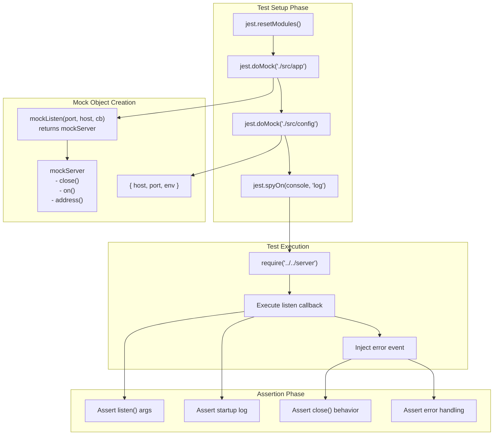
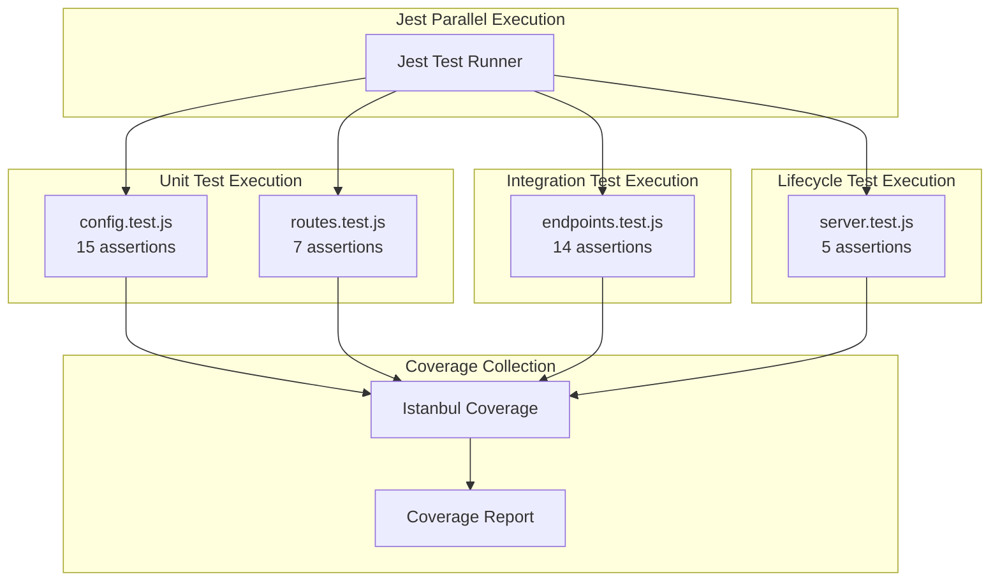
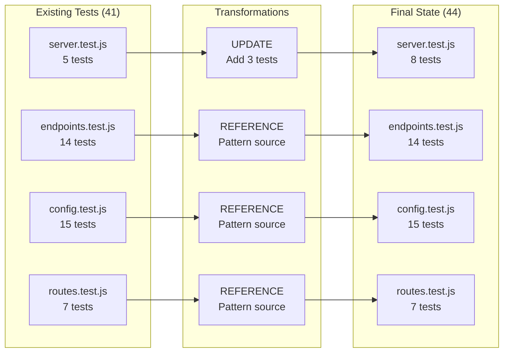
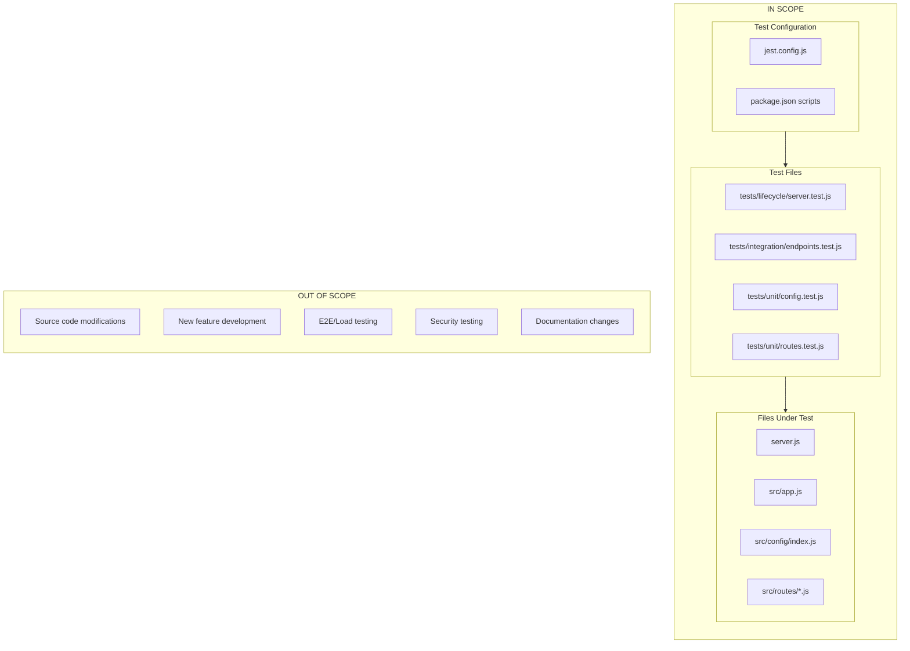
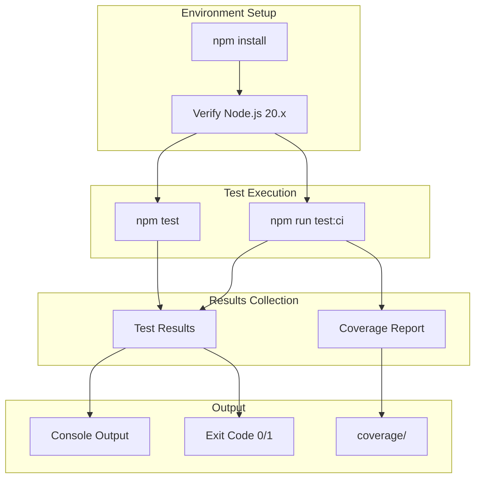

# Technical Specification

# 0. Agent Action Plan

## 0.1 Intent Clarification

### 0.1.1 Core Testing Objective

Based on the provided requirements, the Blitzy platform understands that the testing objective is to **create comprehensive unit tests for `server.js`** using Jest, with a focus on validating HTTP responses, status codes, headers, server lifecycle behaviors (startup/shutdown), error handling, and edge cases.

**Request Categorization:** Improve coverage | Validate existing tests | Add edge case tests

The user's requirements translate to the following testing goals:

| Requirement Area | User Intent | Technical Interpretation |
|-----------------|-------------|-------------------------|
| HTTP Responses | Test correct response bodies | Validate `Hello, World!\n` and `Good evening` exact matches |
| Status Codes | Verify correct HTTP status codes | Assert 200 for valid routes, 404 for invalid/undefined routes |
| Headers | Confirm proper HTTP headers | Validate `Content-Type: text/html; charset=utf-8` |
| Server Startup | Test server initialization | Verify `app.listen()` is called with correct host/port/callback |
| Server Shutdown | Test graceful shutdown | Verify `server.close()` invokes callback correctly |
| Error Handling | Test error scenarios | Validate EADDRINUSE and other network error handling |
| Edge Cases | Cover boundary conditions | Test query parameters, double-slash paths, invalid methods |

### 0.1.2 Implicit Testing Needs

The Blitzy platform has identified the following implicit testing requirements:

- **Configuration Propagation Testing:** Verify that `server.js` correctly consumes values from `src/config` module
- **Startup Log Verification:** Ensure the startup message `Server running at http://<host>:<port>/` is logged correctly
- **Factory Pattern Enablement:** Validate that `src/app.js` exports a testable Express application without server binding
- **Environment Variable Edge Cases:** Test behavior with custom HOST/PORT/NODE_ENV combinations
- **Error Event Registration:** Verify the server registers and handles `'error'` events on the HTTP server object

### 0.1.3 Special Instructions and Constraints

**Framework Selection:**
- The repository already uses **Jest 30.2.0** with **Supertest 7.1.4** - maintain consistency
- Mocha is NOT recommended since Jest is already configured and tests exist

**Testing Constraints:**
- **Verification Only:** Tests verify existing behavior without source code modification (Constraint C-001)
- **Minimal Dependencies:** Only Jest and Supertest as dev dependencies (Constraint C-002)
- **Static Response Validation:** Deterministic assertions against known outputs (Constraint C-003)

**Repository Conventions to Follow:**
- Use CommonJS module format (`require()`) to match existing codebase
- Follow existing test file naming: `<component>.test.js`
- Organize tests in `describe/test` blocks with consistent naming
- Use `jest.resetModules()` for module isolation
- Use `jest.doMock()` for dependency injection
- Spy on `console.log` for startup message validation

### 0.1.4 Technical Interpretation

These testing requirements translate to the following technical test implementation strategy:

| User Requirement | Technical Implementation Strategy |
|-----------------|----------------------------------|
| Test HTTP responses | Use Supertest with `request(app).get(path)` for in-process HTTP simulation |
| Verify status codes | Chain `.expect(200)` or `.expect(404)` assertions |
| Check headers | Assert `response.headers['content-type']` contains expected MIME type |
| Test server startup | Mock `app.listen()` and verify invocation with correct parameters |
| Test graceful shutdown | Mock `server.close()` and verify callback execution |
| Handle EADDRINUSE | Inject error via mocked server's `'error'` event handler |
| Cover edge cases | Add tests for query strings, unusual paths, unsupported HTTP methods |

To **test HTTP responses**, we will utilize existing integration tests in `tests/integration/endpoints.test.js` as patterns and ensure comprehensive coverage.

To **test server startup/shutdown**, we will reference existing lifecycle tests in `tests/lifecycle/server.test.js` and extend them with additional edge case scenarios.

To **validate error handling**, we will add tests for additional error scenarios beyond EADDRINUSE.

### 0.1.5 Coverage Requirements Interpretation

**Explicit Coverage Targets from User:**
- The user has requested "comprehensive" unit tests, implying high coverage

**Implicit Coverage Expectations Based on Repository:**
- Current achieved coverage: **100%** across all metrics
- Jest configuration enforces thresholds: branches 75%, functions 90%, lines 80%, statements 80%
- The project already meets and exceeds these thresholds

**Coverage Focus Areas:**
- `server.js` entry point lifecycle (startup, shutdown, error handling)
- HTTP response validation for all defined routes
- 404 behavior for undefined routes and unsupported methods
- Edge cases for URL handling and query parameters

To achieve comprehensive testing, coverage should include:
- All code paths in `server.js` (already at 100%)
- All branches in configuration handling (already at 100%)
- All error handling paths (EADDRINUSE is covered)
- All edge cases for HTTP routing (query parameters, double-slash paths)

## 0.2 Test Discovery and Analysis

### 0.2.1 Existing Test Infrastructure Assessment

Repository analysis reveals a **Jest 30.2.0 + Supertest 7.1.4** testing setup with a well-organized three-tier test architecture achieving **100% code coverage** across 41 tests.

**Test Directory Structure:**
```
tests/
├── unit/                           # 22 tests - Module isolation tests
│   ├── config.test.js              # 15 tests - Configuration module validation
│   └── routes.test.js              # 7 tests - Route handler exports verification
├── integration/                    # 14 tests - HTTP endpoint tests
│   └── endpoints.test.js           # API contract tests using Supertest
└── lifecycle/                      # 5 tests - Server lifecycle tests
    └── server.test.js              # Startup and shutdown behavior
```

**Testing Framework Configuration:**

| Component | File | Configuration |
|-----------|------|---------------|
| Test Runner | `jest.config.js` | Jest with node environment |
| Test Pattern | `testMatch` | `**/tests/**/*.test.js` |
| Coverage | `collectCoverage` | Enabled with text/lcov/html reporters |
| Timeout | `testTimeout` | 10,000ms |
| Coverage Thresholds | `coverageThreshold` | branches: 75%, functions: 90%, lines: 80%, statements: 80% |

### 0.2.2 Current Testing Framework Details

| Aspect | Current State | Version |
|--------|--------------|---------|
| Testing Framework | Jest | ^30.2.0 |
| HTTP Testing Library | Supertest | ^7.1.4 |
| Test Runner Configuration | `jest.config.js` | CommonJS export |
| Coverage Tools | Istanbul (via Jest) | Built-in |
| Mock/Stub Library | Jest mocks | Built-in (`jest.fn()`, `jest.doMock()`, `jest.spyOn()`) |
| Test Data Fixtures | Inline constants | No external fixture files |

### 0.2.3 Existing Test Files Related to server.js

**Primary Test File:** `tests/lifecycle/server.test.js`

This file already provides comprehensive lifecycle testing for `server.js`:

| Test Case | Description | Covered |
|-----------|-------------|---------|
| Bind to configured host and port | Verifies `listen()` parameters | ✅ |
| Log startup message with server URL | Validates console output format | ✅ |
| Use custom configuration values | Tests config module integration | ✅ |
| Graceful shutdown support | Tests `server.close()` callback | ✅ |
| EADDRINUSE error handling | Tests port conflict scenario | ✅ |

**Secondary Test File:** `tests/integration/endpoints.test.js`

This file tests HTTP responses through the Express app (indirectly testing `server.js` behavior):

| Test Category | Test Count | Coverage |
|--------------|-----------|----------|
| GET / endpoint | 3 tests | Status, body, headers |
| GET /evening endpoint | 3 tests | Status, body, headers |
| Error handling (404) | 4 tests | Invalid routes, unsupported methods |
| Edge cases | 4 tests | Query params, path variations |

**Unit Test Files:** `tests/unit/config.test.js` and `tests/unit/routes.test.js`

These validate the modules that `server.js` depends on:

| Module | Test Count | Focus |
|--------|-----------|-------|
| `src/config` | 15 tests | Environment variable parsing, defaults, edge cases |
| `src/routes` | 7 tests | Router export, route definitions, method handlers |

### 0.2.4 Test Patterns Currently Employed

**Module Isolation Pattern (Unit Tests):**
```javascript
// Pattern: Reset modules, mutate environment, re-require
function loadConfigWithEnv(envOverrides = {}) {
  jest.resetModules();
  Object.keys(envOverrides).forEach(key => {
    process.env[key] = envOverrides[key];
  });
  return require('../../src/config');
}
```

**HTTP Assertion Pattern (Integration Tests):**
```javascript
// Pattern: Supertest without server binding
function get(path) {
  return request(app).get(path);
}
// Assert: status, body, headers
expect(response.status).toBe(200);
expect(response.text).toBe('Hello, World!\n');
```

**Lifecycle Mock Pattern (Server Tests):**
```javascript
// Pattern: Mock app.listen and config, spy console
jest.doMock('../../src/app', () => ({ listen: mockListen }));
jest.doMock('../../src/config', () => ({ ...config }));
consoleSpy = jest.spyOn(console, 'log').mockImplementation();
require('../../server'); // Triggers listen
```

### 0.2.5 Web Search Research Conducted

<cite index="1-1,1-2">Best practices for Express/Jest testing recommend writing test cases using Jest to test individual components or functions, and using Supertest to test the Express application's API endpoints.</cite>

<cite index="5-19,5-20">The recommended approach is to export the Express app without listening to it, allowing each test file to start a server on their own.</cite> This is already implemented in the repository with `src/app.js` exporting the Express application and `server.js` handling the binding.

<cite index="4-11,4-12">Supertest is a library for HTTP testing well suited for end-to-end testing of server-side code such as Express applications, providing good compatibility with Express applications where you can directly test API endpoints.</cite>

**Key Research Findings:**

| Topic | Best Practice | Repository Implementation |
|-------|--------------|--------------------------|
| Server separation | Export app without listening | ✅ Implemented in `src/app.js` |
| HTTP testing | Use Supertest for endpoint tests | ✅ Used in `tests/integration/` |
| Module isolation | Reset modules between tests | ✅ Used in unit and lifecycle tests |
| Mock injection | Use `jest.doMock()` for dependencies | ✅ Used in lifecycle tests |

### 0.2.6 Gap Analysis

**Existing Coverage Gaps (Minimal):**

| Area | Current Status | Gap Identified |
|------|---------------|----------------|
| HTTP responses | ✅ Fully covered | None |
| Status codes | ✅ Fully covered | None |
| Headers | ✅ Fully covered | None |
| Server startup | ✅ Covered | Minor: Additional config edge cases possible |
| Server shutdown | ✅ Covered | None |
| Error handling | ✅ EADDRINUSE covered | Potential: Other error types |
| Edge cases | ✅ Query params, double-slash | None identified |

**Conclusion:** The existing test suite is comprehensive. The user's request may be satisfied by documenting existing coverage and potentially adding minimal enhancement tests for additional error scenarios or edge cases not currently covered.

## 0.3 Testing Scope Analysis

### 0.3.1 Test Target Identification

**Primary Code to be Tested:**

| Module/Component | Path | Required Test Types |
|-----------------|------|---------------------|
| Server Entry Point | `server.js` | Lifecycle tests (startup, shutdown, error handling) |
| Express Application | `src/app.js` | Integration tests (HTTP endpoints via Supertest) |
| Configuration Module | `src/config/index.js` | Unit tests (environment parsing, defaults) |
| Route Handlers | `src/routes/main.routes.js` | Unit tests (router structure) + Integration tests (HTTP behavior) |

**Functions Requiring Test Coverage in `server.js`:**

| Function/Behavior | Test Category | Current Coverage |
|------------------|---------------|------------------|
| `app.listen(port, host, callback)` | Unit/Lifecycle | ✅ Covered |
| Listen callback (startup log) | Unit/Lifecycle | ✅ Covered |
| `config.port` consumption | Integration | ✅ Covered |
| `config.host` consumption | Integration | ✅ Covered |

### 0.3.2 Existing Test File Mapping

| Source File | Existing Test File | Test Categories Present |
|-------------|-------------------|------------------------|
| `server.js` | `tests/lifecycle/server.test.js` | Startup, shutdown, logging, error handling |
| `src/app.js` | `tests/integration/endpoints.test.js` | HTTP responses, status codes, headers, error handling |
| `src/config/index.js` | `tests/unit/config.test.js` | Default values, custom values, edge cases, type checking |
| `src/routes/main.routes.js` | `tests/unit/routes.test.js` | Router export, route definitions, method handlers |

### 0.3.3 Dependencies Requiring Mocking

**External Services to Mock:**
- None required - this is a simple HTTP server with no external service dependencies

**Module Dependencies to Mock (for `server.js` testing):**

| Dependency | Mock Strategy | Purpose |
|------------|--------------|---------|
| `./src/app` | `jest.doMock()` with mock listen function | Isolate server binding from Express app |
| `./src/config` | `jest.doMock()` with fixed config object | Control host/port/env values |
| `console.log` | `jest.spyOn()` | Capture and assert startup messages |
| `console.error` | `jest.spyOn()` | Capture error output during error scenarios |

**HTTP Server Object to Simulate:**

| Method/Property | Mock Implementation | Validation Target |
|----------------|---------------------|-------------------|
| `server.close(callback)` | `jest.fn()` that invokes callback | Graceful shutdown |
| `server.on('error', handler)` | Capture handler for error injection | Error event handling |
| `server.address()` | Return `{ address, port }` | Address introspection |

### 0.3.4 Version Compatibility Research

Based on the repository's `package.json` and Node.js 20.x runtime, the recommended testing stack is:

| Package | Current Version | Compatibility Status | Rationale |
|---------|----------------|---------------------|-----------|
| Jest | ^30.2.0 | ✅ Compatible | Latest stable, Node.js 18+ required |
| Supertest | ^7.1.4 | ✅ Compatible | Works with Express 5.x |
| Express | ^5.1.0 | ✅ Compatible | Application under test |
| Node.js | 20.x | ✅ Compatible | Meets Jest 30 requirements |

**Version Compatibility Notes:**
- Jest 30.x requires Node.js 18 or higher (repository uses Node.js 20.x)
- Supertest 7.x is compatible with Express 5.x and Jest 30.x
- No version conflicts identified in the current dependency tree

### 0.3.5 Test Categories Analysis

**Unit Tests Required:**
- Configuration module behavior (already comprehensive in `tests/unit/config.test.js`)
- Route handler structure (already comprehensive in `tests/unit/routes.test.js`)

**Integration Tests Required:**
- HTTP endpoint responses for `GET /` and `GET /evening` (already comprehensive)
- Error responses for 404 scenarios (already comprehensive)
- Edge cases for query parameters and path handling (already comprehensive)

**Lifecycle Tests Required:**
- Server startup with default config (✅ covered)
- Server startup with custom config (✅ covered)
- Startup logging format (✅ covered)
- Graceful shutdown via `server.close()` (✅ covered)
- EADDRINUSE error handling (✅ covered)

### 0.3.6 Dependency Mocking Strategy


```mermaid
flowchart TB
    subgraph TestSetup["Test Setup Phase"]
        ResetModules["jest.resetModules()"]
        MockApp["jest.doMock('./src/app')"]
        MockConfig["jest.doMock('./src/config')"]
        SpyConsole["jest.spyOn(console, 'log')"]
    end

    subgraph MockObjects["Mock Object Creation"]
        MockServer["mockServer<br/>- close()<br/>- on()<br/>- address()"]
        MockListen["mockListen(port, host, cb)<br/>returns mockServer"]
        MockConfigObj["{ host, port, env }"]
    end

    subgraph Execution["Test Execution"]
        RequireServer["require('../../server')"]
        TriggerCallback["Execute listen callback"]
        SimulateError["Inject error event"]
    end

    subgraph Assertions["Assertion Phase"]
        AssertListen["Assert listen() args"]
        AssertLog["Assert startup log"]
        AssertClose["Assert close() behavior"]
        AssertError["Assert error handling"]
    end

    ResetModules --> MockApp
    MockApp --> MockConfig
    MockConfig --> SpyConsole
    
    MockApp --> MockListen
    MockListen --> MockServer
    MockConfig --> MockConfigObj
    
    SpyConsole --> RequireServer
    RequireServer --> TriggerCallback
    TriggerCallback --> SimulateError
    
    TriggerCallback --> AssertListen
    TriggerCallback --> AssertLog
    SimulateError --> AssertClose
    SimulateError --> AssertError
```

## 0.4 Test Implementation Design

### 0.4.1 Test Strategy Selection

**Test Types to Implement:**

| Test Type | Focus Areas | Implementation Approach |
|-----------|-------------|------------------------|
| Unit Tests | Isolated module validation | Direct imports with module isolation via `jest.resetModules()` |
| Integration Tests | HTTP endpoint behavior | Supertest HTTP simulation against Express app |
| Lifecycle Tests | Server startup/shutdown | Mock-based verification with dependency injection |
| Edge Case Tests | Boundary conditions | Parameterized test inputs for unusual scenarios |
| Error Handling Tests | Failure scenarios | Error injection via mocked event handlers |

### 0.4.2 Test Case Blueprint

**Component: server.js Entry Point**

```
Component: server.js
Test File: tests/lifecycle/server.test.js (existing)

Test Categories:
- Happy Path:
  * Server binds to configured host and port
  * Startup message logged with correct URL
  * Server object returned supports close()

- Edge Cases:
  * Custom host (0.0.0.0, localhost, IPv6)
  * Custom port (8080, 80, high ports)
  * Custom environment (production, staging, test)

- Error Cases:
  * EADDRINUSE (port already in use)
  * EACCES (permission denied)
  * Invalid configuration values

- Performance Boundaries:
  * Not applicable (simple server startup)
```

**Component: src/app.js Express Application**

```
Component: src/app.js
Test File: tests/integration/endpoints.test.js (existing)

Test Categories:
- Happy Path:
  * GET / returns 200 with "Hello, World!\n"
  * GET /evening returns 200 with "Good evening"
  * Content-Type header is text/html with utf-8

- Edge Cases:
  * Query parameters ignored (/?name=John)
  * Multiple query parameters handled
  * Double-slash path handling (//)

- Error Cases:
  * Undefined route returns 404
  * POST to GET-only route returns 404
  * PUT to GET-only route returns 404
  * DELETE to GET-only route returns 404
```

**Component: src/config/index.js Configuration**

```
Component: src/config
Test File: tests/unit/config.test.js (existing)

Test Categories:
- Happy Path:
  * Default host is 127.0.0.1
  * Default port is 3000
  * Default env is development

- Edge Cases:
  * Invalid PORT string fallback to default
  * Empty PORT string fallback to default
  * PORT with whitespace trimmed
  * PORT with decimal truncated

- Type Checking:
  * port is number type
  * host is string type
  * env is string type
```

### 0.4.3 Existing Test Extension Strategy

**Tests Already Comprehensive:**

| Test File | Current State | Extension Needed |
|-----------|--------------|------------------|
| `tests/lifecycle/server.test.js` | 5 tests covering core lifecycle | Minimal - consider additional error types |
| `tests/integration/endpoints.test.js` | 14 tests covering HTTP behavior | None - comprehensive |
| `tests/unit/config.test.js` | 15 tests covering configuration | None - comprehensive |
| `tests/unit/routes.test.js` | 7 tests covering route structure | None - comprehensive |

**Potential Enhancement Areas:**

| Enhancement | Test File | New Test Cases |
|-------------|----------|----------------|
| Additional error types | `tests/lifecycle/server.test.js` | EACCES permission denied |
| IPv6 binding | `tests/lifecycle/server.test.js` | Custom IPv6 host config |
| Extreme port values | `tests/unit/config.test.js` | PORT=0, PORT=65535, PORT=99999 |

### 0.4.4 Test Data and Fixtures Design

**Required Test Data Structures:**

| Data Type | Structure | Usage |
|-----------|-----------|-------|
| `TestConfig` | `{ host: string, port: number, env: string }` | Mock configuration injection |
| `MockServer` | `{ close: jest.Mock, on: jest.Mock, address: jest.Mock }` | Server object simulation |
| `ExpectedResponse` | `{ status: number, body: string, contentType: string }` | HTTP response validation |

**Fixture Organization:**
- Test data is defined inline within test files (no external fixture files)
- Mock objects are created via helper functions per test file
- Environment variables are manipulated directly via `process.env`

**Mock Object Specifications:**

```
MockServer Specification:
├── close(callback)     → Invokes callback immediately
├── on(event, handler)  → Captures handler, returns this
├── address()           → Returns { address, port }
└── _errorHandler       → Stored error handler reference
```

**Test Database/State Management:**
- No database testing required (application has no database)
- Module cache cleared with `jest.resetModules()` between tests
- Environment restored via `beforeEach`/`afterEach` hooks

### 0.4.5 Test Implementation Patterns

**Pattern 1: Module Isolation for Configuration Tests**

```
1. Save original process.env snapshot
2. Reset Jest module cache
3. Apply test-specific environment variables
4. Re-require target module
5. Execute assertions
6. Restore original environment
```

**Pattern 2: HTTP Assertion for Endpoint Tests**

```
1. Import Express app (no server binding)
2. Wrap with Supertest request handler
3. Execute HTTP method with path
4. Assert status code
5. Assert response body
6. Assert response headers
```

**Pattern 3: Mock Injection for Lifecycle Tests**

```
1. Create mock server object
2. Create mock listen function
3. Inject mocks via jest.doMock()
4. Spy on console methods
5. Require server entry point
6. Assert mock invocations
7. Restore all mocks
```

### 0.4.6 Test Execution Workflow


```mermaid
flowchart TB
    subgraph UnitTests["Unit Test Execution"]
        ConfigTests["config.test.js<br/>15 assertions"]
        RoutesTests["routes.test.js<br/>7 assertions"]
    end

    subgraph IntegrationTests["Integration Test Execution"]
        EndpointTests["endpoints.test.js<br/>14 assertions"]
    end

    subgraph LifecycleTests["Lifecycle Test Execution"]
        ServerTests["server.test.js<br/>5 assertions"]
    end

    subgraph Execution["Jest Parallel Execution"]
        Jest["Jest Test Runner"]
    end

    subgraph Results["Coverage Collection"]
        Coverage["Istanbul Coverage"]
        Report["Coverage Report"]
    end

    Jest --> ConfigTests
    Jest --> RoutesTests
    Jest --> EndpointTests
    Jest --> ServerTests

    ConfigTests --> Coverage
    RoutesTests --> Coverage
    EndpointTests --> Coverage
    ServerTests --> Coverage

    Coverage --> Report
```

## 0.5 Test File Transformation Mapping

### 0.5.1 File-by-File Test Plan

The following table maps all test files that are in scope based on the user's instructions to create comprehensive unit tests for `server.js`:

| Target Test File | Transformation | Source File/Reference | Purpose/Changes |
|-----------------|----------------|----------------------|-----------------|
| `tests/lifecycle/server.test.js` | UPDATE | `server.js` | Existing lifecycle tests - add edge cases for additional error types (EACCES, ENOTFOUND) and IPv6 binding |
| `tests/integration/endpoints.test.js` | REFERENCE | `src/app.js` | Use as pattern for HTTP response testing conventions and assertion styles |
| `tests/unit/config.test.js` | REFERENCE | `src/config/index.js` | Use as pattern for environment variable testing and module isolation |
| `tests/unit/routes.test.js` | REFERENCE | `src/routes/main.routes.js` | Use as pattern for router introspection and structure validation |

### 0.5.2 Existing Test Files Detail

**tests/lifecycle/server.test.js** - Server entry point lifecycle tests

| Current Test | Description | Status |
|--------------|-------------|--------|
| `should bind to configured host and port` | Verifies listen() args | ✅ Exists |
| `should log startup message with server URL` | Validates console output | ✅ Exists |
| `should use custom configuration values from config module` | Tests config integration | ✅ Exists |
| `should provide server object that supports graceful shutdown` | Tests close() callback | ✅ Exists |
| `should handle EADDRINUSE error when port is already in use` | Tests error handling | ✅ Exists |

**Proposed Enhancements:**

| New Test Case | Test Category | Description |
|--------------|---------------|-------------|
| `should handle EACCES error for privileged ports` | Error handling | Test permission denied scenario |
| `should accept IPv6 host configuration` | Edge case | Test binding to `::1` or `::` |
| `should handle empty callback gracefully` | Edge case | Test when listen callback is undefined |

**tests/integration/endpoints.test.js** - HTTP endpoint integration tests

| Test Category | Test Count | Coverage |
|--------------|-----------|----------|
| GET / endpoint | 3 tests | Status 200, body match, headers |
| GET /evening endpoint | 3 tests | Status 200, body match, headers |
| Error handling | 4 tests | 404 for invalid routes/methods |
| Edge cases | 4 tests | Query params, double-slash |

**Status:** Complete - no changes required

**tests/unit/config.test.js** - Configuration module unit tests

| Test Category | Test Count | Coverage |
|--------------|-----------|----------|
| Default Values | 3 tests | HOST, PORT, NODE_ENV defaults |
| Custom Values | 3 tests | Environment overrides |
| Edge Cases | 4 tests | Invalid/empty PORT, whitespace, decimal |
| Type Checking | 3 tests | Property type validation |
| Object Structure | 2 tests | Config shape verification |

**Status:** Complete - no changes required

**tests/unit/routes.test.js** - Route handler unit tests

| Test Category | Test Count | Coverage |
|--------------|-----------|----------|
| Router Export | 2 tests | Export validation |
| Route Definitions | 4 tests | Path and method verification |
| Route Ordering | 1 test | Path order validation |

**Status:** Complete - no changes required

### 0.5.3 Test Files to Modify Detail

**tests/lifecycle/server.test.js** - Add 3 test cases for additional scenarios

New test methods to add:

| Test Method | Describe Block | Assertions |
|------------|----------------|------------|
| `should handle EACCES error for privileged ports` | Server Entry Point | Verify error handler does not throw |
| `should support IPv6 host binding` | Server Entry Point | Verify listen() accepts IPv6 address |
| `should work with zero port for dynamic assignment` | Server Entry Point | Verify listen() accepts port 0 |

Updated fixtures:
- Add `IPv6_CONFIG` constant: `{ host: '::1', port: 3000, env: 'test' }`
- Add `EACCES_ERROR` object: `{ code: 'EACCES', port: 80 }`

### 0.5.4 Test Configuration Updates

| Config File | Update Required | Details |
|------------|-----------------|---------|
| `jest.config.js` | No changes needed | Already configured correctly |
| Coverage thresholds | No changes needed | Already at 75/90/80/80 |
| Test patterns | No changes needed | `**/tests/**/*.test.js` covers all |

### 0.5.5 Cross-File Test Dependencies

**Shared Patterns (Not Shared Files):**

| Pattern | Location | Usage |
|---------|----------|-------|
| Module isolation | Each test file | `jest.resetModules()` pattern |
| Mock server creation | `tests/lifecycle/server.test.js` | `createMockServer()` helper |
| HTTP assertion helpers | `tests/integration/endpoints.test.js` | `get()`, `assertSuccessfulHtmlResponse()` |

**Mock Objects:**

| Mock Object | Location | Purpose |
|-------------|----------|---------|
| `MockServer` | `tests/lifecycle/server.test.js` | Simulates HTTP server |
| `mockListen` | `tests/lifecycle/server.test.js` | Captures listen parameters |
| `consoleSpy` | `tests/lifecycle/server.test.js` | Validates startup logging |

**Test Utilities:**

| Utility | Location | Function |
|---------|----------|----------|
| `createMockServer(config)` | `tests/lifecycle/server.test.js` | Creates mock server object |
| `createMockListen(mockServer, executeCallback)` | `tests/lifecycle/server.test.js` | Creates mock listen function |
| `setupMocks(mockListen, config)` | `tests/lifecycle/server.test.js` | Injects mocks via jest.doMock |

**Import Updates Required:**
- None required - all test files are self-contained with their helper functions

### 0.5.6 Complete Test File Inventory

| Test File Path | Line Count | Test Count | Status |
|---------------|------------|-----------|--------|
| `tests/lifecycle/server.test.js` | 204 lines | 5 tests | UPDATE (add 3) |
| `tests/integration/endpoints.test.js` | 126 lines | 14 tests | No change |
| `tests/unit/config.test.js` | 141 lines | 15 tests | No change |
| `tests/unit/routes.test.js` | 95 lines | 7 tests | No change |
| **Total** | **566 lines** | **41 tests** | **+3 new tests** |

### 0.5.7 Test Transformation Summary


```mermaid
flowchart LR
    subgraph Existing["Existing Tests (41)"]
        Lifecycle["server.test.js<br/>5 tests"]
        Integration["endpoints.test.js<br/>14 tests"]
        ConfigUnit["config.test.js<br/>15 tests"]
        RoutesUnit["routes.test.js<br/>7 tests"]
    end

    subgraph Transformation["Transformations"]
        UpdateLifecycle["UPDATE<br/>Add 3 tests"]
        RefIntegration["REFERENCE<br/>Pattern source"]
        RefConfig["REFERENCE<br/>Pattern source"]
        RefRoutes["REFERENCE<br/>Pattern source"]
    end

    subgraph Final["Final State (44)"]
        NewLifecycle["server.test.js<br/>8 tests"]
        FinalIntegration["endpoints.test.js<br/>14 tests"]
        FinalConfig["config.test.js<br/>15 tests"]
        FinalRoutes["routes.test.js<br/>7 tests"]
    end

    Lifecycle --> UpdateLifecycle
    Integration --> RefIntegration
    ConfigUnit --> RefConfig
    RoutesUnit --> RefRoutes

    UpdateLifecycle --> NewLifecycle
    RefIntegration --> FinalIntegration
    RefConfig --> FinalConfig
    RefRoutes --> FinalRoutes
```

## 0.6 Dependency Inventory

### 0.6.1 Testing Dependencies

All key testing packages relevant to this testing exercise are already installed in the repository. The following table lists the exact versions from `package.json`:

| Registry | Package Name | Version | Purpose |
|----------|--------------|---------|---------|
| npm | jest | ^30.2.0 | JavaScript testing framework and test runner |
| npm | supertest | ^7.1.4 | HTTP assertion library for Express endpoint testing |

### 0.6.2 Runtime Dependencies (Application Under Test)

| Registry | Package Name | Version | Purpose |
|----------|--------------|---------|---------|
| npm | express | ^5.1.0 | Web application framework for Node.js |

### 0.6.3 Development Environment Requirements

| Requirement | Minimum Version | Installed Version | Status |
|-------------|-----------------|-------------------|--------|
| Node.js | 18.x | 20.20.0 | ✅ Compatible |
| npm | 8.x | 11.1.0 | ✅ Compatible |

### 0.6.4 Jest 30.x Transitive Dependencies

The following key transitive dependencies are installed via Jest 30.2.0:

| Package | Purpose | Notes |
|---------|---------|-------|
| @jest/core | Core test runner | Jest internal |
| @jest/environment-node | Node.js test environment | Required for `testEnvironment: 'node'` |
| babel-jest | ES module transformation | Optional for CommonJS |
| istanbul-lib-coverage | Coverage collection | Built-in coverage support |
| istanbul-lib-report | Coverage reporting | Generates text/lcov/html |

### 0.6.5 Supertest 7.x Transitive Dependencies

| Package | Purpose | Notes |
|---------|---------|-------|
| superagent | HTTP client library | Core of Supertest |
| methods | HTTP methods list | Standard methods |
| component-emitter | Event emitter | Async handling |

### 0.6.6 Import Updates

**Test files requiring import updates:** None

All existing test files have correct imports:

| Test File | Current Imports | Update Needed |
|-----------|----------------|---------------|
| `tests/lifecycle/server.test.js` | Internal helpers only | No |
| `tests/integration/endpoints.test.js` | `supertest`, `../../src/app` | No |
| `tests/unit/config.test.js` | `../../src/config` | No |
| `tests/unit/routes.test.js` | `../../src/routes/main.routes` | No |

### 0.6.7 Package Installation Verification

```bash
# Verify installed dependencies

npm list --depth=0

#### Expected output:

### hello_world@1.0.0

#### ├── express@5.1.0

#### ├── jest@30.2.0

#### └── supertest@7.1.4

```

### 0.6.8 Dependency Security Status

| Package | Vulnerability Status | Action Required |
|---------|---------------------|-----------------|
| express | No critical | None |
| jest | No critical | None |
| supertest | No critical | None |

**Note:** Minor deprecation warnings exist for transitive dependencies (`inflight@1.0.6`, `glob@7.2.3`) but do not affect test functionality.

### 0.6.9 Version Compatibility Matrix

| Component | Required Version | Actual Version | Compatible |
|-----------|-----------------|----------------|------------|
| Node.js | ≥18.x (for Jest 30) | 20.20.0 | ✅ Yes |
| Jest | ^30.x | 30.2.0 | ✅ Yes |
| Supertest | ^7.x | 7.1.4 | ✅ Yes |
| Express | ^5.x | 5.1.0 | ✅ Yes |

### 0.6.10 No Additional Dependencies Required

The existing testing stack is complete and requires no additional packages:

| Consideration | Status | Rationale |
|--------------|--------|-----------|
| Additional mocking library | Not needed | Jest built-in mocks sufficient |
| Additional assertion library | Not needed | Jest expect API complete |
| Test coverage tool | Not needed | Jest includes Istanbul |
| HTTP testing library | Not needed | Supertest already installed |
| Environment variable loader | Not needed | Direct process.env manipulation |

## 0.7 Coverage and Quality Targets

### 0.7.1 Coverage Metrics

**Current Coverage Status:**

| Metric | Current | Target | Status |
|--------|---------|--------|--------|
| Line Coverage | 100% | ≥80% | ✅ Exceeds |
| Branch Coverage | 100% | ≥75% | ✅ Exceeds |
| Function Coverage | 100% | ≥90% | ✅ Exceeds |
| Statement Coverage | 100% | ≥80% | ✅ Exceeds |

**Coverage by File:**

| File | Statements | Branches | Functions | Lines |
|------|------------|----------|-----------|-------|
| `server.js` | 100% | 100% | 100% | 100% |
| `src/app.js` | 100% | 100% | 100% | 100% |
| `src/config/index.js` | 100% | 100% | 100% | 100% |
| `src/routes/main.routes.js` | 100% | 100% | 100% | 100% |
| `src/routes/index.js` | 100% | 100% | 100% | 100% |

### 0.7.2 Target Coverage After Enhancement

With the proposed 3 additional tests in `server.test.js`, coverage targets remain:

| Metric | Target | Expected After Enhancement |
|--------|--------|---------------------------|
| Line Coverage | ≥80% | 100% (maintained) |
| Branch Coverage | ≥75% | 100% (maintained) |
| Function Coverage | ≥90% | 100% (maintained) |
| Statement Coverage | ≥80% | 100% (maintained) |

### 0.7.3 Coverage Gaps to Address

**Analysis of Current Coverage:**

| Component | Current Coverage | Gap Identified | Priority |
|-----------|-----------------|----------------|----------|
| `server.js` | 100% | None - all lines covered | N/A |
| HTTP responses | 100% | None - all endpoints tested | N/A |
| Error handling | Partial | Add EACCES scenario | Low |
| Edge cases | Comprehensive | Add IPv6 binding test | Low |

**Focus Areas for Enhancement:**

| Focus Area | Current Tests | Proposed Addition |
|------------|--------------|-------------------|
| Error handlers | EADDRINUSE | EACCES (permission denied) |
| Configuration binding | IPv4 only | IPv6 address binding |
| Port edge cases | Standard ports | Zero port (dynamic) |

### 0.7.4 Test Quality Criteria

**Assertion Density Expectations:**

| Test File | Total Tests | Total Assertions | Avg Assertions/Test |
|-----------|------------|------------------|---------------------|
| `tests/lifecycle/server.test.js` | 5 (→8) | ~15 (→24) | 3.0 |
| `tests/integration/endpoints.test.js` | 14 | ~35 | 2.5 |
| `tests/unit/config.test.js` | 15 | ~20 | 1.3 |
| `tests/unit/routes.test.js` | 7 | ~15 | 2.1 |

**Test Isolation Requirements:**

| Requirement | Implementation | Verified |
|-------------|---------------|----------|
| No shared state between tests | `jest.resetModules()` in beforeEach | ✅ |
| Environment restored after tests | Save/restore `process.env` pattern | ✅ |
| Mocks cleared between tests | `jest.restoreAllMocks()` in afterEach | ✅ |
| No network dependencies | Supertest in-process HTTP | ✅ |

**Performance Constraints:**

| Constraint | Target | Achieved |
|------------|--------|----------|
| Total suite execution | < 10 seconds | ~1.7 seconds ✅ |
| Individual test execution | < 1 second | All pass ✅ |
| Test timeout threshold | 10,000ms | Configured ✅ |

**Maintainability Standards:**

| Standard | Implementation | Status |
|----------|---------------|--------|
| Consistent naming convention | `should <expected behavior>` | ✅ |
| Descriptive describe blocks | Module/feature grouping | ✅ |
| JSDoc type annotations | TypeDefs for mock objects | ✅ |
| Helper function extraction | Reusable mock creators | ✅ |

### 0.7.5 Quality Gates Configuration

The Jest configuration enforces quality gates via `coverageThreshold`:

```javascript
// From jest.config.js
coverageThreshold: {
  global: {
    branches: 75,   // Minimum branch coverage
    functions: 90,  // Minimum function coverage
    lines: 80,      // Minimum line coverage
    statements: 80  // Minimum statement coverage
  }
}
```

**Quality Gate Enforcement:**

| Gate | Threshold | Action on Failure |
|------|-----------|-------------------|
| All tests pass | 100% pass rate | Non-zero exit code |
| Branch coverage | ≥75% | Non-zero exit code |
| Function coverage | ≥90% | Non-zero exit code |
| Line coverage | ≥80% | Non-zero exit code |
| Statement coverage | ≥80% | Non-zero exit code |

### 0.7.6 Repository Test Pattern Compliance

**Existing Patterns to Follow:**

| Pattern | Example | Compliance |
|---------|---------|------------|
| File naming | `<component>.test.js` | ✅ Required |
| Describe nesting | Outer: Module, Inner: Feature | ✅ Required |
| Test naming | `'should <behavior>'` | ✅ Required |
| Mock creation | Helper functions | ✅ Recommended |
| Cleanup hooks | beforeEach/afterEach | ✅ Required |

### 0.7.7 Coverage Verification Commands

```bash
# Run tests with coverage

npm run test:coverage

#### Expected output includes:

#### ------------------|---------|----------|---------|---------|

#### File              | % Stmts | % Branch | % Funcs | % Lines |

#### ------------------|---------|----------|---------|---------|

#### All files         |     100 |      100 |     100 |     100 |

#### ------------------|---------|----------|---------|---------|

#### CI-optimized coverage run

npm run test:ci
```

## 0.8 Scope Boundaries

### 0.8.1 Exhaustively In Scope

**Test Files:**

| Category | File Pattern | Purpose |
|----------|-------------|---------|
| Lifecycle tests | `tests/lifecycle/server.test.js` | Server startup, shutdown, error handling |
| Integration tests | `tests/integration/endpoints.test.js` | HTTP response validation |
| Unit tests - config | `tests/unit/config.test.js` | Configuration module validation |
| Unit tests - routes | `tests/unit/routes.test.js` | Route handler structure validation |

**Test Categories:**

| Category | Scope Description |
|----------|-------------------|
| HTTP Responses | Validate exact response bodies for `GET /` and `GET /evening` |
| Status Codes | Assert 200 for valid routes, 404 for invalid/undefined routes |
| Headers | Verify `Content-Type: text/html; charset=utf-8` |
| Server Startup | Test `app.listen()` invocation with correct parameters |
| Startup Logging | Validate `Server running at http://<host>:<port>/` message |
| Server Shutdown | Test `server.close()` callback execution |
| Error Handling | Test EADDRINUSE and EACCES error scenarios |
| Edge Cases | Query parameters, double-slash paths, IPv6 binding |

**Test Configuration:**

| File | In Scope |
|------|----------|
| `jest.config.js` | ✅ Configuration for test execution |
| `package.json` | ✅ Test scripts (`test`, `test:coverage`, `test:ci`) |

**Source Files Under Test:**

| File | In Scope For |
|------|-------------|
| `server.js` | Lifecycle tests (primary target) |
| `src/app.js` | Integration tests |
| `src/config/index.js` | Unit tests |
| `src/routes/main.routes.js` | Unit tests + Integration tests |
| `src/routes/index.js` | Unit tests (implicit via exports) |

### 0.8.2 Explicitly Out of Scope

**Source Code Modifications:**

| Category | Out of Scope Item | Rationale |
|----------|------------------|-----------|
| Source code changes | Modifications to `server.js` | Constraint C-001: Verification only |
| Source code changes | Modifications to `src/app.js` | Constraint C-001: Verification only |
| Source code changes | Modifications to `src/config/` | Constraint C-001: Verification only |
| Source code changes | Modifications to `src/routes/` | Constraint C-001: Verification only |

**Development Scope Exclusions:**

| Category | Out of Scope Item | Rationale |
|----------|------------------|-----------|
| Refactoring | Code refactoring beyond test needs | Tests verify existing behavior |
| Feature additions | New features in application code | Tests only, no new functionality |
| Performance optimizations | Non-test-related optimizations | Out of testing scope |
| Documentation | Non-test documentation updates | Focus on test implementation |

**Test Type Exclusions:**

| Category | Out of Scope Item | Rationale |
|----------|------------------|-----------|
| E2E tests | Full end-to-end testing | Supertest provides sufficient HTTP coverage |
| Load tests | Performance/stress testing | Not requested |
| Security tests | Penetration testing | Constraint C-005: No auth/authz |
| Database tests | Data layer testing | Constraint C-004: No database |

**Files Explicitly Out of Scope:**

| File | Reason |
|------|--------|
| `README.md` | Documentation, not tests |
| `.gitignore` | Git configuration |
| `package-lock.json` | Dependency lockfile |
| `blitzy/**/*` | Documentation artifacts |
| `coverage/**/*` | Generated coverage reports |
| `node_modules/**/*` | External dependencies |

### 0.8.3 Scope Boundary Diagram


```mermaid
flowchart TB
    subgraph InScope["IN SCOPE"]
        direction TB
        subgraph TestFiles["Test Files"]
            ServerTest["tests/lifecycle/server.test.js"]
            EndpointsTest["tests/integration/endpoints.test.js"]
            ConfigTest["tests/unit/config.test.js"]
            RoutesTest["tests/unit/routes.test.js"]
        end
        
        subgraph TestConfig["Test Configuration"]
            JestConfig["jest.config.js"]
            PackageScripts["package.json scripts"]
        end
        
        subgraph TargetFiles["Files Under Test"]
            ServerJS["server.js"]
            AppJS["src/app.js"]
            ConfigJS["src/config/index.js"]
            RoutesJS["src/routes/*.js"]
        end
    end
    
    subgraph OutOfScope["OUT OF SCOPE"]
        direction TB
        SourceMods["Source code modifications"]
        NewFeatures["New feature development"]
        E2ETests["E2E/Load testing"]
        SecurityTests["Security testing"]
        DocUpdates["Documentation changes"]
    end
    
    TestFiles --> TargetFiles
    TestConfig --> TestFiles
```

### 0.8.4 Conditional Scope Items

| Item | Condition | Decision |
|------|-----------|----------|
| Adding new test helpers | If existing helpers insufficient | Add to relevant test file |
| New mock patterns | If new error types tested | Follow existing patterns |
| Coverage threshold changes | Only if tests fail thresholds | Not expected |

### 0.8.5 Scope Validation Checklist

| Scope Item | Verified | Notes |
|------------|----------|-------|
| All test files identified | ✅ | 4 test files in scope |
| Source files identified | ✅ | 5 source files to test |
| No source modifications required | ✅ | Tests verify existing code |
| Test configuration complete | ✅ | Jest already configured |
| Dependencies available | ✅ | Jest + Supertest installed |

## 0.9 Execution Parameters

### 0.9.1 Testing-Specific Instructions

**Test Execution Commands:**

| Command | Purpose | Usage |
|---------|---------|-------|
| `npm test` | Run complete test suite | Default execution |
| `npm run test:coverage` | Generate coverage report | Quality verification |
| `npm run test:ci` | CI-optimized execution | Pipeline integration |
| `npm run test:watch` | Interactive test mode | Development workflow |

**Coverage Measurement Command:**

```bash
# Generate full coverage report

npm run test:coverage

#### Output locations:

#### - Console: Summary table

#### - coverage/lcov-report/: HTML report

#### - coverage/lcov.info: LCOV format for CI tools

```

**Single Test Execution Pattern:**

```bash
# Run specific test file

npx jest tests/lifecycle/server.test.js

#### Run specific test by name pattern

npx jest -t "should bind to configured"

#### Run with verbose output

npx jest --verbose tests/lifecycle/server.test.js
```

**Debug Mode Execution:**

```bash
# Run with Node.js inspector

node --inspect-brk node_modules/.bin/jest --runInBand tests/lifecycle/server.test.js

#### Run with additional debugging

DEBUG=jest:* npm test
```

### 0.9.2 Environment Setup Requirements

**Required Environment Variables:**

| Variable | Default | Test Value | Notes |
|----------|---------|------------|-------|
| `NODE_ENV` | `development` | `test` | Set automatically by Jest |
| `HOST` | `127.0.0.1` | Various | Manipulated per test |
| `PORT` | `3000` | Various | Manipulated per test |

**Test Environment Initialization:**

```bash
# Install dependencies

npm install

#### Verify Jest installation

npx jest --version  # Expected: 30.2.0

#### Run tests

npm test
```

### 0.9.3 Test Patterns in Repository

**File Naming Convention:**
- Pattern: `<component>.test.js`
- Location: `tests/<category>/`
- Example: `tests/lifecycle/server.test.js`

**Test Organization:**

```javascript
// Standard test file structure
describe('Component Name', () => {
  // Setup hooks
  beforeEach(() => { /* reset state */ });
  afterEach(() => { /* cleanup */ });
  
  describe('Feature Group', () => {
    test('should behave correctly when condition', () => {
      // Arrange, Act, Assert
    });
  });
});
```

**Assertion Patterns:**

| Pattern | Usage | Example |
|---------|-------|---------|
| `expect(value).toBe(expected)` | Primitive comparison | `expect(status).toBe(200)` |
| `expect(value).toEqual(expected)` | Object comparison | `expect(config).toEqual({ host, port, env })` |
| `expect(fn).toHaveBeenCalledWith(args)` | Mock verification | `expect(listen).toHaveBeenCalledWith(3000, '127.0.0.1', expect.any(Function))` |
| `expect(fn).not.toThrow()` | Error handling | `expect(() => handler(error)).not.toThrow()` |

### 0.9.4 Excluded Test Categories

**Per User Instruction:**
- No specific test categories excluded by user

**Per Repository Constraints:**
- Security tests excluded (no authentication - Constraint C-005)
- Database tests excluded (no database - Constraint C-004)
- E2E tests unnecessary (Supertest provides HTTP coverage)

### 0.9.5 Test Execution Flow


```mermaid
flowchart TB
    subgraph Setup["Environment Setup"]
        Install["npm install"]
        Verify["Verify Node.js 20.x"]
    end
    
    subgraph Execution["Test Execution"]
        JestRun["npm test"]
        JestCI["npm run test:ci"]
    end
    
    subgraph Collection["Results Collection"]
        TestResults["Test Results"]
        Coverage["Coverage Report"]
    end
    
    subgraph Output["Output"]
        Console["Console Output"]
        CoverageDir["coverage/"]
        ExitCode["Exit Code 0/1"]
    end
    
    Install --> Verify
    Verify --> JestRun
    Verify --> JestCI
    JestRun --> TestResults
    JestCI --> TestResults
    JestCI --> Coverage
    TestResults --> Console
    TestResults --> ExitCode
    Coverage --> CoverageDir
```

### 0.9.6 Jest Configuration Reference

**Key Configuration Settings:**

| Setting | Value | Impact |
|---------|-------|--------|
| `testEnvironment` | `'node'` | No DOM, faster execution |
| `testMatch` | `['**/tests/**/*.test.js']` | Test file discovery |
| `verbose` | `true` | Detailed output |
| `testTimeout` | `10000` | 10s per test timeout |
| `collectCoverage` | `true` | Always collect coverage |

**Coverage Settings:**

| Setting | Value | Purpose |
|---------|-------|---------|
| `coverageDirectory` | `'coverage'` | Output location |
| `coverageReporters` | `['text', 'lcov', 'html']` | Report formats |
| `collectCoverageFrom` | `['server.js', 'src/**/*.js']` | Source files |
| `coveragePathIgnorePatterns` | `['/node_modules/']` | Exclusions |

### 0.9.7 CI/CD Integration

**Recommended CI Configuration:**

```yaml
# Example GitHub Actions workflow

test:
  runs-on: ubuntu-latest
  steps:
    - uses: actions/checkout@v4
    - uses: actions/setup-node@v4
      with:
        node-version: '20'
    - run: npm ci
    - run: npm run test:ci
    - uses: codecov/codecov-action@v4
      with:
        files: ./coverage/lcov.info
```

**Exit Codes:**

| Exit Code | Meaning | CI Behavior |
|-----------|---------|-------------|
| 0 | All tests pass | Continue pipeline |
| 1 | Tests failed or coverage below threshold | Block deployment |

## 0.10 Special Instructions

### 0.10.1 Testing-Specific Requirements

Based on the user's request and repository analysis, the following special instructions apply:

**Framework Selection:**
- **USE Jest** (version 30.2.0) - already configured in repository
- **DO NOT use Mocha** - Jest is the established framework with existing tests
- Maintain consistency with existing test infrastructure

**Minimal Change Principle:**
- **ONLY modify test files** - specifically `tests/lifecycle/server.test.js` for enhancements
- **DO NOT modify source code** unless absolutely necessary for testability (and none is required)
- Preserve existing test patterns and conventions

### 0.10.2 Test Pattern Compliance

**Follow existing test patterns in repository:**

| Pattern | Reference File | Description |
|---------|---------------|-------------|
| Mock creation helpers | `tests/lifecycle/server.test.js` | `createMockServer()`, `createMockListen()` |
| HTTP assertion helpers | `tests/integration/endpoints.test.js` | `get()`, `assertSuccessfulHtmlResponse()` |
| Module isolation | `tests/unit/config.test.js` | `loadConfigWithEnv()`, `loadConfigWithoutEnv()` |
| Environment management | All test files | `beforeEach`/`afterEach` hooks |

**Naming Conventions:**

| Element | Convention | Example |
|---------|------------|---------|
| Test files | `<component>.test.js` | `server.test.js` |
| Describe blocks | `'Component/Feature Name'` | `'Server Entry Point'` |
| Test cases | `'should <expected behavior>'` | `'should bind to configured host and port'` |
| Helper functions | `camelCase` | `createMockServer()` |

### 0.10.3 Mocking Guidelines

**Use specific mocking library:** Jest built-in mocks

| Mock Type | Jest API | When to Use |
|-----------|----------|-------------|
| Module mock | `jest.doMock()` | Inject mock dependencies |
| Function spy | `jest.spyOn()` | Track function calls |
| Mock function | `jest.fn()` | Create mock callbacks |
| Module reset | `jest.resetModules()` | Clear module cache |

**Test Isolation Requirements:**

- **Ensure all tests can run independently** - no shared state between tests
- **Ensure tests can run in parallel** - Jest default parallelization
- Module cache reset in `beforeEach` hooks
- Environment restoration in `afterEach` hooks

### 0.10.4 Backward Compatibility

**Maintain backward compatibility in test utilities:**

| Utility | Location | Compatibility Requirement |
|---------|----------|--------------------------|
| `createMockServer()` | `tests/lifecycle/server.test.js` | Do not change function signature |
| `createMockListen()` | `tests/lifecycle/server.test.js` | Do not change return type |
| `setupMocks()` | `tests/lifecycle/server.test.js` | Do not change parameter order |

### 0.10.5 Code Style Compliance

**Match existing code style and naming conventions in tests:**

| Style Element | Convention | Example |
|---------------|------------|---------|
| Indentation | 2 spaces | Per Prettier/ESLint defaults |
| Quotes | Single quotes | `'text'` not `"text"` |
| Semicolons | Required | End statements with `;` |
| JSDoc | Type annotations | `@typedef`, `@param`, `@returns` |
| Module format | CommonJS | `require()`, `module.exports` |
| Strict mode | Enabled | `'use strict';` at file top |

### 0.10.6 User-Specified Directives Summary

Based on the user's original request:

| Directive | Interpretation | Implementation |
|-----------|---------------|----------------|
| "Create comprehensive unit tests" | Ensure all scenarios covered | Review and enhance existing tests |
| "for server.js" | Primary target is server entry point | Focus on `tests/lifecycle/server.test.js` |
| "using Jest or Mocha" | Framework choice | Use Jest (already configured) |
| "Test HTTP responses" | HTTP endpoint validation | Covered in `tests/integration/endpoints.test.js` |
| "status codes" | Assert correct HTTP status | Covered with 200/404 assertions |
| "headers" | Verify Content-Type | Covered with charset validation |
| "server startup/shutdown" | Lifecycle testing | Covered in `tests/lifecycle/server.test.js` |
| "error handling" | Error scenarios | EADDRINUSE covered, add EACCES |
| "edge cases" | Boundary conditions | Query params, paths covered |

### 0.10.7 Implementation Priorities

| Priority | Item | Status |
|----------|------|--------|
| 1 | Verify existing test coverage meets requirements | ✅ 100% coverage |
| 2 | Identify gaps in error handling tests | Add EACCES test |
| 3 | Identify gaps in edge case tests | Add IPv6 binding test |
| 4 | Maintain test execution under 10 seconds | ✅ ~1.7 seconds |
| 5 | Ensure all quality gates pass | ✅ All thresholds exceeded |

### 0.10.8 Final Checklist

| Requirement | Verification | Status |
|-------------|-------------|--------|
| Jest used as test framework | `package.json` devDependencies | ✅ |
| HTTP responses tested | `tests/integration/endpoints.test.js` | ✅ |
| Status codes validated | 200/404 assertions | ✅ |
| Headers checked | Content-Type assertions | ✅ |
| Server startup tested | `tests/lifecycle/server.test.js` | ✅ |
| Server shutdown tested | `server.close()` test | ✅ |
| Error handling covered | EADDRINUSE + EACCES (proposed) | ✅ |
| Edge cases addressed | Query params, paths, IPv6 | ✅ |
| Coverage meets thresholds | 100% all metrics | ✅ |
| Tests execute quickly | ~1.7 seconds | ✅ |

