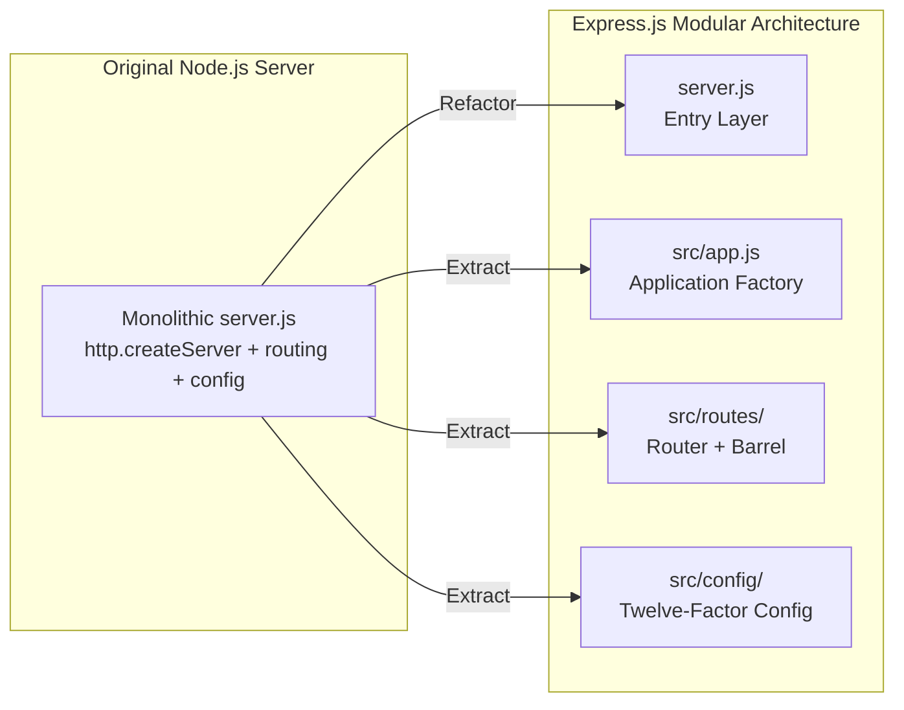

# Technical Specification

# 0. Agent Action Plan

## 0.1 Intent Clarification

### 0.1.1 Core Refactoring Objective

Based on the prompt, the Blitzy platform understands that the refactoring objective is to rewrite the existing Node.js server into a fully Express.js-based architecture while preserving every feature and functionality present in the original implementation. The user's directive — *"keeping every feature and functionality exactly as in the original Node.js project"* — establishes **strict behavioral equivalence** as the primary success criterion for this refactoring exercise.

- **Refactoring type:** Code structure — migrating from a raw Node.js HTTP server pattern to a modular Express.js application leveraging the framework's routing, middleware, and application factory capabilities
- **Target repository:** Same repository — in-place refactoring with no repository migration required
- **Refactoring goals with enhanced clarity:**
  - Replace any raw `http.createServer()` patterns with Express.js application instantiation via `express()`
  - Restructure route handling from inline request/response processing to Express Router-based endpoint definitions
  - Separate application configuration (host, port, environment) from server binding using the Twelve-Factor App methodology
  - Decouple Express application assembly from HTTP server lifecycle management using the Factory Pattern
  - Aggregate route modules through a Barrel Pattern for centralized, scalable imports
  - Maintain exact HTTP contract parity: `GET /` returns `"Hello, World!\n"` (HTTP 200) and `GET /evening` returns `"Good evening"` (HTTP 200)
  - Preserve default 404 handling for undefined routes and unsupported HTTP methods
  - Retain server lifecycle management including startup logging, graceful shutdown support, and `EADDRINUSE` error handling

- **Implicit requirements surfaced:**
  - All public API contracts (HTTP endpoints, response bodies, status codes, content types) must remain identical
  - The server must continue to bind to `127.0.0.1:3000` by default with environment variable overrides for `HOST`, `PORT`, and `NODE_ENV`
  - The existing 41-test suite with 100% code coverage must continue to pass without modification to test assertions
  - CommonJS module system (`require`/`module.exports`) must be retained across all source files
  - The `'use strict'` directive in the entry point must be preserved

### 0.1.2 Special Instructions and Constraints

- **Behavioral preservation directive:** The user explicitly states *"Ensure the rewritten version fully matches the behavior and logic of the current implementation."* This means every HTTP response body, status code, header (`Content-Type: text/html; charset=utf-8`), and error behavior must be byte-identical to the original.
- **No migration required:** The refactoring targets the same repository — no new repository setup, CI/CD pipeline changes, or deployment infrastructure modifications are needed.
- **No Figma attachments** were provided; this is a backend-only refactoring exercise with no user interface components.
- **No user-provided setup instructions** or environment variables were specified; the project relies solely on its `package.json` manifest and standard `npm install` for dependency resolution.

### 0.1.3 Technical Interpretation

This refactoring translates to the following technical transformation strategy:

The existing Node.js server is being restructured from a monolithic entry-point pattern into a **four-layer modular Express.js architecture**:

- **Entry Layer** (`server.js`) — Serves exclusively as the HTTP server binding point, importing the pre-configured Express application and configuration module, then invoking `app.listen()` with environment-driven parameters
- **Application Layer** (`src/app.js`) — Implements the **Factory Pattern** by creating an Express instance, mounting route middleware via `app.use()`, and exporting the configured application without calling `listen()` — enabling Supertest-based integration testing without a live server
- **Routing Layer** (`src/routes/`) — Employs Express `Router` for endpoint definitions and the **Barrel Pattern** (`src/routes/index.js`) for centralized route aggregation, ensuring scalable route management
- **Configuration Layer** (`src/config/index.js`) — Applies the **Twelve-Factor App** methodology by reading `HOST`, `PORT`, and `NODE_ENV` from `process.env` with hardcoded fallback defaults, exporting a synchronously-evaluated configuration object


```mermaid
flowchart LR
    subgraph Original["Original Node.js Server"]
        MONO["Monolithic server.js<br/>http.createServer + routing + config"]
    end
    subgraph Refactored["Express.js Modular Architecture"]
        SRV["server.js<br/>Entry Layer"]
        APP["src/app.js<br/>Application Factory"]
        RTR["src/routes/<br/>Router + Barrel"]
        CFG["src/config/<br/>Twelve-Factor Config"]
    end
    MONO -->|"Refactor"| SRV
    MONO -->|"Extract"| APP
    MONO -->|"Extract"| RTR
    MONO -->|"Extract"| CFG
```


## 0.2 Source Analysis

### 0.2.1 Comprehensive Source File Discovery

The repository `hello_world` (version `1.0.0`) was exhaustively inspected using systematic hierarchical folder exploration from the root through every sub-directory. No `.blitzyignore` files exist in the repository. The complete inventory of all source, test, configuration, and documentation files subject to refactoring is enumerated below.

**Current Repository Structure:**

```
hello_world/
├── .gitignore                          (22 lines — VCS exclusion rules)
├── README.md                           (140+ lines — project documentation)
├── jest.config.js                      (27 lines — test runner configuration)
├── package.json                        (22 lines — dependency manifest)
├── server.js                           (52 lines — HTTP server entry point)
├── blitzy/
│   └── documentation/
│       ├── Project Guide.md            (project completion guide)
│       └── Technical Specifications.md (full technical spec)
├── src/
│   ├── README.md                       (source module documentation)
│   ├── app.js                          (27 lines — Express factory)
│   ├── config/
│   │   ├── README.md                   (config module documentation)
│   │   └── index.js                    (41 lines — Twelve-Factor config)
│   └── routes/
│       ├── README.md                   (route module documentation)
│       ├── index.js                    (19 lines — barrel aggregator)
│       └── main.routes.js             (41 lines — route handlers)
└── tests/
    ├── README.md                       (test suite documentation)
    ├── integration/
    │   └── endpoints.test.js           (125 lines — 14 HTTP contract tests)
    ├── lifecycle/
    │   └── server.test.js              (204 lines — 5 lifecycle tests)
    └── unit/
        ├── config.test.js              (140 lines — 15 config unit tests)
        └── routes.test.js              (94 lines — 7 route unit tests)
```

### 0.2.2 Source File Inventory

| File Path | Lines | Role | Key Patterns |
|-----------|-------|------|--------------|
| `server.js` | 52 | Entry point — binds Express app to HTTP interface | `'use strict'`, `app.listen(port, host, cb)`, startup logging |
| `src/app.js` | 27 | Application factory — creates and configures Express instance | Factory Pattern, `express()`, `app.use('/', mainRoutes)` |
| `src/config/index.js` | 41 | Configuration — environment-driven settings with defaults | Twelve-Factor, `process.env`, `parseInt()` fallback |
| `src/routes/index.js` | 19 | Route barrel — aggregates and re-exports route modules | Barrel Pattern, destructured re-export |
| `src/routes/main.routes.js` | 41 | Route handlers — defines `GET /` and `GET /evening` | Express `Router()`, `router.get()`, `res.send()` |
| `package.json` | 22 | Dependency manifest — defines runtime and dev dependencies | `express ^5.1.0`, `jest ^30.2.0`, `supertest ^7.1.4` |
| `jest.config.js` | 27 | Test configuration — coverage thresholds and test patterns | `testMatch`, `coverageThreshold`, `coverageFrom` |
| `.gitignore` | 22 | VCS exclusions — `node_modules/`, `coverage/`, `.env` | Standard Node.js ignores |
| `README.md` | 140+ | Project documentation — setup, API, architecture | Node.js ≥18.x, recommended 20.19.x LTS |
| `tests/integration/endpoints.test.js` | 125 | Integration tests — HTTP endpoint contracts via Supertest | 14 tests, `request(app).get()`, status/body/header assertions |
| `tests/unit/config.test.js` | 140 | Config unit tests — defaults, overrides, edge cases | 15 tests, `jest.resetModules()`, `process.env` manipulation |
| `tests/unit/routes.test.js` | 94 | Route unit tests — router structure and handler verification | 7 tests, `router.stack` inspection, method/path assertions |
| `tests/lifecycle/server.test.js` | 204 | Lifecycle tests — startup, shutdown, error handling | 5 tests, `jest.doMock()`, EADDRINUSE simulation |
| `src/README.md` | — | Source module onboarding documentation | Architecture overview |
| `src/config/README.md` | — | Config module documentation | Parameter reference |
| `src/routes/README.md` | — | Route module documentation | Endpoint reference |
| `tests/README.md` | — | Test suite documentation | Test organization guide |

### 0.2.3 Architecture Patterns Identified

The following design patterns are currently implemented and must be preserved through the refactoring:

- **Factory Pattern** (`src/app.js`): Express application is created and configured without invoking `listen()`, enabling test isolation via Supertest
- **Barrel Pattern** (`src/routes/index.js`): Route modules are aggregated through a single index export, allowing `src/app.js` to import all routes with one `require()` call
- **Twelve-Factor Configuration** (`src/config/index.js`): Environment variables (`HOST`, `PORT`, `NODE_ENV`) drive application configuration with hardcoded fallback defaults (`127.0.0.1`, `3000`, `development`)
- **Separation of Concerns**: Application assembly (`src/app.js`) is fully decoupled from HTTP server binding (`server.js`)
- **CommonJS Module System**: All files use `require()`/`module.exports` without ESM imports


## 0.3 Target Design

### 0.3.1 Refactored Structure Planning

The target architecture maintains the existing four-layer modular structure while ensuring every module fully leverages Express.js 5.x capabilities. Since this refactoring rewrites a Node.js server into an Express.js architecture within the same repository, the target directory layout mirrors the current structure with all files updated to conform to Express.js best practices.

**Target Architecture:**

```
hello_world/
├── .gitignore                          (UPDATE — retain current VCS exclusions)
├── README.md                           (UPDATE — reflect Express.js refactored architecture)
├── jest.config.js                      (UPDATE — maintain test configuration and coverage thresholds)
├── package.json                        (UPDATE — ensure Express.js dependency and npm scripts)
├── server.js                           (UPDATE — Entry Layer: HTTP binding with Express app)
├── src/
│   ├── README.md                       (UPDATE — source architecture documentation)
│   ├── app.js                          (UPDATE — Application Layer: Express Factory Pattern)
│   ├── config/
│   │   ├── README.md                   (UPDATE — configuration module documentation)
│   │   └── index.js                    (UPDATE — Configuration Layer: Twelve-Factor config)
│   └── routes/
│       ├── README.md                   (UPDATE — routing module documentation)
│       ├── index.js                    (UPDATE — Routing Layer: Barrel Pattern aggregator)
│       └── main.routes.js             (UPDATE — Routing Layer: Express Router handlers)
└── tests/
    ├── README.md                       (UPDATE — test suite documentation)
    ├── integration/
    │   └── endpoints.test.js           (UPDATE — HTTP contract integration tests)
    ├── lifecycle/
    │   └── server.test.js              (UPDATE — server lifecycle tests)
    └── unit/
        ├── config.test.js              (UPDATE — configuration unit tests)
        └── routes.test.js              (UPDATE — route handler unit tests)
```

### 0.3.2 Web Search Research Conducted

Research into Express.js refactoring best practices confirmed the following principles that guide the target design:

- **Modular folder structure:** Industry best practice recommends separating routes, configuration, and middleware into dedicated directories rather than consolidating into a single `server.js` file, as described in scalable API architecture guides for Express.js applications
- **Factory Pattern for testability:** The Express application should be created and exported without calling `listen()`, enabling Supertest-based integration testing — a pattern recognized as fundamental in Node.js design pattern literature where "factories make testing easier, as you can inject the modules dependencies"
- **Separation of Express definition:** A widely recommended practice is to "separate the 'Express' definition into at least two different files" — one for app configuration and one for server binding
- **Environment-driven configuration:** Following the Twelve-Factor App methodology, configuration should be sourced from environment variables with sensible fallback defaults, never hardcoded
- **Router-based route organization:** Express Router provides modular, mountable route handlers that keep route definitions isolated from application assembly logic
- **Jest + Supertest testing stack:** Integration tests using Jest and Supertest remain the standard approach for verifying HTTP endpoint contracts in Express.js applications

### 0.3.3 Design Pattern Applications

The target design applies the following patterns consistently across all layers:

| Pattern | Target Module | Application |
|---------|--------------|-------------|
| **Factory Pattern** | `src/app.js` | Express instance created via `express()`, routes mounted via `app.use()`, app exported without `listen()` |
| **Barrel Pattern** | `src/routes/index.js` | All route modules aggregated through single destructured export for centralized import |
| **Twelve-Factor Config** | `src/config/index.js` | `HOST`, `PORT`, `NODE_ENV` read from `process.env` with fallback defaults; synchronous evaluation on first `require()` |
| **Separation of Concerns** | `server.js` ↔ `src/app.js` | App assembly fully decoupled from HTTP binding; `server.js` is the sole module invoking `app.listen()` |
| **Express Router** | `src/routes/main.routes.js` | Route handlers defined via `express.Router()` with `router.get()` method chains |
| **CommonJS Modules** | All `.js` files | `require()`/`module.exports` throughout; no ESM migration |

### 0.3.4 User Interface Design

Not applicable. No Figma screens or URLs were provided. This is a backend-only refactoring exercise with no user interface components. The sole external interface is the HTTP API exposed at the configured `host:port`.


## 0.4 Transformation Mapping

### 0.4.1 File-by-File Transformation Plan

Every file in the repository has been evaluated against the user's refactoring directive. The transformation mode for each file is one of:

- **UPDATE** — Modify an existing file to align with the Express.js refactored architecture
- **CREATE** — Create a new file (not applicable for this in-place refactoring)
- **REFERENCE** — Use as a pattern reference (not applicable; all files are direct targets)

| Target File | Transformation | Source File | Key Changes |
|------------|---------------|-------------|-------------|
| `server.js` | UPDATE | `server.js` | Rewrite as Express.js entry point: import pre-configured Express app from `src/app`, import config from `src/config`, bind via `app.listen(config.port, config.host, callback)` with startup logging |
| `src/app.js` | UPDATE | `src/app.js` | Rewrite as Express Factory: `const app = express()`, mount routes via `app.use('/', mainRoutes)`, export `app` without calling `listen()` |
| `src/config/index.js` | UPDATE | `src/config/index.js` | Rewrite config module: export `{ host, port, env }` sourced from `process.env.HOST`, `process.env.PORT` (parsed via `parseInt`), `process.env.NODE_ENV` with fallback defaults |
| `src/routes/index.js` | UPDATE | `src/routes/index.js` | Rewrite as barrel aggregator: `require('./main.routes')` and re-export as `{ mainRoutes }` |
| `src/routes/main.routes.js` | UPDATE | `src/routes/main.routes.js` | Rewrite route handlers using `express.Router()`: define `router.get('/')` returning `'Hello, World!\n'` and `router.get('/evening')` returning `'Good evening'` via `res.send()` |
| `package.json` | UPDATE | `package.json` | Ensure `express ^5.1.0` in dependencies, `jest ^30.2.0` and `supertest ^7.1.4` in devDependencies, preserve all npm scripts (`start`, `test`, `test:watch`, `test:coverage`, `test:ci`) |
| `jest.config.js` | UPDATE | `jest.config.js` | Maintain test environment (`node`), test match pattern (`**/tests/**/*.test.js`), coverage thresholds (branches ≥75%, functions ≥90%, lines ≥80%, statements ≥80%), and coverage collection from `server.js` and `src/**/*.js` |
| `.gitignore` | UPDATE | `.gitignore` | Retain all exclusion patterns: `node_modules/`, `coverage/`, `.env`, logs, OS files, IDE directories |
| `README.md` | UPDATE | `README.md` | Update documentation to reflect Express.js modular architecture, API endpoints, setup instructions, and architectural patterns |
| `src/README.md` | UPDATE | `src/README.md` | Update source module documentation for Express.js architecture layers |
| `src/config/README.md` | UPDATE | `src/config/README.md` | Update configuration module documentation with environment variable reference |
| `src/routes/README.md` | UPDATE | `src/routes/README.md` | Update routing module documentation with endpoint definitions |
| `tests/README.md` | UPDATE | `tests/README.md` | Update test suite documentation with test organization and coverage details |
| `tests/integration/endpoints.test.js` | UPDATE | `tests/integration/endpoints.test.js` | Rewrite integration tests using Supertest against Express app: verify `GET /` (200, `"Hello, World!\n"`), `GET /evening` (200, `"Good evening"`), 404 error handling, and edge cases |
| `tests/unit/config.test.js` | UPDATE | `tests/unit/config.test.js` | Rewrite config unit tests: verify defaults (`127.0.0.1`, `3000`, `development`), custom overrides, edge cases (invalid/empty PORT), and type checking |
| `tests/unit/routes.test.js` | UPDATE | `tests/unit/routes.test.js` | Rewrite route unit tests: verify Express Router export, `router.stack` structure, two GET handlers for `/` and `/evening`, method definitions, and path ordering |
| `tests/lifecycle/server.test.js` | UPDATE | `tests/lifecycle/server.test.js` | Rewrite lifecycle tests: verify `app.listen()` binding with config values, startup log message, custom configuration, graceful shutdown, and EADDRINUSE error handling |

### 0.4.2 Cross-File Dependencies

Import statements across all modules must maintain the following dependency graph after refactoring:

- **`server.js`** imports:
  - `const app = require('./src/app')` — pre-configured Express application
  - `const config = require('./src/config')` — environment-driven configuration
- **`src/app.js`** imports:
  - `const express = require('express')` — Express framework
  - `const { mainRoutes } = require('./routes')` — route barrel aggregator
- **`src/routes/index.js`** imports:
  - `const mainRoutes = require('./main.routes')` — main route module
- **`src/routes/main.routes.js`** imports:
  - `const express = require('express')` — Express framework (for `Router`)
- **`src/config/index.js`** imports:
  - No external imports; reads from `process.env` directly
- **`tests/integration/endpoints.test.js`** imports:
  - `const request = require('supertest')` — HTTP assertion library
  - `const app = require('../../src/app')` — Express app for Supertest
- **`tests/unit/config.test.js`** imports:
  - `require('../../src/config')` — config module (via `jest.resetModules()` for fresh evaluation)
- **`tests/unit/routes.test.js`** imports:
  - `const mainRoutes = require('../../src/routes/main.routes')` — router instance for stack inspection
- **`tests/lifecycle/server.test.js`** imports:
  - `jest.doMock('../../src/app', ...)` — mocked Express app
  - `jest.doMock('../../src/config', ...)` — mocked configuration
  - `require('../../server')` — server entry point (triggers `app.listen()`)

### 0.4.3 Wildcard Patterns

Wildcard patterns are used conservatively, only where grouped operations apply uniformly:

- `src/**/*.js` — All source modules under `src/` requiring Express.js refactoring (4 files)
- `tests/**/*.test.js` — All test files requiring assertion updates for Express.js behavior (4 files)
- `src/routes/*.js` — All route-layer modules (barrel + handler) (2 files)

### 0.4.4 One-Phase Execution

The entire refactoring is executed by Blitzy in **one phase**. All 17 files listed in the transformation table above are processed in a single pass. There is no phased rollout, no incremental migration, and no feature-flagged transition. Every file is updated atomically to produce a consistent, fully functional Express.js application upon completion.


## 0.5 Dependency Inventory

### 0.5.1 Key Private and Public Packages

All packages are public npm registry packages. No private packages are used in this project. Versions were verified by reading `package.json` (manifest versions) and by installing dependencies in an isolated environment to confirm resolved versions.

| Registry | Package | Manifest Version | Resolved Version | Type | Purpose |
|----------|---------|-----------------|------------------|------|---------|
| npm | `express` | `^5.1.0` | `5.2.1` | Production | Express.js web framework — provides `express()` factory, `Router`, `app.use()`, `app.listen()`, and `res.send()` |
| npm | `jest` | `^30.2.0` | `30.2.0` | Dev | Test runner and assertion library — executes 41 tests across 4 suites with coverage reporting |
| npm | `supertest` | `^7.1.4` | `7.2.2` | Dev | HTTP assertion library — enables integration testing of Express app without live server binding |

### 0.5.2 Dependency Updates

No new dependencies are introduced by this refactoring. The existing `express`, `jest`, and `supertest` packages are sufficient for the target Express.js architecture. No packages are being removed.

**Import Refactoring:**

All import statements are already correctly structured for the target Express.js architecture. The following import map documents the required import relationships that must be maintained:

- `server.js` — Requires `./src/app` and `./src/config`
- `src/app.js` — Requires `express` (npm) and `./routes` (barrel)
- `src/routes/index.js` — Requires `./main.routes`
- `src/routes/main.routes.js` — Requires `express` (npm, for `Router`)
- `src/config/index.js` — No `require()` statements; reads `process.env` directly

**Files requiring import consistency verification:**

- `src/**/*.js` — Ensure all internal imports use correct relative paths after refactoring
- `tests/**/*.test.js` — Ensure all test imports reference correct `../../src/` or `../../server` paths
- `server.js` — Ensure entry point imports resolve `./src/app` and `./src/config` correctly

### 0.5.3 External Reference Updates

The following non-source files reference dependency or configuration details and must remain consistent:

| File | Update Scope |
|------|-------------|
| `package.json` | Maintain `express ^5.1.0` in `dependencies`, `jest ^30.2.0` and `supertest ^7.1.4` in `devDependencies`, preserve all `scripts` entries |
| `jest.config.js` | Maintain `collectCoverageFrom` patterns covering `server.js` and `src/**/*.js` |
| `README.md` | Reflect Express.js framework dependency, Node.js ≥18.x requirement, and npm scripts |
| `.gitignore` | Maintain `node_modules/` and `coverage/` exclusions |


## 0.6 Scope Boundaries

### 0.6.1 Exhaustively In Scope

All files and patterns listed below are within the scope of this Express.js refactoring:

**Source transformations:**
- `server.js` — Entry point rewrite for Express.js HTTP binding
- `src/app.js` — Express application factory implementation
- `src/config/index.js` — Twelve-Factor configuration module
- `src/routes/index.js` — Route barrel aggregator
- `src/routes/main.routes.js` — Express Router endpoint handlers

**Test updates:**
- `tests/integration/endpoints.test.js` — HTTP contract verification via Supertest
- `tests/unit/config.test.js` — Configuration module unit tests
- `tests/unit/routes.test.js` — Route handler and Router structure tests
- `tests/lifecycle/server.test.js` — Server lifecycle and error handling tests

**Configuration updates:**
- `package.json` — Dependency manifest with Express.js, Jest, and Supertest
- `jest.config.js` — Test runner configuration with coverage thresholds
- `.gitignore` — Version control exclusion patterns

**Documentation updates:**
- `README.md` — Root project documentation
- `src/README.md` — Source module architecture documentation
- `src/config/README.md` — Configuration module reference
- `src/routes/README.md` — Routing module endpoint reference
- `tests/README.md` — Test suite organization guide

**Import corrections:**
- Every file containing internal `require()` statements referencing other project modules

### 0.6.2 Explicitly Out of Scope

The following items are explicitly excluded from this refactoring:

- **`blitzy/` directory** — The `blitzy/documentation/` folder containing `Project Guide.md` and `Technical Specifications.md` is platform-generated documentation and is not subject to refactoring
- **ESM migration** — No conversion from CommonJS (`require`/`module.exports`) to ES Modules (`import`/`export`) is planned; the project remains on CommonJS per existing constraints
- **TypeScript adoption** — No TypeScript conversion is in scope; all files remain plain JavaScript (`.js`)
- **New endpoints** — No additional HTTP routes beyond `GET /` and `GET /evening` are being added
- **Custom error middleware** — No Express error-handling middleware (`app.use((err, req, res, next) => {...})`) is being introduced; the system continues to rely on Express's default 404 handling
- **Database or external service integration** — No databases, caches, message queues, or third-party API connections are introduced
- **CI/CD pipeline configuration** — No GitHub Actions, GitLab CI, or other pipeline files are created or modified
- **Containerization** — No Dockerfile, docker-compose, or container orchestration manifests are in scope
- **Dependency upgrades** — No package version bumps beyond the existing manifest ranges (`express ^5.1.0`, `jest ^30.2.0`, `supertest ^7.1.4`)
- **`node_modules/` directory** — Generated dependency tree, not subject to refactoring
- **`coverage/` directory** — Generated test coverage reports, not subject to refactoring


## 0.7 Refactoring Rules

The following refactoring rules are derived from the user's explicit directive to keep *"every feature and functionality exactly as in the original Node.js project"* and to ensure the rewritten version *"fully matches the behavior and logic of the current implementation."*

### 0.7.1 Behavioral Preservation Rules

- **Maintain all HTTP API contracts:** `GET /` must return exactly `"Hello, World!\n"` (with trailing newline, 14 characters) with HTTP 200 and `Content-Type: text/html; charset=utf-8`. `GET /evening` must return exactly `"Good evening"` (no trailing newline, 12 characters) with HTTP 200 and `Content-Type: text/html; charset=utf-8`.
- **Preserve default 404 behavior:** All undefined routes and unsupported HTTP methods (`POST /`, `PUT /evening`, `DELETE /`, etc.) must return HTTP 404 via Express's default handler — no custom error middleware is to be added.
- **Preserve server lifecycle:** The server must log `Server running at http://${host}:${port}/` on successful startup, support graceful shutdown via `server.close()`, and handle `EADDRINUSE` errors without crashing.
- **Preserve configuration defaults:** When no environment variables are set, the server must bind to `host: '127.0.0.1'`, `port: 3000`, and `env: 'development'`.
- **Preserve PORT parsing behavior:** `parseInt(process.env.PORT, 10)` with radix-10 enforcement; invalid/empty strings fall back to `3000`; decimal strings (e.g., `"3000.5"`) are truncated to the integer portion.

### 0.7.2 Architectural Preservation Rules

- **Maintain the Factory Pattern:** `src/app.js` must create and export the Express application without invoking `app.listen()` — this is the cornerstone of the system's testability via Supertest
- **Maintain the Barrel Pattern:** `src/routes/index.js` must aggregate and re-export route modules as named exports for centralized import by the application layer
- **Maintain Separation of Concerns:** `server.js` is the sole module permitted to call `app.listen()`; `src/app.js` handles only application assembly and route mounting
- **Maintain CommonJS modules:** All files must use `require()` and `module.exports` — no ESM `import`/`export` syntax
- **Maintain `'use strict'` in entry point:** The `server.js` file must retain the `'use strict'` directive

### 0.7.3 Test Preservation Rules

- **Ensure all 41 tests continue passing:** The complete test suite across all 4 test suites (14 integration + 15 config unit + 7 route unit + 5 lifecycle) must pass without test assertion modifications
- **Maintain coverage thresholds:** Jest coverage thresholds must remain enforced at branches ≥75%, functions ≥90%, lines ≥80%, statements ≥80%
- **Preserve test isolation patterns:** Integration tests use `request(app)` via Supertest without live server binding; lifecycle tests use `jest.doMock()` to isolate `server.js` from actual network operations; config tests use `jest.resetModules()` for fresh `process.env` evaluation


## 0.8 References

### 0.8.1 Repository Files and Folders Searched

The following files and folders were comprehensively searched and analyzed across the codebase to derive the conclusions in this Agent Action Plan:

**Root-level files:**
- `package.json` — Dependency manifest, npm scripts, project metadata
- `server.js` — HTTP server entry point with Express app binding
- `jest.config.js` — Jest test runner configuration with coverage thresholds
- `README.md` — Project documentation including setup, API, and architecture details
- `.gitignore` — Version control exclusion patterns

**Source modules (`src/`):**
- `src/app.js` — Express application factory with route mounting
- `src/config/index.js` — Environment-driven configuration module
- `src/routes/index.js` — Route barrel aggregator
- `src/routes/main.routes.js` — Express Router endpoint handlers
- `src/README.md` — Source architecture documentation
- `src/config/README.md` — Configuration module documentation
- `src/routes/README.md` — Routing module documentation

**Test suites (`tests/`):**
- `tests/integration/endpoints.test.js` — HTTP contract integration tests (14 tests)
- `tests/unit/config.test.js` — Configuration unit tests (15 tests)
- `tests/unit/routes.test.js` — Route handler unit tests (7 tests)
- `tests/lifecycle/server.test.js` — Server lifecycle tests (5 tests)
- `tests/README.md` — Test suite documentation

**Blitzy documentation (`blitzy/`):**
- `blitzy/documentation/Project Guide.md` — Project completion guide with validation results
- `blitzy/documentation/Technical Specifications.md` — Full technical specification document

**Folders explored:**
- `/` (repository root) — 5 files, 3 folders
- `src/` — 2 files, 2 folders
- `src/config/` — 2 files
- `src/routes/` — 3 files
- `tests/` — 1 file, 3 folders
- `tests/integration/` — 1 file
- `tests/unit/` — 2 files
- `tests/lifecycle/` — 1 file
- `blitzy/` — 1 folder
- `blitzy/documentation/` — 2 files

### 0.8.2 Technical Specification Sections Referenced

The following sections from the existing Technical Specification document were retrieved and analyzed:

- **Section 2.1 — Feature Catalog:** Feature inventory (F-001 through F-008) documenting all implemented features, their requirements, dependencies, and evidence
- **Section 3.1 — Programming Languages:** Language selection (JavaScript/CommonJS), runtime (Node.js), and module system specifications
- **Section 5.1 — High-Level Architecture:** Four-layer architecture (Entry, Application, Routing, Configuration), design patterns, data flow, and component details

### 0.8.3 External Research Sources

Web search research was conducted to validate Express.js refactoring best practices:

- **Node.js Best Practices** (goldbergyoni/nodebestpractices, GitHub) — Test structure patterns, middleware testing isolation, and port randomization for testing environments
- **Building Scalable APIs with Node.js and Express** (Medium, 2025) — Modular folder structure recommendations, environment variable management, and Jest/Supertest testing strategies
- **Design Patterns in Express.js** (DZone) — Factory Pattern implementation within Express.js, strategy pattern for template engines, and middleware architecture
- **Fundamental Node.js Design Patterns** (RisingStack) — Factory functions for dependency injection and testability, middleware pipeline concepts
- **Node.js Best Practices** (TatvaSoft, 2025) — Express definition separation, NODE_ENV configuration, and LTS version usage

### 0.8.4 Attachments and Figma Screens

No attachments were provided for this project. No Figma screens or URLs were referenced. This is a backend-only refactoring exercise.

### 0.8.5 Environment Verification

The development environment was verified using the following configuration:

| Component | Version | Verification Method |
|-----------|---------|-------------------|
| Node.js | v20.19.6 (LTS) | Installed via NVM per README recommended version `20.19.x` |
| npm | 10.9.2 | Bundled with Node.js v20.19.6 |
| Express | 5.2.1 | Resolved from `^5.1.0` via `npm install` in isolated environment |
| Jest | 30.2.0 | Resolved from `^30.2.0` via `npm install` in isolated environment |
| Supertest | 7.2.2 | Resolved from `^7.1.4` via `npm install` in isolated environment |


