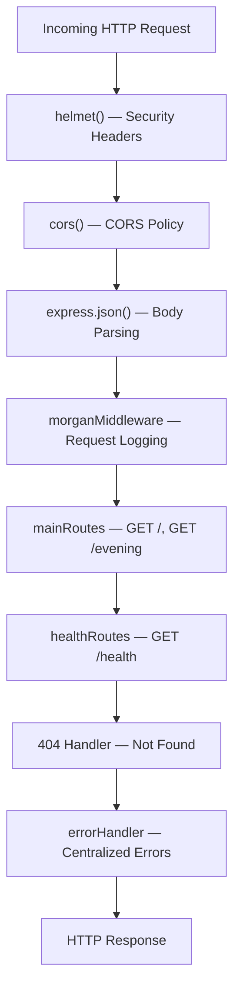

# Technical Specification

# 0. Agent Action Plan

## 0.1 Intent Clarification

### 0.1.1 Core Objective

Based on the provided requirements, the Blitzy platform understands that the objective is to evolve the existing "Hello World Tutorial Server"—a minimal Express.js 5.x application with two GET endpoints—into a production-ready HTTP server with enterprise-grade middleware, structured logging, externalized environment configuration, and PM2 process management for reliable deployment. Specifically, the user requires:

- **Express.js Framework Enhancement**: Extend the existing Express.js 5.1.0 application factory (`src/app.js`) with production middleware including JSON body parsing, security headers, CORS support, and centralized error handling.
- **Routing Expansion**: Build on the existing barrel-pattern route architecture (`src/routes/`) to add a health-check endpoint and prepare the routing layer for future API growth, while preserving the current `GET /` and `GET /evening` endpoints.
- **Middleware Pipeline**: Introduce a layered middleware pipeline that includes request logging (Morgan), security hardening (Helmet), CORS control, JSON body parsing, and a centralized error-handling middleware—all integrated into the existing app factory.
- **Environment Configuration**: Replace the current direct `process.env` access pattern in `src/config/index.js` with a `dotenv`-backed configuration system, introducing `.env` and `.env.example` files that follow the Twelve-Factor App methodology already partially implemented.
- **Structured Logging**: Implement a Winston-based logging utility (`src/utils/logger.js`) with environment-aware log levels, console and file transports, and Morgan HTTP request logging integration—keeping test output clean by mounting Morgan in `server.js` rather than in the app factory.
- **PM2 Production Deployment**: Create a PM2 ecosystem configuration (`ecosystem.config.js`) enabling cluster-mode deployment, environment-specific settings, graceful restarts, and memory-bounded operation, along with corresponding npm scripts for production start and stop.

Implicit requirements detected:
- The existing 41 passing tests must continue to pass after all modifications, preserving backward compatibility.
- New middleware and utilities require corresponding unit and integration tests to maintain the project's 80%+ coverage thresholds.
- The `.env` file must be added to `.gitignore` to prevent secret leakage, and a `.env.example` template must be provided for developer onboarding.
- A `logs/` directory (and its `.gitkeep`) must be created for Winston file transports, and `logs/` must be added to `.gitignore`.

### 0.1.2 Task Categorization

- **Primary task type**: Mixed (Feature Enhancement + Configuration + Production Deployment Preparation)
- **Secondary aspects**: Security enhancement (Helmet, CORS), Logging infrastructure, DevOps/Tooling (PM2)
- **Scope classification**: Cross-cutting change — modifications span entry point, application factory, configuration, routing, middleware, utilities, tests, documentation, and deployment configuration

### 0.1.3 Special Instructions and Constraints

- No user-specified constraints beyond the feature request itself were provided. The platform infers the following from the existing codebase:
  - **Module system**: All code must use CommonJS (`require`/`module.exports`), consistent with the existing codebase.
  - **Express version**: Express.js 5.1.0 must be retained as the core framework dependency.
  - **Test framework**: Jest 30.2.0 and Supertest 7.1.4 remain the testing stack; all new code must be covered by tests.
  - **Node.js version**: The project targets Node.js 18.x minimum, with 20.19.x LTS as the recommended runtime.
  - **Coverage thresholds**: Lines ≥ 80%, Branches ≥ 75%, Functions ≥ 90%, Statements ≥ 80% must be maintained.
- Web search research conducted:
  - Express.js 5 production middleware best practices (2025)
  - PM2 ecosystem.config.js production setup patterns
  - Morgan + Winston logging integration for Express.js
  - Latest package versions for PM2, Winston, Morgan, dotenv, Helmet, CORS

### 0.1.4 Technical Interpretation

These requirements translate to the following technical implementation strategy:

- To **add middleware**, we will update `src/app.js` to mount `express.json()`, `helmet()`, `cors()`, and Morgan (conditionally or in `server.js`) into the Express pipeline, and add a centralized error-handling middleware at the end of the middleware chain.
- To **enhance routing**, we will create `src/routes/health.routes.js` with a `GET /health` endpoint returning JSON status, update `src/routes/index.js` to export the new route, and mount it in `src/app.js`.
- To **externalize configuration**, we will add `dotenv` as a runtime dependency, create `.env` and `.env.example` files with `HOST`, `PORT`, `NODE_ENV`, and `LOG_LEVEL` variables, update `src/config/index.js` to call `require('dotenv').config()` at the top, and update `.gitignore` to exclude `.env`.
- To **implement logging**, we will create `src/utils/logger.js` using Winston with environment-aware levels, console and file transports, and create `src/middleware/morgan.middleware.js` to pipe Morgan output through the Winston logger's HTTP transport.
- To **prepare for PM2 deployment**, we will create `ecosystem.config.js` at the project root with cluster-mode configuration, environment-specific settings, memory limits, and log paths, and add `pm2:start` and `pm2:stop` npm scripts to `package.json`.
- To **maintain test integrity**, we will update existing tests where configuration loading changes may affect environment isolation, and create new test files for the health endpoint, logger utility, error middleware, and PM2 configuration validation.

## 0.2 Repository Scope Discovery

### 0.2.1 Comprehensive File Analysis

The repository is a compact Node.js/Express.js tutorial project rooted at the project directory with the following discovered structure:

**Source Files (Application Code)**

| File Path | Purpose | Relevance to Task |
|-----------|---------|-------------------|
| `server.js` | Entry point — imports app and config, binds HTTP listener | Must integrate Morgan logger middleware and Winston startup logging |
| `src/app.js` | Express application factory — creates app, mounts routes | Must add middleware pipeline (Helmet, CORS, JSON parsing, error handler) |
| `src/config/index.js` | Centralized config — reads `process.env` with defaults | Must integrate `dotenv` and add new config keys (`LOG_LEVEL`) |
| `src/routes/index.js` | Barrel pattern route aggregator | Must export new health route |
| `src/routes/main.routes.js` | Route handlers for `GET /` and `GET /evening` | Reference only — no changes needed |

**Test Files**

| File Path | Purpose | Relevance to Task |
|-----------|---------|-------------------|
| `tests/unit/config.test.js` | Unit tests for config module — env var reading, defaults | May need minor updates if `dotenv` changes module loading behavior |
| `tests/unit/routes.test.js` | Unit tests for router structure — introspection | Must update to account for new health route |
| `tests/integration/endpoints.test.js` | HTTP endpoint tests via Supertest | Must add tests for new health endpoint and error handling |
| `tests/lifecycle/server.test.js` | Server startup/shutdown mock-based tests | May need updates for Morgan integration in `server.js` |

**Configuration and Project Files**

| File Path | Purpose | Relevance to Task |
|-----------|---------|-------------------|
| `package.json` | Dependencies, scripts, project metadata | Must add new dependencies and PM2 scripts |
| `jest.config.js` | Jest configuration with coverage thresholds | Must update coverage collection paths for new files |
| `.gitignore` | VCS exclusion patterns | Must add `.env` and `logs/` patterns |
| `README.md` | Project documentation | Must update with new features, middleware, PM2 usage |

**Documentation Files (Reference Only)**

| File Path | Purpose |
|-----------|---------|
| `blitzy/documentation/Project Guide.md` | Project guide documentation |
| `blitzy/documentation/Technical Specifications.md` | Full technical specification |

### 0.2.2 Web Search Research Conducted

The following research was conducted to validate the implementation approach and confirm package versions:

- **Express.js 5 production middleware best practices (2025)**: Confirmed the recommended middleware ordering — security headers first (Helmet), then CORS, JSON parsing, request logging, routes, and error handling last. The factory pattern separation of app and server is validated as a best practice for testability.
- **PM2 ecosystem.config.js production setup**: Confirmed that PM2 6.x uses `ecosystem.config.js` with `apps` array containing `name`, `script`, `instances`, `exec_mode`, `env`, and `env_production` fields. Cluster mode with `instances: 'max'` is the recommended production configuration.
- **Morgan + Winston logging integration**: Confirmed the pattern of creating a Winston logger with custom transports and piping Morgan's output through Winston's stream interface, using the `http` log level for request logs.
- **Package versions verified**: `pm2@6.0.14`, `winston@3.19.0`, `morgan@1.10.1`, `dotenv@17.2.3`, `helmet@8.1.0`, `cors@2.8.5` (latest stable versions).

### 0.2.3 Existing Infrastructure Assessment

- **Project structure**: Follows a clean layered architecture with `src/` containing application code, `tests/` containing test suites, and root-level configuration files. The pattern of separating the app factory from the server entry point is already in place.
- **Existing patterns and conventions**: CommonJS module system, barrel pattern for route exports, factory pattern for Express app creation, Twelve-Factor App methodology for configuration.
- **Build and deployment configurations**: Currently limited to `npm start` (`node server.js`). No CI/CD pipeline, no Dockerfile, no process manager configuration exists. The `.gitignore` already excludes `node_modules/`, `coverage/`, and `.env`.
- **Testing infrastructure**: Comprehensive Jest 30.2.0 setup with Supertest 7.1.4, organized into `unit/`, `integration/`, and `lifecycle/` directories. Coverage thresholds are enforced globally. All 41 tests currently pass with 100% coverage across all metrics.
- **Documentation system**: `README.md` at root with setup instructions; `blitzy/documentation/` folder contains detailed project guide and technical specifications.

## 0.3 File Transformation Mapping

### 0.3.1 File-by-File Execution Plan

| Target File | Transformation | Source File/Reference | Purpose/Changes |
|-------------|----------------|----------------------|-----------------|
| `src/app.js` | UPDATE | `src/app.js` | Add middleware pipeline: `helmet()`, `cors()`, `express.json()`, mount health route, add centralized error handler |
| `src/config/index.js` | UPDATE | `src/config/index.js` | Integrate `dotenv` loading, add `LOG_LEVEL` config property |
| `server.js` | UPDATE | `server.js` | Integrate Morgan HTTP request logging middleware and Winston startup log |
| `src/routes/index.js` | UPDATE | `src/routes/index.js` | Export new `healthRoutes` alongside existing `mainRoutes` |
| `src/routes/health.routes.js` | CREATE | `src/routes/main.routes.js` | New health-check endpoint `GET /health` returning JSON status |
| `src/middleware/error.middleware.js` | CREATE | `src/routes/main.routes.js` | Centralized Express error-handling middleware (4-argument signature) |
| `src/utils/logger.js` | CREATE | None | Winston logger with environment-aware levels, console and file transports |
| `src/middleware/morgan.middleware.js` | CREATE | None | Morgan middleware configured to pipe through Winston stream |
| `ecosystem.config.js` | CREATE | None | PM2 process manager configuration for production deployment |
| `.env` | CREATE | `src/config/index.js` | Environment variable file with `HOST`, `PORT`, `NODE_ENV`, `LOG_LEVEL` |
| `.env.example` | CREATE | `src/config/index.js` | Template `.env` file for developer onboarding (committed to VCS) |
| `package.json` | UPDATE | `package.json` | Add new runtime and dev dependencies, add PM2 npm scripts |
| `jest.config.js` | UPDATE | `jest.config.js` | Update `collectCoverageFrom` to include new `src/` subdirectories |
| `.gitignore` | UPDATE | `.gitignore` | Add `.env`, `logs/` exclusion patterns |
| `README.md` | UPDATE | `README.md` | Document new middleware, logging, configuration, PM2 usage |
| `tests/unit/config.test.js` | UPDATE | `tests/unit/config.test.js` | Adapt tests for dotenv integration; add `LOG_LEVEL` config tests |
| `tests/unit/routes.test.js` | UPDATE | `tests/unit/routes.test.js` | Add assertions for new health route in router structure tests |
| `tests/unit/logger.test.js` | CREATE | `tests/unit/config.test.js` | Unit tests for Winston logger utility — levels, transports, format |
| `tests/unit/error-middleware.test.js` | CREATE | `tests/unit/routes.test.js` | Unit tests for error-handling middleware behavior |
| `tests/integration/endpoints.test.js` | UPDATE | `tests/integration/endpoints.test.js` | Add integration tests for `GET /health` and error-handling responses |
| `tests/lifecycle/server.test.js` | UPDATE | `tests/lifecycle/server.test.js` | Update mocks for Morgan and Winston logger integration |
| `logs/.gitkeep` | CREATE | None | Ensure `logs/` directory exists in VCS for Winston file transports |
| `src/routes/main.routes.js` | REFERENCE | `src/routes/main.routes.js` | Reference for route handler patterns when creating health route |

### 0.3.2 New Files Detail

- **`src/routes/health.routes.js`** — Health-check endpoint
  - Content type: source
  - Based on: `src/routes/main.routes.js` route handler pattern
  - Key functions: `GET /health` handler returning `{ status: 'ok', uptime: process.uptime(), timestamp: Date.now() }`

- **`src/middleware/error.middleware.js`** — Centralized error handler
  - Content type: source
  - Based on: Express.js error-handling middleware pattern (4-argument function)
  - Key functions: `errorHandler(err, req, res, next)` — logs error via Winston, returns structured JSON error response

- **`src/utils/logger.js`** — Winston logger utility
  - Content type: source
  - Based on: Winston best practices with environment-aware configuration
  - Key sections: custom log levels, `Console` transport for all environments, `File` transports (`logs/error.log`, `logs/all.log`) for production, JSON formatting with timestamps

- **`src/middleware/morgan.middleware.js`** — Morgan HTTP logging middleware
  - Content type: source
  - Based on: Morgan stream integration pattern with Winston
  - Key functions: Morgan middleware configured with combined/dev format depending on `NODE_ENV`, streaming to Winston's `http` level

- **`ecosystem.config.js`** — PM2 process manager configuration
  - Content type: config
  - Based on: PM2 official ecosystem file patterns
  - Key sections: `apps` array with `name`, `script`, `instances`, `exec_mode`, environment variables for development and production

- **`.env`** / **`.env.example`** — Environment variable files
  - Content type: config
  - Based on: `src/config/index.js` existing environment variables
  - Key variables: `HOST`, `PORT`, `NODE_ENV`, `LOG_LEVEL`

- **`tests/unit/logger.test.js`** — Logger utility tests
  - Content type: test
  - Based on: `tests/unit/config.test.js` testing patterns
  - Key sections: transport validation, log level verification, format assertions

- **`tests/unit/error-middleware.test.js`** — Error middleware tests
  - Content type: test
  - Based on: `tests/unit/routes.test.js` testing patterns
  - Key sections: error response structure, status code propagation, logging verification

- **`logs/.gitkeep`** — Git placeholder for logs directory
  - Content type: config
  - Ensures the `logs/` directory is tracked in version control while actual log files are ignored

### 0.3.3 Files to Modify Detail

- **`src/app.js`** — Add middleware pipeline
  - New imports: `helmet`, `cors`, `express.json()`, health routes, error middleware
  - Middleware mounting order: `helmet()` → `cors()` → `express.json()` → routes → error handler
  - The Morgan middleware is intentionally kept in `server.js` to avoid cluttering test output

- **`src/config/index.js`** — Integrate dotenv
  - Add `require('dotenv').config()` as the first line
  - Add `logLevel` property with `LOG_LEVEL` env var and `'info'` default
  - Preserve existing `host`, `port`, `env` property logic

- **`server.js`** — Add logging integration
  - Import Winston logger from `src/utils/logger.js`
  - Import Morgan middleware from `src/middleware/morgan.middleware.js`
  - Mount Morgan middleware on app before `listen()`
  - Replace `console.log` startup message with `logger.info()` call

- **`src/routes/index.js`** — Export health routes
  - Add import for `health.routes.js`
  - Export `healthRoutes` alongside existing `mainRoutes`

- **`package.json`** — Dependency and script updates
  - Add runtime dependencies: `dotenv`, `winston`, `morgan`, `helmet`, `cors`
  - Add dev dependency: `pm2`
  - Add scripts: `pm2:start`, `pm2:stop`, `pm2:restart`, `pm2:logs`

- **`jest.config.js`** — Coverage scope update
  - Update `collectCoverageFrom` to include `src/middleware/**/*.js` and `src/utils/**/*.js`

- **`.gitignore`** — Add exclusion patterns
  - Add `.env` (if not already excluded by pattern)
  - Add `logs/*.log` to exclude log files but keep directory

- **`README.md`** — Documentation update
  - Add sections for middleware stack, environment configuration, logging, and PM2 deployment
  - Update prerequisites and getting started instructions

### 0.3.4 Configuration and Documentation Updates

- **Configuration changes**:
  - `.env` / `.env.example`: New files introducing externalized environment configuration
  - `ecosystem.config.js`: New PM2 process manager configuration for production
  - `package.json`: Updated with new dependencies and scripts
  - `jest.config.js`: Expanded coverage collection scope
  - `.gitignore`: Additional exclusion patterns for `.env` and `logs/`
  - Impact: Application startup will now read from `.env` file via dotenv; PM2 will manage the server process in production

- **Documentation updates**:
  - `README.md`: Comprehensive update with new sections covering middleware, logging, configuration, and PM2 deployment instructions

### 0.3.5 Cross-File Dependencies

- `src/utils/logger.js` is imported by `server.js`, `src/middleware/morgan.middleware.js`, and `src/middleware/error.middleware.js`
- `src/middleware/morgan.middleware.js` is imported by `server.js`
- `src/middleware/error.middleware.js` is imported by `src/app.js`
- `src/routes/health.routes.js` is imported by `src/routes/index.js`, which is imported by `src/app.js`
- `src/config/index.js` now depends on the `dotenv` package being installed
- `ecosystem.config.js` references `server.js` as the entry script
- `package.json` must list all new dependencies before any module can import them

## 0.4 Dependency Inventory

### 0.4.1 Key Private and Public Packages

**Existing Dependencies (Retained)**

| Registry | Package Name | Version | Purpose |
|----------|--------------|---------|---------|
| npm | express | ^5.1.0 | Core web framework for HTTP server |
| npm | jest | ^30.2.0 | Testing framework (dev) |
| npm | supertest | ^7.1.4 | HTTP integration testing library (dev) |

**New Runtime Dependencies**

| Registry | Package Name | Version | Purpose |
|----------|--------------|---------|---------|
| npm | dotenv | ^17.2.3 | Loads environment variables from `.env` file into `process.env` |
| npm | winston | ^3.19.0 | Structured logging with configurable transports and levels |
| npm | morgan | ^1.10.1 | HTTP request logger middleware for Express |
| npm | helmet | ^8.1.0 | Security headers middleware for Express (CSP, HSTS, X-Frame, etc.) |
| npm | cors | ^2.8.5 | Cross-origin resource sharing middleware for Express |

**New Dev Dependencies**

| Registry | Package Name | Version | Purpose |
|----------|--------------|---------|---------|
| npm | pm2 | ^6.0.14 | Production process manager with cluster mode and monitoring |

### 0.4.2 Dependency Updates

- **New dependencies to add**:
  - `dotenv@^17.2.3` — Required for externalized environment configuration via `.env` files
  - `winston@^3.19.0` — Required for structured, multi-transport logging with environment-aware levels
  - `morgan@^1.10.1` — Required for automatic HTTP request logging in the Express middleware chain
  - `helmet@^8.1.0` — Required for setting security-related HTTP response headers
  - `cors@^2.8.5` — Required for configuring cross-origin resource sharing policies
  - `pm2@^6.0.14` (dev) — Required for production process management, cluster mode, and deployment tooling

- **Dependencies to update**: None — all existing dependencies are at current versions

- **Dependencies to remove**: None

### 0.4.3 Import/Reference Updates

- Files requiring import updates:
  - `src/app.js` — Add `require('helmet')`, `require('cors')`, health route import, error middleware import
  - `src/config/index.js` — Add `require('dotenv').config()` at module top
  - `server.js` — Add `require('./src/utils/logger')`, `require('./src/middleware/morgan.middleware')`
  - `src/routes/index.js` — Add `require('./health.routes')` import

- Import transformation rules:
  - `src/config/index.js`: Add `require('dotenv').config();` as the first executable line before any `process.env` access
  - `src/app.js`: Add `const helmet = require('helmet');` and `const cors = require('cors');` at the top alongside existing `express` import
  - `server.js`: Add `const logger = require('./src/utils/logger');` and `const morganMiddleware = require('./src/middleware/morgan.middleware');` after existing imports

## 0.5 Implementation Design

### 0.5.1 Technical Approach

Primary objectives with implementation approach:

- **Achieve production-grade middleware** by updating `src/app.js` to mount Helmet, CORS, and JSON body-parsing middleware in the correct order before routes, and appending a centralized error-handling middleware after all routes. This follows the Express.js best practice of ordering lightweight security middleware first, then parsing, then business logic, then error handling.

- **Achieve structured logging** by creating `src/utils/logger.js` as a Winston-based logger singleton with environment-aware levels (debug in development, info in production), console and file transports, and JSON formatting with timestamps. Morgan is integrated as a separate middleware module (`src/middleware/morgan.middleware.js`) that pipes HTTP request logs through Winston's stream interface.

- **Achieve externalized configuration** by adding `dotenv` as the first import in `src/config/index.js`, ensuring all `process.env` reads happen after `.env` file parsing. A `.env.example` template is committed to version control as a developer reference.

- **Achieve health monitoring** by creating `src/routes/health.routes.js` with a `GET /health` endpoint that returns JSON with server status, uptime, and timestamp—providing a lightweight readiness probe for load balancers and PM2.

- **Achieve production deployment readiness** by creating `ecosystem.config.js` at the project root with PM2 cluster-mode configuration, enabling zero-downtime reloads, automatic restarts on crash, and memory-bounded operation.

Logical implementation flow:

- First, establish the configuration foundation by integrating `dotenv` into `src/config/index.js` and creating `.env` / `.env.example` files, as all other components depend on environment variables.
- Next, build the logging infrastructure by creating `src/utils/logger.js` and `src/middleware/morgan.middleware.js`, since the error middleware and server entry point both depend on the logger.
- Then, create the middleware layer by building `src/middleware/error.middleware.js` and updating `src/app.js` with the full middleware pipeline (Helmet, CORS, JSON, routes, error handler).
- Then, extend routing by creating `src/routes/health.routes.js`, updating the barrel export in `src/routes/index.js`, and mounting the health route in `src/app.js`.
- Then, update the entry point `server.js` to integrate Morgan middleware and replace `console.log` with Winston logger calls.
- Then, create `ecosystem.config.js` for PM2 and add PM2-related npm scripts to `package.json`.
- Finally, ensure quality by updating existing tests, creating new test files, and verifying all 41+ tests pass with coverage thresholds met.

### 0.5.2 Component Impact Analysis

**Direct modifications required:**

- `src/app.js`: Transform from a simple route-mounting factory into a full middleware-pipeline factory. The Express app instance will have security, parsing, logging, routing, and error-handling middleware mounted in sequence.
- `src/config/index.js`: Add dotenv initialization and a new `logLevel` configuration property. All existing config properties (`host`, `port`, `env`) are preserved.
- `server.js`: Integrate Morgan request logging and replace console-based startup logging with Winston. The `app.listen()` pattern is preserved.
- `src/routes/index.js`: Extend the barrel pattern to export `healthRoutes` alongside `mainRoutes`.
- `package.json`: Add five new runtime dependencies, one dev dependency, and four new npm scripts.

**Indirect impacts and dependencies:**

- `tests/unit/config.test.js`: The `dotenv` integration means the config module now has an implicit dependency on `.env` file presence. Tests must continue to use `jest.resetModules()` and `process.env` manipulation to isolate each test case. Since dotenv only sets unset variables by default, existing test patterns should remain compatible.
- `tests/unit/routes.test.js`: The router introspection tests expect a specific number of routes and paths. Adding the health route changes the route count and registered paths.
- `tests/integration/endpoints.test.js`: New endpoint (`/health`) requires new integration test cases. Error-handling middleware should be tested by forcing an error condition.
- `tests/lifecycle/server.test.js`: The `server.js` module now imports additional dependencies (logger, morgan middleware) that must be mocked in lifecycle tests.
- `jest.config.js`: Coverage collection paths must include the new `src/middleware/` and `src/utils/` directories.
- `.gitignore`: Must exclude `.env` and `logs/*.log` to prevent secrets and log data from being committed.

**New components introduction:**

- `src/utils/logger.js`: Winston logger singleton providing structured, environment-aware logging across the entire application.
- `src/middleware/error.middleware.js`: Centralized Express error-handling middleware catching all unhandled errors in the route pipeline.
- `src/middleware/morgan.middleware.js`: HTTP request logging middleware bridging Morgan to Winston.
- `src/routes/health.routes.js`: Health-check endpoint for operational monitoring and load-balancer probes.
- `ecosystem.config.js`: PM2 configuration file for production process management.

### 0.5.3 Middleware Pipeline Architecture

The enhanced Express application will mount middleware in the following order, following production best practices:

```mermaid
flowchart TD
    A["Incoming HTTP Request"] --> B["helmet() — Security Headers"]
    B --> C["cors() — CORS Policy"]
    C --> D["express.json() — Body Parsing"]
    D --> E["morganMiddleware — Request Logging"]
    E --> F["mainRoutes — GET /, GET /evening"]
    F --> G["healthRoutes — GET /health"]
    G --> H["404 Handler — Not Found"]
    H --> I["errorHandler — Centralized Errors"]
    I --> J["HTTP Response"]
```

### 0.5.4 Critical Implementation Details

- **Design patterns**: Factory Pattern (app creation), Barrel Pattern (route aggregation), Singleton Pattern (Winston logger), Middleware Chain Pattern (Express pipeline)
- **Key algorithms**: Environment-aware log level resolution (`NODE_ENV === 'production' ? 'info' : 'debug'`), PM2 cluster mode with CPU-based instance scaling
- **Integration strategy**: Morgan streams to Winston via the `write` interface; error middleware logs to Winston before sending response; PM2 manages the `server.js` entry point directly
- **Data flow**: Request → Security middleware → Parsing → Logging → Route handler → Response; Errors → Error middleware → Winston logger → JSON error response
- **Error handling**: Express 5.x automatically propagates async errors to the error-handling middleware. The centralized error handler logs the full error stack via Winston and returns a sanitized JSON response (no stack traces in production).
- **Performance considerations**: Helmet and CORS add minimal overhead (header manipulation only); Morgan with stream adapter adds negligible latency per request; Winston file transports use asynchronous I/O
- **Security considerations**: Helmet sets secure HTTP headers by default (CSP, X-Frame-Options, HSTS, etc.); CORS is configured with restrictive defaults; `.env` file excluded from version control; production error responses never expose stack traces

## 0.6 Scope Boundaries

### 0.6.1 Exhaustively In Scope

- **Source code changes**:
  - `src/app.js` — Middleware pipeline integration
  - `src/config/index.js` — Dotenv integration and new config properties
  - `src/routes/index.js` — Barrel export update for health route
  - `src/routes/health.routes.js` — New health-check endpoint
  - `src/middleware/error.middleware.js` — New centralized error handler
  - `src/middleware/morgan.middleware.js` — New Morgan-to-Winston bridge
  - `src/utils/logger.js` — New Winston logger utility
  - `server.js` — Morgan and Winston integration

- **Configuration updates**:
  - `ecosystem.config.js` — PM2 process manager configuration
  - `.env` — Environment variable file (local, not committed)
  - `.env.example` — Environment variable template (committed)
  - `package.json` — New dependencies and scripts
  - `jest.config.js` — Expanded coverage collection
  - `.gitignore` — `.env` and `logs/` exclusions

- **Documentation updates**:
  - `README.md` — Updated with middleware, logging, config, and PM2 sections

- **Test updates**:
  - `tests/unit/config.test.js` — Adapted for dotenv and `LOG_LEVEL`
  - `tests/unit/routes.test.js` — Updated for health route
  - `tests/unit/logger.test.js` — New logger utility tests
  - `tests/unit/error-middleware.test.js` — New error middleware tests
  - `tests/integration/endpoints.test.js` — New health endpoint tests
  - `tests/lifecycle/server.test.js` — Updated mocks for new imports

- **Directory creation**:
  - `src/middleware/` — New directory for middleware modules
  - `src/utils/` — New directory for utility modules
  - `logs/` — New directory for Winston log file output
  - `logs/.gitkeep` — Placeholder to track empty directory

### 0.6.2 Explicitly Out of Scope

- **Database integration**: No database connection, ORM setup, or data persistence layer is included. The health endpoint reports process-level metrics only.
- **Authentication and authorization**: No JWT, session management, Passport.js, or any access control mechanism is being added.
- **HTTPS/TLS configuration**: The server remains HTTP-only. TLS termination is assumed to be handled by a reverse proxy (e.g., Nginx) in production.
- **CI/CD pipeline creation**: No GitHub Actions, GitLab CI, or other CI/CD workflow files are created. PM2 is configured as the local process manager only.
- **Dockerfile or containerization**: No Docker configuration is included. PM2 is the deployment mechanism.
- **Frontend/UI components**: The application remains an API-only server with no frontend assets or template rendering.
- **API versioning**: No `/api/v1/` prefix or versioned routing structure is introduced.
- **Rate limiting**: No request rate limiting middleware is added; this is recommended as a future enhancement.
- **External service integrations**: No third-party API clients, message queues, or caching layers are introduced.
- **Migration scripts**: No data migration or schema management tooling is needed.
- **Performance benchmarking**: No load testing or performance baseline tooling is included.
- **Linting/formatting tooling**: No ESLint, Prettier, or other code quality tooling is added beyond what exists.

## 0.7 Execution Parameters

### 0.7.1 Special Execution Instructions

- **Module system**: All new source files must use CommonJS syntax (`require()` / `module.exports`), consistent with the entire existing codebase.
- **Express version**: Express.js 5.1.0 must be retained. Express 5.x provides automatic async error propagation, which the centralized error handler should leverage.
- **Test preservation**: All existing 41 tests must continue to pass. New tests must be added for each new module to maintain coverage thresholds.
- **Morgan placement**: Morgan middleware must be mounted in `server.js` (not `src/app.js`) to keep test output clean when Supertest uses the app factory directly.
- **Logger singleton**: The Winston logger must be created once in `src/utils/logger.js` and exported as a singleton. All modules import and use the same logger instance.
- **PM2 as dev dependency**: PM2 is installed as a dev dependency (not globally) to keep the project self-contained and avoid global state dependencies. npm scripts invoke `npx pm2` or reference the local binary.
- **Coverage verification**: After all changes, run `CI=true npx jest --ci --coverage` to verify all thresholds are met (Lines ≥ 80%, Branches ≥ 75%, Functions ≥ 90%, Statements ≥ 80%).

### 0.7.2 Constraints and Boundaries

- **Technical constraints**:
  - Node.js 18.x minimum runtime; 20.19.x LTS recommended
  - Express.js 5.1.0 as the web framework (no downgrade or upgrade)
  - CommonJS module system only (no ES module syntax)
  - No breaking changes to existing API contracts (`GET /` returns `"Hello, World!\n"`, `GET /evening` returns `"Good evening"`)

- **Process constraints**:
  - The existing factory pattern (`src/app.js` creates app, `server.js` binds it) must be preserved for testability
  - New middleware must not break the existing Supertest integration test pattern (`request(app).get(path)`)
  - Dotenv must be loaded before any `process.env` access in the config module

- **Output constraints**:
  - Winston file logs go to `logs/error.log` (errors only) and `logs/all.log` (all levels)
  - Console output in development should be colorized; production logs should be JSON-formatted
  - PM2 ecosystem file must support both `development` and `production` environment configurations

- **Compatibility requirements**:
  - All existing npm scripts (`start`, `test`, `test:watch`, `test:coverage`, `test:ci`) must continue to work unchanged
  - New PM2 scripts must be additive, not replacing existing scripts

## 0.8 Rules

### 0.8.1 Task-Specific Rules

The following rules are inferred from the existing codebase conventions and the project's established patterns, as no explicit user-specified rules were provided:

- **Follow existing patterns in `src/routes/main.routes.js`**: New route files (e.g., `health.routes.js`) must use the same `express.Router()` pattern with named exports, matching the coding style and JSDoc conventions visible in existing route files.
- **Follow existing patterns in `src/routes/index.js`**: The barrel pattern for route aggregation must be extended (not replaced) when adding new route exports.
- **Follow existing patterns in `src/config/index.js`**: New configuration properties must use the same `process.env.VAR || default` pattern with type coercion and NaN-safe handling as demonstrated in the existing port parsing logic.
- **Maintain backward compatibility with all existing endpoints**: `GET /` must return `"Hello, World!\n"` with HTTP 200 and `GET /evening` must return `"Good evening"` with HTTP 200. No changes to response payloads, status codes, or Content-Type headers.
- **Preserve test isolation patterns**: All test files use `jest.resetModules()` and `process.env` save/restore for environment isolation. New tests must follow this established pattern exactly as implemented in `tests/unit/config.test.js`.
- **Match existing code style and conventions**: Use `'use strict';` directive at the top of all new files, include JSDoc `@fileoverview` comments, and use single-quoted strings throughout — consistent with every existing source file.
- **Do not modify `src/routes/main.routes.js`**: The existing route handlers are stable and tested; no changes are needed to this file.
- **Ensure `.env` is never committed**: The `.env` file must be excluded by `.gitignore` while `.env.example` is committed as a template with placeholder values only.

## 0.9 References

### 0.9.1 Repository Files and Folders Searched

The following files and folders were comprehensively searched and analyzed to derive the conclusions in this Agent Action Plan:

**Source Files Analyzed**

| File Path | Purpose |
|-----------|---------|
| `server.js` | Entry point — HTTP binding and startup logging |
| `src/app.js` | Express application factory with route mounting |
| `src/config/index.js` | Centralized environment configuration with defaults |
| `src/routes/index.js` | Barrel pattern route aggregator |
| `src/routes/main.routes.js` | Route handlers for `GET /` and `GET /evening` |

**Test Files Analyzed**

| File Path | Purpose |
|-----------|---------|
| `tests/integration/endpoints.test.js` | HTTP endpoint integration tests via Supertest |
| `tests/unit/config.test.js` | Configuration module unit tests |
| `tests/unit/routes.test.js` | Router structure introspection tests |
| `tests/lifecycle/server.test.js` | Server startup/shutdown lifecycle tests |

**Configuration Files Analyzed**

| File Path | Purpose |
|-----------|---------|
| `package.json` | Project metadata, dependencies, npm scripts |
| `jest.config.js` | Jest test runner configuration with coverage thresholds |
| `.gitignore` | Version control exclusion patterns |
| `README.md` | Project documentation and setup instructions |

**Folders Explored**

| Folder Path | Contents |
|-------------|----------|
| Root (`""`) | `server.js`, `package.json`, `jest.config.js`, `.gitignore`, `README.md`, `src/`, `tests/`, `blitzy/` |
| `src/` | `app.js`, `config/`, `routes/` |
| `src/config/` | `index.js` |
| `src/routes/` | `index.js`, `main.routes.js` |
| `tests/` | `integration/`, `unit/`, `lifecycle/` |
| `tests/integration/` | `endpoints.test.js` |
| `tests/unit/` | `config.test.js`, `routes.test.js` |
| `tests/lifecycle/` | `server.test.js` |
| `blitzy/` | `documentation/` |
| `blitzy/documentation/` | `Project Guide.md`, `Technical Specifications.md` |

### 0.9.2 Technical Specification Sections Referenced

| Section | Key Information Retrieved |
|---------|--------------------------|
| 1.1 Executive Summary | Project identity as "Hello World Tutorial Server" |
| 3.1 Programming Languages | Node.js version requirements (Min 18.x, Rec 20.19.x), CommonJS module system |
| 3.2 Frameworks & Libraries | Express.js 5.1.0 specification, Jest 30.2.0, Supertest 7.1.4 details |
| Express.js 5.x Feature Utilization | Factory pattern usage, router features, compatibility requirements |
| 3.3 Open Source Dependencies | Complete dependency matrix with version ranges and locked versions |
| 5.2 Component Details | Detailed component architecture, interfaces, and data flow for all modules |
| 6.6 Testing Strategy | Test pyramid, coverage thresholds, mocking strategies, test organization |

### 0.9.3 External Research Conducted

| Research Topic | Key Findings |
|----------------|-------------|
| Express.js 5 production middleware best practices (2025) | Middleware ordering: security → parsing → logging → routes → error handler; factory pattern validated |
| PM2 ecosystem.config.js production setup | PM2 6.x ecosystem file format with cluster mode, env_production, memory limits |
| Morgan + Winston logging integration | Stream interface pattern for piping Morgan to Winston; mount in server.js for test cleanliness |
| Package versions (npm registry) | `pm2@6.0.14`, `winston@3.19.0`, `morgan@1.10.1`, `dotenv@17.2.3`, `helmet@8.1.0`, `cors@2.8.5` |

### 0.9.4 Attachments

No attachments were provided for this project.

