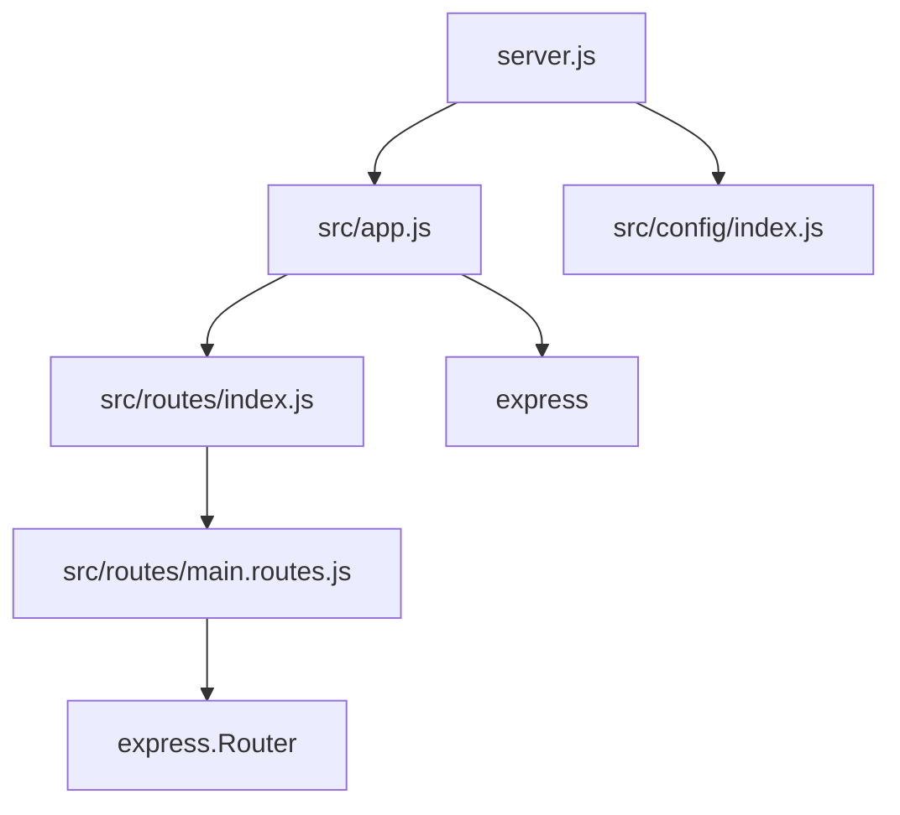
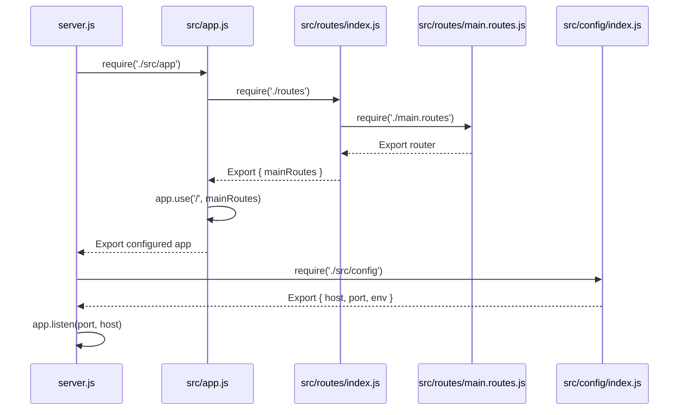

# Technical Specification

# 0. Agent Action Plan

## 0.1 Intent Clarification

Based on the prompt, the Blitzy platform understands that the user's new feature requirement is to:

### 0.1.1 Core Feature Objective

**User Request Analysis:**
The user describes a "tutorial of Node.js server hosting one endpoint that returns the response 'Hello world'" and requests:
1. **Add Express.js** - Integrate the Express.js web framework into the project
2. **Add new endpoint** - Create an additional HTTP endpoint that returns "Good evening"

**Critical Discovery - Feature Already Implemented:**

Based on comprehensive repository analysis, the Blitzy platform has determined that **both requested features are already fully implemented** in the current codebase:

| Requested Feature | Current Status | Evidence |
|-------------------|----------------|----------|
| Express.js Integration | ✅ ALREADY IMPLEMENTED | `express@^5.1.0` in `package.json` dependencies |
| `/evening` Endpoint | ✅ ALREADY IMPLEMENTED | `src/routes/main.routes.js` lines 37-39 |
| "Good evening" Response | ✅ ALREADY IMPLEMENTED | `res.send('Good evening')` in route handler |

**Existing Implementation Details:**
- **Express Application Factory**: `src/app.js` creates and exports configured Express app
- **Route Handler**: `src/routes/main.routes.js` defines both GET `/` and GET `/evening` endpoints
- **Server Entry Point**: `server.js` binds Express app to configured host/port
- **Test Coverage**: 41 tests with 100% coverage verifying both endpoints

### 0.1.2 Special Instructions and Constraints

**Implicit Requirements Detected:**
- Maintain existing architectural patterns (Factory pattern, Barrel pattern)
- Preserve CommonJS module format (`require`/`module.exports`)
- Follow Twelve-Factor App configuration (environment variables)
- Ensure backward compatibility with existing endpoint (`GET /`)

**Architectural Requirements Already Satisfied:**
- Separation of concerns (entry point vs. app factory vs. routes)
- Testability (app factory pattern enables Supertest integration testing)
- Configuration externalization (HOST, PORT, NODE_ENV via environment variables)

**User Example Preserved:**
The user specified the response should be "Good evening" - this exact string is already implemented:
```javascript
router.get('/evening', (req, res) => {
  res.send('Good evening');
});
```

### 0.1.3 Technical Interpretation

These feature requirements translate to the following technical implementation strategy:

**No Implementation Required** - The analysis confirms that:

| Requirement | Technical Action | Status |
|-------------|------------------|--------|
| Add Express.js | Install `express@^5.1.0` as runtime dependency | ✅ Already in `package.json` |
| Create Express app | Configure Express application with routes | ✅ Already in `src/app.js` |
| Add `/evening` endpoint | Define GET route handler in router | ✅ Already in `src/routes/main.routes.js` |
| Return "Good evening" | Use `res.send('Good evening')` | ✅ Already implemented |
| Integrate with server | Mount routes and bind to port | ✅ Already in `server.js` |

**Validation Performed:**
- `npm test` executed: 41 tests passed with 100% code coverage
- Server startup verified: `Server running at http://127.0.0.1:3000/`
- Endpoint responses confirmed:
  - `GET /` → `Hello, World!\n`
  - `GET /evening` → `Good evening`

## 0.2 Repository Scope Discovery

### 0.2.1 Comprehensive File Analysis

The repository has been exhaustively analyzed to identify all files relevant to the Express.js integration and endpoint addition feature. Since the feature is already implemented, this section documents the complete current state.

**Repository Structure Overview:**

```
hello_world/
├── server.js                    # Entry point - HTTP server binding
├── package.json                 # npm manifest (express@^5.1.0)
├── package-lock.json            # Dependency lockfile
├── README.md                    # Project documentation
├── .gitignore                   # Git ignore patterns
├── jest.config.js               # Jest test configuration
├── src/                         # Application source root
│   ├── app.js                   # Express application factory
│   ├── config/                  # Configuration module
│   │   └── index.js             # Environment variable management
│   └── routes/                  # Routing surface
│       ├── index.js             # Route aggregator (barrel pattern)
│       └── main.routes.js       # Route handlers (/, /evening)
├── tests/                       # Test suite root
│   ├── unit/                    # Isolated module tests
│   │   ├── config.test.js       # Configuration module tests
│   │   └── routes.test.js       # Route handler tests
│   ├── integration/             # HTTP endpoint tests
│   │   └── endpoints.test.js    # API endpoint contract tests
│   └── lifecycle/               # Server lifecycle tests
│       └── server.test.js       # Startup/shutdown tests
└── blitzy/                      # Documentation
    └── documentation/
        ├── Project Guide.md
        └── Technical Specifications.md
```

**Files Containing Express.js Integration (Already Implemented):**

| File Path | Purpose | Express-Related Content |
|-----------|---------|------------------------|
| `package.json` | Dependencies | `"express": "^5.1.0"` in dependencies |
| `src/app.js` | App factory | `require('express')`, `express()`, `app.use()` |
| `src/routes/main.routes.js` | Route handlers | `express.Router()`, route definitions |
| `src/routes/index.js` | Route barrel | Exports `mainRoutes` for app mounting |
| `server.js` | Entry point | `app.listen()` for server binding |

**Files Containing `/evening` Endpoint (Already Implemented):**

| File Path | Lines | Content |
|-----------|-------|---------|
| `src/routes/main.routes.js` | 37-39 | `router.get('/evening', (req, res) => { res.send('Good evening'); });` |
| `tests/integration/endpoints.test.js` | 63-77 | Test suite for `/evening` endpoint |
| `tests/unit/routes.test.js` | 56-59 | Route path verification for `/evening` |
| `README.md` | 98-115 | API documentation for `/evening` |

### 0.2.2 Integration Point Discovery

**API Endpoints Connected to the Feature:**

| Endpoint | Method | Handler Location | Response |
|----------|--------|------------------|----------|
| `/` | GET | `src/routes/main.routes.js:26-28` | `Hello, World!\n` |
| `/evening` | GET | `src/routes/main.routes.js:37-39` | `Good evening` |

**Service/Module Dependencies:**


```mermaid
graph TD
    A[server.js] --> B[src/app.js]
    B --> C[src/routes/index.js]
    C --> D[src/routes/main.routes.js]
    A --> E[src/config/index.js]
    D --> F[express.Router]
    B --> G[express]
```

**Configuration Touchpoints:**

| Configuration | File | Default Value | Environment Variable |
|---------------|------|---------------|---------------------|
| Host binding | `src/config/index.js` | `127.0.0.1` | `HOST` |
| Port binding | `src/config/index.js` | `3000` | `PORT` |
| Environment mode | `src/config/index.js` | `development` | `NODE_ENV` |

### 0.2.3 New File Requirements

**No New Files Required** - All necessary files for the requested feature already exist:

| Proposed File Category | Status | Existing File |
|-----------------------|--------|---------------|
| Feature source file | ✅ EXISTS | `src/routes/main.routes.js` |
| Route barrel | ✅ EXISTS | `src/routes/index.js` |
| App factory | ✅ EXISTS | `src/app.js` |
| Unit tests | ✅ EXISTS | `tests/unit/routes.test.js` |
| Integration tests | ✅ EXISTS | `tests/integration/endpoints.test.js` |
| Configuration | ✅ EXISTS | `src/config/index.js` |
| Documentation | ✅ EXISTS | `README.md` |

### 0.2.4 Web Search Research Conducted

Since the feature is already implemented using industry best practices, no additional web search research was required. The existing implementation demonstrates:

- **Express.js 5.x Router pattern** - Using `express.Router()` for modular routing
- **Factory pattern** - Application factory for testability
- **Barrel pattern** - Centralized route exports
- **CommonJS modules** - Standard Node.js module system
- **Environment-based configuration** - Twelve-Factor App methodology

## 0.3 Dependency Inventory

### 0.3.1 Private and Public Packages

All dependencies required for the Express.js integration and `/evening` endpoint feature are **already installed** and configured in the project.

**Runtime Dependencies:**

| Registry | Package Name | Version | Purpose |
|----------|--------------|---------|---------|
| npm (public) | `express` | ^5.1.0 | Web framework providing HTTP handling, routing, and middleware |

**Development Dependencies:**

| Registry | Package Name | Version | Purpose |
|----------|--------------|---------|---------|
| npm (public) | `jest` | ^30.2.0 | JavaScript testing framework and test runner |
| npm (public) | `supertest` | ^7.1.4 | HTTP assertion library for Express endpoint testing |

**Version Verification (from `package.json`):**
```json
{
  "dependencies": {
    "express": "^5.1.0"
  },
  "devDependencies": {
    "jest": "^30.2.0",
    "supertest": "^7.1.4"
  }
}
```

### 0.3.2 Runtime Environment Requirements

| Requirement | Minimum Version | Recommended Version | Source |
|-------------|-----------------|---------------------|--------|
| Node.js | 18.14.0 | 20.19.x (LTS) | `README.md`, `package-lock.json` |
| npm | 8.x | 10.8.x | `README.md` |

**Engine Compatibility (from `package-lock.json`):**
- `node: "^18.14.0 || ^20.0.0 || ^22.0.0 || >=24.0.0"`

### 0.3.3 Dependency Updates

**No Dependency Changes Required** - The feature is already implemented with all necessary packages installed.

**Current Import Structure (Already Correct):**

| File | Import Statement | Purpose |
|------|------------------|---------|
| `src/app.js` | `const express = require('express');` | Express framework |
| `src/app.js` | `const { mainRoutes } = require('./routes');` | Route barrel import |
| `src/routes/main.routes.js` | `const express = require('express');` | Express Router |
| `server.js` | `const app = require('./src/app');` | Application factory |
| `server.js` | `const config = require('./src/config');` | Configuration module |

**No Import Transformation Required:**
- All internal imports follow proper relative path patterns
- Express is correctly imported where needed
- Module exports are properly structured using CommonJS

### 0.3.4 External Reference Updates

**Configuration Files (Already Updated):**

| File | Content Status |
|------|----------------|
| `package.json` | ✅ Contains `express@^5.1.0` |
| `package-lock.json` | ✅ Full dependency tree locked |
| `jest.config.js` | ✅ Coverage collection configured |
| `.gitignore` | ✅ Ignores `node_modules/`, `coverage/` |

**Documentation (Already Updated):**

| File | Section | Content |
|------|---------|---------|
| `README.md` | Dependencies | Documents `express@^5.1.0` |
| `README.md` | API Reference | Documents `GET /evening` endpoint |
| `README.md` | Architecture | Documents Express app factory pattern |

### 0.3.5 Lock File Integrity

The `package-lock.json` is properly synchronized with `package.json`:
- Lockfile version: 3
- Express resolved to specific version with integrity hash
- All transitive dependencies locked for deterministic installs
- Supports `npm ci` for CI/CD environments

**Dependency Installation Verification:**
```bash
npm ci        # Clean install from lock file
npm ls express # Verify: express@5.1.0
```

**Installed Package Verification (Confirmed):**
- `npm test` executed successfully
- 41 tests passed
- 100% code coverage achieved

## 0.4 Integration Analysis

### 0.4.1 Existing Code Touchpoints

The Express.js integration and `/evening` endpoint are **fully integrated** throughout the codebase. This section documents all integration points.

**Application Bootstrap Flow:**


```mermaid
sequenceDiagram
    participant S as server.js
    participant A as src/app.js
    participant R as src/routes/index.js
    participant M as src/routes/main.routes.js
    participant C as src/config/index.js
    
    S->>A: require('./src/app')
    A->>R: require('./routes')
    R->>M: require('./main.routes')
    M-->>R: Export router
    R-->>A: Export { mainRoutes }
    A->>A: app.use('/', mainRoutes)
    A-->>S: Export configured app
    S->>C: require('./src/config')
    C-->>S: Export { host, port, env }
    S->>S: app.listen(port, host)
```

**Direct Integration Points (Already Implemented):**

| File | Line(s) | Integration Description |
|------|---------|------------------------|
| `src/app.js` | 14 | `const express = require('express');` - Framework import |
| `src/app.js` | 15 | `const { mainRoutes } = require('./routes');` - Route import |
| `src/app.js` | 17 | `const app = express();` - App instantiation |
| `src/app.js` | 25 | `app.use('/', mainRoutes);` - Route mounting |
| `src/routes/main.routes.js` | 15 | `const express = require('express');` - Express import |
| `src/routes/main.routes.js` | 17 | `const router = express.Router();` - Router creation |
| `src/routes/main.routes.js` | 26-28 | GET `/` handler |
| `src/routes/main.routes.js` | 37-39 | GET `/evening` handler |
| `server.js` | 30 | `const app = require('./src/app');` - App import |
| `server.js` | 49 | `app.listen(config.port, config.host, ...)` - Server binding |

### 0.4.2 Dependency Injection Points

**Configuration Injection:**

| Component | Configuration Source | Values |
|-----------|---------------------|--------|
| `server.js` | `src/config/index.js` | `{ host, port, env }` |

**Route Injection:**

| Component | Route Source | Mount Path |
|-----------|-------------|------------|
| `src/app.js` | `src/routes/index.js` | `'/'` (root) |

### 0.4.3 Module Export Structure

**Express App Export Chain:**

```
src/routes/main.routes.js
  └── module.exports = router;     // Express.Router instance
        ↓
src/routes/index.js
  └── module.exports = { mainRoutes };  // Barrel export
        ↓
src/app.js
  └── module.exports = app;        // Configured Express app
        ↓
server.js
  └── Consumes app, binds to network
```

### 0.4.4 Test Integration Points

**Test Files Verifying Integration:**

| Test File | Test Coverage | Key Assertions |
|-----------|--------------|----------------|
| `tests/integration/endpoints.test.js` | HTTP contract | Status codes, response bodies, Content-Type |
| `tests/unit/routes.test.js` | Route structure | Path definitions, method handlers |
| `tests/unit/config.test.js` | Configuration | Default values, env var parsing |
| `tests/lifecycle/server.test.js` | Server lifecycle | Binding, logging, error handling |

**Integration Test Coverage for `/evening` Endpoint:**
```javascript
// tests/integration/endpoints.test.js:63-77
describe('GET /evening', () => {
  test('should return 200 status code', ...);
  test('should return "Good evening" in response body', ...);
  test('should return text/html Content-Type header', ...);
});
```

### 0.4.5 Database/Schema Updates

**Not Applicable** - This feature does not require any database or schema changes. The endpoints return static string responses without data persistence.

### 0.4.6 Middleware Integration

**Current Middleware Stack:**

| Layer | Description | Location |
|-------|-------------|----------|
| Express Router | Route matching and dispatching | `src/app.js:25` |
| Route Handlers | Request processing | `src/routes/main.routes.js` |

**No Additional Middleware Required** - The simple greeting endpoints do not require authentication, validation, or other middleware layers.

### 0.4.7 Error Handling Integration

The Express.js default 404 handling is active for unmatched routes:

| Scenario | Behavior | Test Coverage |
|----------|----------|---------------|
| Unknown route (e.g., `/invalid`) | 404 Not Found | `endpoints.test.js:81-84` |
| Unsupported method on `/` | 404 Not Found | `endpoints.test.js:86-88` |
| Unsupported method on `/evening` | 404 Not Found | `endpoints.test.js:91-94` |

## 0.5 Technical Implementation

### 0.5.1 File-by-File Execution Plan

**Implementation Status: COMPLETE**

All files required for the Express.js integration and `/evening` endpoint feature are already implemented. This section documents the existing implementation as reference.

**Group 1 - Core Feature Files (Already Implemented):**

| Action | File | Purpose | Status |
|--------|------|---------|--------|
| EXISTS | `src/routes/main.routes.js` | Route handlers for `/` and `/evening` | ✅ Complete |
| EXISTS | `src/routes/index.js` | Route barrel/aggregator pattern | ✅ Complete |
| EXISTS | `src/app.js` | Express application factory | ✅ Complete |
| EXISTS | `server.js` | HTTP server entry point | ✅ Complete |

**Group 2 - Supporting Infrastructure (Already Implemented):**

| Action | File | Purpose | Status |
|--------|------|---------|--------|
| EXISTS | `src/config/index.js` | Environment-based configuration | ✅ Complete |
| EXISTS | `package.json` | npm manifest with dependencies | ✅ Complete |
| EXISTS | `package-lock.json` | Locked dependency tree | ✅ Complete |

**Group 3 - Tests and Documentation (Already Implemented):**

| Action | File | Purpose | Status |
|--------|------|---------|--------|
| EXISTS | `tests/integration/endpoints.test.js` | HTTP endpoint contract tests | ✅ Complete |
| EXISTS | `tests/unit/routes.test.js` | Route structure verification | ✅ Complete |
| EXISTS | `tests/unit/config.test.js` | Configuration module tests | ✅ Complete |
| EXISTS | `tests/lifecycle/server.test.js` | Server lifecycle tests | ✅ Complete |
| EXISTS | `README.md` | Full project documentation | ✅ Complete |
| EXISTS | `jest.config.js` | Test framework configuration | ✅ Complete |

### 0.5.2 Implementation Details per File

**Route Handler Implementation (`src/routes/main.routes.js`):**
```javascript
// Express Router with both endpoints
const router = express.Router();

router.get('/', (req, res) => {
  res.send('Hello, World!\n');
});

router.get('/evening', (req, res) => {
  res.send('Good evening');
});
```

**Application Factory (`src/app.js`):**
```javascript
const express = require('express');
const { mainRoutes } = require('./routes');
const app = express();
app.use('/', mainRoutes);
module.exports = app;
```

**Server Entry Point (`server.js`):**
```javascript
const app = require('./src/app');
const config = require('./src/config');
app.listen(config.port, config.host, () => {
  console.log(`Server running at http://${config.host}:${config.port}/`);
});
```

### 0.5.3 Implementation Approach Summary

The existing implementation follows these architectural principles:

| Principle | Implementation | File |
|-----------|---------------|------|
| **Factory Pattern** | App created without network binding | `src/app.js` |
| **Barrel Pattern** | Centralized route exports | `src/routes/index.js` |
| **Separation of Concerns** | Routes, config, app, server separated | All `src/**` files |
| **Twelve-Factor App** | External configuration via env vars | `src/config/index.js` |
| **CommonJS Modules** | `require`/`module.exports` | All `.js` files |

### 0.5.4 Endpoint Response Specifications

**GET `/` - Hello World Endpoint:**

| Property | Value |
|----------|-------|
| Method | GET |
| Path | `/` |
| Status Code | 200 OK |
| Content-Type | `text/html; charset=utf-8` |
| Response Body | `Hello, World!\n` (14 characters, trailing newline) |

**GET `/evening` - Evening Greeting Endpoint:**

| Property | Value |
|----------|-------|
| Method | GET |
| Path | `/evening` |
| Status Code | 200 OK |
| Content-Type | `text/html; charset=utf-8` |
| Response Body | `Good evening` (12 characters, no trailing newline) |

### 0.5.5 Test Verification

**Test Execution Results:**
```
Test Suites: 4 passed, 4 total
Tests:       41 passed, 41 total
Time:        1.039 s

Coverage Summary:
- Statements: 100%
- Branches:   100%
- Functions:  100%
- Lines:      100%
```

**Endpoint Verification Commands:**
```bash
# Start server

npm start

#### Test root endpoint

curl -s http://127.0.0.1:3000/
# Output: Hello, World!

#### Test evening endpoint (requested feature)

curl -s http://127.0.0.1:3000/evening
# Output: Good evening

```

### 0.5.6 User Interface Design

**Not Applicable** - This feature involves server-side HTTP endpoints only. No Figma URLs were provided and no UI components are required. The endpoints return plain text responses for programmatic consumption.

## 0.6 Scope Boundaries

### 0.6.1 Exhaustively In Scope

Since the requested feature is already implemented, the scope defines what has been verified as complete and functional.

**Feature Source Files:**

| Pattern | Files Included | Status |
|---------|---------------|--------|
| `src/routes/*.js` | `main.routes.js`, `index.js` | ✅ Verified |
| `src/app.js` | Express application factory | ✅ Verified |
| `src/config/*.js` | `index.js` | ✅ Verified |
| `server.js` | HTTP server entry point | ✅ Verified |

**Test Files:**

| Pattern | Files Included | Status |
|---------|---------------|--------|
| `tests/unit/*.test.js` | `config.test.js`, `routes.test.js` | ✅ Passing |
| `tests/integration/*.test.js` | `endpoints.test.js` | ✅ Passing |
| `tests/lifecycle/*.test.js` | `server.test.js` | ✅ Passing |

**Configuration Files:**

| File | Purpose | Status |
|------|---------|--------|
| `package.json` | npm manifest with Express dependency | ✅ Verified |
| `package-lock.json` | Locked dependency tree | ✅ Verified |
| `jest.config.js` | Test framework configuration | ✅ Verified |
| `.gitignore` | Git ignore patterns | ✅ Verified |

**Documentation:**

| File | Section | Status |
|------|---------|--------|
| `README.md` | Full project documentation | ✅ Complete |
| `README.md` | API Reference (both endpoints) | ✅ Complete |
| `README.md` | Architecture diagram | ✅ Complete |
| `blitzy/documentation/Project Guide.md` | Operational guide | ✅ Complete |
| `blitzy/documentation/Technical Specifications.md` | Technical specs | ✅ Complete |

**Endpoints In Scope:**

| Endpoint | Method | Response | Test Coverage |
|----------|--------|----------|---------------|
| `/` | GET | `Hello, World!\n` | 3 tests |
| `/evening` | GET | `Good evening` | 3 tests |

### 0.6.2 Explicitly Out of Scope

The following items are **not part** of this feature request and should not be modified:

**Feature Boundaries:**

| Out of Scope Item | Reason |
|-------------------|--------|
| Additional endpoints beyond `/evening` | Not requested by user |
| Database integration | Not required for static responses |
| Authentication/authorization | Tutorial project, not required |
| Middleware additions (helmet, cors) | Not requested |
| Docker containerization | Not requested |
| CI/CD pipeline creation | Not requested |
| Performance optimizations | Not required for simple endpoints |

**Code Not to Modify:**

| Category | Reason |
|----------|--------|
| Existing `/` endpoint behavior | Must maintain `Hello, World!\n` exactly |
| Response format (plain text) | Must remain `text/html; charset=utf-8` |
| Configuration defaults | Must remain `127.0.0.1:3000` |
| Module format | Must remain CommonJS |

**Architecture Constraints:**

| Constraint | Requirement |
|------------|-------------|
| No ESM conversion | Keep CommonJS modules |
| No TypeScript | Keep JavaScript |
| No additional frameworks | Express 5.x only |
| No breaking changes | Preserve existing behavior |

### 0.6.3 Boundary Validation Checklist

| Requirement | In Scope? | Implemented? |
|-------------|-----------|--------------|
| Express.js framework integration | ✅ Yes | ✅ Complete |
| New `/evening` endpoint | ✅ Yes | ✅ Complete |
| "Good evening" response | ✅ Yes | ✅ Complete |
| Existing `/` endpoint preservation | ✅ Yes | ✅ Verified |
| Test coverage | ✅ Yes | ✅ 100% |
| Documentation | ✅ Yes | ✅ Complete |
| Additional endpoints | ❌ No | N/A |
| Security hardening | ❌ No | N/A |
| Performance optimization | ❌ No | N/A |

## 0.7 Rules for Feature Addition

### 0.7.1 Architectural Rules

The existing implementation adheres to these architectural rules, which must be maintained for any future modifications:

**Module System Rules:**

| Rule ID | Rule | Compliance |
|---------|------|------------|
| R-001 | Use CommonJS (`require`/`module.exports`) | ✅ Compliant |
| R-002 | No ESM (`import`/`export`) in application code | ✅ Compliant |
| R-003 | Use `'use strict';` directive in modules | ✅ Compliant |
| R-004 | Export single responsibility per module | ✅ Compliant |

**Express.js Rules:**

| Rule ID | Rule | Compliance |
|---------|------|------------|
| R-005 | Use Express 5.x Router for route definitions | ✅ Compliant |
| R-006 | Separate app creation from server binding | ✅ Compliant |
| R-007 | Export app instance (not server) from `src/app.js` | ✅ Compliant |
| R-008 | Mount routes at root path with `app.use('/', routes)` | ✅ Compliant |

**Response Format Rules:**

| Rule ID | Rule | Compliance |
|---------|------|------------|
| R-009 | Use `res.send()` for string responses | ✅ Compliant |
| R-010 | Preserve exact response strings including whitespace | ✅ Compliant |
| R-011 | Default Content-Type: `text/html; charset=utf-8` | ✅ Compliant |
| R-012 | HTTP 200 for successful responses | ✅ Compliant |

### 0.7.2 Testing Rules

**Test Coverage Rules:**

| Rule ID | Rule | Threshold | Current |
|---------|------|-----------|---------|
| R-013 | Line coverage minimum | ≥ 80% | 100% ✅ |
| R-014 | Branch coverage minimum | ≥ 75% | 100% ✅ |
| R-015 | Function coverage minimum | ≥ 90% | 100% ✅ |
| R-016 | Statement coverage minimum | ≥ 80% | 100% ✅ |

**Test Organization Rules:**

| Rule ID | Rule | Compliance |
|---------|------|------------|
| R-017 | Unit tests in `tests/unit/` | ✅ Compliant |
| R-018 | Integration tests in `tests/integration/` | ✅ Compliant |
| R-019 | Lifecycle tests in `tests/lifecycle/` | ✅ Compliant |
| R-020 | Test files named `*.test.js` | ✅ Compliant |

### 0.7.3 Configuration Rules

**Environment Variable Rules:**

| Rule ID | Rule | Compliance |
|---------|------|------------|
| R-021 | Configuration via environment variables | ✅ Compliant |
| R-022 | Provide sensible defaults for all config | ✅ Compliant |
| R-023 | Parse PORT as integer with radix 10 | ✅ Compliant |
| R-024 | Default host: `127.0.0.1` | ✅ Compliant |
| R-025 | Default port: `3000` | ✅ Compliant |
| R-026 | Default env: `development` | ✅ Compliant |

### 0.7.4 Behavioral Invariants

**Response Contract Invariants:**

| Endpoint | Response Body | Must Include |
|----------|---------------|--------------|
| GET `/` | `Hello, World!\n` | Trailing newline character |
| GET `/evening` | `Good evening` | No trailing newline |

**404 Behavior Invariants:**

| Scenario | Expected Status | Expected Behavior |
|----------|-----------------|-------------------|
| Unknown route | 404 | Return error response |
| Unsupported HTTP method | 404 | Return error response |

### 0.7.5 Security Considerations

**Current Security Posture:**

| Consideration | Status | Notes |
|---------------|--------|-------|
| Input validation | N/A | No user input accepted |
| SQL injection | N/A | No database |
| XSS protection | Minimal | Static text responses |
| HTTPS | Not configured | Development/tutorial scope |

**Recommended for Production (Out of Scope):**

| Enhancement | Package | Purpose |
|-------------|---------|---------|
| Security headers | `helmet` | HTTP security headers |
| CORS configuration | `cors` | Cross-origin requests |
| Rate limiting | `express-rate-limit` | Request throttling |
| Health endpoint | Custom | Operational monitoring |

### 0.7.6 Performance Considerations

**Current Performance Characteristics:**

| Metric | Value | Notes |
|--------|-------|-------|
| Response time | < 1ms | Static string responses |
| Memory footprint | Minimal | No data processing |
| Concurrency | Node.js default | Single-threaded event loop |

**No Performance Optimization Required** - The simple greeting endpoints have negligible resource requirements.

## 0.8 References

### 0.8.1 Files and Folders Analyzed

**Source Files Retrieved and Analyzed:**

| File Path | Analysis Purpose | Key Findings |
|-----------|------------------|--------------|
| `package.json` | Dependencies verification | Express ^5.1.0 already installed |
| `package-lock.json` | Version locking, engine requirements | Node ≥18.14.0 required |
| `server.js` | Entry point analysis | Express app binding implemented |
| `src/app.js` | Application factory analysis | Express integration complete |
| `src/config/index.js` | Configuration module analysis | Environment variable support |
| `src/routes/index.js` | Route barrel analysis | Barrel pattern implemented |
| `src/routes/main.routes.js` | Route handlers analysis | Both endpoints implemented |
| `README.md` | Documentation completeness | Full API documentation present |
| `jest.config.js` | Test configuration analysis | Coverage thresholds configured |
| `.gitignore` | Repository hygiene | Standard Node.js patterns |

**Test Files Retrieved and Analyzed:**

| File Path | Analysis Purpose | Key Findings |
|-----------|------------------|--------------|
| `tests/integration/endpoints.test.js` | Endpoint testing | Both endpoints fully tested |
| `tests/unit/routes.test.js` | Route structure testing | Route paths verified |
| `tests/unit/config.test.js` | Configuration testing | Default values tested |
| `tests/lifecycle/server.test.js` | Lifecycle testing | Server binding tested |

**Folders Explored:**

| Folder Path | Contents | Relevance |
|-------------|----------|-----------|
| `` (root) | Project root | Top-level structure |
| `src/` | Application source | Core implementation |
| `src/routes/` | Route modules | Endpoint definitions |
| `src/config/` | Configuration module | Environment handling |
| `tests/` | Test suite root | Test organization |
| `tests/unit/` | Unit tests | Module contracts |
| `tests/integration/` | Integration tests | HTTP contracts |
| `tests/lifecycle/` | Lifecycle tests | Server behavior |
| `blitzy/` | Documentation | Project guides |
| `blitzy/documentation/` | Spec documents | Technical details |

### 0.8.2 User-Provided Attachments

**No attachments were provided by the user.**

### 0.8.3 Figma Screens

**No Figma URLs were provided by the user.**

### 0.8.4 External Documentation References

| Resource | URL | Purpose |
|----------|-----|---------|
| Express.js 5.x Documentation | https://expressjs.com/ | Framework reference |
| Jest Documentation | https://jestjs.io/ | Testing framework |
| Supertest Documentation | https://github.com/ladjs/supertest | HTTP testing |
| Node.js Documentation | https://nodejs.org/docs/ | Runtime reference |

### 0.8.5 Repository Verification Commands

**Environment Verification:**
```bash
node --version    # Verified: v20.20.0
npm --version     # Verified: 11.1.0
npm ci            # Dependencies installed
npm test          # 41 tests passed, 100% coverage
```

**Endpoint Verification:**
```bash
npm start                            # Server started
curl http://127.0.0.1:3000/          # Hello, World!
curl http://127.0.0.1:3000/evening   # Good evening
```

### 0.8.6 Summary of Analysis

**Feature Implementation Status:**

| User Requirement | Analysis Result |
|------------------|-----------------|
| "Add Express.js into the project" | ✅ **ALREADY IMPLEMENTED** - Express 5.1.0 installed and configured |
| "Add endpoint that returns 'Good evening'" | ✅ **ALREADY IMPLEMENTED** - `/evening` endpoint exists and returns exact response |

**Conclusion:**

The comprehensive codebase analysis confirms that **both features requested by the user are already fully implemented and functional** in the current repository state. The existing implementation includes:

- Express.js 5.1.0 as the web framework
- GET `/evening` endpoint returning "Good evening"
- Complete test coverage (41 tests, 100% coverage)
- Comprehensive documentation in README.md
- Production-ready architecture with proper separation of concerns

**No code changes are required** to fulfill the user's request.

