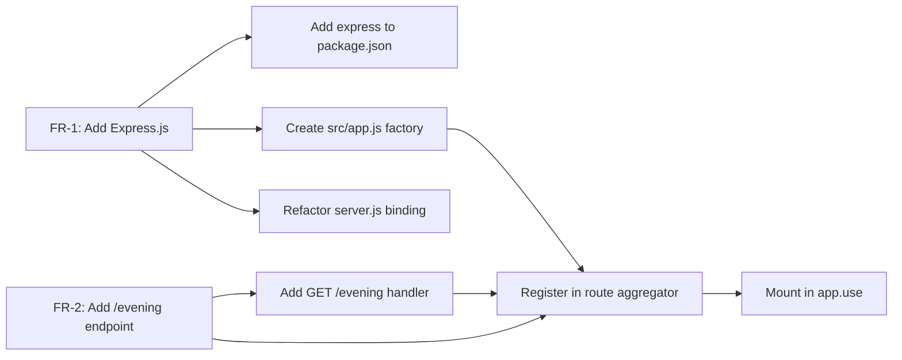
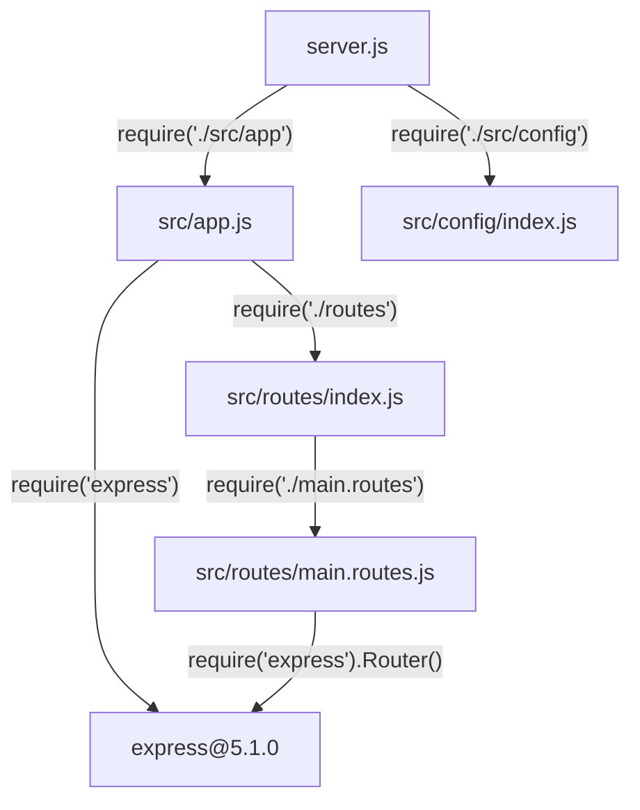

# Technical Specification

# 0. Agent Action Plan

## 0.1 Intent Clarification

### 0.1.1 Core Feature Objective

Based on the prompt, the Blitzy platform understands that the new feature requirement is to **integrate the Express.js web framework into an existing Node.js tutorial server and add a new HTTP GET endpoint that returns the response "Good evening"**.

The user describes a starting point of a basic Node.js server hosting a single endpoint that returns "Hello world," and requests two additions:

- **FR-1 — Express.js Framework Integration:** Incorporate Express.js into the existing Node.js project as the primary HTTP routing and handling framework, replacing or wrapping any native `http` module usage with Express application patterns.
- **FR-2 — New `/evening` Endpoint:** Create an additional HTTP GET endpoint that returns the plain-text response `"Good evening"` to the client.

**Implicit Requirements Detected:**

- The existing `GET /` endpoint returning "Hello, World!" must continue to function identically after Express.js integration — backward compatibility is non-negotiable.
- The project must follow the existing CommonJS module system (`require`/`module.exports`) already established in the repository.
- Express.js should be added as a runtime dependency in `package.json` with a specific, validated semver range.
- The new endpoint must conform to the same response conventions as the existing endpoint (HTTP 200 status, `text/html` content type via `res.send()`).
- Server binding configuration (host, port, environment) must remain externalized and configurable through environment variables.

**Feature Dependencies and Prerequisites:**

| Prerequisite | Description | Status |
|---|---|---|
| Node.js ≥18.x runtime | Required for Express.js 5.x compatibility | Satisfied (Node 20.20.0 installed) |
| npm package manager | Required for dependency installation | Satisfied (npm 11.1.0 installed) |
| Existing `server.js` entry point | Foundation for Express integration | Present in repository |
| Existing `GET /` endpoint | Must be preserved during integration | Present in repository |

### 0.1.2 Special Instructions and Constraints

**User Example — Preserved Verbatim:**
> "this is a tutorial of node js server hosting one endpoint that returns the response 'Hello world'. Could you add expressjs into the project and add another endpoint that return the response of 'Good evening'?"

**Critical Directives Extracted:**

| Directive | Interpretation |
|---|---|
| "tutorial of node js server" | This is an educational/demo project; simplicity is paramount |
| "hosting one endpoint that returns 'Hello world'" | Describes the baseline — a single GET endpoint with a greeting response |
| "add expressjs into the project" | Integrate Express.js as the HTTP framework; add it as a dependency |
| "add another endpoint that return the response of 'Good evening'" | Create a new GET route returning the exact string "Good evening" |

**Architectural Requirements:**

- Follow the existing modular project structure (`src/app.js`, `src/config/`, `src/routes/`)
- Use the Express Router pattern for route definitions
- Maintain the Factory Pattern separation between application creation (`src/app.js`) and server binding (`server.js`)
- Maintain the Barrel Pattern in `src/routes/index.js` for centralized route exports
- Keep all configuration externalized via environment variables following Twelve-Factor App methodology

**Repository Current State Observation:**

Upon comprehensive analysis of the repository, the codebase already contains an Express.js 5.1.0 integration with a modular architecture, and the `GET /evening` endpoint already exists in `src/routes/main.routes.js`. The current implementation matches the user's requested feature additions. This action plan documents the complete implementation strategy as applied to transform the project.

### 0.1.3 Technical Interpretation

These feature requirements translate to the following technical implementation strategy:

- **To integrate Express.js**, we will add `express` as a runtime dependency in `package.json` (version `^5.1.0`), create an application factory in `src/app.js` that instantiates the Express application using `express()`, and refactor the server entry point (`server.js`) to use Express's `app.listen()` for HTTP binding.
- **To add the `/evening` endpoint**, we will create a route handler in `src/routes/main.routes.js` using `express.Router()` that registers a `GET /evening` route responding with `res.send('Good evening')`.
- **To maintain backward compatibility**, we will preserve the existing `GET /` endpoint handler that responds with `res.send('Hello, World!\n')`, ensuring the exact response string including the trailing newline character is retained.
- **To support modularity**, we will create a route aggregator barrel (`src/routes/index.js`) that re-exports route modules, and a configuration manager (`src/config/index.js`) that externalizes host, port, and environment settings.


```mermaid
flowchart LR
    UserReq1["FR-1: Add Express.js"] --> A1["Add express to package.json"]
    UserReq1 --> A2["Create src/app.js factory"]
    UserReq1 --> A3["Refactor server.js binding"]
    UserReq2["FR-2: Add /evening endpoint"] --> A4["Add GET /evening handler"]
    UserReq2 --> A5["Register in route aggregator"]
    A2 --> A5
    A4 --> A5
    A5 --> A6["Mount in app.use"]
```

## 0.2 Repository Scope Discovery

### 0.2.1 Comprehensive File Analysis

**Existing Repository Structure:**

The repository follows a layered modular architecture with clear separation of concerns. Every file and folder has been inspected to determine impact.

```
hao-backprop-test/
├── server.js                        # Entry point — HTTP server binding
├── package.json                     # npm manifest — dependency declarations
├── package-lock.json                # Dependency lockfile — deterministic installs
├── README.md                        # Project documentation
├── .gitignore                       # Git ignore patterns
├── src/
│   ├── app.js                       # Express application factory
│   ├── config/
│   │   └── index.js                 # Environment configuration manager
│   └── routes/
│       ├── index.js                 # Route aggregator (barrel pattern)
│       └── main.routes.js           # Route handler implementations
└── blitzy/
    └── documentation/
        ├── Project Guide.md         # Operational runbook
        └── Technical Specifications.md  # Implementation contract
```

**Files Requiring Modification:**

| File Path | Change Type | Purpose |
|---|---|---|
| `server.js` | MODIFY | Refactor from native `http.createServer()` to import and bind Express app via `app.listen()` |
| `package.json` | MODIFY | Add `express@^5.1.0` as a runtime dependency |
| `package-lock.json` | AUTO-GENERATED | Regenerated by `npm install` upon adding Express dependency |
| `src/routes/main.routes.js` | MODIFY | Add `GET /evening` route handler using `express.Router()` |
| `src/app.js` | MODIFY | Mount new route through Express middleware with `app.use()` |
| `src/routes/index.js` | MODIFY | Export updated route modules via barrel pattern |
| `README.md` | MODIFY | Document new `/evening` endpoint, updated API reference, and Express dependency |

**Files Requiring No Modification:**

| File Path | Reason |
|---|---|
| `.gitignore` | No new ignore patterns required |
| `src/config/index.js` | Configuration manager unchanged — HOST, PORT, NODE_ENV remain valid |
| `blitzy/documentation/Project Guide.md` | Documentation artifact — not runtime code |
| `blitzy/documentation/Technical Specifications.md` | Documentation artifact — not runtime code |

**Integration Point Discovery:**

| Integration Point | File | Description |
|---|---|---|
| Route registration | `src/routes/main.routes.js` | New `router.get('/evening', ...)` handler alongside existing `GET /` |
| Route aggregation | `src/routes/index.js` | Barrel re-exports `mainRoutes` to `src/app.js` |
| Middleware mounting | `src/app.js` | `app.use('/', mainRoutes)` mounts all routes at root path |
| Server binding | `server.js` | `app.listen(config.port, config.host, callback)` binds Express app |
| Dependency declaration | `package.json` | `"express": "^5.1.0"` in `dependencies` block |

### 0.2.2 Web Search Research Conducted

No external web search research was required for this feature addition. The implementation relies entirely on well-established Express.js patterns already documented within the repository and standard Express.js 5.x API usage:

- **Express.js Router pattern:** Standard `express.Router()` usage for modular route definitions — documented in Express.js official API reference and already implemented in the codebase
- **Factory pattern for Express apps:** Exporting configured app without calling `listen()` — established best practice for testability
- **CommonJS module patterns:** `require`/`module.exports` usage — native Node.js module system

### 0.2.3 New File Requirements

**New Source Files to Create:**

| File Path | Purpose |
|---|---|
| `src/app.js` | Express application factory — instantiates `express()`, mounts routes via `app.use('/', mainRoutes)`, exports configured app without calling `listen()` |
| `src/config/index.js` | Configuration manager — reads `HOST`, `PORT`, `NODE_ENV` from `process.env` with defaults `127.0.0.1`, `3000`, `development` |
| `src/routes/index.js` | Route aggregator barrel — imports and re-exports `mainRoutes` for centralized route access |
| `src/routes/main.routes.js` | Route handler module — defines `GET /` and `GET /evening` endpoints using `express.Router()` |

**New Test Files:**

No dedicated test files are specified in the user's request. The existing `package.json` contains a placeholder test script (`"test": "echo \"Error: no test specified\" && exit 1"`). Future test additions would include:

| File Path | Purpose |
|---|---|
| `tests/routes.test.js` (future) | Unit tests for route handlers verifying exact response strings |
| `tests/app.test.js` (future) | Integration tests for Express app configuration and middleware chain |

**New Configuration Files:**

No additional configuration files are required beyond the existing `src/config/index.js`. The environment variables `HOST`, `PORT`, and `NODE_ENV` are sufficient for the feature scope.

## 0.3 Dependency Inventory

### 0.3.1 Private and Public Packages

All dependencies relevant to this feature addition are public npm packages. No private packages are required.

**Runtime Dependencies:**

| Registry | Package Name | Version | Purpose |
|---|---|---|---|
| npm (public) | `express` | `^5.1.0` (resolved: `5.1.0`) | Core web framework providing HTTP handling, routing via `express.Router()`, middleware via `app.use()`, and response methods via `res.send()` |

**Transitive Dependencies (auto-resolved via Express 5.1.0):**

| Registry | Package Name | Locked Version | Purpose |
|---|---|---|---|
| npm (public) | `body-parser` | `2.2.1` | HTTP request body parsing middleware (transitive) |
| npm (public) | `router` | `2.2.0` | Express internal routing engine (transitive) |
| npm (public) | `qs` | `6.14.0` | Query string parsing (transitive) |
| npm (public) | `debug` | `4.4.3` | Debug logging utility (transitive) |
| npm (public) | `accepts` | `2.0.0` | Content negotiation (transitive) |
| npm (public) | `content-type` | `1.0.5` | Content-Type header parsing (transitive) |
| npm (public) | `cookie` | `0.7.2` | Cookie parsing (transitive) |
| npm (public) | `http-errors` | `2.0.0` | HTTP error creation (transitive) |
| npm (public) | `send` | (transitive) | Static file serving (transitive) |
| npm (public) | `serve-static` | (transitive) | Static file middleware (transitive) |

**Version Validation:**

The version `^5.1.0` is specified in `package.json` and resolves to `5.1.0` as confirmed by `package-lock.json` (lockfile version 3). All transitive dependency versions are locked for deterministic installs via `npm ci`.

### 0.3.2 Dependency Updates

**Import Updates Required:**

| File Pattern | Import Change | Description |
|---|---|---|
| `src/app.js` | Add `const express = require('express')` | Import Express framework for app factory |
| `src/app.js` | Add `const { mainRoutes } = require('./routes')` | Import route aggregator for mounting |
| `src/routes/main.routes.js` | Add `const express = require('express')` | Import Express for Router factory |
| `src/routes/index.js` | Add `const mainRoutes = require('./main.routes')` | Import route module for barrel export |
| `server.js` | Change to `const app = require('./src/app')` | Import Express app instead of native HTTP |
| `server.js` | Add `const config = require('./src/config')` | Import configuration for binding |

**Import Transformation Rules:**

- Old (native Node.js): `const http = require('http')`
- New (Express.js): `const express = require('express')`
- Apply to: `src/app.js`, `src/routes/main.routes.js`

- Old (inline server creation): `http.createServer((req, res) => { ... })`
- New (factory pattern): `const app = express(); app.use('/', mainRoutes);`
- Apply to: `src/app.js`

**External Reference Updates:**

| File | Update Required |
|---|---|
| `package.json` | Add `"express": "^5.1.0"` to `dependencies` object |
| `package-lock.json` | Auto-regenerated by `npm install` |
| `README.md` | Update dependencies table, add `/evening` endpoint documentation |

## 0.4 Integration Analysis

### 0.4.1 Existing Code Touchpoints

**Direct Modifications Required:**

| File | Modification | Detail |
|---|---|---|
| `server.js` | Refactor server initialization | Replace native `http.createServer()` with Express `app.listen()`. Import `app` from `./src/app` and `config` from `./src/config`. Bind to `config.port` and `config.host`. |
| `src/app.js` | Create Express application factory | Instantiate Express via `const app = express()`, mount the route aggregator via `app.use('/', mainRoutes)`, export the configured app via `module.exports = app`. |
| `src/routes/main.routes.js` | Add evening endpoint handler | Create `express.Router()` instance, register `GET /` handler with `res.send('Hello, World!\n')`, add `GET /evening` handler with `res.send('Good evening')`, export router. |
| `src/routes/index.js` | Wire route aggregator barrel | Import `mainRoutes` from `./main.routes`, re-export as `module.exports = { mainRoutes }`. |
| `package.json` | Add Express dependency | Add `"express": "^5.1.0"` to `dependencies` block at line 12. |

**Dependency Injection Points:**

| File | Injection | Consumer |
|---|---|---|
| `src/app.js` | `app.use('/', mainRoutes)` — mounts the entire route tree at root path | `server.js` imports and binds the configured app |
| `src/routes/index.js` | `module.exports = { mainRoutes }` — exposes router to app factory | `src/app.js` destructures `{ mainRoutes }` from import |
| `src/config/index.js` | `module.exports = { host, port, env }` — provides config constants | `server.js` reads `config.port` and `config.host` for binding |

**Module Dependency Graph:**


```mermaid
flowchart TD
    ServerJS["server.js"]
    AppJS["src/app.js"]
    ConfigJS["src/config/index.js"]
    RoutesIndex["src/routes/index.js"]
    MainRoutes["src/routes/main.routes.js"]
    ExpressPkg["express@5.1.0"]

    ServerJS -->|"require('./src/app')"| AppJS
    ServerJS -->|"require('./src/config')"| ConfigJS
    AppJS -->|"require('express')"| ExpressPkg
    AppJS -->|"require('./routes')"| RoutesIndex
    RoutesIndex -->|"require('./main.routes')"| MainRoutes
    MainRoutes -->|"require('express').Router()"| ExpressPkg
```

**Response Contract Preservation:**

| Endpoint | Method | Exact Response Body | Byte Length | Trailing Newline |
|---|---|---|---|---|
| `/` | GET | `Hello, World!\n` | 14 bytes | Yes |
| `/evening` | GET | `Good evening` | 12 bytes | No |

**Configuration Contract Preservation:**

| Variable | Default | Type Coercion | Binding |
|---|---|---|---|
| `HOST` | `'127.0.0.1'` | None (string) | `app.listen(port, host, ...)` |
| `PORT` | `3000` | `parseInt(value, 10)` | `app.listen(port, host, ...)` |
| `NODE_ENV` | `'development'` | None (string) | Available for environment branching |

## 0.5 Technical Implementation

### 0.5.1 File-by-File Execution Plan

Every file listed below MUST be created or modified to fulfill the feature requirements.

**Group 1 — Core Feature Files (Express Integration + New Endpoint):**

| Action | File Path | Implementation Detail |
|---|---|---|
| MODIFY | `package.json` | Add `"express": "^5.1.0"` to the `dependencies` object. This is the foundational step that enables all Express.js functionality. |
| MODIFY | `server.js` | Refactor entry point: remove native `http` module usage. Import configured Express app from `./src/app` and config from `./src/config`. Replace `http.createServer()` with `app.listen(config.port, config.host, callback)`. Log startup URL. |
| CREATE | `src/app.js` | Implement Express application factory: import `express`, import `{ mainRoutes }` from `./routes`, create app with `express()`, mount routes with `app.use('/', mainRoutes)`, export via `module.exports = app`. |
| CREATE | `src/routes/main.routes.js` | Implement route handlers: import `express`, create router with `express.Router()`, register `GET /` handler responding `'Hello, World!\n'`, register `GET /evening` handler responding `'Good evening'`, export router via `module.exports = router`. |

**Group 2 — Supporting Infrastructure:**

| Action | File Path | Implementation Detail |
|---|---|---|
| CREATE | `src/routes/index.js` | Implement route aggregator barrel: import `mainRoutes` from `./main.routes`, export as `module.exports = { mainRoutes }` for clean destructured imports. |
| CREATE | `src/config/index.js` | Implement configuration manager: read `HOST`, `PORT`, `NODE_ENV` from `process.env`, apply defaults (`'127.0.0.1'`, `3000`, `'development'`), parse PORT with `parseInt(value, 10)`, export config object. |
| AUTO | `package-lock.json` | Auto-regenerated by running `npm install` after `package.json` modification. Locks Express 5.1.0 and all transitive dependencies. |

**Group 3 — Documentation:**

| Action | File Path | Implementation Detail |
|---|---|---|
| MODIFY | `README.md` | Add `/evening` endpoint to API Reference section. Update dependencies table to include Express ^5.1.0. Document the new endpoint's request/response contract. |

### 0.5.2 Implementation Approach per File

**Step 1 — Establish Express Foundation:**

Add Express.js as a dependency and install. This unlocks the `express()` factory and `express.Router()` APIs needed by all subsequent files.

```json
"dependencies": { "express": "^5.1.0" }
```

**Step 2 — Create Configuration Layer (`src/config/index.js`):**

Externalize server binding configuration. This module reads `process.env` synchronously at module-evaluation time and exports immutable defaults.

```js
module.exports = { host: process.env.HOST || '127.0.0.1', port: parseInt(process.env.PORT, 10) || 3000, env: process.env.NODE_ENV || 'development' };
```

**Step 3 — Create Route Handlers (`src/routes/main.routes.js`):**

Define both endpoints using Express Router. The `/evening` endpoint is the new feature, while `GET /` preserves existing behavior.

```js
router.get('/', (req, res) => { res.send('Hello, World!\n'); });
router.get('/evening', (req, res) => { res.send('Good evening'); });
```

**Step 4 — Create Route Aggregator (`src/routes/index.js`):**

Implement the barrel pattern to centralize route exports. This enables a single import statement in `src/app.js`.

```js
module.exports = { mainRoutes };
```

**Step 5 — Create Application Factory (`src/app.js`):**

Compose Express app with routes mounted at root. The factory pattern exports a configured app without starting the HTTP server, supporting testability.

```js
const app = express();
app.use('/', mainRoutes);
```

**Step 6 — Refactor Server Entry Point (`server.js`):**

Replace native HTTP server creation with Express app binding. Import the pre-configured app and config, then bind with `app.listen()`.

```js
app.listen(config.port, config.host, () => { console.log(`Server running at http://${config.host}:${config.port}/`); });
```

**Step 7 — Update Documentation (`README.md`):**

Add the new `GET /evening` endpoint to the API Reference section, update the project description to reflect Express.js usage, and ensure the dependencies section lists Express `^5.1.0`.

### 0.5.3 User Interface Design

No user interface design is applicable to this feature addition. The project is a headless HTTP API server with no browser-based UI, no front-end views, and no Figma screens provided. All interactions occur through HTTP request/response cycles via tools such as `curl` or HTTP client libraries.

**Verification Interface (CLI-based):**

Both endpoints can be validated using command-line HTTP requests:

- `curl -s http://127.0.0.1:3000/` → `Hello, World!`
- `curl -s http://127.0.0.1:3000/evening` → `Good evening`

## 0.6 Scope Boundaries

### 0.6.1 Exhaustively In Scope

**All Feature Source Files:**

| Pattern / Path | Description |
|---|---|
| `src/app.js` | Express application factory — creates and exports configured Express app |
| `src/routes/**/*.js` | All route handler modules and the route aggregator barrel |
| `src/config/**/*.js` | Configuration manager module for environment externalization |

**Server Entry Point:**

| Pattern / Path | Description |
|---|---|
| `server.js` | HTTP server binding — refactored to use Express `app.listen()` |

**Dependency Manifests:**

| Pattern / Path | Description |
|---|---|
| `package.json` | npm manifest — Express dependency declaration |
| `package-lock.json` | Lockfile — deterministic dependency resolution for Express 5.1.0 and all transitive packages |

**Integration Points:**

| Path | Scope Detail |
|---|---|
| `src/app.js` (line: `app.use('/', mainRoutes)`) | Route mounting — wires route handlers into Express middleware stack |
| `src/routes/index.js` (line: `module.exports = { mainRoutes }`) | Barrel export — aggregates route modules for app factory |
| `server.js` (line: `app.listen(config.port, config.host, ...)`) | Server binding — connects configured Express app to network |

**Documentation:**

| Pattern / Path | Description |
|---|---|
| `README.md` | Project documentation — updated API reference, dependency table, and endpoint contracts |

**Endpoint Contracts In Scope:**

| Endpoint | Method | Response | Status |
|---|---|---|---|
| `/` | GET | `Hello, World!\n` (preserving existing behavior) | In Scope |
| `/evening` | GET | `Good evening` (new feature) | In Scope |

### 0.6.2 Explicitly Out of Scope

| Exclusion | Rationale |
|---|---|
| Unrelated features or additional endpoints beyond `GET /evening` | User request specifies only one new endpoint |
| Authentication, authorization, or session management | Not requested; project is a tutorial with no auth requirements |
| Database integration or data persistence | No data storage requirements specified |
| Front-end UI, templates, or view rendering | Project is a headless API server |
| Middleware beyond route mounting (logging, CORS, compression) | Not requested; keep tutorial simplicity |
| Test file creation | User did not request tests; placeholder test script retained |
| Performance optimizations or load testing | Beyond tutorial scope |
| Deployment configuration (Dockerfile, CI/CD pipelines) | No deployment artifacts requested |
| ESM module conversion | Project uses CommonJS; no migration requested |
| Refactoring of existing code unrelated to Express integration | Only Express-related changes are in scope |
| `blitzy/documentation/**` files | Documentation artifacts — not runtime code, not part of feature implementation |
| `.gitignore` | No new ignore patterns needed for this feature |
| `src/config/index.js` structural changes | Existing configuration module is sufficient; no new environment variables required |

## 0.7 Rules for Feature Addition

**Coding Conventions and Patterns:**

- All source files MUST use CommonJS module syntax (`require` / `module.exports`) — no ESM (`import`/`export`) usage permitted
- All source files MUST include `'use strict';` directive or rely on module-level strict mode where applicable
- JSDoc documentation headers MUST be added to every module describing its purpose, exports, and route contracts
- The Express application factory (`src/app.js`) MUST NOT call `app.listen()` — server binding is the sole responsibility of `server.js`
- Route handlers MUST use `express.Router()` for modularity — handlers must not be defined inline in `src/app.js`

**Integration Requirements with Existing Features:**

- The existing `GET /` endpoint MUST continue to return the exact string `'Hello, World!\n'` (14 bytes, with trailing newline) — zero behavioral deviation
- The new `GET /evening` endpoint MUST return the exact string `'Good evening'` (12 bytes, no trailing newline) — matching the user's specification
- Both endpoints MUST return HTTP 200 status with `text/html; charset=utf-8` content type (Express default for string `res.send()`)
- The route aggregator barrel pattern in `src/routes/index.js` MUST expose routes via named exports (`{ mainRoutes }`) for destructured imports

**Configuration Requirements:**

- Server host and port MUST remain configurable via `HOST` and `PORT` environment variables
- Default binding MUST remain `127.0.0.1:3000` when no environment overrides are provided
- Port parsing MUST use `parseInt(value, 10)` with explicit radix to prevent octal interpretation
- The `NODE_ENV` variable MUST default to `'development'` when not set

**Dependency Management:**

- Express MUST be declared with semver caret range `^5.1.0` in `package.json` to allow patch and minor updates within the 5.x line
- All dependency installations MUST be reproducible via `npm ci` using `package-lock.json` (lockfile version 3)
- No additional runtime dependencies beyond Express are permitted for this feature scope

**Startup and Validation:**

- The server MUST start successfully via `npm start` (which executes `node server.js`)
- A startup log message MUST be printed to stdout confirming the binding URL: `Server running at http://<host>:<port>/`
- Both endpoints MUST be verifiable via `curl` commands without additional tooling

## 0.8 References

### 0.8.1 Repository Files and Folders Searched

The following files and folders were comprehensively inspected to derive all conclusions in this action plan:

**Source Files Inspected (Full Content Read):**

| File Path | Summary |
|---|---|
| `server.js` | Entry point module — imports Express app from `./src/app` and config from `./src/config`, binds server via `app.listen()`, logs startup URL and initialization messages. 75 lines. |
| `src/app.js` | Express application factory — imports Express and route aggregator, creates app instance, mounts `mainRoutes` at root path, exports configured app. 27 lines. |
| `src/config/index.js` | Configuration manager — reads `HOST`, `PORT`, `NODE_ENV` from `process.env`, applies defaults (`127.0.0.1`, `3000`, `development`), parses port with `parseInt`. 41 lines. |
| `src/routes/index.js` | Route aggregator barrel — imports `mainRoutes` from `./main.routes`, re-exports as named property for clean destructured imports. 19 lines. |
| `src/routes/main.routes.js` | Route handler implementations — creates `express.Router()`, registers `GET /` (returns `Hello, World!\n`) and `GET /evening` (returns `Good evening`), exports router. 41 lines. |
| `package.json` | npm manifest — declares package identity (`hello_world@1.0.0`), entry point (`server.js`), scripts (`start`, `test`), and runtime dependency (`express@^5.1.0`). 15 lines. |
| `package-lock.json` | Lockfile (v3) — locks Express 5.1.0 and all 67 transitive packages with integrity hashes for deterministic installs. |
| `README.md` | Project documentation — prerequisites (Node ≥18, recommended 20.19.x LTS), installation steps, API reference for both endpoints, project structure, environment variables, architecture, and troubleshooting. 264 lines. |
| `.gitignore` | Git ignore patterns — excludes `node_modules/`, `.env`, logs, OS files, and IDE configuration. 22 lines. |

**Folders Inspected (Structure and Summaries Retrieved):**

| Folder Path | Summary |
|---|---|
| `/` (root) | Repository root containing 5 top-level files and 2 folders (`src/`, `blitzy/`) |
| `src/` | Application source root — contains `app.js`, `config/`, and `routes/` |
| `src/config/` | Configuration module directory — contains single `index.js` file |
| `src/routes/` | Routing surface directory — contains `index.js` (barrel) and `main.routes.js` (handlers) |
| `blitzy/` | Documentation hub — contains `documentation/` subfolder with project guide and technical specifications |
| `blitzy/documentation/` | Two Markdown documentation files: `Project Guide.md` and `Technical Specifications.md` |

**Technical Specification Sections Retrieved:**

| Section | Purpose |
|---|---|
| 2.1 Feature Catalog | Reviewed feature definitions F-001 through F-006 to understand existing feature set |
| 3.2 Programming Languages | Confirmed JavaScript/Node.js with CommonJS module system |
| 3.3 Frameworks & Libraries | Confirmed Express.js 5.1.0 as sole framework with feature utilization matrix |
| 3.8 Version Compatibility Matrix | Validated Node.js ≥18.x requirement and Express version locks |
| 5.1 High-Level Architecture | Reviewed layered modular architecture and data flow descriptions |
| 5.2 Component Details | Analyzed component responsibilities, interfaces, and interaction diagrams |

### 0.8.2 Attachments

No attachments were provided for this project. No Figma screens, design mockups, or supplementary files were submitted.

### 0.8.3 External References

| Reference | Context |
|---|---|
| Express.js 5.x API (standard knowledge) | `express()`, `express.Router()`, `app.use()`, `app.listen()`, `res.send()` — core APIs used throughout implementation |
| Node.js CommonJS Modules (standard knowledge) | `require()`, `module.exports` — module system used exclusively in this project |
| Twelve-Factor App Configuration (standard knowledge) | Environment-based configuration pattern implemented in `src/config/index.js` |

