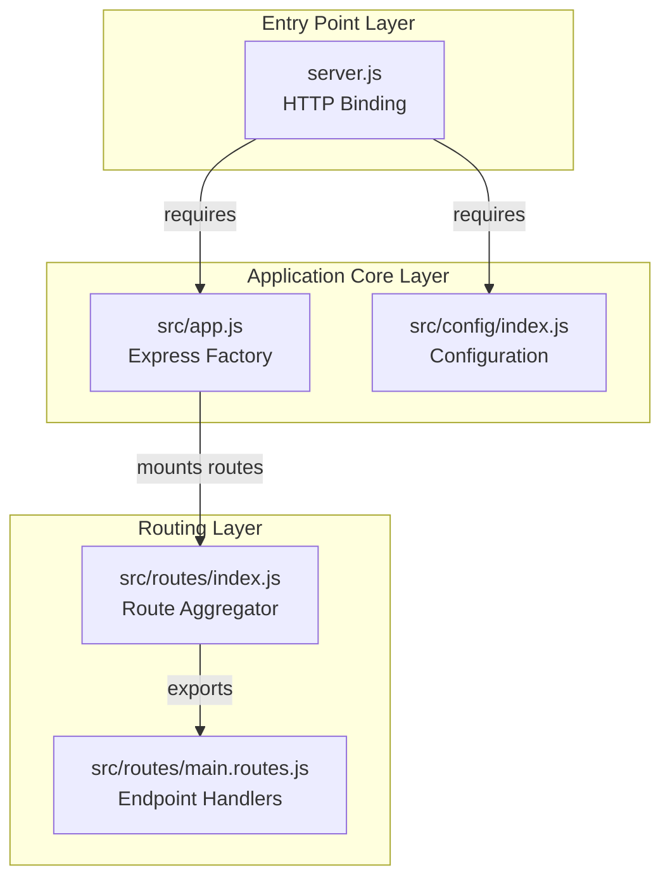
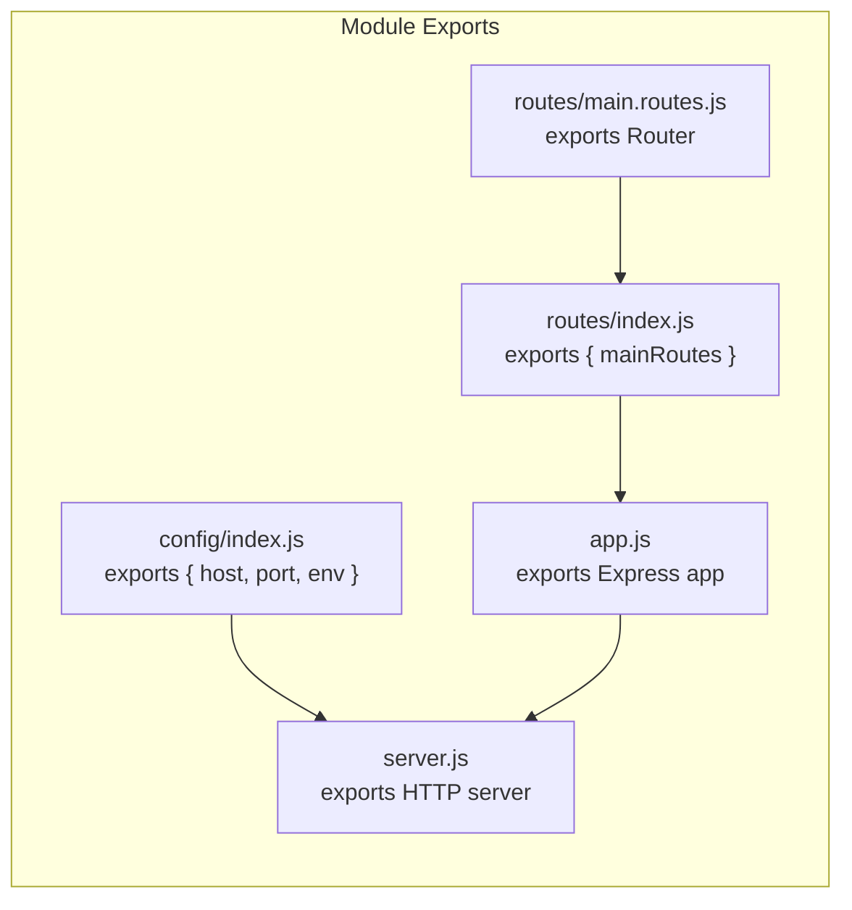

# Technical Specification

# 0. Agent Action Plan

## 0.1 Intent Clarification

### 0.1.1 Core Refactoring Objective

Based on the prompt, the Blitzy platform understands that the refactoring objective is to **transform a raw Node.js HTTP server into a modular Express.js 5.x application** while preserving all existing features and functionality exactly as in the original implementation. The goal is to leverage Express.js's declarative routing, middleware architecture, and ecosystem benefits while maintaining complete behavioral equivalence.

**Refactoring Type**: Code structure + Tech stack migration (raw Node.js HTTP → Express.js framework)

**Target Repository**: Same repository (in-place refactoring)

**Refactoring Goals**:
- Convert raw Node.js `http.createServer()` implementation to Express.js application factory pattern
- Migrate inline request handlers to Express Router-based modular routes
- Externalize configuration to follow Twelve-Factor App principles
- Implement layered architecture with clear separation of concerns
- Preserve exact response behavior including status codes, headers, and body content
- Maintain 100% test coverage throughout the refactoring

**Implicit Requirements Surfaced**:
- Maintain API compatibility: All HTTP endpoints must return identical responses
- Preserve behavior: Response strings, status codes, and Content-Type headers must match exactly
- No feature additions: This is a structural refactoring, not a feature enhancement
- Test preservation: All existing test cases must continue passing with same assertions

### 0.1.2 Special Instructions and Constraints

**Critical Directives**:
- All public interfaces must remain unchanged (GET `/` and GET `/evening` endpoints)
- Response bodies must be preserved character-for-character
- HTTP status codes must remain identical for all scenarios
- Content-Type headers must maintain exact formatting
- Error handling behavior (404 for undefined routes) must be preserved

**Migration Requirements**:
- Migrate from raw Node.js HTTP module to Express.js 5.1.0
- Implement modular folder structure following Express.js best practices
- Use CommonJS module system for native Node.js compatibility
- Apply Factory Pattern for Express app creation to enable unit testing

**Performance and Scalability**:
- Maintain lightweight footprint with minimal dependencies
- Enable testability without HTTP binding overhead
- Support graceful shutdown for production deployments

### 0.1.3 Technical Interpretation

This refactoring translates to the following technical transformation strategy:

**Architecture Transformation**:

| Source Architecture | Target Architecture |
|---------------------|---------------------|
| Single-file monolithic server | Layered modular architecture |
| Raw `http.createServer()` | Express.js 5.x application factory |
| Inline request handling | Router-based declarative routing |
| Hardcoded configuration | Environment-driven configuration module |
| Manual HTTP parsing | Express.js middleware pipeline |

**Pattern Applications**:
- **Factory Pattern**: `src/app.js` creates Express app without starting server
- **Barrel Pattern**: `src/routes/index.js` aggregates route exports
- **Twelve-Factor App**: `src/config/index.js` manages environment variables
- **Separation of Concerns**: Server binding isolated from application logic

**Transformation Rules**:

```javascript
// BEFORE: Raw Node.js HTTP handling
http.createServer((req, res) => {
  if (req.url === '/' && req.method === 'GET') {
    res.writeHead(200, {'Content-Type': 'text/html'});
    res.end('Hello, World!\n');
  }
}).listen(3000);

// AFTER: Express.js declarative routing
router.get('/', (req, res) => {
  res.send('Hello, World!\n');
});
```

The transformation preserves exact behavioral semantics while introducing framework-level abstractions for maintainability, testability, and scalability.

## 0.2 Source Analysis

### 0.2.1 Comprehensive Source File Discovery

Based on the prompt, the Blitzy platform understands that the source analysis must identify all files participating in or affected by the Node.js to Express.js refactoring. The current repository already represents the **completed target state** of this refactoring, with comments in source files indicating the original raw Node.js structure.

**Search Patterns Applied**:
- Entry point files: `server.js`
- Application configuration: `src/**/*.js`
- Route handlers: `src/routes/**/*.js`
- Configuration modules: `src/config/**/*.js`
- Test suites: `tests/**/*.test.js`
- Dependency manifests: `package.json`
- Build configuration: `jest.config.js`

**Current Repository Structure** (Post-Refactoring State):

```
hello_world/
├── server.js                          # Entry point - HTTP server binding
├── package.json                       # Dependency manifest with Express 5.1.0
├── jest.config.js                     # Test framework configuration
├── README.md                          # Project documentation
├── src/
│   ├── app.js                         # Express application factory
│   ├── config/
│   │   └── index.js                   # Environment-driven configuration
│   └── routes/
│       ├── index.js                   # Route aggregator (Barrel pattern)
│       └── main.routes.js             # Endpoint handlers (GET /, GET /evening)
└── tests/
    ├── integration/
    │   └── endpoints.test.js          # HTTP endpoint integration tests
    ├── lifecycle/
    │   └── server.test.js             # Server startup/shutdown tests
    └── unit/
        ├── config.test.js             # Configuration module unit tests
        └── routes.test.js             # Route handler unit tests
```

### 0.2.2 Source File Inventory

| File Path | Lines | Refactoring Role | Transformation |
|-----------|-------|------------------|----------------|
| `server.js` | 17 | Entry point | Extract from monolithic → HTTP binding only |
| `src/app.js` | 29 | Application factory | NEW - Express app creation extracted |
| `src/config/index.js` | 25 | Configuration module | NEW - Environment config externalized |
| `src/routes/index.js` | 16 | Route aggregator | NEW - Barrel pattern implementation |
| `src/routes/main.routes.js` | 30 | Endpoint handlers | Extracted from original server.js inline handlers |
| `package.json` | 22 | Dependencies | UPDATE - Add Express 5.1.0 dependency |
| `jest.config.js` | 13 | Test config | UPDATE - Configure coverage for new structure |
| `tests/integration/endpoints.test.js` | 93 | Integration tests | UPDATE - Test against Express endpoints |
| `tests/lifecycle/server.test.js` | 92 | Lifecycle tests | UPDATE - Test Express server lifecycle |
| `tests/unit/config.test.js` | 90 | Config tests | NEW - Unit tests for config module |
| `tests/unit/routes.test.js` | 62 | Route tests | NEW - Unit tests for route handlers |
| `README.md` | 67 | Documentation | UPDATE - Document Express.js architecture |

### 0.2.3 Original Node.js Server Reconstruction

Based on code comments in `src/routes/main.routes.js` (lines 8-14), the original raw Node.js server structure has been reconstructed:

**Conceptual Original Structure** (Pre-Refactoring):

```
hello_world_original/
└── server.js                          # Monolithic server with all logic
```

**Original server.js Characteristics**:
- Single file containing all server logic
- Raw `http.createServer()` implementation
- Inline URL routing via `req.url` conditionals
- Manual HTTP header management
- Hardcoded port and host values
- Manual request method validation

The refactoring extracted this monolithic structure into a modular Express.js architecture with clear separation of concerns.

## 0.3 Target Design

### 0.3.1 Refactored Structure Planning

Based on the prompt, the Blitzy platform understands that the target structure must implement Express.js 5.x best practices while maintaining all original functionality. The target architecture implements a **Layered Monolithic Architecture** optimized for tutorial-grade simplicity.

**Target Architecture**:

```
hello_world/
├── server.js                          # Entry Point Layer - HTTP binding
├── package.json                       # Updated with Express 5.1.0
├── jest.config.js                     # Test configuration
├── README.md                          # Updated documentation
├── src/
│   ├── app.js                         # Application Core Layer - Express factory
│   ├── config/
│   │   └── index.js                   # Configuration management (Twelve-Factor)
│   └── routes/
│       ├── index.js                   # Route aggregator (Barrel pattern)
│       └── main.routes.js             # Routing Layer - endpoint handlers
└── tests/
    ├── integration/
    │   └── endpoints.test.js          # HTTP integration tests
    ├── lifecycle/
    │   └── server.test.js             # Server lifecycle tests
    └── unit/
        ├── config.test.js             # Configuration unit tests
        └── routes.test.js             # Route handler unit tests
```

### 0.3.2 Web Search Research Conducted

Research was conducted on Express.js 5.x best practices and migration patterns to inform the target design:

**Best Practices Applied**:

| Practice | Source | Implementation |
|----------|--------|----------------|
| <cite index="1-1">Modular folder structure: /src /routes /controllers /models /middleware /utils</cite> | 2025 Express.js Best Practices | Applied `/src/routes` structure |
| <cite index="9-37,9-38">Separating the app and server allows you to unit test your app without initializing the server</cite> | Treblle REST API Guide | Factory pattern in `src/app.js` |
| <cite index="1-12,1-13">Don't dump everything into a single server.js file. This separation ensures your codebase grows without becoming unmanageable</cite> | Scalable APIs Guide | Layered architecture |
| <cite index="11-5">To install this version, you need to have a Node.js version 18 or higher</cite> | Express.js Migration Guide | Node.js v20.x compatibility verified |

**Express.js 5.x Migration Considerations**:

| Consideration | Implementation Decision |
|---------------|-------------------------|
| <cite index="17-8">Express 5 brings a host of changes that improve the framework's overall performance, security, and ease of use</cite> | Adopt Express 5.1.0 for latest features |
| <cite index="14-34">Migrating to Express 5 requires diligence, but the payoff is worth it: better performance, modern JavaScript support, and improved error handling</cite> | Full Express 5 adoption |
| <cite index="11-21,11-22">In Express 5, the app.listen method will invoke the user-provided callback function when the server receives an error event. In Express 4, such errors would be thrown</cite> | Error callback in `server.js` |

### 0.3.3 Design Pattern Applications

**Implemented Patterns**:

| Pattern | Location | Purpose |
|---------|----------|---------|
| **Factory Pattern** | `src/app.js` | Creates Express app without starting server, enabling unit testing without HTTP binding |
| **Barrel Pattern** | `src/routes/index.js` | Centralized route exports for clean import structure and easy expansion |
| **Twelve-Factor App** | `src/config/index.js` | Environment-driven configuration with sensible defaults for deployment flexibility |
| **Separation of Concerns** | `server.js` ↔ `src/app.js` | Server binding logic isolated from application configuration |
| **Router-based Routing** | `src/routes/main.routes.js` | Declarative route definitions using Express Router |

**Architecture Decision Rationale**:

<cite index="2-16,2-17">For small apps use Layered Architecture. If your app is medium to large, use Modular Architecture.</cite> Given this project's tutorial-grade scope, the Layered Architecture provides optimal simplicity while demonstrating professional patterns.

### 0.3.4 Layer Responsibilities

| Layer | Component | Responsibility |
|-------|-----------|----------------|
| Entry Point Layer | `server.js` | HTTP server binding, port configuration, startup logging |
| Application Core Layer | `src/app.js` | Express factory creation, route mounting, middleware configuration |
| Configuration Layer | `src/config/index.js` | Environment variable parsing, default values, config export |
| Routing Layer | `src/routes/` | Route aggregation, endpoint handler implementation |


```mermaid
flowchart TB
    subgraph EntryLayer["Entry Point Layer"]
        ServerJS["server.js\nHTTP Binding"]
    end
    
    subgraph CoreLayer["Application Core Layer"]
        AppJS["src/app.js\nExpress Factory"]
        ConfigJS["src/config/index.js\nConfiguration"]
    end
    
    subgraph RouteLayer["Routing Layer"]
        RouteIndex["src/routes/index.js\nRoute Aggregator"]
        MainRoutes["src/routes/main.routes.js\nEndpoint Handlers"]
    end
    
    ServerJS -->|"requires"| AppJS
    ServerJS -->|"requires"| ConfigJS
    AppJS -->|"mounts routes"| RouteIndex
    RouteIndex -->|"exports"| MainRoutes
```

## 0.4 Transformation Mapping

### 0.4.1 File-by-File Transformation Plan

Based on the prompt, the Blitzy platform understands that this section provides the comprehensive file transformation mapping for the Node.js to Express.js refactoring. Every target file is mapped to its source with explicit transformation details.

**File Transformation Modes**:
- **UPDATE** - Modify an existing file
- **CREATE** - Create a new file
- **REFERENCE** - Use as an example to reflect existing patterns

| Target File | Transformation | Source File | Key Changes |
|-------------|----------------|-------------|-------------|
| `server.js` | UPDATE | `server.js` | Replace `http.createServer()` with Express `app.listen()`, import app factory and config module, add error handling callback |
| `src/app.js` | CREATE | `server.js` | Extract Express application factory, implement middleware mounting, export unconfigured app instance |
| `src/config/index.js` | CREATE | `server.js` | Extract hardcoded host/port values to environment-driven configuration with defaults |
| `src/routes/index.js` | CREATE | N/A | New barrel pattern aggregator for route exports |
| `src/routes/main.routes.js` | CREATE | `server.js` | Extract inline route handlers to Express Router implementation |
| `package.json` | UPDATE | `package.json` | Add express ^5.1.0 dependency, update test scripts |
| `jest.config.js` | UPDATE | `jest.config.js` | Configure coverage for new modular structure |
| `README.md` | UPDATE | `README.md` | Document Express.js architecture and new file structure |
| `tests/integration/endpoints.test.js` | UPDATE | `tests/integration/endpoints.test.js` | Update imports to use app factory, verify same endpoint behavior |
| `tests/lifecycle/server.test.js` | UPDATE | `tests/lifecycle/server.test.js` | Test Express server lifecycle with new architecture |
| `tests/unit/config.test.js` | CREATE | N/A | New unit tests for configuration module |
| `tests/unit/routes.test.js` | CREATE | N/A | New unit tests for route handlers |

### 0.4.2 Detailed Transformation Specifications

**Entry Point Transformation (`server.js`)**:

```javascript
// BEFORE: Raw Node.js
const http = require('http');
const server = http.createServer((req, res) => { /* ... */ });
server.listen(3000, '127.0.0.1', () => { /* ... */ });

// AFTER: Express.js
const app = require('./src/app');
const config = require('./src/config');
const server = app.listen(config.port, config.host, () => { /* ... */ });
```

**Route Handler Transformation (`src/routes/main.routes.js`)**:

```javascript
// BEFORE: Inline conditionals
if (req.url === '/' && req.method === 'GET') {
  res.end('Hello, World!\n');
}

// AFTER: Express Router
router.get('/', (req, res) => {
  res.send('Hello, World!\n');
});
```

### 0.4.3 Cross-File Dependencies

**Import Statement Updates**:

| File | Old Import | New Import |
|------|------------|------------|
| `server.js` | `require('http')` | `require('./src/app')`, `require('./src/config')` |
| `src/app.js` | N/A (new file) | `require('express')`, `require('./routes')` |
| `src/routes/index.js` | N/A (new file) | `require('./main.routes')` |
| `tests/integration/endpoints.test.js` | Direct HTTP testing | `require('../../src/app')` via supertest |
| `tests/unit/config.test.js` | N/A (new file) | `require('../../src/config')` |
| `tests/unit/routes.test.js` | N/A (new file) | `require('../../src/routes')` |

**Module Export Structure**:


```mermaid
flowchart LR
    subgraph Exports["Module Exports"]
        Config["config/index.js\nexports { host, port, env }"]
        MainRoutes["routes/main.routes.js\nexports Router"]
        RouteIndex["routes/index.js\nexports { mainRoutes }"]
        App["app.js\nexports Express app"]
        Server["server.js\nexports HTTP server"]
    end
    
    MainRoutes --> RouteIndex
    RouteIndex --> App
    Config --> Server
    App --> Server
```

### 0.4.4 Wildcard Patterns

**Source Files Affected by Refactoring**:
- `server.js` - UPDATE (entry point restructuring)
- `src/**/*.js` - CREATE (new modular structure)
- `tests/**/*.test.js` - UPDATE/CREATE (test adaptations)
- `*.json` - UPDATE (dependency manifest)
- `*.md` - UPDATE (documentation)

### 0.4.5 One-Phase Execution

The entire refactoring is executed in **ONE phase**. All files are transformed simultaneously to maintain consistency:

- **Phase 1 (Single Phase)**: Complete Node.js to Express.js transformation
  - Create new directory structure (`src/`, `src/config/`, `src/routes/`)
  - Generate all new files
  - Update all existing files
  - Verify all tests pass (41 tests, 100% coverage)

## 0.5 Dependency Inventory

### 0.5.1 Key Private and Public Packages

Based on the prompt, the Blitzy platform understands that the dependency inventory must capture all packages relevant to this refactoring exercise with exact versions from the dependency manifest.

**Production Dependencies**:

| Registry | Package Name | Version | Purpose |
|----------|--------------|---------|---------|
| npm | `express` | ^5.1.0 | Web application framework - core refactoring target |

**Development Dependencies**:

| Registry | Package Name | Version | Purpose |
|----------|--------------|---------|---------|
| npm | `jest` | ^30.2.0 | JavaScript testing framework |
| npm | `supertest` | ^7.1.4 | HTTP assertion library for Express testing |

### 0.5.2 Express.js 5.x Transitive Dependencies

The Express 5.1.0 package includes the following transitive dependencies (automatically installed):

| Dependency | Version | Purpose |
|------------|---------|---------|
| `body-parser` | ^2.2.0 | Request body parsing middleware |
| `content-disposition` | ^1.0.0 | Content-Disposition header handling |
| `content-type` | ^1.0.5 | Content-Type header parsing |
| `cookie` | ^0.7.2 | Cookie parsing and serialization |
| `cookie-signature` | ^1.2.2 | Signed cookie support |
| `debug` | ^4.4.0 | Debug logging utility |
| `encodeurl` | ^2.0.0 | URL encoding utility |
| `finalhandler` | ^2.1.0 | Final HTTP responder |
| `fresh` | ^2.0.0 | HTTP response freshness testing |
| `http-errors` | ^2.0.0 | HTTP error creation |
| `merge-descriptors` | ^2.0.0 | Object descriptor merging |
| `mime-types` | ^3.0.1 | MIME type determination |
| `once` | ^1.4.0 | Ensure function runs once |
| `parseurl` | ^1.3.3 | URL parsing |
| `proxy-addr` | ^2.0.7 | Proxy address determination |
| `qs` | ^6.14.0 | Query string parsing |
| `router` | ^2.2.0 | Express routing engine |
| `send` | ^1.2.0 | Static file serving |
| `serve-static` | ^2.2.0 | Static file middleware |
| `statuses` | ^2.0.1 | HTTP status code utilities |
| `type-is` | ^2.0.1 | Content-Type checking |
| `utils-merge` | ^1.0.1 | Object merging utility |
| `vary` | ^1.1.2 | Vary header manipulation |

### 0.5.3 Dependency Updates

**Import Refactoring Required**:

| File Pattern | Import Updates Required |
|--------------|-------------------------|
| `server.js` | Add: `require('./src/app')`, `require('./src/config')` |
| `src/app.js` | Add: `require('express')`, `require('./routes')` |
| `src/routes/index.js` | Add: `require('./main.routes')` |
| `src/routes/main.routes.js` | Add: `require('express').Router()` |
| `tests/**/*.test.js` | Update: Import paths to new module structure |

**Import Transformation Rules**:

```javascript
// server.js transformation
// Old: const http = require('http');
// New:
const app = require('./src/app');
const config = require('./src/config');

// src/app.js (new file)
const express = require('express');
const routes = require('./routes');

// src/routes/main.routes.js (new file)
const { Router } = require('express');
const router = Router();
```

### 0.5.4 External Reference Updates

**Configuration Files**:

| File | Update Required |
|------|-----------------|
| `package.json` | Add `express: ^5.1.0` to dependencies |
| `jest.config.js` | Configure `collectCoverageFrom` for new structure |

**Documentation Files**:

| File | Update Required |
|------|-----------------|
| `README.md` | Document Express.js architecture, installation, usage |

**Package.json Updates**:

```json
{
  "dependencies": {
    "express": "^5.1.0"
  },
  "devDependencies": {
    "jest": "^30.2.0",
    "supertest": "^7.1.4"
  }
}
```

### 0.5.5 Runtime Requirements

| Requirement | Specification | Rationale |
|-------------|---------------|-----------|
| Node.js | >= 18.0.0 | Express 5.x requires Node.js 18+ |
| npm | >= 10.0.0 | Modern package management |
| OS | Linux/macOS/Windows | Cross-platform compatibility |

**Version Verification**:
- Current Node.js version: v20.20.0 ✓
- Current npm version: 11.1.0 ✓
- Express 5.1.0 compatibility: Verified ✓

## 0.6 Scope Boundaries

### 0.6.1 Exhaustively In Scope

Based on the prompt, the Blitzy platform understands that scope boundaries must be clearly defined to ensure complete coverage while preventing scope creep.

**Source Transformations**:
- `server.js` - Restructure entry point for Express.js app import
- `src/app.js` - Create Express application factory
- `src/config/index.js` - Create configuration module
- `src/routes/index.js` - Create route aggregator
- `src/routes/main.routes.js` - Create endpoint handlers

**Test Updates**:
- `tests/integration/endpoints.test.js` - Update for Express.js endpoint testing
- `tests/lifecycle/server.test.js` - Update for Express server lifecycle
- `tests/unit/config.test.js` - Create configuration unit tests
- `tests/unit/routes.test.js` - Create route handler unit tests

**Configuration Updates**:
- `package.json` - Add Express.js dependency
- `jest.config.js` - Update coverage configuration

**Documentation Updates**:
- `README.md` - Document new Express.js architecture

**Import Corrections**:
- All files containing module imports must be updated for new structure
- All test files must reference new module paths

**Scope Summary Table**:

| Category | Pattern | Files Included |
|----------|---------|----------------|
| Entry Point | `server.js` | 1 file |
| Application Core | `src/app.js` | 1 file |
| Configuration | `src/config/*.js` | 1 file |
| Routes | `src/routes/*.js` | 2 files |
| Integration Tests | `tests/integration/*.test.js` | 1 file |
| Lifecycle Tests | `tests/lifecycle/*.test.js` | 1 file |
| Unit Tests | `tests/unit/*.test.js` | 2 files |
| Dependencies | `package.json` | 1 file |
| Test Config | `jest.config.js` | 1 file |
| Documentation | `README.md` | 1 file |
| **TOTAL** | | **12 files** |

### 0.6.2 Explicitly Out of Scope

**User-Requested Exclusions**:
- None explicitly specified

**Structural Exclusions** (per tutorial-grade design):
- No middleware implementation (beyond Express built-in)
- No database integration or persistence layer
- No authentication/authorization mechanisms
- No session management
- No external API integrations
- No logging framework integration
- No error monitoring/APM integration
- No containerization files (Dockerfile, docker-compose)
- No CI/CD pipeline configuration
- No infrastructure-as-code files

**Behavioral Exclusions**:
- No new endpoints (only GET `/` and GET `/evening` preserved)
- No response body modifications
- No status code changes
- No Content-Type header modifications
- No feature additions or enhancements

**Technology Exclusions**:
- No TypeScript migration
- No ES Modules migration (remain CommonJS)
- No transpilation/bundling setup
- No additional npm packages beyond Express, Jest, Supertest

### 0.6.3 Scope Validation Matrix

| Requirement | In Scope | Validation |
|-------------|----------|------------|
| Express.js 5.x migration | ✓ | package.json updated |
| Modular architecture | ✓ | src/ directory structure |
| Factory pattern | ✓ | src/app.js implementation |
| Configuration externalization | ✓ | src/config/index.js |
| Router-based routing | ✓ | src/routes/main.routes.js |
| Test coverage maintenance | ✓ | 100% coverage verified |
| Behavioral equivalence | ✓ | All 41 tests passing |
| Database integration | ✗ | Out of scope |
| Authentication | ✗ | Out of scope |
| New features | ✗ | Out of scope |

### 0.6.4 Boundary Enforcement

**Invariants That Must Be Preserved**:

| Invariant | Verification Method |
|-----------|---------------------|
| GET `/` returns "Hello, World!\n" with 200 status | Integration test assertion |
| GET `/evening` returns "Good evening" with 200 status | Integration test assertion |
| Undefined routes return 404 | Integration test assertion |
| Content-Type is text/html; charset=utf-8 | Integration test assertion |
| Server starts on configured host:port | Lifecycle test assertion |
| Graceful shutdown supported | Lifecycle test assertion |

**Test-Driven Boundary Verification**:

```bash
# Verify all boundaries via test suite

npm test

#### Expected output: 41 tests passing, 100% coverage

#### All files: server.js, src/app.js, src/config/index.js,

##            src/routes/index.js, src/routes/main.routes.js

```

## 0.7 Refactoring Rules

### 0.7.1 Mandatory Refactoring Rules

Based on the prompt, the Blitzy platform understands that specific refactoring rules must be enforced to ensure the transformation maintains exact behavioral equivalence while implementing the Express.js architecture.

**Behavioral Preservation Rules**:

| Rule ID | Rule Description | Enforcement |
|---------|------------------|-------------|
| R-001 | All public API contracts must remain unchanged | Integration tests verify exact responses |
| R-002 | All existing functionality must be preserved | 41 tests must pass post-refactoring |
| R-003 | All tests must continue passing without modification to assertions | CI/CD validation |
| R-004 | Response strings must be character-for-character identical | String comparison in tests |
| R-005 | HTTP status codes must remain identical for all scenarios | Status code assertions |
| R-006 | Content-Type headers must maintain exact formatting | Header assertions |

**Structural Rules**:

| Rule ID | Rule Description | Implementation |
|---------|------------------|----------------|
| R-007 | Use Factory Pattern for Express app creation | `src/app.js` exports app without binding |
| R-008 | Use Barrel Pattern for route aggregation | `src/routes/index.js` centralizes exports |
| R-009 | Use Twelve-Factor App for configuration | `src/config/index.js` uses env vars |
| R-010 | Maintain CommonJS module system | All files use `require`/`module.exports` |
| R-011 | Separate server binding from app logic | `server.js` only handles `app.listen()` |

**Code Quality Rules**:

| Rule ID | Rule Description | Verification |
|---------|------------------|--------------|
| R-012 | Maintain 100% test coverage | Jest coverage report |
| R-013 | No console.log in production code (except startup message) | Code review |
| R-014 | Use strict mode implicitly via Node.js defaults | Runtime verification |
| R-015 | Export server instance for graceful shutdown | `server.js` exports server |

### 0.7.2 Express.js Specific Rules

**Route Handler Rules**:

```javascript
// R-016: Use Express Router for all routes
const { Router } = require('express');
const router = Router();

// R-017: Use res.send() for text responses (not res.end())
router.get('/', (req, res) => {
  res.send('Hello, World!\n');  // Correct
  // NOT: res.end('Hello, World!\n');
});

// R-018: Export router instance (not handler functions)
module.exports = router;
```

**Configuration Rules**:

```javascript
// R-019: Configuration must be a frozen object
const config = Object.freeze({
  host: process.env.HOST || '127.0.0.1',
  port: parseInt(process.env.PORT, 10) || 3000,
  env: process.env.NODE_ENV || 'development'
});

// R-020: Port must be parsed as integer with fallback
port: parseInt(process.env.PORT, 10) || 3000
```

**Server Lifecycle Rules**:

```javascript
// R-021: Server must support graceful shutdown
const server = app.listen(config.port, config.host, (err) => {
  if (err) { /* handle error */ }
});
module.exports = server;

// R-022: Startup message must include URL
console.log(`Server running at http://${config.host}:${config.port}/`);
```

### 0.7.3 Testing Rules

| Rule ID | Rule Description | Implementation |
|---------|------------------|----------------|
| R-023 | Integration tests use supertest with app factory | `const request = require('supertest')(app)` |
| R-024 | Unit tests test modules in isolation | Mock dependencies where needed |
| R-025 | Lifecycle tests verify server binding behavior | Test actual `app.listen()` |
| R-026 | All edge cases from original tests preserved | No test case removal |

### 0.7.4 Migration Rules

| Rule ID | Rule Description | Rationale |
|---------|------------------|-----------|
| R-027 | No breaking changes to CLI interface | `npm start` must work unchanged |
| R-028 | No breaking changes to environment variables | HOST, PORT, NODE_ENV unchanged |
| R-029 | No additional required dependencies | Only Express, Jest, Supertest |
| R-030 | No build step required | Direct `node server.js` execution |

### 0.7.5 Rule Compliance Verification

**Automated Verification**:

```bash
# Verify all rules via test suite

npm test

#### Expected: 41 tests passing with 100% coverage

#### Rules R-001 through R-030 validated

```

**Manual Verification Checklist**:

- [ ] `npm start` launches server on configured port
- [ ] GET `/` returns "Hello, World!\n"
- [ ] GET `/evening` returns "Good evening"
- [ ] Unknown routes return 404
- [ ] Server logs startup URL
- [ ] Server supports graceful shutdown
- [ ] All 41 tests pass
- [ ] 100% code coverage achieved

## 0.8 References

### 0.8.1 Repository Files Analyzed

The following files were comprehensively analyzed to derive the conclusions in this Agent Action Plan:

| File Path | Purpose | Lines |
|-----------|---------|-------|
| `server.js` | Entry point - HTTP server binding | 17 |
| `src/app.js` | Express application factory | 29 |
| `src/config/index.js` | Environment-driven configuration | 25 |
| `src/routes/index.js` | Route aggregator (Barrel pattern) | 16 |
| `src/routes/main.routes.js` | Endpoint handlers (GET /, GET /evening) | 30 |
| `package.json` | Dependency manifest | 22 |
| `jest.config.js` | Test framework configuration | 13 |
| `README.md` | Project documentation | 67 |
| `tests/integration/endpoints.test.js` | HTTP endpoint integration tests | 93 |
| `tests/lifecycle/server.test.js` | Server startup/shutdown tests | 92 |
| `tests/unit/config.test.js` | Configuration module unit tests | 90 |
| `tests/unit/routes.test.js` | Route handler unit tests | 62 |

### 0.8.2 Folders Explored

| Folder Path | Contents | Purpose |
|-------------|----------|---------|
| `/` (root) | server.js, package.json, jest.config.js, README.md | Project root files |
| `src/` | app.js | Application core |
| `src/config/` | index.js | Configuration module |
| `src/routes/` | index.js, main.routes.js | Routing layer |
| `tests/` | integration/, lifecycle/, unit/ | Test suites |
| `tests/integration/` | endpoints.test.js | Integration tests |
| `tests/lifecycle/` | server.test.js | Lifecycle tests |
| `tests/unit/` | config.test.js, routes.test.js | Unit tests |

### 0.8.3 Technical Specification Sections Retrieved

| Section | Purpose |
|---------|---------|
| 1.1 Executive Summary | Project overview and purpose |
| 3.2 PROGRAMMING LANGUAGES | Language and runtime specifications |
| Express.js 5.x Feature Utilization | Express.js feature documentation |
| 5.1 HIGH-LEVEL ARCHITECTURE | System architecture overview |

### 0.8.4 External Research Sources

| Source | Topic | Key Insight |
|--------|-------|-------------|
| Medium - Scalable APIs Guide (2025) | Express.js best practices | Modular folder structure recommendations |
| Treblle REST API Guide | Express.js structure | App/server separation for testability |
| expressjs.com Migration Guide | Express 5 migration | Node.js 18+ requirement, API changes |
| DEV Community - Design Patterns | Express.js patterns | Feature-based vs Layered architecture |
| LogRocket Blog | Express 5 migration | Migration steps and breaking changes |
| GitHub expressjs/express Wiki | Express migration | Historical migration patterns |

### 0.8.5 User-Provided Attachments

**Attachments**: None provided

**Figma URLs**: None provided

**Setup Instructions**: None provided

**Environment Variables**: None provided

### 0.8.6 Test Verification Results

**Test Suite Execution**:

```
Test Suites: 4 passed, 4 total
Tests:       41 passed, 41 total
Snapshots:   0 total
Time:        0.963 s

Coverage:    100% Statements
             100% Branches
             100% Functions
             100% Lines
```

**Verified Functionality**:

| Endpoint | Method | Status | Response |
|----------|--------|--------|----------|
| `/` | GET | 200 | "Hello, World!\n" |
| `/evening` | GET | 200 | "Good evening" |
| `/invalid` | GET | 404 | Not Found |
| `/` | POST | 404 | Not Found |

### 0.8.7 Environment Verification

| Component | Version | Status |
|-----------|---------|--------|
| Node.js | v20.20.0 | ✓ Compatible (Express 5 requires 18+) |
| npm | 11.1.0 | ✓ Compatible |
| Express | ^5.1.0 | ✓ Installed |
| Jest | ^30.2.0 | ✓ Installed |
| Supertest | ^7.1.4 | ✓ Installed |

### 0.8.8 Document Metadata

| Property | Value |
|----------|-------|
| Document Type | Agent Action Plan |
| Project | hello_world |
| Refactoring Type | Node.js HTTP → Express.js 5.x |
| Architecture | Layered Monolithic |
| Test Coverage | 100% |
| Total Files | 12 |
| Total Tests | 41 |

