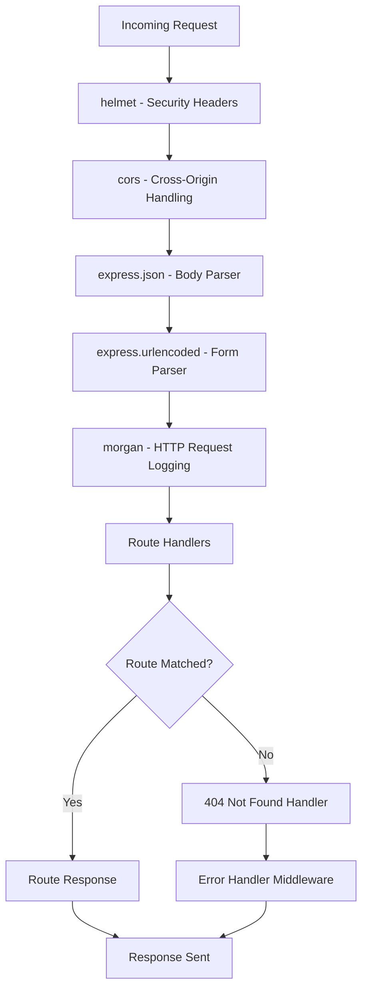

# Technical Specification

# 0. Agent Action Plan

## 0.1 Intent Clarification

### 0.1.1 Core Objective

Based on the provided requirements, the Blitzy platform understands that the objective is to **enhance an existing basic HTTP server into a production-ready Express.js application** by systematically layering in enterprise-grade capabilities across six key dimensions:

- **Express.js Framework Enhancement**: The existing Express 5.1.0 application (`src/app.js`) currently implements a minimal app factory pattern with two static GET routes. The enhancement involves expanding the Express middleware pipeline with production-grade middleware for security, CORS handling, request parsing, and error management.
- **Routing Enhancement**: The current routing layer (`src/routes/`) uses a barrel export pattern with a single route module (`main.routes.js`). The enhancement involves adding a health check endpoint (`GET /health`) for operational readiness, structured error-handling routes, and potentially an API versioning or route-organization pattern.
- **Middleware Integration**: The application currently has zero middleware. The enhancement requires adding a structured middleware layer including HTTP security headers (Helmet), Cross-Origin Resource Sharing (CORS), JSON body parsing, URL-encoded body parsing, HTTP request logging (Morgan), and centralized error-handling middleware.
- **Environment Configuration Enhancement**: The existing `src/config/index.js` reads `HOST`, `PORT`, and `NODE_ENV` directly from `process.env` with hardcoded defaults. The enhancement involves adding `dotenv` for `.env` file support, expanding the configuration schema with logging-level and CORS-origin settings, and enabling environment-specific configuration profiles.
- **Structured Logging**: The application currently uses bare `console.log` for startup messages and has no request logging. The enhancement introduces a dual-layer logging architecture: Winston as the application-wide structured logger (with console and file transports) and Morgan as HTTP request-logging middleware piped through Winston's stream interface.
- **PM2 Production Deployment Preparation**: The application has no process management configuration. The enhancement creates a PM2 ecosystem configuration file (`ecosystem.config.js`), adds production-oriented npm scripts, and configures cluster mode support for multi-core utilization.

### 0.1.2 Task Categorization

- **Primary task type**: Mixed (Feature Enhancement + Configuration + Infrastructure)
- **Secondary aspects**: Security hardening (Helmet, CORS), Observability (logging), DevOps (PM2 deployment)
- **Scope classification**: Cross-cutting change — modifications span the entire application stack from entry point through configuration, middleware, routing, logging, error handling, testing, and deployment configuration

### 0.1.3 Special Instructions and Constraints

- The project uses **CommonJS modules** (`require`/`module.exports`) exclusively — all new files must follow this convention
- The existing **app factory pattern** (app created and exported without calling `listen()`) must be preserved, as it is a documented architectural requirement validated by lifecycle tests
- The project requires **Express 5.1.0** (already installed) — all middleware must be compatible with Express 5.x
- The existing test suite enforces **coverage thresholds** (75% branches, 90% functions, 80% lines/statements) — all new code must be accompanied by tests that maintain or exceed these thresholds
- No user-specified constraints on "documentation only" or "skip testing" — full implementation is expected
- Node.js **>= 18.x** runtime requirement remains in effect

### 0.1.4 Technical Interpretation

These requirements translate to the following technical implementation strategy:

- To **add middleware**, we will modify `src/app.js` to mount Helmet, CORS, body parsers, and Morgan middleware in the correct order before route registration, and add error-handling middleware after routes
- To **enhance routing**, we will create `src/routes/health.routes.js` for the health check endpoint, update the barrel file `src/routes/index.js`, and add a centralized 404/error handler
- To **integrate logging**, we will create `src/utils/logger.js` (Winston configuration) and `src/middleware/morgan.middleware.js` (Morgan configuration piped through Winston), then integrate both into the application lifecycle
- To **enhance environment config**, we will add `dotenv` as a dependency, create a `.env.example` template, and extend `src/config/index.js` with additional configuration properties for logging level and CORS origin
- To **prepare for PM2 deployment**, we will create `ecosystem.config.js` at the project root and add `start:prod` scripts to `package.json`
- To **maintain quality**, we will update existing test files and create new test files for all added modules, ensuring coverage thresholds continue to be met

## 0.2 Repository Scope Discovery

### 0.2.1 Comprehensive File Analysis

The repository (`hao-backprop-test`) is a minimal Node.js HTTP server project. A complete inventory of all source files and their relevance to this enhancement follows.

**Entry Point and Application Core**

| File Path | Relevance | Assessment |
|-----------|-----------|------------|
| `server.js` | Direct modification | Entry point that imports app and config, calls `app.listen()`. Must integrate logger for startup messages and graceful shutdown signals. |
| `src/app.js` | Direct modification | App factory — currently creates Express instance and mounts routes. Must add middleware pipeline (Helmet, CORS, Morgan, body parsers, error handlers). |
| `src/config/index.js` | Direct modification | Environment config module. Must add `dotenv` loading, expand with `LOG_LEVEL` and `CORS_ORIGIN` settings. |

**Routing Layer**

| File Path | Relevance | Assessment |
|-----------|-----------|------------|
| `src/routes/index.js` | Direct modification | Barrel export aggregating route modules. Must register new health route module. |
| `src/routes/main.routes.js` | Reference only | Existing routes (`GET /`, `GET /evening`). No changes needed; serves as pattern reference. |

**Test Suite**

| File Path | Relevance | Assessment |
|-----------|-----------|------------|
| `tests/unit/config.test.js` | Direct modification | Config unit tests (23 assertions). Must add tests for new `dotenv` loading, `LOG_LEVEL`, and `CORS_ORIGIN` config properties. |
| `tests/unit/routes.test.js` | Direct modification | Route structure tests. Must add assertions for new health route export. |
| `tests/integration/endpoints.test.js` | Direct modification | HTTP endpoint integration tests via Supertest. Must add tests for `GET /health` endpoint and middleware behavior (security headers, CORS). |
| `tests/lifecycle/server.test.js` | Direct modification | Server lifecycle tests (startup, shutdown). Must update to account for Winston logger usage in startup messages. |

**Configuration and Metadata**

| File Path | Relevance | Assessment |
|-----------|-----------|------------|
| `package.json` | Direct modification | Must add new dependencies (dotenv, helmet, cors, morgan, winston, pm2) and new npm scripts. |
| `jest.config.js` | Possible modification | Coverage thresholds and test configuration. May need to update `collectCoverageFrom` to include new directories. |
| `.gitignore` | Direct modification | Must add entries for `.env`, `logs/`, and PM2-generated files. |
| `README.md` | Direct modification | Project documentation. Must update with new features, middleware descriptions, environment variables, PM2 usage, and logging configuration. |

**New Files to Create**

| File Path | Purpose |
|-----------|---------|
| `src/middleware/morgan.middleware.js` | Morgan HTTP request logger configuration piped through Winston |
| `src/middleware/error.middleware.js` | Centralized error-handling middleware (404 handler, error handler) |
| `src/utils/logger.js` | Winston logger instance with console and file transports |
| `src/routes/health.routes.js` | Health check endpoint (`GET /health`) |
| `ecosystem.config.js` | PM2 ecosystem configuration for production deployment |
| `.env.example` | Template for environment variable documentation |
| `tests/unit/logger.test.js` | Unit tests for Winston logger utility |
| `tests/unit/middleware.test.js` | Unit tests for middleware modules |
| `tests/integration/health.test.js` | Integration tests for health check endpoint |

### 0.2.2 Web Search Research Conducted

- **Express.js production best practices**: Confirmed that production Express apps should use Helmet for security headers, compression middleware, a process manager like PM2, and structured logging. The official Express.js documentation states that "a process manager is a 'container' for applications that facilitates deployment, provides high availability."
- **PM2 ecosystem configuration**: Verified that PM2 6.0.14 uses `ecosystem.config.js` with `exec_mode: 'cluster'` and `instances` configuration for multi-core deployment. The ecosystem file supports `env` and `env_production` blocks for environment-specific settings.
- **Winston + Morgan integration**: Best practice is to create a Winston logger instance and pipe Morgan's output through Winston's stream interface, ensuring all logging goes through a single, configurable channel with consistent formatting.
- **Morgan logging formats**: The `combined` format provides Apache-style logs for production; the `dev` format provides colorized concise output for development. Morgan 1.10.1 is the current stable release.
- **dotenv configuration**: The `dotenv` package (17.2.4) loads `.env` files into `process.env` and follows the Twelve-Factor App methodology for environment configuration.

### 0.2.3 Existing Infrastructure Assessment

- **Project structure**: Follows a layered architecture with clear separation — entry (`server.js`), application factory (`src/app.js`), configuration (`src/config/`), and routing (`src/routes/`). No `src/middleware/` or `src/utils/` directories exist yet.
- **Existing patterns and conventions**: CommonJS modules throughout, JSDoc annotations in test files, `'use strict'` pragmas, factory pattern for app creation, barrel exports for route aggregation.
- **Build and deployment**: No build step (pure JavaScript), no CI/CD configuration, no Dockerfile, no PM2 config. The only scripts are `start`, `test`, and `test:coverage`.
- **Testing infrastructure**: Jest 30.2.0 with Supertest 7.1.4. Tests organized into `tests/unit/`, `tests/integration/`, and `tests/lifecycle/` directories. Coverage thresholds enforced: 75% branches, 90% functions, 80% lines/statements. A `tests/README.md` documents the testing strategy.
- **Documentation**: Root `README.md` documents project purpose, prerequisites, API reference, and project structure. No additional documentation system (no docs/ directory, no JSDoc generation).

## 0.3 File Transformation Mapping

### 0.3.1 File-by-File Execution Plan

| Target File | Transformation | Source File/Reference | Purpose/Changes |
|-------------|----------------|----------------------|-----------------|
| `src/app.js` | UPDATE | `src/app.js` | Add middleware pipeline: Helmet, CORS, JSON body parser, URL-encoded parser, Morgan logger; mount error handlers after routes |
| `src/config/index.js` | UPDATE | `src/config/index.js` | Add `dotenv` loading, expand config with `logLevel` and `corsOrigin` properties |
| `server.js` | UPDATE | `server.js` | Replace `console.log` with Winston logger for startup messages; add graceful shutdown handling with `SIGTERM`/`SIGINT` signals |
| `src/utils/logger.js` | CREATE | `src/config/index.js` (pattern ref) | Create Winston logger with console and file transports, environment-aware log levels |
| `src/middleware/morgan.middleware.js` | CREATE | `src/routes/main.routes.js` (pattern ref) | Create Morgan middleware configured to pipe HTTP request logs through Winston stream |
| `src/middleware/error.middleware.js` | CREATE | `src/routes/main.routes.js` (pattern ref) | Create centralized 404 not-found handler and error-handling middleware |
| `src/routes/health.routes.js` | CREATE | `src/routes/main.routes.js` (pattern ref) | Create health check endpoint returning `{ status: 'ok' }` with uptime and timestamp |
| `src/routes/index.js` | UPDATE | `src/routes/index.js` | Register and export new health route alongside existing main routes |
| `ecosystem.config.js` | CREATE | `package.json` (pattern ref) | Create PM2 ecosystem config with cluster mode, environment blocks, log paths |
| `.env.example` | CREATE | `src/config/index.js` (pattern ref) | Create environment variable template documenting all supported variables |
| `package.json` | UPDATE | `package.json` | Add new dependencies (dotenv, helmet, cors, morgan, winston, pm2) and new scripts (`start:prod`, `start:dev`) |
| `.gitignore` | UPDATE | `.gitignore` | Add entries for `.env`, `logs/`, and PM2-specific files |
| `README.md` | UPDATE | `README.md` | Update documentation with middleware, logging, environment variables, PM2 usage |
| `jest.config.js` | UPDATE | `jest.config.js` | Update `collectCoverageFrom` to include new `src/middleware/` and `src/utils/` directories |
| `tests/unit/logger.test.js` | CREATE | `tests/unit/config.test.js` (pattern ref) | Unit tests for Winston logger: transport creation, log levels, format validation |
| `tests/unit/middleware.test.js` | CREATE | `tests/unit/config.test.js` (pattern ref) | Unit tests for Morgan and error middleware: function export, middleware signature |
| `tests/unit/config.test.js` | UPDATE | `tests/unit/config.test.js` | Add tests for dotenv loading, `logLevel` property, `corsOrigin` property |
| `tests/unit/routes.test.js` | UPDATE | `tests/unit/routes.test.js` | Add assertions verifying health route export from barrel file |
| `tests/integration/endpoints.test.js` | UPDATE | `tests/integration/endpoints.test.js` | Add tests for middleware response headers (Helmet security headers, CORS headers) |
| `tests/integration/health.test.js` | CREATE | `tests/integration/endpoints.test.js` (pattern ref) | Integration tests for `GET /health` endpoint: status code, response body schema, Content-Type |
| `tests/lifecycle/server.test.js` | UPDATE | `tests/lifecycle/server.test.js` | Update startup log assertions to match Winston-formatted output; add graceful shutdown tests |
| `src/routes/main.routes.js` | REFERENCE | — | Existing route module used as pattern reference for new route modules |

### 0.3.2 New Files Detail

- **`src/utils/logger.js`** — Winston Logger Configuration
  - Content type: source
  - Based on: existing `src/config/index.js` CommonJS export pattern
  - Key exports: `logger` instance with `info`, `error`, `warn`, `debug`, `http` methods
  - Transports: Console (all environments), File error log (`logs/error.log`), File combined log (`logs/combined.log`)

- **`src/middleware/morgan.middleware.js`** — HTTP Request Logger
  - Content type: source
  - Based on: Express middleware pattern established in `src/app.js`
  - Key exports: configured Morgan middleware function piped to Winston's `http` level
  - Format: `combined` in production, `dev` in development

- **`src/middleware/error.middleware.js`** — Error Handling Middleware
  - Content type: source
  - Based on: Express error-handling middleware convention (4-parameter signature)
  - Key exports: `notFoundHandler` (404 catch-all) and `errorHandler` (centralized error response)

- **`src/routes/health.routes.js`** — Health Check Route
  - Content type: source
  - Based on: `src/routes/main.routes.js` pattern
  - Key exports: Express Router with `GET /health` returning JSON `{ status, uptime, timestamp }`

- **`ecosystem.config.js`** — PM2 Process Manager Configuration
  - Content type: config
  - Based on: PM2 ecosystem file specification
  - Key sections: `apps` array with name, script, instances, exec_mode, env, and env_production blocks

- **`.env.example`** — Environment Variable Template
  - Content type: documentation/config
  - Based on: `src/config/index.js` property inventory
  - Key entries: `HOST`, `PORT`, `NODE_ENV`, `LOG_LEVEL`, `CORS_ORIGIN`

### 0.3.3 Files to Modify Detail

- **`src/app.js`** — Add Middleware Pipeline
  - Add `require` statements for helmet, cors, morgan middleware, and error middleware
  - Insert middleware mounting before route registration: `app.use(helmet())`, `app.use(cors())`, `app.use(express.json())`, `app.use(express.urlencoded())`, `app.use(morganMiddleware)`
  - Insert error handlers after route registration: `app.use(notFoundHandler)`, `app.use(errorHandler)`

- **`src/config/index.js`** — Expand Configuration
  - Add `require('dotenv').config()` at the top of the file
  - Add `logLevel` property: `process.env.LOG_LEVEL || 'info'`
  - Add `corsOrigin` property: `process.env.CORS_ORIGIN || '*'`

- **`server.js`** — Integrate Logger and Graceful Shutdown
  - Replace `console.log` startup message with `logger.info()`
  - Add `SIGTERM` and `SIGINT` signal handlers for graceful shutdown via `server.close()`

- **`package.json`** — Dependencies and Scripts
  - Add production dependencies: `dotenv`, `helmet`, `cors`, `morgan`, `winston`
  - Add dev dependency: `pm2`
  - Add scripts: `"start:prod": "pm2 start ecosystem.config.js"`, `"start:dev": "node server.js"`

- **`.gitignore`** — Exclusion Updates
  - Add: `.env`, `logs/`, `*.log`

### 0.3.4 Configuration and Documentation Updates

- **Configuration changes**:
  - `package.json`: Five new production dependencies, one new dev dependency, two new scripts
  - `jest.config.js`: Extended `collectCoverageFrom` glob to include `src/middleware/**/*.js` and `src/utils/**/*.js`
  - `.gitignore`: Three new exclusion patterns
  - `ecosystem.config.js`: New PM2 process manager config file
  - `.env.example`: New environment variable template

- **Documentation updates**:
  - `README.md`: Add sections for Middleware, Logging, Environment Variables, PM2 Deployment, and updated Project Structure
  - `tests/README.md`: May need update to document new test categories for middleware and utility tests

### 0.3.5 Cross-File Dependencies

- `src/utils/logger.js` is imported by: `src/middleware/morgan.middleware.js`, `server.js`, and potentially `src/middleware/error.middleware.js`
- `src/middleware/morgan.middleware.js` is imported by: `src/app.js`
- `src/middleware/error.middleware.js` is imported by: `src/app.js`
- `src/routes/health.routes.js` is imported by: `src/routes/index.js`
- `src/config/index.js` is imported by: `server.js`, `src/utils/logger.js` (for log level), `src/middleware/morgan.middleware.js` (for environment detection)
- `dotenv` must be loaded before any config access — ensured by placing `require('dotenv').config()` at the top of `src/config/index.js`

## 0.4 Dependency Inventory

### 0.4.1 Key Private and Public Packages

**Existing Dependencies (No Changes)**

| Registry | Package Name | Version | Purpose |
|----------|--------------|---------|---------|
| npm | express | ^5.1.0 | HTTP framework — application core |
| npm | jest | ^30.2.0 | Testing framework with coverage reporting |
| npm | supertest | ^7.1.4 | HTTP assertion library for integration testing |

**New Production Dependencies**

| Registry | Package Name | Version | Purpose |
|----------|--------------|---------|---------|
| npm | dotenv | ^17.2.4 | Load environment variables from `.env` file into `process.env` |
| npm | helmet | ^8.1.0 | Set security-related HTTP response headers (CSP, HSTS, X-Frame-Options) |
| npm | cors | ^2.8.6 | Enable Cross-Origin Resource Sharing with configurable policies |
| npm | morgan | ^1.10.1 | HTTP request logger middleware for Express |
| npm | winston | ^3.19.0 | Multi-transport structured logging library with leveled log support |

**New Development Dependencies**

| Registry | Package Name | Version | Purpose |
|----------|--------------|---------|---------|
| npm | pm2 | ^6.0.14 | Production process manager with cluster mode, monitoring, and auto-restart |

### 0.4.2 Dependency Updates

- **New dependencies to add (production)**:
  - `dotenv`: ^17.2.4 — Required for `.env` file parsing per 12-Factor App methodology
  - `helmet`: ^8.1.0 — Required for HTTP security header enforcement
  - `cors`: ^2.8.6 — Required for cross-origin request handling
  - `morgan`: ^1.10.1 — Required for HTTP request logging middleware
  - `winston`: ^3.19.0 — Required for structured application logging with file and console transports

- **New dependencies to add (development)**:
  - `pm2`: ^6.0.14 — Required for production process management configuration and testing

- **Dependencies to update**: None — existing dependencies remain at their current versions

- **Dependencies to remove**: None

### 0.4.3 Import/Reference Updates

- Files requiring new import statements:
  - `src/config/index.js` — Add `require('dotenv').config()` at top
  - `src/app.js` — Add `require('helmet')`, `require('cors')`, `require('./middleware/morgan.middleware')`, `require('./middleware/error.middleware')`
  - `server.js` — Add `require('./src/utils/logger')`
  - `src/routes/index.js` — Add `require('./health.routes')` 

- Import transformation rules:
  - Old: `console.log(...)` in `server.js`
  - New: `logger.info(...)` using Winston logger instance
  - Apply to: `server.js`

## 0.5 Implementation Design

### 0.5.1 Technical Approach

**Primary objectives with implementation approach:**

- Achieve **structured logging** by creating a Winston logger utility (`src/utils/logger.js`) with environment-aware log levels, console and file transports, and JSON formatting in production — then integrating Morgan as HTTP middleware that pipes through the Winston stream interface
- Achieve **production security** by mounting Helmet middleware early in the Express pipeline (`src/app.js`) to enforce security headers (Content-Security-Policy, X-Content-Type-Options, X-Frame-Options, Strict-Transport-Security) with zero additional configuration
- Achieve **middleware architecture** by modifying the app factory (`src/app.js`) to build a complete middleware pipeline: security → CORS → body parsing → request logging → routes → error handling
- Achieve **enhanced environment configuration** by integrating dotenv into `src/config/index.js` and expanding the config object with logging and CORS properties
- Achieve **operational readiness** by adding a health check endpoint (`GET /health`) that returns system status, process uptime, and timestamp — enabling load balancer and PM2 health monitoring
- Achieve **production deployment readiness** by creating a PM2 ecosystem file (`ecosystem.config.js`) with cluster mode and environment-specific configurations

**Logical implementation flow:**

- First, establish the **configuration foundation** by adding dotenv to `src/config/index.js` and creating the `.env.example` template — this enables all subsequent modules to read environment-specific settings
- Next, build the **logging infrastructure** by creating `src/utils/logger.js` (Winston) and `src/middleware/morgan.middleware.js` (Morgan) — these must exist before other modules can use them
- Then, construct the **middleware layer** by creating `src/middleware/error.middleware.js` and updating `src/app.js` to mount the complete middleware pipeline
- Then, extend the **routing layer** by creating `src/routes/health.routes.js` and updating `src/routes/index.js` to register it
- Then, update the **entry point** (`server.js`) to use the Winston logger for startup messages and add graceful shutdown signal handling
- Then, create the **deployment configuration** by adding `ecosystem.config.js` and updating `package.json` with production scripts
- Finally, ensure **quality and documentation** by updating all test files, creating new test files, and updating `README.md` and `.gitignore`

### 0.5.2 Component Impact Analysis

**Direct modifications required:**

- `src/app.js`: Transform from a minimal app factory into a fully middleware-equipped Express application. The middleware mounting order is critical — security headers and CORS must precede body parsers and request logging, which must precede route handlers, which must precede error handlers.
- `src/config/index.js`: Expand from 3 properties (`host`, `port`, `env`) to 5 properties by adding `logLevel` and `corsOrigin`. Add dotenv initialization at the module top.
- `server.js`: Replace raw `console.log` with Winston logger. Add process signal handlers (`SIGTERM`, `SIGINT`) that call `server.close()` for graceful shutdown.

**Indirect impacts and dependencies:**

- `tests/unit/config.test.js`: Must add test cases for new config properties and dotenv loading behavior; existing tests remain valid but the module-reset pattern must account for dotenv initialization
- `tests/integration/endpoints.test.js`: Existing endpoint tests will now receive additional response headers from Helmet and CORS middleware — assertions should be reviewed for compatibility
- `tests/lifecycle/server.test.js`: Startup log message format will change from plain `console.log` to Winston-formatted output — assertions must be updated

**New components introduction:**

- `src/utils/logger.js`: Central logging service — Winston createLogger with configurable transports. Rationale: consolidates all application logging through a single, configurable interface
- `src/middleware/morgan.middleware.js`: HTTP request logging middleware. Rationale: decouples request logging configuration from the app factory
- `src/middleware/error.middleware.js`: Error handling pipeline. Rationale: centralized error responses with consistent format and logging
- `src/routes/health.routes.js`: Operational health endpoint. Rationale: enables PM2 health checks and load balancer monitoring

### 0.5.3 Middleware Pipeline Architecture

The following diagram illustrates the Express middleware pipeline order within `src/app.js`:

```mermaid
graph TD
    A[Incoming Request] --> B[helmet - Security Headers]
    B --> C[cors - Cross-Origin Handling]
    C --> D[express.json - Body Parser]
    D --> E[express.urlencoded - Form Parser]
    E --> F[morgan - HTTP Request Logging]
    F --> G[Route Handlers]
    G --> H{Route Matched?}
    H -->|Yes| I[Route Response]
    H -->|No| J[404 Not Found Handler]
    J --> K[Error Handler Middleware]
    I --> L[Response Sent]
    K --> L
```

### 0.5.4 Critical Implementation Details

**Design patterns employed:**

- **Factory Pattern**: Preserved in `src/app.js` — app is created and exported without binding
- **Middleware Pipeline Pattern**: Sequential middleware registration with Express `app.use()`
- **Barrel Export Pattern**: Maintained in `src/routes/index.js` for route aggregation
- **Singleton Pattern**: Winston logger exported as a single instance from `src/utils/logger.js`

**Key integration strategy — Winston + Morgan:**

Morgan is configured to write its output to a custom stream object that calls `logger.http()`, ensuring all request logs flow through Winston's formatting and transport infrastructure. In development, Morgan uses the `dev` format for colorized concise output; in production, it uses `combined` for Apache-style logs.

**Error handling approach:**

Two-layer error handling: (1) A 404 catch-all middleware that creates a standardized not-found response, and (2) a final error-handler middleware (4-parameter Express signature) that logs the error via Winston and returns a JSON error response without exposing stack traces in production.

**PM2 cluster mode considerations:**

The ecosystem config will use `exec_mode: 'cluster'` with `instances` set to a configurable count (defaulting to 2 for safety rather than `'max'`). Cluster mode requires the app to be stateless — the current application has no shared state, making it inherently cluster-safe.

**Performance considerations:**

- Helmet middleware adds negligible overhead (~0.1ms) by setting static response headers
- Morgan logging in `combined` format adds approximately 0.2-0.5ms per request
- Winston file transports use asynchronous writes, avoiding blocking the event loop
- Body parsers should set size limits (`express.json({ limit: '10kb' })`) to prevent abuse

## 0.6 Scope Boundaries

### 0.6.1 Exhaustively In Scope

**Source code changes:**

- `src/app.js` — Middleware pipeline integration (Helmet, CORS, body parsers, Morgan, error handlers)
- `src/config/index.js` — Dotenv loading, expanded configuration properties
- `src/utils/logger.js` — New Winston logger utility module
- `src/middleware/morgan.middleware.js` — New Morgan HTTP request logger middleware
- `src/middleware/error.middleware.js` — New centralized error-handling middleware
- `src/routes/health.routes.js` — New health check route handler
- `src/routes/index.js` — Updated barrel export with health route registration
- `server.js` — Winston logger integration, graceful shutdown signal handling

**Configuration updates:**

- `package.json` — New dependencies (dotenv, helmet, cors, morgan, winston, pm2) and scripts
- `ecosystem.config.js` — New PM2 ecosystem configuration file
- `.env.example` — New environment variable documentation template
- `jest.config.js` — Extended coverage collection paths
- `.gitignore` — New exclusion patterns for `.env`, `logs/`, `*.log`

**Documentation updates:**

- `README.md` — Updated with middleware documentation, logging setup, environment variable reference, PM2 deployment instructions, and revised project structure

**Test updates:**

- `tests/unit/config.test.js` — Extended with dotenv and new property tests
- `tests/unit/routes.test.js` — Extended with health route barrel export assertion
- `tests/unit/logger.test.js` — New unit tests for Winston logger utility
- `tests/unit/middleware.test.js` — New unit tests for Morgan and error middleware
- `tests/integration/endpoints.test.js` — Extended with middleware behavior assertions
- `tests/integration/health.test.js` — New integration tests for health endpoint
- `tests/lifecycle/server.test.js` — Updated for Winston-based startup logging and graceful shutdown

### 0.6.2 Explicitly Out of Scope

- **Authentication and authorization**: No user authentication, JWT, or session management — not mentioned in requirements
- **Database integration**: No database connectivity, ORM, or data persistence layer
- **Rate limiting middleware**: Although a production best practice, `express-rate-limit` is not mentioned in the user requirements and is excluded
- **Compression middleware**: Server-side gzip/brotli compression via the `compression` package is not included — this is typically handled at the reverse proxy layer
- **Dockerfile or container configuration**: The user specified PM2 for deployment, not containerization — Docker setup is excluded
- **CI/CD pipeline configuration**: No GitHub Actions, GitLab CI, or other CI/CD workflow files are in scope
- **TypeScript migration**: The project uses CommonJS JavaScript and will remain so
- **API versioning**: No `/api/v1/` prefixing or version negotiation — the current flat route structure is maintained
- **HTTPS/TLS configuration**: SSL termination is assumed to be handled by a reverse proxy, not the Node.js application
- **Frontend assets or static file serving**: No `express.static()` middleware or public directory
- **Log aggregation or external monitoring services**: No integration with ELK stack, Datadog, New Relic, or similar platforms
- **PM2 remote deployment configuration**: The `deploy` block in `ecosystem.config.js` is excluded — only local process management is configured
- **Load testing or performance benchmarking**: Not mentioned in requirements

## 0.7 Execution Parameters

### 0.7.1 Special Execution Instructions

- **Full implementation expected**: This task encompasses source code changes, configuration, documentation, and test updates — no dimension is excluded
- **Maintain existing test coverage thresholds**: All new source code under `src/` must be accompanied by unit and/or integration tests that maintain the configured Jest coverage thresholds (75% branches, 90% functions, 80% lines/statements)
- **Preserve backward compatibility**: Existing endpoints (`GET /` returning `"Hello, World!\n"` and `GET /evening` returning `"Good evening"`) must continue to function identically with unchanged response bodies, status codes, and Content-Type headers
- **PM2 as process manager**: The user explicitly requested PM2 for production deployment preparation — the implementation uses PM2's ecosystem configuration file, not systemd unit files or Docker containers
- **CommonJS module system**: All new files must use `require()`/`module.exports` consistent with the existing codebase
- **No build step**: The project runs pure JavaScript with no transpilation, bundling, or compilation — this must remain the case

### 0.7.2 Constraints and Boundaries

**Technical constraints:**

- Node.js >= 18.x runtime requirement (documented in package.json engines field and tech spec)
- Express 5.1.0 compatibility — all middleware must support Express 5.x API
- Jest 30.2.0 test runner — test syntax and configuration must be compatible
- No ESM (ECMAScript Modules) — the project is exclusively CommonJS

**Process constraints:**

- Middleware must be mounted in the correct order: security → CORS → parsing → logging → routes → error handling
- The app factory pattern (`src/app.js` exports app without calling `listen()`) must be strictly maintained — it is validated by lifecycle tests and is a documented architectural decision
- Winston logger must be initialized before it is used by any other module — import order in `server.js` and `src/app.js` is critical
- Dotenv must be loaded before any configuration reads — `require('dotenv').config()` must be the first statement in `src/config/index.js`

**Output constraints:**

- Log files should be written to a `logs/` directory at the project root
- PM2 log files should be configured to use `logs/` directory as well
- The `.env` file must never be committed to version control — only `.env.example` is tracked
- Error responses in production must not expose stack traces or internal error details

**Compatibility requirements:**

- All existing tests must continue to pass after modifications
- Response headers added by Helmet and CORS middleware must not break existing Supertest assertions
- Health check endpoint must return JSON Content-Type (not text/html like existing routes)

## 0.8 Rules

### 0.8.1 Task-Specific Rules

- **Follow existing patterns in `src/routes/main.routes.js`**: All new route modules must follow the same pattern — create an Express Router, define handlers, export the router via `module.exports`
- **Follow existing patterns in `src/config/index.js`**: The configuration module must continue to export a plain object with synchronously resolved properties
- **Follow existing patterns in test files**: New test files must use the same conventions — `'use strict'` pragma, JSDoc annotations, `describe`/`test` nesting, helper functions for common assertions
- **Maintain backward compatibility with all existing endpoints**: The `GET /` and `GET /evening` routes must return identical response bodies, status codes, and Content-Type headers after all modifications
- **Use `'use strict'` in all new JavaScript files**: Consistent with existing codebase convention
- **Use JSDoc comments for all exported functions**: Consistent with existing documentation style in test files and source modules
- **Match existing code style**: No semicolon-free style, consistent single-quote strings, 2-space indentation as observed throughout the codebase
- **Ensure all npm package versions are explicitly specified**: Use caret ranges (`^`) consistent with existing `package.json` conventions — no `latest` or unversioned specifications
- **Do not modify existing route handler logic**: The response bodies `"Hello, World!\n"` and `"Good evening"` are contractual and validated by integration tests with exact string matching

## 0.9 References

### 0.9.1 Repository Files and Folders Searched

The following files and folders were systematically retrieved and analyzed to derive the conclusions in this Agent Action Plan:

**Source Files Analyzed:**

| File Path | Purpose of Analysis |
|-----------|-------------------|
| `server.js` | Understood entry point architecture, `app.listen()` binding, `console.log` startup message pattern |
| `src/app.js` | Analyzed app factory pattern, current route mounting, absence of middleware |
| `src/config/index.js` | Assessed current configuration properties (host, port, env), `parseInt` handling, default values |
| `src/routes/index.js` | Verified barrel export pattern for route aggregation |
| `src/routes/main.routes.js` | Identified existing route handlers (`GET /`, `GET /evening`), Express Router usage pattern |

**Test Files Analyzed:**

| File Path | Purpose of Analysis |
|-----------|-------------------|
| `tests/unit/config.test.js` | Understood test conventions, module reset pattern, configuration edge case coverage |
| `tests/integration/endpoints.test.js` | Reviewed Supertest integration patterns, assertion helpers, endpoint coverage |
| `tests/lifecycle/server.test.js` | Identified lifecycle test patterns (listed via folder inspection) |
| `tests/unit/routes.test.js` | Identified route structure test patterns (listed via folder inspection) |

**Configuration and Documentation Files Analyzed:**

| File Path | Purpose of Analysis |
|-----------|-------------------|
| `package.json` | Identified dependencies (express ^5.1.0, jest ^30.2.0, supertest ^7.1.4), scripts, Node.js engine requirement |
| `jest.config.js` | Verified coverage thresholds (75/90/80/80), test environment config, coverage collection paths |
| `.gitignore` | Reviewed current exclusion patterns for update planning |
| `README.md` | Assessed current documentation structure for update planning |

**Folders Explored:**

| Folder Path | Depth | Contents Discovered |
|-------------|-------|-------------------|
| Root (`""`) | 0 | 5 files, 3 folders (blitzy, src, tests) |
| `src/` | 1 | app.js, config/, routes/ |
| `src/routes/` | 2 | index.js, main.routes.js |
| `tests/` | 1 | integration/, lifecycle/, unit/ |
| `tests/unit/` | 2 | config.test.js, routes.test.js |
| `tests/integration/` | 2 | endpoints.test.js |
| `tests/lifecycle/` | 2 | server.test.js |

### 0.9.2 Technical Specification Sections Retrieved

| Section Heading | Information Extracted |
|----------------|---------------------|
| 2.1 Feature Catalog | Feature inventory F-001 through F-008 covering Express integration, endpoints, config, architecture, testing, error handling, lifecycle |
| 2.2 Functional Requirements | Detailed acceptance criteria for all features, coverage thresholds, exact response body contracts |
| 3.1 Programming Languages | JavaScript (ES2022), Node.js (>= 18.x), CommonJS modules |
| Node.js Runtime Versions | Confirmed >= 18.x requirement, V8 engine compatibility |
| 3.3 Open Source Dependencies | Verified minimal dependency footprint: express, jest, supertest |
| 5.1 High-Level Architecture | Layered architecture: Entry → App → Routing → Config, data flow boundaries |

### 0.9.3 External Research Conducted

| Research Topic | Source | Key Finding |
|---------------|--------|-------------|
| Express.js production best practices | expressjs.com | Process managers recommended for production; Helmet and compression middleware advised |
| PM2 ecosystem configuration | pm2.keymetrics.io, npmjs.com/package/pm2 | PM2 6.0.14 latest; cluster mode via `ecosystem.config.js` with `exec_mode: 'cluster'` |
| Winston + Morgan logging integration | betterstack.com, lioncoding.com | Best practice: pipe Morgan output through Winston stream for unified logging |
| Morgan middleware setup | npmjs.com/package/morgan, expressjs.com | Morgan 1.10.1 latest; `combined` format for production, `dev` for development |
| dotenv environment configuration | npmjs.com/package/dotenv | dotenv 17.2.4 latest; Twelve-Factor App methodology for env config |
| Helmet security middleware | npmjs.com/package/helmet | Helmet 8.1.0 latest; sets CSP, HSTS, X-Frame-Options by default |
| CORS middleware | npmjs.com/package/cors | cors 2.8.6 latest; configurable origin, methods, and headers |
| Winston logging library | generalistprogrammer.com | Winston 3.19.0 latest; supports multiple transports, custom formats |

### 0.9.4 Attachments and External Resources

No attachments were provided for this project. No Figma screens or external URLs were referenced in the user's requirements.

