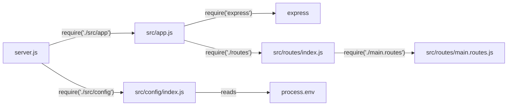

# Technical Specification

# 0. Agent Action Plan

## 0.1 Intent Clarification


### 0.1.1 Core Documentation Objective

Based on the provided requirements, the Blitzy platform understands that the documentation objective is to **enhance and expand the documentation footprint** of a Node.js Express.js tutorial server (`hello_world` v1.0.0) through three coordinated actions:

- **Add JSDoc comments to `server.js` functions** — Enrich the entry-point module with comprehensive JSDoc annotations on all functions, callbacks, imported symbols, and module-level declarations, following established JSDoc 4.x conventions for CommonJS modules
- **Create a comprehensive README** — Transform the existing `README.md` into a fully comprehensive developer resource by enhancing its setup instructions, deepening API documentation with request/response details, and adding a deployment guide section that currently does not exist
- **Add inline code explanations** — Embed clear, contextual inline comments within `server.js` (and supporting source files where necessary) that explain the purpose, behavior, and rationale behind each significant code construct

**Documentation Request Category:** Update existing documentation + Fill documentation gaps

**Documentation Type:** API documentation (JSDoc), User guide (README), Deployment guide (new), Inline code commentary

| Requirement | Enhanced Clarity | Priority |
|---|---|---|
| JSDoc comments for `server.js` functions | Add `@module`, `@type`, `@param`, `@returns`, `@example`, `@callback`, and `@see` tags to all declarations, imports, and the startup callback in `server.js` | High |
| Comprehensive README — Setup instructions | Enhance the existing prerequisites, installation, and configuration sections with additional detail covering environment verification, troubleshooting, and platform-specific guidance | Medium |
| Comprehensive README — API documentation | Expand endpoint documentation with complete request/response schemas, headers, status codes, content-type details, and curl examples for all routes | High |
| Comprehensive README — Deployment guide | Create an entirely new deployment guide section covering production configuration, process management, reverse proxy setup, and containerization concepts | High |
| Inline code explanations | Add contextual inline comments to `server.js` explaining the purpose of each code block, architectural decisions, and CommonJS module patterns | Medium |

### 0.1.2 Special Instructions and Constraints

- No user-provided templates or style guides were specified; the existing codebase conventions (CommonJS, `'use strict'`, JSDoc block comments with `@module`, `@type`, `@route`, and `@returns` tags) serve as the de facto style guide
- The repository already uses consistent JSDoc patterns across `src/app.js`, `src/config/index.js`, `src/routes/index.js`, and `src/routes/main.routes.js` — all new JSDoc annotations must follow these established patterns
- No Figma attachments or external design references were provided
- No specific documentation generator (e.g., MkDocs, Docusaurus) is configured in the repository; JSDoc HTML generation is the only implied tool
- The `'use strict'` directive convention in `server.js` must be preserved in all documentation examples

### 0.1.3 Technical Interpretation

These documentation requirements translate to the following technical documentation strategy:

- To **document `server.js` functions with JSDoc**, we will update `server.js` by adding or enhancing JSDoc block comments on the module header, the `app` import, the `config` import, the `app.listen()` call, and the startup callback arrow function, using `@module`, `@type`, `@callback`, `@param`, `@returns`, `@example`, and `@see` tags consistent with the project's existing JSDoc style
- To **create comprehensive setup instructions**, we will update `README.md` by expanding the Prerequisites, Installation, and Configuration sections with detailed environment verification steps, platform-specific notes, and a comprehensive troubleshooting matrix
- To **add API documentation**, we will update `README.md` by enriching the API Reference section with detailed endpoint specifications, including HTTP method, path, request parameters, response body, status codes, headers, and annotated curl examples for `GET /` and `GET /evening`
- To **create a deployment guide**, we will update `README.md` by adding an entirely new "Deployment" section covering production environment variables, process management with PM2/systemd, reverse proxy configuration patterns, Docker containerization, and health check strategies
- To **add inline code explanations**, we will update `server.js` with clear, concise inline comments explaining the purpose and rationale behind each code section, dependency imports, configuration consumption, and server binding logic

### 0.1.4 Inferred Documentation Needs

Based on repository analysis, the following implicit documentation needs have been identified:

- **Source file JSDoc consistency** — While the user specifically requested JSDoc for `server.js`, the existing files `src/app.js`, `src/config/index.js`, `src/routes/index.js`, and `src/routes/main.routes.js` already contain JSDoc comments that serve as a style reference. Any enhancements to `server.js` should align with these patterns for cross-module consistency
- **README deployment section gap** — The current `README.md` (338 lines) covers Prerequisites, Installation, Usage, API Reference, Project Structure, Environment Variables, Architecture, Dependencies, Scripts, Testing, and Troubleshooting, but contains no deployment guidance — a significant gap for a project designed as a tutorial reference
- **Documentation generator integration** — JSDoc 4.0.5 is available via npx but is not listed as a project dependency. A `jsdoc` npm script and a `jsdoc.json` configuration file would formalize the documentation build pipeline
- **Cross-referencing between README and JSDoc** — The README should reference the JSDoc-generated API documentation, and JSDoc `@see` tags should link back to relevant README sections for navigability


## 0.2 Documentation Discovery and Analysis


### 0.2.1 Existing Documentation Infrastructure Assessment

Repository analysis reveals a **well-established but informal documentation structure** with Markdown-based documentation distributed across multiple directories, and per-file JSDoc annotations in all JavaScript source files. No formal documentation generator configuration exists in the project.

**Documentation Files Discovered:**

| File Path | Type | Lines | Coverage Status |
|---|---|---|---|
| `README.md` | Project README | 338 | Comprehensive — missing deployment guide |
| `src/README.md` | Module README | 25 | Complete — architecture and module relationships |
| `src/config/README.md` | Module README | 35 | Complete — configuration contract and usage |
| `src/routes/README.md` | Module README | 33 | Complete — route documentation and extension guide |
| `tests/README.md` | Test README | 50 | Complete — test categories, commands, coverage |
| `blitzy/documentation/Project Guide.md` | Project guide | N/A | Blitzy-internal operational documentation |
| `blitzy/documentation/Technical Specifications.md` | Tech spec | N/A | Blitzy-internal specification document |

**Documentation Generator Configuration:**

| Tool | Status | Configuration File |
|---|---|---|
| JSDoc | Available via npx (v4.0.5) but not a project dependency | No `jsdoc.json` or `.jsdoc.conf.json` found |
| MkDocs | Not present | No `mkdocs.yml` found |
| Docusaurus | Not present | No `docusaurus.config.js` found |
| Sphinx | Not present | No `conf.py` found |
| Mermaid | Used inline in documentation | No standalone configuration |

**Current JSDoc Coverage by File:**

| Source File | Module-Level JSDoc | Function/Variable JSDoc | Inline Comments |
|---|---|---|---|
| `server.js` | ✅ `@module server` | ✅ `@type` for `app`, `config`; comment for `app.listen()` | Minimal — section headers only |
| `src/app.js` | ✅ `@module src/app` | ⚠️ Inline comment for `app.use()` only | Minimal |
| `src/config/index.js` | ✅ `@module src/config` | ✅ `@type` and `@default` for all properties | Adequate |
| `src/routes/index.js` | ✅ `@module src/routes` | ⚠️ No `@type` for `mainRoutes` import | Minimal |
| `src/routes/main.routes.js` | ✅ `@module src/routes/main.routes` | ✅ `@route` and `@returns` for both handlers | Adequate |

### 0.2.2 Repository Code Analysis for Documentation

**Source files analyzed for documentation targets:**

| Directory | Files Examined | Public APIs Found | Documentation Status |
|---|---|---|---|
| `/` (root) | `server.js` | `app.listen()` callback | Partially documented — needs enhanced JSDoc |
| `src/` | `app.js` | Express app factory, route mounting | Documented — `@module` tag present |
| `src/config/` | `index.js` | `{ host, port, env }` export | Well documented — `@type`, `@default` tags |
| `src/routes/` | `index.js`, `main.routes.js` | Barrel export, 2 GET route handlers | Documented — `@route`, `@returns` tags |
| `tests/` | 4 test files | Test helpers and assertions | Documented — `@fileoverview`, `@typedef`, `@param` |

**Key code patterns identified for documentation:**

- **Factory Pattern** in `src/app.js` — Express app creation without `listen()` binding (Source: `src/app.js:17`)
- **Barrel Pattern** in `src/routes/index.js` — Centralized route exports (Source: `src/routes/index.js:17-19`)
- **Twelve-Factor Configuration** in `src/config/index.js` — Environment-driven config with defaults (Source: `src/config/index.js:20-41`)
- **CommonJS Module System** — All files use `require()`/`module.exports` (Source: `server.js:19`, constraint C-002)

### 0.2.3 Web Search Research Conducted

| Research Topic | Key Findings | Application |
|---|---|---|
| JSDoc best practices for Node.js/Express | Use `@module`, `@type`, `@callback`, `@param`, `@returns`, `@example` tags; organize with `@memberOf` for namespacing; `@typedef` for reusable types | Apply to `server.js` JSDoc enhancement |
| JSDoc for Express route documentation | Use `@route` custom tag or `@name` workaround for documenting Express routes; `@example` tag provides copy-paste request/response snippets | Reference pattern already used in `main.routes.js` |
| JSDoc HTML generation | `jsdoc` CLI (v4.0.5) generates HTML from comments; configure via `jsdoc.json`; templates like `docdash` improve readability | Recommend adding `jsdoc` as devDependency and creating `jsdoc.json` |
| README deployment guide conventions | Include production environment setup, process management (PM2), reverse proxy (nginx), containerization (Docker), and health check endpoints | Structure for new deployment section in README |


## 0.3 Documentation Scope Analysis


### 0.3.1 Code-to-Documentation Mapping

- **Module: `server.js` (Entry Point)**
  - Public APIs: `app.listen()` invocation with callback
  - Imported symbols: `app` (Express Application), `config` (configuration object)
  - Current documentation: Module-level `@module server` JSDoc present; `@type` annotations for `app` and `config`; descriptive comment for server initialization section
  - Documentation needed: Enhanced JSDoc with `@example` tags, `@callback` for startup handler, `@see` cross-references, additional inline code explanations throughout
  - Source: `server.js:1-52`

- **Module: `src/app.js` (Application Factory)**
  - Public APIs: Express application instance export (`module.exports = app`)
  - Current documentation: `@module src/app` header with design pattern description
  - Documentation needed: No changes required per user scope — already adequately documented with module-level JSDoc and inline comments for route mounting
  - Source: `src/app.js:1-28`

- **Module: `src/config/index.js` (Configuration)**
  - Public APIs: `{ host, port, env }` configuration export
  - Current documentation: Complete — `@module src/config`, `@type`, `@default` for all properties
  - Documentation needed: No changes required per user scope — comprehensive JSDoc already in place
  - Source: `src/config/index.js:1-41`

- **Module: `src/routes/main.routes.js` (Route Handlers)**
  - Endpoints: `GET /` returning `"Hello, World!\n"`, `GET /evening` returning `"Good evening"`
  - Current documentation: `@module`, `@route`, and `@returns` tags present for both handlers
  - Documentation needed: No changes required per user scope — route contracts well documented
  - Source: `src/routes/main.routes.js:1-41`

- **Module: `src/routes/index.js` (Route Barrel)**
  - Public APIs: `{ mainRoutes }` barrel export
  - Current documentation: `@module src/routes` header with usage example
  - Documentation needed: No changes required per user scope
  - Source: `src/routes/index.js:1-19`

- **Configuration options requiring documentation:**
  - Config file: `src/config/index.js`
  - Options documented: 3/3 (`host`, `port`, `env`) — all documented with `@type` and `@default`
  - Missing documentation: None within config module; deployment-specific configuration guidance needed in README

- **Features requiring documentation in README:**
  - Feature: Deployment Guide
    - Current coverage: Not present
    - Gaps: Production environment setup, process management, reverse proxy, containerization, health checks
  - Feature: Setup Instructions
    - Current coverage: Basic prerequisites and installation present
    - Gaps: Enhanced platform-specific guidance, environment verification procedures
  - Feature: API Documentation
    - Current coverage: Both endpoints documented with curl examples
    - Gaps: Additional detail on error responses, 404 behavior, and query parameter handling

### 0.3.2 Documentation Gap Analysis

Given the requirements and repository analysis, documentation gaps include:

**Critical Gaps (directly requested by user):**

| Gap | Current State | Target State | Affected File |
|---|---|---|---|
| JSDoc on `server.js` startup callback | Descriptive comment only, no formal `@callback` | Full JSDoc with `@callback`, `@example`, `@see` | `server.js:43-52` |
| JSDoc `@example` tags in `server.js` | No `@example` tags anywhere in file | Usage examples for module import and server start | `server.js` |
| Deployment guide in README | Completely absent | Full section covering production deployment patterns | `README.md` |
| Inline code explanations in `server.js` | Section divider comments only | Contextual inline comments explaining rationale and behavior | `server.js` |

**Secondary Gaps (identified through analysis):**

| Gap | Current State | Recommendation |
|---|---|---|
| JSDoc generator configuration | No `jsdoc.json` exists | Create configuration file to formalize JSDoc HTML generation |
| JSDoc as project dependency | Available via npx only | Add `jsdoc` to `devDependencies` for reproducible builds |
| README 404 error documentation | Brief mention only | Expand error handling section with 404 response details |
| README query parameter documentation | Not mentioned | Document that query parameters are silently ignored on both endpoints |


## 0.4 Documentation Implementation Design


### 0.4.1 Documentation Structure Planning

The documentation changes apply across two dimensions: in-source JSDoc annotations and the project README. No new standalone documentation directories are being created, as the project's documentation model relies on embedded comments and a centralized README.

**Target documentation layout (unchanged directory structure with enhanced content):**

```
hao-backprop-test/
├── README.md                        # UPDATE — Enhanced setup, API docs, new deployment guide
├── server.js                        # UPDATE — Enhanced JSDoc + inline code explanations
├── jsdoc.json                       # CREATE — JSDoc generator configuration
├── src/
│   ├── README.md                    # NO CHANGE — Adequate as-is
│   ├── app.js                       # NO CHANGE — Adequate JSDoc coverage
│   ├── config/
│   │   ├── README.md                # NO CHANGE — Adequate as-is
│   │   └── index.js                 # NO CHANGE — Comprehensive JSDoc already present
│   └── routes/
│       ├── README.md                # NO CHANGE — Adequate as-is
│       ├── index.js                 # NO CHANGE — Adequate JSDoc coverage
│       └── main.routes.js           # NO CHANGE — Adequate JSDoc coverage
└── tests/
    └── README.md                    # NO CHANGE — Adequate as-is
```

### 0.4.2 Content Generation Strategy

**Information Extraction Approach:**

- Extract existing module architecture and dependency flow from `server.js:1-52` to inform JSDoc `@see` cross-references and the README architecture section
- Analyze API response contracts from `src/routes/main.routes.js:26-39` and `tests/integration/endpoints.test.js` to populate the enhanced API documentation in README
- Reference `src/config/index.js:20-41` for environment variable documentation in the deployment guide
- Use `tests/lifecycle/server.test.js` mock patterns to understand server lifecycle behavior for deployment guidance
- Reference `package.json:6-12` scripts section for build and test commands in the deployment section

**Template Application:**

- All JSDoc enhancements in `server.js` follow the existing project convention: `/** ... */` block comments with `@module`, `@type`, `@param`, `@returns`, `@example`, `@callback`, and `@see` tags
- README sections follow the existing Markdown structure: `##` for major sections, `###` for subsections, tables for structured data, fenced code blocks with language identifiers for examples

**Documentation Standards:**

- Markdown formatting with proper header hierarchy (`#` through `####`)
- Code examples using ` ```javascript ` and ` ```bash ` blocks with syntax highlighting
- Tables for parameter descriptions, environment variables, and endpoint specifications
- Consistent terminology aligned with the existing README vocabulary (e.g., "binding address" not "hostname", "environment mode" not "environment type")
- Source citations as inline references to file paths and line numbers

### 0.4.3 Diagram and Visual Strategy

**Mermaid diagrams to create or reference:**

- **Request flow diagram** — Embed within the README API Documentation section to illustrate how HTTP requests traverse the system from client through `server.js` → Express App → Router → Handler and back
- **Server lifecycle state diagram** — Include in the deployment guide to show startup, running, and shutdown states relevant to process management
- **Module dependency diagram** — Include in the README architecture section to show the dependency relationships between `server.js`, `src/app.js`, `src/config/`, and `src/routes/`


```mermaid
flowchart LR
    A[server.js] -->|"require('./src/app')"| B[src/app.js]
    A -->|"require('./src/config')"| C[src/config/index.js]
    B -->|"require('express')"| D[express]
    B -->|"require('./routes')"| E[src/routes/index.js]
    E -->|"require('./main.routes')"| F[src/routes/main.routes.js]
    C -->|reads| G[process.env]
```

**Diagram placement plan:**

| Diagram Type | Target Section | Purpose |
|---|---|---|
| Module dependency flowchart | README — Architecture | Visualize `require()` dependency chain |
| Request processing sequence | README — API Reference | Show HTTP request lifecycle |
| Server state machine | README — Deployment Guide | Illustrate process management states |


## 0.5 Documentation File Transformation Mapping


### 0.5.1 File-by-File Documentation Plan

| Target Documentation File | Transformation | Source Code/Docs | Content/Changes |
|---|---|---|---|
| `server.js` | UPDATE | `server.js` | Add enhanced JSDoc comments to all functions and callbacks; add `@callback`, `@example`, `@see` tags; expand inline code explanations with contextual comments for each code section |
| `README.md` | UPDATE | `README.md`, `src/config/index.js`, `src/routes/main.routes.js`, `tests/integration/endpoints.test.js` | Enhance setup instructions with detailed verification steps; expand API documentation with full request/response specifications and error scenarios; add new Deployment Guide section; add Mermaid diagrams |
| `jsdoc.json` | CREATE | `server.js`, `src/**/*.js` | Create JSDoc generator configuration specifying source inclusion paths, output directory, recursion, and template options |
| `package.json` | UPDATE | `package.json` | Add `jsdoc` devDependency and `docs` / `docs:open` npm scripts for documentation generation |
| `.gitignore` | UPDATE | `.gitignore` | Add `docs/` or `out/` directory to ignore JSDoc-generated HTML output |
| `src/app.js` | REFERENCE | `src/app.js` | Use existing JSDoc style as reference template for `server.js` enhancements |
| `src/config/index.js` | REFERENCE | `src/config/index.js` | Use `@type` and `@default` patterns as style reference; source for deployment environment variable documentation |
| `src/routes/main.routes.js` | REFERENCE | `src/routes/main.routes.js` | Use `@route` and `@returns` patterns as style reference; source for API endpoint documentation in README |
| `tests/integration/endpoints.test.js` | REFERENCE | `tests/integration/endpoints.test.js` | Source for API response contract details (status codes, content types, body formats) |

### 0.5.2 New Documentation Files Detail

```
File: jsdoc.json
Type: JSDoc Generator Configuration
Source Code: server.js, src/**/*.js
Sections:
    - source.include: ["."] — Include project root
    - source.exclude: ["node_modules", "tests", "coverage", "blitzy"] — Exclude non-source dirs
    - source.includePattern: ".+\\.js$" — Match all JS files
    - opts.destination: "./docs" — Output directory
    - opts.recurse: true — Process subdirectories
    - opts.readme: "./README.md" — Include README as landing page
    - tags.allowUnknownTags: true — Support @route custom tag
Key Citations: server.js, src/app.js, src/config/index.js, src/routes/index.js, src/routes/main.routes.js
```

### 0.5.3 Documentation Files to Update Detail

**`server.js` — Add enhanced JSDoc comments and inline code explanations**
- Enhanced annotations:
  - Module-level `@module` block: Add `@requires` tags for `src/app` and `src/config` dependencies
  - `app` constant: Enhance `@type` annotation with `@see` link to `src/app.js`
  - `config` constant: Enhance `@type` annotation with `@see` link to `src/config/index.js`
  - `app.listen()` call: Add formal `@callback` or `@description` documenting the startup callback with `@example` tag showing startup output
- New inline comments:
  - Explain `'use strict'` directive purpose and implications
  - Describe the Factory Pattern separation between app creation and server binding
  - Document the `app.listen(port, host, callback)` argument order and its significance
  - Explain that the callback fires only after successful TCP binding
- Source citations: `server.js:1-52`, `src/app.js:1-28`, `src/config/index.js:20-41`

**`README.md` — Enhance setup, API docs, and add deployment guide**
- Enhanced sections:
  - Prerequisites: Add environment verification checklist with expected outputs
  - Installation: Add post-install verification step (`npm ls` command)
  - API Reference: Expand with 404 error response documentation, query parameter behavior, HTTP method restrictions, and a comprehensive response table
- New sections:
  - Deployment Guide: Production environment variables, PM2 process management, systemd service configuration, reverse proxy with nginx, Docker containerization overview, and health check patterns
- New diagrams:
  - Module dependency flowchart (Mermaid)
  - Request processing sequence diagram (Mermaid)
- Source citations: `src/config/index.js`, `src/routes/main.routes.js`, `tests/integration/endpoints.test.js`, `tests/lifecycle/server.test.js`

**`package.json` — Add documentation scripts and dependency**
- Add to `devDependencies`: `"jsdoc": "^4.0.5"`
- Add to `scripts`:
  - `"docs"`: `"jsdoc -c jsdoc.json"` — Generate JSDoc HTML documentation
  - `"docs:open"`: `"jsdoc -c jsdoc.json && open docs/index.html"` — Generate and open in browser

**`.gitignore` — Add JSDoc output directory exclusion**
- Append `docs/` pattern under an appropriate section header to exclude generated JSDoc HTML output from version control

### 0.5.4 Documentation Configuration Updates

| Configuration File | Change | Purpose |
|---|---|---|
| `jsdoc.json` | CREATE new file | Define JSDoc source paths, output directory, template, and tag configuration |
| `package.json` | ADD `jsdoc` devDependency, ADD `docs` script | Formalize documentation generation as a project script |
| `.gitignore` | APPEND `docs/` pattern | Exclude generated documentation from version control |

### 0.5.5 Cross-Documentation Dependencies

- **JSDoc `@see` tags in `server.js`** must reference valid module paths (`src/app`, `src/config`) that correspond to existing `@module` declarations in those files
- **README Architecture section** references the same module dependency graph documented in JSDoc `@requires` tags in `server.js`
- **README API Reference** must remain synchronized with route handler response strings defined in `src/routes/main.routes.js:27` (`"Hello, World!\n"`) and `src/routes/main.routes.js:38` (`"Good evening"`)
- **README Deployment Guide** references environment variable names (`HOST`, `PORT`, `NODE_ENV`) documented in `src/config/index.js:26-40`
- **`jsdoc.json` source paths** must align with the project's actual directory structure and `.gitignore` exclusion patterns
- **Navigation links**: README should reference JSDoc-generated docs; JSDoc output uses README as its landing page via `opts.readme`


## 0.6 Dependency Inventory


### 0.6.1 Documentation Dependencies

| Registry | Package Name | Version | Purpose |
|---|---|---|---|
| npm | jsdoc | ^4.0.5 | JSDoc HTML documentation generator — parses JSDoc comment blocks and produces navigable HTML output |
| npm | express | ^5.1.0 | Runtime dependency (existing) — Express.js type definitions referenced in JSDoc `@type` annotations via `import('express')` syntax |
| npm | jest | ^30.2.0 | Dev dependency (existing) — Test framework whose test files serve as documentation source material for API response contracts |
| npm | supertest | ^7.1.4 | Dev dependency (existing) — HTTP assertion library whose usage patterns inform API documentation examples |

**Version Verification:**

- `jsdoc@4.0.5` — Verified available via `npx jsdoc --version` in the project environment; compatible with Node.js 20.20.0
- `express@5.1.0` — Resolved and installed per `package-lock.json` (lockfileVersion 3)
- `jest@30.2.0` — Resolved and installed per `package-lock.json`
- `supertest@7.1.4` — Resolved and installed per `package-lock.json`

### 0.6.2 Documentation Reference Updates

**Documentation files requiring internal link updates:**

- `README.md` — Add a reference link to JSDoc-generated documentation (`docs/index.html`) in the project overview section
- `server.js` — Add `@see` JSDoc tags linking to `src/app.js` and `src/config/index.js` modules

**Link transformation rules:**

| Context | Link Format | Target |
|---|---|---|
| JSDoc cross-reference | `@see module:src/app` | Links to `src/app.js` JSDoc module documentation |
| JSDoc cross-reference | `@see module:src/config` | Links to `src/config/index.js` JSDoc module documentation |
| README reference | `[API Documentation](docs/index.html)` | Links to generated JSDoc HTML output |
| README internal | `[Deployment Guide](#deployment)` | Anchor link to new deployment section within README |


## 0.7 Coverage and Quality Targets


### 0.7.1 Documentation Coverage Metrics

**Current coverage analysis:**

| Coverage Dimension | Current | Target | Gap |
|---|---|---|---|
| Source files with module-level JSDoc | 5/5 (100%) | 5/5 (100%) | None |
| Source files with function-level JSDoc | 3/5 (60%) | 5/5 (100%) | `server.js` callback, `src/app.js` factory |
| Source files with `@example` tags | 0/5 (0%) | 1/5 (20%) | `server.js` — primary target |
| README sections with complete content | 11/12 (92%) | 12/12 (100%) | Deployment Guide section missing |
| API endpoints documented in README | 2/2 (100%) | 2/2 (100%) | Enhancement needed for error responses |
| Environment variables documented | 3/3 (100%) | 3/3 (100%) | Deployment-specific guidance needed |
| Configuration options documented | 3/3 (100%) | 3/3 (100%) | None |

**Target coverage by file:**

| File | Current JSDoc Coverage | Target Coverage | Focus Areas |
|---|---|---|---|
| `server.js` | 70% — module + types documented, callback lacks formal JSDoc | 100% — all symbols with full JSDoc | `@callback`, `@example`, `@see`, `@requires`, inline explanations |
| `README.md` | 92% — all sections present except deployment | 100% — all sections complete with deployment guide | New deployment section, enhanced API error docs |
| `jsdoc.json` | N/A — does not exist | 100% — complete configuration | Source paths, output, template, tag settings |

### 0.7.2 Documentation Quality Criteria

**Completeness requirements:**
- All JSDoc blocks in `server.js` include description, type annotations, and at least one `@see` or `@example` tag where applicable
- The README deployment guide includes at minimum: production environment configuration, process management, and basic containerization guidance
- All API endpoints documented with HTTP method, path, response status, content-type, body format, and at least one curl example
- Error responses (404 for undefined routes, 404 for unsupported methods) documented in the API Reference section

**Accuracy validation:**
- All JSDoc `@type` annotations match the actual runtime types (verified against source code)
- All curl examples in the README produce the exact responses documented (verified against `tests/integration/endpoints.test.js` assertions)
- All environment variable names, defaults, and types match `src/config/index.js:20-41`
- All `@see` cross-references resolve to valid `@module` declarations in target files

**Clarity standards:**
- Technical accuracy with accessible language suitable for tutorial learners
- Progressive disclosure: basic usage before advanced deployment scenarios
- Consistent terminology throughout — using the same variable names, path formats, and technical terms as the existing documentation
- Every JSDoc block should be understandable without reading the implementation

**Maintainability:**
- Source citations included in JSDoc blocks via `@see` tags for traceability
- README sections structured with clear headings for easy navigation and updates
- JSDoc configuration in `jsdoc.json` enables automated documentation regeneration

### 0.7.3 Example and Diagram Requirements

| Requirement | Minimum Count | Target File |
|---|---|---|
| `@example` tags in `server.js` | 1 (module usage example) | `server.js` |
| curl examples in README API Reference | 4 (2 success + 2 error) | `README.md` |
| Deployment command examples in README | 3 (PM2, systemd, Docker) | `README.md` |
| Mermaid diagrams in README | 2 (dependency flow + request sequence) | `README.md` |
| Inline code explanation comments in `server.js` | 5+ contextual comments | `server.js` |


## 0.8 Scope Boundaries


### 0.8.1 Exhaustively In Scope

**Documentation file updates (JSDoc and inline comments):**
- `server.js` — Enhanced JSDoc comments on all functions, callbacks, and imports; expanded inline code explanations with contextual comments

**Documentation file updates (README):**
- `README.md` — Enhanced setup instructions, expanded API documentation with error responses, new Deployment Guide section, additional Mermaid diagrams

**New documentation files:**
- `jsdoc.json` — JSDoc generator configuration for automated HTML documentation generation

**Documentation-adjacent configuration updates:**
- `package.json` — Add `jsdoc` devDependency (`^4.0.5`) and `docs`/`docs:open` npm scripts
- `.gitignore` — Add `docs/` output directory exclusion

**Documentation assets:**
- Mermaid diagrams embedded within `README.md` (module dependency flowchart, request processing sequence)
- Inline JSDoc `@example` code snippets within `server.js`

**Documentation generation:**
- `jsdoc.json` configuration enabling `npx jsdoc -c jsdoc.json` or `npm run docs` command
- JSDoc HTML output to `docs/` directory (excluded from version control via `.gitignore`)

### 0.8.2 Explicitly Out of Scope

| Exclusion | Rationale |
|---|---|
| Source code logic modifications to `server.js` | User requested documentation only — no functional changes to the server binding, routing, or configuration logic |
| Source code modifications to `src/app.js`, `src/config/index.js`, `src/routes/*.js` | User scope is limited to `server.js` JSDoc and README — other source files are reference-only |
| Test file modifications (`tests/**/*.test.js`) | Test suites serve as documentation source material only — no test changes requested |
| New feature additions or endpoint implementations | Documentation-only scope — no new HTTP endpoints or middleware |
| Deployment infrastructure (CI/CD pipelines, Docker files, nginx configs) | README deployment guide provides guidance and examples only — no actual deployment configuration files are created |
| Security enhancements (HTTPS, authentication, rate limiting) | Out of scope — the deployment guide may reference these as future considerations only |
| Documentation for `blitzy/documentation/` internal files | Blitzy-internal documentation is separate from the project's public documentation |
| Module README updates (`src/README.md`, `src/config/README.md`, `src/routes/README.md`, `tests/README.md`) | Already adequate — no changes requested by user |
| Third-party documentation tool integration (Swagger, Docusaurus, MkDocs) | JSDoc is the established pattern — no tool migration requested |


## 0.9 Execution Parameters


### 0.9.1 Documentation-Specific Instructions

| Parameter | Value |
|---|---|
| **Documentation build command** | `npx jsdoc -c jsdoc.json` (or `npm run docs` after `package.json` update) |
| **Documentation preview command** | `open docs/index.html` (macOS) / `xdg-open docs/index.html` (Linux) |
| **Documentation validation** | Verify JSDoc parses without errors: `npx jsdoc -c jsdoc.json 2>&1` (exit code 0 = success) |
| **Test suite verification** | `CI=true npx jest --ci --coverage --watchAll=false` — Confirm no tests broken by documentation-only changes |
| **Default format** | Markdown with Mermaid diagrams for README; JSDoc block comments for source code |
| **Citation requirement** | Every JSDoc enhancement must reference source file paths via `@see` tags; README sections must cite source modules inline |
| **Style guide** | Follow existing project conventions: CommonJS `require()`/`module.exports`, `'use strict'`, JSDoc tags (`@module`, `@type`, `@param`, `@returns`, `@example`, `@route`, `@see`) |
| **JSDoc tag conventions** | Use `@module` for file-level identity, `@type` with `import()` syntax for Express types, `@callback` for named callback functions, `@example` for usage snippets, `@see` for cross-references |


## 0.10 Rules for Documentation


### 0.10.1 Documentation-Specific Rules

The following rules govern all documentation changes in this implementation:

- **Follow existing JSDoc style** — All new JSDoc annotations in `server.js` must follow the established patterns observed across the codebase: multi-line `/** ... */` block comments, `@module` for file-level identity, `@type` with `import('express')` syntax for framework types, `@route` with HTTP method and path for route handlers, and `@returns` with type and description
- **Preserve existing documentation integrity** — No existing JSDoc comments or inline comments in `server.js` or any other file should be removed or semantically altered; only additions and enhancements are permitted
- **Maintain CommonJS module conventions** — All documentation examples must use `require()`/`module.exports` syntax consistent with constraint C-002; no ES module (`import`/`export`) syntax in any example code
- **Ensure `'use strict'` compliance** — All code examples in JSDoc `@example` tags and README code blocks must include the `'use strict'` directive where showing module-level code
- **Documentation-only changes** — No functional code modifications are permitted; all changes must be limited to comments (JSDoc and inline), Markdown content, configuration files, and dependency declarations
- **Accurate response contracts** — All API documentation must reflect the exact response bodies: `"Hello, World!\n"` (14 characters with trailing newline) for `GET /` and `"Good evening"` (12 characters, no trailing newline) for `GET /evening`, as verified by integration tests
- **Environment variable accuracy** — All environment variable documentation must match the exact names (`HOST`, `PORT`, `NODE_ENV`), types, and default values defined in `src/config/index.js:20-41`
- **Cross-reference consistency** — Every `@see` tag in JSDoc must resolve to a valid `@module` declaration in the referenced file; every internal README link must resolve to a valid heading anchor


## 0.11 References


### 0.11.1 Repository Files and Folders Searched

**Source files analyzed (full content retrieved and reviewed):**

| File Path | Purpose in Analysis |
|---|---|
| `server.js` | Primary documentation target — analyzed current JSDoc coverage, inline comments, and function structure |
| `src/app.js` | Reference file — analyzed JSDoc style patterns for consistency; Factory Pattern documentation |
| `src/config/index.js` | Reference file — analyzed `@type`/`@default` JSDoc patterns; environment variable source |
| `src/routes/index.js` | Reference file — analyzed Barrel Pattern JSDoc style |
| `src/routes/main.routes.js` | Reference file — analyzed `@route`/`@returns` JSDoc patterns; API response contracts |
| `package.json` | Dependency versions, scripts, project metadata |
| `package-lock.json` | Resolved dependency versions (lockfileVersion 3) |
| `jest.config.js` | Test configuration, coverage thresholds, test patterns |
| `.gitignore` | Current exclusion patterns for documentation output planning |
| `README.md` | Current documentation baseline — 338 lines, 12 sections |
| `src/README.md` | Module-level documentation for `src/` directory |
| `src/config/README.md` | Configuration module documentation |
| `src/routes/README.md` | Routes module documentation |
| `tests/README.md` | Test suite documentation, coverage requirements |
| `tests/unit/config.test.js` | Configuration edge case tests — informs config documentation |
| `tests/unit/routes.test.js` | Route registration tests — informs routing documentation |
| `tests/integration/endpoints.test.js` | API contract tests — informs API documentation accuracy |
| `tests/lifecycle/server.test.js` | Server lifecycle tests — informs deployment documentation |

**Folders explored:**

| Folder Path | Depth | Purpose |
|---|---|---|
| `/` (root) | Level 0 | Initial repository structure assessment |
| `src/` | Level 1 | Application source module discovery |
| `src/config/` | Level 2 | Configuration module analysis |
| `src/routes/` | Level 2 | Routing module analysis |
| `tests/` | Level 1 | Test suite structure discovery |
| `blitzy/` | Level 1 | Internal documentation assessment |

**Tech spec sections retrieved:**

| Section Heading | Purpose |
|---|---|
| 1.1 Executive Summary | Project context, requirements REQ-001/REQ-002, stakeholders |
| 3.1 Programming Languages | Language selection, Node.js runtime versions, module system |
| Node.js Runtime Versions | Version matrix: minimum ≥18.x, recommended 20.19.x LTS, tested 20.20.0 |
| 3.3 Open Source Dependencies | Dependency inventory: express 5.1.0, jest 30.2.0, supertest 7.1.4 |
| 5.2 Component Details | Detailed component architecture, interfaces, and interaction diagrams |

### 0.11.2 External Research Conducted

| Search Query | Key Finding Applied |
|---|---|
| "JSDoc best practices Node.js Express 2025" | JSDoc tag conventions (`@module`, `@callback`, `@example`, `@see`), `@typedef` for reusable types, JSDoc HTML generation with `jsdoc` CLI |

### 0.11.3 Attachments and External Resources

- No file attachments were provided by the user
- No Figma screens or URLs were provided
- No external API specifications or design documents were referenced


