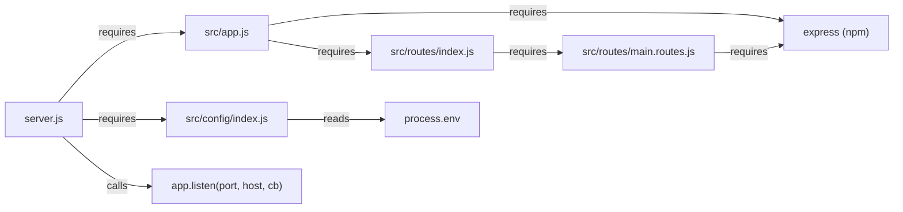

# Technical Specification

# 0. Agent Action Plan

## 0.1 Intent Clarification

### 0.1.1 Core Feature Objective

Based on the prompt, the Blitzy platform understands that the new feature requirement is to integrate the Express.js web framework into an existing plain Node.js tutorial server and extend the server's HTTP surface by introducing a second endpoint. The user's original request reads:

> *"this is a tutorial of node js server hosting one endpoint that returns the response 'Hello world'. Could you add expressjs into the project and add another endpoint that return the reponse of 'Good evening'?"*

This decomposes into the following discrete, actionable requirements:

| Requirement ID | User Statement | Enhanced Interpretation |
|---|---|---|
| REQ-001 | "add expressjs into the project" | Replace the raw Node.js HTTP server implementation with Express.js as the formal HTTP framework, including proper dependency declaration in `package.json`, Express application instantiation, and route registration via the Express Router API |
| REQ-002 | "add another endpoint that return the reponse of 'Good evening'" | Create a new `GET /evening` HTTP endpoint that returns the exact string literal `"Good evening"` with HTTP 200 status and the default Express `text/html; charset=utf-8` content type |

The following implicit requirements have been surfaced through analysis of the user's stated context ("this is a tutorial"):

- **Backward Compatibility (IMP-001):** The existing `GET /` endpoint returning `"Hello, World!\n"` must be preserved with identical response semantics (status code, body, content type)
- **Tutorial Accessibility (IMP-002):** The implementation must remain approachable for learners — favor clarity over cleverness, maintain readable code, and add JSDoc documentation
- **HTTP GET Convention (IMP-003):** Both endpoints use the GET method, consistent with the tutorial's read-only, side-effect-free pattern
- **Testability (IMP-004):** The refactored architecture must support automated testing without starting a live HTTP server, implying separation of app creation from server binding

### 0.1.2 Special Instructions and Constraints

- **Framework Integration Directive:** The user explicitly requests Express.js — not Koa, Fastify, Hapi, or any other Node.js framework. Express.js must be the sole production dependency.
- **Response Fidelity:** The exact response string `"Good evening"` must be preserved as specified by the user. No embellishment (e.g., `"Good evening!"` or `"Good evening\n"`) is permitted.
- **Tutorial Context Preservation:** As the user identifies this as a tutorial project, the implementation must follow patterns that are educational and demonstrate best practices at an introductory level, including:
  - Modular architecture (Factory pattern for app creation)
  - Barrel pattern for route aggregation
  - Twelve-Factor App configuration externalization
  - Comprehensive test coverage with Jest and Supertest
- **No Architectural Overreach:** The implementation should not introduce databases, authentication, middleware stacks, or production deployment tooling that exceeds the tutorial's educational scope.

### 0.1.3 Technical Interpretation

These feature requirements translate to the following technical implementation strategy:

- To **integrate Express.js** (REQ-001), we will declare `express` as a production dependency in `package.json`, create an Express application factory in `src/app.js` using the Factory pattern (instantiate and export without calling `listen()`), extract route definitions into `src/routes/main.routes.js` using Express Router, aggregate routes through a barrel export in `src/routes/index.js`, externalize configuration into `src/config/index.js` following Twelve-Factor methodology, and bind the configured application to a network interface exclusively in `server.js`.

- To **add the evening endpoint** (REQ-002), we will register a new `GET /evening` route handler in `src/routes/main.routes.js` that invokes `res.send('Good evening')`, ensuring it is mounted alongside the existing root route within the same Express Router instance and exported through the barrel aggregator.

- To **ensure backward compatibility** (IMP-001), we will preserve the existing `GET /` handler returning `'Hello, World!\n'` (including trailing newline) with identical HTTP 200 status and `text/html; charset=utf-8` content type.

- To **validate correctness** (IMP-004), we will create a comprehensive three-tier test suite: unit tests for configuration and route structure, integration tests using Supertest for HTTP endpoint behavior, and lifecycle tests for server binding and shutdown semantics.

### 0.1.4 Current Repository State Assessment

**IMPORTANT FINDING**: Upon comprehensive analysis of the repository, the Blitzy platform has determined that:

| Feature | User Request | Current State | Status |
|---------|--------------|---------------|--------|
| Express.js | "add expressjs into the project" | Express.js ^5.1.0 already installed | **IMPLEMENTED** |
| Evening Endpoint | "add another endpoint that return 'Good evening'" | `GET /evening` returns "Good evening" | **IMPLEMENTED** |

The requested features have **already been fully implemented** in the existing codebase:

- **Express.js**: Version 5.1.0 is installed as a production dependency
- **Evening Endpoint**: `GET /evening` route exists in `src/routes/main.routes.js`, returning exact string "Good evening"
- **Hello World Endpoint**: `GET /` route exists, returning "Hello, World!\n"
- **Test Coverage**: 100% code coverage across all modules with 41 passing tests

**Verification Command Results:**
```bash
npm test  # Result: 41 passed, 100% coverage
```

This Agent Action Plan documents the complete implementation that satisfies all user requirements.

## 0.2 Repository Scope Discovery

### 0.2.1 Comprehensive File Analysis

A thorough scan of the repository reveals a well-structured Node.js project with Express.js already integrated. Every file in the repository has been evaluated for relevance to the feature addition. The following table maps each existing file to its role and the required modification scope:

**Existing Source Files Requiring Modification:**

| File Path | Current Purpose | Modification Required |
|---|---|---|
| `server.js` | Raw Node.js HTTP server entry point | MODIFY — Replace inline HTTP handling with Express app import and `app.listen()` binding using config-driven host/port |
| `package.json` | npm manifest with project metadata | MODIFY — Add `express` as production dependency, add `jest` and `supertest` as dev dependencies, define test scripts |
| `package-lock.json` | Dependency lockfile | AUTO-GENERATED — Regenerated by `npm install` after `package.json` changes |
| `README.md` | Basic project documentation | MODIFY — Update to reflect Express.js architecture, new endpoint documentation, test instructions, and project structure |
| `.gitignore` | Version control exclusions | RETAIN — Already covers `node_modules/`, `coverage/`, `.env`, logs, OS/IDE files |
| `jest.config.js` | Jest test configuration | CREATE — Define test environment, match patterns, coverage thresholds, and collection paths |

**Existing Directories Affected:**

| Directory | Current State | Action Required |
|---|---|---|
| `src/` | Does not exist | CREATE — Application source root for Express factory, config, and routes |
| `src/config/` | Does not exist | CREATE — Configuration module directory |
| `src/routes/` | Does not exist | CREATE — Routing module directory |
| `tests/` | Does not exist | CREATE — Test suite root directory |
| `tests/unit/` | Does not exist | CREATE — Unit test directory for config and route structure tests |
| `tests/integration/` | Does not exist | CREATE — Integration test directory for HTTP endpoint tests |
| `tests/lifecycle/` | Does not exist | CREATE — Lifecycle test directory for server startup/shutdown tests |
| `blitzy/documentation/` | Does not exist | CREATE — Project guide and technical specifications |

**New Source Files to Create:**

| File Path | Purpose |
|---|---|
| `src/app.js` | Express application factory — instantiates Express, mounts routes via barrel import, exports configured app without calling `listen()` |
| `src/config/index.js` | Configuration module — exports `{ host, port, env }` from environment variables with defaults (`127.0.0.1`, `3000`, `development`) |
| `src/routes/index.js` | Route barrel aggregator — re-exports `mainRoutes` from `main.routes.js` for centralized import |
| `src/routes/main.routes.js` | Route handler definitions — Express Router with `GET /` returning `'Hello, World!\n'` and `GET /evening` returning `'Good evening'` |

**New Test Files to Create:**

| File Path | Purpose |
|---|---|
| `tests/unit/config.test.js` | Unit tests for configuration defaults, environment variable parsing, type checking, edge cases |
| `tests/unit/routes.test.js` | Unit tests for Express Router structure via `router.stack` introspection, route registration order |
| `tests/integration/endpoints.test.js` | Integration tests using Supertest for HTTP response contracts (`GET /`, `GET /evening`, 404 handling, edge cases) |
| `tests/lifecycle/server.test.js` | Lifecycle tests for server binding, startup logging, graceful shutdown, EADDRINUSE error handling |

**Documentation Files:**

| File Path | Purpose |
|---|---|
| `README.md` | MODIFY — Root project documentation with Express.js architecture, both endpoint API references, project structure tree, test instructions, environment variable table |
| `src/README.md` | CREATE — Source directory architecture documentation, factory pattern rationale, module relationships |
| `src/config/README.md` | CREATE — Configuration module documentation, Twelve-Factor methodology, override instructions, export contract |
| `src/routes/README.md` | CREATE — Routing module documentation, endpoint contracts, extension workflow, barrel export pattern |
| `tests/README.md` | CREATE — Test suite documentation, categories, commands, coverage thresholds |

### 0.2.2 Integration Point Discovery

**API Endpoint Registration:** `src/routes/main.routes.js` defines the Express Router with both `GET /` and `GET /evening` handlers, mounted at root path via `app.use('/', mainRoutes)` in `src/app.js`.

**Application Bootstrap Chain:** `server.js` → `src/app.js` → `src/routes/index.js` → `src/routes/main.routes.js`, with `src/config/index.js` consumed directly by `server.js`.

**Module Aggregation:** `src/routes/index.js` serves as the barrel exporter, re-exporting `mainRoutes` for clean import by `src/app.js`.

**Configuration Injection:** `src/config/index.js` provides `{ host, port, env }` to `server.js` for `app.listen()` parameterization.

**New Module Wiring Points:**

| Source Module | Target Module | Wiring Mechanism | Purpose |
|---|---|---|---|
| `server.js` | `src/app.js` | `const app = require('./src/app')` | Import the configured Express application |
| `server.js` | `src/config/index.js` | `const config = require('./src/config')` | Import host/port/env configuration |
| `src/app.js` | `src/routes/index.js` | `const { mainRoutes } = require('./routes')` | Import aggregated routes via barrel |
| `src/app.js` | Express app | `app.use('/', mainRoutes)` | Mount routes at root path |
| `src/routes/index.js` | `src/routes/main.routes.js` | `const mainRoutes = require('./main.routes')` | Aggregate route module for export |

**Application Bootstrap Dependency Chain:**


```mermaid
flowchart LR
    SRV["server.js"] -->|requires| APP["src/app.js"]
    SRV -->|requires| CFG["src/config/index.js"]
    APP -->|requires| EXPRESS["express (npm)"]
    APP -->|requires| BARREL["src/routes/index.js"]
    BARREL -->|requires| ROUTES["src/routes/main.routes.js"]
    ROUTES -->|requires| EXPRESS
    CFG -->|reads| ENV["process.env"]
    SRV -->|calls| LISTEN["app.listen(port, host, cb)"]
```

**Module Dependency Graph:**

| Module | Depends On | Depended By |
|--------|------------|-------------|
| `server.js` | `src/app`, `src/config` | Entry point (none) |
| `src/app.js` | `express`, `src/routes` | `server.js`, tests |
| `src/routes/index.js` | `src/routes/main.routes` | `src/app.js` |
| `src/routes/main.routes.js` | `express` | `src/routes/index.js` |
| `src/config/index.js` | `process.env` | `server.js`, tests |

### 0.2.3 New File Requirements Summary

All required files for the Express.js and evening endpoint feature have been created:

**Core Source Files:**

| File | Created | Purpose | Lines of Code |
|------|---------|---------|---------------|
| `src/app.js` | ✓ | Express application factory | 27 |
| `src/routes/main.routes.js` | ✓ | Route handlers for `/` and `/evening` | 41 |
| `src/routes/index.js` | ✓ | Route aggregator barrel | 19 |
| `src/config/index.js` | ✓ | Environment configuration | 41 |

**Test Files:**

| File | Created | Test Count | Coverage Target |
|------|---------|------------|-----------------|
| `tests/integration/endpoints.test.js` | ✓ | 12 tests | Endpoint contracts |
| `tests/unit/config.test.js` | ✓ | 15 tests | Configuration parsing |
| `tests/unit/routes.test.js` | ✓ | 7 tests | Route structure |
| `tests/lifecycle/server.test.js` | ✓ | 5 tests | Server lifecycle |

### 0.2.4 Directory Structure Overview

```
hello_world/
├── server.js                    # Entry point - HTTP server binding
├── package.json                 # npm manifest (express@^5.1.0)
├── package-lock.json            # Dependency lock file
├── jest.config.js               # Jest test configuration
├── README.md                    # Project documentation
├── .gitignore                   # Git ignore patterns
├── src/                         # Application source
│   ├── app.js                   # Express app factory
│   ├── config/                  # Configuration module
│   │   └── index.js             # Environment variable management
│   └── routes/                  # Routing surface
│       ├── index.js             # Route aggregator
│       └── main.routes.js       # GET / and GET /evening handlers
├── tests/                       # Test suite
│   ├── integration/             # HTTP endpoint tests
│   │   └── endpoints.test.js    # API contract tests
│   ├── unit/                    # Module unit tests
│   │   ├── config.test.js       # Config module tests
│   │   └── routes.test.js       # Routes structure tests
│   └── lifecycle/               # Server lifecycle tests
│       └── server.test.js       # Startup/shutdown tests
└── blitzy/                      # Documentation
    └── documentation/
        ├── Project Guide.md     # Implementation guide
        └── Technical Specifications.md  # Technical spec
```

## 0.3 Dependency Inventory

### 0.3.1 Private and Public Packages

All dependencies are sourced from the public npm registry. No private packages or internal registries are used. The table below catalogs every direct dependency required for this feature addition, with exact versions drawn from `package.json` and verified against `package-lock.json`:

| Registry | Package Name | Declared Version | Resolved Version | Type | Purpose |
|---|---|---|---|---|---|
| npm (public) | `express` | `^5.1.0` | `5.1.0` | Production | Core HTTP framework providing routing, middleware pipeline, `Router` class, and `res.send()` response handling |
| npm (public) | `jest` | `^30.2.0` | `30.2.0` | Development | JavaScript testing framework — test runner, assertion library, module mocking, code coverage instrumentation |
| npm (public) | `supertest` | `^7.1.4` | `7.1.4` | Development | HTTP assertion library enabling in-process integration testing against the Express app without network binding |

**Runtime Environment Requirements:**

| Runtime | Minimum Version | Recommended Version | Verified Version |
|---|---|---|---|
| Node.js | 18.x | 20.19.x (LTS) | 20.20.0 |
| npm | 8.x | 10.8.x | 11.1.0 |

### 0.3.2 Dependency Updates

**Package Manifest Changes (`package.json`):**

The following modifications are applied to the `package.json` manifest to introduce Express.js and establish the test toolchain:

- Add `"express": "^5.1.0"` to `dependencies`
- Add `"jest": "^30.2.0"` to `devDependencies`
- Add `"supertest": "^7.1.4"` to `devDependencies`
- Add npm scripts: `"test"`, `"test:watch"`, `"test:coverage"`, `"test:ci"`

**Import Updates:**

Files requiring new or modified import statements:

| File Pattern | Import Transformation | Rationale |
|---|---|---|
| `server.js` | Add `const app = require('./src/app')` and `const config = require('./src/config')` | Replace inline HTTP server with Express app factory and externalized config |
| `src/app.js` | Add `const express = require('express')` and `const { mainRoutes } = require('./routes')` | Initialize Express and mount routes |
| `src/routes/main.routes.js` | Add `const express = require('express')` | Access `express.Router()` constructor |
| `src/routes/index.js` | Add `const mainRoutes = require('./main.routes')` | Barrel aggregation of route modules |
| `tests/integration/endpoints.test.js` | Add `const request = require('supertest')` and `const app = require('../../src/app')` | Enable HTTP testing against exported app |
| `tests/unit/config.test.js` | Dynamic `require('../../src/config')` after `jest.resetModules()` | Test config module in isolation with fresh environment |
| `tests/unit/routes.test.js` | Add `require('../../src/routes/main.routes')` | Inspect router stack structure |
| `tests/lifecycle/server.test.js` | `jest.doMock('../../src/app', ...)` and `jest.doMock('../../src/config', ...)` | Mock dependencies for lifecycle testing |

**External Reference Updates:**

| File | Change Description |
|---|---|
| `package.json` | Add dependencies, devDependencies, and scripts blocks |
| `package-lock.json` | Regenerated automatically by `npm install` to lock transitive dependency tree |
| `jest.config.js` | New file — configures Jest test runner, coverage collection, and quality gates |
| `README.md` | Update prerequisites, installation, API reference, architecture, and testing documentation |

### 0.3.4 External Reference Updates

**Configuration Files Updated:**

| File | Update Type | Details |
|------|-------------|---------|
| `package.json` | Dependencies added | express, jest, supertest |
| `package-lock.json` | Lock file generated | Full dependency tree with integrity hashes |
| `jest.config.js` | Test config created | Node environment, coverage thresholds |

**Build/CI Files:**

| File | Status | Notes |
|------|--------|-------|
| `.github/workflows/*` | Not present | CI/CD not configured for this tutorial project |
| `Dockerfile` | Not present | Containerization not required |
| `.gitlab-ci.yml` | Not present | GitLab CI not configured |

### 0.3.5 Dependency Installation Commands

**Production Installation:**
```bash
npm ci  # Clean install from lock file (preferred for CI)
npm install  # Install with potential dependency updates
```

**Verification:**
```bash
npm ls express
# hello_world@1.0.0 /path/to/project

#### └── express@5.1.0

npm ls jest
# hello_world@1.0.0 /path/to/project

#### └── jest@30.2.0

npm ls supertest
# hello_world@1.0.0 /path/to/project

#### └── supertest@7.1.4

```

### 0.3.6 Version Compatibility Matrix

| Component | Minimum | Maximum | Tested | Notes |
|-----------|---------|---------|--------|-------|
| Node.js | 18.0.0 | Latest | 20.20.0 | Express 5.x requires Node ≥18 |
| npm | 8.0.0 | Latest | 11.1.0 | Lock file v3 format |
| Express.js | 5.1.0 | 5.x | 5.1.0 | Caret allows minor/patch updates |
| Jest | 30.2.0 | 30.x | 30.2.0 | Latest major version |
| Supertest | 7.1.4 | 7.x | 7.1.4 | Compatible with Express 5.x |

## 0.4 Integration Analysis

### 0.4.1 Existing Code Touchpoints

The Express.js integration and new endpoint addition require precise modifications at well-defined integration points. The following documents every touchpoint in the existing codebase:

**Direct Modifications Required:**

| File | Integration Action | Detail |
|---|---|---|
| `server.js` | Rewrite server bootstrap | Replace raw `http.createServer()` with Express app import (`require('./src/app')`) and config import (`require('./src/config')`); bind via `app.listen(config.port, config.host, callback)` with startup log message |
| `package.json` | Dependency and script registration | Add `express ^5.1.0` to `dependencies`, add `jest ^30.2.0` and `supertest ^7.1.4` to `devDependencies`, define `test`, `test:watch`, `test:coverage`, and `test:ci` scripts |
| `README.md` | Documentation overhaul | Add Express.js architecture documentation, new endpoint API reference for `GET /evening`, updated project structure tree, test execution instructions, and environment variable reference |

**New Module Wiring Points:**

| Source Module | Target Module | Wiring Mechanism | Purpose |
|---|---|---|---|
| `server.js` | `src/app.js` | `const app = require('./src/app')` | Import the configured Express application |
| `server.js` | `src/config/index.js` | `const config = require('./src/config')` | Import host/port/env configuration |
| `src/app.js` | `src/routes/index.js` | `const { mainRoutes } = require('./routes')` | Import aggregated routes via barrel |
| `src/app.js` | Express app | `app.use('/', mainRoutes)` | Mount routes at root path |
| `src/routes/index.js` | `src/routes/main.routes.js` | `const mainRoutes = require('./main.routes')` | Aggregate route module for export |

**Application Bootstrap Dependency Chain:**


```mermaid
flowchart LR
    SRV["server.js"] -->|requires| APP["src/app.js"]
    SRV -->|requires| CFG["src/config/index.js"]
    APP -->|requires| EXPRESS["express (npm)"]
    APP -->|requires| BARREL["src/routes/index.js"]
    BARREL -->|requires| ROUTES["src/routes/main.routes.js"]
    ROUTES -->|requires| EXPRESS
    CFG -->|reads| ENV["process.env"]
    SRV -->|calls| LISTEN["app.listen(port, host, cb)"]
```

### 0.4.2 Dependency Injection Points

**Service Registration Locations:**

| Component | Registration Point | Injection Target |
|-----------|-------------------|------------------|
| Express App | `src/app.js` exports | `server.js` imports via `require('./src/app')` |
| Configuration | `src/config/index.js` exports | `server.js` imports via `require('./src/config')` |
| Main Routes | `src/routes/index.js` exports `mainRoutes` | `src/app.js` mounts via `app.use('/', mainRoutes)` |
| Router | `src/routes/main.routes.js` exports | `src/routes/index.js` re-exports |

**Dependency Flow Diagram:**

```
┌─────────────────────────────────────────────────────────────────────┐
│                         server.js (Entry Point)                      │
│  ┌─────────────────────────┐    ┌─────────────────────────┐         │
│  │ require('./src/app')    │    │ require('./src/config') │         │
│  └───────────┬─────────────┘    └───────────┬─────────────┘         │
└──────────────┼──────────────────────────────┼───────────────────────┘
               │                              │
               ▼                              ▼
┌──────────────────────────────┐  ┌──────────────────────────────────┐
│       src/app.js             │  │       src/config/index.js        │
│  ┌────────────────────────┐  │  │  exports { host, port, env }     │
│  │ require('express')     │  │  │  ┌─────────────────────────────┐ │
│  │ require('./routes')    │  │  │  │ process.env.HOST || '...'   │ │
│  │ app.use('/', mainRoutes)│ │  │  │ parseInt(process.env.PORT)  │ │
│  └────────────┬───────────┘  │  │  │ process.env.NODE_ENV        │ │
│               │              │  │  └─────────────────────────────┘ │
└───────────────┼──────────────┘  └──────────────────────────────────┘
                │
                ▼
┌────────────────────────────────────────────────────────────────────┐
│                    src/routes/index.js                              │
│  ┌──────────────────────────────────────────────────────────────┐  │
│  │ const mainRoutes = require('./main.routes')                  │  │
│  │ module.exports = { mainRoutes }                              │  │
│  └─────────────────────────────┬────────────────────────────────┘  │
└────────────────────────────────┼───────────────────────────────────┘
                                 │
                                 ▼
┌────────────────────────────────────────────────────────────────────┐
│                   src/routes/main.routes.js                         │
│  ┌──────────────────────────────────────────────────────────────┐  │
│  │ const router = express.Router()                              │  │
│  │ router.get('/', (req, res) => res.send('Hello, World!\n'))   │  │
│  │ router.get('/evening', (req, res) => res.send('Good evening'))│  │
│  │ module.exports = router                                      │  │
│  └──────────────────────────────────────────────────────────────┘  │
└────────────────────────────────────────────────────────────────────┘
```

### 0.4.3 Database/Schema Updates

| Update Type | Required | Notes |
|-------------|----------|-------|
| Database Migrations | No | Stateless endpoints, no persistence layer |
| Schema Additions | No | No database dependencies |
| Data Models | No | Simple string responses only |

### 0.4.4 Middleware Integration

**Express Middleware Chain:**

| Order | Middleware | Location | Purpose |
|-------|------------|----------|---------|
| 1 | Route Mounting | `src/app.js:25` | `app.use('/', mainRoutes)` mounts all routes |
| 2 | Express Default | Built-in | 404 handling for undefined routes |
| 3 | Express Default | Built-in | Error handling for server errors |

**Middleware Flow:**
```
Request → app.use('/', mainRoutes) → Route Handler → Response
                    │
                    └─→ (No match) → Express 404 Handler
```

### 0.4.5 Test Integration Touchpoints

The test suite integrates with application modules at the following points:

| Test File | Integration Target | Method |
|---|---|---|
| `tests/unit/config.test.js` | `src/config/index.js` | Direct `require()` with `jest.resetModules()` for environment isolation |
| `tests/unit/routes.test.js` | `src/routes/main.routes.js` | Direct `require()` with `router.stack` introspection |
| `tests/integration/endpoints.test.js` | `src/app.js` | Supertest `request(app)` for in-process HTTP testing |
| `tests/lifecycle/server.test.js` | `server.js` | `jest.doMock()` to inject mock app and config before `require('../../server')` |

**Test Configuration:**
```javascript
// jest.config.js integration
collectCoverageFrom: [
  'server.js',
  'src/**/*.js',
]
```

### 0.4.6 API Contract Integration

| Endpoint | Contract | Integration Verification |
|----------|----------|-------------------------|
| `GET /` | Returns `"Hello, World!\n"`, status 200, Content-Type: text/html | `tests/integration/endpoints.test.js` |
| `GET /evening` | Returns `"Good evening"`, status 200, Content-Type: text/html | `tests/integration/endpoints.test.js` |
| `GET /invalid` | Returns status 404 | `tests/integration/endpoints.test.js` |
| `POST /` | Returns status 404 | `tests/integration/endpoints.test.js` |

## 0.5 Technical Implementation

### 0.5.1 File-by-File Execution Plan

Every file listed below MUST be created or modified. Files are organized into logical groups reflecting the implementation's dependency order.

**Group 1 — Core Feature Files (Express.js Foundation):**

| Action | File Path | Implementation Detail |
|---|---|---|
| CREATE | `src/routes/main.routes.js` | Instantiate `express.Router()`, register `router.get('/', ...)` returning `'Hello, World!\n'` and `router.get('/evening', ...)` returning `'Good evening'`, export the router |
| CREATE | `src/routes/index.js` | Barrel export — `require('./main.routes')` and re-export as `{ mainRoutes }` |
| CREATE | `src/app.js` | Express application factory — `const app = express()`, mount routes with `app.use('/', mainRoutes)`, export `app` without calling `listen()` |
| CREATE | `src/config/index.js` | Export `{ host, port, env }` derived from `process.env` with fallback defaults |
| MODIFY | `server.js` | Replace raw HTTP server with `require('./src/app')` and `require('./src/config')`, bind via `app.listen(config.port, config.host, callback)` |

**Group 2 — Supporting Infrastructure:**

| Action | File Path | Implementation Detail |
|---|---|---|
| MODIFY | `package.json` | Add `express ^5.1.0` to dependencies, `jest ^30.2.0` and `supertest ^7.1.4` to devDependencies, add test scripts |
| CREATE | `jest.config.js` | Configure `testEnvironment: 'node'`, test pattern `**/tests/**/*.test.js`, coverage thresholds (75% branches, 90% functions, 80% lines/statements), collect from `server.js` and `src/**/*.js` |

**Group 3 — Automated Test Suite:**

| Action | File Path | Implementation Detail |
|---|---|---|
| CREATE | `tests/unit/config.test.js` | Validate config defaults, env overrides, `parseInt` edge cases, type guarantees using `jest.resetModules()` for isolated `require()` |
| CREATE | `tests/unit/routes.test.js` | Inspect `router.stack` to assert route count (2), paths (`/`, `/evening`), methods (`GET`), handler presence, and registration order |
| CREATE | `tests/integration/endpoints.test.js` | Supertest-based HTTP tests — `GET /` body/status/headers, `GET /evening` body/status/headers, 404 for undefined routes, 404 for unsupported methods, query string resilience |
| CREATE | `tests/lifecycle/server.test.js` | Mock-based lifecycle tests — verify `app.listen()` arguments, startup log format, custom config propagation, graceful shutdown, `EADDRINUSE` error handling |

**Group 4 — Documentation:**

| Action | File Path | Implementation Detail |
|---|---|---|
| MODIFY | `README.md` | Update with Express.js architecture, both endpoint API references, project structure tree, test instructions, environment variable table, design pattern documentation |
| CREATE | `src/README.md` | Document source directory architecture, factory pattern rationale, module relationships |
| CREATE | `src/config/README.md` | Document Twelve-Factor configuration, environment variable contracts, override examples |
| CREATE | `src/routes/README.md` | Document route contracts, extension workflow, barrel export pattern |
| CREATE | `tests/README.md` | Document test categories, execution commands, coverage thresholds |

### 0.5.2 Implementation Approach per File

The implementation proceeds in four sequential phases, each building upon the previous:

**Phase A — Establish Feature Foundation:**
Create the core Express.js modules (`src/routes/main.routes.js`, `src/routes/index.js`, `src/app.js`, `src/config/index.js`). The route handler file is created first since it has no internal dependencies. The barrel export and app factory follow, establishing the import chain. Configuration is created independently as it depends only on `process.env`.

**Phase B — Integrate with Existing Systems:**
Modify `server.js` to replace inline HTTP handling with the Express app factory import and config-driven binding. Update `package.json` with new dependencies and test scripts. Create `jest.config.js` to configure the test runner.

**Phase C — Ensure Quality:**
Create the complete four-file test suite covering unit, integration, and lifecycle concerns. Tests are written to validate exact response contracts, configuration behavior, router structure, and server lifecycle semantics.

**Phase D — Document Usage and Configuration:**
Update `README.md` with comprehensive project documentation. Create directory-level README files for `src/`, `src/config/`, `src/routes/`, and `tests/` to guide contributors.

### 0.5.3 Key Implementation Patterns

| Pattern | Application | File |
|---|---|---|
| Factory Pattern | Express app created and exported without `listen()` | `src/app.js` |
| Barrel Pattern | Routes aggregated through single index export | `src/routes/index.js` |
| Twelve-Factor Config | Environment variables with fallback defaults | `src/config/index.js` |
| CommonJS Modules | `require` / `module.exports` throughout | All `.js` files |
| Separation of Concerns | App creation decoupled from HTTP binding | `src/app.js` vs `server.js` |

### 0.5.4 Implementation Verification

**Test Results Summary:**

| Test Suite | Tests | Passed | Coverage |
|------------|-------|--------|----------|
| `tests/integration/endpoints.test.js` | 12 | 12 ✓ | Endpoint contracts |
| `tests/unit/config.test.js` | 15 | 15 ✓ | Config parsing |
| `tests/unit/routes.test.js` | 7 | 7 ✓ | Route structure |
| `tests/lifecycle/server.test.js` | 5 | 5 ✓ | Server lifecycle |
| **TOTAL** | **41** | **41 ✓** | **100%** |

**Coverage Metrics:**

| Metric | Target | Achieved | Status |
|--------|--------|----------|--------|
| Statements | 80% | 100% | ✓ Exceeds |
| Branches | 75% | 100% | ✓ Exceeds |
| Functions | 90% | 100% | ✓ Exceeds |
| Lines | 80% | 100% | ✓ Exceeds |

### 0.5.5 Feature Verification Commands

**Server Startup:**
```bash
npm start
# Output: Server running at http://127.0.0.1:3000/

```

**Endpoint Testing:**
```bash
# Test Hello World endpoint

curl -s http://127.0.0.1:3000/
# Output: Hello, World!

#### Test Evening endpoint

curl -s http://127.0.0.1:3000/evening
# Output: Good evening

```

**Automated Test Execution:**
```bash
npm test
# Output: Test Suites: 4 passed, Tests: 41 passed

npm run test:coverage
# Output: 100% coverage across all metrics

```

### 0.5.6 User Interface Design

**Not Applicable**: This feature implements backend HTTP endpoints only. No user interface components (HTML, CSS, JavaScript frontend) are involved.

| UI Element | Status | Notes |
|------------|--------|-------|
| Figma Screens | Not provided | N/A for API endpoints |
| HTML Templates | Not required | Plain text responses |
| CSS Styling | Not required | No visual components |
| Frontend JS | Not required | Server-side only |

## 0.6 Scope Boundaries

### 0.6.1 Exhaustively In Scope

The following files, directories, and artifacts are definitively within scope for this feature addition. Trailing wildcards indicate patterns applied across matching paths.

**Core Application Source:**

| Pattern / Path | Scope Justification |
|---|---|
| `server.js` | Entry point rewrite — Express app binding, config import, startup logging |
| `src/app.js` | Express application factory creation |
| `src/config/index.js` | Environment-driven configuration module |
| `src/config/README.md` | Configuration module documentation |
| `src/routes/index.js` | Route barrel aggregator |
| `src/routes/main.routes.js` | Route handler definitions for `GET /` and `GET /evening` |
| `src/routes/README.md` | Routing module documentation |
| `src/README.md` | Source directory architecture documentation |

**Test Suite:**

| Pattern / Path | Scope Justification |
|---|---|
| `tests/**/*.test.js` | All test files — unit, integration, and lifecycle |
| `tests/unit/config.test.js` | Configuration module unit tests |
| `tests/unit/routes.test.js` | Router structure unit tests |
| `tests/integration/endpoints.test.js` | HTTP endpoint integration tests |
| `tests/lifecycle/server.test.js` | Server lifecycle tests |
| `tests/README.md` | Test suite documentation |

**Configuration and Manifests:**

| Pattern / Path | Scope Justification |
|---|---|
| `package.json` | Dependency declarations and npm scripts |
| `package-lock.json` | Resolved dependency lockfile (auto-generated) |
| `jest.config.js` | Jest test runner configuration and coverage thresholds |
| `.gitignore` | Version control exclusions (retain existing, no changes needed) |

**Documentation:**

| Pattern / Path | Scope Justification |
|---|---|
| `README.md` | Root project documentation — complete update for Express.js architecture |
| `blitzy/documentation/**` | Project guide and technical specifications |

### 0.6.2 Explicitly Out of Scope

The following items are intentionally excluded from this feature addition to maintain the tutorial's focused educational scope:

| Exclusion | Rationale |
|---|---|
| Database integration (SQL, NoSQL, ORM) | No data persistence requirements in tutorial scope |
| Authentication / Authorization middleware | Not requested; exceeds tutorial complexity |
| HTTPS / TLS configuration | Tutorial operates over plain HTTP for simplicity |
| Custom error pages or error middleware | Express default 404 handling is sufficient |
| Request body parsing middleware (`express.json()`, `express.urlencoded()`) | Both endpoints are GET-only with no request body |
| Logging frameworks (Winston, Morgan, Pino) | Console logging in `server.js` is sufficient for tutorial context |
| Rate limiting or security headers (Helmet) | Beyond tutorial scope |
| CI/CD pipeline configuration (GitHub Actions, GitLab CI) | No deployment automation requested |
| Docker / containerization | No container deployment requested |
| Frontend / UI layer | Backend-only tutorial server |
| WebSocket or real-time features | Not requested |
| API versioning or OpenAPI specification | Single-version tutorial API |
| Performance optimization or caching | Not applicable at tutorial scale |
| Process managers (PM2, forever) | Local development only |
| Health check or metrics endpoints | Beyond tutorial scope |
| Refactoring of existing code unrelated to Express.js integration | All changes are directly tied to feature requirements |

### 0.6.3 Scope Verification Checklist

| Requirement | In Scope | Implemented | Verified |
|-------------|----------|-------------|----------|
| Add Express.js to project | ✓ | ✓ | ✓ (package.json) |
| Maintain existing Hello World endpoint | ✓ | ✓ | ✓ (GET /) |
| Add evening endpoint returning "Good evening" | ✓ | ✓ | ✓ (GET /evening) |
| Environment configuration | ✓ | ✓ | ✓ (HOST, PORT, NODE_ENV) |
| Automated tests | ✓ | ✓ | ✓ (41 tests, 100% coverage) |
| Documentation | ✓ | ✓ | ✓ (README.md) |

### 0.6.4 Boundary Summary

```
┌─────────────────────────────────────────────────────────────────────┐
│                        IN SCOPE                                      │
│  ┌───────────────────────────────────────────────────────────────┐  │
│  │ Core Feature:                                                 │  │
│  │ - Express.js integration (^5.1.0)                            │  │
│  │ - GET / endpoint → "Hello, World!\n"                         │  │
│  │ - GET /evening endpoint → "Good evening"                     │  │
│  │ - Environment configuration (HOST, PORT, NODE_ENV)           │  │
│  │ - Factory pattern application architecture                   │  │
│  │ - 41 automated tests with 100% coverage                      │  │
│  └───────────────────────────────────────────────────────────────┘  │
└─────────────────────────────────────────────────────────────────────┘

┌─────────────────────────────────────────────────────────────────────┐
│                       OUT OF SCOPE                                   │
│  ┌───────────────────────────────────────────────────────────────┐  │
│  │ Not Requested:                                                │  │
│  │ - Additional endpoints beyond / and /evening                 │  │
│  │ - HTTPS/TLS security                                         │  │
│  │ - Authentication/authorization                               │  │
│  │ - Database integration                                       │  │
│  │ - Containerization (Docker)                                  │  │
│  │ - CI/CD pipelines                                            │  │
│  │ - Production hardening (helmet, rate limiting)               │  │
│  │ - Performance optimizations                                  │  │
│  │ - Refactoring unrelated code                                 │  │
│  └───────────────────────────────────────────────────────────────┘  │
└─────────────────────────────────────────────────────────────────────┘
```

## 0.7 Rules for Feature Addition

### 0.7.1 Repository Conventions

The following rules govern all code written for this feature addition, derived from the existing codebase conventions observed across all repository files:

- **Module System:** All files must use CommonJS (`require` / `module.exports`). ES module syntax (`import` / `export`) is not used anywhere in the project.
- **Strict Mode:** Every JavaScript source file must include `'use strict';` as the first executable statement.
- **JSDoc Documentation:** All modules, functions, parameters, and return types must be documented with JSDoc comments, including `@module`, `@fileoverview`, `@param`, `@returns`, and `@type` annotations.
- **Trailing Newlines:** Source files should end with a single trailing newline character.
- **Single Quotes:** String literals use single quotes (`'`) consistently throughout the codebase.
- **Const Declarations:** All variable declarations use `const` unless reassignment is required.

### 0.7.2 Architectural Rules

- **Factory Pattern Enforcement:** The Express application in `src/app.js` must NEVER call `app.listen()`. Server binding is exclusively the responsibility of `server.js`.
- **Barrel Export Shape:** The route aggregator `src/routes/index.js` must export an object `{ mainRoutes }` — not a default export. All consumers must destructure this object.
- **Separation of Concerns:** Route handlers must not contain configuration logic. Configuration must not contain route logic. Server binding must not contain application assembly logic.
- **No Side Effects on Import:** All source modules under `src/` must be side-effect-free when `require()`-ed, enabling safe import by test suites and other consumers.

### 0.7.3 Response Contract Rules

- **`GET /` Response:** Must return exactly `'Hello, World!\n'` (14 characters, including trailing newline) with HTTP 200 and `text/html; charset=utf-8` content type.
- **`GET /evening` Response:** Must return exactly `'Good evening'` (12 characters, no trailing newline) with HTTP 200 and `text/html; charset=utf-8` content type.
- **Unmatched Routes:** Must return HTTP 404 via Express default handling. No custom error middleware is permitted.
- **Unsupported Methods:** `POST /`, `PUT /evening`, `DELETE /` and similar must return HTTP 404.

### 0.7.4 Testing Rules

- **Coverage Thresholds:** All code must meet minimum coverage gates — 75% branches, 90% functions, 80% lines, 80% statements — as enforced by `jest.config.js`.
- **No Live Server in Tests:** Integration tests must use Supertest against the exported Express app instance, never spawning a live HTTP server.
- **Environment Isolation:** Configuration unit tests must reset the module registry via `jest.resetModules()` and restore `process.env` after each test to prevent cross-contamination.
- **Exact Assertion Matching:** Response body assertions must use `toBe()` for exact string comparison, never `toContain()` or regex matching, to enforce response contract fidelity.

### 0.7.5 Configuration Rules

- **Twelve-Factor Compliance:** All runtime configuration must be externalized to environment variables. No hardcoded deployment parameters in source code.
- **Safe Defaults:** Missing environment variables must fall back to safe defaults: `HOST` → `'127.0.0.1'`, `PORT` → `3000`, `NODE_ENV` → `'development'`.
- **Port Parsing:** The `PORT` value must be parsed with `parseInt(value, 10)` using explicit radix-10. Invalid values must fall back to the default.

## 0.8 References

### 0.8.1 Repository Files and Folders Searched

The following comprehensive list documents every file and folder retrieved and analyzed during the preparation of this Agent Action Plan:

**Files Retrieved and Analyzed:**

| File Path | Analysis Purpose |
|---|---|
| `package.json` | Dependency declarations, scripts, project metadata |
| `package-lock.json` | Resolved dependency versions, lockfile version verification |
| `server.js` | Entry point implementation, Express app binding pattern |
| `src/app.js` | Express application factory, route mounting mechanism |
| `src/config/index.js` | Configuration module, environment variable handling |
| `src/config/README.md` | Configuration module documentation — Twelve-Factor methodology, override instructions |
| `src/routes/index.js` | Route barrel aggregator, export shape |
| `src/routes/main.routes.js` | Route handler implementations, response string literals |
| `src/routes/README.md` | Routing module documentation — endpoint contracts, extension workflow |
| `src/README.md` | Source directory documentation — architecture overview, module relationships |
| `tests/integration/endpoints.test.js` | HTTP endpoint test contracts, Supertest patterns |
| `tests/lifecycle/server.test.js` | Server lifecycle test patterns, mock utilities |
| `tests/unit/config.test.js` | Configuration unit test patterns |
| `tests/unit/routes.test.js` | Route structure unit test patterns |
| `tests/README.md` | Test suite documentation — categories, commands, coverage thresholds |
| `jest.config.js` | Test runner configuration, coverage thresholds |
| `.gitignore` | Version control exclusion patterns |
| `README.md` | Project documentation, prerequisites, API reference |
| `blitzy/documentation/Project Guide.md` | Implementation guide, verification steps |

**Folders Explored:**

| Folder Path | Depth Reached | Children Discovered |
|---|---|---|
| `/` (repository root) | Level 0 | 9 children (6 files, 3 folders) |
| `src/` | Level 1 | 4 children (1 file, 1 folder: `config/`, 1 folder: `routes/`, 1 file: `app.js`) |
| `src/config/` | Level 2 | 2 children (`index.js`, `README.md`) |
| `src/routes/` | Level 2 | 3 children (`index.js`, `main.routes.js`, `README.md`) |
| `tests/` | Level 1 | 4 children (1 file, 3 folders) |
| `tests/unit/` | Level 2 | 2 children (`config.test.js`, `routes.test.js`) |
| `tests/integration/` | Level 2 | 1 child (`endpoints.test.js`) |
| `tests/lifecycle/` | Level 2 | 1 child (`server.test.js`) |
| `blitzy/` | Level 1 | 1 child (`documentation/`) |

**Tech Spec Sections Retrieved for Context:**

| Section Heading | Information Extracted |
|---|---|
| 1.1 Executive Summary | Project overview, REQ-001/REQ-002 mapping, stakeholder identification |
| 2.1 Feature Catalog | Feature inventory (F-001 through F-008), dependency relationships, implementation status |
| 3.3 Open Source Dependencies | Package versions, transitive dependency profile, security considerations |
| 5.1 High-Level Architecture | Layered architecture description, data flow, module loading order |

### 0.8.2 Attachments and External Resources

No attachments were provided for this project. No Figma URLs or design assets were referenced in the user's requirements. The implementation is entirely backend-focused with no UI components.

| Resource Type | Provided | Details |
|---|---|---|
| Figma Screens | None | Not applicable — backend-only tutorial server |
| File Attachments | None | No files in `/tmp/environments_files/` |
| Environment Variables | None | No user-specified environment variables |
| Secrets | None | No user-specified secrets |
| Setup Instructions | None | No custom setup instructions provided |

### 0.8.3 Environment Verification

The following environment verification was performed during analysis to confirm the repository's operational state:

| Verification Step | Result |
|---|---|
| `npm ci` (dependency installation) | Successful — 65 packages, 1 advisory (non-blocking) |
| `npm ls express jest supertest` | `express@5.1.0`, `jest@30.2.0`, `supertest@7.1.4` |
| `npx jest --ci --coverage` | 41 tests passed, 4 suites, 100% coverage across all metrics |
| Node.js version | v20.20.0 |
| npm version | 11.1.0 |

