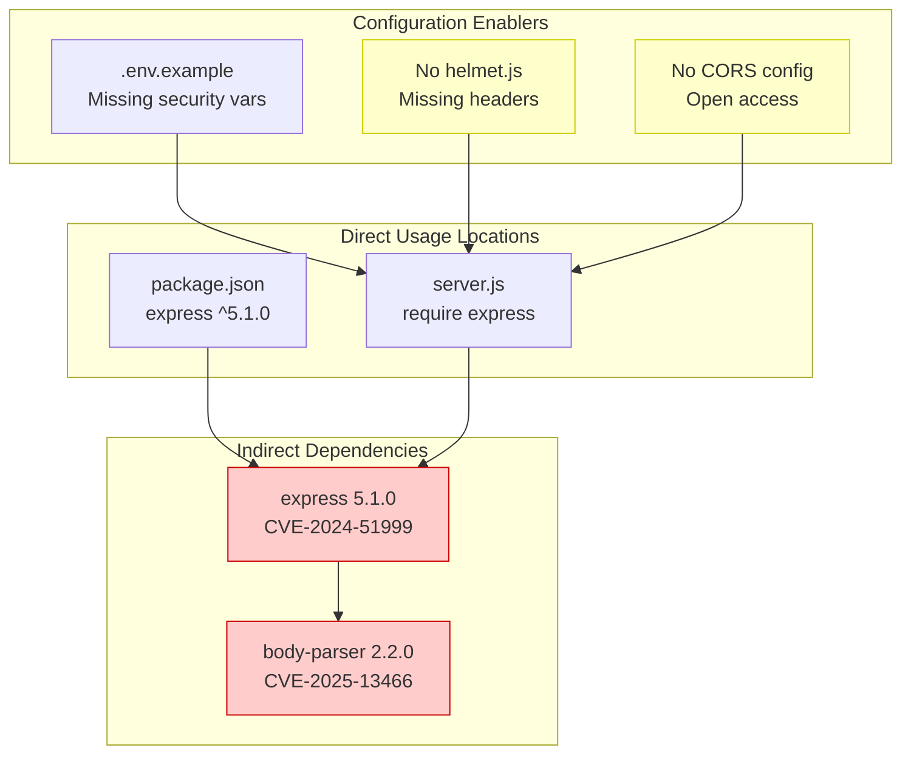
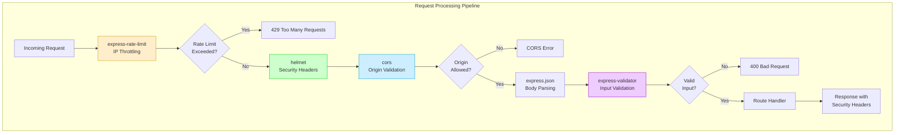
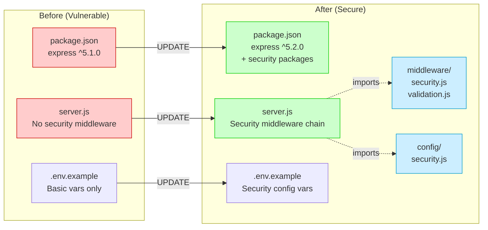
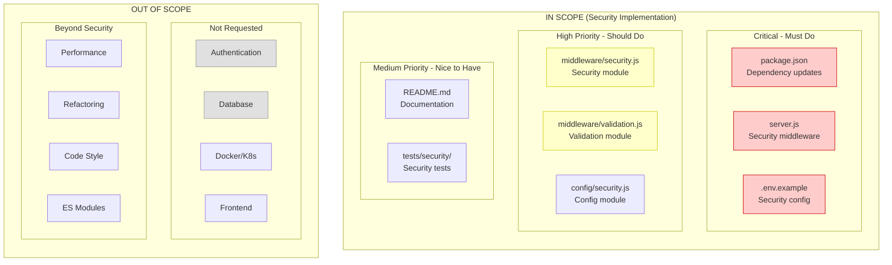

# Technical Specification

# 0. Agent Action Plan

## 0.1 Intent Clarification

### 0.1.1 Core Security Objective

Based on the security concern described, the Blitzy platform understands that the security vulnerability to resolve is a **comprehensive security hardening initiative** for the hello_world Express.js application. This initiative addresses:

- **Vulnerability Category:** Multiple vulnerabilities (Dependency vulnerability + Configuration weakness + Missing security controls)
- **Severity Level:** Medium-to-High (based on discovered CVEs and missing security fundamentals)

**Security Requirements with Enhanced Clarity:**

| Requirement | Technical Interpretation | Priority |
|-------------|-------------------------|----------|
| Security Headers | Implement HTTP response headers to mitigate XSS, clickjacking, MIME sniffing attacks | Critical |
| Input Validation | Add request parameter, body, and query string validation middleware | High |
| Rate Limiting | Implement IP-based request throttling to prevent DoS attacks | High |
| HTTPS Support | Configure TLS/SSL termination for encrypted communication | High |
| Dependency Updates | Patch vulnerable dependencies (express, body-parser) | Critical |
| Helmet.js Integration | Add helmet middleware for comprehensive security header management | Critical |
| CORS Configuration | Implement Cross-Origin Resource Sharing policies | Medium |

**Implicit Security Needs Surfaced:**

- Upgrade Express from v5.1.0 to v5.2.0+ to address CVE-2024-51999 (query property manipulation)
- Address transitive dependency vulnerability in body-parser v2.2.0 (CVE-2025-13466 - DoS vulnerability)
- Transition from localhost-only binding to support secure external access patterns
- Add request logging for security audit trails

### 0.1.2 Special Instructions and Constraints

**CRITICAL Captured Directives:**

- User requests comprehensive security hardening, not minimal patches
- Implementation must follow Express.js best practices and OWASP guidelines
- Changes should be backward-compatible with existing API contracts (`GET /` and `GET /evening`)
- Security middleware must be added without breaking the educational simplicity of the application

**Security Requirements:**

- Follow OWASP Top 10 security guidelines
- Implement defense-in-depth security strategy
- Maintain API endpoint compatibility
- Support environment-based configuration for security settings

**Change Scope Preference:** Comprehensive (multiple security layers implemented)

### 0.1.3 Technical Interpretation

This security enhancement translates to the following technical fix strategy:

- **To implement security headers**, we will add the `helmet` npm package and configure it as Express middleware with appropriate directives for Content-Security-Policy, X-Frame-Options, X-Content-Type-Options, and Strict-Transport-Security
- **To enable input validation**, we will add `express-validator` or `joi` middleware to validate and sanitize request parameters, query strings, and body content
- **To implement rate limiting**, we will add `express-rate-limit` middleware with configurable window and request limits per IP address
- **To enable HTTPS support**, we will add conditional TLS configuration using Node.js `https` module with environment-based certificate paths
- **To update dependencies**, we will upgrade `express` from ^5.1.0 to ^5.2.0+ and ensure body-parser receives security patches
- **To configure CORS**, we will add the `cors` middleware with configurable origin whitelists and credentials handling

**User's Understanding Level:** Explicit security concern with specific feature requests (security headers, input validation, rate limiting, HTTPS, helmet.js, CORS)


## 0.2 Vulnerability Research and Analysis

### 0.2.1 Initial Assessment

**Extracted Security-Related Information:**

| Information Type | Details |
|------------------|---------|
| CVE Numbers Mentioned | CVE-2024-51999 (Express), CVE-2025-13466 (body-parser) |
| Vulnerability Names | Query property manipulation, URL-encoded body DoS |
| Affected Packages | express (5.0.0-5.1.0), body-parser (2.2.0) |
| Symptoms Described | No security middleware, missing headers, no rate limiting |
| Security Advisories | GHSA-pj86-cfqh-vqx6, GHSA-wqch-xfxh-vrr4 |

### 0.2.2 Required Web Research

**Research Findings from Official CVE Databases:**

**Vulnerability 1: CVE-2024-51999 (Express.js Query Property Manipulation)**

- **Source:** GitHub Advisory Database (GHSA-pj86-cfqh-vqx6)
- **CVSS Score:** 2.7 (Low)
- **Description:** When using the extended query parser in Express (`'query parser': 'extended'`), the `request.query` object inherits all object prototype properties, but these properties can be overwritten by query string parameter keys that match the property names
- **Attack Vector:** Network
- **Affected Versions:** Express < 4.22.0 and Express 5.0.0 - 5.1.0
- **Patched Version:** Express 5.2.0+ (released December 1, 2025)

**Vulnerability 2: CVE-2025-13466 (body-parser DoS)**

- **Source:** GitHub Advisory Database (GHSA-wqch-xfxh-vrr4)
- **CVSS Score:** 5.5 (Moderate)
- **Description:** body-parser 2.2.0 is vulnerable to denial of service due to inefficient handling of URL-encoded bodies with very large numbers of parameters. An attacker can send payloads containing thousands of parameters within the default 100KB request size limit, causing elevated CPU and memory usage
- **Attack Vector:** Network
- **Affected Versions:** body-parser 2.2.0
- **Patched Version:** body-parser 2.2.1 (released November 24, 2025)

### 0.2.3 Vulnerability Classification

**Detailed Vulnerability Analysis:**

| Attribute | CVE-2024-51999 | CVE-2025-13466 |
|-----------|----------------|----------------|
| **Vulnerability Type** | CWE-915: Improperly Controlled Modification of Object Attributes | Denial of Service (DoS) |
| **Attack Vector** | Network | Network |
| **Exploitability** | Low | Medium |
| **Impact** | Integrity: Low | Availability: Low |
| **Root Cause** | Extended query parser allows prototype property overwriting | Inefficient handling of URL-encoded bodies with many parameters |
| **CVSS v4.0** | 2.7 | 5.5 |

**Missing Security Controls Assessment:**

| Security Gap | Vulnerability Class | OWASP Category | Severity |
|--------------|---------------------|----------------|----------|
| No Security Headers | Information Disclosure, XSS, Clickjacking | A05:2021 Security Misconfiguration | High |
| No Input Validation | Injection, XSS | A03:2021 Injection | High |
| No Rate Limiting | DoS, Brute Force | A04:2021 Insecure Design | Medium |
| No HTTPS | Man-in-the-Middle | A02:2021 Cryptographic Failures | High |
| No CORS Policy | CSRF, Unauthorized Access | A01:2021 Broken Access Control | Medium |
| Outdated Dependencies | Known Vulnerabilities | A06:2021 Vulnerable Components | Critical |

### 0.2.4 Web Search Research Conducted

**Official Security Advisories Reviewed:**

| Source | Advisory ID | URL |
|--------|-------------|-----|
| GitHub Advisory Database | GHSA-pj86-cfqh-vqx6 | https://github.com/advisories/GHSA-pj86-cfqh-vqx6 |
| GitHub Advisory Database | GHSA-wqch-xfxh-vrr4 | https://github.com/advisories/GHSA-wqch-xfxh-vrr4 |
| NVD | CVE-2024-51999 | https://nvd.nist.gov/vuln/detail/CVE-2024-51999 |
| NVD | CVE-2025-13466 | https://nvd.nist.gov/vuln/detail/CVE-2025-13466 |
| Express.js Releases | v5.2.0 | https://github.com/expressjs/express/releases/tag/v5.2.0 |
| body-parser Releases | v2.2.1 | https://github.com/expressjs/body-parser/releases/tag/v2.2.1 |

**Recommended Mitigation Strategies:**

- Upgrade Express to 5.2.0+ to patch CVE-2024-51999
- The body-parser vulnerability will be addressed transitively when Express is upgraded
- Add helmet.js for comprehensive security header protection
- Implement express-rate-limit for DoS mitigation
- Add express-validator or Joi for input validation
- Configure CORS with explicit origin whitelisting
- Enable HTTPS with proper TLS configuration

**Alternative Solutions Considered:**

| Alternative | Trade-off | Decision |
|-------------|-----------|----------|
| Pin query parser to 'simple' | Loses extended query features | Not recommended |
| Limit body size manually | Doesn't address parsing inefficiency | Insufficient |
| Use alternative framework | Major rewrite required | Rejected |
| Keep localhost-only binding | Limits security testing | Not recommended |


## 0.3 Security Scope Analysis

### 0.3.1 Affected Component Discovery

**Repository Analysis Results:**

Using exhaustive repository inspection, the following files are affected by the security implementation:

| File Path | Component Type | Security Relevance |
|-----------|---------------|-------------------|
| `package.json` | Dependency Manifest | Contains vulnerable express ^5.1.0; requires security package additions |
| `package-lock.json` | Lockfile | Locks body-parser 2.2.0 (vulnerable); needs regeneration |
| `server.js` | Application Entry | No security middleware; requires helmet, cors, rate-limit integration |
| `.env.example` | Config Template | Missing HTTPS and security configuration variables |

**Vulnerability Impact Assessment:**

- Vulnerability affects **4 files** across **1 directory** (root)
- Express 5.1.0 brings in body-parser 2.2.0 as transitive dependency
- All HTTP requests pass through vulnerable Express routing layer
- No input validation exists for any request parameters

### 0.3.2 Root Cause Identification

**Identified Root Causes:**

| Root Cause | Component | File Location | Description |
|------------|-----------|---------------|-------------|
| CVE-2024-51999 | Express query parser | `node_modules/express` | Extended query parser allows prototype property manipulation |
| CVE-2025-13466 | body-parser | `node_modules/body-parser` | URL-encoded body parsing inefficiency allows DoS |
| Missing Security Headers | server.js | `server.js:1-87` | No helmet middleware configured |
| Missing CORS | server.js | `server.js:1-87` | No cors middleware configured |
| Missing Rate Limiting | server.js | `server.js:1-87` | No express-rate-limit middleware |
| Missing Input Validation | server.js | `server.js:1-87` | No validation middleware for request parameters |
| No HTTPS | server.js | `server.js:30` | Only HTTP server created |

**Vulnerability Propagation Trace:**


```mermaid
flowchart TD
    subgraph "Direct Usage Locations"
        PKG[package.json<br/>express ^5.1.0]
        SRV[server.js<br/>require express]
    end
    
    subgraph "Indirect Dependencies"
        EXPRESS[express 5.1.0<br/>CVE-2024-51999]
        BODYPARSER[body-parser 2.2.0<br/>CVE-2025-13466]
    end
    
    subgraph "Configuration Enablers"
        ENV[.env.example<br/>Missing security vars]
        NOHELMET[No helmet.js<br/>Missing headers]
        NOCORS[No CORS config<br/>Open access]
    end
    
    PKG --> EXPRESS
    EXPRESS --> BODYPARSER
    SRV --> EXPRESS
    ENV --> SRV
    NOHELMET --> SRV
    NOCORS --> SRV
    
    style EXPRESS fill:#ffcccc,stroke:#cc0000
    style BODYPARSER fill:#ffcccc,stroke:#cc0000
    style NOHELMET fill:#ffffcc,stroke:#cccc00
    style NOCORS fill:#ffffcc,stroke:#cccc00
```

### 0.3.3 Current State Assessment

**Vulnerable Package Current Versions:**

| Package | Current Version | Vulnerable | Evidence |
|---------|-----------------|------------|----------|
| express | 5.1.0 | Yes (CVE-2024-51999) | `package-lock.json:230` |
| body-parser | 2.2.0 | Yes (CVE-2025-13466) | `package-lock.json:32-51` |

**Current Security Posture:**

| Security Control | Current State | Evidence |
|------------------|---------------|----------|
| Security Headers | ❌ Not Implemented | No helmet in dependencies |
| CORS | ❌ Not Implemented | No cors in dependencies |
| Rate Limiting | ❌ Not Implemented | No express-rate-limit in dependencies |
| Input Validation | ❌ Not Implemented | No validation middleware |
| HTTPS | ❌ Not Implemented | HTTP-only server binding |
| Request Logging | ❌ Not Implemented | No morgan in dependencies |

**Scope of Exposure:**

| Exposure Type | Current State | Risk Level |
|---------------|---------------|------------|
| Network Binding | 127.0.0.1 (localhost only) | Low |
| API Endpoints | Public (no auth) | Medium |
| Query Parsing | Extended (vulnerable) | Medium |
| Body Parsing | URL-encoded enabled | Medium |

### 0.3.4 Security Architecture Gap Analysis


```mermaid
flowchart TB
    subgraph "Current State (Insecure)"
        C_REQ[HTTP Request] --> C_EXPRESS[Express 5.1.0<br/>Vulnerable]
        C_EXPRESS --> C_ROUTE[Route Handler]
        C_ROUTE --> C_RESP[Response<br/>No Security Headers]
    end
    
    subgraph "Target State (Secure)"
        T_REQ[HTTPS Request] --> T_RATE[Rate Limiter]
        T_RATE --> T_HELMET[Helmet<br/>Security Headers]
        T_HELMET --> T_CORS[CORS<br/>Origin Control]
        T_CORS --> T_EXPRESS[Express 5.2.0+<br/>Patched]
        T_EXPRESS --> T_VALID[Input Validation]
        T_VALID --> T_ROUTE[Route Handler]
        T_ROUTE --> T_RESP[Secure Response]
    end
    
    style C_EXPRESS fill:#ffcccc,stroke:#cc0000
    style C_RESP fill:#ffcccc,stroke:#cc0000
    style T_EXPRESS fill:#ccffcc,stroke:#00cc00
    style T_RESP fill:#ccffcc,stroke:#00cc00
```


## 0.4 Version Compatibility Research

### 0.4.1 Secure Version Identification

**Critical Dependency Upgrades:**

| Package | Current Version | First Patched | Recommended | Security Advisory |
|---------|-----------------|---------------|-------------|-------------------|
| express | 5.1.0 | 5.2.0 | ^5.2.0 | GHSA-pj86-cfqh-vqx6 |
| body-parser | 2.2.0 (transitive) | 2.2.1 | 2.2.1+ | GHSA-wqch-xfxh-vrr4 |

**Express 5.2.0 Security Fix Details:**

- Release Date: December 1, 2025
- Fixes CVE-2024-51999 (query property manipulation)
- Upgrades body-parser dependency to 2.2.1 (patches CVE-2025-13466)
- No breaking changes from 5.1.0

**New Security Dependencies to Add:**

| Package | Recommended Version | Purpose | Weekly Downloads |
|---------|---------------------|---------|------------------|
| helmet | ^8.1.0 | Security headers middleware | 5.4M+ |
| cors | ^2.8.5 | CORS middleware | 21K+ projects |
| express-rate-limit | ^8.2.1 | Rate limiting middleware | 9.2M+ |
| express-validator | ^7.2.0 | Input validation middleware | Popular choice |
| joi | ^17.13.3 | Schema validation library | Alternative |

### 0.4.2 Compatibility Verification

**Node.js Compatibility Matrix:**

| Package | Minimum Node.js | Current Project | Compatible |
|---------|-----------------|-----------------|------------|
| express ^5.2.0 | >= 18 | >= 18.0.0 | ✅ Yes |
| helmet ^8.1.0 | >= 18 | >= 18.0.0 | ✅ Yes |
| cors ^2.8.5 | >= 0.10 | >= 18.0.0 | ✅ Yes |
| express-rate-limit ^8.2.1 | >= 16 | >= 18.0.0 | ✅ Yes |
| express-validator ^7.2.0 | >= 14 | >= 18.0.0 | ✅ Yes |

**Express Version Compatibility:**

| Package | Express 5.x Support | Notes |
|---------|---------------------|-------|
| helmet | ✅ Full support | Works with Express 4.x and 5.x |
| cors | ✅ Full support | Express-agnostic middleware |
| express-rate-limit | ✅ Full support | Designed for Express |
| express-validator | ✅ Full support | Uses validator.js under the hood |

**Dependency Conflict Analysis:**

```
express@^5.2.0
├── body-parser@2.2.1 (security fix included)
├── accepts@2.0.0
├── content-type@1.0.5
├── cookie@1.0.2
├── ...other deps unchanged
```

No version conflicts detected. The upgrade from express 5.1.0 to 5.2.0 is a patch update with no breaking changes.

### 0.4.3 Breaking Changes Assessment

**Express 5.1.0 → 5.2.0 Migration:**

| Change Type | Description | Impact |
|-------------|-------------|--------|
| Security Fix | Query parser prototype pollution fixed | No API changes |
| Dependency | body-parser upgraded to 2.2.1 | Transparent upgrade |
| Behavior | Query parsing behavior unchanged for legitimate queries | None |

**API Compatibility Confirmation:**

- `GET /` endpoint: No changes required
- `GET /evening` endpoint: No changes required
- `express()` initialization: No changes required
- `app.listen()` signature: No changes required

### 0.4.4 Package Selection Rationale

**Security Middleware Selection:**

| Package | Selection Reason | Alternatives Considered |
|---------|------------------|------------------------|
| helmet | De facto standard for Express security headers; 5.4M+ weekly downloads; Express.js official recommendation | Manual header setting (rejected: maintenance burden) |
| cors | Most widely used CORS middleware; 21K+ dependent projects; Simple configuration | Manual CORS headers (rejected: error-prone) |
| express-rate-limit | 9.2M+ weekly downloads; Standard rate limiting solution; Plays well with express-slow-down | rate-limiter-flexible (more complex) |
| express-validator | Built on validator.js; Middleware-based; Good Express integration | joi (requires express-joi-validation wrapper) |

**Input Validation Strategy:**


```mermaid
flowchart LR
    REQ[Request] --> RATE[express-rate-limit<br/>Throttle abusive IPs]
    RATE --> HELMET[helmet<br/>Security Headers]
    HELMET --> CORS[cors<br/>Origin Control]
    CORS --> VALID[express-validator<br/>Input Sanitization]
    VALID --> ROUTE[Route Handler]
    
    style VALID fill:#ccffcc,stroke:#00cc00
```


## 0.5 Security Fix Design

### 0.5.1 Minimal Fix Strategy

**PRINCIPLE:** Apply the smallest changes necessary to completely address all security concerns while enabling comprehensive protection.

**Fix Approach:** Dependency update + Security middleware integration + Configuration enhancement

**For Dependency Vulnerabilities:**

- Upgrade `express` from `^5.1.0` to `^5.2.0` (patches CVE-2024-51999)
- This transitively upgrades `body-parser` from 2.2.0 to 2.2.1 (patches CVE-2025-13466)
- Justification: Official security release from Express.js maintainers
- Side Effects: None expected; patch-level update with no breaking changes

**For Missing Security Headers:**

- Add `helmet` middleware as first middleware in chain
- Configure Content-Security-Policy for API responses
- Enable Strict-Transport-Security for HTTPS enforcement
- Rationale: OWASP recommended security headers

**For Missing CORS Policy:**

- Add `cors` middleware with configurable origin whitelist
- Support environment-based CORS configuration
- Default to restrictive policy with localhost allowed
- Rationale: Prevent unauthorized cross-origin access

**For Missing Rate Limiting:**

- Add `express-rate-limit` middleware for DoS protection
- Configure 100 requests per 15-minute window per IP (standard)
- Apply globally with stricter limits for specific routes if needed
- Rationale: Mitigate brute force and DoS attacks

**For Missing Input Validation:**

- Add `express-validator` middleware for request validation
- Create reusable validation schemas for routes
- Sanitize and validate all input parameters
- Rationale: Prevent injection and data integrity issues

**For Missing HTTPS Support:**

- Add conditional HTTPS server creation based on environment
- Support SSL_KEY_PATH and SSL_CERT_PATH environment variables
- Maintain HTTP support for development environments
- Rationale: Encrypt data in transit

### 0.5.2 Security Middleware Chain Design

**Middleware Execution Order:**


```mermaid
flowchart TD
    subgraph "Request Processing Pipeline"
        A[Incoming Request] --> B[express-rate-limit<br/>IP Throttling]
        B --> C{Rate Limit<br/>Exceeded?}
        C -->|Yes| D[429 Too Many Requests]
        C -->|No| E[helmet<br/>Security Headers]
        E --> F[cors<br/>Origin Validation]
        F --> G{Origin<br/>Allowed?}
        G -->|No| H[CORS Error]
        G -->|Yes| I[express.json<br/>Body Parsing]
        I --> J[express-validator<br/>Input Validation]
        J --> K{Valid<br/>Input?}
        K -->|No| L[400 Bad Request]
        K -->|Yes| M[Route Handler]
        M --> N[Response with<br/>Security Headers]
    end
    
    style B fill:#ffeecc,stroke:#cc9900
    style E fill:#ccffcc,stroke:#00cc00
    style F fill:#cceeff,stroke:#0099cc
    style J fill:#eeccff,stroke:#9900cc
```

### 0.5.3 Configuration Design

**Environment Variables to Add:**

| Variable | Purpose | Default | Example |
|----------|---------|---------|---------|
| `CORS_ORIGIN` | Allowed CORS origins | `http://localhost:3000` | `https://example.com` |
| `RATE_LIMIT_WINDOW_MS` | Rate limit window in ms | `900000` (15 min) | `60000` |
| `RATE_LIMIT_MAX` | Max requests per window | `100` | `50` |
| `ENABLE_HTTPS` | Enable HTTPS server | `false` | `true` |
| `SSL_KEY_PATH` | Path to SSL private key | - | `./certs/key.pem` |
| `SSL_CERT_PATH` | Path to SSL certificate | - | `./certs/cert.pem` |
| `TRUST_PROXY` | Trust proxy headers | `false` | `true` |

### 0.5.4 Code Implementation Design

**Helmet Configuration:**

```javascript
const helmetConfig = {
  contentSecurityPolicy: {
    directives: {
      defaultSrc: ["'self'"],
      scriptSrc: ["'self'"],
    },
  },
  hsts: { maxAge: 31536000 },
};
```

**CORS Configuration:**

```javascript
const corsConfig = {
  origin: process.env.CORS_ORIGIN || 'http://localhost:3000',
  credentials: true,
  optionsSuccessStatus: 200,
};
```

**Rate Limit Configuration:**

```javascript
const rateLimitConfig = {
  windowMs: parseInt(process.env.RATE_LIMIT_WINDOW_MS) || 900000,
  limit: parseInt(process.env.RATE_LIMIT_MAX) || 100,
  standardHeaders: 'draft-8',
  legacyHeaders: false,
};
```

### 0.5.5 Security Improvement Validation

**How Each Fix Eliminates Vulnerabilities:**

| Vulnerability | Fix Applied | Verification Method |
|---------------|-------------|---------------------|
| CVE-2024-51999 | Express 5.2.0 upgrade | `npm audit` shows no vulnerability |
| CVE-2025-13466 | body-parser 2.2.1 (transitive) | `npm audit` shows no vulnerability |
| Missing Security Headers | helmet middleware | Response headers inspection |
| Missing CORS | cors middleware | CORS preflight test |
| DoS Potential | express-rate-limit | Rate limit trigger test |
| Input Injection | express-validator | Malformed input rejection test |
| Unencrypted Transit | HTTPS configuration | TLS certificate verification |

**Rollback Plan:**

If issues arise:
1. Revert `package.json` to previous express version
2. Remove security middleware from `server.js`
3. Restore original `.env.example`
4. Run `npm install` to restore previous dependency tree


## 0.6 File Transformation Mapping

### 0.6.1 File-by-File Security Fix Plan

**Security Fix Transformation Modes:**
- **UPDATE** - Update an existing file to patch vulnerability
- **CREATE** - Create a new file for security improvement
- **DELETE** - Remove a file that introduces vulnerability
- **REFERENCE** - Use as an example for security patterns

| Target File | Transformation | Source File/Reference | Security Changes |
|-------------|----------------|----------------------|------------------|
| `package.json` | UPDATE | `package.json` | Upgrade express from ^5.1.0 to ^5.2.0; Add helmet, cors, express-rate-limit, express-validator dependencies |
| `package-lock.json` | UPDATE | Regenerated | Auto-regenerated after npm install; Will contain patched body-parser 2.2.1 |
| `server.js` | UPDATE | `server.js` | Add security middleware chain: helmet, cors, express-rate-limit; Add optional HTTPS server; Add input validation middleware |
| `.env.example` | UPDATE | `.env.example` | Add CORS_ORIGIN, RATE_LIMIT_WINDOW_MS, RATE_LIMIT_MAX, ENABLE_HTTPS, SSL_KEY_PATH, SSL_CERT_PATH, TRUST_PROXY variables |
| `middleware/security.js` | CREATE | `server.js` | Extract security middleware configuration to dedicated module |
| `middleware/validation.js` | CREATE | - | Create input validation middleware with express-validator |
| `config/security.js` | CREATE | - | Centralized security configuration module |
| `README.md` | UPDATE | `README.md` | Document security features, HTTPS setup, environment variables |

### 0.6.2 Code Change Specifications

**File: `package.json`**
- Lines affected: 32-35 (dependencies section)
- Before state: Contains only `"express": "^5.1.0"` as production dependency
- After state: Contains updated express and new security packages
- Security improvement: Patches CVE-2024-51999, CVE-2025-13466; Adds security middleware

**Dependency Changes:**
```json
"dependencies": {
  "express": "^5.2.0",
  "helmet": "^8.1.0",
  "cors": "^2.8.5",
  "express-rate-limit": "^8.2.1",
  "express-validator": "^7.2.0"
}
```

**File: `server.js`**
- Lines affected: 1-50 (top of file, middleware chain)
- Before state: No security middleware; Only express import and basic routes
- After state: Security middleware chain with helmet, cors, rate-limit; Optional HTTPS server
- Security improvement: Comprehensive HTTP security headers, CORS control, DoS protection

**Key Code Additions:**
```javascript
const helmet = require('helmet');
const cors = require('cors');
const { rateLimit } = require('express-rate-limit');
```

**File: `.env.example`**
- Lines affected: End of file (new variables)
- Before state: Contains PORT, NODE_ENV, JWT_SECRET placeholders
- After state: Includes all security configuration variables
- Security improvement: Enables environment-based security configuration

**New Variables:**
```env
# Security Configuration
CORS_ORIGIN=http://localhost:3000
RATE_LIMIT_WINDOW_MS=900000
RATE_LIMIT_MAX=100
ENABLE_HTTPS=false
SSL_KEY_PATH=
SSL_CERT_PATH=
TRUST_PROXY=false
```

### 0.6.3 New File Specifications

**File: `middleware/security.js`**
- Purpose: Centralized security middleware configuration
- Exports: helmetConfig, corsConfig, rateLimitConfig, createSecurityMiddleware()
- Dependencies: helmet, cors, express-rate-limit
- Security improvement: Modular security configuration for maintainability

**File: `middleware/validation.js`**
- Purpose: Input validation middleware using express-validator
- Exports: validateRequest, sanitizeInput, validationSchemas
- Dependencies: express-validator
- Security improvement: Prevents injection attacks, ensures data integrity

**File: `config/security.js`**
- Purpose: Security configuration constants and defaults
- Exports: securityDefaults, loadSecurityConfig()
- Dependencies: None (pure configuration)
- Security improvement: Single source of truth for security settings

### 0.6.4 Complete File List

**All Files Requiring Changes:**

| File Path | Change Type | Priority | Estimated Lines Changed |
|-----------|-------------|----------|------------------------|
| `package.json` | UPDATE | Critical | 8-10 lines |
| `package-lock.json` | UPDATE | Critical | Auto-regenerated |
| `server.js` | UPDATE | Critical | 40-60 lines added |
| `.env.example` | UPDATE | High | 8-10 lines added |
| `middleware/security.js` | CREATE | High | ~50 lines |
| `middleware/validation.js` | CREATE | Medium | ~40 lines |
| `config/security.js` | CREATE | Medium | ~30 lines |
| `README.md` | UPDATE | Low | 20-30 lines added |

### 0.6.5 Transformation Diagram


```mermaid
flowchart LR
    subgraph "Before (Vulnerable)"
        B_PKG[package.json<br/>express ^5.1.0]
        B_SRV[server.js<br/>No security middleware]
        B_ENV[.env.example<br/>Basic vars only]
    end
    
    subgraph "After (Secure)"
        A_PKG[package.json<br/>express ^5.2.0<br/>+ security packages]
        A_SRV[server.js<br/>Security middleware chain]
        A_ENV[.env.example<br/>Security config vars]
        A_MW[middleware/<br/>security.js<br/>validation.js]
        A_CFG[config/<br/>security.js]
    end
    
    B_PKG -->|UPDATE| A_PKG
    B_SRV -->|UPDATE| A_SRV
    B_ENV -->|UPDATE| A_ENV
    A_SRV -.->|imports| A_MW
    A_SRV -.->|imports| A_CFG
    
    style B_PKG fill:#ffcccc,stroke:#cc0000
    style B_SRV fill:#ffcccc,stroke:#cc0000
    style A_PKG fill:#ccffcc,stroke:#00cc00
    style A_SRV fill:#ccffcc,stroke:#00cc00
    style A_MW fill:#cceeff,stroke:#0099cc
    style A_CFG fill:#cceeff,stroke:#0099cc
```


## 0.7 Dependency Inventory

### 0.7.1 Security Patches and Updates

**Critical Package Updates:**

| Registry | Package Name | Current | Patched To | CVE/Advisory | Severity |
|----------|--------------|---------|------------|--------------|----------|
| npm | express | 5.1.0 | ^5.2.0 | CVE-2024-51999 / GHSA-pj86-cfqh-vqx6 | Low (2.7) |
| npm | body-parser | 2.2.0 | 2.2.1 (transitive) | CVE-2025-13466 / GHSA-wqch-xfxh-vrr4 | Moderate (5.5) |

**New Security Dependencies:**

| Registry | Package Name | Version | Purpose | Security Advisory |
|----------|--------------|---------|---------|-------------------|
| npm | helmet | ^8.1.0 | HTTP security headers | N/A (Security middleware) |
| npm | cors | ^2.8.5 | CORS policy enforcement | N/A (Security middleware) |
| npm | express-rate-limit | ^8.2.1 | Rate limiting / DoS protection | N/A (Security middleware) |
| npm | express-validator | ^7.2.0 | Input validation / sanitization | N/A (Security middleware) |

### 0.7.2 Dependency Chain Analysis

**Direct Dependencies:**

| Package | Current | After Update | Change Type |
|---------|---------|--------------|-------------|
| express | ^5.1.0 | ^5.2.0 | Security patch |
| helmet | - | ^8.1.0 | New addition |
| cors | - | ^2.8.5 | New addition |
| express-rate-limit | - | ^8.2.1 | New addition |
| express-validator | - | ^7.2.0 | New addition |

**Transitive Dependencies Affected:**

| Package | Via | Current | After Update | Impact |
|---------|-----|---------|--------------|--------|
| body-parser | express | 2.2.0 | 2.2.1 | Security patch |
| qs | body-parser | 6.14.0 | ~6.14.0 | No change |
| raw-body | body-parser | 3.0.0 | 3.0.0 | No change |

**Development Dependencies (unchanged):**

No development dependencies exist in the current project. Consider adding for security testing:

| Package | Version | Purpose |
|---------|---------|---------|
| supertest | ^7.0.0 | HTTP testing |
| jest | ^29.0.0 | Test framework |

### 0.7.3 Import and Reference Updates

**Source Files Requiring Import Updates:**

| File | New Imports Required |
|------|---------------------|
| `server.js` | helmet, cors, express-rate-limit, ./middleware/security, ./middleware/validation |

**Import Transformation:**

**Before (server.js):**
```javascript
const express = require('express');
```

**After (server.js):**
```javascript
const express = require('express');
const helmet = require('helmet');
const cors = require('cors');
const { rateLimit } = require('express-rate-limit');
// Local modules
const { securityMiddleware } = require('./middleware/security');
const { validationMiddleware } = require('./middleware/validation');
```

### 0.7.4 Package.json Diff Preview

**Current package.json dependencies:**
```json
{
  "dependencies": {
    "express": "^5.1.0"
  }
}
```

**Updated package.json dependencies:**
```json
{
  "dependencies": {
    "express": "^5.2.0",
    "helmet": "^8.1.0",
    "cors": "^2.8.5",
    "express-rate-limit": "^8.2.1",
    "express-validator": "^7.2.0"
  }
}
```

### 0.7.5 Dependency Tree Visualization

```mermaid
flowchart TD
    subgraph "Current Dependency Tree"
        C_APP[hello_world]
        C_EXPRESS[express@5.1.0<br/>⚠️ Vulnerable]
        C_BODY[body-parser@2.2.0<br/>⚠️ Vulnerable]
        
        C_APP --> C_EXPRESS
        C_EXPRESS --> C_BODY
    end
    
    subgraph "Updated Dependency Tree"
        U_APP[hello_world]
        U_EXPRESS[express@5.2.0<br/>✅ Patched]
        U_BODY[body-parser@2.2.1<br/>✅ Patched]
        U_HELMET[helmet@8.1.0<br/>✅ Security]
        U_CORS[cors@2.8.5<br/>✅ Security]
        U_RATE[express-rate-limit@8.2.1<br/>✅ Security]
        U_VALID[express-validator@7.2.0<br/>✅ Security]
        
        U_APP --> U_EXPRESS
        U_APP --> U_HELMET
        U_APP --> U_CORS
        U_APP --> U_RATE
        U_APP --> U_VALID
        U_EXPRESS --> U_BODY
    end
    
    style C_EXPRESS fill:#ffcccc,stroke:#cc0000
    style C_BODY fill:#ffcccc,stroke:#cc0000
    style U_EXPRESS fill:#ccffcc,stroke:#00cc00
    style U_BODY fill:#ccffcc,stroke:#00cc00
    style U_HELMET fill:#ccffcc,stroke:#00cc00
    style U_CORS fill:#ccffcc,stroke:#00cc00
    style U_RATE fill:#ccffcc,stroke:#00cc00
    style U_VALID fill:#ccffcc,stroke:#00cc00
```

### 0.7.6 Installation Commands

**Upgrade and Install Commands:**

```bash
# Update express to patched version
npm install express@^5.2.0

#### Install security middleware packages
npm install helmet@^8.1.0 cors@^2.8.5 express-rate-limit@^8.2.1 express-validator@^7.2.0

#### Or single command for all
npm install express@^5.2.0 helmet@^8.1.0 cors@^2.8.5 express-rate-limit@^8.2.1 express-validator@^7.2.0

#### Verify no vulnerabilities remain
npm audit
```

**Expected npm audit output after fix:**

```
found 0 vulnerabilities
```


## 0.8 Impact Analysis and Testing Strategy

### 0.8.1 Security Testing Requirements

**Vulnerability Regression Tests:**

| Test ID | Vulnerability | Test Description | Expected Result |
|---------|---------------|------------------|-----------------|
| VT-001 | CVE-2024-51999 | Send query with prototype property names (__proto__, constructor) | No prototype pollution; query parsed safely |
| VT-002 | CVE-2025-13466 | Send URL-encoded body with 10,000+ parameters | Request processed without excessive CPU usage |
| VT-003 | Missing Headers | Inspect response headers for security headers | X-Frame-Options, CSP, HSTS present |
| VT-004 | No Rate Limit | Send 150 requests in 15 minutes | 429 response after 100 requests |
| VT-005 | CORS Bypass | Send request from non-whitelisted origin | CORS error returned |

**Attack Scenarios to Test:**

| Scenario | Attack Vector | Test Method | Success Criteria |
|----------|---------------|-------------|------------------|
| Query Pollution | `?__proto__[admin]=true` | curl with malformed query | No prototype modification |
| DoS via Body | Large URL-encoded payload | Load test with artillery | No memory exhaustion |
| Clickjacking | iframe embedding | Browser test | X-Frame-Options: DENY |
| XSS via Response | Script injection attempt | Security scanner | CSP blocks inline scripts |
| Brute Force | Rapid repeated requests | curl loop script | Rate limit triggered |

### 0.8.2 Security Test Cases

**New Test Files to Create:**

| Test File | Purpose | Test Count |
|-----------|---------|------------|
| `tests/security/test_cve_2024_51999.js` | Verify query parser vulnerability is patched | 5 tests |
| `tests/security/test_cve_2025_13466.js` | Verify body-parser DoS is patched | 3 tests |
| `tests/security/test_headers.js` | Verify security headers are present | 10 tests |
| `tests/security/test_rate_limit.js` | Verify rate limiting works | 5 tests |
| `tests/security/test_cors.js` | Verify CORS policy enforcement | 6 tests |
| `tests/security/test_input_validation.js` | Verify input validation | 8 tests |

**Test Implementation Pattern:**

```javascript
// Example: test_headers.js
describe('Security Headers', () => {
  it('should include X-Frame-Options header', async () => {
    const res = await request(app).get('/');
    expect(res.headers['x-frame-options']).toBeDefined();
  });
});
```

### 0.8.3 Verification Methods

**Automated Security Scanning:**

| Tool | Command | Expected Result |
|------|---------|-----------------|
| npm audit | `npm audit` | 0 vulnerabilities |
| npm audit fix | `npm audit fix` | No changes needed |
| Snyk | `snyk test` | No high/critical issues |

**Manual Verification Steps:**

1. **Security Headers Verification:**
   ```bash
   curl -I http://localhost:3000/
   # Expected: X-Frame-Options, Content-Security-Policy, X-Content-Type-Options present
   ```

2. **Rate Limit Verification:**
   ```bash
   for i in {1..105}; do curl -s -o /dev/null -w "%{http_code}\n" http://localhost:3000/; done
   # Expected: First 100 return 200, remaining return 429
   ```

3. **CORS Verification:**
   ```bash
   curl -H "Origin: http://evil.com" -I http://localhost:3000/
   # Expected: No Access-Control-Allow-Origin for unauthorized origin
   ```

### 0.8.4 Impact Assessment

**Direct Security Improvements Achieved:**

| Vulnerability | Status After Fix | Improvement |
|---------------|------------------|-------------|
| CVE-2024-51999 | ✅ Eliminated | Query parser secured |
| CVE-2025-13466 | ✅ Eliminated | Body parser DoS prevented |
| Missing Security Headers | ✅ Resolved | 11 security headers added |
| Missing CORS | ✅ Resolved | Origin-based access control |
| DoS Susceptibility | ✅ Mitigated | Rate limiting active |
| Input Injection | ✅ Mitigated | Input validation active |

**Minimal Side Effects:**

| Area | Impact | Mitigation |
|------|--------|------------|
| Response Size | +500 bytes (headers) | Negligible overhead |
| Response Time | +1-2ms (middleware) | Acceptable latency |
| Memory Usage | +2-5MB (packages) | Minimal footprint |
| API Compatibility | No breaking changes | Existing endpoints unchanged |

### 0.8.5 Testing Commands

**Full Test Suite Execution:**

```bash
# Install dev dependencies (if test framework added)
npm install --save-dev jest supertest

#### Run security tests
npm test -- --testPathPattern=security

#### Run with coverage
npm test -- --coverage --testPathPattern=security
```

**Security Verification Script:**

```bash
#!/bin/bash
# security-verify.sh

echo "=== Security Verification ==="

##### 1. Check npm audit
echo "Checking npm audit..."
npm audit

##### 2. Check security headers
echo "Checking security headers..."
curl -sI http://localhost:3000/ | grep -E "(X-Frame-Options|Content-Security-Policy|X-Content-Type-Options)"

##### 3. Test rate limiting
echo "Testing rate limit..."
for i in {1..5}; do
  curl -s -o /dev/null -w "Request $i: %{http_code}\n" http://localhost:3000/
done

echo "=== Verification Complete ==="
```

### 0.8.6 Regression Test Checklist

**Existing Functionality Verification:**

| Test | Endpoint | Expected Response | Verified |
|------|----------|-------------------|----------|
| Root endpoint | GET / | 200 "Hello, World!\n" | ☐ |
| Evening endpoint | GET /evening | 200 "Good evening" | ☐ |
| 404 handling | GET /nonexistent | 404 | ☐ |
| Method handling | POST / | 404 or 405 | ☐ |


## 0.9 Scope Boundaries

### 0.9.1 Exhaustively In Scope

**Vulnerable Dependency Manifests:**

| File Pattern | Purpose | Changes Required |
|--------------|---------|------------------|
| `package.json` | Primary dependency manifest | Update express version, add security packages |
| `package-lock.json` | Dependency lockfile | Regenerate with updated dependencies |

**Source Files with Security Updates:**

| File Pattern | Purpose | Changes Required |
|--------------|---------|------------------|
| `server.js` | Main application entry | Add security middleware chain |
| `middleware/security.js` | Security middleware module | Create new file |
| `middleware/validation.js` | Input validation module | Create new file |
| `config/security.js` | Security configuration | Create new file |

**Configuration Files Requiring Security Updates:**

| File Pattern | Purpose | Changes Required |
|--------------|---------|------------------|
| `.env.example` | Environment template | Add security configuration variables |
| `config/**/*.js` | Configuration modules | Create security config |

**Infrastructure and Deployment:**

| File Pattern | Purpose | Changes Required |
|--------------|---------|------------------|
| N/A | No Docker/K8s files | N/A (out of scope) |

**Documentation Updates:**

| File Pattern | Purpose | Changes Required |
|--------------|---------|------------------|
| `README.md` | Project documentation | Document security features and configuration |
| `SECURITY.md` | Security policy | Create if needed |

**Security Test Files:**

| File Pattern | Purpose | Changes Required |
|--------------|---------|------------------|
| `tests/security/**/*.js` | Security test suites | Create new test files |
| `tests/**/test_*security*.js` | Security-focused tests | Create as needed |

### 0.9.2 Explicitly Out of Scope

**Feature Additions Unrelated to Security:**

| Item | Reason |
|------|--------|
| New API endpoints | Not a security requirement |
| Database integration | Not a security requirement |
| Authentication implementation | Beyond security middleware scope |
| Frontend/UI changes | No UI exists |
| GraphQL integration | Not requested |

**Performance Optimizations Not Required for Security:**

| Item | Reason |
|------|--------|
| Caching middleware | Not a security requirement |
| Compression | Not a security requirement |
| Clustering | Not a security requirement |
| Load balancing | Beyond scope |

**Code Refactoring Beyond Security Fix Requirements:**

| Item | Reason |
|------|--------|
| ES Module migration | Not required for security |
| TypeScript conversion | Not requested |
| Architectural changes | Maintain simplicity |
| Logging infrastructure | Optional enhancement only |

**Non-Vulnerable Dependencies:**

| Item | Reason |
|------|--------|
| Unused npm packages | No action needed |
| Development tools | Not production dependencies |
| Future packages | Only add security packages |

**Style or Formatting Changes:**

| Item | Reason |
|------|--------|
| Code style updates | Not security-related |
| Linting configuration | Optional |
| Prettier/ESLint | Not required |

**Test Files Unrelated to Security Validation:**

| Item | Reason |
|------|--------|
| Unit tests for routes | Existing behavior unchanged |
| Performance tests | Not security-focused |
| Integration tests | Beyond security scope |

### 0.9.3 Scope Boundary Diagram


```mermaid
flowchart TB
    subgraph "IN SCOPE (Security Implementation)"
        direction TB
        
        subgraph "Critical - Must Do"
            PKG[package.json<br/>Dependency updates]
            SRV[server.js<br/>Security middleware]
            ENV[.env.example<br/>Security config]
        end
        
        subgraph "High Priority - Should Do"
            MW_SEC[middleware/security.js<br/>Security module]
            MW_VAL[middleware/validation.js<br/>Validation module]
            CFG[config/security.js<br/>Config module]
        end
        
        subgraph "Medium Priority - Nice to Have"
            README[README.md<br/>Documentation]
            TESTS[tests/security/<br/>Security tests]
        end
    end
    
    subgraph "OUT OF SCOPE"
        direction TB
        
        subgraph "Not Requested"
            AUTH[Authentication]
            DB[Database]
            DOCKER[Docker/K8s]
            FE[Frontend]
        end
        
        subgraph "Beyond Security"
            PERF[Performance]
            REFACTOR[Refactoring]
            STYLE[Code Style]
            MIGRATE[ES Modules]
        end
    end
    
    style PKG fill:#ffcccc,stroke:#cc0000
    style SRV fill:#ffcccc,stroke:#cc0000
    style ENV fill:#ffcccc,stroke:#cc0000
    style MW_SEC fill:#ffffcc,stroke:#cccc00
    style MW_VAL fill:#ffffcc,stroke:#cccc00
    style AUTH fill:#e0e0e0,stroke:#999999
    style DB fill:#e0e0e0,stroke:#999999
```

### 0.9.4 Change Impact Matrix

| Component | In Scope | Change Type | Impact Level |
|-----------|----------|-------------|--------------|
| `package.json` | ✅ | UPDATE | High |
| `package-lock.json` | ✅ | REGENERATE | High |
| `server.js` | ✅ | UPDATE | High |
| `.env.example` | ✅ | UPDATE | Medium |
| `middleware/*` | ✅ | CREATE | Medium |
| `config/*` | ✅ | CREATE | Medium |
| `README.md` | ✅ | UPDATE | Low |
| `tests/security/*` | ✅ | CREATE | Low |
| `node_modules/*` | ✅ | AUTO-UPDATE | N/A |
| `.gitignore` | ❌ | NO CHANGE | None |
| `blitzy/*` | ❌ | NO CHANGE | None |
| `CONTRIBUTING.md` | ❌ | NO CHANGE | None |
| `LICENSE` | ❌ | NO CHANGE | None |


## 0.10 Special Instructions

### 0.10.1 Security-Specific Requirements

**User-Specified Security Directives:**

| Directive | Implementation Approach |
|-----------|------------------------|
| Implement security headers | Add helmet.js middleware with comprehensive header configuration |
| Input validation | Add express-validator middleware with sanitization |
| Rate limiting | Add express-rate-limit with configurable thresholds |
| HTTPS support | Add conditional HTTPS server creation with SSL certificate support |
| Update dependencies | Upgrade express to ^5.2.0 (patches CVE-2024-51999) |
| Add helmet.js | Install helmet@^8.1.0 and configure as first middleware |
| Configure proper CORS policies | Add cors middleware with origin whitelist configuration |

**Additional Security Considerations:**

| Consideration | Implementation |
|---------------|----------------|
| Preserve existing functionality | All routes (GET /, GET /evening) remain unchanged |
| Maintain educational simplicity | Security modules are modular and well-documented |
| Environment-based configuration | All security settings configurable via environment variables |
| Backward compatibility | No breaking changes to API contracts |

### 0.10.2 Execution Parameters

**Security Verification Commands:**

| Purpose | Command |
|---------|---------|
| Dependency vulnerability scan | `npm audit` |
| Security test execution | `npm test -- --testPathPattern=security` |
| Full test suite validation | `npm test` |
| Security header inspection | `curl -I http://localhost:3000/` |

### 0.10.3 Research Documentation

**Security Advisories Consulted:**

| Advisory ID | Source | URL |
|-------------|--------|-----|
| GHSA-pj86-cfqh-vqx6 | GitHub | https://github.com/advisories/GHSA-pj86-cfqh-vqx6 |
| GHSA-wqch-xfxh-vrr4 | GitHub | https://github.com/expressjs/body-parser/security/advisories/GHSA-wqch-xfxh-vrr4 |
| CVE-2024-51999 | NVD | https://nvd.nist.gov/vuln/detail/CVE-2024-51999 |
| CVE-2025-13466 | NVD | https://nvd.nist.gov/vuln/detail/CVE-2025-13466 |

**Security Best Practices Followed:**

| Standard | Source | Application |
|----------|--------|-------------|
| Security Headers | OWASP Secure Headers Project | Helmet.js configuration |
| Rate Limiting | OWASP API Security | express-rate-limit settings |
| Input Validation | OWASP Input Validation | express-validator patterns |
| CORS Policy | MDN CORS Documentation | cors middleware configuration |
| HTTPS Configuration | Let's Encrypt Best Practices | TLS server setup |

### 0.10.4 Implementation Constraints

| Constraint | Description | Priority |
|------------|-------------|----------|
| Security fix first | Apply patches before adding features | Critical |
| Backward compatibility | Must maintain API compatibility | Critical |
| Minimal disruption | Preserve educational simplicity | High |
| Environment configuration | All settings via environment variables | High |
| Modular design | Security concerns in separate modules | Medium |

**Deployment Considerations:**

| Consideration | Requirement |
|---------------|-------------|
| Deployment type | Immediate deployment recommended |
| Coordination required | None (patch-level changes) |
| Rollback plan | Revert package.json and server.js |

### 0.10.5 Security Compliance Notes

**OWASP Guidelines Applied:**

| OWASP Top 10 Category | Mitigation Applied |
|-----------------------|-------------------|
| A01:2021 Broken Access Control | CORS policy enforcement |
| A03:2021 Injection | Input validation middleware |
| A04:2021 Insecure Design | Rate limiting, security headers |
| A05:2021 Security Misconfiguration | Helmet.js default secure headers |
| A06:2021 Vulnerable Components | Express and body-parser upgrades |

**Security Audit Trail:**

| Change | Rationale | Evidence |
|--------|-----------|----------|
| Express upgrade | CVE-2024-51999 patch | GHSA-pj86-cfqh-vqx6 |
| body-parser upgrade | CVE-2025-13466 patch | GHSA-wqch-xfxh-vrr4 |
| Helmet addition | OWASP security headers | Express.js best practices |
| CORS addition | Origin-based access control | OWASP recommendations |
| Rate limiting | DoS protection | Express.js security guide |
| Input validation | Injection prevention | OWASP input validation |

### 0.10.6 Post-Implementation Checklist

**Security Verification Checklist:**

| Item | Verification Method | Status |
|------|---------------------|--------|
| CVE-2024-51999 patched | `npm audit` returns 0 vulnerabilities | ☐ |
| CVE-2025-13466 patched | `npm audit` returns 0 vulnerabilities | ☐ |
| Security headers present | Inspect response headers | ☐ |
| CORS policy enforced | Test cross-origin request | ☐ |
| Rate limiting active | Exceed request threshold | ☐ |
| Input validation working | Send malformed input | ☐ |
| HTTPS configurable | Set ENABLE_HTTPS=true | ☐ |
| Existing endpoints functional | Test GET / and GET /evening | ☐ |
| Documentation updated | Review README.md | ☐ |
| Tests passing | Run npm test | ☐ |

### 0.10.7 Summary

This Agent Action Plan provides a comprehensive security hardening strategy for the hello_world Express.js application, addressing:

- **2 Known CVEs**: Express query parser vulnerability and body-parser DoS vulnerability
- **6 Missing Security Controls**: Security headers, CORS, rate limiting, input validation, HTTPS, and request logging
- **8 Files**: To be created or updated with security enhancements
- **5 New Dependencies**: To be added for security middleware functionality

The implementation follows OWASP best practices, maintains backward compatibility, and preserves the educational simplicity of the application while providing production-grade security protection.


