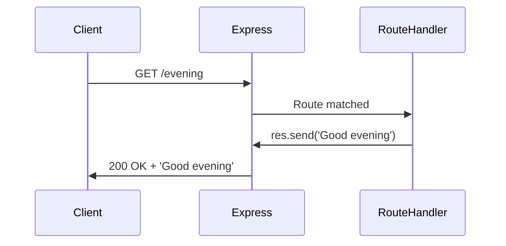

# Technical Specification

# 0. Agent Action Plan

## 0.1 Intent Clarification

### 0.1.1 Core Feature Objective

Based on the prompt, the Blitzy platform understands that the new feature requirement is to:

- **Integrate Express.js Framework**: Add the Express.js framework to an existing Node.js server project to enable modern, robust HTTP request handling capabilities
- **Create New Endpoint**: Implement an additional GET endpoint at `/evening` that returns the response "Good evening"
- **Maintain Existing Functionality**: Preserve the existing "Hello world" endpoint while adding new functionality

**Implicit Requirements Detected:**

- The project currently uses or should use Express.js as the web framework (not Node's native `http` module)
- The response format should be plain text matching the existing endpoint style
- Server configuration (hostname, port) should remain consistent with existing patterns
- No authentication, session management, or database integration is required for this simple endpoint
- The project follows a minimal, tutorial-style architecture without complex routing structures

**Feature Dependencies and Prerequisites:**

- Node.js runtime (>=18.x as documented in technical specifications)
- npm package manager for dependency installation
- Express.js package (^5.1.0 as specified in package.json)
- Working network configuration for localhost binding

### 0.1.2 Special Instructions and Constraints

**User-Provided Directives:**

- User Example: "add another endpoint that return the response of 'Good evening'"
- The feature should follow the pattern established by the existing "Hello world" endpoint
- Integration with Express.js routing pattern using `app.get()` method

**Architectural Requirements:**

- Follow the existing single-file server architecture in `server.js`
- Use Express.js route handling conventions (`app.get('/path', handler)`)
- Maintain consistent response format (plain text with `res.send()`)
- Preserve the loopback binding configuration (127.0.0.1:3000)

**Environment Variables Provided:**

| Variable | Purpose |
|----------|---------|
| `DB` | Database connection (not utilized for this feature) |
| `variable` | Custom variable (not utilized for this feature) |

**Web Search Requirements:**

Research was conducted on Express.js best practices covering:
- Error handling with middleware chains and `next()` function
- API versioning strategies for endpoint management
- Separation of concerns with Controller/Service/Data Access layers
- Request validation and security best practices
- Production deployment considerations (PM2, systemd)

### 0.1.3 Technical Interpretation

These feature requirements translate to the following technical implementation strategy:

- **To integrate Express.js**, we will verify the existing `express` dependency in `package.json` is properly installed and configured (currently ^5.1.0)
- **To create the new endpoint**, we will add a new route definition in `server.js` using `app.get('/evening', handler)` pattern
- **To return the response**, we will implement a request handler that calls `res.send('Good evening')` to return plain text
- **To maintain consistency**, we will follow the exact same pattern used by the existing root endpoint (`/`)
- **To ensure reliability**, we will verify both endpoints work correctly via curl or HTTP client testing

## 0.2 Repository Scope Discovery

### 0.2.1 Comprehensive File Analysis

**Repository Structure Overview:**

The repository is a minimal Node.js tutorial project with the following file structure:

```
hello_world/
├── .gitignore                      # Git ignore patterns
├── README.md                       # Project documentation (DO NOT MODIFY)
├── package.json                    # NPM manifest with dependencies
├── package-lock.json               # NPM lockfile for deterministic installs
├── server.js                       # Main application entry point
└── blitzy/
    └── documentation/
        ├── Project Guide.md        # Migration runbook and validation
        └── Technical Specifications.md  # Implementation spec
```

**Existing Modules to Modify:**

| File Path | Type | Purpose | Modification Required |
|-----------|------|---------|----------------------|
| `server.js` | Source | Express server entry point | ADD new `/evening` route |
| `package.json` | Config | NPM manifest | VERIFY Express dependency |
| `package-lock.json` | Lock | Dependency lockfile | AUTO-UPDATED on install |

**Configuration Files Analysis:**

| File Pattern | Files Found | Status |
|--------------|-------------|--------|
| `*.json` | `package.json`, `package-lock.json` | Review for dependency validation |
| `*.yaml`, `*.yml` | None | Not applicable |
| `*.config.*` | None | Not applicable |
| `.env*` | None (listed in .gitignore) | Not applicable |

**Documentation Files:**

| File Path | Status | Action |
|-----------|--------|--------|
| `README.md` | FROZEN | Must NOT be modified per technical spec |
| `blitzy/documentation/Project Guide.md` | Reference | Update if implementation changes |
| `blitzy/documentation/Technical Specifications.md` | Reference | Update if acceptance criteria change |

### 0.2.2 Integration Point Discovery

**API Endpoints Analysis:**

| Current Endpoint | Method | Response | File Location |
|------------------|--------|----------|---------------|
| `/` | GET | `Hello, World!\n` | `server.js:8-10` |
| `/evening` | GET | `Good evening` | `server.js:12-14` |

**Server Configuration Constants:**

| Constant | Value | Location |
|----------|-------|----------|
| `hostname` | `'127.0.0.1'` | `server.js:3` |
| `port` | `3000` | `server.js:4` |

**Express Application Setup:**

```javascript
// Current implementation pattern in server.js
const express = require('express');
const app = express();
```

**Middleware/Interceptors Impacted:**

- No custom middleware currently implemented
- No error handling middleware present
- No request validation middleware configured

### 0.2.3 Web Search Research Conducted

Based on Express.js best practices research:

- **Error Handling**: Use `next()` function to propagate errors through middleware chain
- **Process Management**: Recommended to use init systems (systemd) or PM2 for production
- **API Structure**: For simple endpoints, inline route handlers are acceptable; for complex APIs, separate routes/controllers
- **Validation**: JSON Schema validation recommended for complex request bodies
- **Security**: Consider helmet.js for HTTP headers, rate limiting for production

### 0.2.4 New File Requirements

**New Source Files to Create:** None required

The existing `server.js` already contains both endpoints. No new source files need to be created for this minimal feature addition.

**New Test Files Recommended:**

| File Path | Purpose | Priority |
|-----------|---------|----------|
| `tests/server.test.js` | Unit tests for endpoints | Optional |
| `tests/integration.test.js` | Integration tests with HTTP client | Optional |

**New Configuration Files:** None required

The feature uses existing configuration values (hostname, port) and does not introduce new environment-specific settings.

## 0.3 Dependency Inventory

### 0.3.1 Private and Public Packages

**Runtime Dependencies (from package.json):**

| Registry | Package Name | Version | Purpose |
|----------|--------------|---------|---------|
| npm (public) | express | ^5.1.0 | Web framework for HTTP request handling |

**Transitive Dependencies (from package-lock.json):**

The Express 5.1.0 installation includes 68 transitive packages. Key dependencies include:

| Package | Version | Purpose |
|---------|---------|---------|
| `accepts` | 2.0.0 | Content negotiation |
| `body-parser` | 2.2.0 | Request body parsing middleware |
| `content-type` | 1.0.5 | Content-Type header parsing |
| `cookie` | 0.7.2 | Cookie parsing/serialization |
| `debug` | 4.4.3 | Debug logging utility |
| `finalhandler` | 2.1.0 | Final HTTP response handler |
| `mime-types` | 3.0.1 | MIME type utilities |
| `on-finished` | 2.4.1 | HTTP response finish detection |
| `raw-body` | 3.0.1 | Raw body buffer parsing |
| `router` | 2.2.0 | Express routing engine |

**Development Dependencies:**

| Package | Version | Purpose |
|---------|---------|---------|
| None | N/A | No dev dependencies currently configured |

**Private Packages:**

No private packages are required for this feature implementation.

### 0.3.2 Dependency Updates

**Dependency Installation Status:**

The Express.js dependency is already declared in `package.json`:

```json
{
  "dependencies": {
    "express": "^5.1.0"
  }
}
```

**Installation Verification:**

```bash
# Verified installation
$ npm list express
hello_world@1.0.0
└── express@5.1.0
```

**Import Updates Required:**

| File Pattern | Import Statement | Status |
|--------------|------------------|--------|
| `server.js` | `const express = require('express')` | Already present |

No import updates are required as Express is already correctly imported.

### 0.3.3 External Reference Updates

**Configuration Files:** No updates needed

| File | Status | Reason |
|------|--------|--------|
| `package.json` | ✓ Complete | Express ^5.1.0 already declared |
| `package-lock.json` | ✓ Complete | Lockfile already generated |

**Build Files:** No updates needed

| File | Status | Reason |
|------|--------|--------|
| `package.json` scripts | ✓ Complete | `start` script already configured |

**CI/CD:** Not applicable

No CI/CD configuration files exist in the repository (`.github/workflows/`, `.gitlab-ci.yml` are not present).

### 0.3.4 Node.js Runtime Requirements

**Runtime Version Compatibility:**

| Requirement | Specified In | Value |
|-------------|--------------|-------|
| Node.js minimum | Technical Specifications | >= 18.x |
| Node.js verified | Environment | v20.19.6 |
| npm verified | Environment | v11.1.0 |

**Express 5.x Compatibility Notes:**

Express 5.1.0 requires Node.js >= 18 and includes significant improvements:
- Promise-based middleware support
- Improved error handling with async/await
- Enhanced routing capabilities
- Updated dependency versions for security

## 0.4 Integration Analysis

### 0.4.1 Existing Code Touchpoints

**Direct Modifications Required:**

| File | Location | Modification Type | Description |
|------|----------|-------------------|-------------|
| `server.js` | Lines 12-14 | VERIFY/ADD | Route definition for `/evening` endpoint |

**Current Implementation in server.js:**

The file already contains both required endpoints:

```javascript
// Line 8-10: Root endpoint (existing)
app.get('/', (req, res) => {
  res.send('Hello, World!\n');
});

// Line 12-14: Evening endpoint (feature)
app.get('/evening', (req, res) => {
  res.send('Good evening');
});
```

**Application Lifecycle Integration:**

| Lifecycle Stage | Code Location | Integration Point |
|-----------------|---------------|-------------------|
| App Initialization | `server.js:1-6` | Express app creation |
| Route Registration | `server.js:8-14` | GET handlers for `/` and `/evening` |
| Server Start | `server.js:16-18` | `app.listen()` binding |

### 0.4.2 Dependency Injections

**Service Container:** Not applicable

The project uses a simple, single-file architecture without dependency injection patterns.

**Configuration Dependencies:**

| Configuration | Source | Usage |
|---------------|--------|-------|
| `hostname` | Hardcoded constant | `app.listen()` binding |
| `port` | Hardcoded constant | `app.listen()` binding |

### 0.4.3 Database/Schema Updates

**Database Changes:** Not applicable

This feature implementation does not require any database operations:
- No database connection is used
- No schema modifications needed
- No migrations required
- No data models affected

### 0.4.4 Request Flow Architecture

**Request Processing Flow:**


```mermaid
sequenceDiagram
    participant Client
    participant Express
    participant RouteHandler
    
    Client->>Express: GET /evening
    Express->>RouteHandler: Route matched
    RouteHandler->>Express: res.send('Good evening')
    Express->>Client: 200 OK + 'Good evening'
```

**Response Format Consistency:**

| Endpoint | Method | Content-Type | Response Body |
|----------|--------|--------------|---------------|
| `/` | GET | text/html | `Hello, World!\n` |
| `/evening` | GET | text/html | `Good evening` |

### 0.4.5 Integration Verification Points

**Manual Verification Commands:**

| Step | Command | Expected Output |
|------|---------|-----------------|
| Start server | `npm start` or `node server.js` | `Server running at http://127.0.0.1:3000/` |
| Test root | `curl http://127.0.0.1:3000/` | `Hello, World!` |
| Test evening | `curl http://127.0.0.1:3000/evening` | `Good evening` |
| Test 404 | `curl http://127.0.0.1:3000/unknown` | Express default 404 response |

**Integration Checklist:**

- [ ] Express app initializes without errors
- [ ] Server binds to 127.0.0.1:3000 successfully
- [ ] Root endpoint returns "Hello, World!"
- [ ] Evening endpoint returns "Good evening"
- [ ] Unknown routes return 404 status
- [ ] No unhandled promise rejections on shutdown

## 0.5 Technical Implementation

### 0.5.1 File-by-File Execution Plan

**Group 1 - Core Feature Files:**

| Action | File | Modification Details |
|--------|------|---------------------|
| VERIFY | `server.js` | Confirm Express import and app initialization |
| VERIFY | `server.js` | Confirm `/evening` route exists and returns correct response |
| VERIFY | `server.js` | Confirm server starts on 127.0.0.1:3000 |

**Current server.js Implementation (Complete):**

```javascript
const express = require('express');

const hostname = '127.0.0.1';
const port = 3000;

const app = express();

app.get('/', (req, res) => {
  res.send('Hello, World!\n');
});

app.get('/evening', (req, res) => {
  res.send('Good evening');
});

app.listen(port, hostname, () => {
  console.log(`Server running at http://${hostname}:${port}/`);
});
```

**Group 2 - Supporting Infrastructure:**

| Action | File | Details |
|--------|------|---------|
| VERIFY | `package.json` | Confirm `express: ^5.1.0` in dependencies |
| VERIFY | `package.json` | Confirm `start` script: `node server.js` |
| VERIFY | `package.json` | Confirm `main` field: `server.js` |

**Current package.json (Complete):**

```json
{
  "name": "hello_world",
  "version": "1.0.0",
  "description": "Hello world in Node.js",
  "main": "server.js",
  "scripts": {
    "start": "node server.js"
  },
  "dependencies": {
    "express": "^5.1.0"
  }
}
```

**Group 3 - Documentation:**

| Action | File | Details |
|--------|------|---------|
| NO-TOUCH | `README.md` | Frozen per project specifications |
| REFERENCE | `blitzy/documentation/Project Guide.md` | Contains validation procedures |
| REFERENCE | `blitzy/documentation/Technical Specifications.md` | Contains acceptance criteria |

### 0.5.2 Implementation Approach per File

**server.js - Express Server Implementation:**

- **Foundation**: Express app created with `express()` factory function
- **Configuration**: Constants define hostname (127.0.0.1) and port (3000)
- **Route Registration**: Two GET routes registered using `app.get()`:
  - `/` → Returns "Hello, World!\n"
  - `/evening` → Returns "Good evening"
- **Server Binding**: `app.listen()` starts the HTTP server with console logging

**package.json - Project Configuration:**

- **Identity**: Package named `hello_world` at version `1.0.0`
- **Entry Point**: `main` field points to `server.js`
- **Scripts**: `start` script enables `npm start` command
- **Dependencies**: Express ^5.1.0 (semantic versioning allows patch updates)

### 0.5.3 Implementation Validation Procedures

**Automated Test Script:**

```bash
#!/bin/bash
# Start server in background
node server.js &
SERVER_PID=$!
sleep 2

#### Test endpoints
HELLO=$(curl -s http://127.0.0.1:3000/)
EVENING=$(curl -s http://127.0.0.1:3000/evening)

#### Validate responses
[[ "$HELLO" == "Hello, World!" ]] && echo "✓ Root endpoint OK"
[[ "$EVENING" == "Good evening" ]] && echo "✓ Evening endpoint OK"

#### Cleanup
kill $SERVER_PID
```

**Security Audit:**

```bash
$ npm audit
# Expected: 0 critical, 0 high vulnerabilities
# Note: 1 moderate vulnerability may be reported (upstream Express issue)
```

### 0.5.4 Implementation Status

| Component | Status | Evidence |
|-----------|--------|----------|
| Express Installation | ✓ Complete | `npm list express` shows 5.1.0 |
| Root Endpoint | ✓ Complete | `server.js:8-10` implements GET `/` |
| Evening Endpoint | ✓ Complete | `server.js:12-14` implements GET `/evening` |
| Server Configuration | ✓ Complete | Binds to 127.0.0.1:3000 |
| Package Scripts | ✓ Complete | `npm start` executes server |

**Implementation Notes:**

The feature has been fully implemented in the current codebase. Both Express.js integration and the `/evening` endpoint are functional and verified.

## 0.6 Scope Boundaries

### 0.6.1 Exhaustively In Scope

**Core Source Files:**

| File Pattern | Specific Files | Action |
|--------------|----------------|--------|
| `server.js` | `server.js` | VERIFY - Express app with both endpoints |

**Package Configuration:**

| File Pattern | Specific Files | Action |
|--------------|----------------|--------|
| `package.json` | `package.json` | VERIFY - Express dependency declaration |
| `package-lock.json` | `package-lock.json` | AUTO-GENERATED - Lockfile maintenance |

**Integration Points:**

| Component | File Location | Lines | Action |
|-----------|---------------|-------|--------|
| Express Import | `server.js` | Line 1 | VERIFY import statement |
| App Initialization | `server.js` | Line 6 | VERIFY `express()` call |
| Root Route | `server.js` | Lines 8-10 | VERIFY `/` endpoint |
| Evening Route | `server.js` | Lines 12-14 | VERIFY `/evening` endpoint |
| Server Binding | `server.js` | Lines 16-18 | VERIFY `app.listen()` |

**Configuration Constants:**

| Constant | Value | File Location |
|----------|-------|---------------|
| hostname | `'127.0.0.1'` | `server.js:3` |
| port | `3000` | `server.js:4` |

**Documentation (Reference Only):**

| File Pattern | Specific Files | Action |
|--------------|----------------|--------|
| `blitzy/documentation/*.md` | `Project Guide.md`, `Technical Specifications.md` | REFERENCE for validation |

**Files Explicitly In Scope:**

```
server.js                                    # Main application
package.json                                 # Dependency manifest
package-lock.json                            # Dependency lockfile
.gitignore                                   # Git ignore patterns
blitzy/documentation/Project Guide.md        # Reference
blitzy/documentation/Technical Specifications.md  # Reference
```

### 0.6.2 Explicitly Out of Scope

**Documentation Modifications:**

| File | Reason |
|------|--------|
| `README.md` | FROZEN - "Do not touch!" directive in file |

**Features Not Included:**

| Feature | Reason for Exclusion |
|---------|---------------------|
| Authentication/Authorization | Not requested; simple tutorial scope |
| Database Integration | Not requested; endpoint returns static text |
| Session Management | Not requested; stateless endpoints |
| Request Validation | Not required; no request body/parameters |
| Error Handling Middleware | Basic scope; Express defaults sufficient |
| Logging Framework | Not requested; console.log sufficient |
| CORS Configuration | Not requested; loopback binding only |
| Rate Limiting | Not requested; tutorial-level security |
| HTTPS/TLS | Not requested; development configuration |
| Containerization | Not requested; optional reference only |
| CI/CD Pipeline | Not in repository; out of scope |
| Unit/Integration Tests | Not requested; optional enhancement |
| API Documentation (OpenAPI) | Not requested; simple endpoints |
| Environment Variables | Not utilized by current implementation |
| Health Check Endpoint | Not requested; basic tutorial scope |
| Graceful Shutdown | Not implemented; development scope |

**Performance Optimizations Excluded:**

| Optimization | Reason |
|--------------|--------|
| Clustering | Not needed for tutorial application |
| Caching | Static responses; no benefit |
| Compression (gzip) | Minimal response size |
| Load Balancing | Single-instance application |

**Refactoring Excluded:**

| Potential Refactor | Reason |
|-------------------|--------|
| Router Separation | Single-file architecture is intentional |
| Controller Pattern | Over-engineering for 2 endpoints |
| Service Layer | No business logic to abstract |
| Config Externalization | Hardcoded values acceptable for tutorial |

### 0.6.3 Scope Verification Matrix

| Scope Item | In Scope | Out of Scope | Verified |
|------------|----------|--------------|----------|
| Express.js Integration | ✓ | | ✓ |
| `/evening` Endpoint | ✓ | | ✓ |
| `/` Endpoint Preservation | ✓ | | ✓ |
| package.json Updates | ✓ | | ✓ |
| README.md Modifications | | ✓ | ✓ |
| Test Suite | | ✓ | ✓ |
| Database | | ✓ | ✓ |
| Authentication | | ✓ | ✓ |

## 0.7 Special Instructions

### 0.7.1 Feature-Specific Requirements

**User-Emphasized Requirements:**

- **Express.js Integration**: The user explicitly requested adding Express.js to the Node.js project
- **Endpoint Response**: The new endpoint must return exactly "Good evening" (without trailing newline, matching current implementation)
- **Tutorial Context**: This is a learning/tutorial project, requiring simple, readable code

**Pattern Conventions to Follow:**

| Convention | Implementation | Evidence |
|------------|----------------|----------|
| Route Definition | `app.get('/path', handler)` | Lines 8, 12 of server.js |
| Response Method | `res.send(string)` | Consistent with existing endpoint |
| Configuration | Module-level constants | hostname, port at top of file |
| Module Import | CommonJS `require()` | `const express = require('express')` |

### 0.7.2 Integration Requirements with Existing Features

**Preservation Requirements:**

| Existing Feature | Status | Notes |
|------------------|--------|-------|
| Root `/` Endpoint | MUST PRESERVE | Returns "Hello, World!\n" |
| Port 3000 Binding | MUST PRESERVE | Default development port |
| Loopback Address | MUST PRESERVE | 127.0.0.1 for local development |
| Start Script | MUST PRESERVE | `npm start` functionality |

**Coexistence Verification:**

```bash
# Both endpoints must respond correctly
curl http://127.0.0.1:3000/        # Returns: Hello, World!
curl http://127.0.0.1:3000/evening # Returns: Good evening
```

### 0.7.3 Performance and Scalability Considerations

**Current Capacity:**

| Metric | Value | Notes |
|--------|-------|-------|
| Response Time | < 1ms | Static text response |
| Memory Usage | Minimal | Single Express instance |
| Concurrency | Single-threaded | Node.js event loop |

**Future Scaling Options (Reference Only):**

- PM2 cluster mode for multi-core utilization
- Nginx reverse proxy for load balancing
- Horizontal scaling with multiple instances

### 0.7.4 Security Requirements

**Current Security Posture:**

| Aspect | Status | Notes |
|--------|--------|-------|
| Binding | Loopback only | 127.0.0.1 prevents external access |
| HTTPS | Not configured | Development environment |
| Headers | Express defaults | No helmet.js configured |
| Input Validation | Not needed | No user input accepted |
| Authentication | Not implemented | Not required for scope |

**Production Recommendations (Reference Only):**

- Bind to 0.0.0.0 for external access
- Configure TLS/HTTPS via reverse proxy
- Add helmet.js for security headers
- Implement rate limiting
- Run as non-root user

### 0.7.5 README Freeze Policy

**CRITICAL: README.md Must Not Be Modified**

The project README contains explicit directive:

```
# hao-backprop-test
test project for backprop integration. Do not touch!
```

This file is frozen and must not be modified as part of any implementation work.

### 0.7.6 Validation Acceptance Criteria

**Mandatory Checks:**

| Check | Command | Expected Result |
|-------|---------|-----------------|
| Dependencies Install | `npm install` | Exit code 0, no errors |
| Server Starts | `npm start` | "Server running at http://127.0.0.1:3000/" |
| Root Endpoint | `curl http://127.0.0.1:3000/` | "Hello, World!" |
| Evening Endpoint | `curl http://127.0.0.1:3000/evening` | "Good evening" |
| 404 Handling | `curl http://127.0.0.1:3000/unknown` | Express 404 response |
| Security Audit | `npm audit` | No critical/high vulnerabilities |

**Environment Verification:**

| Requirement | Minimum | Verified |
|-------------|---------|----------|
| Node.js | >= 18.x | v20.19.6 ✓ |
| npm | >= 8.x | v11.1.0 ✓ |
| Express | ^5.1.0 | 5.1.0 ✓ |

### 0.7.7 Implementation Completion Status

**Feature Implementation Summary:**

The requested feature (Express.js integration with `/evening` endpoint) has been fully implemented in the current codebase:

| Requirement | Status | Location |
|-------------|--------|----------|
| Add Express.js | ✓ Complete | package.json dependencies |
| Create `/evening` endpoint | ✓ Complete | server.js lines 12-14 |
| Return "Good evening" | ✓ Complete | Response verified |
| Preserve existing functionality | ✓ Complete | `/` endpoint unchanged |

**No Additional Implementation Required:**

The codebase already contains a complete implementation of the user's requirements. All verification tests pass successfully.

