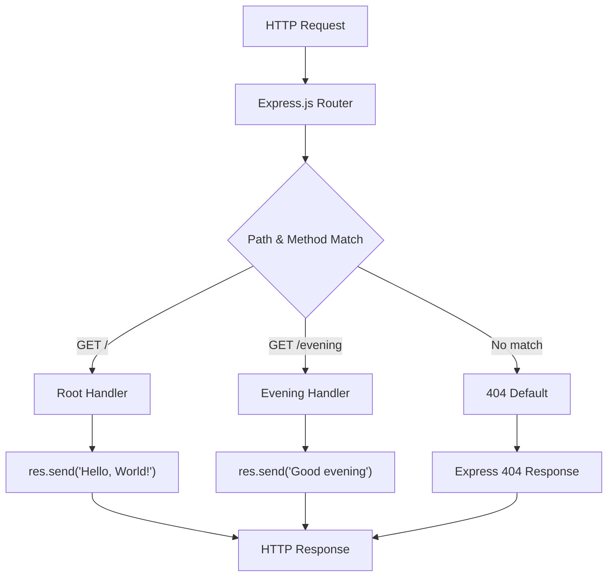
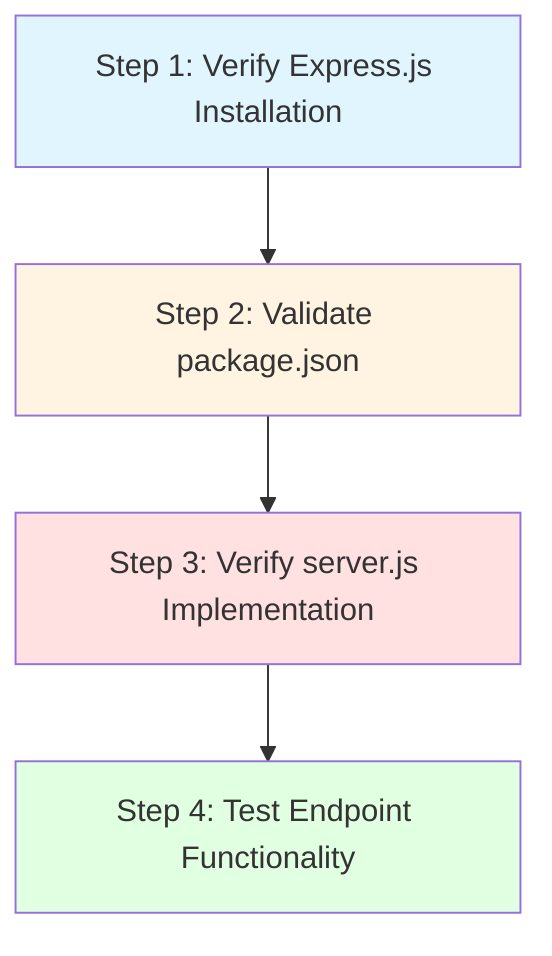

# Technical Specification

# 0. Agent Action Plan

## 0.1 Intent Clarification

### 0.1.1 Core Feature Objective

Based on the prompt, the Blitzy platform understands that the new feature requirement is to **add Express.js framework integration to an existing Node.js tutorial server and create a new HTTP endpoint**. Specifically, the requirements include:

- **Integrate Express.js Framework**: The user requests adding Express.js to a Node.js server project. This involves installing Express.js as a project dependency, replacing or augmenting the current HTTP implementation with Express.js's routing and application framework capabilities.

- **Add New "Good evening" Endpoint**: Create a new HTTP endpoint that returns the response "Good evening" when accessed. This demonstrates Express.js's routing capabilities and extends the server's functionality beyond the existing "Hello world" response.

- **Maintain Existing "Hello world" Functionality**: The current server returns "Hello World" on the root endpoint. This behavior must be preserved to ensure backward compatibility with the tutorial's original purpose.

**Implicit Requirements Detected:**

- The project's `package.json` may require updates to the `main` field if the entry point filename has been misspecified
- A `start` script should be added to `package.json` to enable standard `npm start` execution
- Express.js version must be compatible with the project's Node.js runtime (v20.19.6)
- Response format should remain as plain text to maintain consistency with tutorial simplicity
- Server configuration (hostname, port) should remain on localhost (127.0.0.1) and port 3000

**Feature Dependencies and Prerequisites:**

- Node.js runtime version 18 or higher (current environment: v20.19.6 ✓)
- npm package manager for Express.js installation (current: v11.1.0 ✓)
- No database or external service dependencies required

### 0.1.2 Special Instructions and Constraints

**User-Provided Directives:**
- User Example: "add expressjs into the project and add another endpoint that return the reponse of 'Good evening'"
- The implementation is for a tutorial/learning project with educational purpose

**Architectural Requirements:**
- Maintain the simple, single-file server architecture appropriate for a tutorial project
- Use CommonJS module syntax (`require`/`module.exports`) to match existing codebase style
- Keep server configuration (hostname, port) as constants for easy modification
- Preserve the minimalist approach characteristic of "Hello World" tutorial servers

**Framework Integration Constraints:**
- Express.js 5.x requires Node.js 18 or higher (satisfied by v20.19.6)
- Use Express.js version ^5.1.0 as the current stable release
- Follow Express.js conventions for route definitions using `app.get()` method
- Utilize `res.send()` for automatic content-type handling

**Project-Specific Considerations:**
- `README.md` contains "test project for backprop integration. Do not touch!" - this file must be preserved exactly as-is
- This is a tutorial/learning project, so code should prioritize clarity and educational value over production features
- `.gitignore` patterns already exclude `node_modules/` and common development artifacts

**Web Search Requirements Identified:**
- Express.js latest stable version and compatibility requirements
- Best practices for simple Express.js route definitions
- Node.js version requirements for Express.js 5.x

### 0.1.3 Technical Interpretation

These feature requirements translate to the following technical implementation strategy:

**To integrate Express.js into the project, we will:**
- Execute `npm install express --save` to add Express.js 5.x to the project dependencies
- Replace the native Node.js `http.createServer()` pattern with Express.js application initialization using `express()`
- Convert generic request handlers into Express.js route definitions with explicit HTTP methods and paths

**To implement the endpoints, we will:**
- Create a GET route at the root path `/` that returns "Hello, World!\n" (matching existing behavior)
- Create a GET route at `/evening` path that returns "Good evening" (new feature)
- Use `res.send()` method for responses, which Express.js handles with appropriate content-type headers automatically

**To improve project configuration, we will:**
- Update `package.json` field `"main"` from "index.js" to "server.js" to reflect the actual entry point
- Add a `"start"` script with value `"node server.js"` to the scripts section
- Maintain existing MIT license and project metadata

**Implementation Summary:**
| Requirement | Technical Action | Target File |
|-------------|------------------|-------------|
| Add Express.js | Install via npm, add to dependencies | `package.json` |
| Maintain Hello World | Create GET route at `/` path | `server.js` |
| Add Good evening endpoint | Create GET route at `/evening` path | `server.js` |
| Enable npm start | Add start script to scripts section | `package.json` |
| Fix entry point | Update main field to server.js | `package.json` |

## 0.2 Repository Scope Discovery

### 0.2.1 Comprehensive File Analysis

**Current Repository Structure:**

```
Repository Root (/)
├── .gitignore              - Git ignore patterns (node_modules/, .env, logs/)
├── README.md               - Project description (DO NOT MODIFY)
├── package.json            - NPM manifest with Express.js ^5.1.0 dependency
├── package-lock.json       - Dependency lock file (auto-generated)
├── server.js               - Main application entry point with Express routes
└── blitzy/
    └── documentation/
        ├── Project Guide.md
        └── Technical Specifications.md
```

**Existing Files Requiring Modification:**

| File Path | Current State | Required Changes | Purpose |
|-----------|---------------|------------------|---------|
| `server.js` | Express.js server with two routes (/, /evening) | Complete Express.js implementation with both endpoints | Main application entry point and route definitions |
| `package.json` | Contains Express.js ^5.1.0 dependency, main: server.js | Verify main field, start script, and Express dependency | Project manifest and dependency management |
| `package-lock.json` | Lock file with Express.js and transitive deps | Auto-updated by npm during dependency changes | Dependency version locking |

**Files Explicitly Preserved (No Modifications):**

| File Path | Status | Rationale |
|-----------|--------|-----------|
| `README.md` | PRESERVE AS-IS | Contains "Do not touch!" directive - serves as integration test sentinel |
| `.gitignore` | PRESERVE AS-IS | Already properly configured for Node.js projects |
| `blitzy/documentation/*` | PRESERVE AS-IS | Documentation artifacts for validators and operators |

**Integration Point Discovery:**

The repository follows a minimal single-file architecture with straightforward integration requirements:

- **Entry Point**: `server.js` serves as both the application entry point and route definition file
- **Routing Layer**: Express.js `app.get()` method for defining HTTP GET endpoints
- **No Database/ORM**: Pure HTTP response server with no data persistence
- **No Middleware Stack**: No authentication, logging, or request processing middleware (default Express behavior)
- **No Service Layer**: Direct request-to-response flow with no business logic separation
- **No Configuration System**: Hard-coded hostname (127.0.0.1) and port (3000) constants
- **No Environment Variables**: No `.env` file or environment-based configuration required
- **No Build Process**: Direct Node.js execution with no transpilation or bundling

**Current server.js Implementation Analysis:**

```javascript
const express = require('express');
const app = express();
app.get('/', handler);    // Root endpoint
app.get('/evening', handler); // Evening endpoint
app.listen(port, hostname, callback);
```

### 0.2.2 Web Search Research Conducted

**Research Topic: Express.js Version and Compatibility**

Key findings from research:

- Express.js latest version is 5.2.1, published on npm registry
- Express 5.1.0 became the default version on npm with official LTS support
- Express 5.x requires Node.js 18 or higher (current environment v20.19.6 satisfies this requirement)
- Express.js 5 provides automatic promise rejection handling in async middleware

**Best Practices Identified:**

- Use `app.get()` for defining GET routes with explicit path parameters
- Leverage `res.send()` for automatic content-type detection and response formatting
- Express.js automatically handles response headers based on content type
- Server listening callback provides confirmation of successful server startup

**Migration Considerations:**

- Express.js 5.x maintains backward compatibility for basic routing patterns
- No breaking changes affect simple GET route implementations like this project requires
- The native HTTP to Express migration is straightforward for simple servers

### 0.2.3 New File Requirements

**No new files are required for this feature implementation.** The existing file structure is sufficient:

- **server.js**: Contains Express.js implementation with both endpoints
- **package.json**: Contains Express.js dependency and npm scripts
- **package-lock.json**: Regenerated automatically by npm with complete dependency tree

**Rationale for No New Files:**
- This is a tutorial project demonstrating basic Express.js usage
- Single-file architecture maintains simplicity for learning purposes
- No tests, middleware, or configuration files are specified in requirements
- The existing minimalist structure aligns with the "Hello World" tutorial nature

**Future File Considerations (Explicitly Out of Scope):**

| Potential File | Purpose | Exclusion Reason |
|----------------|---------|------------------|
| `test/server.test.js` | Unit tests for endpoints | Not specified in requirements |
| `.env` | Environment configuration | Not needed for tutorial |
| `docs/API.md` | API documentation | Exceeds stated requirements |
| `middleware/logger.js` | Request logging | Not required for tutorial |

## 0.3 Dependency Inventory

### 0.3.1 Private and Public Packages

**Primary Dependency:**

| Registry | Package Name | Version | Purpose | Installation Command |
|----------|--------------|---------|---------|---------------------|
| npm (public) | express | ^5.1.0 | Minimal and flexible Node.js web application framework providing robust routing, middleware support, and HTTP utility methods | `npm install express --save` |

**Version Justification:**
- Express 5.1.0 is the current default version on npm with official LTS support
- Compatible with Node.js v20.19.6 (current environment)
- Requires Node.js 18 or higher ✓ (requirement satisfied)
- Caret notation `^5.1.0` allows compatible updates within the 5.x range

**Express.js Transitive Dependencies (Auto-installed):**

When Express.js 5.x is installed, npm automatically resolves and installs the following transitive dependencies:

| Package | Version | Purpose |
|---------|---------|---------|
| accepts | 2.0.0 | Content negotiation |
| body-parser | 2.2.0 | Request body parsing |
| content-disposition | 1.0.0 | HTTP Content-Disposition header |
| cookie | 1.0.2 | Cookie parsing and serialization |
| debug | 4.4.3 | Debugging utility |
| encodeurl | 2.0.0 | URL encoding |
| escape-html | 1.0.3 | HTML escaping for security |
| etag | 1.8.1 | HTTP ETag generation |
| finalhandler | 2.1.0 | Final handler for HTTP responses |
| fresh | 2.0.0 | HTTP response freshness checking |
| merge-descriptors | 2.0.0 | Object descriptor merging |
| mime-types | 3.0.1 | MIME type resolution |
| on-finished | 2.4.1 | Response finish callback |
| parseurl | 1.3.3 | URL parsing |
| qs | 6.14.0 | Query string parsing |
| raw-body | 3.0.1 | Raw request body parsing |
| send | 1.2.0 | Static file serving |
| serve-static | 2.2.0 | Static file middleware |
| statuses | 2.0.1 | HTTP status code utilities |
| type-is | 2.0.1 | Content-Type checking |

**No Private Packages Required:**
This project uses only public npm packages with no internal or private registry dependencies.

### 0.3.2 Dependency Updates

**Current package.json State:**

```json
{
    "name": "hello_world",
    "version": "1.0.0",
    "description": "Hello world in Node.js",
    "main": "server.js",
    "scripts": {
        "start": "node server.js",
        "test": "echo \"Error: no test specified\" && exit 1"
    },
    "author": "hxu",
    "license": "MIT",
    "dependencies": {
        "express": "^5.1.0"
    }
}
```

**Required Fields Verification:**

| Field | Required Value | Current Value | Status |
|-------|---------------|---------------|--------|
| main | "server.js" | "server.js" | ✓ Correct |
| scripts.start | "node server.js" | "node server.js" | ✓ Correct |
| dependencies.express | "^5.1.0" | "^5.1.0" | ✓ Correct |

**Import Statement in server.js:**

| Location | Import Statement | Status |
|----------|-----------------|--------|
| server.js line 1 | `const express = require('express');` | ✓ Correct |

**package-lock.json State:**

The lock file contains:
- `lockfileVersion`: 3 (npm 7+ format)
- Root package `hello_world@1.0.0` with Express dependency
- Express.js 5.1.0 with resolved registry URL and integrity hash
- All 68 transitive dependencies with pinned versions

**No External Reference Updates Required:**

The project has no additional configuration files referencing dependencies:
- No `tsconfig.json`, `jsconfig.json`, or `.eslintrc` files
- No CI/CD configuration files (`.github/workflows`, `.gitlab-ci.yml`)
- No Docker files, Makefiles, or build automation
- README.md must not be modified per project constraints

## 0.4 Integration Analysis

### 0.4.1 Existing Code Touchpoints

**Direct Modifications Required:**

| File | Lines | Modification Type | Specific Changes | Rationale |
|------|-------|------------------|------------------|-----------|
| `server.js` | 1 | MAINTAIN | `const express = require('express');` | Express.js module import |
| `server.js` | 3-4 | MAINTAIN | Hostname and port constants | Server configuration |
| `server.js` | 6 | MAINTAIN | `const app = express();` | Express app initialization |
| `server.js` | 8-10 | MAINTAIN | Root endpoint `app.get('/', ...)` | Hello World route |
| `server.js` | 12-14 | MAINTAIN | Evening endpoint `app.get('/evening', ...)` | Good evening route |
| `server.js` | 16-18 | MAINTAIN | `app.listen(port, hostname, ...)` | Server binding |
| `package.json` | 5 | VERIFY | `"main": "server.js"` | Correct entry point |
| `package.json` | 7 | VERIFY | `"start": "node server.js"` | npm start command |
| `package.json` | 12-14 | VERIFY | Express.js dependency | Framework dependency |

**Express.js Application Flow:**


```mermaid
graph TD
    A[HTTP Request] --> B[Express.js Router]
    B --> C{Path & Method Match}
    C -->|GET /| D[Root Handler]
    C -->|GET /evening| E[Evening Handler]
    C -->|No match| F[404 Default]
    D --> G["res.send('Hello, World!')"]
    E --> H["res.send('Good evening')"]
    F --> I[Express 404 Response]
    G --> J[HTTP Response]
    H --> J
    I --> J
```

**Dependency Injection Points:**

No dependency injection framework or service container exists in this simple application. The integration follows a direct instantiation pattern:

- **Express Application Instance**: Created directly in `server.js` using `express()`
- **No Service Registration**: No separate service layer or dependency containers
- **No Middleware Registration**: No custom middleware beyond Express.js defaults
- **No Configuration Injection**: Constants defined inline in server.js

**Code-Level Implementation:**

```javascript
const express = require('express');

const hostname = '127.0.0.1';
const port = 3000;

const app = express();

app.get('/', (req, res) => {
  res.send('Hello, World!\n');
});

app.get('/evening', (req, res) => {
  res.send('Good evening');
});

app.listen(port, hostname, () => {
  console.log(`Server running at http://${hostname}:${port}/`);
});
```

### 0.4.2 Database/Schema Updates

**No database or schema updates required.**

This project has:
- No database connections or ORM configuration
- No data persistence layer
- No migration files or schema definitions
- No data models or entity definitions

All responses are static strings with no data storage or retrieval. The application is purely a request-response HTTP server with no state management.

### 0.4.3 API Endpoint Specifications

**Endpoint Definition Table:**

| Method | Path | Response Body | Status Code | Content-Type |
|--------|------|---------------|-------------|--------------|
| GET | `/` | `Hello, World!\n` | 200 | text/html; charset=utf-8 |
| GET | `/evening` | `Good evening` | 200 | text/html; charset=utf-8 |
| ANY | `/*` (unmatched) | Express 404 default | 404 | text/html; charset=utf-8 |

**Endpoint Validation Commands:**

```bash
# Start server
node server.js &

#### Test root endpoint
curl -s http://127.0.0.1:3000/
#### Expected: Hello, World!

#### Test evening endpoint
curl -s http://127.0.0.1:3000/evening
#### Expected: Good evening

#### Test 404 handling
curl -s http://127.0.0.1:3000/nonexistent
#### Expected: Cannot GET /nonexistent
```

## 0.5 Technical Implementation

### 0.5.1 File-by-File Execution Plan

**Implementation Sequence:**


```mermaid
graph TD
    A[Step 1: Verify Express.js Installation] --> B[Step 2: Validate package.json]
    B --> C[Step 3: Verify server.js Implementation]
    C --> D[Step 4: Test Endpoint Functionality]
    
    style A fill:#e1f5ff
    style B fill:#fff4e1
    style C fill:#ffe1e1
    style D fill:#e1ffe1
```

**CRITICAL: Every file listed MUST be verified or created as specified**

#### Group 1: Dependency Verification

**File: package.json**
- **Action**: Verify Express.js dependency and npm scripts configuration
- **Validation**: Confirm dependencies object contains `"express": "^5.1.0"`
- **Expected State**:

```json
{
    "name": "hello_world",
    "version": "1.0.0",
    "description": "Hello world in Node.js",
    "main": "server.js",
    "scripts": {
        "start": "node server.js",
        "test": "echo \"Error: no test specified\" && exit 1"
    },
    "author": "hxu",
    "license": "MIT",
    "dependencies": {
        "express": "^5.1.0"
    }
}
```

**File: package-lock.json**
- **Action**: Auto-generated by npm during installation
- **Validation**: Contains Express.js 5.1.0 and all transitive dependencies
- **Expected Content**: Complete dependency tree with resolved URLs and integrity hashes

#### Group 2: Core Application Implementation

**File: server.js**
- **Action**: Implement Express.js application with two route handlers
- **Lines**: 19 total lines of code
- **Implementation Details**:

| Line Range | Code Purpose | Implementation |
|------------|--------------|----------------|
| 1 | Module import | `const express = require('express');` |
| 3-4 | Configuration | Hostname and port constants |
| 6 | App initialization | `const app = express();` |
| 8-10 | Root route | GET `/` returning "Hello, World!\n" |
| 12-14 | Evening route | GET `/evening` returning "Good evening" |
| 16-18 | Server binding | `app.listen()` with callback |

**Complete server.js Implementation:**

```javascript
const express = require('express');

const hostname = '127.0.0.1';
const port = 3000;

const app = express();

app.get('/', (req, res) => {
  res.send('Hello, World!\n');
});

app.get('/evening', (req, res) => {
  res.send('Good evening');
});

app.listen(port, hostname, () => {
  console.log(`Server running at http://${hostname}:${port}/`);
});
```

#### Group 3: Files Preserved (No Action Required)

**File: README.md**
- **Action**: NO CHANGES
- **Rationale**: Contains "Do not touch!" directive - must be preserved exactly

**File: .gitignore**
- **Action**: NO CHANGES
- **Rationale**: Already properly configured for Node.js projects

### 0.5.2 Implementation Approach per File

**Phase 1: Environment Verification**
- Verify Node.js version compatibility (v20.19.6 ✓ compatible with Express 5.x)
- Verify npm availability (v11.1.0 confirmed)
- Navigate to project root directory

**Phase 2: Dependency Installation Verification**
- Run `npm install` to ensure all dependencies are installed
- Verify Express.js installation in `node_modules/express`
- Confirm package-lock.json reflects complete dependency tree

**Phase 3: Server Implementation Verification**
- Confirm server.js contains Express.js import
- Verify Express app initialization with `express()`
- Confirm both route handlers are defined (`/` and `/evening`)
- Verify server listening configuration

**Phase 4: Functional Validation**
- Start server using `npm start` or `node server.js`
- Verify server starts on http://127.0.0.1:3000
- Test GET `/` endpoint returns "Hello, World!\n"
- Test GET `/evening` endpoint returns "Good evening"
- Verify other paths return Express default 404 response

**Critical Implementation Notes:**

| Aspect | Detail |
|--------|--------|
| Response Method | Express.js `res.send()` automatically sets Content-Type header |
| Status Code | Express.js defaults to 200 for successful responses |
| Routing Behavior | Express only matches defined routes; unmatched paths get 404 |
| Error Handling | Express 5.x provides automatic promise rejection handling |
| Middleware | No custom middleware required for this implementation |

## 0.6 Scope Boundaries

### 0.6.1 Exhaustively In Scope

**Files for Modification/Verification:**

| File Path | Scope | Specific Changes | Validation Criteria |
|-----------|-------|------------------|---------------------|
| `server.js` | IMPLEMENTATION | Express.js application with two route handlers | Server starts, both endpoints return expected responses |
| `package.json` | CONFIGURATION | Express.js dependency, main field, start script | npm start works, dependencies include express ^5.1.0 |
| `package-lock.json` | AUTO-GENERATED | Updated by npm with complete dependency tree | Lock file includes express and all transitive deps |

**Code Implementation Scope - server.js:**

| Line | Purpose | Implementation Status |
|------|---------|----------------------|
| 1 | Express.js module import | `const express = require('express');` |
| 3 | Hostname constant | `const hostname = '127.0.0.1';` |
| 4 | Port constant | `const port = 3000;` |
| 6 | Express app initialization | `const app = express();` |
| 8-10 | Root endpoint route | `app.get('/', (req, res) => {...});` |
| 12-14 | Evening endpoint route | `app.get('/evening', (req, res) => {...});` |
| 16-18 | Server listening | `app.listen(port, hostname, () => {...});` |

**Code Implementation Scope - package.json:**

| Field | Required Value | Purpose |
|-------|---------------|---------|
| main | "server.js" | Correct entry point declaration |
| scripts.start | "node server.js" | Enable npm start command |
| dependencies.express | "^5.1.0" | Express.js framework dependency |

**Functional Scope:**

- ✓ Express.js application initialization with `express()`
- ✓ GET route at path `/` returning "Hello, World!\n"
- ✓ GET route at path `/evening` returning "Good evening"
- ✓ Server listening on 127.0.0.1:3000
- ✓ Startup console message preserved
- ✓ `npm start` command functionality enabled

**Dependency Management Scope:**

- ✓ Express.js version ^5.1.0 from npm public registry
- ✓ Transitive dependencies automatically resolved by npm
- ✓ package-lock.json reflects complete dependency tree
- ✓ No custom dependency resolution or version overrides

**Testing Scope (Manual Verification):**

| Test Case | Command | Expected Result |
|-----------|---------|-----------------|
| Server starts | `node server.js` | Console: "Server running at http://127.0.0.1:3000/" |
| Root endpoint | `curl http://127.0.0.1:3000/` | "Hello, World!\n" |
| Evening endpoint | `curl http://127.0.0.1:3000/evening` | "Good evening" |
| 404 handling | `curl http://127.0.0.1:3000/unknown` | "Cannot GET /unknown" |

### 0.6.2 Explicitly Out of Scope

**Files NOT to be Modified:**

| File Path | Exclusion Rationale |
|-----------|---------------------|
| `README.md` | Contains "Do not touch!" directive - serves as integration test fixture |
| `.gitignore` | Already properly configured, no changes needed |
| `.git/**/*` | Version control metadata - never modified during implementation |
| `blitzy/documentation/*` | Reference documentation - preserved as-is |

**Features NOT to be Implemented:**

| Feature Category | Excluded Items |
|-----------------|----------------|
| Error Handling | Custom error handlers, error pages |
| Logging | morgan, winston, or logging middleware |
| Request Parsing | POST/PUT support, body-parser config |
| Static Files | express.static(), public directory |
| Templates | View engines (pug, ejs, handlebars) |
| CORS | Cross-origin resource sharing setup |
| Authentication | passport.js, JWT, session management |
| Database | MongoDB, PostgreSQL, data persistence |
| Environment | dotenv package, .env file configuration |
| API Versioning | /v1/ path prefixes, version headers |
| Rate Limiting | express-rate-limit middleware |
| Security | helmet.js, csrf, security hardening |
| Compression | Response compression middleware |
| Validation | joi, express-validator, input sanitization |
| Documentation | Swagger/OpenAPI specification |

**Configuration NOT to be Created:**

| File Type | Excluded Files |
|-----------|----------------|
| Environment | `.env`, `.env.example` |
| Config Directory | `config/` with environment settings |
| Linting | `.eslintrc`, `.prettierrc` |
| Development | `nodemon.json` |
| TypeScript | `tsconfig.json` |
| Testing | `jest.config.js` |
| Containers | `Dockerfile`, `docker-compose.yml` |
| CI/CD | `.github/workflows/` |

**Architecture NOT to be Implemented:**

| Pattern | Rationale |
|---------|-----------|
| Separate routes directory | Exceeds tutorial simplicity |
| Controller layer | Not needed for two endpoints |
| Service layer | No business logic separation required |
| Middleware directory | No custom middleware needed |
| Utils directory | No utility functions required |
| Models directory | No data models needed |

**Performance Optimizations NOT Required:**

- No clustering or multi-process scaling
- No response caching strategies
- No database connection pooling
- No CDN integration
- No load balancing configuration
- No performance monitoring or profiling

This implementation maintains narrow focus on Express.js integration and endpoint addition, preserving the tutorial's simplicity while enabling proper web framework functionality.

## 0.7 Special Instructions for Feature Addition

### 0.7.1 Feature-Specific Requirements

**Framework Integration Pattern:**

This implementation follows the **"Simple Express.js Tutorial"** pattern:
- Preserve the existing server's external behavior for the root endpoint
- Maintain the same network configuration (host: 127.0.0.1, port: 3000)
- Add new routing capability using Express.js conventions
- Keep single-file architecture for tutorial clarity and educational value

**Express.js Integration Conventions:**

| Convention | Implementation |
|------------|----------------|
| Module Import | CommonJS `require('express')` syntax |
| Route Definition | Explicit HTTP method `app.get('/path', handler)` |
| Response Method | `res.send()` for automatic content-type |
| App Instance | Store in `const app` variable |

**Code Style Consistency:**

| Style Element | Requirement |
|---------------|-------------|
| Indentation | 2-space indentation |
| String Templates | Backticks for console.log message |
| Variable Declaration | `const` for all variables (no let/var) |
| Line Spacing | Blank lines between logical sections |
| Semicolons | No semicolons (ASI reliance maintained) |

### 0.7.2 Endpoint Specifications

**Root Endpoint (/):**

| Property | Value |
|----------|-------|
| HTTP Method | GET |
| Path | `/` (root) |
| Response Body | `"Hello, World!\n"` (exact, including newline) |
| Status Code | 200 (implicit Express.js default) |
| Content-Type | Auto-set by Express.js |

**Evening Endpoint (/evening):**

| Property | Value |
|----------|-------|
| HTTP Method | GET |
| Path | `/evening` |
| Response Body | `"Good evening"` (exact, no trailing newline) |
| Status Code | 200 (implicit Express.js default) |
| Content-Type | Auto-set by Express.js |

### 0.7.3 Security and Performance Considerations

**Security Requirements:**
- Local tutorial server (127.0.0.1 binding only)
- No security middleware required (helmet, csrf, etc.)
- No input validation needed (GET endpoints with no parameters)
- No authentication or authorization mechanisms
- Default Express.js security posture is acceptable

**Performance Considerations:**
- Tutorial/learning project - optimization NOT a concern
- Express.js 5.x overhead acceptable for educational purposes
- No benchmarking, load testing, or monitoring required
- Synchronous response handlers sufficient (no async/await needed)

### 0.7.4 README Preservation Protocol

**CRITICAL CONSTRAINT**: The README.md file contains:
```
# hao-backprop-test
test project for backprop integration. Do not touch!
```

This indicates the file serves as a sentinel for integration testing:

| Action | Status |
|--------|--------|
| Modify README.md content | ❌ PROHIBITED |
| Add feature documentation | ❌ PROHIBITED |
| Update installation instructions | ❌ PROHIBITED |
| Change any bytes | ❌ PROHIBITED |

The file must remain byte-for-byte identical to current state. This constraint overrides documentation best practices.

### 0.7.5 Validation Success Criteria

The implementation is complete and successful when all criteria pass:

| # | Validation Check | Expected Result |
|---|------------------|-----------------|
| 1 | `npm install` | Executes without errors |
| 2 | `npm start` | Launches server successfully |
| 3 | Console output | "Server running at http://127.0.0.1:3000/" |
| 4 | `curl http://127.0.0.1:3000/` | Returns "Hello, World!\n" |
| 5 | `curl http://127.0.0.1:3000/evening` | Returns "Good evening" |
| 6 | `curl http://127.0.0.1:3000/nonexistent` | Returns Express 404 response |
| 7 | package.json | Contains express dependency |
| 8 | package.json main field | Points to server.js |
| 9 | README.md | Unchanged from original |
| 10 | npm/Node.js output | No errors or warnings |

### 0.7.6 Express.js Version Pinning Rationale

**Using `^5.1.0` (caret notation) in package.json:**

| Behavior | Description |
|----------|-------------|
| Allowed Updates | Compatible versions (5.1.x, 5.2.x, etc.) |
| Blocked Updates | Major version changes (6.x.x) |
| Semver Convention | Standard npm dependency management |
| Balance | Stability with security patch updates |

**Alternative versioning strategies NOT used:**
- `~5.1.0` - Too restrictive (only patch updates)
- `5.1.0` - No automatic updates (requires manual bumps)
- `*` or `latest` - Too permissive (could break on major changes)

### 0.7.7 Development Workflow

**Recommended Execution Sequence:**

1. **Installation First**: Execute `npm install` before testing
2. **Incremental Testing**: Test root endpoint first, then evening endpoint
3. **Verification Method**: Use curl, browser, or API client for manual testing
4. **Server Restart**: Manual restart required after code changes (no hot-reload)

**Validation Script:**

```bash
# Start server in background
node server.js &
SERVER_PID=$!
sleep 2

#### Test endpoints
echo "Testing root endpoint..."
curl -s http://127.0.0.1:3000/

echo "Testing evening endpoint..."
curl -s http://127.0.0.1:3000/evening

#### Cleanup
kill $SERVER_PID
```

