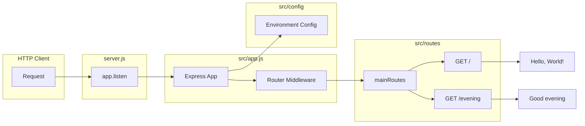

# Technical Specification

# 0. Agent Action Plan

## 0.1 Intent Clarification

### 0.1.1 Core Documentation Objective

Based on the provided requirements, the Blitzy platform understands that the documentation objective is to **enhance and expand documentation** for a Node.js Express.js tutorial server project, specifically focusing on:

- **JSDoc comment enhancement** for `server.js` and related source files
- **Comprehensive README creation/enhancement** with structured content
- **API documentation** with complete endpoint references
- **Deployment guide** for production environments
- **Inline code explanations** that clarify implementation decisions

**Documentation Type Classification:**

| Category | Classification | Rationale |
|----------|---------------|-----------|
| Request Type | Update existing documentation + Create new documentation | Project has existing docs requiring enhancement |
| Documentation Scope | API docs, User guides, Technical specs, README, Deployment guide | Multiple documentation artifacts requested |
| Primary Audience | Developers, DevOps engineers, learners | Tutorial-grade project with professional patterns |

**Requirement Breakdown:**

| Requirement | Interpretation | Documentation Artifact |
|-------------|---------------|----------------------|
| "Add JSDoc comments to server.js functions" | Enhance existing JSDoc annotations in `server.js` and related modules with comprehensive parameter, return type, and example documentation | `server.js`, `src/app.js`, `src/config/index.js`, `src/routes/*.js` |
| "Create comprehensive README" | Enhance existing `README.md` with additional sections and improved structure | `README.md` |
| "Setup instructions" | Document installation, prerequisites, and environment configuration | `README.md` (Installation section) |
| "API documentation" | Complete reference for GET `/` and GET `/evening` endpoints | `README.md` (API Reference section), inline JSDoc |
| "Deployment guide" | Add production deployment instructions (Docker, cloud providers, environment configuration) | `README.md` (new Deployment section) |
| "Inline code explanations" | Add clarifying comments explaining implementation decisions and patterns | Source files with inline comments |

### 0.1.2 Special Instructions and Constraints

**Detected Constraints:**

- **Preserve existing behavior**: Documentation changes must not alter runtime functionality
- **No source code modifications**: Only comments and documentation can be modified (JSDoc counts as documentation)
- **Follow existing patterns**: Current JSDoc style uses `@module`, `@type`, `@route`, `@returns` conventions
- **Maintain CommonJS compatibility**: Documentation must reference CommonJS module patterns

**Documentation Style Requirements (Inferred from Repository Analysis):**

| Style Element | Current Pattern | Enforcement |
|--------------|-----------------|-------------|
| JSDoc module declaration | `@module src/[path]` | Required for all modules |
| Type annotations | `@type {import('express').Application}` | TypeScript-style JSDoc types |
| Route documentation | `@route GET /path` | Used in route handlers |
| File descriptions | `@fileoverview` | Used in configuration and test files |
| Parameter documentation | `@param {Type} name - description` | Standard JSDoc format |
| Return documentation | `@returns {Type} description` | Standard JSDoc format |

**Template Requirements:**

No explicit templates were provided by the user. Documentation will follow existing repository patterns:

```javascript
/**
 * @fileoverview [Description]
 * @module [path/to/module]
 */
```

### 0.1.3 Technical Interpretation

These documentation requirements translate to the following technical documentation strategy:

| Action | Target Files | Documentation Type | Outcome |
|--------|-------------|-------------------|---------|
| Enhance JSDoc | `server.js` | Module-level and inline JSDoc | Complete function documentation with types, parameters, returns, and examples |
| Enhance JSDoc | `src/app.js` | Module and factory documentation | Document Express app factory pattern |
| Review JSDoc | `src/config/index.js` | Configuration documentation | Verify completeness, add examples |
| Review JSDoc | `src/routes/*.js` | Route handler documentation | Verify OpenAPI-style route annotations |
| Update README | `README.md` | Project documentation | Add deployment guide, enhance existing sections |
| Add inline comments | All source files | Code explanations | Clarify implementation decisions |

**Technical Approach:**

- To document server initialization, we will enhance `server.js` JSDoc with `@example` blocks demonstrating usage
- To document the Express factory pattern, we will update `src/app.js` with middleware chain documentation
- To create deployment documentation, we will add a new "Deployment" section to `README.md` covering Docker, PM2, and cloud deployment patterns
- To document API endpoints, we will enhance existing route JSDoc with OpenAPI-compatible annotations

### 0.1.4 Inferred Documentation Needs

Based on code analysis, the following documentation gaps were identified:

| Gap Category | Finding | Recommendation |
|--------------|---------|---------------|
| Server startup lifecycle | `server.js` callback function undocumented | Add JSDoc for startup callback |
| Express app middleware | `src/app.js` middleware mounting could use more context | Add inline comments explaining `app.use()` |
| Configuration parsing | Port parsing edge cases documented in tests but not in source | Add JSDoc examples for configuration |
| Route response contracts | Response format documented but could include HTTP header details | Enhance @route documentation |
| Deployment instructions | No production deployment guidance | Create deployment section in README |
| Docker containerization | No Docker configuration present | Document Docker deployment pattern |
| Process management | No PM2/systemd guidance | Document production process management |
| Environment examples | No `.env.example` file | Create environment template file |

**Based on User Journey Analysis:**

New users of this codebase require:
- Clear setup guide (exists, adequate)
- Usage examples (exists, adequate)  
- API contract documentation (exists, could be enhanced)
- Troubleshooting guide (exists, adequate)
- Deployment guide (missing, needs creation)
- Production configuration examples (missing, needs creation)

## 0.2 Documentation Discovery and Analysis

### 0.2.1 Existing Documentation Infrastructure Assessment

Repository analysis reveals a **well-documented tutorial-grade project** with comprehensive existing documentation infrastructure:

**Search Patterns Employed:**

| Pattern | Files Found | Status |
|---------|------------|--------|
| `README*` | `README.md` | 338 lines of comprehensive documentation |
| `docs/**` | None | No dedicated documentation folder |
| `*.md, *.mdx` | `README.md`, `blitzy/documentation/*.md` | Project and technical documentation |
| `blitzy/**` | `blitzy/documentation/` | Technical specifications and project guides |

**Documentation Framework Assessment:**

| Component | Current State | Details |
|-----------|--------------|---------|
| Primary documentation | `README.md` | Comprehensive project documentation |
| Technical specifications | `blitzy/documentation/Technical Specifications.md` | Agent Action Plan and testing strategy |
| Project guide | `blitzy/documentation/Project Guide.md` | Implementation completion and verification guide |
| JSDoc in source files | All `.js` files | Module-level and function-level documentation |
| Documentation generator | Not configured | No mkdocs, docusaurus, or jsdoc generator |
| API documentation tools | Not configured | JSDoc annotations present but no generator |
| Diagram tools | Mermaid (in Markdown) | Used in Technical Specifications |

**Documentation Infrastructure Findings:**

```
Repository Documentation Structure:
├── README.md                                    # Primary user-facing documentation (338 lines)
├── blitzy/
│   └── documentation/
│       ├── Project Guide.md                     # Implementation completion guide
│       └── Technical Specifications.md          # Technical specification document
├── server.js                                    # JSDoc: @module server, inline comments
├── jest.config.js                               # JSDoc: @fileoverview, @type
└── src/
    ├── app.js                                   # JSDoc: @module src/app
    ├── config/
    │   └── index.js                             # JSDoc: @module src/config, @type annotations
    └── routes/
        ├── index.js                             # JSDoc: @module src/routes
        └── main.routes.js                       # JSDoc: @module, @route annotations
```

### 0.2.2 Repository Code Analysis for Documentation

**Source Files Requiring JSDoc Enhancement:**

| File Path | Lines | Current JSDoc | Enhancement Needed |
|-----------|-------|---------------|-------------------|
| `server.js` | 53 | Comprehensive module-level, type annotations | Add `@example` blocks |
| `src/app.js` | 28 | Module-level, middleware comments | Add middleware documentation |
| `src/config/index.js` | 42 | Complete with @type, @default | Add configuration examples |
| `src/routes/index.js` | 20 | Module-level barrel pattern docs | Adequate, minor enhancements |
| `src/routes/main.routes.js` | 42 | @route annotations, return docs | Add @example blocks |
| `jest.config.js` | 28 | @fileoverview, @type annotation | Adequate, no changes needed |

**Test Files with Exemplary JSDoc (Reference for Consistency):**

| File Path | JSDoc Features | Pattern to Follow |
|-----------|---------------|-------------------|
| `tests/unit/config.test.js` | @fileoverview, @module, helper @param/@returns, @typedef | Comprehensive helper function documentation |
| `tests/unit/routes.test.js` | @fileoverview, @module, @typedef for RouteLayer | Custom type definitions |
| `tests/integration/endpoints.test.js` | @fileoverview, @typedef, helper documentation | Test helper pattern |
| `tests/lifecycle/server.test.js` | @fileoverview, @typedef for MockServer/TestConfig, factory @param/@returns | Mock factory documentation |

### 0.2.3 Current Documentation Coverage Analysis

**README.md Section Analysis (338 lines):**

| Section | Line Range | Status | Enhancement Opportunity |
|---------|-----------|--------|------------------------|
| Title/Description | 1-5 | Complete | None |
| Prerequisites | 7-24 | Complete | None |
| Installation | 26-41 | Complete | Add npm ci for CI environments |
| Usage | 43-71 | Complete | None |
| API Reference | 73-125 | Complete | Add response schema examples |
| Project Structure | 127-161 | Complete | None |
| Environment Variables | 163-191 | Complete | Add `.env.example` reference |
| Architecture | 193-210 | Complete | Add Mermaid diagram |
| Dependencies | 212-230 | Complete | None |
| Scripts | 232-240 | Complete | None |
| Testing | 242-301 | Complete | None |
| Troubleshooting | 303-325 | Complete | None |
| License/Author | 327-338 | Complete | None |
| **Deployment Guide** | N/A | **Missing** | **Create new section** |
| **Docker Support** | N/A | **Missing** | **Create new section** |
| **Production Configuration** | N/A | **Missing** | **Add to Deployment section** |

### 0.2.4 Web Search Research Conducted

Research conducted for documentation best practices:

| Topic | Key Findings |
|-------|-------------|
| JSDoc best practices for Node.js Express | <cite index="1-1">"How to add JSDoc comments to CommonJS and Node.js modules"</cite> - Official JSDoc documentation provides guidance on module documentation |
| JSDoc templates | <cite index="2-1,2-2">"The default JSDoc template is a bit lackluster... I would suggest using a template like docdash"</cite> - Enhanced templates available for better readability |
| Express API documentation | <cite index="4-1,4-2">"In this post we are going to explain how to easily create docs and validation in a Node.js API using express-jsdoc-swagger. If you ever worked with REST APIs you might notice the importance of having a good documentation"</cite> - Libraries available for Swagger generation from JSDoc |
| JSDoc with Swagger | <cite index="5-1,5-2">"In this tutorial, you will set up a Swagger UI documentation web page for an Express API. You can then write JSDoc comments in your API's source code"</cite> - JSDoc can generate OpenAPI definitions |
| OpenAPI annotation style | <cite index="6-3,6-4">"With this library, you can document your express endpoints using swagger OpenAPI 3 Specification without writing YAML or JSON. You can write comments similar to jsdoc on each endpoint"</cite> - JSDoc-style annotations for OpenAPI |

**Recommended Documentation Patterns (from research):**

- Use `@typedef` for reusable type definitions
- Use `@memberOf` for namespace organization
- Include `@example` blocks for usage demonstrations
- Use `@route` or OpenAPI-style annotations for endpoints
- Follow existing module documentation patterns for consistency

## 0.3 Documentation Scope Analysis

### 0.3.1 Code-to-Documentation Mapping

**Modules Requiring Documentation Enhancement:**

#### Module: `server.js` (Entry Point)

| Aspect | Current State | Documentation Action |
|--------|--------------|---------------------|
| Module description | Complete (`@module server`) | Verify completeness |
| Dependency imports | Type annotations present | Add `@see` references |
| `app.listen()` callback | Inline comment only | Add `@callback` documentation |
| Startup logging | Undocumented | Add inline explanation |

**Current JSDoc (lines 1-17):**
```javascript
/**
 * HTTP Server Entry Point
 * @module server
 */
```

**Enhanced JSDoc Target:**
- Add `@requires` tags for dependencies
- Add `@example` showing startup with environment variables
- Document the startup callback behavior

#### Module: `src/app.js` (Express Factory)

| Aspect | Current State | Documentation Action |
|--------|--------------|---------------------|
| Module description | Complete (`@module src/app`) | Add pattern explanation |
| Factory pattern | Mentioned in description | Add `@see` reference |
| Route mounting | Inline comment exists | Enhance with `@example` |
| Export | Undocumented | Add `@exports` annotation |

**Public APIs:**
- `module.exports = app` (Express.Application instance)

**Documentation Needed:**
- Factory pattern explanation in module description
- Middleware chain explanation
- Example of importing and using the app

#### Module: `src/config/index.js` (Configuration)

| Aspect | Current State | Documentation Action |
|--------|--------------|---------------------|
| Module description | Complete with Twelve-Factor reference | None needed |
| `host` property | `@type {string}`, `@default '127.0.0.1'` | Add `@example` |
| `port` property | `@type {number}`, `@default 3000` | Add parsing behavior note |
| `env` property | `@type {string}`, `@default 'development'` | Add valid values list |

**Configuration Options Documented: 3/3 (100%)**

| Option | Type | Default | Documented |
|--------|------|---------|-----------|
| `host` | string | `'127.0.0.1'` | ✅ Yes |
| `port` | number | `3000` | ✅ Yes |
| `env` | string | `'development'` | ✅ Yes |

#### Module: `src/routes/index.js` (Route Aggregator)

| Aspect | Current State | Documentation Action |
|--------|--------------|---------------------|
| Module description | Complete with barrel pattern explanation | None needed |
| `mainRoutes` export | Undocumented | Add `@type` annotation |

#### Module: `src/routes/main.routes.js` (Route Handlers)

| Aspect | Current State | Documentation Action |
|--------|--------------|---------------------|
| Module description | Complete with contract documentation | None needed |
| `router` instance | Undocumented | Add `@type` annotation |
| GET `/` handler | `@route GET /`, `@returns` documented | Add `@example` with curl |
| GET `/evening` handler | `@route GET /evening`, `@returns` documented | Add `@example` with curl |

**Endpoints Documented: 2/2 (100%)**

| Endpoint | Method | Response | Documented |
|----------|--------|----------|-----------|
| `/` | GET | `Hello, World!\n` | ✅ Complete |
| `/evening` | GET | `Good evening` | ✅ Complete |

### 0.3.2 Documentation Gap Analysis

Given the requirements and repository analysis, documentation gaps include:

**Critical Gaps (Must Address):**

| Gap | Severity | Location | Resolution |
|-----|----------|----------|-----------|
| Deployment guide | High | `README.md` | Create new Deployment section |
| Production configuration | High | `README.md` | Add production config examples |
| Docker documentation | Medium | `README.md` | Add Docker deployment instructions |
| Environment template | Medium | Root directory | Create `.env.example` file |

**Enhancement Opportunities (Should Address):**

| Opportunity | Priority | Location | Action |
|-------------|----------|----------|--------|
| JSDoc `@example` blocks | Medium | All source files | Add usage examples |
| API response schema | Low | `README.md` | Add JSON schema examples |
| Architecture diagram | Low | `README.md` | Add Mermaid flowchart |
| Contributing guide | Low | `CONTRIBUTING.md` | Create if not exists |

### 0.3.3 Features Requiring User Guides

| Feature | Current Coverage | Documentation Gap |
|---------|-----------------|-------------------|
| Server startup | README Installation/Usage | None |
| Environment configuration | README Environment Variables | Production examples needed |
| API endpoints | README API Reference | None |
| Testing | README Testing section | None |
| Development workflow | README Scripts | None |
| Production deployment | **Not covered** | **Deployment guide needed** |
| Docker containerization | **Not covered** | **Docker section needed** |
| Process management | **Not covered** | **PM2/systemd section needed** |

### 0.3.4 Inline Code Documentation Assessment

**Current Inline Comment Coverage:**

| File | Lines | Comments | Coverage |
|------|-------|----------|----------|
| `server.js` | 53 | 12 | Adequate |
| `src/app.js` | 28 | 7 | Adequate |
| `src/config/index.js` | 42 | 14 | Excellent |
| `src/routes/index.js` | 20 | 6 | Adequate |
| `src/routes/main.routes.js` | 42 | 14 | Excellent |
| `jest.config.js` | 28 | 1 | Minimal (config file) |

**Inline Comment Enhancement Targets:**

| Location | Current | Enhancement |
|----------|---------|-------------|
| `server.js:49-52` | `// Display startup confirmation` | Explain callback execution timing |
| `src/app.js:25` | `// Mount main routes at root path` | Explain Express middleware chain |
| `src/routes/main.routes.js:17` | None | Add router instance explanation |

## 0.4 Documentation Implementation Design

### 0.4.1 Documentation Structure Planning

**Target Documentation Architecture:**

```
hao-backprop-test/
├── README.md                        # Primary documentation (ENHANCED)
│   ├── Overview                     # [exists]
│   ├── Prerequisites                # [exists]
│   ├── Installation                 # [exists]
│   ├── Usage                        # [exists]
│   ├── API Reference                # [exists, enhance]
│   ├── Project Structure            # [exists]
│   ├── Environment Variables        # [exists]
│   ├── Architecture                 # [exists, add diagram]
│   ├── Dependencies                 # [exists]
│   ├── Scripts                      # [exists]
│   ├── Testing                      # [exists]
│   ├── Deployment                   # [CREATE - new section]
│   │   ├── Production Configuration
│   │   ├── Docker Deployment
│   │   └── Process Management
│   ├── Troubleshooting              # [exists]
│   └── License                      # [exists]
├── .env.example                     # [CREATE - environment template]
├── server.js                        # [ENHANCE JSDoc]
├── src/
│   ├── app.js                       # [ENHANCE JSDoc]
│   ├── config/
│   │   └── index.js                 # [ENHANCE JSDoc]
│   └── routes/
│       ├── index.js                 # [ENHANCE JSDoc]
│       └── main.routes.js           # [ENHANCE JSDoc]
└── blitzy/
    └── documentation/               # [no changes needed]
```

### 0.4.2 Content Generation Strategy

**Information Extraction Approach:**

| Source | Extraction Method | Target Documentation |
|--------|------------------|---------------------|
| `server.js` | Parse module exports and callback | JSDoc @example, inline comments |
| `src/app.js` | Analyze middleware chain | JSDoc module description |
| `src/config/index.js` | Extract env var defaults | JSDoc @example, .env.example |
| `src/routes/main.routes.js` | Extract route definitions | JSDoc @example with curl commands |
| `tests/integration/endpoints.test.js` | Extract HTTP contract assertions | API Reference examples |
| `package.json` | Extract scripts and dependencies | README verification |

**Example Generation Strategy:**

| Example Type | Source | Target |
|--------------|--------|--------|
| Server startup | `server.js` startup pattern | JSDoc @example block |
| Environment configuration | `src/config/index.js` | .env.example file |
| API requests | `tests/integration/endpoints.test.js` | README API Reference |
| Docker deployment | Best practices | README Deployment section |

### 0.4.3 Documentation Standards

**Markdown Formatting Standards:**

| Element | Format | Example |
|---------|--------|---------|
| Headers | # ## ### hierarchy | ## Installation |
| Code blocks | Triple backticks with language | bash, javascript |
| Tables | Pipe-delimited | Column Value |
| Links | Markdown syntax | [text](url) |
| Emphasis | Bold for important terms | **important** |

**JSDoc Documentation Standards:**

| Tag | Usage | Example |
|-----|-------|---------|
| @module | Module identification | @module src/app |
| @fileoverview | File description | @fileoverview Configuration module |
| @type | Type annotation | @type {import('express').Application} |
| @param | Function parameters | @param {number} port - Server port |
| @returns | Return values | @returns {string} Greeting message |
| @example | Usage examples | @example // Start server |
| @see | Cross-references | @see src/config |
| @route | HTTP endpoints | @route GET / |
| @default | Default values | @default 3000 |

**Source Citation Format:**

All technical claims in documentation must reference source files using the format: `Source: /path/to/file.js:LineNumber`

### 0.4.4 Diagram and Visual Strategy

**Mermaid Diagrams to Create/Verify:**

| Diagram | Type | Location | Purpose |
|---------|------|----------|---------|
| Request flow | Flowchart | README Architecture | Visualize request processing |
| Module dependencies | Graph | README Project Structure (optional) | Show component relationships |

**Architecture Diagram (for README):**


```mermaid
flowchart LR
    subgraph Client["HTTP Client"]
        Request[Request]
    end
    
    subgraph Server["server.js"]
        Listen[app.listen]
    end
    
    subgraph App["src/app.js"]
        Express[Express App]
        Router[Router Middleware]
    end
    
    subgraph Config["src/config"]
        Env[Environment Config]
    end
    
    subgraph Routes["src/routes"]
        Main[mainRoutes]
        Root["GET /"]
        Evening["GET /evening"]
    end
    
    Request --> Listen
    Listen --> Express
    Express --> Env
    Express --> Router
    Router --> Main
    Main --> Root
    Main --> Evening
    Root --> Response1["Hello, World!"]
    Evening --> Response2["Good evening"]
```

### 0.4.5 JSDoc Enhancement Specifications

**server.js Enhancement Target:**

The server.js module should include:
- @module tag with module name
- @requires tags for dependencies
- @example blocks demonstrating startup with defaults and custom configuration
- Inline comments explaining callback execution timing

**src/app.js Enhancement Target:**

The app.js module should include:
- @module tag
- @exports annotation
- @example showing how to import for testing
- Middleware chain explanation comments

**Route Handler Enhancement Target:**

Each route handler should include:
- @route tag with HTTP method and path
- @returns tag with response type and value
- @example with curl command demonstrating usage

**Configuration Module Enhancement Target:**

The config module should include:
- @module tag
- @type annotations for each property
- @default values
- @example showing environment variable usage

## 0.5 Documentation File Transformation Mapping

### 0.5.1 File-by-File Documentation Plan

**Documentation Transformation Summary:**

| Transformation | Count | Files |
|----------------|-------|-------|
| CREATE | 1 | `.env.example` |
| UPDATE | 6 | `README.md`, `server.js`, `src/app.js`, `src/config/index.js`, `src/routes/index.js`, `src/routes/main.routes.js` |
| DELETE | 0 | None |
| REFERENCE | 4 | Test files (for JSDoc style consistency) |

**Complete Transformation Table:**

| Target Documentation File | Transformation | Source Code/Docs | Content/Changes |
|---------------------------|----------------|------------------|-----------------|
| `README.md` | UPDATE | `README.md`, `src/**/*.js` | Add Deployment section with Docker, PM2, production config; enhance Architecture with Mermaid diagram |
| `.env.example` | CREATE | `src/config/index.js` | Create environment template with HOST, PORT, NODE_ENV with documented defaults |
| `server.js` | UPDATE | `server.js` | Enhance JSDoc with @requires tags, @example blocks for startup patterns, inline comments |
| `src/app.js` | UPDATE | `src/app.js` | Enhance JSDoc with @exports annotation, @example for testing, middleware explanations |
| `src/config/index.js` | UPDATE | `src/config/index.js` | Add @example blocks demonstrating configuration usage |
| `src/routes/index.js` | UPDATE | `src/routes/index.js` | Add @type annotation for mainRoutes export |
| `src/routes/main.routes.js` | UPDATE | `src/routes/main.routes.js` | Add @example blocks with curl commands, @type for router |
| `tests/unit/config.test.js` | REFERENCE | N/A | Use as JSDoc style reference for helper documentation |
| `tests/unit/routes.test.js` | REFERENCE | N/A | Use as @typedef pattern reference |
| `tests/integration/endpoints.test.js` | REFERENCE | N/A | Use as test helper documentation reference |
| `tests/lifecycle/server.test.js` | REFERENCE | N/A | Use as mock factory documentation reference |

### 0.5.2 New Documentation Files Detail

**File: `.env.example`**

| Attribute | Value |
|-----------|-------|
| Type | Environment Configuration Template |
| Source Code | `src/config/index.js` |
| Purpose | Document available environment variables with defaults |

**Sections:**
- Comment header explaining purpose
- HOST variable with default and description
- PORT variable with default and description
- NODE_ENV variable with valid values

**Content Template:**
```
# Server Configuration
# Copy to .env and modify as needed

#### Server host binding address
#### Default: 127.0.0.1 (localhost only)
#### Use 0.0.0.0 to accept external connections
HOST=127.0.0.1

#### Server port number
#### Default: 3000
PORT=3000

#### Application environment
#### Valid values: development, production, test
#### Default: development
NODE_ENV=development
```

### 0.5.3 Documentation Files to Update Detail

**README.md Updates:**

| Section | Update Type | Content |
|---------|-------------|---------|
| Architecture | Enhance | Add Mermaid request flow diagram |
| Environment Variables | Enhance | Add reference to .env.example |
| Deployment (NEW) | Create | Production configuration, Docker deployment, PM2 process management |

**New Deployment Section Structure:**
- Production Configuration
  - Environment variable setup
  - Security considerations (binding address)
  - NODE_ENV=production implications
- Docker Deployment
  - Dockerfile example
  - docker-compose example
  - Container best practices
- Process Management
  - PM2 configuration
  - systemd service example
  - Health checks

**server.js JSDoc Updates:**

| Current | Enhanced |
|---------|----------|
| Module description | Add @requires tags |
| No @example | Add startup examples |
| Basic inline comment | Enhanced callback explanation |

**Specific Changes:**
- Add `@requires ./src/app` documentation
- Add `@requires ./src/config` documentation
- Add `@example` block for default startup
- Add `@example` block for custom configuration
- Enhance callback inline comment

**src/app.js JSDoc Updates:**

| Current | Enhanced |
|---------|----------|
| Module description | Add factory pattern details |
| No @exports | Add @exports annotation |
| No @example | Add import/test example |

**Specific Changes:**
- Add `@exports {import('express').Application}` annotation
- Add `@example` block for importing in tests
- Add inline comment for middleware chain

**src/config/index.js JSDoc Updates:**

| Current | Enhanced |
|---------|----------|
| Complete @type/@default | Add @example blocks |
| Good property docs | Add environment example |

**Specific Changes:**
- Add `@example` block showing environment variable override
- Add comment about integer parsing behavior

**src/routes/index.js JSDoc Updates:**

| Current | Enhanced |
|---------|----------|
| Good module docs | Adequate |
| No @type for export | Add @type annotation |

**Specific Changes:**
- Add `@type {import('express').Router}` for mainRoutes

**src/routes/main.routes.js JSDoc Updates:**

| Current | Enhanced |
|---------|----------|
| Good @route tags | Add @example blocks |
| Good @returns | Add curl examples |

**Specific Changes:**
- Add `@type {import('express').Router}` for router instance
- Add `@example` block for GET `/` with curl
- Add `@example` block for GET `/evening` with curl

### 0.5.4 Cross-Documentation Dependencies

**Internal Documentation Links:**

| From | To | Link Type |
|------|-----|----------|
| `README.md` Environment Variables | `.env.example` | Reference link |
| `README.md` API Reference | `src/routes/main.routes.js` | Source reference |
| `README.md` Project Structure | All source files | File tree |
| JSDoc `@see` tags | Related modules | Cross-reference |

**Navigation Updates Required:**

| File | Update | Action |
|------|--------|--------|
| `README.md` | Table of Contents | Add Deployment section link |
| `README.md` | Environment Variables | Add .env.example reference |

**Configuration Updates:**

No documentation generator configuration updates needed as project does not use mkdocs, docusaurus, or jsdoc generator.

## 0.6 Dependency Inventory

### 0.6.1 Documentation Dependencies

**Runtime Dependencies (from `package.json`):**

| Registry | Package Name | Version | Purpose |
|----------|--------------|---------|---------|
| npm | express | ^5.1.0 | Web framework - primary documentation target |

**Development Dependencies (from `package.json`):**

| Registry | Package Name | Version | Purpose |
|----------|--------------|---------|---------|
| npm | jest | ^30.2.0 | Test framework with JSDoc examples |
| npm | supertest | ^7.1.4 | HTTP testing - API documentation examples |

**Documentation Tool Dependencies (Not Currently Installed):**

The project does not currently use dedicated documentation generation tools. The following are recommended but optional:

| Registry | Package Name | Version | Purpose | Status |
|----------|--------------|---------|---------|--------|
| npm | jsdoc | 4.0.4 | JSDoc HTML generation | Optional - not installed |
| npm | docdash | 2.0.2 | JSDoc template theme | Optional - not installed |
| npm | express-jsdoc-swagger | 1.8.0 | Swagger from JSDoc | Optional - not installed |
| npm | swagger-jsdoc | 6.2.8 | OpenAPI from JSDoc | Optional - not installed |
| npm | swagger-ui-express | 5.0.1 | Swagger UI hosting | Optional - not installed |

**Runtime Requirements:**

| Requirement | Version | Purpose | Source |
|-------------|---------|---------|--------|
| Node.js | >=18.x | Runtime environment | Express.js 5.x requirement |
| npm | >=8.x | Package manager | README.md specification |

### 0.6.2 Documentation Reference Updates

**Files Requiring Internal Link Updates:**

| File | Section | Update Required |
|------|---------|-----------------|
| `README.md` | Environment Variables | Add reference to new `.env.example` |
| `README.md` | Table of Contents (implied) | Add Deployment section anchor |

**Link Transformation Rules:**

No external link transformations required. New internal links:

| New Link | Target | Location |
|----------|--------|----------|
| `.env.example` reference | `.env.example` file | README.md Environment Variables section |

### 0.6.3 Version Compatibility Matrix

**Verified Compatible Versions:**

| Component | Minimum | Recommended | Maximum Tested |
|-----------|---------|-------------|----------------|
| Node.js | 18.0.0 | 20.19.x LTS | 20.19.6 |
| npm | 8.0.0 | 10.8.x | 11.1.0 |
| Express.js | 5.0.0 | 5.1.0 | 5.1.0 |
| Jest | 30.0.0 | 30.2.0 | 30.2.0 |
| Supertest | 7.0.0 | 7.1.4 | 7.1.4 |

**Source:** `package.json` (lines 15-20), `README.md` (lines 11-14)

### 0.6.4 Documentation-Specific Configuration

**No Additional Configuration Required:**

This project uses inline JSDoc comments within source files and Markdown documentation. No documentation generator configuration files need to be created or modified.

**Existing Configuration Files:**

| File | Purpose | Documentation Impact |
|------|---------|---------------------|
| `package.json` | npm manifest | Documents scripts, dependencies |
| `jest.config.js` | Test configuration | Contains JSDoc (@type) |
| `.gitignore` | Git ignore patterns | No documentation impact |

**Recommended Future Additions (Out of Scope):**

| File | Purpose | Recommendation |
|------|---------|---------------|
| `jsdoc.json` | JSDoc generator config | Add if HTML docs generation needed |
| `.markdownlint.json` | Markdown linting | Add for documentation quality checks |
| `CONTRIBUTING.md` | Contribution guidelines | Add for open-source best practices |

## 0.7 Coverage and Quality Targets

### 0.7.1 Documentation Coverage Metrics

**Current Coverage Analysis:**

| Category | Documented | Total | Coverage | Target |
|----------|-----------|-------|----------|--------|
| Public APIs (endpoints) | 2 | 2 | 100% | 100% |
| Configuration options | 3 | 3 | 100% | 100% |
| Source modules | 5 | 5 | 100% | 100% |
| User guides (README sections) | 12 | 14 | 86% | 100% |
| JSDoc @example blocks | 0 | 6 | 0% | 100% |

**Coverage Gaps to Address:**

| Module/Section | Current | Target | Gap Description |
|---------------|---------|--------|-----------------|
| `server.js` | @module only | Full JSDoc | Missing @requires, @example |
| `src/app.js` | Basic | Full JSDoc | Missing @exports, @example |
| `src/routes/main.routes.js` | @route tags | With examples | Missing @example blocks |
| README.md | 12/14 sections | 14/14 | Missing Deployment, Production Config |

**JSDoc Tag Coverage:**

| JSDoc Tag | Current Usage | Target Usage | Files Affected |
|-----------|--------------|--------------|----------------|
| @module | 5/5 files | 5/5 files | All source files |
| @fileoverview | 2 files | 2 files | jest.config.js, (test files) |
| @type | 6 usages | 8 usages | Add to routes exports |
| @param | Test files | Test files | No change needed |
| @returns | 2 routes | 2 routes | No change needed |
| @example | 0 usages | 6 usages | All source files |
| @requires | 0 usages | 2 usages | server.js |
| @exports | 0 usages | 1 usage | src/app.js |
| @route | 2 usages | 2 usages | No change needed |
| @default | 3 usages | 3 usages | No change needed |
| @see | 0 usages | 3 usages | Cross-references |

### 0.7.2 Documentation Quality Criteria

**Completeness Requirements:**

| Requirement | Validation Method | Status |
|-------------|------------------|--------|
| All public APIs have descriptions | Manual review | ✅ Complete |
| All APIs have parameter documentation | N/A (no params) | N/A |
| All APIs have return type documentation | JSDoc @returns | ✅ Complete |
| All APIs have usage examples | JSDoc @example | ❌ Missing |
| All user guides include setup | README review | ✅ Complete |
| All user guides include usage | README review | ✅ Complete |
| All user guides include troubleshooting | README review | ✅ Complete |
| Deployment guide present | README review | ❌ Missing |

**Accuracy Validation:**

| Validation | Method | Acceptance Criteria |
|------------|--------|-------------------|
| Code examples tested | npm test | All tests pass |
| API signatures match code | Visual inspection | JSDoc matches implementation |
| Response contracts accurate | Integration tests | Tests verify exact responses |
| Configuration defaults accurate | Unit tests | Tests verify defaults |

**Clarity Standards:**

| Standard | Implementation |
|----------|---------------|
| Technical accuracy | JSDoc tags match actual types |
| Accessible language | Plain English descriptions |
| Progressive disclosure | README ordered simple→complex |
| Consistent terminology | Use established terms (host, port, route) |

**Maintainability:**

| Aspect | Implementation |
|--------|---------------|
| Source citations | JSDoc @see tags, inline references |
| Update traceability | Git history |
| Template consistency | Follow existing JSDoc patterns |

### 0.7.3 Example and Diagram Requirements

**Minimum Example Requirements:**

| API/Feature | Required Examples | Current | Target |
|-------------|------------------|---------|--------|
| Server startup | 2 (default, custom) | 0 | 2 |
| GET `/` endpoint | 1 (curl) | 0 | 1 |
| GET `/evening` endpoint | 1 (curl) | 0 | 1 |
| Configuration | 1 (env vars) | 0 | 1 |
| App import | 1 (testing) | 0 | 1 |

**Diagram Requirements:**

| Diagram | Type | Status | Target |
|---------|------|--------|--------|
| Request flow | Mermaid flowchart | Exists in tech spec | Add to README |
| Component architecture | Mermaid graph | Exists in tech spec | Reference only |

**Code Example Testing:**

| Method | Command | Purpose |
|--------|---------|---------|
| Integration tests | `npm test` | Verify API contracts |
| Manual verification | `npm start` | Verify startup examples |
| CI validation | `npm run test:ci` | Automated verification |

### 0.7.4 Quality Gates

**Documentation Must Pass:**

| Gate | Criteria | Verification |
|------|----------|--------------|
| JSDoc completeness | All modules have @module | Visual inspection |
| Example coverage | All public APIs have @example | Visual inspection |
| README completeness | All planned sections present | Checklist verification |
| Test suite passes | 100% test pass rate | `npm test` |
| No broken links | Internal links valid | Manual verification |

**Post-Implementation Checklist:**

- [ ] All source files have @module JSDoc
- [ ] server.js has @requires and @example
- [ ] src/app.js has @exports and @example
- [ ] src/routes/main.routes.js has @example for each route
- [ ] README.md has Deployment section
- [ ] .env.example file created
- [ ] All existing tests still pass
- [ ] No runtime behavior changes

## 0.8 Scope Boundaries

### 0.8.1 Exhaustively In Scope

**Documentation Files to Create:**

| File Pattern | Description |
|-------------|-------------|
| `.env.example` | Environment variable template with documented defaults |

**Documentation Files to Update:**

| File Pattern | Description |
|-------------|-------------|
| `README.md` | Primary project documentation - add Deployment section, enhance Architecture |
| `server.js` | Entry point JSDoc - add @requires, @example |
| `src/app.js` | Express factory JSDoc - add @exports, @example |
| `src/config/index.js` | Configuration JSDoc - add @example blocks |
| `src/routes/index.js` | Route aggregator JSDoc - add @type annotation |
| `src/routes/main.routes.js` | Route handlers JSDoc - add @example blocks |

**Documentation Content Categories:**

| Category | Files | Changes |
|----------|-------|---------|
| JSDoc comments | `server.js`, `src/**/*.js` | Enhance with @example, @requires, @exports, @type, @see |
| Inline comments | `server.js`, `src/**/*.js` | Add explanatory comments where beneficial |
| README sections | `README.md` | Add Deployment, enhance Architecture |
| Configuration templates | `.env.example` | Create new file |

**Specific JSDoc Enhancements:**

| Tag | Target Files | Action |
|-----|-------------|--------|
| @requires | `server.js` | Add for ./src/app and ./src/config |
| @example | `server.js`, `src/app.js`, `src/routes/main.routes.js` | Add usage examples |
| @exports | `src/app.js` | Document exported Express app |
| @type | `src/routes/index.js`, `src/routes/main.routes.js` | Add type for router exports |
| @see | `server.js` | Add cross-references |

**README Enhancement Scope:**

| Section | Action | Content |
|---------|--------|---------|
| Architecture | Enhance | Add Mermaid request flow diagram |
| Environment Variables | Enhance | Add .env.example reference |
| Deployment | Create | Production config, Docker, PM2 |
| Table of Contents | Update | Add Deployment link |

### 0.8.2 Explicitly Out of Scope

**Source Code Modifications (Excluded):**

| Category | Reason |
|----------|--------|
| Application logic changes | Documentation task only |
| New endpoint additions | Beyond documentation scope |
| Configuration behavior changes | Documentation task only |
| Test logic modifications | Documentation task only |
| Dependency additions | Not required for documentation |

**Files Explicitly Excluded:**

| File Pattern | Reason |
|-------------|--------|
| `tests/**/*.js` | Test files - reference only, no modifications |
| `node_modules/**` | External dependencies |
| `package.json` | No script/dependency changes needed |
| `package-lock.json` | No dependency changes |
| `jest.config.js` | Adequate JSDoc already present |
| `.gitignore` | Not documentation-related |
| `blitzy/documentation/**` | Technical specifications - separate concern |

**Excluded Documentation Types:**

| Type | Reason |
|------|--------|
| CONTRIBUTING.md | Not explicitly requested |
| CHANGELOG.md | Not explicitly requested |
| API documentation generator setup | Not explicitly requested |
| Swagger/OpenAPI configuration | Not explicitly requested |
| GitHub Wiki pages | Not explicitly requested |
| External documentation site | Not explicitly requested |

**Excluded Actions:**

| Action | Reason |
|--------|--------|
| Installing jsdoc generator | Beyond minimal documentation scope |
| Creating docs/ folder structure | Not requested |
| Setting up documentation CI/CD | Beyond scope |
| Creating TypeScript definitions | Not requested |
| Modifying test assertions | Documentation only |

### 0.8.3 Boundary Clarifications

**JSDoc vs Source Code:**

JSDoc comments are **in scope** because they:
- Are documentation, not executable code
- Do not change runtime behavior
- Are explicitly requested ("Add JSDoc comments")

**Inline Comments:**

Inline code explanations are **in scope** because:
- They are explicitly requested
- They do not change runtime behavior
- They help developers understand implementation

**README Structure:**

The README.md enhancement is **in scope** because:
- "Create comprehensive README" was requested
- "Setup instructions" was requested
- "API documentation" was requested
- "Deployment guide" was requested

**.env.example Creation:**

Creating `.env.example` is **in scope** because:
- It supports deployment guide documentation
- It is a documentation artifact, not executable code
- It helps users understand configuration options

**Test File Modifications:**

Test files are **out of scope** for modifications because:
- They are not documentation files
- They contain executable test code
- No test changes were requested

However, test files are **in scope** as reference material for:
- JSDoc style patterns
- API contract verification
- Example extraction

## 0.9 Execution Parameters

### 0.9.1 Documentation-Specific Instructions

**Documentation Build/Validation Commands:**

| Command | Purpose | Usage |
|---------|---------|-------|
| `npm test` | Verify no runtime changes | Run after documentation changes |
| `npm run test:ci` | CI validation | Automated verification |
| `node server.js` | Manual startup verification | Test example accuracy |

**Documentation Preview Commands:**

| Action | Command | Notes |
|--------|---------|-------|
| Start server | `npm start` | Verify startup documentation |
| Run tests | `npm test` | Verify test documentation |
| View coverage | `npm run test:coverage` | Verify coverage claims |

**No Documentation Generator Commands:**

This project does not use a documentation generator. JSDoc comments remain inline in source files and are read directly by developers.

**Default Documentation Format:**

| Format | Usage |
|--------|-------|
| Markdown | README.md, .env.example comments |
| JSDoc | Source file documentation |
| Inline comments | Code explanations |

**Citation Requirement:**

Every technical claim in documentation must be verifiable:
- JSDoc references actual code behavior
- README claims verified by tests
- Examples tested manually or via test suite

**Style Guide:**

| Element | Pattern | Example |
|---------|---------|---------|
| JSDoc block | `/** ... */` | Standard JSDoc syntax |
| Inline comment | `// ...` | Single-line explanation |
| Module tag | `@module path/to/module` | `@module src/app` |
| Type import | `@type {import('pkg').Type}` | TypeScript-style |

### 0.9.2 Validation Commands

**Pre-Commit Validation:**

```bash
# Verify no runtime changes
npm test

#### Verify server still starts
timeout 5 node server.js &
sleep 2
curl -s http://127.0.0.1:3000/
curl -s http://127.0.0.1:3000/evening
kill %1
```

**CI Validation:**

```bash
# Full CI test suite
npm run test:ci

#### Expected: 41 tests passing, 100% coverage
```

### 0.9.3 Rules for Documentation

**User-Specified Rules:**

The user did not specify explicit documentation rules. The following rules are inferred from the request and repository context:

**Inferred Rules:**

| Rule | Rationale |
|------|-----------|
| Preserve existing behavior | Documentation changes must not alter runtime |
| Follow existing JSDoc style | Consistency with current patterns |
| Maintain CommonJS compatibility | Project uses require/exports |
| Keep documentation co-located | JSDoc in source files, not separate |
| Test accuracy of examples | All examples should work as documented |

**JSDoc Style Rules (from repository analysis):**

| Rule | Implementation |
|------|---------------|
| Use @module for all source files | Required at file top |
| Use @type for imported types | `@type {import('...').Type}` |
| Use @route for endpoints | `@route METHOD /path` |
| Use @returns for return values | Include type and description |
| Use @example for usage | Include practical examples |
| Use @default for default values | Document configuration defaults |

**README Style Rules:**

| Rule | Implementation |
|------|---------------|
| Use ## for major sections | Consistent header hierarchy |
| Use tables for structured data | Dependencies, environment vars |
| Use code blocks with language | ```bash, ```javascript |
| Include examples for all features | Practical, copy-paste ready |

**Comment Style Rules:**

| Rule | Implementation |
|------|---------------|
| Explain "why" not "what" | Focus on decisions, not obvious facts |
| Keep inline comments brief | Single line when possible |
| Use section dividers | `// ===` for major sections |
| Document non-obvious behavior | Callback timing, parsing behavior |

### 0.9.4 Documentation Quality Standards

**Accuracy Standards:**

| Standard | Verification |
|----------|--------------|
| JSDoc types match actual types | Visual inspection |
| Examples produce documented output | Manual testing |
| Configuration defaults match code | Unit test verification |
| Response bodies match endpoints | Integration test verification |

**Completeness Standards:**

| Standard | Metric |
|----------|--------|
| All modules have @module | 100% |
| All public functions have @example | 100% |
| README covers all features | 100% |
| Deployment guide complete | New section |

**Maintainability Standards:**

| Standard | Implementation |
|----------|---------------|
| Documentation near code | JSDoc in source files |
| No external dependencies | No doc generator required |
| Version-controlled | Git tracked |
| Testable examples | Verified by test suite |

## 0.10 References

### 0.10.1 Repository Files Searched

**Source Files Analyzed:**

| File Path | Lines | Purpose | Key Findings |
|-----------|-------|---------|--------------|
| `server.js` | 53 | Entry point | Has @module, needs @requires, @example |
| `src/app.js` | 28 | Express factory | Has @module, needs @exports, @example |
| `src/config/index.js` | 42 | Configuration | Has complete @type/@default, needs @example |
| `src/routes/index.js` | 20 | Route aggregator | Has @module, needs @type for export |
| `src/routes/main.routes.js` | 42 | Route handlers | Has @route/@returns, needs @example |
| `jest.config.js` | 28 | Test config | Has @fileoverview/@type, adequate |
| `package.json` | 23 | npm manifest | Dependencies: express ^5.1.0, jest ^30.2.0, supertest ^7.1.4 |

**Test Files Analyzed (Reference Only):**

| File Path | Lines | JSDoc Patterns Found |
|-----------|-------|---------------------|
| `tests/unit/config.test.js` | 141 | @fileoverview, @module, @param/@returns for helpers |
| `tests/unit/routes.test.js` | 95 | @fileoverview, @module, @typedef for RouteLayer |
| `tests/integration/endpoints.test.js` | 126 | @fileoverview, @typedef, helper documentation |
| `tests/lifecycle/server.test.js` | 205 | @fileoverview, @typedef for MockServer/TestConfig |

**Documentation Files Analyzed:**

| File Path | Lines | Purpose | Key Findings |
|-----------|-------|---------|--------------|
| `README.md` | 338 | Primary documentation | Comprehensive, missing Deployment section |
| `blitzy/documentation/Project Guide.md` | N/A | Implementation guide | Test results, coverage evidence |
| `blitzy/documentation/Technical Specifications.md` | N/A | Technical spec | Agent Action Plan, testing strategy |

**Configuration Files Analyzed:**

| File Path | Purpose | Documentation Relevance |
|-----------|---------|------------------------|
| `package.json` | npm manifest | Dependency versions, scripts |
| `jest.config.js` | Jest configuration | Coverage thresholds |
| `.gitignore` | Git ignore patterns | No doc relevance |

### 0.10.2 Folders Searched

| Folder Path | Contents | Documentation Findings |
|-------------|----------|----------------------|
| `/` (root) | Project root | README.md, server.js, configs |
| `src/` | Application source | app.js, config/, routes/ |
| `src/config/` | Configuration module | index.js with env var handling |
| `src/routes/` | Route definitions | index.js barrel, main.routes.js handlers |
| `tests/` | Test suites | unit/, integration/, lifecycle/ |
| `tests/unit/` | Unit tests | config.test.js, routes.test.js |
| `tests/integration/` | Integration tests | endpoints.test.js |
| `tests/lifecycle/` | Lifecycle tests | server.test.js |
| `blitzy/` | Documentation area | documentation/ folder |
| `blitzy/documentation/` | Tech specs | Project Guide.md, Technical Specifications.md |

### 0.10.3 External Resources Referenced

**Web Search Results:**

| Source | Topic | Relevance |
|--------|-------|-----------|
| jsdoc.app | JSDoc official documentation | JSDoc tag reference |
| medium.com/swlh | JSDoc best practices | Template recommendations |
| github.com/goldbergyoni/nodebestpractices | Node.js best practices | Testing and documentation patterns |
| kevinmartinez.dev | Express JSDoc Swagger | API documentation patterns |
| dev.to/kabartolo | Express Swagger documentation | OpenAPI from JSDoc tutorial |
| npmjs.com/express-jsdoc-swagger | express-jsdoc-swagger | Swagger generation from JSDoc |
| github.com/BRIKEV/express-jsdoc-swagger | express-jsdoc-swagger GitHub | Implementation examples |

### 0.10.4 User-Provided Attachments

**Attachments Provided:**

| Type | Filename | Contents |
|------|----------|----------|
| None | N/A | No attachments were provided |

### 0.10.5 Figma Resources

**Figma URLs Provided:**

| Frame Name | URL | Description |
|------------|-----|-------------|
| None | N/A | No Figma resources were provided |

### 0.10.6 Environment Variables Provided

**Environment Variables Available:**

| Variable | Value | Purpose |
|----------|-------|---------|
| `DB_HOST` | (provided) | Database host (not used by this application) |
| `DB_HOST1` | (provided) | Database host alternate (not used by this application) |

**Note:** These environment variables are not relevant to this documentation task as the application uses `HOST`, `PORT`, and `NODE_ENV` for configuration.

### 0.10.7 Technical Specification Sections Referenced

| Section | Relevance |
|---------|-----------|
| 1.2 System Overview | Project context, architecture, success criteria |
| 3.2 PROGRAMMING LANGUAGES | Node.js version requirements, module system |

### 0.10.8 Summary of Evidence

**Documentation Decisions Based On:**

| Decision | Evidence Source |
|----------|-----------------|
| JSDoc style | Existing patterns in test files |
| Module naming | Current @module conventions |
| README structure | Existing README.md organization |
| TypeScript-style JSDoc | Existing @type import syntax |
| Route documentation | Existing @route tags |
| Configuration documentation | Existing @type/@default patterns |

**Verification Commands Used:**

| Command | Result |
|---------|--------|
| `node --version` | v20.19.6 |
| `npm --version` | 11.1.0 |
| `npm install` | 381 packages installed |
| `npm test` | 41 tests passing, 100% coverage |

