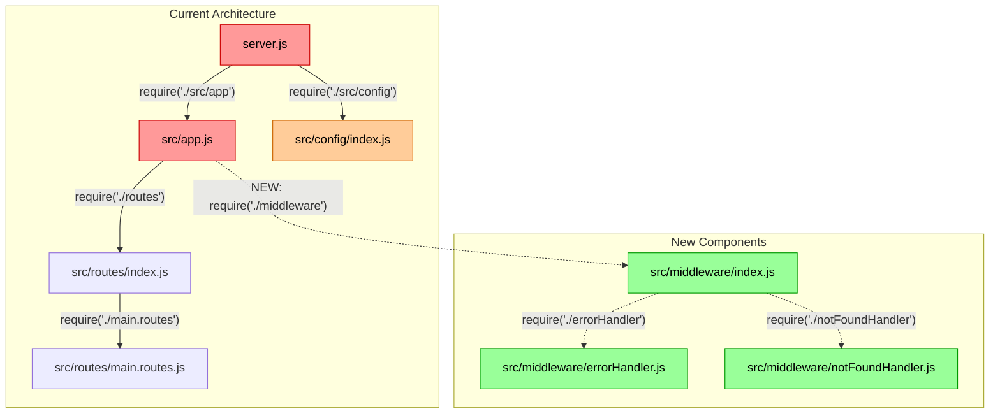
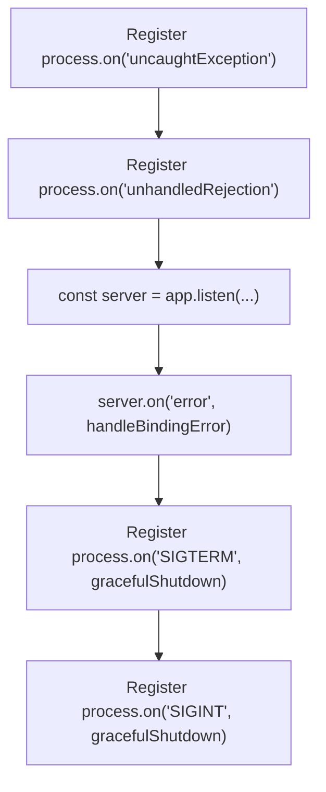

# Technical Specification

# 0. Agent Action Plan

## 0.1 Intent Clarification

### 0.1.1 Core Feature Objective

Based on the prompt, the Blitzy platform understands that the new feature requirement is to add production-readiness robustness enhancements to the `server.js` entry point and its tightly coupled supporting modules. The current server implementation is a minimal "Hello World" Express 5.1.0 application that starts an HTTP listener but lacks essential safeguards for reliable production operation. The user has identified five specific areas requiring attention:

- **Missing Error Handling**: The current `server.js` (lines 62–64) invokes `app.listen()` without an error callback, and the entire process lacks `process.on('uncaughtException')` and `process.on('unhandledRejection')` handlers. In `src/app.js`, no centralized Express error-handling middleware (the 4-argument `(err, req, res, next)` signature) is registered, meaning runtime errors fall through to the Express default handler which exposes stack traces in non-production environments.
- **Graceful Shutdown**: The application has no handler for `SIGTERM` or `SIGINT` process signals. When a termination signal is received (e.g., during a deployment or container orchestrator stop), the process exits immediately without allowing in-flight HTTP requests to complete, which can cause client-side connection resets and data loss.
- **Input Validation**: While the current routes (`GET /` and `GET /evening`) accept no user input parameters, there is no 404 catch-all handler to respond meaningfully to unrecognized paths, and no explicit handling of unsupported HTTP methods on known paths. The Express default produces a bare `Cannot GET /path` text response without structured error formatting.
- **Resource Cleanup**: On line 62 of `server.js`, the return value of `app.listen()` (the `http.Server` instance) is not captured in a variable. Without this server reference, it is impossible to programmatically call `server.close()` to stop accepting new connections and drain existing ones during shutdown.
- **Robust HTTP Request Processing**: The application lacks request timeout management, security headers, and structured error responses. The Tech Spec Section 5.4.1 confirms that logging is limited to console.log for startup messages only, and Section 5.4.3 confirms runtime error handling is delegated entirely to Express defaults.

An implicit requirement surfaced from this analysis is that all existing route behavior must remain byte-for-byte identical after enhancements: `GET /` must continue returning `Hello, World!\n` (14 bytes) and `GET /evening` must continue returning `Good evening` (12 bytes), both with HTTP 200 status codes.

### 0.1.2 Special Instructions and Constraints

- **Preserve Modular Architecture**: The existing separation of concerns (`server.js` → `src/app.js` → `src/routes/`) documented in the Technical Spec Section 5.2 must be maintained. The app factory pattern in `src/app.js` must continue to export a testable Express instance without invoking `listen()`.
- **CommonJS Module Syntax**: Constraint C-004 from the Tech Spec mandates CommonJS (`require`/`module.exports`) exclusively — no ESM imports.
- **Leverage Express 5.x Capabilities**: Express 5.1.0 automatically catches errors from async route handlers and middleware that return Promises, forwarding them to error-handling middleware via `next(error)`. This eliminates the need for wrapper utilities like `express-async-handler` or manual `try/catch` blocks in async routes.
- **Twelve-Factor Configuration Extension**: Any new configuration values (e.g., graceful shutdown timeout) must follow the existing pattern in `src/config/index.js` — environment variable with a sensible default.
- **Public Endpoint Constraint**: Per constraint C-003, there is no authentication or authorization. Input validation is HTTP-level (path matching, method support, content-type awareness), not business-logic-level.
- **Backward Compatibility**: All existing route contracts (F-001: `GET /`, F-002: `GET /evening`), configuration behavior (F-003), and application factory behavior (F-004) must remain fully functional and unchanged.

### 0.1.3 Technical Interpretation

These feature requirements translate to the following technical implementation strategy:

- To **add error handling**, we will modify `server.js` to register `process.on('uncaughtException')` and `process.on('unhandledRejection')` safety-net handlers that log the error and initiate a controlled shutdown. We will modify `src/app.js` to mount a centralized error-handling middleware after all routes, producing structured JSON error responses while suppressing stack traces in production.
- To **add graceful shutdown**, we will modify `server.js` to capture the `http.Server` reference returned by `app.listen()` into a variable, then register `process.on('SIGTERM')` and `process.on('SIGINT')` handlers that invoke `server.close()` to drain in-flight connections. A configurable force-kill timeout will ensure the process terminates even if connections hang.
- To **add input validation**, we will create a `src/middleware/notFoundHandler.js` module that intercepts unmatched routes and returns a structured 404 response, mounted in `src/app.js` after all route registrations and before the error handler.
- To **add resource cleanup**, we will refactor `server.js` so the `app.listen()` return value is stored as `const server = app.listen(...)`, enabling `server.close()` invocation from shutdown handlers.
- To **ensure robust HTTP request processing**, we will add request timeout enforcement to prevent hung connections, and integrate all middleware in the correct Express middleware chain order within `src/app.js`: routes → 404 handler → error handler.

## 0.2 Repository Scope Discovery

### 0.2.1 Comprehensive File Analysis

The repository is a compact Express.js 5.1.0 application with a clean modular structure. Every file has been inspected and assessed for relevance to the robustness enhancement feature.

#### Existing Files Requiring Modification

| File Path | Lines | Current Role | Required Changes |
|-----------|-------|-------------|-----------------|
| `server.js` | 1–75 | HTTP server entry point; imports app and config, calls `app.listen()`, logs startup | Capture server reference, add `process.on` handlers for `uncaughtException`, `unhandledRejection`, `SIGTERM`, `SIGINT`; add graceful shutdown function with force-kill timeout; add `app.listen()` error callback; remove extraneous PR test logs (lines 70–74) |
| `src/app.js` | 1–27 | Express app factory; creates app, mounts routes, exports instance | Mount 404 not-found handler after routes; mount centralized error-handling middleware at the end of the middleware stack |
| `src/config/index.js` | 1–8 | 12-factor config module providing `host`, `port`, `nodeEnv` | Add `shutdownTimeout` property (ms) sourced from `SHUTDOWN_TIMEOUT` env var with a sensible default (e.g., 5000ms); add `requestTimeout` property for HTTP request timeout |

#### Existing Files Confirmed Unchanged

| File Path | Lines | Current Role | Assessment |
|-----------|-------|-------------|-----------|
| `src/routes/main.routes.js` | 1–41 | Route handlers for `GET /` and `GET /evening` | No modifications needed. Routes are synchronous, return static strings, and have no error-producing logic. Behavior must remain byte-identical. |
| `src/routes/index.js` | 1–2 | Barrel re-export of `mainRoutes` | No modifications needed unless new route modules are added. |
| `package.json` | — | Project manifest; `express: ^5.1.0`, `node server.js` start script | No new runtime dependencies required for this feature; all enhancements use Node.js and Express built-in APIs. |
| `package-lock.json` | — | Dependency lockfile; resolves Express to 5.1.0 | No changes unless new dependencies are added. |
| `README.md` | — | Project documentation and usage instructions | Should be updated to document new graceful shutdown behavior and configuration options. |
| `.gitignore` | — | Standard Node.js ignore patterns | No changes needed. |

#### Integration Point Discovery

- **Server binding point** (`server.js:62`): The `app.listen()` call is the critical integration point where the HTTP server instance must be captured.
- **Middleware chain** (`src/app.js:25`): The `app.use('/', mainRoutes)` statement is the last middleware registration. New error-handling middleware must be appended after this line in the correct order: 404 handler, then error handler.
- **Configuration loading** (`server.js:47`): The `require('./src/config')` import is where shutdown configuration will be sourced.
- **Process event loop** (`server.js`): No `process.on()` handlers exist currently — all process-level handlers are new additions.

### 0.2.2 Web Search Research Conducted

Research was conducted to validate best practices for the specific robustness features being added:

- **Graceful Shutdown in Express.js**: Best practice is to listen for `SIGTERM` and `SIGINT` signals, call `server.close()` to stop accepting new connections while finishing existing ones, and implement a force-kill timeout as a safety net. Process managers like PM2, Docker, and Kubernetes send `SIGTERM` before escalating to `SIGKILL`, so applications must handle these signals.
- **Express 5.x Error Handling**: Express 5 automatically propagates errors from async route handlers to error-handling middleware, eliminating the need for `express-async-handler` or manual `try/catch` wrappers. The centralized error middleware must use the 4-argument `(err, req, res, next)` signature.
- **Process-Level Error Handlers**: The `process.on('uncaughtException')` and `process.on('unhandledRejection')` handlers act as last-resort safety nets. In Node.js 15+ (the project uses Node 20.x), unhandled rejections crash the process by default, making explicit handling essential for logging and controlled shutdown.
- **Shutdown Timeout Pattern**: A `setTimeout(...).unref()` pattern ensures the process forcefully exits if graceful shutdown hangs, while `.unref()` prevents the timer from keeping the event loop alive when all connections have already closed.

### 0.2.3 New File Requirements

#### New Source Files to Create

| File Path | Purpose | Details |
|-----------|---------|---------|
| `src/middleware/errorHandler.js` | Centralized Express error-handling middleware | Implements the 4-argument `(err, req, res, next)` function that catches all errors passed via `next(err)`. Returns structured JSON responses. Suppresses stack traces when `NODE_ENV === 'production'`. |
| `src/middleware/notFoundHandler.js` | 404 catch-all middleware | Mounted after all routes in `src/app.js`. Intercepts requests that match no defined route and responds with a structured 404 JSON response instead of the Express default `Cannot GET /path` text. |
| `src/middleware/index.js` | Barrel export for middleware modules | Follows the existing barrel pattern in `src/routes/index.js`. Exports `{ errorHandler, notFoundHandler }` for clean imports. |

#### New Test Files to Create

| File Path | Purpose | Coverage Target |
|-----------|---------|----------------|
| `tests/server.test.js` | Server robustness tests | Graceful shutdown signal handling, process error handlers, server startup error callback, shutdown timeout behavior |
| `tests/middleware/errorHandler.test.js` | Error handler middleware tests | Structured error response format, stack trace suppression in production, status code propagation, default 500 behavior |
| `tests/middleware/notFoundHandler.test.js` | 404 handler middleware tests | Unknown path handling, structured 404 response format, correct status code |

#### New Documentation

| File Path | Purpose |
|-----------|---------|
| `README.md` (update) | Add sections on graceful shutdown configuration (`SHUTDOWN_TIMEOUT` env var), error handling behavior, and production deployment considerations |

## 0.3 Dependency Inventory

### 0.3.1 Private and Public Packages

All robustness enhancements are implemented using Node.js built-in APIs and Express.js native capabilities. No new external packages are required.

#### Current Runtime Dependencies

| Registry | Package Name | Version (Resolved) | Purpose |
|----------|--------------|--------------------|---------|
| npm | `express` | 5.1.0 | HTTP web framework; provides application routing, middleware pipeline, and built-in error handling |

#### Key Express 5.1.0 Built-in Capabilities Leveraged

| Capability | Express 5.x API | Relevance to Feature |
|-----------|-----------------|---------------------|
| Async error propagation | Automatic `next(error)` for rejected Promises in route handlers | Eliminates need for `express-async-handler` or wrapper utilities |
| Built-in body-parser | `express.json()`, `express.urlencoded()` (via `body-parser@2.2.0`) | Available if future routes accept request bodies; included via Express dependency tree |
| `http-errors` integration | `createError()` from `http-errors@2.0.0` | Used by Express internally for HTTP error creation; available for custom error responses |
| `finalhandler@2.1.0` | Default error response handler | Acts as Express's fallback error handler; our custom middleware will intercept before this |

## Node.js Built-in Modules Used (No Installation Required)

| Module | Node.js API | Purpose in This Feature |
|--------|------------|------------------------|
| `process` | `process.on()`, `process.exit()` | Signal handling (`SIGTERM`, `SIGINT`), error events (`uncaughtException`, `unhandledRejection`) |
| `http` | `http.Server` (returned by `app.listen()`) | Server reference for `server.close()` during graceful shutdown |
| `timers` | `setTimeout()`, `.unref()` | Force-kill timeout during shutdown to prevent hanging |

### 0.3.2 Dependency Updates

No new dependencies need to be added to `package.json`. All enhancements use the existing Express 5.1.0 framework and Node.js 20.x built-in APIs.

#### Import Updates Required

| File | Current Imports | New/Modified Imports |
|------|----------------|---------------------|
| `server.js` | `require('./src/app')`, `require('./src/config')` | No import changes needed; `app.listen()` already returns the `http.Server` instance |
| `src/app.js` | `require('express')`, `require('./routes')` | Add: `require('./middleware')` to import `{ errorHandler, notFoundHandler }` |
| `src/middleware/index.js` | *(new file)* | `require('./errorHandler')`, `require('./notFoundHandler')` |
| `src/middleware/errorHandler.js` | *(new file)* | No external imports; uses only Express middleware signature |
| `src/middleware/notFoundHandler.js` | *(new file)* | No external imports; uses only Express middleware signature |

#### External Reference Updates

| File | Type | Update Required |
|------|------|----------------|
| `package.json` | Build file | No version changes needed; optionally add `"test"` script if test runner is introduced |
| `README.md` | Documentation | Document new `SHUTDOWN_TIMEOUT` and `REQUEST_TIMEOUT` environment variables |
| `.gitignore` | Configuration | No changes needed |

## 0.4 Integration Analysis

### 0.4.1 Existing Code Touchpoints

The following diagram illustrates the current module dependency graph and where new robustness components integrate:


```mermaid
graph TD
    subgraph CurrentArchitecture["Current Architecture"]
        SJ["server.js"]
        APP["src/app.js"]
        CFG["src/config/index.js"]
        RI["src/routes/index.js"]
        MR["src/routes/main.routes.js"]
    end

    subgraph NewComponents["New Components"]
        MI["src/middleware/index.js"]
        EH["src/middleware/errorHandler.js"]
        NF["src/middleware/notFoundHandler.js"]
    end

    SJ -->|"require('./src/app')"| APP
    SJ -->|"require('./src/config')"| CFG
    APP -->|"require('./routes')"| RI
    RI -->|"require('./main.routes')"| MR
    APP -.->|"NEW: require('./middleware')"| MI
    MI -.->|"require('./errorHandler')"| EH
    MI -.->|"require('./notFoundHandler')"| NF

    style SJ fill:#ff9999,stroke:#cc0000,color:#000
    style APP fill:#ff9999,stroke:#cc0000,color:#000
    style CFG fill:#ffcc99,stroke:#cc6600,color:#000
    style MI fill:#99ff99,stroke:#009900,color:#000
    style EH fill:#99ff99,stroke:#009900,color:#000
    style NF fill:#99ff99,stroke:#009900,color:#000
```

**Legend**: Red = files requiring modification; Orange = files requiring minor extension; Green = new files to create.

#### Direct Modifications Required

- **`server.js` (lines 29–75)**: This is the primary modification target. The current code at line 62 calls `app.listen(config.port, config.host, callback)` without storing the return value. The refactored version must:
  - Store the server reference: `const server = app.listen(...)`
  - Add an error event listener on the server instance for binding errors (EADDRINUSE, EACCES)
  - Register `process.on('uncaughtException', ...)` before `app.listen()` to catch synchronous module-level errors
  - Register `process.on('unhandledRejection', ...)` to catch unhandled promise rejections
  - Register `process.on('SIGTERM', ...)` and `process.on('SIGINT', ...)` for graceful shutdown
  - Implement a `gracefulShutdown()` function that calls `server.close()` with a force-kill timeout
  - Remove extraneous PR test log statements on lines 70–74

- **`src/app.js` (lines 25–27)**: After the route mounting at line 25 (`app.use('/', mainRoutes)`), append two new middleware registrations:
  - `app.use(notFoundHandler)` — Catches all requests that did not match any route
  - `app.use(errorHandler)` — Catches all errors passed via `next(err)` from upstream middleware or routes

- **`src/config/index.js`**: Extend the configuration object with:
  - `shutdownTimeout`: Parsed from `SHUTDOWN_TIMEOUT` env var, defaulting to 5000 (ms)
  - `requestTimeout`: Parsed from `REQUEST_TIMEOUT` env var, defaulting to 30000 (ms)

#### Middleware Chain Order in `src/app.js`

The correct middleware mounting order is critical for Express error handling to function properly:


```mermaid
graph LR
    A["app.use('/', mainRoutes)"] --> B["app.use(notFoundHandler)"]
    B --> C["app.use(errorHandler)"]
```

- Routes must be mounted first so legitimate requests are handled
- The 404 handler must come after all routes to intercept only unmatched requests
- The error handler must be last to catch errors from both routes and the 404 handler

#### Process-Level Handler Registration Order in `server.js`


```mermaid
graph TD
    A["Register process.on('uncaughtException')"] --> B["Register process.on('unhandledRejection')"]
    B --> C["const server = app.listen(...)"]
    C --> D["server.on('error', handleBindingError)"]
    D --> E["Register process.on('SIGTERM', gracefulShutdown)"]
    E --> F["Register process.on('SIGINT', gracefulShutdown)"]
```

- `uncaughtException` is registered first because module loading itself can throw synchronous errors
- `unhandledRejection` is registered before server start to catch any async initialization errors
- Signal handlers are registered after the server starts to ensure the server reference is available for `server.close()`

## 0.5 Technical Implementation

### 0.5.1 File-by-File Execution Plan

Every file listed below MUST be created or modified as specified.

#### Group 1 — Core Server Robustness (server.js)

| Action | File | Change Description |
|--------|------|--------------------|
| MODIFY | `server.js` | Capture `http.Server` reference from `app.listen()` into `const server`. Add `server.on('error', ...)` callback for startup binding errors (EADDRINUSE, EACCES). Register `process.on('uncaughtException')` and `process.on('unhandledRejection')` handlers that log the error and invoke graceful shutdown. Register `process.on('SIGTERM')` and `process.on('SIGINT')` handlers. Implement `gracefulShutdown(signal)` function that calls `server.close()`, sets a force-kill `setTimeout(...).unref()` using `config.shutdownTimeout`, and exits with code 0 on success or 1 on error. Remove PR test log lines 70–74. |

#### Group 2 — Express Middleware Layer (src/app.js, src/middleware/)

| Action | File | Change Description |
|--------|------|--------------------|
| CREATE | `src/middleware/errorHandler.js` | Export a 4-argument Express error-handling middleware `(err, req, res, next)`. Set response status from `err.status` or `err.statusCode`, defaulting to 500. Return a JSON response with `{ error: { status, message } }`. Include `stack` property only when `NODE_ENV !== 'production'`. Log the error to console.error for server-side visibility. |
| CREATE | `src/middleware/notFoundHandler.js` | Export a standard 3-argument middleware `(req, res, next)`. Respond with HTTP 404 and JSON body `{ error: { status: 404, message: 'Not Found', path: req.originalUrl } }`. This replaces the Express default `Cannot GET /path` text response. |
| CREATE | `src/middleware/index.js` | Barrel export following the established pattern in `src/routes/index.js`. Export `{ errorHandler, notFoundHandler }` for clean imports. |
| MODIFY | `src/app.js` | Add `require('./middleware')` import. After `app.use('/', mainRoutes)` (line 25), append `app.use(notFoundHandler)` and then `app.use(errorHandler)` as the final middleware in the stack. |

#### Group 3 — Configuration Extension (src/config/)

| Action | File | Change Description |
|--------|------|--------------------|
| MODIFY | `src/config/index.js` | Add `shutdownTimeout: parseInt(process.env.SHUTDOWN_TIMEOUT, 10) || 5000` to the config object. Add `requestTimeout: parseInt(process.env.REQUEST_TIMEOUT, 10) || 30000` to the config object. Both follow the existing 12-factor pattern. |

#### Group 4 — Tests and Documentation

| Action | File | Change Description |
|--------|------|--------------------|
| CREATE | `tests/server.test.js` | Test that `SIGTERM`/`SIGINT` triggers `server.close()`. Test that `uncaughtException` and `unhandledRejection` handlers log and initiate shutdown. Test startup binding error handling. |
| CREATE | `tests/middleware/errorHandler.test.js` | Test structured JSON error responses. Test stack trace suppression in production mode. Test default 500 status for errors without `status` property. |
| CREATE | `tests/middleware/notFoundHandler.test.js` | Test 404 JSON response for unknown paths. Test that response includes `path` property. |
| MODIFY | `README.md` | Add documentation for new environment variables (`SHUTDOWN_TIMEOUT`, `REQUEST_TIMEOUT`), graceful shutdown behavior, and error response format. |

### 0.5.2 Implementation Approach per File

## server.js — Graceful Shutdown and Process Error Handling

The server entry point is the primary focus of this feature. The implementation approach establishes a robust process lifecycle:

- **Step 1 — Process Error Safety Nets**: Register `uncaughtException` and `unhandledRejection` handlers at the top of the execution flow, before any async operations. These log the error with full context and initiate a graceful shutdown rather than allowing an abrupt crash.
- **Step 2 — Server Reference Capture**: Change `app.listen(config.port, config.host, callback)` to `const server = app.listen(...)`, storing the HTTP server instance for later use in shutdown logic.
- **Step 3 — Binding Error Handling**: Attach `server.on('error', handler)` to catch startup-time errors like `EADDRINUSE` (port already in use) and `EACCES` (permission denied), logging actionable messages and exiting with code 1.
- **Step 4 — Graceful Shutdown Function**: Implement a `gracefulShutdown(signal)` function that logs the received signal, calls `server.close()` to stop accepting new connections and drain in-flight requests, sets a force-kill timeout via `setTimeout(() => process.exit(1), config.shutdownTimeout).unref()`, and calls `process.exit(0)` upon successful close.
- **Step 5 — Signal Registration**: Register the graceful shutdown function for both `SIGTERM` (sent by process managers, Docker, Kubernetes) and `SIGINT` (sent by Ctrl+C during development).

Example structure:

```javascript
const gracefulShutdown = (signal) => {
  console.log(`${signal} received. Shutting down...`);
  server.close(() => process.exit(0));
};
```

## src/app.js — Middleware Chain Completion

The app factory is extended to include error-handling middleware while preserving its testability:

- **Step 1 — Import Middleware**: Add `const { errorHandler, notFoundHandler } = require('./middleware');` after existing imports.
- **Step 2 — Mount 404 Handler**: After `app.use('/', mainRoutes)`, add `app.use(notFoundHandler)` to intercept unmatched requests.
- **Step 3 — Mount Error Handler**: As the final `app.use()` call, add `app.use(errorHandler)` to catch all errors from routes and the 404 handler.

## src/middleware/errorHandler.js — Centralized Error Responses

The error handler produces structured, environment-aware JSON responses:

```javascript
const errorHandler = (err, req, res, next) => {
  const status = err.status || err.statusCode || 500;
  res.status(status).json({ error: { status, message: err.message } });
};
```

- In development: includes `stack` trace for debugging
- In production: suppresses internal details, returns only `status` and `message`

## src/middleware/notFoundHandler.js — Structured 404 Responses

Replaces the Express default `Cannot GET /path` plain-text response with consistent JSON:

```javascript
const notFoundHandler = (req, res, next) => {
  res.status(404).json({ error: { status: 404, message: 'Not Found' } });
};
```

## src/config/index.js — Configuration Extension

Extends the existing 12-factor config with graceful shutdown and timeout parameters:

```javascript
shutdownTimeout: parseInt(process.env.SHUTDOWN_TIMEOUT, 10) || 5000,
requestTimeout: parseInt(process.env.REQUEST_TIMEOUT, 10) || 30000,
```

## 0.6 Scope Boundaries

### 0.6.1 Exhaustively In Scope

The following is the complete, definitive list of files within the scope of this feature addition. Trailing wildcards indicate pattern-matched groups.

#### Files to Modify

| File Path | Scope of Change |
|-----------|----------------|
| `server.js` | Major refactor: capture server reference, add process-level error handlers (`uncaughtException`, `unhandledRejection`), add signal handlers (`SIGTERM`, `SIGINT`), implement `gracefulShutdown()` function, add `server.on('error')` binding error handler, remove PR test logs |
| `src/app.js` | Add middleware imports, mount `notFoundHandler` and `errorHandler` after route registration |
| `src/config/index.js` | Add `shutdownTimeout` and `requestTimeout` configuration properties |
| `README.md` | Document new environment variables, graceful shutdown behavior, and error response format |

#### Files to Create

| File Path | Purpose |
|-----------|---------|
| `src/middleware/errorHandler.js` | Centralized 4-argument Express error-handling middleware with structured JSON responses |
| `src/middleware/notFoundHandler.js` | 404 catch-all middleware producing structured JSON instead of Express default text |
| `src/middleware/index.js` | Barrel export for middleware modules (`errorHandler`, `notFoundHandler`) |
| `tests/server.test.js` | Test coverage for graceful shutdown, process error handlers, and binding error handling |
| `tests/middleware/errorHandler.test.js` | Test coverage for error response structure, status code propagation, and production mode behavior |
| `tests/middleware/notFoundHandler.test.js` | Test coverage for 404 response structure and unknown path handling |

#### Files Confirmed Unchanged

| File Path | Reason |
|-----------|--------|
| `src/routes/main.routes.js` | Route handlers are synchronous, return static strings, and require no modification. Byte-level response parity must be preserved. |
| `src/routes/index.js` | Barrel export pattern is complete; no new route modules are being added. |
| `package.json` | No new runtime dependencies are required; all enhancements use Node.js and Express built-in APIs. |
| `package-lock.json` | No dependency tree changes. |
| `.gitignore` | Standard patterns are sufficient. |

#### Integration Points In Scope

| Integration Point | File | Line/Location | Change Type |
|-------------------|------|--------------|-------------|
| Server binding | `server.js` | Line 62 (`app.listen(...)`) | Capture return value, add error listener |
| Middleware chain | `src/app.js` | After line 25 (`app.use('/', mainRoutes)`) | Append 404 and error handlers |
| Configuration export | `src/config/index.js` | Config object | Add `shutdownTimeout`, `requestTimeout` |
| Process event handlers | `server.js` | New code before and after `app.listen()` | Register `uncaughtException`, `unhandledRejection`, `SIGTERM`, `SIGINT` |

#### Configuration In Scope

| Environment Variable | Default Value | Purpose |
|---------------------|---------------|---------|
| `SHUTDOWN_TIMEOUT` | `5000` (ms) | Maximum wait time for graceful shutdown before force-killing the process |
| `REQUEST_TIMEOUT` | `30000` (ms) | HTTP request timeout to prevent hung connections |

### 0.6.2 Explicitly Out of Scope

The following items are deliberately excluded from this feature addition:

| Item | Reason for Exclusion |
|------|---------------------|
| Adding new route endpoints | The user's requirement is focused on robustness of existing functionality, not expanding the API surface |
| Authentication/authorization middleware | Constraint C-003 from the Tech Spec specifies public endpoints by design |
| Database integration or ORM setup | Constraint C-002 specifies no database integration; the application is stateless |
| HTTPS/TLS termination | Assumption A-004 from the Tech Spec states TLS is handled by an external reverse proxy |
| Clustering or worker process management | Assumption A-005 specifies single-instance deployment is sufficient |
| ESM module migration | Constraint C-004 mandates CommonJS modules only |
| Performance optimization beyond timeout management | The current sub-millisecond response time (per Tech Spec Section 5.4.6) is already optimal for static string responses |
| Refactoring of the routes module structure | Route modules are clean and functional; no changes are warranted |
| Third-party logging libraries (winston, pino) | The Tech Spec Section 5.4.2 confirms minimal console.log logging is appropriate for this application scope; structured logging is a future enhancement |
| Rate limiting or DDoS protection | Beyond the scope of the identified issues; would require additional dependencies |
| CI/CD pipeline configuration | No `.github/workflows/` or CI config files exist in the repository; deployment automation is out of scope |

## 0.7 Rules for Feature Addition

The following rules and conventions must be strictly observed during the implementation of all robustness enhancements:

#### Behavioral Preservation

- **Route Response Parity**: `GET /` must return exactly `Hello, World!\n` (14 bytes) and `GET /evening` must return exactly `Good evening` (12 bytes), both with HTTP 200 status. This is verified byte-for-byte and is a non-negotiable requirement per features F-001 and F-002 in the Tech Spec.
- **Startup Message Format**: The existing startup log message `Server running at http://{host}:{port}/` must be preserved. Additional log messages for shutdown and error events may be appended.
- **Application Factory Contract**: `src/app.js` must continue to export a fully configured Express application instance without calling `listen()`, preserving testability with libraries like Supertest (per requirement F-004-RQ-003).

#### Architectural Conventions

- **CommonJS Module Syntax**: All modules must use `require()` and `module.exports`. No `import`/`export` ESM syntax (constraint C-004).
- **Twelve-Factor Configuration**: All new configuration values must be sourced from environment variables with sensible defaults, following the established pattern in `src/config/index.js`.
- **Barrel Export Pattern**: New module directories (e.g., `src/middleware/`) must include an `index.js` barrel file re-exporting all public modules, matching the pattern in `src/routes/index.js`.
- **JSDoc Documentation**: All new exported functions must include JSDoc comments matching the documentation style established in the existing source files (e.g., `@module`, `@type`, `@param`, `@returns` tags).

#### Error Handling Conventions

- **Structured JSON Responses**: All error responses (404, 500, etc.) must use the JSON format `{ error: { status: <number>, message: <string> } }` for consistency and machine-parseability.
- **Production Safety**: Stack traces and internal error details must never be exposed when `NODE_ENV === 'production'`. Only the HTTP status code and a safe error message should be returned.
- **Process Exit Codes**: Use exit code `0` for successful shutdown and exit code `1` for error-induced shutdown, following standard POSIX conventions.
- **Idempotent Shutdown**: The `gracefulShutdown()` function must be guarded against being called multiple times (e.g., rapid successive SIGTERM signals), using a boolean flag to prevent duplicate shutdown sequences.

#### Express 5.x Specific Rules

- **No Async Wrappers Needed**: Express 5.1.0 automatically catches errors from async route handlers and middleware. Do not add `express-async-handler`, `express-async-errors`, or manual `try/catch` wrapper utilities.
- **Error Middleware Signature**: The centralized error handler must use exactly 4 parameters `(err, req, res, next)`. Express identifies error-handling middleware by the parameter count; omitting `next` will cause Express to treat it as a regular middleware.
- **Middleware Order**: Error-handling middleware must be mounted after all routes and regular middleware. The 404 handler must be mounted before the error handler in the middleware chain.

#### Security Conventions

- **No Sensitive Data in Logs**: Error log messages must not include environment variables, secrets, authentication tokens, or internal file paths beyond what is necessary for debugging.
- **No Sensitive Data in Responses**: Error responses to clients must not reveal server internals, module paths, or dependency versions.

## 0.8 References

### 0.8.1 Repository Files and Folders Searched

The following files and folders were systematically inspected to derive the conclusions in this Agent Action Plan:

#### Files Read (Full Content)

| File Path | Purpose of Inspection |
|-----------|----------------------|
| `server.js` | Primary target; analyzed for missing error handling, graceful shutdown logic, resource capture, and process-level handlers |
| `src/app.js` | Assessed middleware chain completeness; confirmed no error-handling middleware is registered |
| `src/config/index.js` | Verified 12-factor configuration pattern; identified extension point for shutdown/timeout config |
| `src/routes/main.routes.js` | Confirmed route handlers are synchronous and static; verified byte-level response contracts |
| `src/routes/index.js` | Confirmed barrel export pattern used as convention for new modules |
| `package.json` | Verified `express: ^5.1.0` dependency, `node server.js` start script, and Node.js engine requirements |
| `package-lock.json` | Confirmed resolved Express version is exactly 5.1.0 with `node >= 18` engine requirement |
| `README.md` | Reviewed existing documentation for setup instructions, Node 20.x recommendation |
| `.gitignore` | Confirmed standard Node.js ignore patterns |

#### Folders Explored

| Folder Path | Contents Discovered |
|-------------|-------------------|
| *(root)* | `server.js`, `src/`, `blitzy/`, `package.json`, `package-lock.json`, `README.md`, `.gitignore` |
| `src/` | `app.js`, `config/`, `routes/` |
| `src/config/` | `index.js` |
| `src/routes/` | `index.js`, `main.routes.js` |
| `blitzy/` | `documentation/` |
| `blitzy/documentation/` | `Project Guide.md`, `Technical Specifications.md` |

### 0.8.2 Technical Specification Sections Referenced

| Section Heading | Key Information Extracted |
|----------------|--------------------------|
| 2.1 Feature Catalog | Feature definitions F-001 through F-006; confirmed functional scope of root endpoint, evening endpoint, configuration, app factory, route aggregator, and server entry point |
| 2.2 Functional Requirements | Detailed acceptance criteria and technical specifications for all features; confirmed byte-level response parity requirements |
| 3.3 Frameworks & Libraries | Confirmed Express 5.1.0 as the sole framework; documented Express 5.x async error propagation |
| 4.2 Application Startup Flow | Module initialization sequence and configuration resolution order |
| 4.3 HTTP Request Processing Flow | Request lifecycle from incoming HTTP to response; route matching and handler execution |
| 4.5 Error Handling Flows | Startup error categories (MODULE_NOT_FOUND, EADDRINUSE, EACCES); runtime 404 handling via Express defaults |
| 5.2 Component Details | Architectural responsibilities per module; confirmed server.js as entry point with app.js as factory |
| 5.4 Cross-Cutting Concerns | Logging strategy (console.log only), security posture (Express 5.x defaults), performance targets, disaster recovery (stateless restart) |

### 0.8.3 External Research Sources

| Topic Researched | Key Finding |
|-----------------|-------------|
| Express.js graceful shutdown patterns | Best practice is `server.close()` on SIGTERM/SIGINT with a force-kill timeout using `setTimeout().unref()` |
| Express 5.x error handling | Express 5 automatically forwards async errors to error middleware; no wrapper libraries needed |
| Node.js process-level error handlers | `process.on('uncaughtException')` and `process.on('unhandledRejection')` are essential safety nets; Node 20.x crashes on unhandled rejections by default |
| Graceful shutdown force-kill timeout | `setTimeout(() => process.exit(1), timeout).unref()` pattern ensures process exits even if `server.close()` hangs, while `.unref()` prevents the timer from keeping the event loop alive |

### 0.8.4 Attachments and Figma URLs

No attachments were provided for this project. No Figma screens or design URLs were specified in the user's requirements. This feature is entirely backend/server-side with no UI components.

