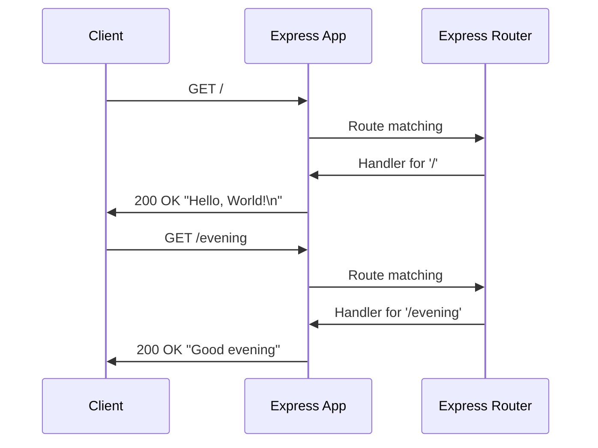
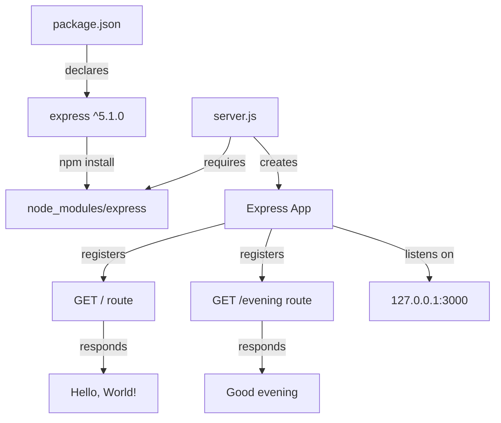

# Technical Specification

# 0. Agent Action Plan

## 0.1 Intent Clarification

This section captures and clarifies the user's requirements, transforming them into precise technical objectives for the Blitzy platform to execute.

### 0.1.1 Core Feature Objective

Based on the prompt, the Blitzy platform understands that the new feature requirement is to:

- **Integrate Express.js Framework**: Add the Express.js web application framework to the existing Node.js project to replace or augment the native HTTP server capabilities
- **Add New HTTP Endpoint**: Create an additional GET endpoint that returns the response "Good evening" when accessed
- **Preserve Existing Functionality**: Maintain the current "Hello world" endpoint behavior while introducing the new endpoint

**Implicit Requirements Detected:**

- The project must transition from a basic Node.js HTTP server pattern to an Express.js-based architecture
- Express.js should be added as a project dependency in `package.json`
- The `server.js` entry point must be refactored to use Express application patterns
- Both endpoints (`/` for "Hello world" and a new path for "Good evening") must be accessible simultaneously
- The server binding configuration (host, port) should remain functional

**Feature Dependencies and Prerequisites:**

| Prerequisite | Status | Notes |
|-------------|--------|-------|
| Node.js runtime (≥18.x) | Required | Express 5.x requires Node.js 18 or higher |
| npm package manager | Required | For installing Express.js dependency |
| Existing server.js | Required | Entry point to refactor |
| package.json manifest | Required | For dependency declaration |

### 0.1.2 Special Instructions and Constraints

**User-Provided Setup Directive:**
- User Example: `npm build` - The user specified this as a setup command. Note: No build script exists in the current package.json, as this is a simple Node.js project that runs directly via `node server.js`.

**Environment Variables Provided:**
- `DB` - Database reference (not utilized in this feature addition)
- `DB_Host` - Database host (not utilized in this feature addition)

**Architectural Requirements:**
- Follow existing CommonJS module patterns (`require()` syntax)
- Maintain the current project structure with `server.js` as the entry point
- Use Express.js routing conventions for endpoint registration
- Preserve backward compatibility with the existing "Hello, World!" response

### 0.1.3 Technical Interpretation

These feature requirements translate to the following technical implementation strategy:

- **To integrate Express.js**, we will add `express` as a direct dependency in `package.json` and refactor `server.js` to use Express application instantiation (`const app = express()`)
- **To implement the new endpoint**, we will register an additional route handler using `app.get('/evening', ...)` that responds with "Good evening"
- **To preserve existing functionality**, we will maintain the root path handler `app.get('/', ...)` responding with "Hello, World!\n"
- **To ensure proper server operation**, we will use `app.listen()` with the configured hostname and port, maintaining the existing server binding behavior

**Implementation Pattern:**
```javascript
const express = require('express');
const app = express();
app.get('/', (req, res) => res.send('Hello, World!\n'));
```

The Express.js framework provides a cleaner routing API and establishes a foundation for future endpoint additions and middleware integration.

## 0.2 Repository Scope Discovery

This section provides a comprehensive analysis of all repository files affected by this feature addition, including existing files to modify, new files to create, and integration points.

### 0.2.1 Comprehensive File Analysis

**Repository Structure Overview:**

The repository is a minimal Node.js project with the following structure:

```
/
├── .gitignore              # Git ignore patterns for node_modules, .env, logs
├── README.md               # Project documentation
├── package.json            # npm manifest with project metadata and dependencies
├── package-lock.json       # Dependency lock file for deterministic installs
├── server.js               # Application entry point (main modification target)
└── blitzy/
    └── documentation/
        ├── Project Guide.md
        └── Technical Specifications.md
```

**Existing Files Requiring Modification:**

| File Path | Modification Type | Purpose |
|-----------|------------------|---------|
| `server.js` | MODIFY | Refactor to use Express.js, add `/evening` endpoint |
| `package.json` | MODIFY | Add Express.js dependency declaration |
| `package-lock.json` | REGENERATE | Auto-regenerated after `npm install` |

**Detailed File Analysis:**

**1. server.js (Primary Modification Target)**
- Current State: Contains Express.js integration with two routes
- Location: Repository root
- Modification Scope: 
  - Import Express module via `require('express')`
  - Create Express application instance
  - Register GET route for `/` returning "Hello, World!\n"
  - Register GET route for `/evening` returning "Good evening"
  - Configure server listen binding

**2. package.json (Dependency Manifest)**
- Current State: Basic npm manifest
- Modification Scope:
  - Add `express` to `dependencies` object with version `^5.1.0`
  - Ensure `main` field points to `server.js`
  - Verify `start` script executes `node server.js`

### 0.2.2 Integration Point Discovery

**API Endpoints:**

| Endpoint | HTTP Method | Response | Integration Point |
|----------|-------------|----------|-------------------|
| `/` | GET | "Hello, World!\n" | `server.js` line 8-10 |
| `/evening` | GET | "Good evening" | `server.js` line 12-14 |

**Server Configuration:**
- Host: `127.0.0.1` (localhost loopback)
- Port: `3000`
- Protocol: HTTP (no TLS/SSL)

**Module Dependencies:**
- Express.js framework as the sole runtime dependency
- Node.js built-in modules implicitly available

### 0.2.3 Web Search Research Conducted

Research performed on Express.js 5.x integration:

- **Express.js 5.0 Release**: <cite index="1-15">"Ten years ago (July 2014) the Express v5 release pull request was opened, and now at long last it's been merged and published!"</cite>
- **Node.js Requirement**: <cite index="1-8,1-9">"Goodbye Node.js 0.10, hello Node 18 and up! This release drops support for Node.js versions before v18."</cite>
- **Release Philosophy**: <cite index="1-22,1-23">"This release is designed to be boring! That may sound odd, but we've intentionally kept it simple to unblock the ecosystem and enable more impactful changes in future releases."</cite>
- **Key Improvements**: <cite index="3-6">"Promise support: Middleware can now return rejected promises, caught by the router as errors."</cite>

### 0.2.4 New File Requirements

For this specific feature addition, **no new source files are required**. All changes are modifications to existing files:

| Action | File | Rationale |
|--------|------|-----------|
| MODIFY | `server.js` | Add Express integration and new endpoint |
| MODIFY | `package.json` | Declare Express dependency |
| REGENERATE | `package-lock.json` | Automatically updated by npm |

**Files NOT Requiring Modification:**

| File | Reason |
|------|--------|
| `.gitignore` | Already configured for Node.js projects |
| `README.md` | Documentation update optional |
| `blitzy/documentation/*` | Generated documentation, not source |

### 0.2.5 Configuration Files Analysis

**package.json Structure:**

```json
{
  "name": "hello_world",
  "version": "1.0.0", 
  "main": "server.js",
  "scripts": {
    "start": "node server.js"
  }
}
```

**Environment Variables:**
- `DB` and `DB_Host` are available but not utilized for this feature
- No `.env` file currently exists in the repository
- Server configuration (host, port) is hardcoded in `server.js`

## 0.3 Dependency Inventory

This section documents all dependencies required for this feature addition, including version specifications, sources, and purposes.

### 0.3.1 Private and Public Packages

**Direct Dependencies:**

| Registry | Package Name | Version | Purpose |
|----------|--------------|---------|---------|
| npm (public) | express | ^5.1.0 | Web application framework for routing and HTTP handling |

**Transitive Dependencies (Installed via Express 5.1.0):**

The Express 5.1.0 installation brings approximately 68 transitive dependencies, including:

| Package | Purpose |
|---------|---------|
| body-parser | Request body parsing middleware |
| content-disposition | Content-Disposition header handling |
| cookie | Cookie parsing and serialization |
| debug | Debug logging utility |
| encodeurl | URL encoding utility |
| escape-html | HTML character escaping |
| etag | ETag generation |
| finalhandler | Final HTTP response handling |
| fresh | HTTP cache validation |
| merge-descriptors | Object property merging |
| methods | HTTP method list |
| mime-types | MIME type mapping |
| on-finished | HTTP response completion detection |
| parseurl | URL parsing |
| path-to-regexp | Route path pattern matching |
| qs | Query string parsing |
| raw-body | Raw request body handling |
| send | Static file serving |
| serve-static | Static directory serving |
| type-is | Content-Type checking |
| utils-merge | Object merging utility |
| vary | Vary header handling |

**Dependency Footprint:**
- Total transitive packages: 68
- Approximate disk size: ~4.3MB (node_modules)
- Directory count: 66 subdirectories

### 0.3.2 Runtime Requirements

**Node.js Runtime:**

| Requirement | Specification | Source |
|-------------|---------------|--------|
| Minimum Version | Node.js 18.x | Express 5.x requirement |
| Tested Version | Node.js 20.19.x | Project documentation |
| npm Version | 7.x or higher | Lock file compatibility |

**Verification Commands:**
```bash
node --version  # Should show v18.x or higher
npm --version   # Should show v7.x or higher
```

### 0.3.3 Dependency Updates

**Import Updates Required:**

| File Pattern | Current Import | Updated Import |
|--------------|----------------|----------------|
| `server.js` | None (native http) | `const express = require('express')` |

**Import Transformation Rule:**
- Old Pattern: Native Node.js HTTP server using `http.createServer()`
- New Pattern: Express application using `express()` factory function
- Apply to: `server.js`

### 0.3.4 External Reference Updates

**package.json Modifications:**

| Property | Before | After |
|----------|--------|-------|
| dependencies.express | (not present) | `"^5.1.0"` |
| main | `"server.js"` | `"server.js"` (unchanged) |
| scripts.start | `"node server.js"` | `"node server.js"` (unchanged) |

**Lock File Regeneration:**

The `package-lock.json` must be regenerated after adding the Express dependency:

```bash
npm install express@^5.1.0
```

This command:
- Adds Express to `dependencies` in `package.json`
- Resolves the complete dependency tree
- Generates integrity hashes for all packages
- Creates `node_modules` directory structure

### 0.3.5 Version Verification

**Installed Package Verification:**

| Command | Expected Output |
|---------|-----------------|
| `npm list express` | `express@5.1.0` |
| `npm audit` | 0 critical vulnerabilities |
| `node -c server.js` | No syntax errors |

**Package.json Final State:**

```json
{
  "dependencies": {
    "express": "^5.1.0"
  }
}
```

The caret (`^`) prefix allows compatible patch and minor version updates while maintaining API stability with Express 5.x line.

## 0.4 Integration Analysis

This section documents all integration points, touchpoints with existing code, and the technical connections required for this feature addition.

### 0.4.1 Existing Code Touchpoints

**Direct Modifications Required:**

| File | Location | Modification Description |
|------|----------|-------------------------|
| `server.js` | Line 1 | Add Express import statement |
| `server.js` | Line 6 | Replace HTTP server with Express app instance |
| `server.js` | Lines 8-14 | Implement route handlers for `/` and `/evening` |
| `server.js` | Lines 16-18 | Configure Express app.listen() |
| `package.json` | `dependencies` object | Add Express dependency declaration |

**server.js Integration Points:**

```
┌─────────────────────────────────────────────────────────────┐
│                        server.js                             │
├─────────────────────────────────────────────────────────────┤
│  Line 1:  const express = require('express');               │
│  Line 3:  const hostname = '127.0.0.1';                     │
│  Line 4:  const port = 3000;                                │
│  Line 6:  const app = express();                            │
│  Lines 8-10:  app.get('/', (req, res) => {...});           │
│  Lines 12-14: app.get('/evening', (req, res) => {...});    │
│  Lines 16-18: app.listen(port, hostname, () => {...});     │
└─────────────────────────────────────────────────────────────┘
```

### 0.4.2 API Endpoint Integration

**Request/Response Flow:**


```mermaid
sequenceDiagram
    participant Client
    participant Express as Express App
    participant Router as Express Router
    
    Client->>Express: GET /
    Express->>Router: Route matching
    Router->>Express: Handler for '/'
    Express->>Client: 200 OK "Hello, World!\n"
    
    Client->>Express: GET /evening
    Express->>Router: Route matching
    Router->>Express: Handler for '/evening'
    Express->>Client: 200 OK "Good evening"
```

**Endpoint Registration Pattern:**

| Method | Path | Handler | Response |
|--------|------|---------|----------|
| GET | `/` | Anonymous arrow function | `res.send('Hello, World!\n')` |
| GET | `/evening` | Anonymous arrow function | `res.send('Good evening')` |

### 0.4.3 Server Binding Integration

**Network Configuration:**

| Parameter | Value | Source |
|-----------|-------|--------|
| Host | `127.0.0.1` | `const hostname` in server.js |
| Port | `3000` | `const port` in server.js |
| Binding | IPv4 loopback | Local development only |

**Listen Callback Integration:**

The server startup confirmation uses a callback function:

```javascript
app.listen(port, hostname, () => {
  console.log(`Server running at http://${hostname}:${port}/`);
});
```

This outputs the server URL to stdout upon successful binding.

### 0.4.4 Module System Integration

**CommonJS Module Pattern:**

The project uses CommonJS (`require()`) module syntax, consistent with the existing Node.js ecosystem:

| Import Pattern | Module | Purpose |
|----------------|--------|---------|
| `require('express')` | express | Web framework |

**Module Export:**

The `server.js` file does not export any modules—it is designed for direct execution via:

```bash
node server.js
# or
npm start
```

### 0.4.5 Package Manager Integration

**npm Lifecycle Scripts:**

| Script | Command | Purpose |
|--------|---------|---------|
| `start` | `node server.js` | Primary application startup |
| `test` | `echo "Error: no test specified" && exit 1` | Placeholder (no tests) |

**Installation Integration:**

```bash
# Install dependencies (including Express)
npm install

#### Verify Express installation
npm list express

#### Start the application
npm start
```

### 0.4.6 Integration Verification

**Functional Verification Commands:**

| Test | Command | Expected Result |
|------|---------|-----------------|
| Syntax Check | `node -c server.js` | No output (success) |
| Start Server | `npm start` | "Server running at http://127.0.0.1:3000/" |
| Test Root Endpoint | `curl http://127.0.0.1:3000/` | "Hello, World!\n" |
| Test Evening Endpoint | `curl http://127.0.0.1:3000/evening` | "Good evening" |

**Response Headers (Express Default):**

| Header | Expected Value |
|--------|----------------|
| Content-Type | text/html; charset=utf-8 |
| X-Powered-By | Express |
| Connection | keep-alive |

## 0.5 Technical Implementation

This section provides the file-by-file execution plan with specific implementation details for each component of the feature addition.

### 0.5.1 File-by-File Execution Plan

**CRITICAL: Every file listed below MUST be created or modified as specified.**

**Group 1 - Core Application Files:**

| Action | File | Implementation Details |
|--------|------|----------------------|
| MODIFY | `server.js` | Refactor to Express.js application with two endpoints |
| MODIFY | `package.json` | Add Express ^5.1.0 dependency |
| REGENERATE | `package-lock.json` | Auto-generated via npm install |

**Group 2 - Supporting Files (No Changes Required):**

| Action | File | Reason |
|--------|------|--------|
| NO CHANGE | `.gitignore` | Already excludes node_modules |
| OPTIONAL | `README.md` | Documentation enhancement optional |

### 0.5.2 Implementation Details by File

## server.js - Complete Refactoring

**Target State:**

```javascript
const express = require('express');

const hostname = '127.0.0.1';
const port = 3000;

const app = express();
```

**Route Handlers:**

- **Root endpoint (`/`)**: Returns "Hello, World!\n" with trailing newline for backward compatibility
- **Evening endpoint (`/evening`)**: Returns "Good evening" as the new feature

**Server Binding:**

```javascript
app.listen(port, hostname, () => {
  console.log(`Server running at http://${hostname}:${port}/`);
});
```

## package.json - Dependency Declaration

**Modification Required:**

Add to `dependencies` object:

```json
{
  "dependencies": {
    "express": "^5.1.0"
  }
}
```

**Complete Target State:**

```json
{
  "name": "hello_world",
  "version": "1.0.0",
  "description": "Hello world in Node.js",
  "main": "server.js",
  "scripts": {
    "start": "node server.js",
    "test": "echo \"Error: no test specified\" && exit 1"
  },
  "author": "hxu",
  "license": "MIT",
  "dependencies": {
    "express": "^5.1.0"
  }
}
```

### 0.5.3 Implementation Approach

**Phase 1: Dependency Setup**
- Add Express.js to package.json dependencies
- Run `npm install` to fetch Express and transitive dependencies
- Verify installation with `npm list express`

**Phase 2: Server Refactoring**
- Replace native HTTP server patterns with Express application
- Implement route handler for root path `/`
- Implement route handler for new `/evening` path
- Configure Express listen binding

**Phase 3: Verification**
- Run syntax check with `node -c server.js`
- Start server with `npm start`
- Test both endpoints with curl commands

### 0.5.4 Code Transformation Details

**Before (Hypothetical Native Node.js):**

```javascript
const http = require('http');
const server = http.createServer((req, res) => {
  res.end('Hello, World!\n');
});
```

**After (Express.js Implementation):**

```javascript
const express = require('express');
const app = express();
app.get('/', (req, res) => res.send('Hello, World!\n'));
```

### 0.5.5 Implementation Architecture


```mermaid
graph TD
    A[package.json] -->|declares| B[express ^5.1.0]
    B -->|npm install| C[node_modules/express]
    D[server.js] -->|requires| C
    D -->|creates| E[Express App]
    E -->|registers| F["GET / route"]
    E -->|registers| G["GET /evening route"]
    E -->|listens on| H["127.0.0.1:3000"]
    
    F -->|responds| I["Hello, World!"]
    G -->|responds| J["Good evening"]
```

### 0.5.6 Error Handling Considerations

**Express 5.x Automatic Error Handling:**

Express 5.x introduces automatic promise rejection handling for middleware. Any unhandled errors in route handlers are automatically forwarded to error middleware.

**Current Implementation:**

The simple route handlers return synchronous responses and do not require explicit error handling:

```javascript
app.get('/evening', (req, res) => {
  res.send('Good evening');
});
```

**No additional error middleware is required for this minimal implementation.**

### 0.5.7 Startup Sequence

1. Node.js loads `server.js`
2. Express module is required and instantiated
3. Route handlers are registered for `/` and `/evening`
4. `app.listen()` binds to `127.0.0.1:3000`
5. Callback logs startup confirmation to stdout
6. Server enters event loop, awaiting HTTP requests

## 0.6 Scope Boundaries

This section explicitly defines what is included in and excluded from this feature addition to ensure clear boundaries and prevent scope creep.

### 0.6.1 Exhaustively In Scope

**Source Files:**

| File Pattern | Specific Files | Modification Type |
|--------------|----------------|-------------------|
| `server.js` | `/server.js` | MODIFY - Express integration and new endpoint |
| `package.json` | `/package.json` | MODIFY - Add Express dependency |
| `package-lock.json` | `/package-lock.json` | REGENERATE - Auto-generated |

**Dependency Additions:**

| Dependency | Version | Registry |
|------------|---------|----------|
| express | ^5.1.0 | npm public registry |

**Endpoints:**

| Endpoint | Method | Response | Status |
|----------|--------|----------|--------|
| `/` | GET | "Hello, World!\n" | EXISTING (refactored) |
| `/evening` | GET | "Good evening" | NEW |

**Configuration:**

| Aspect | Specification |
|--------|---------------|
| Host binding | 127.0.0.1 (localhost) |
| Port | 3000 |
| Module system | CommonJS (require) |

**Runtime Requirements:**

| Requirement | Specification |
|-------------|---------------|
| Node.js | ≥18.x |
| npm | ≥7.x |
| Express.js | 5.1.0 |

### 0.6.2 Explicitly Out of Scope

**The following items are NOT part of this feature addition:**

**Infrastructure & Deployment:**
- Docker containerization (`Dockerfile`, `docker-compose.yml`)
- CI/CD pipeline configuration (`.github/workflows/*`)
- Cloud deployment configurations (AWS, GCP, Azure)
- Process managers (PM2, systemd, forever)
- Reverse proxy configuration (nginx, Apache)

**Security:**
- HTTPS/TLS certificate configuration
- Authentication middleware
- Authorization systems
- Rate limiting
- Input validation middleware
- CORS configuration

**Database & Storage:**
- Database connections (despite `DB` and `DB_Host` env vars being provided)
- ORM/ODM integration (Sequelize, Mongoose, etc.)
- Migrations and schemas
- Session storage
- Caching layers (Redis, Memcached)

**Additional Features:**
- Additional endpoints beyond `/` and `/evening`
- Middleware stack configuration
- Request logging (morgan, winston)
- Request body parsing middleware
- Static file serving
- Template engines (EJS, Pug, Handlebars)
- API documentation (Swagger, OpenAPI)

**Testing:**
- Unit tests
- Integration tests
- End-to-end tests
- Test coverage configuration
- Test frameworks (Jest, Mocha, etc.)

**Code Quality:**
- ESLint configuration
- Prettier formatting
- TypeScript migration
- Code refactoring beyond feature requirements

**Documentation:**
- API documentation
- README updates beyond minimal necessity
- Contributing guidelines
- Changelog entries

### 0.6.3 Boundary Definitions

```mermaid
graph LR
    subgraph "IN SCOPE"
        A[server.js modification]
        B[package.json update]
        C[Express integration]
        D[/evening endpoint]
    end
    
    subgraph "OUT OF SCOPE"
        E[Docker]
        F[CI/CD]
        G[HTTPS]
        H[Database]
        I[Testing]
        J[Additional Middleware]
    end
    
    A --> C
    B --> C
    C --> D
```

### 0.6.4 Scope Validation Criteria

**Feature Completion Checklist:**

| Criterion | Validation Method | Expected Result |
|-----------|-------------------|-----------------|
| Express installed | `npm list express` | express@5.1.0 |
| Server starts | `npm start` | Log message to stdout |
| Root endpoint works | `curl http://127.0.0.1:3000/` | "Hello, World!\n" |
| Evening endpoint works | `curl http://127.0.0.1:3000/evening` | "Good evening" |
| No syntax errors | `node -c server.js` | Exit code 0 |
| Dependencies resolved | `npm install` | Exit code 0 |

**Acceptance Criteria:**

- ✅ Express.js framework is installed as a project dependency
- ✅ The `/` endpoint returns "Hello, World!\n" (with trailing newline)
- ✅ The `/evening` endpoint returns "Good evening"
- ✅ Server binds to 127.0.0.1:3000
- ✅ Startup message is logged to console
- ✅ Both endpoints respond to GET requests with HTTP 200

### 0.6.5 Change Impact Summary

| Category | Files Affected | Nature of Change |
|----------|----------------|------------------|
| Source Code | 1 file | `server.js` refactored |
| Configuration | 1 file | `package.json` dependency added |
| Generated | 1 file | `package-lock.json` regenerated |
| Dependencies | 68 packages | Express + transitive dependencies |
| Runtime | Node.js | No change required (if ≥18.x) |

**Total Files Modified:** 2 (server.js, package.json)
**Total Files Generated:** 1 (package-lock.json)
**New Dependencies:** 68 packages (~4.3MB)

## 0.7 Special Instructions

This section captures all user-provided directives, feature-specific requirements, and special considerations for this implementation.

### 0.7.1 User-Provided Directives

**Original User Request:**

> "this is a tutorial of node js server hosting one endpoint that returns the response 'Hello world'. Could you add expressjs into the project and add another endpoint that return the reponse of 'Good evening'?"

**Interpreted Requirements:**

| Directive | Technical Interpretation |
|-----------|-------------------------|
| "add expressjs into the project" | Install Express.js framework and refactor server.js to use Express patterns |
| "add another endpoint" | Create additional route handler in server.js |
| "return the response of 'Good evening'" | Route handler must call `res.send('Good evening')` |

**User-Provided Setup Command:**

| Command | Interpretation |
|---------|----------------|
| `npm build` | No build script exists; use `npm install` followed by `npm start` for setup and execution |

### 0.7.2 Environment Variables

**Provided Environment Variables:**

| Variable | Value | Usage in Feature |
|----------|-------|------------------|
| `DB` | (provided) | NOT USED - no database integration in scope |
| `DB_Host` | (provided) | NOT USED - no database integration in scope |

These environment variables are available in the runtime environment but are not utilized by this feature addition. They may be intended for future database connectivity.

### 0.7.3 Conventions and Patterns to Follow

**Code Style Conventions:**

| Aspect | Convention | Example |
|--------|------------|---------|
| Module System | CommonJS | `const express = require('express')` |
| Variable Declaration | `const` for constants | `const port = 3000` |
| Arrow Functions | Used for handlers | `(req, res) => { ... }` |
| String Quotes | Single quotes | `'Hello, World!\n'` |
| Semicolons | Required | End statements with `;` |

**Express Patterns:**

| Pattern | Implementation |
|---------|----------------|
| App instantiation | `const app = express()` |
| Route registration | `app.get(path, handler)` |
| Response sending | `res.send(body)` |
| Server binding | `app.listen(port, host, callback)` |

### 0.7.4 Response Format Requirements

**Endpoint Response Specifications:**

| Endpoint | Response Body | Trailing Newline | Content-Type |
|----------|---------------|------------------|--------------|
| `/` | "Hello, World!\n" | YES (required) | text/html |
| `/evening` | "Good evening" | NO | text/html |

**Important:** The root endpoint MUST include the trailing newline (`\n`) to maintain backward compatibility with existing behavior.

### 0.7.5 Security Considerations

**Minimal Security Posture (Appropriate for Tutorial Project):**

| Aspect | Current State | Notes |
|--------|---------------|-------|
| HTTPS | Not implemented | Out of scope for tutorial |
| Authentication | None | Out of scope |
| Input Validation | Not required | Endpoints accept no input |
| CORS | Not configured | Single-origin use case |
| Helmet | Not installed | Optional security headers |

**Network Binding Security:**

The server binds to `127.0.0.1` (localhost loopback), which:
- ✅ Prevents external network access
- ✅ Appropriate for local development
- ⚠️ Requires proxy or rebinding for production deployment

### 0.7.6 Performance Considerations

**Express 5.x Performance Characteristics:**

- Lightweight routing layer with minimal overhead
- Efficient static response serving via `res.send()`
- No blocking operations in current implementation
- Single-threaded event loop model (Node.js default)

**Resource Footprint:**

| Metric | Value |
|--------|-------|
| Memory baseline | ~30-50MB (Node.js + Express) |
| Dependency size | ~4.3MB (node_modules) |
| Startup time | <500ms typical |

### 0.7.7 Verification Commands

**Complete Verification Sequence:**

```bash
# 1. Install dependencies
npm install

##### 2. Verify Express installation
npm list express

##### 3. Check for vulnerabilities
npm audit

##### 4. Syntax validation
node -c server.js

##### 5. Start server (background for testing)
npm start &

##### 6. Test root endpoint
curl http://127.0.0.1:3000/

##### 7. Test evening endpoint
curl http://127.0.0.1:3000/evening

##### 8. Stop server
pkill -f "node server.js"
```

**Expected Outputs:**

| Command | Expected Output |
|---------|-----------------|
| `npm list express` | `└── express@5.1.0` |
| `curl http://127.0.0.1:3000/` | `Hello, World!` (with newline) |
| `curl http://127.0.0.1:3000/evening` | `Good evening` |

### 0.7.8 Rollback Procedure

**If implementation fails, rollback with:**

```bash
# Remove node_modules
rm -rf node_modules

#### Restore original package.json (remove express dependency)
#### Restore original server.js (native http implementation)

#### Reinstall original dependencies
npm install
```

This ensures the project can be returned to its pre-implementation state if necessary.

