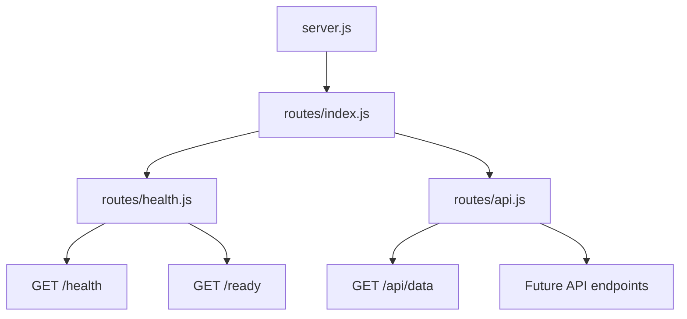
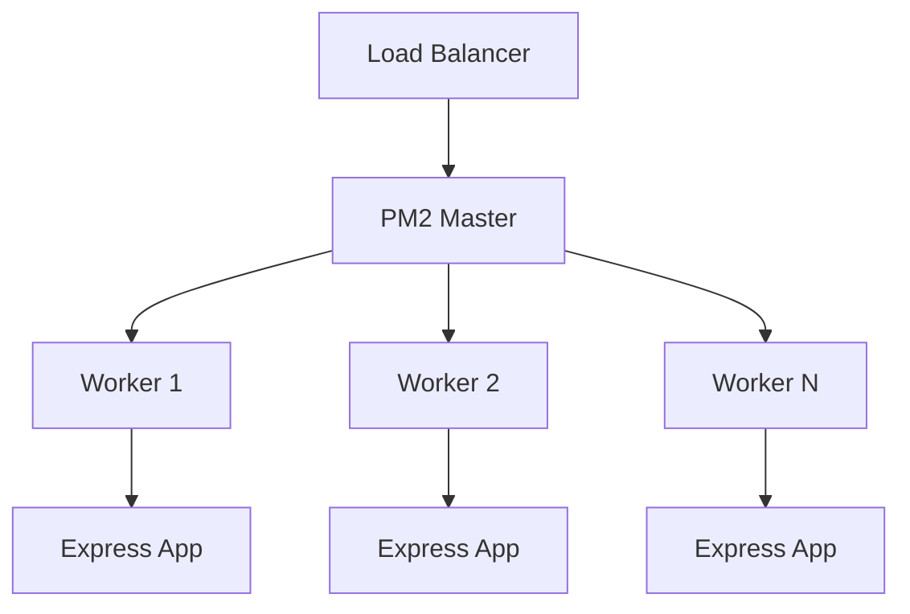

# Technical Specification

# 0. Agent Action Plan

## 0.1 Intent Clarification

Based on the provided requirements, the Blitzy platform understands that the objective is to **enhance an existing HTTP server with Express.js framework capabilities, implement comprehensive routing, add middleware layers, establish environment configuration management, integrate a production-grade logging system, and prepare the application for production deployment using PM2 process manager**.

### 0.1.1 Core Objective

The user seeks to transform the current security-hardened Express.js server into a fully production-ready application by adding the following capabilities:

| Requirement | Current State | Target State | Priority |
|-------------|---------------|--------------|----------|
| Express.js Framework | ✅ Implemented (v5.1.0) | Maintained | Foundation |
| Routing Architecture | Partial (2 demo routes) | Modular route structure | High |
| Middleware Stack | ✅ Security middleware complete | Enhanced with logging middleware | High |
| Environment Configuration | Partial (.env.example exists) | Comprehensive config management | High |
| Logging System | ❌ Not implemented | Production-grade structured logging | Critical |
| PM2 Production Deployment | ❌ Not implemented | Complete ecosystem configuration | Critical |

**Key Insight**: The existing codebase is a well-architected security-hardened Express.js server with 5-layer defense-in-depth security (Helmet → CORS → Rate Limiting → Body Parsing → Validation). The enhancement effort focuses on operational readiness through logging and PM2 integration rather than architectural changes.

### 0.1.2 Implicit Requirements Detected

Based on the explicit request, the Blitzy platform has identified the following implicit requirements that must be addressed:

- **Structured JSON Logging**: Production environments require machine-parseable logs for aggregation tools (ELK, CloudWatch, Datadog)
- **Request Context Correlation**: HTTP request logging must include request IDs for distributed tracing
- **Environment-Aware Configuration**: Logging verbosity and format must adapt to NODE_ENV (development vs production)
- **Zero-Downtime Deployments**: PM2 cluster mode configuration for graceful reloads
- **Process Persistence**: Startup scripts for automatic application recovery after server restarts
- **Health Check Endpoints**: Required for PM2 and container orchestration readiness probes
- **Graceful Shutdown Handling**: SIGTERM/SIGINT handling for clean process termination

### 0.1.3 Task Categorization

| Attribute | Classification |
|-----------|----------------|
| Primary Task Type | Feature Enhancement |
| Secondary Aspects | Configuration, Infrastructure, Operational Tooling |
| Scope Classification | Cross-cutting change |
| Complexity | Medium |
| Estimated Impact | High (production readiness enablement) |

### 0.1.4 Special Instructions and Constraints

**Captured Directives:**
- Maintain backward compatibility with existing security middleware chain
- Preserve the existing defense-in-depth middleware ordering (Helmet → CORS → Rate Limiter)
- Use existing patterns established in `middleware/` and `config/` directories
- Logging middleware must integrate without disrupting security middleware sequence
- PM2 ecosystem file must support both development and production environments

**Methodological Requirements:**
- Follow CommonJS module pattern (as per existing codebase convention)
- Maintain 'use strict' directive in all new files
- Include comprehensive JSDoc documentation (matching existing code style)
- Configuration should be environment-variable driven (extending .env.example pattern)

### 0.1.5 Technical Interpretation

These requirements translate to the following technical implementation strategy:

- **To achieve structured logging**, we will create a new `config/logger.js` configuration module and `middleware/requestLogger.js` middleware using Pino logger (chosen for performance alignment with the existing high-performance architecture)

- **To implement modular routing**, we will create a `routes/` directory structure with `routes/index.js` as the central router aggregator, enabling scalable route organization

- **To establish environment configuration**, we will enhance `.env.example` with logging and PM2 variables, and create a `config/env.js` centralized environment loader

- **To prepare for PM2 production deployment**, we will create `ecosystem.config.js` at the project root with cluster mode configuration, environment-specific settings, and deployment configurations

- **To enable zero-downtime deployments**, we will implement graceful shutdown handlers in `server.js` and configure PM2 reload strategies

- **To support operational monitoring**, we will add `/health` and `/ready` endpoints for load balancer and orchestration integration

## 0.2 Repository Scope Discovery

### 0.2.1 Comprehensive File Analysis

The repository was systematically analyzed to identify all files that will be created, modified, or referenced during this enhancement.

**Repository Structure Discovered:**

```
/
├── blitzy/                  # Blitzy platform configuration
├── certs/                   # TLS certificates for HTTPS
│   ├── cert.pem
│   ├── key.pem
│   └── README.md
├── config/                  # Configuration modules
│   ├── cors.js              # CORS configuration (reference)
│   ├── helmet.js            # Security headers config (reference)
│   └── https.js             # HTTPS configuration (reference)
├── middleware/              # Express middleware modules
│   ├── rateLimiter.js       # Rate limiting middleware (reference)
│   ├── security.js          # Centralized security middleware (modify)
│   └── validation.js        # Joi validation middleware (reference)
├── tests/
│   └── security/            # Security integration tests
│       ├── cors.test.js
│       ├── helmet.test.js
│       ├── https.test.js
│       ├── rateLimiter.test.js
│       └── validation.test.js
├── .env.example             # Environment variable template (modify)
├── package.json             # Package manifest (modify)
├── README.md                # Project documentation (modify)
└── server.js                # Main application entry (modify)
```

**Search Patterns Applied:**

| Category | Pattern | Files Found |
|----------|---------|-------------|
| Configuration | `config/**/*.js` | cors.js, helmet.js, https.js |
| Middleware | `middleware/**/*.js` | rateLimiter.js, security.js, validation.js |
| Tests | `tests/**/*.test.js` | 5 security test files |
| Build/Deploy | `*.config.js`, `Dockerfile*` | None (to be created) |
| Documentation | `*.md` | README.md |
| Environment | `.env*` | .env.example |

### 0.2.2 Related File Discovery

**Files Requiring Modification Due to New Features:**

| File | Reason for Modification |
|------|------------------------|
| `server.js` | Add logging middleware, health endpoints, graceful shutdown |
| `middleware/security.js` | Integrate request logging into middleware chain |
| `.env.example` | Add logging and PM2 configuration variables |
| `package.json` | Add pino, pino-http dependencies; add PM2 scripts |
| `README.md` | Document logging, PM2 deployment, new endpoints |

**Files to Reference for Pattern Consistency:**

| Reference File | Pattern to Follow |
|---------------|-------------------|
| `config/cors.js` | Environment-driven config with Object.freeze() |
| `config/helmet.js` | JSDoc documentation style, OWASP reference comments |
| `middleware/rateLimiter.js` | Middleware factory pattern |
| `middleware/validation.js` | Request processing middleware pattern |

### 0.2.3 Web Search Research Conducted

**Research Areas and Findings:**

| Topic | Key Finding | Application |
|-------|-------------|-------------|
| PM2 Latest Version | v6.0.14 (current stable) | Use for ecosystem.config.js |
| PM2 Cluster Mode | Built-in load balancer, -i max for CPU cores | Configure cluster instances |
| PM2 Graceful Reload | Zero-downtime via pm2 reload command | Deployment strategy |
| Pino Logger | Fastest Node.js logger, JSON output | Production logging choice |
| Express Request Logging | pino-http middleware integration | HTTP request logging |

### 0.2.4 Existing Infrastructure Assessment

**Current Project Structure:**

| Aspect | Current State | Assessment |
|--------|---------------|------------|
| Architecture | Modular CommonJS | ✅ Maintain pattern |
| Security Stack | 5-layer defense-in-depth | ✅ Do not modify |
| Configuration | Environment-driven | ✅ Extend pattern |
| Middleware | Factory functions | ✅ Follow for new middleware |
| Testing | Jest with Supertest | ✅ Add tests for new features |
| Documentation | JSDoc + README | ✅ Follow conventions |

**Build and Deployment (Current):**

| Component | Status | Action Required |
|-----------|--------|-----------------|
| CI/CD Pipeline | Not implemented | Define npm scripts for PM2 |
| Container Config | Not present | Optional: Create Dockerfile |
| Process Manager | Not configured | Create ecosystem.config.js |
| Health Checks | Not implemented | Add /health and /ready endpoints |

**Testing Infrastructure:**

| Test Type | Status | Files |
|-----------|--------|-------|
| Security Tests | ✅ Complete | 5 test suites in tests/security/ |
| Logging Tests | ❌ Not present | Create tests/logging/ |
| Integration Tests | Partial | Extend for health endpoints |

**Documentation System:**

| Document | Status | Update Required |
|----------|--------|-----------------|
| README.md | Present | Add PM2, logging sections |
| .env.example | Present | Add new variables |
| API Documentation | Not present | Document new endpoints |

## 0.3 File Transformation Mapping

### 0.3.1 File-by-File Execution Plan

| Target File | Transformation | Source File/Reference | Purpose/Changes |
|-------------|----------------|----------------------|-----------------|
| `ecosystem.config.js` | CREATE | PM2 documentation | PM2 process manager configuration with cluster mode, environment settings |
| `config/logger.js` | CREATE | `config/cors.js` | Pino logger configuration with environment-aware settings |
| `config/env.js` | CREATE | `config/cors.js` | Centralized environment variable loader and validator |
| `middleware/requestLogger.js` | CREATE | `middleware/rateLimiter.js` | HTTP request logging middleware using pino-http |
| `routes/index.js` | CREATE | `server.js` | Central route aggregator for modular routing |
| `routes/health.js` | CREATE | `middleware/validation.js` | Health check and readiness probe endpoints |
| `routes/api.js` | CREATE | `server.js` | API routes extracted from server.js |
| `tests/logging/requestLogger.test.js` | CREATE | `tests/security/cors.test.js` | Unit tests for request logging middleware |
| `tests/health/health.test.js` | CREATE | `tests/security/cors.test.js` | Integration tests for health endpoints |
| `server.js` | UPDATE | `server.js` | Add logging, modular routing, graceful shutdown handlers |
| `middleware/security.js` | UPDATE | `middleware/security.js` | Integrate request logger into security middleware chain |
| `.env.example` | UPDATE | `.env.example` | Add logging level, PM2, health check configuration variables |
| `package.json` | UPDATE | `package.json` | Add pino, pino-http, pino-pretty dependencies; PM2 scripts |
| `README.md` | UPDATE | `README.md` | Document logging configuration, PM2 deployment, health endpoints |
| `config/cors.js` | REFERENCE | N/A | Pattern for Object.freeze() configuration modules |
| `config/helmet.js` | REFERENCE | N/A | Pattern for JSDoc documentation, OWASP references |
| `middleware/rateLimiter.js` | REFERENCE | N/A | Pattern for middleware factory functions |
| `middleware/validation.js` | REFERENCE | N/A | Pattern for request processing middleware |

### 0.3.2 New Files Detail

**ecosystem.config.js** - PM2 Process Manager Configuration
- Content type: Configuration
- Based on: PM2 ecosystem file specification
- Key sections/functions:
  - `apps[]` array with application definitions
  - Cluster mode configuration with instance count
  - Environment-specific settings (development, staging, production)
  - Log file paths and rotation settings
  - Graceful restart configuration
  - Watch mode for development

**config/logger.js** - Pino Logger Configuration
- Content type: Configuration
- Based on: `config/cors.js` pattern
- Key sections/functions:
  - `createLogger()` factory function
  - Environment-aware log level configuration
  - Transport configuration (stdout for production, pretty-print for development)
  - Redaction paths for sensitive data (passwords, tokens)
  - Request serializers for consistent output

**config/env.js** - Environment Variable Manager
- Content type: Configuration
- Based on: `config/cors.js` pattern
- Key sections/functions:
  - `loadEnv()` function for dotenv initialization
  - `getEnv(key, defaultValue)` helper function
  - `validateEnv()` for required variable checks
  - Environment variable documentation via JSDoc

**middleware/requestLogger.js** - HTTP Request Logging Middleware
- Content type: Middleware
- Based on: `middleware/rateLimiter.js` pattern
- Key sections/functions:
  - `createRequestLogger()` factory function
  - pino-http integration with custom serializers
  - Request ID generation (uuid v4)
  - Response time tracking
  - Log level based on status code (error for 5xx, warn for 4xx)

**routes/index.js** - Central Route Aggregator
- Content type: Router
- Based on: Express Router pattern
- Key sections/functions:
  - Router factory function
  - Route mounting with path prefixes
  - 404 handler for undefined routes
  - Route documentation via JSDoc

**routes/health.js** - Health Check Endpoints
- Content type: Router
- Based on: `middleware/validation.js` pattern
- Key sections/functions:
  - `GET /health` - Basic liveness probe
  - `GET /ready` - Readiness probe with dependency checks
  - Response format: `{ status: 'healthy', timestamp, uptime }`

**routes/api.js** - API Routes Module
- Content type: Router
- Based on: Routes extracted from `server.js`
- Key sections/functions:
  - `GET /api/data` - Demo data endpoint
  - Existing validation middleware integration
  - Room for future API expansion

**tests/logging/requestLogger.test.js** - Logging Tests
- Content type: Test
- Based on: `tests/security/cors.test.js` pattern
- Key sections/functions:
  - Request ID presence verification
  - Log format validation
  - Response time tracking tests

**tests/health/health.test.js** - Health Endpoint Tests
- Content type: Test
- Based on: `tests/security/cors.test.js` pattern
- Key sections/functions:
  - Health endpoint response format tests
  - Readiness probe behavior tests
  - HTTP status code verification

### 0.3.3 Files to Modify Detail

**server.js** - Main Application Entry Point
- Sections to update:
  - Import section: Add logger, routes imports
  - Middleware chain: Add request logger before security middleware
  - Route mounting: Replace inline routes with modular router
  - Server startup: Add graceful shutdown handlers
- New content to add:
  - `process.on('SIGTERM')` graceful shutdown handler
  - `process.on('SIGINT')` interrupt handler
  - Logger instance initialization
  - Route module integration
- Content to remove:
  - Inline route definitions (move to routes/api.js)
- Refactoring needed:
  - Extract route definitions to separate module
  - Add structured logging for server events

**middleware/security.js** - Security Middleware Module
- Sections to update:
  - Import section: Add requestLogger import
  - `createSecurityMiddleware()` function: Add logger integration
- New content to add:
  - Request logger in middleware chain (before Helmet)
- Content to remove:
  - None
- Refactoring needed:
  - Middleware order: Logger → Helmet → CORS → Rate Limiter

**.env.example** - Environment Template
- Sections to update:
  - Add new variables section for logging
  - Add new variables section for PM2
- New content to add:
  - `LOG_LEVEL=info` (debug, info, warn, error)
  - `LOG_FORMAT=json` (json, pretty)
  - `LOG_REDACT_PATHS=["req.headers.authorization"]`
  - `PM2_INSTANCES=max` (number or 'max')
  - `PM2_EXEC_MODE=cluster` (cluster, fork)
  - `HEALTH_CHECK_PATH=/health`
  - `READY_CHECK_PATH=/ready`
- Content to remove:
  - None

**package.json** - Package Manifest
- Sections to update:
  - `dependencies`: Add logging packages
  - `devDependencies`: Add pino-pretty
  - `scripts`: Add PM2 management scripts
- New content to add:
  - Dependencies: `pino`, `pino-http`, `uuid`
  - Dev dependencies: `pino-pretty`
  - Scripts: `start:prod`, `start:dev`, `pm2:start`, `pm2:stop`, `pm2:restart`, `pm2:logs`
- Content to remove:
  - None

**README.md** - Project Documentation
- Sections to update:
  - Add "Logging" section
  - Add "Production Deployment" section
  - Update "Environment Variables" section
  - Add "Health Endpoints" section
- New content to add:
  - Logging configuration documentation
  - PM2 deployment instructions
  - Health endpoint API documentation
  - Environment variable reference updates
- Content to remove:
  - None

### 0.3.4 Configuration and Documentation Updates

**Configuration Changes:**

| Config File | Settings to Update | System Behavior Impact |
|-------------|-------------------|----------------------|
| `.env.example` | LOG_LEVEL, LOG_FORMAT | Controls logging verbosity and output format |
| `.env.example` | PM2_INSTANCES, PM2_EXEC_MODE | Determines process scaling strategy |
| `ecosystem.config.js` | instances, exec_mode | PM2 cluster mode and load balancing |
| `config/logger.js` | level, transport | Log output destination and filtering |

**Documentation Updates:**

| Document | Sections to Add/Update | Cross-references |
|----------|----------------------|------------------|
| `README.md` | Logging Configuration | Link to config/logger.js |
| `README.md` | Production Deployment | Link to ecosystem.config.js |
| `README.md` | Health Endpoints | Document /health and /ready |
| `README.md` | Environment Variables | Update with new variables |

### 0.3.5 Cross-File Dependencies

**Import/Reference Updates Required:**

| Source File | Target Import | Reason |
|-------------|---------------|--------|
| `server.js` | `config/logger.js` | Initialize logger instance |
| `server.js` | `routes/index.js` | Mount modular routes |
| `middleware/security.js` | `middleware/requestLogger.js` | Add to middleware chain |
| `routes/index.js` | `routes/health.js` | Mount health routes |
| `routes/index.js` | `routes/api.js` | Mount API routes |
| `routes/api.js` | `middleware/validation.js` | Apply validation to routes |

**Configuration Sync Requirements:**

| Primary Config | Dependent Files | Sync Requirement |
|----------------|-----------------|------------------|
| `.env` | `config/logger.js` | LOG_LEVEL must be valid pino level |
| `.env` | `ecosystem.config.js` | PM2_INSTANCES affects cluster config |
| `config/logger.js` | `middleware/requestLogger.js` | Shared logger instance |

**Documentation Consistency Needs:**

| Change | Affected Docs | Update Type |
|--------|---------------|-------------|
| New endpoints | README.md | Add endpoint documentation |
| New env vars | README.md, .env.example | Sync variable descriptions |
| PM2 deployment | README.md | Add deployment section |

## 0.4 Dependency Inventory

### 0.4.1 Key Private and Public Packages

**Current Dependencies (from package.json):**

| Registry | Package Name | Version | Purpose |
|----------|--------------|---------|---------|
| npm | express | ^5.1.0 | HTTP server framework |
| npm | helmet | ^8.1.0 | Security headers middleware |
| npm | cors | ^2.8.5 | CORS middleware |
| npm | express-rate-limit | ^7.5.0 | Rate limiting middleware |
| npm | joi | ^17.13.3 | Input validation |
| npm | dotenv | ^16.5.0 | Environment variable loading |

**Current Dev Dependencies:**

| Registry | Package Name | Version | Purpose |
|----------|--------------|---------|---------|
| npm | jest | ^29.7.0 | Testing framework |
| npm | supertest | ^7.1.0 | HTTP assertions for testing |

### 0.4.2 Dependency Updates

**New Dependencies to Add:**

| Registry | Package Name | Version | Reason for Addition |
|----------|--------------|---------|---------------------|
| npm | pino | ^9.6.0 | High-performance JSON logger for Node.js production environments |
| npm | pino-http | ^10.4.0 | HTTP request logging middleware for Express with pino integration |
| npm | uuid | ^11.0.5 | Generate unique request IDs for request correlation and tracing |

**New Dev Dependencies to Add:**

| Registry | Package Name | Version | Reason for Addition |
|----------|--------------|---------|---------------------|
| npm | pino-pretty | ^13.0.0 | Human-readable log formatting for development environment |

**Global Dependencies (Production Server):**

| Registry | Package Name | Version | Reason for Addition |
|----------|--------------|---------|---------------------|
| npm (global) | pm2 | ^6.0.14 | Production process manager with clustering and monitoring |

**Dependencies to Update:**
- None required - all existing dependencies are at current stable versions

**Dependencies to Remove:**
- None required - all current dependencies remain necessary

### 0.4.3 Import/Reference Updates

**Files Requiring Import Updates:**

| File Pattern | Import Type | Reason |
|--------------|-------------|--------|
| `server.js` | Add imports | Logger, routes, uuid imports |
| `middleware/security.js` | Add import | Request logger middleware |
| `routes/*.js` | New files | Express Router imports |
| `config/logger.js` | New file | Pino import |
| `config/env.js` | New file | dotenv import |
| `middleware/requestLogger.js` | New file | pino-http, uuid imports |

**Import Transformation Rules:**

**server.js transformations:**

```javascript
// OLD: No logger import
// NEW:
const { createLogger } = require('./config/logger');
const routes = require('./routes');
```

**middleware/security.js transformations:**

```javascript
// OLD: Only security middleware imports
// NEW:
const { createRequestLogger } = require('./requestLogger');
```

**Apply to:**
- `server.js` - Add logger and routes imports
- `middleware/security.js` - Add requestLogger import

### 0.4.4 Package.json Script Updates

**New npm Scripts to Add:**

| Script Name | Command | Purpose |
|-------------|---------|---------|
| `start:prod` | `node server.js` | Production start (without PM2 for containers) |
| `start:dev` | `node server.js \| pino-pretty` | Development with pretty logs |
| `pm2:start` | `pm2 start ecosystem.config.js` | Start with PM2 process manager |
| `pm2:stop` | `pm2 stop ecosystem.config.js` | Stop PM2 managed processes |
| `pm2:restart` | `pm2 restart ecosystem.config.js` | Restart PM2 managed processes |
| `pm2:reload` | `pm2 reload ecosystem.config.js` | Zero-downtime reload |
| `pm2:logs` | `pm2 logs` | View PM2 managed process logs |
| `pm2:monit` | `pm2 monit` | Monitor PM2 processes |

### 0.4.5 Version Compatibility Matrix

| Package | Minimum Node.js | Express Compatibility | Notes |
|---------|-----------------|----------------------|-------|
| pino@9.6.0 | 18.x | 5.x ✅ | Native ESM optional |
| pino-http@10.4.0 | 18.x | 5.x ✅ | Works with Express async handlers |
| uuid@11.0.5 | 18.x | N/A | Pure utility, no framework dependency |
| pino-pretty@13.0.0 | 18.x | N/A | Dev only, CLI transport |
| pm2@6.0.14 | 12.x+ | N/A | Process manager, version independent |

**Node.js Version Requirement:**
- Current: Node.js >=18.0.0 (as specified in package.json engines)
- All new dependencies are compatible with Node.js 18.x and above

## 0.5 Implementation Design

### 0.5.1 Technical Approach

**Primary Objectives with Implementation Approach:**

- **Achieve production-grade logging** by creating `config/logger.js` and `middleware/requestLogger.js` to implement Pino-based structured JSON logging with request correlation IDs

- **Achieve modular routing architecture** by creating `routes/` directory structure to organize application endpoints and enable scalable route management

- **Achieve environment-aware configuration** by creating `config/env.js` to centralize environment variable management with validation and defaults

- **Achieve PM2 production deployment** by creating `ecosystem.config.js` to configure cluster mode, environment settings, and deployment strategies

- **Achieve operational monitoring** by creating `routes/health.js` to implement health check endpoints for load balancer and orchestration integration

- **Achieve graceful shutdown** by modifying `server.js` to handle SIGTERM/SIGINT signals for clean process termination

**Logical Implementation Flow:**

- **First**, establish the logging foundation by creating `config/logger.js` with Pino configuration and `middleware/requestLogger.js` for HTTP request logging

- **Second**, implement the route architecture by creating `routes/` directory with `index.js` aggregator, `health.js` for health endpoints, and `api.js` for application routes

- **Third**, integrate logging into the middleware chain by modifying `middleware/security.js` to include request logging before security middleware

- **Fourth**, refactor `server.js` to use modular routing, initialize the logger, and implement graceful shutdown handlers

- **Finally**, create `ecosystem.config.js` to configure PM2 for production deployment with cluster mode and environment-specific settings

### 0.5.2 Component Impact Analysis

**Direct Modifications Required:**

| Component | Modification | Rationale |
|-----------|--------------|-----------|
| `server.js` | Add logger initialization, modular routing, graceful shutdown | Central integration point for all new features |
| `middleware/security.js` | Add requestLogger to middleware chain | Logging must occur before security headers |
| `.env.example` | Add logging and PM2 configuration variables | Document new environment configuration options |
| `package.json` | Add dependencies and scripts | Enable logging and PM2 capabilities |

**Indirect Impacts and Dependencies:**

| Component | Impact | Reason |
|-----------|--------|--------|
| `tests/security/*.test.js` | May need logging mocking | Request logger in middleware chain |
| Future middleware | Must follow logging pattern | Consistency in request tracing |
| Deployment scripts | Must use ecosystem.config.js | PM2 configuration standardization |

**New Components Introduction:**

| Component | Type | Responsibility | Rationale |
|-----------|------|----------------|-----------|
| `config/logger.js` | Configuration | Logger factory and settings | Centralize logging configuration |
| `config/env.js` | Configuration | Environment variable management | Validate and load environment |
| `middleware/requestLogger.js` | Middleware | HTTP request/response logging | Request tracing and debugging |
| `routes/index.js` | Router | Route aggregation | Modular route organization |
| `routes/health.js` | Router | Health check endpoints | Operational monitoring |
| `routes/api.js` | Router | Application API routes | Separate business logic routes |
| `ecosystem.config.js` | PM2 Config | Process management | Production deployment |

### 0.5.3 Architecture Integration

**Middleware Chain (Updated Order):**


```mermaid
flowchart LR
    A[Request] --> B[Request Logger]
    B --> C[Helmet]
    C --> D[CORS]
    D --> E[Rate Limiter]
    E --> F[Body Parser]
    F --> G[Routes]
    G --> H[Response]
```

**Route Architecture:**


```mermaid
flowchart TD
    A[server.js] --> B[routes/index.js]
    B --> C[routes/health.js]
    B --> D[routes/api.js]
    C --> E[GET /health]
    C --> F[GET /ready]
    D --> G[GET /api/data]
    D --> H[Future API endpoints]
```

**PM2 Cluster Mode Architecture:**


```mermaid
flowchart TD
    A[PM2 Master] --> B[Worker 1]
    A --> C[Worker 2]
    A --> D[Worker N]
    B --> E[Express App]
    C --> F[Express App]
    D --> G[Express App]
    H[Load Balancer] --> A
```

### 0.5.4 Critical Implementation Details

**Logging Configuration Design:**

```javascript
// config/logger.js structure
const pino = require('pino');
const config = {
  level: process.env.LOG_LEVEL || 'info',
  // Production: JSON, Development: pretty
};
```

**Request Logger Middleware Design:**

```javascript
// middleware/requestLogger.js structure
const pinoHttp = require('pino-http');
const { v4: uuidv4 } = require('uuid');
// Generates request ID, logs request/response
```

**Health Endpoint Design:**

```javascript
// routes/health.js structure
// GET /health - Liveness probe
// GET /ready - Readiness probe (checks dependencies)
```

**Graceful Shutdown Design:**

```javascript
// server.js shutdown handler
process.on('SIGTERM', () => {
  // Close server, wait for connections, exit
});
```

**PM2 Ecosystem Configuration Design:**

```javascript
// ecosystem.config.js structure
module.exports = {
  apps: [{
    name: 'express-server',
    script: 'server.js',
    instances: 'max',
    exec_mode: 'cluster'
  }]
};
```

**Integration Strategies:**

| Integration Point | Strategy |
|-------------------|----------|
| Logger ↔ Middleware | Export logger instance from config/logger.js |
| Routes ↔ Server | Mount router at app level in server.js |
| PM2 ↔ Server | Use ecosystem.config.js for all PM2 operations |
| Health ↔ Dependencies | Health endpoint queries internal state |

**Data Flow Modifications:**

| Flow | Current | Enhanced |
|------|---------|----------|
| Request Entry | Direct to security | Logger → Security |
| Response Exit | Direct response | Response + Log |
| Errors | Console output | Structured JSON logs |
| Startup | Console.log | Logger.info |

**Error Handling Considerations:**

| Scenario | Handling |
|----------|----------|
| Logger initialization failure | Fallback to console |
| Health check dependency failure | Return 503 with details |
| Graceful shutdown timeout | Force exit after 10 seconds |
| PM2 cluster worker crash | Auto-restart by PM2 |

**Performance Considerations:**

| Aspect | Approach |
|--------|----------|
| Logging overhead | Pino async mode for minimal blocking |
| Cluster efficiency | PM2 cluster mode for CPU utilization |
| Health check frequency | Lightweight, no heavy computations |
| Memory management | Log rotation via PM2 or external tool |

**Security Considerations:**

| Aspect | Approach |
|--------|----------|
| Sensitive data in logs | Redaction paths for passwords, tokens |
| Health endpoint exposure | No sensitive information in responses |
| Log file access | PM2 log directory permissions |
| Request ID collision | UUID v4 for uniqueness |

## 0.6 Scope Boundaries

### 0.6.1 Exhaustively In Scope

**Source Code Changes:**

| Pattern | Files | Purpose |
|---------|-------|---------|
| `server.js` | Main entry point | Add logging, routing, graceful shutdown |
| `config/*.js` | Configuration modules | Add logger.js, env.js |
| `middleware/*.js` | Middleware modules | Add requestLogger.js, update security.js |
| `routes/*.js` | Route modules | Create index.js, health.js, api.js |

**Configuration Updates:**

| Pattern | Files | Purpose |
|---------|-------|---------|
| `ecosystem.config.js` | PM2 configuration | Process management settings |
| `.env.example` | Environment template | Add new configuration variables |
| `package.json` | Package manifest | Add dependencies, scripts |

**Documentation Updates:**

| Pattern | Files | Purpose |
|---------|-------|---------|
| `README.md` | Main documentation | Logging, PM2, health endpoint docs |

**Test Updates:**

| Pattern | Files | Purpose |
|---------|-------|---------|
| `tests/logging/*.test.js` | Logging tests | Request logger verification |
| `tests/health/*.test.js` | Health tests | Health endpoint verification |

**Specific Files In Scope (Complete List):**

**New Files:**
- `ecosystem.config.js`
- `config/logger.js`
- `config/env.js`
- `middleware/requestLogger.js`
- `routes/index.js`
- `routes/health.js`
- `routes/api.js`
- `tests/logging/requestLogger.test.js`
- `tests/health/health.test.js`

**Modified Files:**
- `server.js`
- `middleware/security.js`
- `.env.example`
- `package.json`
- `README.md`

**Reference Files (Pattern Guidance Only):**
- `config/cors.js`
- `config/helmet.js`
- `config/https.js`
- `middleware/rateLimiter.js`
- `middleware/validation.js`
- `tests/security/*.test.js`

### 0.6.2 Explicitly Out of Scope

**Related Features Not Specified:**

| Feature | Reason for Exclusion |
|---------|---------------------|
| Log aggregation service integration (ELK, CloudWatch) | External infrastructure, not part of codebase |
| APM integration (New Relic, Datadog) | External service configuration |
| Custom metrics collection | Beyond logging scope |
| Dashboard creation | External tooling |
| Alert configuration | External infrastructure |

**Performance Optimizations Beyond Requirements:**

| Optimization | Reason for Exclusion |
|--------------|---------------------|
| Database connection pooling | No database in scope |
| Redis caching | No caching requirements specified |
| CDN configuration | No static assets in scope |
| Response compression tuning | Not requested |

**Refactoring Unrelated to Core Objectives:**

| Refactoring | Reason for Exclusion |
|-------------|---------------------|
| TypeScript migration | Not requested, CommonJS maintained |
| ESM module conversion | Maintain existing CommonJS pattern |
| Security middleware refactoring | Already well-structured |
| Test framework migration | Jest working correctly |

**Additional Tooling Not Mentioned:**

| Tooling | Reason for Exclusion |
|---------|---------------------|
| Docker/containerization | Not explicitly requested |
| Kubernetes configuration | Not specified |
| Terraform/IaC | Infrastructure beyond scope |
| GitHub Actions CI/CD | Not requested |

**Future Enhancements Not Part of Current Request:**

| Enhancement | Reason for Exclusion |
|-------------|---------------------|
| API documentation (Swagger/OpenAPI) | Not requested |
| Authentication/authorization | Not requested |
| Database integration | Not requested |
| WebSocket support | Not requested |
| GraphQL endpoints | Not requested |

**Explicitly Excluded by Scope:**

| Exclusion | Rationale |
|-----------|-----------|
| Modifications to existing security configuration | Security stack is complete and hardened |
| Changes to TLS/HTTPS implementation | Already properly configured |
| Rate limiting adjustments | Current settings are production-appropriate |
| CORS policy changes | Whitelist-based approach is correct |
| Existing test modifications | Unless required for new feature integration |

### 0.6.3 Boundary Clarifications

**Modification Boundaries:**

| Component | Allowed Changes | Prohibited Changes |
|-----------|-----------------|-------------------|
| Security middleware chain | Add logger at start | Reorder existing middleware |
| Configuration modules | Create new modules | Modify security configs |
| Routes | Create new structure | Change existing behavior |
| Tests | Add new test files | Modify existing test logic |
| Environment variables | Add new variables | Change existing defaults |

**Integration Points:**

| Integration | Scope Status |
|-------------|--------------|
| Logger → Express app | IN SCOPE |
| PM2 → Application process | IN SCOPE |
| Health → Load balancer | IN SCOPE (endpoint only) |
| Logs → File system | IN SCOPE (PM2 log management) |
| Logs → External aggregator | OUT OF SCOPE |
| PM2 → Monitoring service | OUT OF SCOPE |

## 0.7 Execution Parameters

### 0.7.1 Special Execution Instructions

**Process-Specific Requirements:**

| Requirement | Details |
|-------------|---------|
| Module pattern | Use CommonJS (`require`/`module.exports`) to match existing codebase |
| Code style | Follow existing patterns in `config/` and `middleware/` directories |
| Documentation | Include JSDoc comments matching existing file conventions |
| Strict mode | Include `'use strict';` directive in all new JavaScript files |
| Object immutability | Use `Object.freeze()` for configuration exports |

**Tools and Platforms:**

| Tool | Usage | Configuration |
|------|-------|---------------|
| Pino | Production logging | JSON output, async mode |
| pino-http | HTTP request logging | Request ID generation |
| pino-pretty | Development logging | Human-readable output |
| PM2 | Process management | Cluster mode, auto-restart |
| Jest | Testing | Match existing test patterns |

**Quality Requirements:**

| Quality Aspect | Requirement |
|----------------|-------------|
| Code coverage | Maintain existing coverage standards |
| Linting | Follow existing ESLint configuration |
| Error handling | Structured error responses with logging |
| Performance | Async logging to minimize request blocking |

**Output Constraints:**

| Constraint | Details |
|------------|---------|
| Log format | JSON in production, pretty-print in development |
| Log level | Configurable via environment variable |
| Health response | JSON format with status, timestamp, uptime |
| PM2 output | Ecosystem file with environment separation |

### 0.7.2 Constraints and Boundaries

**Technical Constraints:**

| Constraint | Impact |
|------------|--------|
| Node.js >=18.0.0 | All dependencies must support Node 18+ |
| Express 5.x | Use Express 5 patterns (async error handling) |
| CommonJS | Cannot use ESM import/export syntax |
| No database | Health checks limited to process state |

**Process Constraints:**

| Constraint | Details |
|------------|---------|
| Do not disrupt existing functionality | All existing tests must pass |
| Do not modify security configuration | Security middleware chain is hardened |
| Do not change environment defaults | Existing .env.example defaults preserved |
| Do not alter certificate handling | TLS configuration is complete |

**Output Constraints:**

| Constraint | Details |
|------------|---------|
| Log files | Managed by PM2, not application |
| Configuration files | No secrets in ecosystem.config.js |
| Test files | Follow existing test directory structure |
| Documentation | Update README.md inline, no separate docs |

**Compatibility Requirements:**

| Requirement | Details |
|-------------|---------|
| Backward compatibility | Existing API responses unchanged |
| Test compatibility | Existing test suite must pass |
| Environment compatibility | Works with existing .env configuration |
| PM2 compatibility | Standard ecosystem file format |

### 0.7.3 Environment Variable Requirements

**New Environment Variables to Document:**

| Variable | Default | Description |
|----------|---------|-------------|
| `LOG_LEVEL` | `info` | Pino log level (trace, debug, info, warn, error, fatal) |
| `LOG_FORMAT` | `json` | Log output format (json, pretty) |
| `LOG_REDACT_PATHS` | `["req.headers.authorization"]` | JSON paths to redact from logs |
| `PM2_INSTANCES` | `max` | Number of cluster instances (number or 'max') |
| `PM2_EXEC_MODE` | `cluster` | PM2 execution mode (cluster, fork) |
| `HEALTH_CHECK_PATH` | `/health` | Health check endpoint path |
| `READY_CHECK_PATH` | `/ready` | Readiness check endpoint path |
| `SHUTDOWN_TIMEOUT` | `10000` | Graceful shutdown timeout in milliseconds |

**Existing Variables (Preserved):**

| Variable | Default | Usage |
|----------|---------|-------|
| `NODE_ENV` | `development` | Environment mode |
| `PORT` | `3000` | Server listen port |
| `HOST` | `0.0.0.0` | Server bind address |
| `HTTPS_ENABLED` | `false` | Enable HTTPS mode |
| `ALLOWED_ORIGINS` | (empty) | CORS whitelist |
| `RATE_LIMIT_WINDOW_MS` | `900000` | Rate limit window |
| `RATE_LIMIT_MAX` | `100` | Maximum requests per window |

### 0.7.4 Deployment Considerations

**Development Environment:**

| Aspect | Configuration |
|--------|---------------|
| Log output | Pretty-printed to console |
| PM2 mode | Fork mode with watch |
| Instances | Single instance |
| Auto-restart | Enabled with file watch |

**Production Environment:**

| Aspect | Configuration |
|--------|---------------|
| Log output | JSON to stdout (PM2 captures) |
| PM2 mode | Cluster mode |
| Instances | Max CPU cores |
| Auto-restart | Enabled with exponential backoff |

**Rollout Strategy:**

| Phase | Action |
|-------|--------|
| 1 | Add dependencies to package.json |
| 2 | Create configuration and middleware files |
| 3 | Update server.js with new integrations |
| 4 | Create ecosystem.config.js |
| 5 | Update documentation |
| 6 | Add and run tests |

## 0.8 Rules

### 0.8.1 Task-Specific Rules

**Pattern Adherence Rules:**

| Rule | Enforcement |
|------|-------------|
| Follow existing patterns in `config/cors.js` | All new config modules must use `Object.freeze()` and factory pattern |
| Follow existing patterns in `middleware/rateLimiter.js` | All new middleware must export factory functions |
| Maintain CommonJS module format | No ESM syntax (`import`/`export`) allowed |
| Include `'use strict';` directive | All new JavaScript files must start with strict mode |
| Use JSDoc documentation style | Match existing documentation in `config/helmet.js` |

**Compatibility Rules:**

| Rule | Requirement |
|------|-------------|
| Maintain backward compatibility with existing API | All existing routes must function unchanged |
| Do not modify existing security middleware | Security stack (`helmet`, `cors`, `rateLimiter`) is frozen |
| Preserve existing environment variable defaults | Only add new variables, do not change existing defaults |
| All existing tests must pass | No breaking changes to tested functionality |

**Code Quality Rules:**

| Rule | Standard |
|------|----------|
| Use descriptive variable and function names | Match existing naming conventions |
| Handle all error cases | Use try-catch with structured logging |
| Validate environment variables | Provide sensible defaults |
| Avoid synchronous file operations | Use async/await patterns |

**Logging Rules:**

| Rule | Implementation |
|------|----------------|
| Never log sensitive data | Implement redaction for passwords, tokens, keys |
| Include request ID in all logs | Use UUID v4 for correlation |
| Use appropriate log levels | error (5xx), warn (4xx), info (2xx/3xx) |
| Log all application lifecycle events | Startup, shutdown, errors |

**PM2 Configuration Rules:**

| Rule | Requirement |
|------|-------------|
| Support both development and production | Include env_development and env_production |
| Use cluster mode for production | Leverage multi-core CPUs |
| Configure graceful shutdown | Enable kill_timeout and wait_ready |
| No secrets in ecosystem file | Use environment variables |

### 0.8.2 Architecture Rules

**Middleware Chain Order:**

| Position | Middleware | Rationale |
|----------|------------|-----------|
| 1 | Request Logger | Log before any processing |
| 2 | Helmet | Security headers first |
| 3 | CORS | Cross-origin control |
| 4 | Rate Limiter | Prevent abuse |
| 5 | Body Parser | Parse request bodies |
| 6 | Routes | Business logic |

**Route Organization Rules:**

| Rule | Implementation |
|------|----------------|
| All routes through central aggregator | Use `routes/index.js` |
| Health endpoints at root level | Mount at `/health`, `/ready` |
| API endpoints under `/api` prefix | Mount at `/api/*` |
| Validation middleware on routes | Apply where needed |

### 0.8.3 Documentation Rules

| Rule | Requirement |
|------|-------------|
| Update README.md with all new features | Logging, PM2, health endpoints |
| Document all new environment variables | In README.md and .env.example |
| Include usage examples | Command examples for PM2 |
| Cross-reference related documentation | Link to PM2 docs where appropriate |

### 0.8.4 Testing Rules

| Rule | Requirement |
|------|-------------|
| Create tests for all new middleware | Request logger tests |
| Create tests for all new endpoints | Health endpoint tests |
| Follow existing test patterns | Use Jest and Supertest |
| Mock external dependencies | Logger can be mocked in tests |

### 0.8.5 Security Rules

| Rule | Requirement |
|------|-------------|
| No sensitive data in logs | Redact authorization headers, passwords |
| No sensitive data in health responses | Only status, timestamp, uptime |
| No credentials in ecosystem.config.js | Use environment variables |
| Validate all environment inputs | Sanitize before use |

## 0.9 References

### 0.9.1 Repository Files Analyzed

**Configuration Files:**

| File Path | Summary |
|-----------|---------|
| `config/cors.js` | CORS configuration module with environment-based origin whitelisting, uses `Object.freeze()` for immutability |
| `config/helmet.js` | Helmet security headers configuration with CSP, HSTS, X-Frame-Options following OWASP guidelines |
| `config/https.js` | HTTPS/TLS configuration for secure server initialization |

**Middleware Files:**

| File Path | Summary |
|-----------|---------|
| `middleware/security.js` | Centralized security middleware module that consolidates Helmet, CORS, and Rate Limiting in correct order |
| `middleware/rateLimiter.js` | Rate limiting middleware using `express-rate-limit` with 100 requests per 15-minute window |
| `middleware/validation.js` | Joi-based validation middleware factory for body, query, and params validation |

**Core Application Files:**

| File Path | Summary |
|-----------|---------|
| `server.js` | Main Express application entry point with HTTPS support and security middleware integration |
| `package.json` | Package manifest with Express 5.1.0, security dependencies, and Node.js >=18 requirement |
| `.env.example` | Environment variable template with security and server configuration |

**Test Files:**

| File Path | Summary |
|-----------|---------|
| `tests/security/cors.test.js` | CORS middleware integration tests |
| `tests/security/helmet.test.js` | Helmet security headers tests |
| `tests/security/https.test.js` | HTTPS/TLS implementation tests |
| `tests/security/rateLimiter.test.js` | Rate limiting behavior tests |
| `tests/security/validation.test.js` | Input validation middleware tests |

**Documentation Files:**

| File Path | Summary |
|-----------|---------|
| `README.md` | Project documentation with setup instructions |
| `certs/README.md` | Certificate management documentation |

### 0.9.2 Technical Specification Sections Retrieved

| Section | Key Information |
|---------|-----------------|
| 1.2 System Overview | Architecture overview for security-hardened Express server |
| 2.1 Feature Catalog | 8 core features (F-001 to F-008) including Security Headers, CORS, Rate Limiting |
| 2.6 Environment Configuration Reference | Complete environment variable documentation |
| 3.1 Programming Languages | Node.js 22.x LTS, JavaScript ES2022+ |
| 8.6 CI/CD Pipeline | Zero build-step architecture, recommended pipeline structure |

### 0.9.3 External Research Conducted

| Research Topic | Source | Key Findings |
|---------------|--------|--------------|
| PM2 Latest Version | npm registry, GitHub releases | PM2 v6.0.14 is current stable, supports Node.js 12+ |
| PM2 Cluster Mode | PM2 documentation | Built-in load balancer with `-i max` for CPU cores |
| PM2 Ecosystem File | PM2 quick start guide | Configuration file with apps array, environment separation |
| PM2 Graceful Restart | PM2 documentation | Zero-downtime via `pm2 reload` command |

### 0.9.4 Attachments Provided

No file attachments were provided by the user for this task.

### 0.9.5 External URLs Referenced

| URL | Description |
|-----|-------------|
| https://www.npmjs.com/package/pm2 | PM2 npm package page with version information |
| https://github.com/Unitech/pm2 | PM2 GitHub repository with documentation |
| https://pm2.keymetrics.io/ | Official PM2 documentation site |

### 0.9.6 Environment Variables Provided

| Variable | Value | Usage |
|----------|-------|-------|
| `DB_HOST` | (user-provided) | Available in environment |
| `DB_HOST1` | (user-provided) | Available in environment |

**Note:** No secrets were provided for this task.

### 0.9.7 Key Decisions and Rationale

| Decision | Rationale |
|----------|-----------|
| Pino over Winston | Higher performance, native JSON output, smaller footprint |
| pino-http for request logging | Official Pino middleware for Express, includes request ID generation |
| UUID v4 for request IDs | Industry standard, collision-resistant |
| PM2 cluster mode | Maximizes multi-core CPU utilization for production |
| Health endpoints at root | Standard pattern for load balancers and orchestration |
| Logger before security middleware | Capture all requests including blocked ones |

### 0.9.8 Compliance with Technical Specification

| Tech Spec Section | Compliance Status | Notes |
|-------------------|-------------------|-------|
| F-001 Security Headers | ✅ Preserved | No modifications to Helmet configuration |
| F-002 CORS Management | ✅ Preserved | No modifications to CORS configuration |
| F-003 Rate Limiting | ✅ Preserved | No modifications to rate limiter |
| F-004 Input Validation | ✅ Preserved | Validation middleware unchanged |
| F-005 HTTPS Support | ✅ Preserved | TLS configuration unchanged |
| F-006 Body Parsing | ✅ Preserved | Body parser unchanged |
| F-007 Error Handling | ✅ Enhanced | Structured error logging added |
| F-008 Application Endpoints | ✅ Enhanced | Modular routing, health endpoints |

