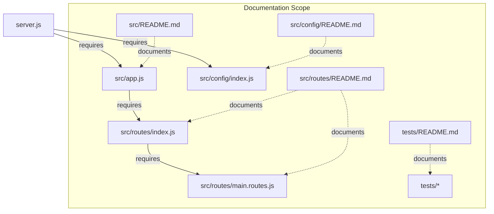
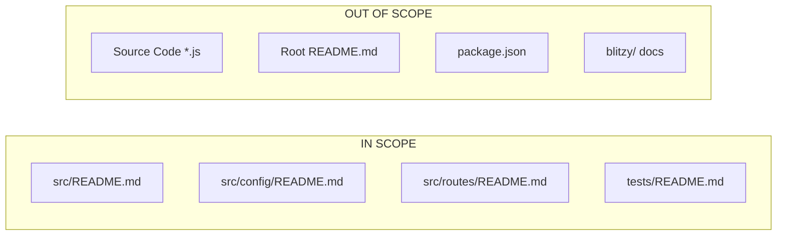

# 0. Agent Action Plan

## 0.1 Intent Clarification

### 0.1.1 Core Documentation Objective

Based on the provided requirements, the Blitzy platform understands that the documentation objective is to **create module-wise README files** that serve as an **onboarding guide for new developers**. The documentation should be written in natural, single language with only necessary details per module.

**Request Categorization:** Create new documentation

**Documentation Type:** Module README files (Developer onboarding guides)

**Explicit Requirements:**

- Create [README.md](http://README.md) files for each module in the codebase
- Include only necessary details (concise, focused documentation)
- Write in natural, single language style
- Purpose: Serve as onboarding guide for new developers

**Surfaced Implicit Requirements:**

- Each module README should explain the module's purpose and responsibility
- Documentation should be beginner-friendly for developer onboarding
- Include basic usage examples where relevant
- Explain how modules relate to the overall application
- Document key files and their purposes within each module
- Include essential commands for testing/running module-specific functionality

### 0.1.2 Special Instructions and Constraints

**Critical Directives:**

- Keep documentation minimal and focused on necessary details only
- Use natural language style (conversational, not overly technical)
- Single language throughout (English)
- Purpose-driven: documentation should help new developers understand and work with each module quickly

**Style Preferences:**

- Natural, conversational tone
- Concise explanations
- Essential information only (no verbose descriptions)
- Quick reference format suitable for developer onboarding

**Template Requirements:**

- No specific template provided by user
- Follow standard [README.md](http://README.md) conventions
- Maintain consistency across all module READMEs

### 0.1.3 Technical Interpretation

These documentation requirements translate to the following technical documentation strategy:

- To document the **config module**, we will create `src/config/README.md` with configuration options, environment variables, and default values
- To document the **routes module**, we will create `src/routes/README.md` with route definitions, HTTP contracts, and handler descriptions
- To document the **tests module**, we will create `tests/README.md` with test organization, execution commands, and coverage information
- To document the **src module** (application core), we will create `src/README.md` with overall application architecture and module relationships

### 0.1.4 Inferred Documentation Needs

Based on repository analysis:

- **Module** `src/config/`: Exports configuration constants (`host`, `port`, `env`) - requires documentation of environment variable overrides and defaults
- **Module** `src/routes/`: Contains route aggregator and handlers - requires documentation of API endpoints and their contracts
- **Module** `src/`: Application factory module - requires documentation of Express app initialization and middleware mounting
- **Module** `tests/`: Organized test suites - requires documentation of test organization, execution patterns, and coverage expectations
- **Root** `server.js`: Entry point - already documented in main [README.md](http://README.md), no separate module README needed

## 0.2 Documentation Discovery and Analysis

### 0.2.1 Existing Documentation Infrastructure Assessment

Repository analysis reveals a **well-documented root-level README** with comprehensive project documentation, but **no module-level README files** exist within subdirectories.

**Current Documentation Structure:**

```plaintext
hao-backprop-test/
├── README.md                    # ✓ Comprehensive project documentation (337 lines)
├── blitzy/
│   └── documentation/
│       ├── Project Guide.md     # ✓ Implementation completion guide
│       └── Technical Specifications.md  # ✓ Testing plan specifications
└── src/                         # ✗ No module READMEs
    ├── config/                  # ✗ No README.md
    └── routes/                  # ✗ No README.md
└── tests/                       # ✗ No README.md
```

**Documentation Coverage Status:**

- Root-level documentation: **Complete** ([README.md](http://README.md) covers project overview, installation, API reference, architecture)
- Module-level documentation: **Missing** (no README files in src/, src/config/, src/routes/, tests/)

**Documentation Framework:** Plain Markdown (no documentation generators detected)

- No mkdocs.yml, docusaurus.config.js, or [sphinx.conf.py](http://sphinx.conf.py) found
- No API documentation tools (JSDoc site generation, TypeDoc) configured
- Inline JSDoc comments exist in source files for code documentation

### 0.2.2 Repository Code Analysis for Documentation

**Search Patterns Used:**

- `src/**/*.js` - Application source modules
- `tests/**/*.test.js` - Test suites
- `*.md` - Existing documentation files

**Key Directories Requiring Module READMEs:**

| Directory | Files | Purpose | Current Docs |
| --- | --- | --- | --- |
| src/ | app.js | Express application factory | None |
| src/config/ | index.js | Configuration management | None |
| src/routes/ | index.js, main.routes.js | Route handlers | None |
| tests/ | unit/, integration/, lifecycle/ | Test suites | None |

**Existing Documentation Found:**

- `README.md` (root): Comprehensive project documentation with API reference, architecture, and testing sections
- `blitzy/documentation/Project Guide.md`: Implementation completion evidence
- `blitzy/documentation/Technical Specifications.md`: Testing specifications and agent action plan

### 0.2.3 Code Documentation Analysis

**JSDoc Comments Present in Source Files:**

| File | JSDoc Coverage | Key Documentation |
| --- | --- | --- |
| server.js | ✓ Complete | Module description, architecture notes, usage examples |
| src/app.js | ✓ Complete | Factory pattern documentation, module exports |
| src/config/index.js | ✓ Complete | Configuration properties with types and defaults |
| src/routes/index.js | ✓ Complete | Barrel pattern usage documentation |
| src/routes/main.routes.js | ✓ Complete | Route contracts with @route annotations |

**Assessment:** Source files have excellent inline documentation; module READMEs will serve as high-level overviews referencing this existing documentation.

### 0.2.4 Web Search Research Conducted

No web search required for this task. The documentation style follows standard Node.js project conventions for module README files. The existing codebase provides sufficient context for creating onboarding documentation.

## 0.3 Documentation Scope Analysis

### 0.3.1 Code-to-Documentation Mapping

**Module:** `src/` **(Application Core)**

- **Files to Document:** `app.js`
- **Purpose:** Express application factory that creates and exports the configured app instance
- **Current Documentation:** JSDoc comments in source; no README
- **Documentation Needed:** Module overview, architectural role, how app.js fits in startup flow

**Module:** `src/config/`

- **Files to Document:** `index.js`
- **Public APIs:**
  - `host` (string): Server binding address
  - `port` (number): Server port number
  - `env` (string): Application environment
- **Current Documentation:** JSDoc comments with @type annotations
- **Documentation Needed:** Quick reference for environment variables, defaults, and usage patterns

**Module:** `src/routes/`

- **Files to Document:** `index.js`, `main.routes.js`
- **Public APIs:**
  - `mainRoutes` (Express Router): Route aggregator export
  - `GET /`: Returns "Hello, World!\\n"
  - `GET /evening`: Returns "Good evening"
- **Current Documentation:** JSDoc comments with @route annotations
- **Documentation Needed:** Route catalog, HTTP contracts, response formats

**Module:** `tests/`

- **Files to Document:** `unit/`, `integration/`, `lifecycle/` directories
- **Test Suites:**
  - `unit/config.test.js`: Configuration module tests (20 assertions)
  - `unit/routes.test.js`: Router structure tests (8 assertions)
  - `integration/endpoints.test.js`: HTTP endpoint tests (10 assertions)
  - `lifecycle/server.test.js`: Server lifecycle tests (5 assertions)
- **Current Documentation:** None
- **Documentation Needed:** Test organization, how to run tests, coverage targets

### 0.3.2 Documentation Gap Analysis

Given the requirements and repository analysis, documentation gaps include:

**Missing Module READMEs:**

| Module Path | Gap Type | Priority | New Developer Impact |
| --- | --- | --- | --- |
| src/README.md | Missing | High | Cannot understand app architecture |
| src/config/README.md | Missing | High | Cannot configure application |
| src/routes/README.md | Missing | Medium | Cannot understand API contracts |
| tests/README.md | Missing | Medium | Cannot run or extend tests |

**Coverage Summary:**

- Modules with documentation: 0/4 (0%)
- Target after implementation: 4/4 (100%)

### 0.3.3 Module Dependency Mapping


```mermaid
graph TD
    A[server.js] -->|requires| B[src/app.js]
    A -->|requires| C[src/config/index.js]
    B -->|requires| D[src/routes/index.js]
    D -->|requires| E[src/routes/main.routes.js]
    
    subgraph "Documentation Scope"
        F[src/README.md] -.->|documents| B
        G[src/config/README.md] -.->|documents| C
        H[src/routes/README.md] -.->|documents| D
        H -.->|documents| E
        I[tests/README.md] -.->|documents| J[tests/*]
    end
```

### 0.3.4 Feature Documentation Requirements

| Feature | Module | Documentation Sections Needed |
| --- | --- | --- |
| Application Initialization | src/ | Purpose, architecture, module exports |
| Environment Configuration | src/config/ | Environment variables, defaults, usage |
| HTTP Routing | src/routes/ | Available routes, request/response contracts |
| Automated Testing | tests/ | Test categories, execution commands, coverage |

## 0.4 Documentation Implementation Design

### 0.4.1 Documentation Structure Planning

**Target Documentation Hierarchy:**

```plaintext
hao-backprop-test/
├── README.md                    # Existing - No changes needed
├── src/
│   ├── README.md               # NEW - Application module overview
│   ├── config/
│   │   └── README.md           # NEW - Configuration module guide
│   └── routes/
│       └── README.md           # NEW - Routes module guide
└── tests/
    └── README.md               # NEW - Testing guide for new developers
```

### 0.4.2 Content Generation Strategy

**Information Extraction Approach:**

- Extract module purpose from JSDoc `@module` annotations in source files
- Extract API signatures from exported functions and objects
- Extract configuration options from `src/config/index.js` exports
- Extract route contracts from `src/routes/main.routes.js` handlers
- Extract test organization from `tests/` folder structure

**Documentation Standards for Module READMEs:**

Each module README will follow this minimal, natural language structure:

1. **Module Title** - Clear, descriptive name
2. **Purpose** - One-paragraph explanation of what this module does
3. **Key Files** - Brief list of important files
4. **How It Works** - Simple explanation of module mechanics
5. **Usage/Examples** - Quick reference for common operations

### 0.4.3 Module README Content Outlines

**Content for** `src/README.md`**:**

- Title: "src - Application Source"
- Purpose paragraph explaining this is the application core
- Key Files section listing app.js
- How It Works section explaining the Express factory pattern

**Content for** `src/config/README.md`**:**

- Title: "Configuration Module"
- Purpose paragraph about centralized configuration
- Environment Variables table with Variable, Default, Description columns
- Usage example showing how to import and use config

**Content for** `src/routes/README.md`**:**

- Title: "Routes Module"
- Purpose paragraph about HTTP routing
- Available Routes table with Route, Method, Response columns
- Files section describing index.js and main.routes.js

**Content for** `tests/README.md`**:**

- Title: "Tests"
- Purpose paragraph about automated testing
- Test Categories section describing unit, integration, lifecycle folders
- Running Tests section with npm commands

### 0.4.4 Writing Style Guidelines

**Tone and Voice:**

- Natural, conversational English
- Write as if explaining to a colleague
- Avoid unnecessary jargon
- Be concise - every sentence should add value

**Formatting Standards:**

- Use Markdown headers for structure
- Use tables for reference data (environment variables, routes)
- Use code blocks for examples
- Keep paragraphs short (2-3 sentences max)

**Content Depth:**

- Essential information only
- Link to source files for detailed implementation
- Avoid duplicating information from root [README.md](http://README.md)

## 0.5 Documentation File Transformation Mapping

### 0.5.1 File-by-File Documentation Plan

**Documentation Transformation Modes:**

- **CREATE** - Create a new documentation file
- **UPDATE** - Update an existing documentation file
- **DELETE** - Remove an obsolete documentation file
- **REFERENCE** - Use as an example for documentation style and structure

| Target Documentation File | Transformation | Source Code/Docs | Content/Changes |
| --- | --- | --- | --- |
| src/README.md | CREATE | src/app.js | Module overview explaining Express app factory, architectural role, and how it connects server.js to routes |
| src/config/README.md | CREATE | src/config/index.js | Configuration guide with environment variables table, defaults, and usage examples |
| src/routes/README.md | CREATE | src/routes/index.js, src/routes/main.routes.js | Routes reference with endpoint catalog, HTTP contracts, and file descriptions |
| tests/README.md | CREATE | tests/unit/, tests/integration/, tests/lifecycle/ | Testing guide with test categories, execution commands, and coverage information |
| README.md | REFERENCE | N/A | Use existing root README style and tone as reference for module READMEs |

### 0.5.2 New Documentation Files Detail

**File:** `src/README.md`

- **Type:** Module Overview
- **Source Code:** `src/app.js`
- **Sections:**
  - Overview (purpose of the src directory)
  - Key Files (app.js description)
  - Architecture (how app.js creates and exports the Express app)
  - Module Relationships (connection to server.js, config, routes)
- **Key Citations:** `src/app.js:1-27`

**File:** `src/config/README.md`

- **Type:** Configuration Reference
- **Source Code:** `src/config/index.js`
- **Sections:**
  - Overview (configuration management purpose)
  - Environment Variables (HOST, PORT, NODE_ENV with defaults)
  - How It Works (Twelve-Factor App methodology)
  - Usage Example (importing and using config)
- **Key Citations:** `src/config/index.js:20-41`

**File:** `src/routes/README.md`

- **Type:** API Routes Reference
- **Source Code:** `src/routes/index.js`, `src/routes/main.routes.js`
- **Sections:**
  - Overview (routing surface description)
  - Available Routes (GET /, GET /evening with contracts)
  - File Descriptions (index.js as barrel, main.routes.js as handlers)
  - Adding New Routes (brief guidance)
- **Key Citations:** `src/routes/main.routes.js:26-39`, `src/routes/index.js:15-19`

**File:** `tests/README.md`

- **Type:** Testing Guide
- **Source Code:** `tests/unit/`, `tests/integration/`, `tests/lifecycle/`
- **Sections:**
  - Overview (testing philosophy and tools)
  - Test Categories (unit, integration, lifecycle)
  - Running Tests (npm test commands)
  - Coverage Requirements (thresholds from jest.config.js)
- **Key Citations:** `jest.config.js`, `package.json:6-12`

### 0.5.3 Complete Documentation File List

**All Documentation Files to Create:**

| # | File Path | Lines (Est.) | Purpose |
| --- | --- | --- | --- |
| 1 | src/README.md | ~25 | Application source module overview |
| 2 | src/config/README.md | ~35 | Configuration module reference |
| 3 | src/routes/README.md | ~40 | Routes module and API reference |
| 4 | tests/README.md | ~45 | Testing guide for developers |

**Total New Files:** 4\
**Total Estimated Lines:** \~145

### 0.5.4 Documentation Cross-References

**Internal Links Required:**

- `src/README.md` should reference `src/config/README.md` and `src/routes/README.md`
- `tests/README.md` should reference source modules being tested
- All module READMEs should reference root `README.md` for project overview

**Navigation Structure:**

- Each module README is self-contained for quick access
- Root README remains the primary entry point for project documentation

## 0.6 Dependency Inventory

### 0.6.1 Documentation Dependencies

This documentation task requires no additional tooling or packages. The project uses plain Markdown files which require no build or compilation steps.

**Current Documentation Tools:**

| Registry | Package Name | Version | Purpose |
| --- | --- | --- | --- |
| N/A | Markdown | N/A | Native documentation format - no tooling required |

**Note:** No documentation generators (mkdocs, docusaurus, sphinx, typedoc) are configured in this project. Module READMEs will be plain Markdown files viewable directly on GitHub or any Markdown renderer.

### 0.6.2 Project Runtime Dependencies

These dependencies are documented for reference in module READMEs:

| Registry | Package Name | Version | Purpose |
| --- | --- | --- | --- |
| npm | express | ^5.1.0 | Web framework for HTTP handling and routing |

### 0.6.3 Project Development Dependencies

These dependencies support testing documentation:

| Registry | Package Name | Version | Purpose |
| --- | --- | --- | --- |
| npm | jest | ^30.2.0 | JavaScript testing framework |
| npm | supertest | ^7.1.4 | HTTP assertion library for endpoint testing |

### 0.6.4 Runtime Environment Requirements

| Component | Version Requirement | Source |
| --- | --- | --- |
| Node.js | >= 18.x (20.19.x LTS recommended) | README.md lines 12-14 |
| npm | >= 8.x (10.8.x recommended) | README.md lines 12-14 |

### 0.6.5 Documentation Reference Updates

**No link updates required.** This is a new documentation creation task with no existing module READMEs to update.

**Future Maintenance Consideration:**

- If root [README.md](http://README.md) is updated with module-level links, add navigation links pointing to new module READMEs

## 0.7 Coverage and Quality Targets

### 0.7.1 Documentation Coverage Metrics

**Current Coverage Analysis:**

| Documentation Category | Current | Target | Status |
| --- | --- | --- | --- |
| Module READMEs created | 0/4 | 4/4 | 0% → 100% |
| Source modules documented | 0/3 | 3/3 | 0% → 100% |
| Test modules documented | 0/1 | 1/1 | 0% → 100% |

**Target Coverage:** 100% of identified modules will have README documentation.

**Coverage Gaps to Address:**

| Module | Current Coverage | Target | Focus Areas |
| --- | --- | --- | --- |
| src/ | 0% | 100% | Application architecture, module exports |
| src/config/ | 0% | 100% | Environment variables, defaults |
| src/routes/ | 0% | 100% | Route contracts, HTTP responses |
| tests/ | 0% | 100% | Test organization, execution commands |

### 0.7.2 Documentation Quality Criteria

**Completeness Requirements:**

- Each module README explains the module's purpose in 1-2 sentences
- All key files within each module are listed and described
- Configuration modules include environment variable tables
- Route modules include endpoint contracts with request/response details
- Test modules include execution commands and category descriptions

**Clarity Standards:**

- Natural, conversational language throughout
- Technical accuracy with accessible explanations
- No jargon without explanation
- Short paragraphs (2-3 sentences maximum)
- Consistent terminology with existing [README.md](http://README.md)

**Maintainability Criteria:**

- Source file references for traceability
- Self-contained documentation (no external dependencies)
- Easy to update when source code changes
- Clear structure for adding new content

### 0.7.3 Example and Content Requirements

**Minimum Content Per Module README:**

| Content Element | src/ | src/config/ | src/routes/ | tests/ |
| --- | --- | --- | --- | --- |
| Purpose paragraph | ✓ | ✓ | ✓ | ✓ |
| Key files list | ✓ | ✓ | ✓ | ✓ |
| How it works section | ✓ | ✓ | ✓ | ✓ |
| Reference table | Optional | ✓ (env vars) | ✓ (routes) | ✓ (categories) |
| Usage example | Optional | ✓ | Optional | ✓ (commands) |

### 0.7.4 Quality Validation Checklist

Before marking documentation complete, verify:

- [ ] Each README is readable in under 2 minutes

- [ ] No broken relative links

- [ ] Consistent header hierarchy (# for title, ## for sections)

- [ ] Code examples use correct syntax highlighting

- [ ] Tables render correctly in Markdown

- [ ] All claims match actual source code behavior

- [ ] Natural language tone maintained throughout

## 0.8 Scope Boundaries

### 0.8.1 Exhaustively In Scope

**New Documentation Files (CREATE):**

- `src/README.md` - Application source module documentation
- `src/config/README.md` - Configuration module documentation
- `src/routes/README.md` - Routes module documentation
- `tests/README.md` - Testing documentation

**Documentation Content:**

- Module purpose and responsibilities
- Key file descriptions
- Environment variable references (for config module)
- Route endpoint contracts (for routes module)
- Test execution commands (for tests module)
- Brief usage guidance

**Documentation Format:**

- Plain Markdown files
- Tables for structured data
- Code blocks for examples
- Natural language explanations

### 0.8.2 Explicitly Out of Scope

**Source Code Modifications:**

- No changes to `server.js`
- No changes to `src/app.js`
- No changes to `src/config/index.js`
- No changes to `src/routes/*.js`
- No changes to `tests/**/*.test.js`
- No modifications to JSDoc comments in source files
- No modifications to root `README.md`
- No modifications to `blitzy/documentation/*.md`
- No modifications to `.gitignore`

**Configuration Files:**

- No changes to `package.json`
- No changes to `jest.config.js`
- No changes to `package-lock.json`

**New Features or Tools:**

- No documentation generator setup (mkdocs, docusaurus, etc.)
- No API documentation generation (JSDoc site, TypeDoc)
- No CI/CD pipeline changes
- No automated documentation building

**Documentation Types Not Requested:**

- API reference documentation with full parameter details
- Architecture diagrams (beyond simple text-based flow)
- Contribution guidelines
- Changelog documentation
- Deployment guides
- Docker/containerization documentation

### 0.8.3 Scope Boundaries Summary


```mermaid
graph LR
    subgraph "IN SCOPE"
        A[src/README.md]
        B[src/config/README.md]
        C[src/routes/README.md]
        D[tests/README.md]
    end
    
    subgraph "OUT OF SCOPE"
        E[Source Code *.js]
        F[Root README.md]
        G[package.json]
        H[blitzy/ docs]
    end
```

### 0.8.4 Scope Verification Checklist

| Item | In Scope? | Notes |
| --- | --- | --- |
| Create src/README.md | ✓ Yes | New file |
| Create src/config/README.md | ✓ Yes | New file |
| Create src/routes/README.md | ✓ Yes | New file |
| Create tests/README.md | ✓ Yes | New file |
| Modify any .js files | ✗ No | Source code excluded |
| Modify root README.md | ✗ No | Existing docs excluded |
| Add documentation tools | ✗ No | Not requested |

## 0.9 Execution Parameters

### 0.9.1 Documentation-Specific Instructions

**Documentation Build Command:** None required (plain Markdown)

**Documentation Preview Command:**

- Open files directly in any Markdown viewer
- Use VS Code Markdown preview
- View on GitHub after commit

**Documentation Validation:**

- Manual review for Markdown syntax
- Link validation (relative paths only)
- No automated linting configured

**Default Format:** Markdown with GitHub-Flavored Markdown (GFM) support

**Citation Requirement:** Reference source files where specific behavior is documented

**Style Guide:** Follow natural language style with concise explanations

### 0.9.2 File Naming Conventions

| Convention | Standard |
| --- | --- |
| File name | README.md (uppercase, standard convention) |
| Location | Root of each module directory |
| Format | GitHub-Flavored Markdown |

### 0.9.3 Content Organization Rules

**Header Hierarchy:**

- `#` (H1) - Module title only (one per file)
- `##` (H2) - Major sections
- `###` (H3) - Subsections (use sparingly)

**Section Order:**

1. Title (H1)
2. Purpose/Overview (first paragraph, no header needed)
3. Key Files (if applicable)
4. How It Works / Details
5. Usage / Examples (if applicable)

### 0.9.4 Rules for Documentation

**User-Specified Documentation Rules:**

- "Document code on module wise readme files"
- "Only add necessary details for each module"
- "Natural and single language"
- "Can be used for onboarding guide for new devs"

**Derived Implementation Rules:**

- Keep each README concise (under 50 lines preferred)
- Use plain English without excessive technical jargon
- Write as if explaining to a new team member
- Focus on "what" and "how" rather than implementation details
- Include only essential information for getting started
- Maintain consistent tone and structure across all module READMEs

### 0.9.5 Success Criteria

Documentation is complete when:

- All 4 module READMEs are created
- Each README is self-contained and readable
- A new developer can understand each module's purpose within 2 minutes
- No source code modifications were required
- Documentation follows natural language style

## 0.10 References

### 0.10.1 Repository Files Analyzed

**Source Code Files:**

| File Path | Purpose | Lines Analyzed |
| --- | --- | --- |
| server.js | HTTP server entry point | 1-53 |
| src/app.js | Express application factory | 1-27 |
| src/config/index.js | Configuration management module | 1-41 |
| src/routes/index.js | Route aggregator (barrel pattern) | 1-19 |
| src/routes/main.routes.js | Route handlers implementation | 1-41 |

**Configuration Files:**

| File Path | Purpose | Lines Analyzed |
| --- | --- | --- |
| package.json | npm manifest and scripts | 1-22 |
| jest.config.js | Jest test configuration | Referenced via folder summary |

**Existing Documentation:**

| File Path | Purpose | Lines Analyzed |
| --- | --- | --- |
| README.md | Project documentation | 1-337 |

### 0.10.2 Folders Analyzed

| Folder Path | Contents | Purpose |
| --- | --- | --- |
| / (root) | 6 files, 3 folders | Repository root |
| src/ | 1 file, 2 folders | Application source |
| src/config/ | 1 file | Configuration module |
| src/routes/ | 2 files | Routing module |
| tests/ | 3 folders | Test suites |
| tests/unit/ | 2 files | Unit tests |
| tests/integration/ | 1 file | Integration tests |
| tests/lifecycle/ | 1 file | Lifecycle tests |
| blitzy/ | 1 folder | Documentation artifacts |

### 0.10.3 User-Provided Attachments

**Attachments:** None provided

### 0.10.4 Figma Resources

**Figma URLs:** None provided

### 0.10.5 External References

**Web Searches Conducted:** None required

**Documentation Standards Referenced:**

- GitHub-Flavored Markdown (GFM) specification
- Standard Node.js project README conventions

### 0.10.6 Key Source Citations for Module READMEs

| Module README | Primary Source | Key Content Reference |
| --- | --- | --- |
| src/README.md | src/app.js | JSDoc module description (lines 1-12) |
| src/config/README.md | src/config/index.js | Environment variable exports (lines 20-41) |
| src/routes/README.md | src/routes/main.routes.js | Route handlers with contracts (lines 26-39) |
| tests/README.md | tests/ folder structure | Test organization (unit, integration, lifecycle) |
