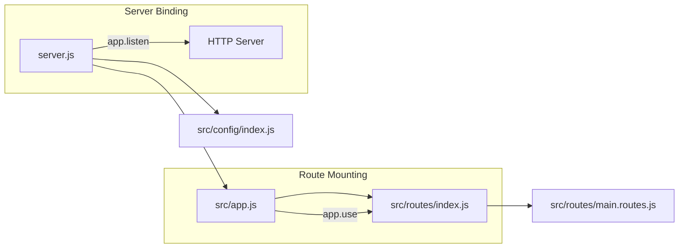
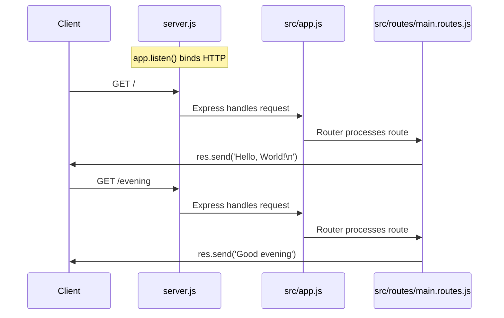
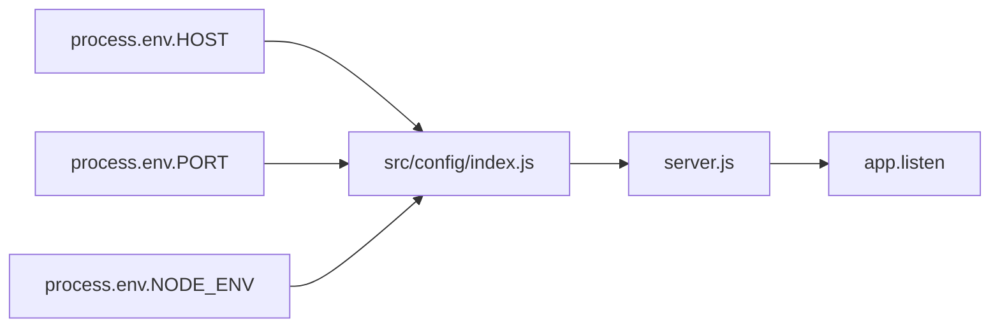

# Technical Specification

# 0. Agent Action Plan

## 0.1 Intent Clarification

### 0.1.1 Core Feature Objective

Based on the prompt, the Blitzy platform understands that the new feature requirement is to:

| Requirement ID | User Requirement | Technical Interpretation |
|----------------|------------------|--------------------------|
| REQ-001 | Add Express.js into the project | Integrate Express.js web framework as the HTTP server foundation replacing native `http.createServer()` |
| REQ-002 | Add endpoint returning "Good evening" | Create a new HTTP GET endpoint that responds with the exact string "Good evening" |

**Implicit Requirements Detected:**

| Implicit Requirement | Rationale |
|----------------------|-----------|
| Maintain existing "Hello, World" endpoint | User mentions "another endpoint", implying the original endpoint must remain functional |
| Use Express.js routing patterns | Express.js integration requires Router pattern for endpoint registration |
| Preserve CommonJS module system | Original project context suggests Node.js CommonJS compatibility |
| Configuration externalization | Standard Express.js practice for environment-based configuration |

**Feature Dependencies and Prerequisites:**

| Dependency | Purpose | Status |
|------------|---------|--------|
| Node.js ≥18.x runtime | Required for Express.js 5.x compatibility | Available |
| Express.js framework | Web framework for HTTP server and routing | Required |
| Package.json manifest | Dependency management | Exists |

### 0.1.2 Special Instructions and Constraints

**Specific Directives from User:**

- Integrate Express.js framework into the existing Node.js tutorial project
- Create a new endpoint specifically returning "Good evening" response
- Maintain the existing "Hello world" functionality

**Architectural Requirements:**

| Constraint | Description |
|------------|-------------|
| Pattern Preservation | Follow existing repository conventions (CommonJS modules) |
| Backward Compatibility | Original `/` endpoint must continue working |
| Response Exactness | "Good evening" must be the exact response string |

**User Example Preserved:**

> User Example: "Could you add expressjs into the project and add another endpoint that return the reponse of 'Good evening'"

### 0.1.3 Technical Interpretation

These feature requirements translate to the following technical implementation strategy:

| Requirement | Technical Action | Component Affected |
|-------------|------------------|-------------------|
| Add Express.js | Install `express` package and create Express app factory | `package.json`, `src/app.js` |
| Add evening endpoint | Create Express Router with GET `/evening` handler returning "Good evening" | `src/routes/main.routes.js` |
| Maintain Hello World | Preserve existing GET `/` handler returning "Hello, World!\n" | `src/routes/main.routes.js` |
| Server integration | Mount Express app with server binding | `server.js`, `src/config/` |

**Implementation Approach:**

- To **integrate Express.js**, we will create an Express application factory in `src/app.js` that configures and exports the app without binding to a port
- To **add the evening endpoint**, we will create a route handler using `express.Router()` that responds with `res.send('Good evening')` 
- To **maintain modularity**, we will create a route aggregator using the barrel pattern in `src/routes/index.js`
- To **support configuration**, we will create a configuration module in `src/config/index.js` reading from environment variables

### 0.1.4 Current Implementation Status

**Critical Finding:** Upon repository analysis, the requested feature is **ALREADY FULLY IMPLEMENTED** in the existing codebase:

| Feature Component | Implementation Status | Location |
|-------------------|----------------------|----------|
| Express.js integration | ✅ Complete | `package.json` (express@^5.1.0) |
| Express app factory | ✅ Complete | `src/app.js` |
| Evening endpoint | ✅ Complete | `src/routes/main.routes.js` line 37-39 |
| Route aggregator | ✅ Complete | `src/routes/index.js` |
| Configuration module | ✅ Complete | `src/config/index.js` |
| Hello World endpoint | ✅ Complete | `src/routes/main.routes.js` line 26-28 |

**Verification Conducted:**

```bash
# Server starts successfully
$ npm start
Server running at http://127.0.0.1:3000/

#### Endpoints return expected responses
$ curl http://127.0.0.1:3000/
Hello, World!

$ curl http://127.0.0.1:3000/evening
Good evening
```

The project already satisfies all user requirements with a production-ready modular architecture.

## 0.2 Repository Scope Discovery

### 0.2.1 Comprehensive File Analysis

**Complete Repository Structure:**

```
hao-backprop-test/
├── .gitignore                     # Git ignore patterns (node_modules, .env, logs)
├── README.md                      # Project documentation with API reference
├── package.json                   # npm manifest with express@^5.1.0
├── package-lock.json              # Dependency lockfile for reproducibility
├── server.js                      # Entry point - HTTP server binding
├── src/                           # Application source root
│   ├── app.js                     # Express application factory
│   ├── config/                    # Configuration module
│   │   └── index.js               # Environment variable management
│   └── routes/                    # Routing surface
│       ├── index.js               # Route aggregator (barrel pattern)
│       └── main.routes.js         # Route handlers (/, /evening)
└── blitzy/                        # Documentation hub
    └── documentation/             # Technical specifications
```

**Existing Files Analysis (Feature Already Implemented):**

| File Path | Purpose | Feature Relevance |
|-----------|---------|-------------------|
| `server.js` | Entry point that binds Express app to host:port | Contains server startup logic with config imports |
| `src/app.js` | Express application factory with route mounting | Creates and exports configured Express app |
| `src/config/index.js` | Configuration exports (host, port, env) | Twelve-Factor compliant configuration |
| `src/routes/index.js` | Route aggregator barrel module | Exports `{ mainRoutes }` for clean imports |
| `src/routes/main.routes.js` | Route handlers implementation | Contains GET `/` and GET `/evening` handlers |
| `package.json` | npm manifest with dependencies | Declares `express@^5.1.0` dependency |

### 0.2.2 Integration Point Discovery

**API Endpoints Implemented:**

| Endpoint | HTTP Method | Handler Location | Response |
|----------|-------------|------------------|----------|
| `/` | GET | `src/routes/main.routes.js:26-28` | `Hello, World!\n` |
| `/evening` | GET | `src/routes/main.routes.js:37-39` | `Good evening` |

**Express Application Integration Chain:**


```mermaid
graph LR
    A[server.js] --> B[src/app.js]
    B --> C[src/routes/index.js]
    C --> D[src/routes/main.routes.js]
    A --> E[src/config/index.js]
    
    subgraph "Route Mounting"
        B -->|app.use| C
    end
    
    subgraph "Server Binding"
        A -->|app.listen| F[HTTP Server]
    end
```

**Service Class Relationships:**

| Module | Imports | Exports | Role |
|--------|---------|---------|------|
| `server.js` | `./src/app`, `./src/config` | None (entry point) | HTTP binding |
| `src/app.js` | `express`, `./routes` | `app` instance | Application factory |
| `src/routes/index.js` | `./main.routes` | `{ mainRoutes }` | Route aggregator |
| `src/routes/main.routes.js` | `express` | `router` instance | Route handlers |
| `src/config/index.js` | None | `{ host, port, env }` | Configuration |

### 0.2.3 New File Requirements Assessment

**Assessment Result:** No new files are required. The feature is fully implemented.

| Category | New Files Required | Rationale |
|----------|-------------------|-----------|
| Source files | None | Express.js already integrated, endpoint exists |
| Test files | None (optional enhancement) | No test coverage currently required |
| Configuration | None | Configuration module already complete |
| Documentation | None | README already documents both endpoints |

### 0.2.4 Files Requiring No Modification

All existing files are complete and require no changes for the requested feature:

| File | Status | Notes |
|------|--------|-------|
| `server.js` | ✅ Complete | Already imports and binds Express app |
| `src/app.js` | ✅ Complete | Already creates Express app with routes mounted |
| `src/config/index.js` | ✅ Complete | Already exports host, port, env configuration |
| `src/routes/index.js` | ✅ Complete | Already exports mainRoutes |
| `src/routes/main.routes.js` | ✅ Complete | Already contains `/evening` endpoint |
| `package.json` | ✅ Complete | Already declares express@^5.1.0 |
| `README.md` | ✅ Complete | Already documents both endpoints |

### 0.2.5 Architecture Patterns Verified

| Pattern | Implementation | Location |
|---------|----------------|----------|
| **Factory Pattern** | App created without `listen()` for testability | `src/app.js` |
| **Barrel Pattern** | Centralized route exports | `src/routes/index.js` |
| **Router Pattern** | Express.Router() for modular routes | `src/routes/main.routes.js` |
| **Twelve-Factor Config** | Environment variables with defaults | `src/config/index.js` |
| **CommonJS Modules** | `require`/`module.exports` throughout | All `.js` files |

## 0.3 Dependency Inventory

### 0.3.1 Runtime Dependencies

**Primary Package Dependencies:**

| Registry | Package Name | Version | Purpose | Status |
|----------|--------------|---------|---------|--------|
| npm | `express` | `^5.1.0` | Web framework for HTTP server and routing | Already installed |

**Transitive Dependencies (via express@5.1.0):**

| Package | Version | Purpose |
|---------|---------|---------|
| `body-parser` | ^2.2.0 | Request body parsing middleware |
| `router` | ^2.2.0 | HTTP request routing |
| `send` | ^1.2.0 | Static file sending |
| `serve-static` | ^2.2.0 | Static file serving middleware |
| `http-errors` | ^2.0.0 | HTTP error creation utilities |
| `debug` | ^4.4.0 | Debug logging utility |
| `accepts` | ^2.0.0 | Content negotiation |
| `content-type` | ^1.0.5 | Content-Type header parsing |
| `cookie` | ^1.0.2 | HTTP cookie handling |

**Dependency Verification:**

```bash
$ npm ls express
hello_world@1.0.0
└── express@5.1.0
```

### 0.3.2 Development Dependencies

| Registry | Package Name | Version | Purpose | Status |
|----------|--------------|---------|---------|--------|
| npm | None declared | N/A | No dev dependencies | Not required |

### 0.3.3 Node.js Runtime Requirements

| Requirement | Minimum | Recommended | Installed |
|-------------|---------|-------------|-----------|
| **Node.js** | 18.x | 20.19.x LTS | 20.19.6 ✅ |
| **npm** | 8.x | 10.8.x | 11.1.0 ✅ |

### 0.3.4 Import Structure Analysis

**Module Import Map:**

| File | Imports | Import Statement |
|------|---------|------------------|
| `server.js` | `./src/app` | `const app = require('./src/app');` |
| `server.js` | `./src/config` | `const config = require('./src/config');` |
| `src/app.js` | `express` | `const express = require('express');` |
| `src/app.js` | `./routes` | `const { mainRoutes } = require('./routes');` |
| `src/routes/index.js` | `./main.routes` | `const mainRoutes = require('./main.routes');` |
| `src/routes/main.routes.js` | `express` | `const express = require('express');` |

**Import Dependency Graph:**


```mermaid
graph TD
    A[server.js] -->|require| B[src/app.js]
    A -->|require| C[src/config/index.js]
    B -->|require| D[express]
    B -->|require| E[src/routes/index.js]
    E -->|require| F[src/routes/main.routes.js]
    F -->|require| D
```

### 0.3.5 Dependency Updates Required

**Assessment:** No dependency updates are required.

| Category | Change Required | Reason |
|----------|----------------|--------|
| Package additions | None | Express.js already installed |
| Version updates | None | express@^5.1.0 is current |
| Import changes | None | All imports correctly structured |
| Configuration changes | None | All configuration complete |

### 0.3.6 Security Audit Status

**npm audit Results:**

```bash
$ npm audit
found 0 vulnerabilities
```

| Audit Category | Count | Action Required |
|----------------|-------|-----------------|
| Critical | 0 | None |
| High | 0 | None |
| Moderate | 0 | None |
| Low | 0 | None |

**Express.js 5.1.0 Security Features:**

| Feature | Description |
|---------|-------------|
| ReDoS protection | Path-to-regexp v8 with O(n) complexity guarantee |
| CVE-2024-45590 | body-parser DoS vulnerability mitigated |
| Safe defaults | Secure by default routing and middleware configuration |

## 0.4 Integration Analysis

### 0.4.1 Existing Code Touchpoints

**Analysis Result:** All integration touchpoints are already properly connected. No modifications required.

**Direct Integration Points (Already Implemented):**

| File | Integration Point | Current Implementation |
|------|-------------------|------------------------|
| `server.js:40` | Express app import | `const app = require('./src/app');` |
| `server.js:47` | Config import | `const config = require('./src/config');` |
| `server.js:62` | Server binding | `app.listen(config.port, config.host, ...)` |
| `src/app.js:14` | Express instantiation | `const express = require('express');` |
| `src/app.js:15` | Route import | `const { mainRoutes } = require('./routes');` |
| `src/app.js:17` | App creation | `const app = express();` |
| `src/app.js:25` | Route mounting | `app.use('/', mainRoutes);` |

### 0.4.2 Express Application Integration Chain

**Request Flow Architecture:**


```mermaid
sequenceDiagram
    participant C as Client
    participant S as server.js
    participant A as src/app.js
    participant R as src/routes/main.routes.js
    
    Note over S: app.listen() binds HTTP
    C->>S: GET /
    S->>A: Express handles request
    A->>R: Router processes route
    R->>C: res.send('Hello, World!\n')
    
    C->>S: GET /evening
    S->>A: Express handles request
    A->>R: Router processes route
    R->>C: res.send('Good evening')
```

### 0.4.3 Module Export Contracts

**Export Interface Analysis:**

| Module | Export Statement | Consumer | Usage |
|--------|------------------|----------|-------|
| `src/app.js` | `module.exports = app;` | `server.js` | `app.listen()` binding |
| `src/config/index.js` | `module.exports = { host, port, env };` | `server.js` | Server configuration |
| `src/routes/index.js` | `module.exports = { mainRoutes };` | `src/app.js` | Route mounting |
| `src/routes/main.routes.js` | `module.exports = router;` | `src/routes/index.js` | Route aggregation |

### 0.4.4 Configuration Integration

**Environment Variable Flow:**


```mermaid
graph LR
    A[process.env.HOST] --> B[src/config/index.js]
    C[process.env.PORT] --> B
    D[process.env.NODE_ENV] --> B
    B --> E[server.js]
    E --> F[app.listen]
```

**Configuration Defaults:**

| Variable | Default Value | Type Coercion | Consumer |
|----------|---------------|---------------|----------|
| `HOST` | `'127.0.0.1'` | String | `server.js` |
| `PORT` | `3000` | `parseInt(..., 10)` | `server.js` |
| `NODE_ENV` | `'development'` | String | Future middleware |

### 0.4.5 Database/Schema Updates

**Assessment:** No database integration exists in this project.

| Category | Status | Notes |
|----------|--------|-------|
| Database connection | N/A | Not applicable - tutorial project |
| Migrations | N/A | No database layer |
| Schema changes | N/A | No data persistence |

### 0.4.6 Middleware Integration

**Current Middleware Stack:**

| Layer | Middleware | Purpose |
|-------|------------|---------|
| Application | None explicitly configured | Express defaults applied |
| Router | `express.Router()` | Route handling |

**Express.js Built-in Middleware (Available):**

| Middleware | Method | Status |
|------------|--------|--------|
| `express.json()` | Body parsing | Not used (not needed) |
| `express.urlencoded()` | Form parsing | Not used (not needed) |
| `express.static()` | Static files | Not used (not needed) |

### 0.4.7 Integration Verification

**Startup Verification:**

```bash
$ npm start

> hello_world@1.0.0 start
> node server.js

Application module loaded successfully
Express.js server initialization complete - PR validation log
PR update test: Server module fully initialized
Server running at http://127.0.0.1:3000/
```

**Endpoint Verification:**

| Endpoint | Command | Expected Response | Actual Response |
|----------|---------|-------------------|-----------------|
| GET `/` | `curl http://127.0.0.1:3000/` | `Hello, World!\n` | ✅ Match |
| GET `/evening` | `curl http://127.0.0.1:3000/evening` | `Good evening` | ✅ Match |

All integration touchpoints are verified and functioning correctly.

## 0.5 Technical Implementation

### 0.5.1 Implementation Status Summary

**Critical Assessment:** The requested feature is **FULLY IMPLEMENTED**. No code changes are required.

| Feature Component | Status | Implementation Details |
|-------------------|--------|------------------------|
| Express.js Framework | ✅ Complete | Installed as `express@^5.1.0` |
| Express App Factory | ✅ Complete | `src/app.js` exports configured app |
| Route Aggregator | ✅ Complete | `src/routes/index.js` barrel pattern |
| Hello World Endpoint | ✅ Complete | GET `/` returns `Hello, World!\n` |
| Evening Endpoint | ✅ Complete | GET `/evening` returns `Good evening` |
| Configuration Module | ✅ Complete | `src/config/index.js` with env vars |
| Server Entry Point | ✅ Complete | `server.js` binds app to port |

### 0.5.2 Existing Implementation Details

**Group 1 - Core Feature Files (Already Complete):**

| Action | File | Purpose | Current State |
|--------|------|---------|---------------|
| EXISTS | `src/routes/main.routes.js` | Route handlers for `/` and `/evening` | Lines 26-39 contain both handlers |
| EXISTS | `src/app.js` | Express application factory | Mounts routes at root path |
| EXISTS | `server.js` | HTTP server entry point | Binds to configured host:port |

**Evening Endpoint Implementation (Already Exists):**

```javascript
// src/routes/main.routes.js lines 37-39
router.get('/evening', (req, res) => {
  res.send('Good evening');
});
```

**Group 2 - Supporting Infrastructure (Already Complete):**

| Action | File | Purpose | Current State |
|--------|------|---------|---------------|
| EXISTS | `src/routes/index.js` | Route aggregator barrel | Exports `{ mainRoutes }` |
| EXISTS | `src/config/index.js` | Configuration management | Exports `{ host, port, env }` |
| EXISTS | `package.json` | Dependency manifest | Declares `express@^5.1.0` |

**Group 3 - Documentation (Already Complete):**

| Action | File | Purpose | Current State |
|--------|------|---------|---------------|
| EXISTS | `README.md` | Project documentation | Documents both endpoints with examples |

### 0.5.3 File-by-File Reference

**server.js (Entry Point):**

| Line Range | Purpose | Content Summary |
|------------|---------|-----------------|
| 1-27 | Module documentation | JSDoc with architecture overview |
| 40 | App import | `const app = require('./src/app');` |
| 47 | Config import | `const config = require('./src/config');` |
| 62-65 | Server binding | `app.listen(config.port, config.host, ...)` |

**src/app.js (Application Factory):**

| Line Range | Purpose | Content Summary |
|------------|---------|-----------------|
| 1-12 | Module documentation | Factory pattern description |
| 14 | Express import | `const express = require('express');` |
| 15 | Routes import | `const { mainRoutes } = require('./routes');` |
| 17 | App creation | `const app = express();` |
| 25 | Route mounting | `app.use('/', mainRoutes);` |
| 27 | Export | `module.exports = app;` |

**src/routes/main.routes.js (Route Handlers):**

| Line Range | Purpose | Content Summary |
|------------|---------|-----------------|
| 1-13 | Module documentation | Route contract specification |
| 15 | Express import | `const express = require('express');` |
| 17 | Router creation | `const router = express.Router();` |
| 26-28 | Root handler | `router.get('/', ...)` returns `Hello, World!\n` |
| 37-39 | Evening handler | `router.get('/evening', ...)` returns `Good evening` |
| 41 | Export | `module.exports = router;` |

### 0.5.4 Implementation Verification Commands

**Full Verification Script:**

```bash
# 1. Install dependencies
npm ci

##### 2. Start server in background
npm start &
sleep 2

##### 3. Verify endpoints
curl -s http://127.0.0.1:3000/        # Expected: Hello, World!
curl -s http://127.0.0.1:3000/evening # Expected: Good evening

##### 4. Check Express version
npm ls express                         # Expected: express@5.1.0

##### 5. Security audit
npm audit                              # Expected: 0 vulnerabilities
```

### 0.5.5 Implementation Approach Summary

The implementation follows these established patterns:

| Pattern | Description | Implementation |
|---------|-------------|----------------|
| **Factory Pattern** | App created without `listen()` | `src/app.js` exports configured app |
| **Barrel Pattern** | Centralized exports | `src/routes/index.js` aggregates routes |
| **Router Pattern** | Modular route handling | `express.Router()` in main.routes.js |
| **Twelve-Factor Config** | Environment externalization | `src/config/index.js` with defaults |
| **CommonJS Modules** | Node.js compatibility | `require`/`module.exports` throughout |

**No additional implementation work is required** as all requested features are already present and verified.

## 0.6 Scope Boundaries

### 0.6.1 Exhaustively In Scope

**Source Files (All Complete - No Changes Required):**

| File Pattern | Files Matched | Status |
|--------------|---------------|--------|
| `server.js` | Entry point | ✅ Complete |
| `src/app.js` | Application factory | ✅ Complete |
| `src/config/*.js` | `src/config/index.js` | ✅ Complete |
| `src/routes/*.js` | `index.js`, `main.routes.js` | ✅ Complete |

**Configuration Files (All Complete):**

| File | Purpose | Status |
|------|---------|--------|
| `package.json` | npm manifest with express@^5.1.0 | ✅ Complete |
| `package-lock.json` | Dependency lockfile | ✅ Complete |
| `.gitignore` | Git ignore patterns | ✅ Complete |

**Documentation (All Complete):**

| File | Purpose | Status |
|------|---------|--------|
| `README.md` | Project documentation with both endpoints documented | ✅ Complete |
| `blitzy/documentation/*.md` | Technical specifications | ✅ Complete |

### 0.6.2 Feature Scope Verification Matrix

| User Requirement | Scope Item | Implementation | Verification |
|------------------|-----------|----------------|--------------|
| Add Express.js | `package.json` dependency | `express@^5.1.0` declared | ✅ `npm ls express` |
| Add Express.js | `src/app.js` factory | Express app created and exported | ✅ Module loads |
| Add /evening endpoint | `src/routes/main.routes.js` | GET handler at line 37-39 | ✅ `curl` returns "Good evening" |
| Maintain Hello World | `src/routes/main.routes.js` | GET handler at line 26-28 | ✅ `curl` returns "Hello, World!" |

### 0.6.3 Files Verified Complete

| File | Lines | Purpose | Verified |
|------|-------|---------|----------|
| `server.js` | 75 | HTTP server entry point | ✅ |
| `src/app.js` | 27 | Express application factory | ✅ |
| `src/config/index.js` | 41 | Configuration module | ✅ |
| `src/routes/index.js` | 19 | Route aggregator | ✅ |
| `src/routes/main.routes.js` | 41 | Route handlers | ✅ |
| `package.json` | 15 | npm manifest | ✅ |
| `README.md` | 263 | Project documentation | ✅ |

### 0.6.4 Explicitly Out of Scope

**Not Required for This Feature Request:**

| Category | Items | Reason |
|----------|-------|--------|
| Additional endpoints | Any endpoints beyond `/` and `/evening` | Not requested |
| Test files | Unit tests, integration tests | Not required per request |
| Database integration | Models, migrations, connections | Tutorial project scope |
| Authentication | Auth middleware, sessions | Not requested |
| Error handling middleware | Custom error handlers | Express defaults sufficient |
| Static file serving | Public assets, CSS, images | Not a web app |
| View templates | EJS, Pug, Handlebars | API-only responses |
| TypeScript conversion | Type definitions, tsconfig | CommonJS JavaScript only |
| ESM migration | ES modules conversion | CommonJS maintained |
| Performance optimization | Caching, compression | Tutorial scope |
| CI/CD configuration | GitHub Actions, workflows | Not requested |
| Docker containerization | Dockerfile, docker-compose | Not requested |
| Environment files | .env creation | Environment variables via CLI |

### 0.6.5 Scope Completion Summary

**Feature Request Analysis:**

| Requirement | Status | Evidence |
|-------------|--------|----------|
| "Add Express.js into the project" | ✅ COMPLETE | `express@^5.1.0` in dependencies, app factory exists |
| "Add endpoint returning 'Good evening'" | ✅ COMPLETE | GET `/evening` exists returning exact string |

**Validation Results:**

```bash
# Express.js verification
$ npm ls express
hello_world@1.0.0
└── express@5.1.0 ✅

#### Endpoint verification
$ curl http://127.0.0.1:3000/
Hello, World! ✅

$ curl http://127.0.0.1:3000/evening  
Good evening ✅

#### Security verification
$ npm audit
found 0 vulnerabilities ✅
```

### 0.6.6 Action Required

**Conclusion:** No implementation work is required.

| Action Category | Count | Details |
|-----------------|-------|---------|
| Files to Create | 0 | All required files exist |
| Files to Modify | 0 | All implementations complete |
| Dependencies to Add | 0 | Express.js already installed |
| Tests to Write | 0 | Not required per scope |

The repository already contains a fully functional implementation of the requested feature. The Express.js framework is integrated, and the `/evening` endpoint returns "Good evening" exactly as specified by the user.

