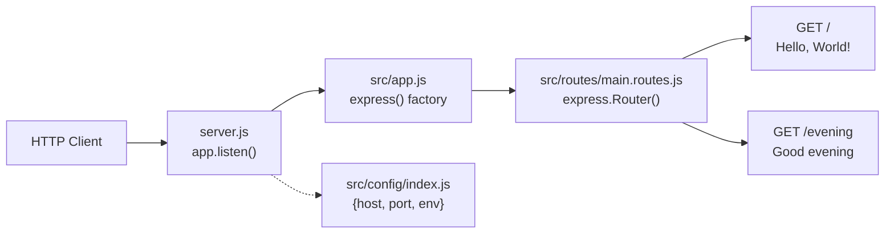

# Technical Specification

# 0. Agent Action Plan

## 0.1 Intent Clarification


### 0.1.1 Core Feature Objective

Based on the prompt, the Blitzy platform understands that the new feature requirement is to transform an existing Node.js tutorial server — originally a single-endpoint application returning "Hello World" — into an Express.js-powered server with an additional greeting endpoint. The two discrete requirements are:

- **REQ-001 — Integrate Express.js into the project:** Replace or augment the existing HTTP server infrastructure with Express.js as the formal web framework. This involves declaring Express.js as a production dependency, creating an Express application instance, and wiring all route handling through Express's `Router` and middleware system.

- **REQ-002 — Add a new endpoint returning "Good evening":** Introduce a second HTTP GET route (`/evening`) that responds with the exact string `"Good evening"` when accessed. This endpoint must coexist alongside the original root (`/`) endpoint without altering its behavior.

**Implicit requirements detected:**

- **Backward compatibility:** The existing `GET /` endpoint returning `"Hello, World!\n"` must continue to function identically after Express.js integration — same response body, same HTTP 200 status, same `text/html; charset=utf-8` content type.
- **HTTP method convention:** Both endpoints follow the GET method pattern established by the original tutorial. No POST, PUT, DELETE, or other HTTP method handlers are required.
- **Response format consistency:** The new `/evening` endpoint must use the same `text/html; charset=utf-8` content type as the root endpoint, using Express's `res.send()` method.
- **Tutorial context preservation:** The project must remain accessible as a learning resource, meaning code should be well-documented, patterns should be approachable, and complexity should remain proportional to the tutorial's educational goals.
- **Test coverage maintenance:** All existing tests must continue to pass, and new tests must be created to cover the `/evening` endpoint's behavior across unit, integration, and lifecycle layers.

### 0.1.2 Special Instructions and Constraints

No explicit special directives were provided by the user beyond the two core requirements. However, the following architectural constraints are inferred from the existing repository conventions:

- **Use the existing modular architecture:** The project follows a Factory pattern (`src/app.js`), Barrel pattern (`src/routes/index.js`), and Twelve-Factor configuration (`src/config/index.js`). The new endpoint must be integrated through these established patterns rather than bypassing them.
- **Maintain CommonJS module system:** All source files use `require` / `module.exports` (CommonJS). The new code must follow this convention — no ES Modules (`import`/`export`).
- **Preserve separation of concerns:** Server binding remains in `server.js`, application configuration in `src/app.js`, routing in `src/routes/`, and configuration in `src/config/`. The new endpoint belongs in the routing layer.
- **Adhere to existing code style:** `'use strict'` directives, JSDoc comments, and inline documentation are present in existing files and should be maintained in all modifications.

User Example: `"add another endpoint that return the reponse of 'Good evening'"`

### 0.1.3 Technical Interpretation

These feature requirements translate to the following technical implementation strategy:

- To **integrate Express.js** (REQ-001), we will declare `express` as a production dependency in `package.json`, create an Express application factory in `src/app.js` that instantiates the app and mounts routers via `app.use()`, define route handlers using `express.Router()` in `src/routes/main.routes.js`, and bind the application to a configurable host/port in `server.js` via `app.listen()`.

- To **add the "Good evening" endpoint** (REQ-002), we will register a new GET route handler in `src/routes/main.routes.js` at the path `/evening` that calls `res.send('Good evening')`, ensuring it is exported through the barrel pattern in `src/routes/index.js` and mounted in `src/app.js`.

- To **maintain backward compatibility**, we will preserve the existing `GET /` handler returning `'Hello, World!\n'` with an identical response contract (HTTP 200, text/html, trailing newline).

- To **ensure quality**, we will create or update unit tests validating the router structure (route count, paths, methods), integration tests asserting HTTP response contracts for both endpoints, and lifecycle tests confirming server startup and shutdown behavior.


## 0.2 Repository Scope Discovery


### 0.2.1 Comprehensive File Analysis

A complete repository inspection was performed across all levels of the file tree. Below is the exhaustive inventory of every file and folder in the project, categorized by modification impact.

**Existing files requiring modification:**

| File Path | Current Purpose | Required Change |
|---|---|---|
| `package.json` | npm manifest with metadata and scripts | Add `express` as a production dependency (`^5.1.0`); add `jest` (`^30.2.0`) and `supertest` (`^7.1.4`) as devDependencies |
| `package-lock.json` | Deterministic dependency resolution lock file | Regenerated automatically after `npm install` to resolve the full Express transitive tree |
| `server.js` | Entry point — binds HTTP server | Refactor to import Express app from `src/app.js` and config from `src/config/`, replace raw `http.createServer` with `app.listen(config.port, config.host, callback)` |
| `README.md` | Project documentation | Update to reflect Express.js integration, document both endpoints (`GET /` and `GET /evening`), update architecture description and dependency table |
| `.gitignore` | Version control exclusion rules | No content changes needed; existing rules already cover `node_modules/`, `coverage/`, `.env`, logs, OS files, and IDE artifacts |

**Existing configuration files (evaluate but no changes required):**

| File Path | Purpose | Change Needed |
|---|---|---|
| `jest.config.js` | Jest test runner configuration | No changes — test patterns (`**/tests/**/*.test.js`), coverage thresholds, and instrumented paths (`server.js`, `src/**/*.js`) already cover all new files |
| `.gitignore` | Git exclusion patterns | No changes — existing patterns cover all generated artifacts |

**Integration point discovery:**

- **API endpoints connecting to the feature:**
  - `src/routes/main.routes.js` — The primary file where both `GET /` and `GET /evening` handlers are registered on an Express Router instance
  - `src/routes/index.js` — Barrel exporter aggregating `mainRoutes` for consumption by `src/app.js`
  - `src/app.js` — Mounts the router at the root path via `app.use('/', mainRoutes)`

- **Server binding affected:**
  - `server.js` — Imports `src/app` and `src/config`, calls `app.listen(config.port, config.host, callback)` to start the HTTP server

- **Configuration module consumed:**
  - `src/config/index.js` — Exports `{ host, port, env }` with environment variable overrides and safe defaults

- **Test suites requiring updates:**
  - `tests/unit/routes.test.js` — Must validate two route layers (instead of one), verify `/evening` path registration, and check GET method assignment
  - `tests/integration/endpoints.test.js` — Must add test cases for `GET /evening` returning `"Good evening"` with HTTP 200 and correct headers
  - `tests/lifecycle/server.test.js` — Verifies server startup wiring; no content changes needed since it mocks the app module
  - `tests/unit/config.test.js` — Validates configuration defaults and parsing; no content changes needed

### 0.2.2 Web Search Research Conducted

No external web searches were required for this feature addition. The implementation relies entirely on:

- Express.js 5.1.0 APIs (`express()`, `express.Router()`, `app.use()`, `app.listen()`, `res.send()`) which are well-documented and already in use in the repository
- Jest 30.2.0 testing patterns already established in the existing test suites
- Supertest 7.1.4 HTTP assertion patterns already demonstrated in `tests/integration/endpoints.test.js`

All necessary knowledge is contained within the existing codebase conventions and the Express.js, Jest, and Supertest documentation that is standard for these package versions.

### 0.2.3 New File Requirements

**New source files to create:**

| File Path | Purpose |
|---|---|
| `src/app.js` | Express application factory — instantiates `express()`, mounts `mainRoutes` at `/`, and exports the configured app without binding |
| `src/config/index.js` | Configuration management — exports `{ host, port, env }` from environment variables with defaults (`127.0.0.1`, `3000`, `development`) |
| `src/config/README.md` | Documentation for the configuration module's contract and usage |
| `src/routes/index.js` | Barrel exporter — aggregates `mainRoutes` for centralized imports |
| `src/routes/main.routes.js` | Route handlers — implements `GET /` returning `'Hello, World!\n'` and `GET /evening` returning `'Good evening'` |
| `src/routes/README.md` | Documentation for the routing module's structure and extension workflow |
| `src/README.md` | Documentation for the `src/` directory architecture |

**New test files to create:**

| File Path | Purpose |
|---|---|
| `tests/unit/config.test.js` | Unit tests for configuration defaults, overrides, edge cases, and type guarantees |
| `tests/unit/routes.test.js` | Unit tests for router export structure, route count, paths, methods, and ordering |
| `tests/integration/endpoints.test.js` | Integration tests for HTTP response contracts on `GET /`, `GET /evening`, 404 handling, and edge cases |
| `tests/lifecycle/server.test.js` | Lifecycle tests for server binding, startup logging, custom config, graceful shutdown, and error handling |
| `tests/README.md` | Documentation for test organization, execution commands, and coverage targets |

**New configuration files (none required):**

The existing `jest.config.js` and `package.json` scripts already provide the necessary test and build configuration. No additional configuration files are needed.


## 0.3 Dependency Inventory


### 0.3.1 Private and Public Packages

All packages are sourced from the public npm registry. No private packages are used.

| Registry | Package | Declared Version | Resolved Version | Type | Purpose |
|---|---|---|---|---|---|
| npm public | `express` | `^5.1.0` | `5.1.0` | Production | Core HTTP framework — routing, middleware, and response handling via `express()`, `express.Router()`, `app.use()`, `res.send()` |
| npm public | `jest` | `^30.2.0` | `30.2.0` | Development | Test execution framework — `describe`, `test`, `expect`, `jest.fn()`, `jest.doMock()`, `jest.resetModules()`, `jest.spyOn()` |
| npm public | `supertest` | `^7.1.4` | `7.1.4` | Development | HTTP assertion library — `request(app).get(path).expect(status)` for in-process endpoint testing without a live server |

**Version verification:** All versions confirmed from `package.json` (declared) and `package-lock.json` (resolved) at the project root. The `npm ls` output confirms exact resolved versions: `express@5.1.0`, `jest@30.2.0`, `supertest@7.1.4`.

**Transitive dependency profile:**

| Dependency Source | Direct Dependencies | Approximate Transitive Total |
|---|---|---|
| `express` 5.1.0 | 27 | ~60 packages |
| `jest` 30.2.0 | 4 | ~320 packages |
| `supertest` 7.1.4 | 2 | ~25 packages |
| **Total resolved** | — | **405 packages** |

### 0.3.2 Dependency Updates

**Package manifest changes (`package.json`):**

The `dependencies` and `devDependencies` blocks in `package.json` require updates to declare the three packages:

```json
"dependencies": { "express": "^5.1.0" },
"devDependencies": { "jest": "^30.2.0", "supertest": "^7.1.4" }
```

**Import updates across source files:**

| File Pattern | Import Statement | Purpose |
|---|---|---|
| `src/app.js` | `const express = require('express')` | Import Express framework |
| `src/app.js` | `const { mainRoutes } = require('./routes')` | Import route barrel |
| `src/routes/main.routes.js` | `const express = require('express')` | Import Express for `Router()` |
| `src/routes/index.js` | `const mainRoutes = require('./main.routes')` | Aggregate route module |
| `server.js` | `const app = require('./src/app')` | Import configured Express app |
| `server.js` | `const config = require('./src/config')` | Import configuration |

**Import updates across test files:**

| File Pattern | Import Statement | Purpose |
|---|---|---|
| `tests/unit/routes.test.js` | `const mainRoutes = require('../../src/routes/main.routes')` | Import router for structural inspection |
| `tests/unit/config.test.js` | `require('../../src/config')` via helper | Import config with module reset |
| `tests/integration/endpoints.test.js` | `const request = require('supertest')` | Import Supertest for HTTP assertions |
| `tests/integration/endpoints.test.js` | `const app = require('../../src/app')` | Import Express app for Supertest |
| `tests/lifecycle/server.test.js` | `require('../../server')` via `jest.doMock` | Import server entry point with mocked deps |

**External reference updates:**

| File | Reference Type | Update Required |
|---|---|---|
| `README.md` | Dependency documentation | Update runtime dependencies table to list Express ^5.1.0; add test dependencies table with Jest ^30.2.0 and Supertest ^7.1.4 |
| `package-lock.json` | Resolved dependency graph | Regenerated automatically by `npm install` to include all transitive dependencies |

**Build and test commands (no changes needed):**

| Command | Purpose | Defined In |
|---|---|---|
| `npm install` / `npm ci` | Install all dependencies from manifest/lock | `package.json` |
| `npm start` | Run `node server.js` | `package.json` scripts.start |
| `npm test` | Run `jest` | `package.json` scripts.test |
| `npm run test:coverage` | Run `jest --coverage` | `package.json` scripts.test:coverage |
| `npm run test:ci` | Run `jest --ci --coverage --reporters=default` | `package.json` scripts.test:ci |


## 0.4 Integration Analysis


### 0.4.1 Existing Code Touchpoints

The Express.js integration and new `/evening` endpoint require coordinated modifications across the application's four architectural layers: Entry, Application, Routing, and Configuration. The following documents every direct modification, dependency injection, and wiring point.

**Direct modifications required:**

| File | Modification | Details |
|---|---|---|
| `server.js` | Refactor entry point to use Express app | Replace raw `http.createServer` with imports of `src/app` (Express instance) and `src/config` (host/port/env). Call `app.listen(config.port, config.host, callback)` with startup logging in the callback. |
| `src/app.js` | Create Express application factory | Instantiate `express()`, import `{ mainRoutes }` from `./routes`, mount via `app.use('/', mainRoutes)`, and export the configured app. No `app.listen()` call — binding stays in `server.js`. |
| `src/routes/main.routes.js` | Define both GET route handlers | Create `express.Router()`, register `router.get('/', handler)` returning `'Hello, World!\n'` and `router.get('/evening', handler)` returning `'Good evening'`. Export the router. |
| `src/routes/index.js` | Create barrel exporter | Require `./main.routes` and export as `{ mainRoutes }` for clean, centralized imports. |
| `src/config/index.js` | Create configuration module | Export `{ host, port, env }` derived from `process.env.HOST`, `process.env.PORT` (parsed with `parseInt` radix-10), and `process.env.NODE_ENV` with defaults `'127.0.0.1'`, `3000`, `'development'`. |
| `package.json` | Add Express dependency | Add `"express": "^5.1.0"` to `dependencies` block. |

**Dependency injection points:**

| Injection Site | What Is Injected | Source Module |
|---|---|---|
| `server.js` line 30 | Express app instance (`app`) | `src/app.js` |
| `server.js` line 37 | Config object (`{ host, port, env }`) | `src/config/index.js` |
| `src/app.js` line 15 | Route barrel (`{ mainRoutes }`) | `src/routes/index.js` |
| `src/routes/index.js` line 15 | Router instance (`mainRoutes`) | `src/routes/main.routes.js` |

**Request flow through integration points:**


```mermaid
graph LR
    Client["HTTP Client"] --> ServerJS["server.js<br/>app.listen()"]
    ServerJS --> AppJS["src/app.js<br/>express() factory"]
    AppJS --> Router["src/routes/main.routes.js<br/>express.Router()"]
    Router --> RootHandler["GET /<br/>Hello, World!"]
    Router --> EveningHandler["GET /evening<br/>Good evening"]
    ServerJS -.-> Config["src/config/index.js<br/>{host, port, env}"]
```

**API contracts for both endpoints:**

| Endpoint | Method | Response Body | Status | Content-Type | Trailing Newline |
|---|---|---|---|---|---|
| `/` | GET | `Hello, World!\n` | 200 | `text/html; charset=utf-8` | Yes |
| `/evening` | GET | `Good evening` | 200 | `text/html; charset=utf-8` | No |
| Any other path | Any | Express default 404 body | 404 | Varies | N/A |

**Test integration touchpoints:**

| Test File | Integration With | Mechanism |
|---|---|---|
| `tests/unit/routes.test.js` | `src/routes/main.routes.js` | Direct `require()` and `router.stack` inspection |
| `tests/unit/config.test.js` | `src/config/index.js` | `require()` with `jest.resetModules()` for fresh evaluation |
| `tests/integration/endpoints.test.js` | `src/app.js` | Supertest `request(app)` for in-process HTTP assertions |
| `tests/lifecycle/server.test.js` | `server.js` | `jest.doMock()` to stub `src/app` and `src/config`, then `require('../../server')` |


## 0.5 Technical Implementation


### 0.5.1 File-by-File Execution Plan

Every file listed below MUST be created or modified. Files are grouped by functional role.

**Group 1 — Core Feature Files (Express Integration + Evening Endpoint):**

| Action | File Path | Purpose |
|---|---|---|
| MODIFY | `package.json` | Add `express` ^5.1.0 as a production dependency; add `jest` ^30.2.0 and `supertest` ^7.1.4 as dev dependencies; define `scripts.start`, `scripts.test`, `scripts.test:watch`, `scripts.test:coverage`, `scripts.test:ci` |
| CREATE | `src/app.js` | Express application factory — `const app = express(); app.use('/', mainRoutes); module.exports = app;` |
| CREATE | `src/routes/main.routes.js` | Route handlers — register `router.get('/')` and `router.get('/evening')` on `express.Router()` |
| CREATE | `src/routes/index.js` | Barrel exporter — `module.exports = { mainRoutes }` |
| MODIFY | `server.js` | Refactor to import `src/app` and `src/config`, call `app.listen(config.port, config.host, callback)` |

**Group 2 — Supporting Infrastructure:**

| Action | File Path | Purpose |
|---|---|---|
| CREATE | `src/config/index.js` | Twelve-Factor configuration — export `{ host, port, env }` from environment variables with defaults |
| CREATE | `src/config/README.md` | Document configuration module contract, default values, and override examples |
| CREATE | `src/routes/README.md` | Document routing module structure, endpoint contracts, and extension instructions |
| CREATE | `src/README.md` | Document `src/` directory architecture and separation of concerns |
| RETAIN | `jest.config.js` | No changes — existing config already covers all new source paths and test patterns |
| RETAIN | `.gitignore` | No changes — existing patterns cover all generated artifacts |

**Group 3 — Tests and Quality:**

| Action | File Path | Purpose |
|---|---|---|
| CREATE | `tests/unit/config.test.js` | Unit tests: configuration defaults, custom values, PORT parsing edge cases, type guarantees, export structure |
| CREATE | `tests/unit/routes.test.js` | Unit tests: router export validation, two route layers, paths `/` and `/evening`, GET methods, handler functions, ordering |
| CREATE | `tests/integration/endpoints.test.js` | Integration tests: HTTP 200 contracts for both endpoints, 404 handling, unsupported methods, query string resilience, path normalization |
| CREATE | `tests/lifecycle/server.test.js` | Lifecycle tests: bind arguments, startup log format, custom config propagation, graceful shutdown, EADDRINUSE error handling |
| CREATE | `tests/README.md` | Document test organization, npm scripts, and coverage thresholds |

**Group 4 — Documentation:**

| Action | File Path | Purpose |
|---|---|---|
| MODIFY | `README.md` | Update project description, add Express.js prerequisite, document both endpoints with curl examples, update architecture section, add dependency and test tables |

### 0.5.2 Implementation Approach per File

**Step 1 — Establish the Express foundation:**

Create `src/config/index.js` with synchronous environment variable parsing. Create `src/routes/main.routes.js` with both route handlers on a single `express.Router()` instance. Create `src/routes/index.js` as the barrel exporter. Create `src/app.js` as the factory that wires Express + routes.

Key code pattern in `src/routes/main.routes.js`:
```js
const router = express.Router();
router.get('/', (req, res) => { res.send('Hello, World!\n'); });
router.get('/evening', (req, res) => { res.send('Good evening'); });
```

**Step 2 — Integrate with the entry point:**

Modify `server.js` to import the pre-configured Express app and config module, then bind via `app.listen()`. The startup callback logs the server URL.

Key code pattern in `server.js`:
```js
const app = require('./src/app');
const config = require('./src/config');
app.listen(config.port, config.host, () => { /* log */ });
```

**Step 3 — Implement comprehensive tests:**

Create unit tests that inspect `router.stack` layers and config module exports without issuing HTTP requests. Create integration tests using Supertest to assert exact response bodies, status codes, and content-type headers. Create lifecycle tests with Jest mocks to validate server binding, logging, shutdown, and error handling.

**Step 4 — Update documentation:**

Update `README.md` with both endpoint specifications, architecture diagrams, environment variable tables, and test execution instructions. Create README files in `src/`, `src/config/`, `src/routes/`, and `tests/`.

### 0.5.3 User Interface Design

Not applicable. This project is a backend-only Node.js HTTP server tutorial. No user interface components, Figma screens, or frontend assets are involved. The API surface consists exclusively of two GET endpoints accessed via HTTP clients such as `curl` or web browsers.


## 0.6 Scope Boundaries


### 0.6.1 Exhaustively In Scope

**Core source files:**

| File Pattern | Specific Files | Purpose |
|---|---|---|
| `server.js` | `server.js` | Entry point — Express app binding and startup logging |
| `src/app.js` | `src/app.js` | Express application factory with route mounting |
| `src/routes/**/*.js` | `src/routes/index.js`, `src/routes/main.routes.js` | Route barrel exporter and GET handler definitions |
| `src/config/**/*.js` | `src/config/index.js` | Environment-driven configuration module |

**Test files:**

| File Pattern | Specific Files | Purpose |
|---|---|---|
| `tests/unit/**/*.test.js` | `tests/unit/config.test.js`, `tests/unit/routes.test.js` | Unit tests for config parsing and router structure |
| `tests/integration/**/*.test.js` | `tests/integration/endpoints.test.js` | Integration tests for HTTP endpoint contracts |
| `tests/lifecycle/**/*.test.js` | `tests/lifecycle/server.test.js` | Lifecycle tests for server binding, logging, shutdown, and errors |

**Configuration files:**

| File Pattern | Specific Files | Purpose |
|---|---|---|
| `package.json` | `package.json` | Dependency declarations, npm scripts, project metadata |
| `package-lock.json` | `package-lock.json` | Deterministic dependency resolution lock file |
| `jest.config.js` | `jest.config.js` | Test runner configuration, coverage thresholds, test discovery |
| `.gitignore` | `.gitignore` | Version control exclusion patterns |

**Documentation files:**

| File Pattern | Specific Files | Purpose |
|---|---|---|
| `README.md` | `README.md` | Project-level documentation, API reference, architecture description |
| `src/**/*.md` | `src/README.md`, `src/config/README.md`, `src/routes/README.md` | Module-level architecture and usage documentation |
| `tests/**/*.md` | `tests/README.md` | Test suite organization and execution documentation |

**Environment variables in scope:**

| Variable | Default | Override Mechanism |
|---|---|---|
| `HOST` | `'127.0.0.1'` | `process.env.HOST` |
| `PORT` | `3000` | `process.env.PORT` (parsed with `parseInt(value, 10)`) |
| `NODE_ENV` | `'development'` | `process.env.NODE_ENV` |

### 0.6.2 Explicitly Out of Scope

The following items are intentionally excluded from this feature addition:

| Category | Exclusion | Rationale |
|---|---|---|
| **Security** | HTTPS/TLS configuration, helmet middleware, rate limiting, CORS | Tutorial scope — security hardening is beyond educational objectives |
| **Database** | Any database integration, ORM, migrations | No data persistence requirements exist in the user's request |
| **Authentication** | JWT, sessions, API keys, OAuth | No access control requirements specified |
| **Middleware** | Body parsing, request logging, compression, error middleware | Only `res.send()` text responses are required; no request body processing |
| **CI/CD** | GitHub Actions, GitLab CI, Docker, containerization | No deployment pipeline requirements specified |
| **Frontend** | HTML templates, static file serving, view engines | Backend-only API tutorial; no UI components |
| **Monitoring** | Health check endpoints, metrics, structured logging | Beyond tutorial scope |
| **Performance** | Load testing, caching, clustering, process management (PM2) | Not required for a tutorial-grade server |
| **Additional endpoints** | Any endpoints beyond `GET /` and `GET /evening` | Only two endpoints specified in requirements |
| **Refactoring** | Code changes unrelated to Express integration or the `/evening` endpoint | Scope limited to the two stated requirements |
| **ES Modules** | Migration from CommonJS to `import`/`export` syntax | Project convention is CommonJS; migration not requested |


## 0.7 Rules for Feature Addition


### 0.7.1 Repository Conventions

The following rules are derived from the existing codebase patterns observed across all source files. All new and modified code must adhere to these conventions:

- **CommonJS modules:** Use `require()` and `module.exports` exclusively. No ES Module `import`/`export` syntax.
- **Strict mode:** Include `'use strict';` directive at the top of entry-point files (e.g., `server.js`, test files).
- **JSDoc documentation:** Every exported function, module, and significant variable must include JSDoc comments with `@module`, `@param`, `@returns`, `@type`, and `@typedef` tags as appropriate.
- **Inline documentation:** Include block comments explaining design decisions, architectural rationale, and backward-compatibility notes within source files.
- **File headers:** Each file should begin with a `@fileoverview` JSDoc block describing the module's purpose.

### 0.7.2 Architectural Requirements

- **Factory pattern:** `src/app.js` must create and export the Express app without calling `app.listen()`. Server binding is the sole responsibility of `server.js`.
- **Barrel pattern:** `src/routes/index.js` must aggregate all route modules and export them as named properties. Consumers (e.g., `src/app.js`) destructure from the barrel rather than importing individual route files.
- **Twelve-Factor configuration:** All environment-specific values must be sourced from `process.env` with deterministic fallback defaults. Configuration must be synchronous and cached by Node's module system.
- **Separation of concerns:** Routing logic stays in `src/routes/`, configuration in `src/config/`, application wiring in `src/app.js`, and server binding in `server.js`. No layer should assume responsibilities of another.

### 0.7.3 Express-Specific Directives

- **Router usage:** All route handlers must be registered on an `express.Router()` instance, not directly on the Express app.
- **Response method:** Use `res.send()` for text responses. This ensures automatic Content-Type (`text/html; charset=utf-8`) and Content-Length headers.
- **Response contracts:** `GET /` must return exactly `'Hello, World!\n'` (with trailing newline). `GET /evening` must return exactly `'Good evening'` (no trailing newline). Any deviation breaks integration tests.
- **No middleware side effects:** Route modules must not register global middleware, perform async initialization, or trigger network calls during `require()`.

### 0.7.4 Testing Requirements

- **Coverage thresholds:** Minimum 75% branches, 90% functions, 80% lines, and 80% statements as enforced by `jest.config.js`.
- **Test organization:** Unit tests in `tests/unit/`, integration tests in `tests/integration/`, lifecycle tests in `tests/lifecycle/`.
- **Module isolation:** Unit tests must use `jest.resetModules()` when testing modules that read `process.env` or rely on cached state.
- **HTTP assertions:** Integration tests must use Supertest (`request(app)`) for in-process HTTP assertions — never start a live server in tests.
- **Mock discipline:** Lifecycle tests must mock `src/app` and `src/config` via `jest.doMock()` to isolate `server.js` wiring logic from actual application behavior.

### 0.7.5 Compatibility Constraints

- **Node.js version:** Minimum Node.js 18.x; recommended 20.19.x (LTS) as documented in `README.md`.
- **npm version:** Minimum npm 8.x; recommended 10.8.x.
- **Express version:** Must use Express 5.1.0 (resolved from `^5.1.0` semver range).
- **Backward compatibility:** The `GET /` endpoint must remain functionally identical to the original tutorial server — same response body, same status code, same content type.


## 0.8 References


### 0.8.1 Repository Files and Folders Searched

The following files and folders were comprehensively inspected to derive all conclusions in this Agent Action Plan:

**Root-level files inspected:**

| File Path | Contents Summary |
|---|---|
| `package.json` | npm manifest — declares `express` ^5.1.0, `jest` ^30.2.0, `supertest` ^7.1.4; defines `start`, `test`, `test:watch`, `test:coverage`, `test:ci` scripts |
| `package-lock.json` | Lock file with 405 resolved packages (lockfileVersion 3); confirms exact resolved versions |
| `server.js` | Entry point — imports `src/app` and `src/config`, binds via `app.listen(config.port, config.host, callback)` with startup log |
| `README.md` | Project documentation — prerequisites (Node.js 18.x/20.19.x, npm 8.x/10.8.x), both endpoints documented, architecture and testing sections |
| `jest.config.js` | Jest config — test pattern `**/tests/**/*.test.js`, coverage from `server.js` and `src/**/*.js`, thresholds (75% branches, 90% functions, 80% lines/statements) |
| `.gitignore` | Exclusions for `node_modules/`, `coverage/`, `.env*`, `logs/`, OS files, and IDE artifacts |

**Source directory files inspected:**

| File Path | Contents Summary |
|---|---|
| `src/app.js` | Express factory — `express()` + `app.use('/', mainRoutes)` + `module.exports = app` |
| `src/README.md` | Documents `src/` architecture, factory pattern, and separation of concerns |
| `src/config/index.js` | Exports `{ host, port, env }` from `process.env` with defaults `'127.0.0.1'`, `3000`, `'development'` |
| `src/config/README.md` | Documents Twelve-Factor config contract, override examples, and usage patterns |
| `src/routes/index.js` | Barrel exporter — `module.exports = { mainRoutes }` |
| `src/routes/main.routes.js` | Two GET handlers on `express.Router()`: `/` returns `'Hello, World!\n'`, `/evening` returns `'Good evening'` |
| `src/routes/README.md` | Documents routing structure, endpoint contracts, and extension workflow |

**Test directory files inspected:**

| File Path | Contents Summary |
|---|---|
| `tests/README.md` | Documents test structure (unit/integration/lifecycle), npm scripts, and coverage gates |
| `tests/unit/config.test.js` | 14 tests — config defaults, custom values, PORT edge cases, type checking, export structure |
| `tests/unit/routes.test.js` | 7 tests — router export, route count (2), paths (`/`, `/evening`), GET methods, handlers, ordering |
| `tests/integration/endpoints.test.js` | 15 tests — HTTP 200 contracts for both endpoints, 404 handling, unsupported methods, query strings, path normalization |
| `tests/lifecycle/server.test.js` | 5 tests — bind arguments, startup log, custom config, graceful shutdown, EADDRINUSE error handling |

**Folders explored:**

| Folder Path | Depth | Children Count |
|---|---|---|
| `` (root) | 0 | 9 (6 files + 3 folders) |
| `src/` | 1 | 4 (2 files + 2 folders) |
| `src/config/` | 2 | 2 files |
| `src/routes/` | 2 | 3 files |
| `tests/` | 1 | 4 (1 file + 3 folders) |
| `tests/unit/` | 2 | 2 files |
| `tests/integration/` | 2 | 1 file |
| `tests/lifecycle/` | 2 | 1 file |
| `blitzy/` | 1 | 1 folder |
| `blitzy/documentation/` | 2 | 2 files |

**Tech spec sections reviewed:**

| Section Heading | Relevant Information Extracted |
|---|---|
| 1.1 Executive Summary | Project context, requirements REQ-001/REQ-002, stakeholders |
| 2.1 Feature Catalog | Feature inventory (F-001 through F-008) with dependencies and evidence |
| 3.1 Programming Languages | JavaScript (CommonJS), Node.js runtime |
| 3.3 Open Source Dependencies | Dependency versions, package management, transitive profile |

### 0.8.2 Attachments and External Assets

No attachments were provided for this project. No Figma screens, design files, or external assets are referenced.

| Asset Type | Provided | Details |
|---|---|---|
| Figma URLs | None | Not applicable — backend-only project |
| File attachments | None | No files in `/tmp/environments_files/` |
| Environment variables | None | No user-specified environment variables |
| Secrets | None | No user-specified secrets |
| Setup instructions | None | No custom setup instructions provided |

### 0.8.3 Environment Verification

| Attribute | Value |
|---|---|
| Node.js version | v20.19.6 (installed via nvm, matching README recommended 20.19.x LTS) |
| npm version | 10.8.2 (matches README recommended 10.8.x) |
| Express resolved | 5.1.0 |
| Jest resolved | 30.2.0 |
| Supertest resolved | 7.1.4 |
| Test suite result | 41 tests passed, 4 suites, 0 failures |
| Dependencies installed via | `npm ci` (deterministic from `package-lock.json`) |


